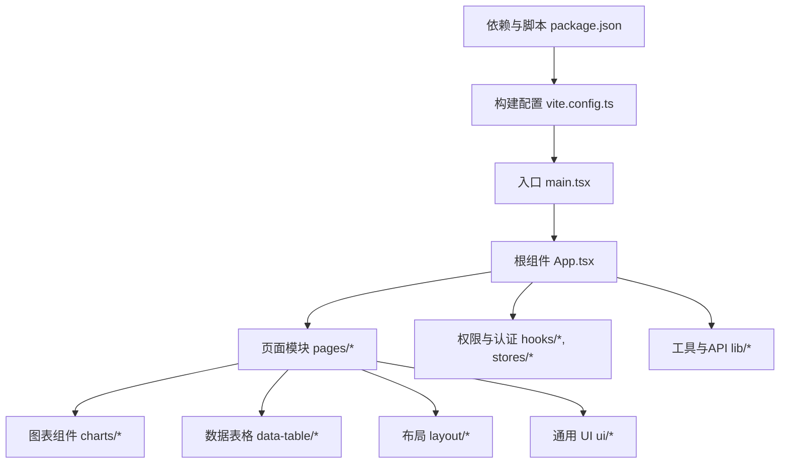
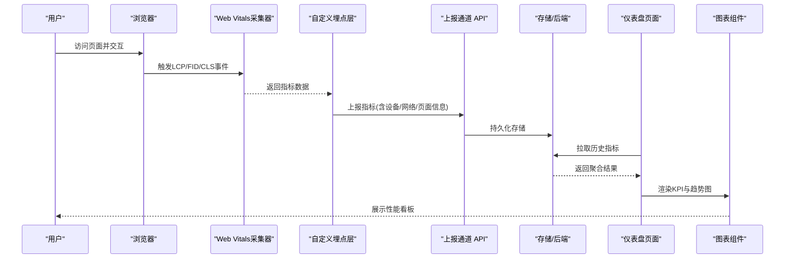
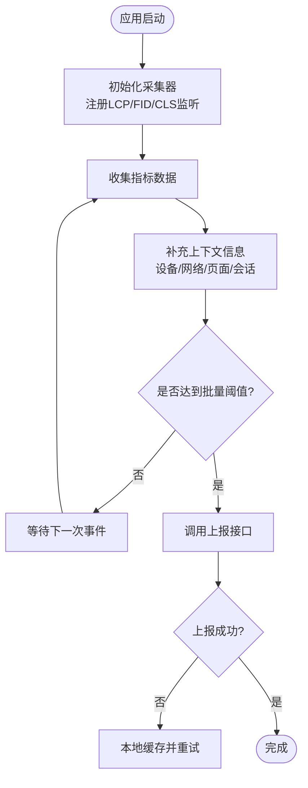
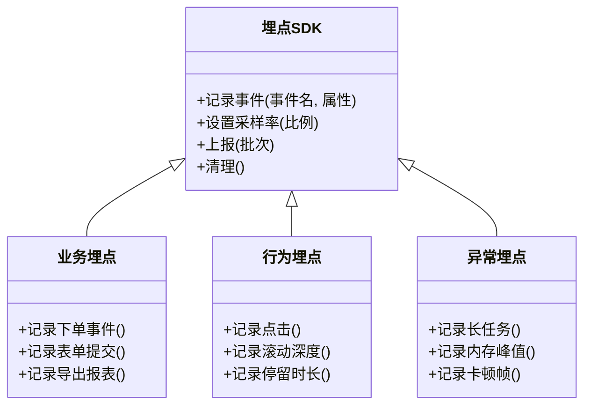
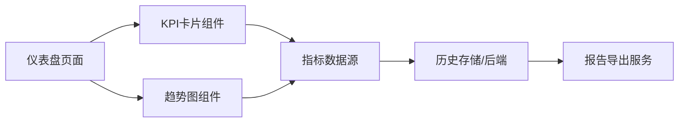
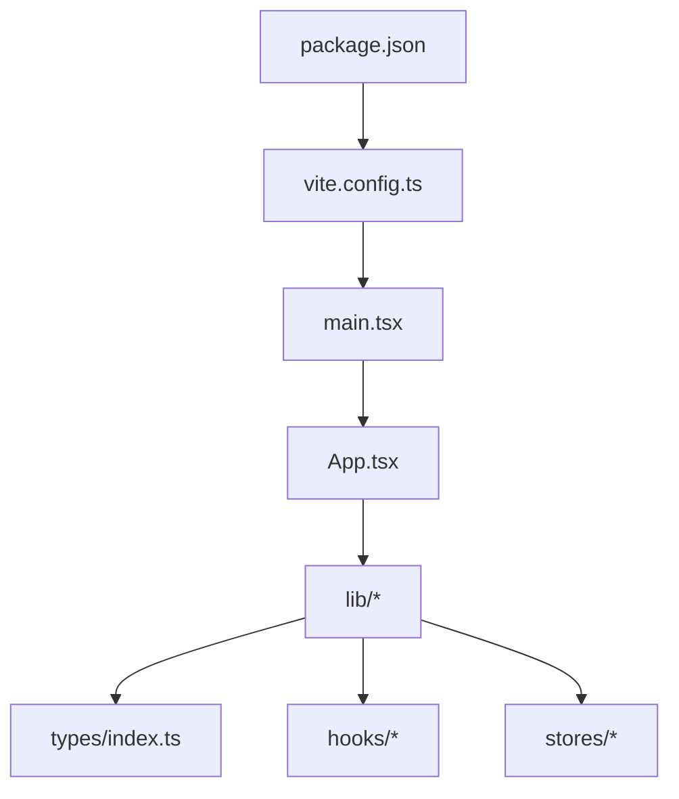

# 性能监控

<cite>
**本文引用的文件**   
- [web/package.json](file://web/package.json)
- [web/vite.config.ts](file://web/vite.config.ts)
- [web/src/main.tsx](file://web/src/main.tsx)
- [web/src/App.tsx](file://web/src/App.tsx)
- [web/src/pages/dashboard/index.tsx](file://web/src/pages/dashboard/index.tsx)
- [web/src/components/charts/kpi-card.tsx](file://web/src/components/charts/kpi-card.tsx)
- [web/src/components/charts/trend-chart.tsx](file://web/src/components/charts/trend-chart.tsx)
- [web/src/lib/api.ts](file://web/src/lib/api.ts)
- [web/src/lib/utils.ts](file://web/src/lib/utils.ts)
- [web/src/types/index.ts](file://web/src/types/index.ts)
- [web/src/hooks/useAuth.ts](file://web/src/hooks/useAuth.ts)
- [web/src/hooks/usePermission.ts](file://web/src/hooks/usePermission.ts)
- [web/src/stores/authStore.ts](file://web/src/stores/authStore.ts)
- [web/src/test/setup.ts](file://web/src/test/setup.ts)
- [web/README.md](file://web/README.md)
- [docs/references/performance.md](file://docs/references/performance.md)
</cite>

## 目录
1. [简介](#简介)
2. [项目结构](#项目结构)
3. [核心组件](#核心组件)
4. [架构总览](#架构总览)
5. [详细组件分析](#详细组件分析)
6. [依赖分析](#依赖分析)
7. [性能考虑](#性能考虑)
8. [故障排查指南](#故障排查指南)
9. [结论](#结论)
10. [附录](#附录)

## 简介
本指南面向pj3项目的开发与运维团队，提供一套完整的性能监控与分析实践方案。内容覆盖：
- Web Vitals指标（LCP、FID、CLS）的采集与上报
- Chrome DevTools（Performance、Memory、Network）的使用技巧与瓶颈定位
- Lighthouse自动化测试在CI/CD中的集成与回归检测
- 自定义埋点（业务指标、用户行为、异常告警）的实现方法
- 性能数据的可视化与报告生成

本指南既适合初学者快速上手，也可为资深工程师提供深入优化建议。

## 项目结构
前端工程位于 web 目录，采用Vite + React技术栈。关键目录与职责如下：
- src/main.tsx：应用入口，负责初始化全局配置与路由挂载
- src/App.tsx：顶层组件，承载布局与权限控制
- src/pages/*：页面级模块，如仪表盘、数据、交易等
- src/components/*：可复用UI与图表组件
- src/lib/*：通用工具与API封装
- src/hooks/*：业务与状态相关Hook
- src/stores/*：轻量状态管理
- src/test/*：测试环境初始化
- vite.config.ts：构建与开发服务器配置
- package.json：依赖与脚本定义

图示来源
- [web/src/main.tsx](file://web/src/main.tsx)
- [web/src/App.tsx](file://web/src/App.tsx)
- [web/vite.config.ts](file://web/vite.config.ts)
- [web/package.json](file://web/package.json)

章节来源
- [web/src/main.tsx](file://web/src/main.tsx)
- [web/src/App.tsx](file://web/src/App.tsx)
- [web/vite.config.ts](file://web/vite.config.ts)
- [web/package.json](file://web/package.json)

## 核心组件
围绕性能监控，本项目将重点使用以下位置进行扩展与集成：
- 应用启动阶段：在入口或根组件中初始化Web Vitals采集器与上报通道
- 页面级埋点：在关键页面生命周期中记录交互与渲染事件
- 图表展示：在仪表盘页面集成趋势图与KPI卡片，呈现LCP/FID/CLS等指标
- 工具库：封装上报、采样、聚合与错误处理逻辑
- 类型定义：统一指标数据结构与上报协议

章节来源
- [web/src/main.tsx](file://web/src/main.tsx)
- [web/src/App.tsx](file://web/src/App.tsx)
- [web/src/pages/dashboard/index.tsx](file://web/src/pages/dashboard/index.tsx)
- [web/src/components/charts/kpi-card.tsx](file://web/src/components/charts/kpi-card.tsx)
- [web/src/components/charts/trend-chart.tsx](file://web/src/components/charts/trend-chart.tsx)
- [web/src/lib/api.ts](file://web/src/lib/api.ts)
- [web/src/lib/utils.ts](file://web/src/lib/utils.ts)
- [web/src/types/index.ts](file://web/src/types/index.ts)

## 架构总览
下图展示了从浏览器端采集到可视化展示的端到端流程，涵盖Web Vitals、自定义埋点、上报通道与可视化组件。

图示来源
- [web/src/main.tsx](file://web/src/main.tsx)
- [web/src/App.tsx](file://web/src/App.tsx)
- [web/src/pages/dashboard/index.tsx](file://web/src/pages/dashboard/index.tsx)
- [web/src/components/charts/kpi-card.tsx](file://web/src/components/charts/kpi-card.tsx)
- [web/src/components/charts/trend-chart.tsx](file://web/src/components/charts/trend-chart.tsx)
- [web/src/lib/api.ts](file://web/src/lib/api.ts)
- [web/src/lib/utils.ts](file://web/src/lib/utils.ts)
- [web/src/types/index.ts](file://web/src/types/index.ts)

## 详细组件分析

### Web Vitals指标采集与上报
- 目标指标
  - LCP（最大内容绘制）：衡量首屏加载体验
  - FID（首次输入延迟）：衡量交互响应性
  - CLS（累积布局偏移）：衡量视觉稳定性
- 采集时机
  - 在应用启动时注册监听，避免影响首屏渲染
  - 对关键页面与长列表场景做专项采集
- 上报策略
  - 批量上报与去抖合并，降低网络开销
  - 携带设备、网络、页面路径、会话标识等上下文
- 容错与降级
  - 上报失败重试与本地缓存
  - 采样率控制，避免高流量下过载

图示来源
- [web/src/main.tsx](file://web/src/main.tsx)
- [web/src/lib/api.ts](file://web/src/lib/api.ts)
- [web/src/lib/utils.ts](file://web/src/lib/utils.ts)
- [web/src/types/index.ts](file://web/src/types/index.ts)

章节来源
- [web/src/main.tsx](file://web/src/main.tsx)
- [web/src/lib/api.ts](file://web/src/lib/api.ts)
- [web/src/lib/utils.ts](file://web/src/lib/utils.ts)
- [web/src/types/index.ts](file://web/src/types/index.ts)

### 自定义埋点与业务指标
- 埋点范围
  - 业务操作：下单、提交表单、导出报表等
  - 用户行为：点击、滚动、停留时长、错误弹窗
  - 异常性能：长任务、内存峰值、卡顿帧
- 实现要点
  - 在关键Hook与组件生命周期中插入埋点
  - 统一埋点SDK，支持标签、维度与采样
  - 与权限与认证信息关联，便于分角色分析
- 上报与聚合
  - 按业务域分组，结合时间窗口聚合
  - 与Web Vitals指标关联，形成用户体验画像

图示来源
- [web/src/hooks/useAuth.ts](file://web/src/hooks/useAuth.ts)
- [web/src/hooks/usePermission.ts](file://web/src/hooks/usePermission.ts)
- [web/src/stores/authStore.ts](file://web/src/stores/authStore.ts)
- [web/src/lib/api.ts](file://web/src/lib/api.ts)
- [web/src/lib/utils.ts](file://web/src/lib/utils.ts)
- [web/src/types/index.ts](file://web/src/types/index.ts)

章节来源
- [web/src/hooks/useAuth.ts](file://web/src/hooks/useAuth.ts)
- [web/src/hooks/usePermission.ts](file://web/src/hooks/usePermission.ts)
- [web/src/stores/authStore.ts](file://web/src/stores/authStore.ts)
- [web/src/lib/api.ts](file://web/src/lib/api.ts)
- [web/src/lib/utils.ts](file://web/src/lib/utils.ts)
- [web/src/types/index.ts](file://web/src/types/index.ts)

### 可视化与报告
- 仪表盘页面
  - 展示LCP/FID/CLS的实时与历史趋势
  - 提供筛选条件（设备、网络、页面、时间段）
- 图表组件
  - KPI卡片：关键指标概览与阈值告警
  - 趋势图：多指标对比与异常标注
- 报告生成
  - 定时导出CSV/PDF报告
  - 自动邮件/IM通知

图示来源
- [web/src/pages/dashboard/index.tsx](file://web/src/pages/dashboard/index.tsx)
- [web/src/components/charts/kpi-card.tsx](file://web/src/components/charts/kpi-card.tsx)
- [web/src/components/charts/trend-chart.tsx](file://web/src/components/charts/trend-chart.tsx)
- [web/src/lib/api.ts](file://web/src/lib/api.ts)

章节来源
- [web/src/pages/dashboard/index.tsx](file://web/src/pages/dashboard/index.tsx)
- [web/src/components/charts/kpi-card.tsx](file://web/src/components/charts/kpi-card.tsx)
- [web/src/components/charts/trend-chart.tsx](file://web/src/components/charts/trend-chart.tsx)
- [web/src/lib/api.ts](file://web/src/lib/api.ts)

### Chrome DevTools使用技巧
- Performance面板
  - 录制关键用户旅程，识别长任务与重排重绘热点
  - 关注主线程阻塞、JS执行时间与合成层
- Memory面板
  - 快照对比，定位内存泄漏与未释放引用
  - 观察堆增长曲线与垃圾回收频率
- Network面板
  - 分析资源加载顺序与体积，优化缓存与压缩
  - 检查请求失败与超时，提升可用性

[本节为概念性说明，不直接分析具体文件]

### Lighthouse自动化测试与CI/CD集成
- 本地运行
  - 安装CLI与Chrome
  - 针对关键页面生成报告，输出HTML/JSON
- CI/CD集成
  - 在流水线中执行Lighthouse，保存报告作为工件
  - 设定阈值与回归检测，失败阻断发布
- 持续监控
  - 定期巡检，跟踪指标变化趋势
  - 与告警系统联动，及时通知

章节来源
- [web/package.json](file://web/package.json)
- [web/vite.config.ts](file://web/vite.config.ts)
- [web/README.md](file://web/README.md)
- [docs/references/performance.md](file://docs/references/performance.md)

## 依赖分析
- 构建与脚本
  - package.json定义依赖与脚本命令，用于本地开发与测试
  - vite.config.ts配置开发服务器与构建产物，影响打包体积与性能
- 运行时依赖
  - 上报通道与工具库在lib目录下集中管理
  - 类型定义在types中统一，确保前后端一致

图示来源
- [web/package.json](file://web/package.json)
- [web/vite.config.ts](file://web/vite.config.ts)
- [web/src/main.tsx](file://web/src/main.tsx)
- [web/src/App.tsx](file://web/src/App.tsx)
- [web/src/lib/api.ts](file://web/src/lib/api.ts)
- [web/src/lib/utils.ts](file://web/src/lib/utils.ts)
- [web/src/types/index.ts](file://web/src/types/index.ts)
- [web/src/hooks/useAuth.ts](file://web/src/hooks/useAuth.ts)
- [web/src/hooks/usePermission.ts](file://web/src/hooks/usePermission.ts)
- [web/src/stores/authStore.ts](file://web/src/stores/authStore.ts)

章节来源
- [web/package.json](file://web/package.json)
- [web/vite.config.ts](file://web/vite.config.ts)
- [web/src/main.tsx](file://web/src/main.tsx)
- [web/src/App.tsx](file://web/src/App.tsx)
- [web/src/lib/api.ts](file://web/src/lib/api.ts)
- [web/src/lib/utils.ts](file://web/src/lib/utils.ts)
- [web/src/types/index.ts](file://web/src/types/index.ts)
- [web/src/hooks/useAuth.ts](file://web/src/hooks/useAuth.ts)
- [web/src/hooks/usePermission.ts](file://web/src/hooks/usePermission.ts)
- [web/src/stores/authStore.ts](file://web/src/stores/authStore.ts)

## 性能考虑
- 采集与上报
  - 使用低开销的采集方式，避免阻塞主线程
  - 合理采样与批量上报，减少网络抖动影响
- 渲染优化
  - 减少不必要的重排重绘，拆分大组件与懒加载
  - 使用虚拟列表与分页，降低DOM压力
- 资源优化
  - 图片与静态资源压缩与缓存
  - 按需加载与代码分割，减小首屏体积
- 监控与告警
  - 设定阈值与基线，自动发现回归
  - 多渠道告警，缩短问题定位时间

[本节提供通用指导，不直接分析具体文件]

## 故障排查指南
- 常见问题
  - 指标缺失：检查采集器初始化与监听注册
  - 上报失败：查看网络状态与重试策略
  - 数据不一致：核对上下文信息与采样率
- 调试步骤
  - 使用DevTools录制与断点，定位耗时函数
  - 通过控制台日志与埋点输出，追踪事件链路
  - 对比不同设备与网络条件下的表现
- 恢复措施
  - 临时关闭非关键埋点，降低负载
  - 启用本地缓存与降级策略，保障核心功能

章节来源
- [web/src/test/setup.ts](file://web/src/test/setup.ts)
- [web/src/lib/api.ts](file://web/src/lib/api.ts)
- [web/src/lib/utils.ts](file://web/src/lib/utils.ts)

## 结论
通过在应用启动阶段集成Web Vitals采集、完善自定义埋点、搭建可视化看板与自动化测试，pj3项目能够实现对核心性能指标的持续监控与快速定位。配合DevTools与CI/CD流程，可有效预防性能回归，提升用户体验与交付质量。

## 附录
- 参考文档
  - 性能参考：docs/references/performance.md
- 相关文件清单
  - 入口与根组件：web/src/main.tsx、web/src/App.tsx
  - 仪表盘与图表：web/src/pages/dashboard/index.tsx、web/src/components/charts/*
  - 工具与API：web/src/lib/api.ts、web/src/lib/utils.ts
  - 类型定义：web/src/types/index.ts
  - 权限与认证：web/src/hooks/useAuth.ts、web/src/hooks/usePermission.ts、web/src/stores/authStore.ts
  - 构建与依赖：web/vite.config.ts、web/package.json
  - 测试与环境：web/src/test/setup.ts