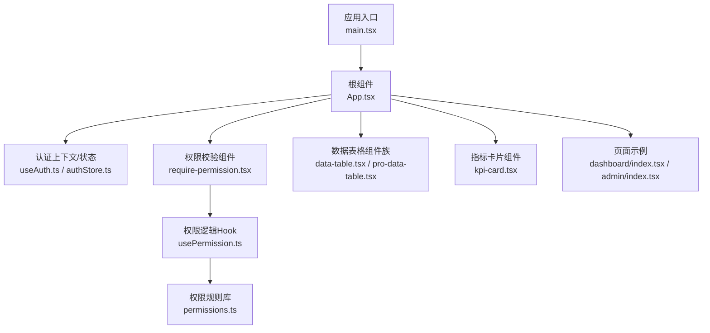
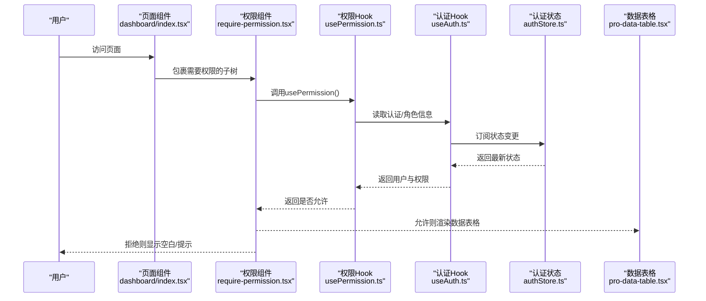
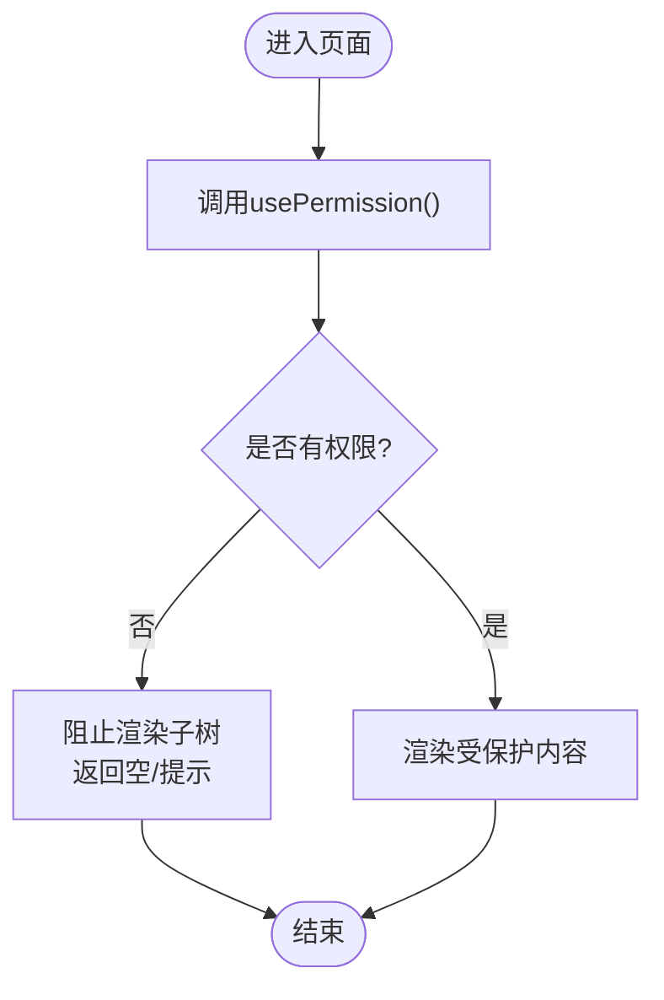
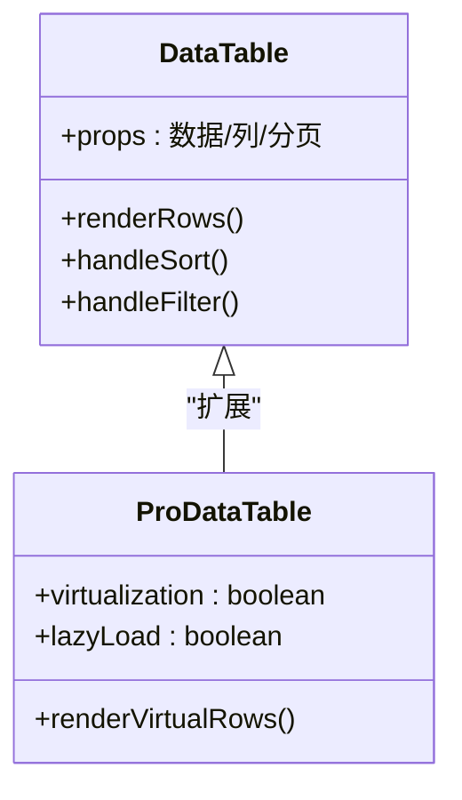
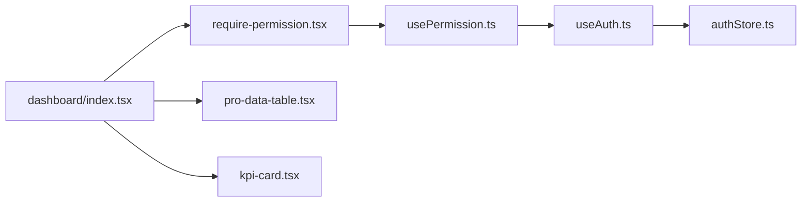

# React渲染机制优化

<cite>
**本文引用的文件**   
- [main.tsx](file://web/src/main.tsx)
- [App.tsx](file://web/src/App.tsx)
- [useAuth.ts](file://web/src/hooks/useAuth.ts)
- [authStore.ts](file://web/src/stores/authStore.ts)
- [require-permission.tsx](file://web/src/components/layout/require-permission.tsx)
- [usePermission.ts](file://web/src/hooks/usePermission.ts)
- [permissions.ts](file://web/src/lib/permissions.ts)
- [data-table.tsx](file://web/src/components/data-table/data-table.tsx)
- [pro-data-table.tsx](file://web/src/components/data-table/pro-data-table.tsx)
- [kpi-card.tsx](file://web/src/components/charts/kpi-card.tsx)
- [dashboard/index.tsx](file://web/src/pages/dashboard/index.tsx)
- [admin/index.tsx](file://web/src/pages/admin/index.tsx)
</cite>

## 目录
1. [简介](#简介)
2. [项目结构](#项目结构)
3. [核心组件](#核心组件)
4. [架构总览](#架构总览)
5. [详细组件分析](#详细组件分析)
6. [依赖关系分析](#依赖关系分析)
7. [性能考量](#性能考量)
8. [故障排查指南](#故障排查指南)
9. [结论](#结论)
10. [附录](#附录)

## 简介
本指南围绕React渲染机制与性能优化，结合本项目中的认证状态管理(useAuth)、权限控制(require-permission)以及数据表格、图表等高频渲染组件，系统阐述虚拟DOM diff算法的工作方式、重渲染触发条件、状态更新机制与Context API的性能影响。同时给出useMemo、useCallback、React.memo的正确使用场景与最佳实践，并提供识别与解决渲染瓶颈的实战方法与工具建议。

## 项目结构
本项目采用按功能域组织的前端结构：页面(pages)、通用组件(components)、业务Hook(hooks)、领域库(lib)、状态存储(stores)等。与渲染优化密切相关的核心位置如下：
- 应用入口与根组件：main.tsx、App.tsx
- 认证与权限：hooks/useAuth.ts、stores/authStore.ts、hooks/usePermission.ts、components/layout/require-permission.tsx、lib/permissions.ts
- 高频渲染组件：components/data-table/*、components/charts/kpi-card.tsx
- 典型页面：pages/dashboard/index.tsx、pages/admin/index.tsx

图示来源
- [main.tsx](file://web/src/main.tsx)
- [App.tsx](file://web/src/App.tsx)
- [useAuth.ts](file://web/src/hooks/useAuth.ts)
- [authStore.ts](file://web/src/stores/authStore.ts)
- [require-permission.tsx](file://web/src/components/layout/require-permission.tsx)
- [usePermission.ts](file://web/src/hooks/usePermission.ts)
- [permissions.ts](file://web/src/lib/permissions.ts)
- [data-table.tsx](file://web/src/components/data-table/data-table.tsx)
- [pro-data-table.tsx](file://web/src/components/data-table/pro-data-table.tsx)
- [kpi-card.tsx](file://web/src/components/charts/kpi-card.tsx)
- [dashboard/index.tsx](file://web/src/pages/dashboard/index.tsx)
- [admin/index.tsx](file://web/src/pages/admin/index.tsx)

章节来源
- [main.tsx](file://web/src/main.tsx)
- [App.tsx](file://web/src/App.tsx)

## 核心组件
- useAuth：封装认证状态的读取与更新，通常基于全局状态或Context提供isAuthenticated、用户信息、登录/登出动作等。
- require-permission：作为高阶组件或渲染函数，根据当前用户权限决定是否渲染子树，常用于路由级或区块级权限控制。
- usePermission：将权限判断逻辑下沉到Hook中，便于在任意组件内复用。
- data-table/pro-data-table：大数据量列表渲染的核心组件，涉及分页、排序、筛选、虚拟化等优化点。
- kpi-card：展示关键指标的轻量卡片，适合演示memo化与props稳定性带来的收益。
- dashboard/admin：聚合多个子组件的页面，用于观察父组件状态变化对子树的传播影响。

章节来源
- [useAuth.ts](file://web/src/hooks/useAuth.ts)
- [authStore.ts](file://web/src/stores/authStore.ts)
- [require-permission.tsx](file://web/src/components/layout/require-permission.tsx)
- [usePermission.ts](file://web/src/hooks/usePermission.ts)
- [permissions.ts](file://web/src/lib/permissions.ts)
- [data-table.tsx](file://web/src/components/data-table/data-table.tsx)
- [pro-data-table.tsx](file://web/src/components/data-table/pro-data-table.tsx)
- [kpi-card.tsx](file://web/src/components/charts/kpi-card.tsx)
- [dashboard/index.tsx](file://web/src/pages/dashboard/index.tsx)
- [admin/index.tsx](file://web/src/pages/admin/index.tsx)

## 架构总览
下图展示了认证与权限在渲染链路中的作用位置，以及与数据表格、图表等组件的关系。

图示来源
- [dashboard/index.tsx](file://web/src/pages/dashboard/index.tsx)
- [require-permission.tsx](file://web/src/components/layout/require-permission.tsx)
- [usePermission.ts](file://web/src/hooks/usePermission.ts)
- [useAuth.ts](file://web/src/hooks/useAuth.ts)
- [authStore.ts](file://web/src/stores/authStore.ts)
- [pro-data-table.tsx](file://web/src/components/data-table/pro-data-table.tsx)

## 详细组件分析

### 认证与权限渲染优化（useAuth + require-permission）
- 状态提升与最小订阅面
  - 将认证状态集中到authStore，通过useAuth暴露稳定的接口；在usePermission中仅订阅必要的布尔值或角色集合，避免全量订阅导致无关组件重渲染。
- 条件渲染优化
  - require-permission应在最外层尽早短路，避免渲染昂贵的子树；当无权限时直接返回空节点或占位，减少无效计算。
- Context API的影响
  - 若使用Context提供认证信息，应拆分细粒度Context或将状态拆分为更小的Provider，确保只有真正需要的组件订阅对应切片，降低“一写多读”的抖动。
- 常见陷阱
  - 在每次渲染创建新的对象/函数作为Context值或props，导致下游组件频繁重渲染。
  - 在useEffect中同步修改认证状态并立即触发UI更新，可能引发多次不必要的提交阶段。

图示来源
- [require-permission.tsx](file://web/src/components/layout/require-permission.tsx)
- [usePermission.ts](file://web/src/hooks/usePermission.ts)
- [useAuth.ts](file://web/src/hooks/useAuth.ts)
- [authStore.ts](file://web/src/stores/authStore.ts)

章节来源
- [useAuth.ts](file://web/src/hooks/useAuth.ts)
- [authStore.ts](file://web/src/stores/authStore.ts)
- [require-permission.tsx](file://web/src/components/layout/require-permission.tsx)
- [usePermission.ts](file://web/src/hooks/usePermission.ts)
- [permissions.ts](file://web/src/lib/permissions.ts)

### 数据表格渲染优化（data-table / pro-data-table）
- 行级稳定引用
  - 为每行数据提供稳定唯一key，避免列表重排导致的整表重渲染。
- 列与配置memo化
  - 列定义、排序/筛选回调、分页状态等通过useMemo/useCallback缓存，防止父组件状态变化引起表格内部重新初始化。
- 虚拟化与分页
  - 大数据集优先使用分页或虚拟滚动，减少一次性挂载节点数量。
- 局部状态与惰性加载
  - 将搜索输入、展开行等局部状态下放到表格内部，避免上层状态变化波及整表。

图示来源
- [data-table.tsx](file://web/src/components/data-table/data-table.tsx)
- [pro-data-table.tsx](file://web/src/components/data-table/pro-data-table.tsx)

章节来源
- [data-table.tsx](file://web/src/components/data-table/data-table.tsx)
- [pro-data-table.tsx](file://web/src/components/data-table/pro-data-table.tsx)

### 指标卡片渲染优化（kpi-card）
- 纯展示组件适合用React.memo包裹，配合稳定的数值与格式化结果，避免父组件其他状态变化导致卡片重绘。
- 数值格式化可借助useMemo缓存，避免重复计算。

章节来源
- [kpi-card.tsx](file://web/src/components/charts/kpi-card.tsx)

### 页面聚合与重渲染传播（dashboard / admin）
- 页面作为容器，应避免在顶层持有过多易变状态；将易变状态尽量下沉至具体模块。
- 使用条件渲染与懒加载组合，仅在必要时加载昂贵子树。

章节来源
- [dashboard/index.tsx](file://web/src/pages/dashboard/index.tsx)
- [admin/index.tsx](file://web/src/pages/admin/index.tsx)

## 依赖关系分析
- 认证与权限链：useAuth → authStore → usePermission → require-permission → 受保护子树
- 数据流：页面组件 → 表格/图表组件 → 内部状态与外部配置
- 可能的耦合点：
  - 认证状态变更会触发所有订阅useAuth/usePermission的组件重渲染，需通过细粒度订阅与短路渲染缓解。
  - 表格组件对外部配置对象的引用稳定性敏感，建议使用useMemo/useCallback保证引用稳定。

图示来源
- [useAuth.ts](file://web/src/hooks/useAuth.ts)
- [authStore.ts](file://web/src/stores/authStore.ts)
- [usePermission.ts](file://web/src/hooks/usePermission.ts)
- [require-permission.tsx](file://web/src/components/layout/require-permission.tsx)
- [dashboard/index.tsx](file://web/src/pages/dashboard/index.tsx)
- [pro-data-table.tsx](file://web/src/components/data-table/pro-data-table.tsx)
- [kpi-card.tsx](file://web/src/components/charts/kpi-card.tsx)

章节来源
- [useAuth.ts](file://web/src/hooks/useAuth.ts)
- [authStore.ts](file://web/src/stores/authStore.ts)
- [usePermission.ts](file://web/src/hooks/usePermission.ts)
- [require-permission.tsx](file://web/src/components/layout/require-permission.tsx)
- [dashboard/index.tsx](file://web/src/pages/dashboard/index.tsx)
- [pro-data-table.tsx](file://web/src/components/data-table/pro-data-table.tsx)
- [kpi-card.tsx](file://web/src/components/charts/kpi-card.tsx)

## 性能考量
- 虚拟DOM与diff要点
  - React在提交阶段比较新旧VNode树，尽可能复用已有DOM节点；key的稳定性和类型一致性直接影响复用效率。
  - 列表渲染务必提供稳定且唯一的key，避免索引作为key。
- 重渲染触发条件
  - 组件自身state/props变化、父组件重渲染、Context值变化、事件处理函数引用变化等。
- Context API性能影响
  - 单一大Context会导致所有消费者在值变化时全部重渲染；建议拆分Context或使用选择器模式只订阅必要字段。
- Hook优化策略
  - useMemo：适用于昂贵计算或大型对象/数组的派生值，避免在每次渲染中重建。
  - useCallback：用于传递给子组件的函数引用稳定，避免子组件因函数引用变化而重渲染。
  - React.memo：对纯展示组件进行浅比较包装，减少不必要的重渲染。
- 表格与大数据
  - 分页/虚拟滚动优先；列配置、回调函数、过滤/排序状态使用useMemo/useCallback缓存。
- 条件渲染与状态提升
  - 将易变状态尽量下沉到最小作用域；在入口处尽早短路，避免渲染昂贵子树。

[本节为通用指导，不直接分析具体文件]

## 故障排查指南
- 定位重渲染热点
  - 使用浏览器Performance面板记录交互过程，关注长任务与布局抖动；在React DevTools中使用Profiler记录渲染耗时，定位慢组件。
- 常见问题与修复
  - 在渲染期间执行副作用：将副作用放入useEffect，并确保依赖数组准确。
  - 在渲染期创建新对象/函数：使用useMemo/useCallback稳定引用。
  - 列表key不稳定：为每项提供稳定唯一标识。
  - Context过度订阅：拆分Context或改用选择器订阅最小状态切片。
  - 表格未分页/未虚拟化：引入分页或虚拟滚动，减少首屏节点数。
- 监控与回归
  - 在关键路径埋点上报渲染耗时；在CI中加入性能基线测试，防止回归。

[本节为通用指导，不直接分析具体文件]

## 结论
通过对认证与权限链路、数据表格与图表组件的系统性优化，结合虚拟DOM diff原理与React Hooks的最佳实践，可以显著降低不必要重渲染、缩短首次渲染时间并提升交互流畅度。建议在项目中持续使用DevTools与性能面板进行度量，并以最小改动原则逐步落地优化策略。

[本节为总结性内容，不直接分析具体文件]

## 附录
- 术语
  - 虚拟DOM：React维护的轻量JS对象树，用于高效计算真实DOM差异。
  - Diff：对比新旧VNode树以生成最小更新操作的过程。
  - 提交阶段：将计算出的DOM变更应用到真实DOM的阶段。
- 参考实现位置
  - 认证与权限：见useAuth.ts、authStore.ts、usePermission.ts、require-permission.tsx、permissions.ts
  - 数据表格：见data-table.tsx、pro-data-table.tsx
  - 指标卡片：见kpi-card.tsx
  - 页面示例：见dashboard/index.tsx、admin/index.tsx

[本节为补充说明，不直接分析具体文件]