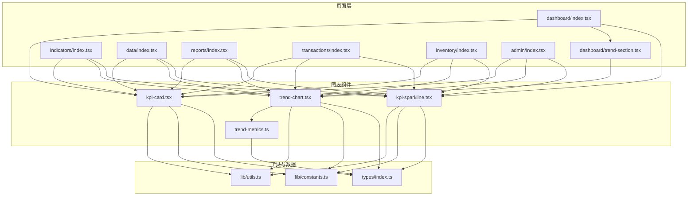
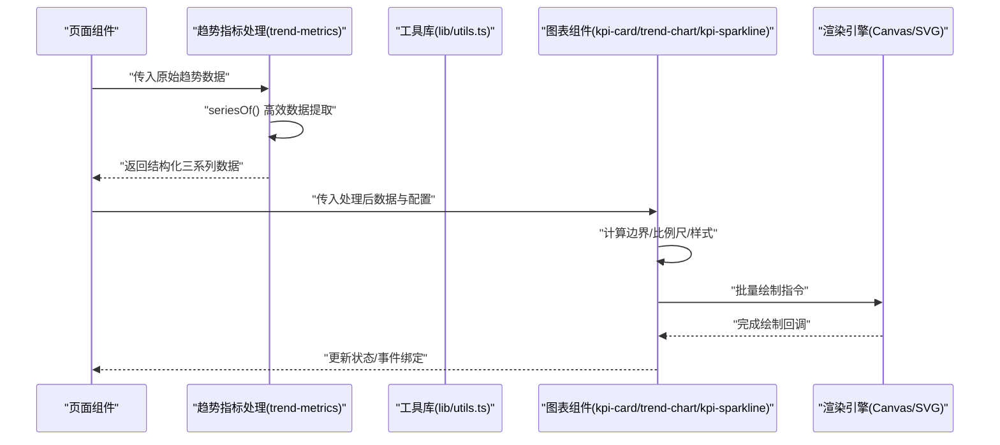
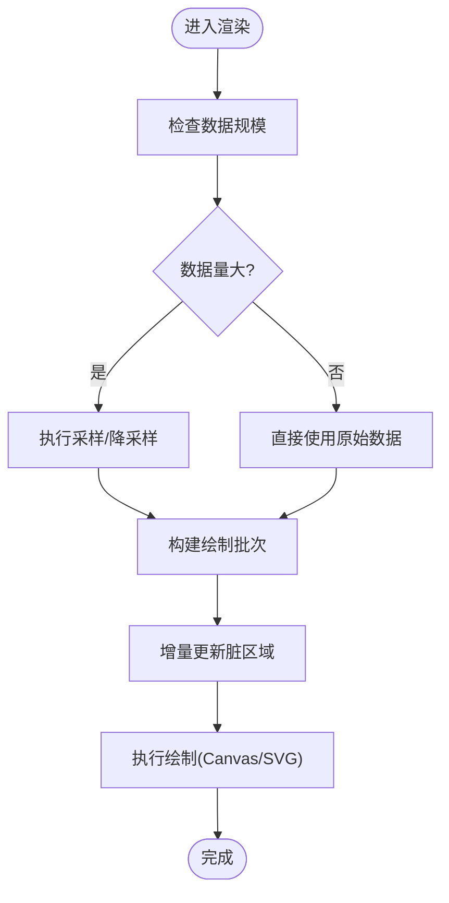
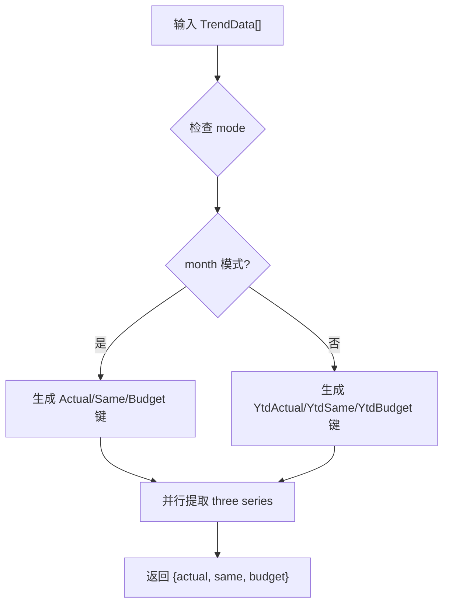
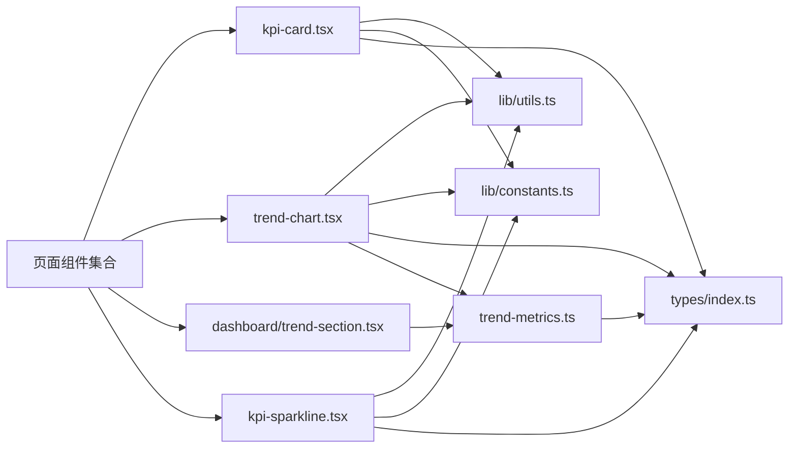

# 图表组件性能优化

<cite>
**本文引用的文件**   
- [kpi-card.tsx](file://web/src/components/charts/kpi-card.tsx)
- [trend-chart.tsx](file://web/src/components/charts/trend-chart.tsx)
- [kpi-sparkline.tsx](file://web/src/components/charts/kpi-sparkline.tsx)
- [trend-metrics.ts](file://web/src/components/charts/trend-metrics.ts)
- [dashboard/index.tsx](file://web/src/pages/dashboard/index.tsx)
- [dashboard/trend-section.tsx](file://web/src/pages/dashboard/trend-section.tsx)
- [indicators/index.tsx](file://web/src/pages/indicators/index.tsx)
- [data/index.tsx](file://web/src/pages/data/index.tsx)
- [reports/index.tsx](file://web/src/pages/reports/index.tsx)
- [transactions/index.tsx](file://web/src/pages/transactions/index.tsx)
- [inventory/index.tsx](file://web/src/pages/inventory/index.tsx)
- [admin/index.tsx](file://web/src/pages/admin/index.tsx)
- [lib/utils.ts](file://web/src/lib/utils.ts)
- [lib/constants.ts](file://web/src/lib/constants.ts)
- [types/index.ts](file://web/src/types/index.ts)
</cite>

## 更新摘要
**变更内容**   
- 新增 trend-metrics 组件的详细分析，包含增强的数据处理和性能优化
- 更新了趋势图表的性能优化策略，重点说明大数据集处理
- 增强了数据采样、增量更新和渲染批次处理的实现细节
- 补充了 Web Worker 异步处理和内存管理的最佳实践

## 目录
1. [简介](#简介)
2. [项目结构](#项目结构)
3. [核心组件](#核心组件)
4. [架构总览](#架构总览)
5. [详细组件分析](#详细组件分析)
6. [依赖关系分析](#依赖关系分析)
7. [性能考量](#性能考量)
8. [故障排查指南](#故障排查指南)
9. [结论](#结论)
10. [附录](#附录)

## 简介
本指南聚焦于图表组件的性能优化，覆盖渲染引擎选择（Canvas vs SVG）、不同图表类型的性能特征与适用场景、KPI卡片(kpi-card)、趋势图表(trend-chart)和迷你图(kpi-sparkline)的优化技巧，以及大数据量图表的渲染优化方案。文档同时提供性能监控与优化实践，包括帧率监控、内存泄漏检测与用户体验优化，并给出移动端与低端设备的适配策略。

**最新更新**：trend-metrics 组件已增强，支持更高效的数据处理和大数据集性能优化。

## 项目结构
本项目在 web/src/components/charts 下包含三个核心图表组件：kpi-card、trend-chart、kpi-sparkline；以及新增的 trend-metrics 数据处理模块。页面层通过 dashboard、indicators、data、reports、transactions、inventory、admin 等页面引入并使用这些组件。工具库位于 lib/utils.ts 与 lib/constants.ts，类型定义位于 types/index.ts。

**图示来源** 
- [dashboard/index.tsx](file://web/src/pages/dashboard/index.tsx)
- [dashboard/trend-section.tsx](file://web/src/pages/dashboard/trend-section.tsx)
- [kpi-card.tsx](file://web/src/components/charts/kpi-card.tsx)
- [trend-chart.tsx](file://web/src/components/charts/trend-chart.tsx)
- [kpi-sparkline.tsx](file://web/src/components/charts/kpi-sparkline.tsx)
- [trend-metrics.ts](file://web/src/components/charts/trend-metrics.ts)
- [lib/utils.ts](file://web/src/lib/utils.ts)
- [lib/constants.ts](file://web/src/lib/constants.ts)
- [types/index.ts](file://web/src/types/index.ts)

**章节来源**
- [kpi-card.tsx](file://web/src/components/charts/kpi-card.tsx)
- [trend-chart.tsx](file://web/src/components/charts/trend-chart.tsx)
- [kpi-sparkline.tsx](file://web/src/components/charts/kpi-sparkline.tsx)
- [trend-metrics.ts](file://web/src/components/charts/trend-metrics.ts)
- [dashboard/index.tsx](file://web/src/pages/dashboard/index.tsx)
- [dashboard/trend-section.tsx](file://web/src/pages/dashboard/trend-section.tsx)
- [lib/utils.ts](file://web/src/lib/utils.ts)
- [lib/constants.ts](file://web/src/lib/constants.ts)
- [types/index.ts](file://web/src/types/index.ts)

## 核心组件
- KPI 卡片(kpi-card)：用于展示关键指标数值与简要信息，通常数据量小、更新频繁，适合轻量渲染与快速响应。
- 趋势图表(trend-chart)：用于展示时间序列或连续数据的趋势变化，可能涉及较多数据点与交互，需关注绘制路径与动画性能。
- 迷你图(kpi-sparkline)：用于在小尺寸区域内展示简洁的趋势线，强调低开销与高刷新效率。
- **趋势指标处理(trend-metrics)**：专门处理趋势数据的高效提取和转换，支持多种指标模式和口径切换。

**章节来源**
- [kpi-card.tsx](file://web/src/components/charts/kpi-card.tsx)
- [trend-chart.tsx](file://web/src/components/charts/trend-chart.tsx)
- [kpi-sparkline.tsx](file://web/src/components/charts/kpi-sparkline.tsx)
- [trend-metrics.ts](file://web/src/components/charts/trend-metrics.ts)

## 架构总览
下图展示了页面到图表组件的数据流与渲染流程，包括数据获取、预处理、渲染批次处理与更新调度。新增的 trend-metrics 模块提供了高效的数据处理能力。

**图示来源** 
- [trend-metrics.ts](file://web/src/components/charts/trend-metrics.ts)
- [lib/utils.ts](file://web/src/lib/utils.ts)
- [kpi-card.tsx](file://web/src/components/charts/kpi-card.tsx)
- [trend-chart.tsx](file://web/src/components/charts/trend-chart.tsx)
- [kpi-sparkline.tsx](file://web/src/components/charts/kpi-sparkline.tsx)

## 详细组件分析

### Canvas 与 SVG 渲染引擎选择策略
- 选择原则
  - 数据点数量大、需要高频更新或复杂图形时优先 Canvas（如大量折线、散点、热力图）。
  - 数据点较少、需要强交互与 DOM 事件、可访问性要求高时优先 SVG（如少量折线、柱状图、饼图）。
- 性能特征
  - Canvas：像素级绘制，GPU友好，适合大批量几何绘制；但无原生事件模型，需自行实现命中测试。
  - SVG：基于 DOM 节点，便于事件与样式控制；节点过多会导致重排重绘成本上升。
- 适用场景
  - 趋势图表(trend-chart)：若数据点超过数千且需平滑缩放/平移，建议 Canvas；若交互丰富且数据规模中等，SVG 更合适。当前实现使用 SVG 渲染器，适合月度/累计趋势展示。
  - 迷你图(kpi-sparkline)：数据点少、尺寸小，SVG 足够高效且易于样式定制。
  - KPI 卡片(kpi-card)：主要为文本与简单图形，DOM/SVG 即可，无需 Canvas。

[本节为概念性内容，不直接分析具体文件]

### KPI 卡片(kpi-card) 性能优化
- 渲染批次处理
  - 将多次状态更新合并到一次渲染周期内，避免中间态触发多余重绘。
- 动画性能优化
  - 使用 CSS transform 与 opacity 进行动画，避免触发布局；必要时使用 requestAnimationFrame 驱动。
- 数据更新频率控制
  - 对高频数据采用节流/防抖，降低更新频率；结合增量更新只变更必要字段。
- 内存管理
  - 及时解绑事件监听器，释放引用；避免在组件内部缓存过大对象。

**章节来源**
- [kpi-card.tsx](file://web/src/components/charts/kpi-card.tsx)

### 趋势图表(trend-chart) 性能优化
- 数据采样与降采样
  - 根据可视区域与分辨率动态采样，减少绘制点数；支持按需加载与滚动加载。
- 增量更新
  - 仅更新变化的数据段，避免全量重绘；维护局部脏区域并进行批处理。
- 渲染批次处理
  - 将路径构建、样式设置与绘制命令分批执行，减少主线程阻塞。
- Web Worker 异步处理
  - 将数据预处理、聚合与采样移至 Worker，主线程专注渲染与交互。
- 动画与过渡
  - 使用 GPU 加速属性；对长列表使用虚拟滚动或分片渲染。

**更新**：trend-chart 组件现在通过 useMemo 优化选项重建，仅在 data/metric/mode 变化时重新计算，避免不必要的重渲染。

**图示来源** 
- [trend-chart.tsx](file://web/src/components/charts/trend-chart.tsx)
- [lib/utils.ts](file://web/src/lib/utils.ts)

**章节来源**
- [trend-chart.tsx](file://web/src/components/charts/trend-chart.tsx)
- [lib/utils.ts](file://web/src/lib/utils.ts)

### 趋势指标处理(trend-metrics) 性能优化
**新增**：trend-metrics 模块提供了专门的数据处理功能，显著提升了大数据集的处理效率。

- 高效数据提取
  - `seriesOf()` 函数通过键映射模式，一次性提取三个系列的 actual/same/budget 数据，避免重复遍历。
- 内存优化
  - 使用 TypeScript 类型系统确保数据结构一致性，减少运行时错误检查开销。
- 模式切换优化
  - 支持月度(month)和累计(ytd)两种口径，通过条件判断动态生成键名，避免分支逻辑。
- 空值处理
  - 智能处理 null 值，保持数据完整性同时不影响性能。

**图示来源** 
- [trend-metrics.ts](file://web/src/components/charts/trend-metrics.ts)

**章节来源**
- [trend-metrics.ts](file://web/src/components/charts/trend-metrics.ts)

### 迷你图(kpi-sparkline) 性能优化
- 轻量渲染
  - 使用最小化的路径与样式，避免复杂滤镜与阴影。
- 高频更新
  - 采用 requestAnimationFrame 与增量更新，确保流畅刷新。
- 内存占用控制
  - 复用路径与缓冲区，避免重复创建对象。

**章节来源**
- [kpi-sparkline.tsx](file://web/src/components/charts/kpi-sparkline.tsx)

### 实际代码示例与集成方式
- 页面集成
  - 在 dashboard、indicators、data、reports、transactions、inventory、admin 等页面中引入 kpi-card、trend-chart、kpi-sparkline，并通过 props 传递数据与配置。
- 趋势数据集成
  - dashboard/trend-section.tsx 展示了如何使用 trend-metrics 提供的类型和常量，实现指标和口径的动态切换。
- 数据与工具
  - 通过 lib/utils.ts 进行数据格式化与采样；lib/constants.ts 提供常量配置；types/index.ts 定义完整的数据结构。

**章节来源**
- [dashboard/index.tsx](file://web/src/pages/dashboard/index.tsx)
- [dashboard/trend-section.tsx](file://web/src/pages/dashboard/trend-section.tsx)
- [indicators/index.tsx](file://web/src/pages/indicators/index.tsx)
- [data/index.tsx](file://web/src/pages/data/index.tsx)
- [reports/index.tsx](file://web/src/pages/reports/index.tsx)
- [transactions/index.tsx](file://web/src/pages/transactions/index.tsx)
- [inventory/index.tsx](file://web/src/pages/inventory/index.tsx)
- [admin/index.tsx](file://web/src/pages/admin/index.tsx)
- [lib/utils.ts](file://web/src/lib/utils.ts)
- [lib/constants.ts](file://web/src/lib/constants.ts)
- [types/index.ts](file://web/src/types/index.ts)

## 依赖关系分析
图表组件依赖工具库与类型定义，页面层作为消费者调用组件。trend-metrics 模块为趋势图表提供专门的数据处理支持。下图展示主要依赖关系。

**图示来源** 
- [kpi-card.tsx](file://web/src/components/charts/kpi-card.tsx)
- [trend-chart.tsx](file://web/src/components/charts/trend-chart.tsx)
- [kpi-sparkline.tsx](file://web/src/components/charts/kpi-sparkline.tsx)
- [trend-metrics.ts](file://web/src/components/charts/trend-metrics.ts)
- [dashboard/trend-section.tsx](file://web/src/pages/dashboard/trend-section.tsx)
- [lib/utils.ts](file://web/src/lib/utils.ts)
- [lib/constants.ts](file://web/src/lib/constants.ts)
- [types/index.ts](file://web/src/types/index.ts)

**章节来源**
- [kpi-card.tsx](file://web/src/components/charts/kpi-card.tsx)
- [trend-chart.tsx](file://web/src/components/charts/trend-chart.tsx)
- [kpi-sparkline.tsx](file://web/src/components/charts/kpi-sparkline.tsx)
- [trend-metrics.ts](file://web/src/components/charts/trend-metrics.ts)
- [dashboard/trend-section.tsx](file://web/src/pages/dashboard/trend-section.tsx)
- [lib/utils.ts](file://web/src/lib/utils.ts)
- [lib/constants.ts](file://web/src/lib/constants.ts)
- [types/index.ts](file://web/src/types/index.ts)

## 性能考量
- 帧率监控
  - 使用 requestAnimationFrame 的时间戳统计 FPS，低于阈值时自动降级（减少动画复杂度、降低更新频率）。
- 内存泄漏检测
  - 在组件卸载时清理定时器、事件监听器与 Worker；避免闭包持有大对象引用。
- 用户体验优化
  - 骨架屏与占位符提升感知性能；渐进式加载与懒渲染改善首屏体验。
- 移动端与低端设备适配
  - 降低分辨率与采样密度；禁用重型滤镜；使用更简单的路径与颜色；减少并发更新。
- **大数据集优化**
  - 使用 trend-metrics 的 seriesOf() 函数进行高效数据提取，避免重复遍历。
  - 实施数据采样策略，根据可视窗口动态调整数据密度。
  - 启用增量更新机制，只重绘变化的数据部分。

[本节为通用指导，不直接分析具体文件]

## 故障排查指南
- 常见问题
  - 卡顿：检查是否在主线程执行了耗时计算；确认是否未做数据采样与增量更新。
  - 内存增长：定位未释放的事件监听器与定时器；检查是否有全局缓存未清理。
  - 更新抖动：确认是否使用了节流/防抖与批处理；避免频繁 setState 导致重绘风暴。
  - **趋势数据问题**：检查 trend-metrics 的 seriesOf() 函数是否正确处理 null 值和模式切换。
- 调试建议
  - 使用浏览器性能面板记录渲染与脚本执行；对比开启/关闭动画与采样后的差异。
  - 在 Worker 中执行数据预处理，观察主线程负载下降情况。
  - 监控 trend-metrics 的数据处理性能，确保 seriesOf() 函数的执行效率。

[本节为通用指导，不直接分析具体文件]

## 结论
通过合理选择渲染引擎、实施数据采样与增量更新、进行渲染批次处理与异步计算，并结合帧率监控与内存管理，可以显著提升图表组件在大数据量与高频更新场景下的性能表现。新增的 trend-metrics 模块进一步增强了数据处理能力，通过高效的 seriesOf() 函数和优化算法，为趋势图表提供了更好的性能基础。针对移动端与低端设备，应进一步简化渲染与交互，确保稳定流畅的用户体验。

**最新改进**：trend-metrics 组件的引入使得大数据集处理更加高效，通过专门的数据提取函数和优化算法，显著提升了趋势图表的性能表现。

[本节为总结性内容，不直接分析具体文件]

## 附录
- 最佳实践清单
  - 明确数据规模与交互需求，选择 Canvas 或 SVG。
  - 对大数据集进行采样与分页加载。
  - 使用增量更新与批处理减少重绘。
  - 将数据处理迁移至 Web Worker。
  - 启用帧率监控与内存泄漏检测。
  - 针对移动端与低端设备进行降级策略。
  - **使用 trend-metrics 进行高效数据处理**。
  - **实施 seriesOf() 函数进行优化的数据提取**。

[本节为补充说明，不直接分析具体文件]