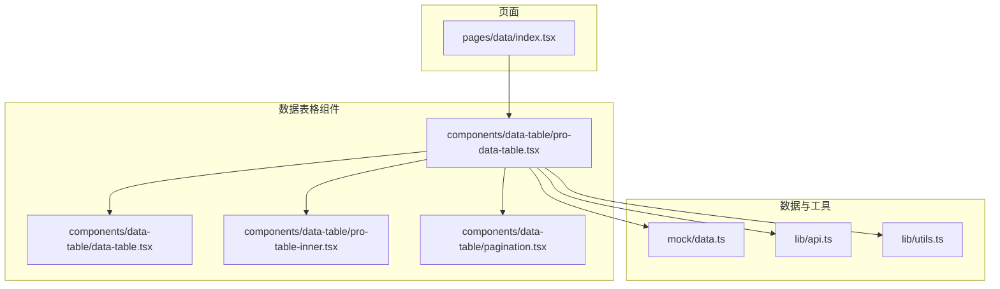
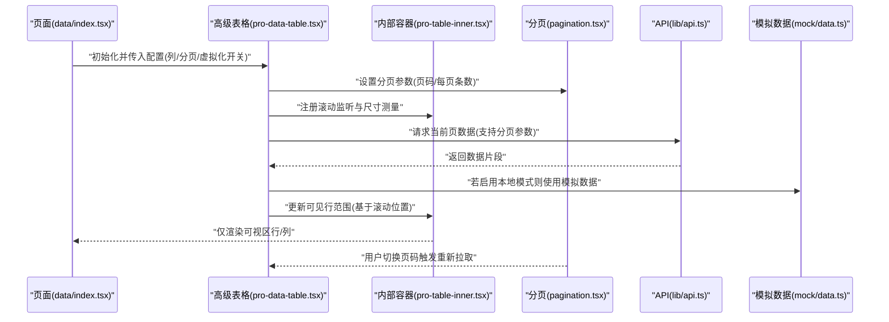
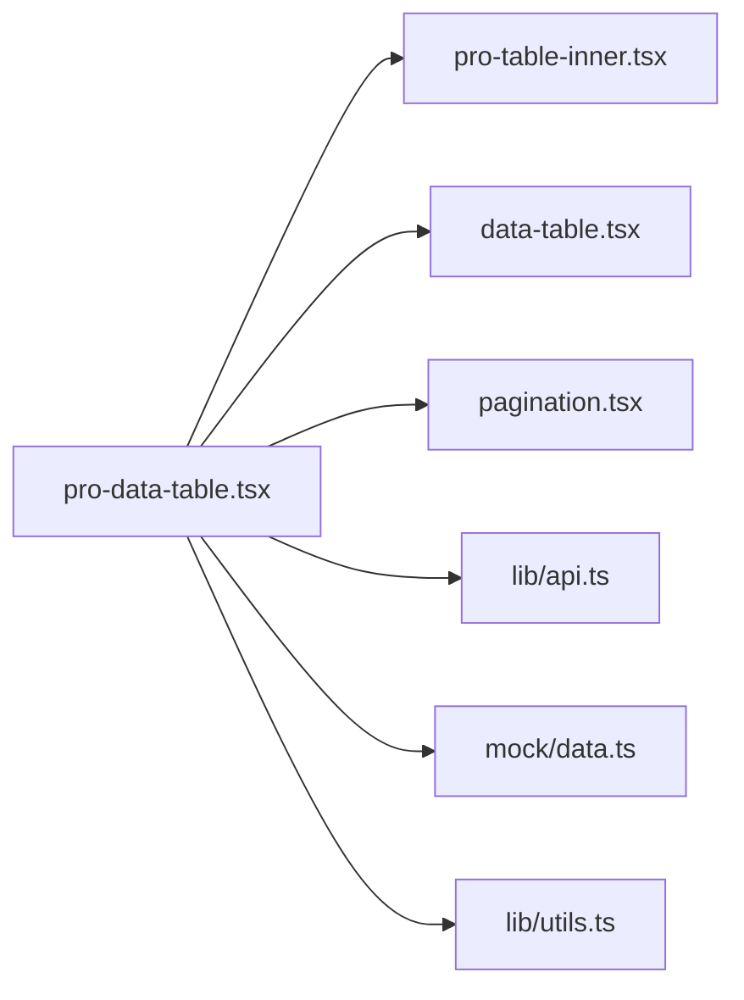

# 大数据列表渲染优化

<cite>
**本文引用的文件**   
- [data-table.tsx](file://web/src/components/data-table/data-table.tsx)
- [pro-data-table.tsx](file://web/src/components/data-table/pro-data-table.tsx)
- [pro-table-inner.tsx](file://web/src/components/data-table/pro-table-inner.tsx)
- [pagination.tsx](file://web/src/components/data-table/pagination.tsx)
- [data/index.tsx](file://web/src/pages/data/index.tsx)
- [mock/data.ts](file://web/src/mock/data.ts)
- [lib/api.ts](file://web/src/lib/api.ts)
- [lib/utils.ts](file://web/src/lib/utils.ts)
</cite>

## 目录
1. [引言](#引言)
2. [项目结构](#项目结构)
3. [核心组件](#核心组件)
4. [架构总览](#架构总览)
5. [详细组件分析](#详细组件分析)
6. [依赖关系分析](#依赖关系分析)
7. [性能考量](#性能考量)
8. [故障排查指南](#故障排查指南)
9. [结论](#结论)
10. [附录](#附录)

## 引言
本指南聚焦于大数据量列表渲染的性能优化，围绕虚拟滚动、窗口化渲染、增量加载与内存管理策略展开。结合仓库中的 data-table 与 pro-data-table 组件，系统阐述分页加载、行虚拟化、列虚拟化等方案在百万级数据场景下的落地方法，并提供监控、分析与调优的实践建议。

## 项目结构
本项目采用按功能域组织的前端工程结构，数据表格相关实现集中在 components/data-table 目录下，页面入口位于 pages/data，数据源通过 mock 或 API 层提供。

图表来源
- [data/index.tsx:1-200](file://web/src/pages/data/index.tsx#L1-L200)
- [pro-data-table.tsx:1-200](file://web/src/components/data-table/pro-data-table.tsx#L1-L200)
- [pro-table-inner.tsx:1-200](file://web/src/components/data-table/pro-table-inner.tsx#L1-L200)
- [data-table.tsx:1-200](file://web/src/components/data-table/data-table.tsx#L1-L200)
- [pagination.tsx:1-200](file://web/src/components/data-table/pagination.tsx#L1-L200)
- [api.ts:1-200](file://web/src/lib/api.ts#L1-L200)
- [data.ts:1-200](file://web/src/mock/data.ts#L1-L200)
- [utils.ts:1-200](file://web/src/lib/utils.ts#L1-L200)

章节来源
- [data/index.tsx:1-200](file://web/src/pages/data/index.tsx#L1-L200)
- [pro-data-table.tsx:1-200](file://web/src/components/data-table/pro-data-table.tsx#L1-L200)
- [pro-table-inner.tsx:1-200](file://web/src/components/data-table/pro-table-inner.tsx#L1-L200)
- [data-table.tsx:1-200](file://web/src/components/data-table/data-table.tsx#L1-L200)
- [pagination.tsx:1-200](file://web/src/components/data-table/pagination.tsx#L1-L200)
- [api.ts:1-200](file://web/src/lib/api.ts#L1-L200)
- [data.ts:1-200](file://web/src/mock/data.ts#L1-L200)
- [utils.ts:1-200](file://web/src/lib/utils.ts#L1-L200)

## 核心组件
- data-table：基础表格能力，包含列定义、行渲染、排序/筛选等通用逻辑。
- pro-data-table：面向大数据量的增强版表格，集成分页、虚拟滚动、缓存与懒加载等优化策略。
- pro-table-inner：内部渲染容器，负责可视区域计算、行/列虚拟化与滚动事件处理。
- pagination：分页控件，驱动服务端分页或客户端分页的数据获取与更新。

章节来源
- [data-table.tsx:1-200](file://web/src/components/data-table/data-table.tsx#L1-L200)
- [pro-data-table.tsx:1-200](file://web/src/components/data-table/pro-data-table.tsx#L1-L200)
- [pro-table-inner.tsx:1-200](file://web/src/components/data-table/pro-table-inner.tsx#L1-L200)
- [pagination.tsx:1-200](file://web/src/components/data-table/pagination.tsx#L1-L200)

## 架构总览
下图展示了从页面到表格组件再到数据源的调用链路与数据流向，突出分页与虚拟滚动的关键交互点。

图表来源
- [data/index.tsx:1-200](file://web/src/pages/data/index.tsx#L1-L200)
- [pro-data-table.tsx:1-200](file://web/src/components/data-table/pro-data-table.tsx#L1-L200)
- [pro-table-inner.tsx:1-200](file://web/src/components/data-table/pro-table-inner.tsx#L1-L200)
- [pagination.tsx:1-200](file://web/src/components/data-table/pagination.tsx#L1-L200)
- [api.ts:1-200](file://web/src/lib/api.ts#L1-L200)
- [data.ts:1-200](file://web/src/mock/data.ts#L1-L200)

## 详细组件分析

### 高级表格组件（pro-data-table）
- 职责边界
  - 对外暴露统一配置接口：列定义、分页参数、虚拟化开关、缓存策略、懒加载阈值等。
  - 协调分页与虚拟滚动：根据滚动位置计算可见区间，按需拉取数据并更新渲染范围。
  - 管理缓存与去重：对已加载的页码或行块进行缓存，避免重复请求与重复渲染。
- 关键流程
  - 初始化：读取配置，建立分页状态与缓存结构，绑定滚动与尺寸变化监听。
  - 滚动处理：节流/防抖后计算可视行索引范围，触发对应数据块的加载与渲染。
  - 分页联动：切换页码时重置滚动位置，清空或合并缓存，拉取新数据并刷新视图。
  - 内存保护：卸载时移除监听器，清理定时器与缓存引用，防止泄漏。
- 性能要点
  - 行虚拟化：仅渲染可视区行，配合固定高度或行高估算提升滚动性能。
  - 列虚拟化：当列数量极大时，仅渲染可视列，减少 DOM 节点与布局开销。
  - 增量加载：滚动接近边界时预加载下一批数据，保证流畅体验。
  - 缓存策略：按页码或行块键值缓存，命中直接复用，降低网络与解析成本。

章节来源
- [pro-data-table.tsx:1-200](file://web/src/components/data-table/pro-data-table.tsx#L1-L200)

### 内部渲染容器（pro-table-inner）
- 职责边界
  - 维护表格容器尺寸与滚动状态，计算可视区域的行列索引范围。
  - 派发渲染任务：将可见行/列映射为可渲染单元，交由上层组件完成具体渲染。
- 关键流程
  - 尺寸测量：监听容器 resize，更新可视宽高与行高估算。
  - 滚动监听：对滚动事件进行节流，计算首尾可见索引，生成渲染区间。
  - 渲染调度：将区间传递给上层，确保只创建必要 DOM 节点。
- 性能要点
  - 使用 requestAnimationFrame 或时间片拆分，避免主线程阻塞。
  - 行高估算与占位符，减少重排重绘。
  - 惰性创建与销毁节点，控制内存峰值。

章节来源
- [pro-table-inner.tsx:1-200](file://web/src/components/data-table/pro-table-inner.tsx#L1-L200)

### 基础表格组件（data-table）
- 职责边界
  - 提供列定义、行数据绑定、排序与筛选等基础能力。
  - 作为虚拟化容器的渲染目标，接收可见行/列数据并完成单元格渲染。
- 关键流程
  - 列渲染：根据列配置生成表头与单元格模板。
  - 行渲染：接收可见行数据，逐行渲染单元格内容。
  - 交互处理：响应点击、排序、筛选等事件，回调至上层状态管理。
- 性能要点
  - 稳定 key：为每行/每列提供稳定标识，减少不必要的重渲染。
  - 纯函数渲染：单元格渲染尽量无副作用，便于 React 优化。
  - 条件渲染：仅在需要时渲染复杂内容（如富文本、图片）。

章节来源
- [data-table.tsx:1-200](file://web/src/components/data-table/data-table.tsx#L1-L200)

### 分页组件（pagination）
- 职责边界
  - 展示分页信息，响应用户翻页操作，向上层传递新的分页参数。
- 关键流程
  - 页码变更：触发上层重新拉取数据并重置滚动位置。
  - 每页条数调整：影响虚拟化行数与缓存粒度。
- 性能要点
  - 与虚拟化协同：合理设置每页条数以平衡内存占用与交互延迟。
  - 快速跳转：支持输入页码直达，减少多次点击带来的抖动。

章节来源
- [pagination.tsx:1-200](file://web/src/components/data-table/pagination.tsx#L1-L200)

### 页面集成（pages/data）
- 职责边界
  - 组合高级表格组件，注入列定义、分页与虚拟化配置。
  - 连接数据源（API 或模拟），处理错误与加载态。
- 关键流程
  - 初始化：组装配置，挂载表格组件。
  - 数据流：分页与滚动驱动数据请求，更新表格状态。
  - 错误处理：网络异常、数据格式校验失败时的降级显示。
- 性能要点
  - 懒加载：仅在组件进入视口时初始化数据请求。
  - 骨架屏：在数据未就绪时提供占位反馈，提升感知性能。

章节来源
- [data/index.tsx:1-200](file://web/src/pages/data/index.tsx#L1-L200)

## 依赖关系分析
- 组件耦合
  - pro-data-table 依赖 pro-table-inner 进行可视化计算与渲染调度。
  - pro-data-table 依赖 pagination 驱动分页数据获取。
  - pro-data-table 依赖 data-table 完成具体行/列渲染。
- 外部依赖
  - lib/api.ts 提供数据请求封装，支持分页参数与错误处理。
  - mock/data.ts 提供本地测试数据，便于离线验证虚拟化效果。
  - lib/utils.ts 提供工具函数（如节流、去重、哈希等）。

图表来源
- [pro-data-table.tsx:1-200](file://web/src/components/data-table/pro-data-table.tsx#L1-L200)
- [pro-table-inner.tsx:1-200](file://web/src/components/data-table/pro-table-inner.tsx#L1-L200)
- [data-table.tsx:1-200](file://web/src/components/data-table/data-table.tsx#L1-L200)
- [pagination.tsx:1-200](file://web/src/components/data-table/pagination.tsx#L1-L200)
- [api.ts:1-200](file://web/src/lib/api.ts#L1-L200)
- [data.ts:1-200](file://web/src/mock/data.ts#L1-L200)
- [utils.ts:1-200](file://web/src/lib/utils.ts#L1-L200)

章节来源
- [pro-data-table.tsx:1-200](file://web/src/components/data-table/pro-data-table.tsx#L1-L200)
- [pro-table-inner.tsx:1-200](file://web/src/components/data-table/pro-table-inner.tsx#L1-L200)
- [data-table.tsx:1-200](file://web/src/components/data-table/data-table.tsx#L1-L200)
- [pagination.tsx:1-200](file://web/src/components/data-table/pagination.tsx#L1-L200)
- [api.ts:1-200](file://web/src/lib/api.ts#L1-L200)
- [data.ts:1-200](file://web/src/mock/data.ts#L1-L200)
- [utils.ts:1-200](file://web/src/lib/utils.ts#L1-L200)

## 性能考量
- 虚拟滚动与窗口化
  - 行虚拟化：仅渲染可视区行，显著降低 DOM 节点数量与布局开销。
  - 列虚拟化：在列数巨大时仅渲染可视列，避免横向滚动卡顿。
  - 行高估算：固定行高或使用采样估算，减少测量成本。
- 增量加载与预取
  - 滚动接近边界时提前加载下一批数据，平滑过渡。
  - 分页与虚拟化协同：每页大小与可视行数匹配，减少频繁切换抖动。
- 缓存策略
  - 页码缓存：按页码缓存数据片段，避免重复请求。
  - 行块缓存：按行索引范围缓存渲染结果，提高回滚速度。
  - 去重与失效：对相同键值的请求进行去重，过期或不可见数据及时释放。
- 内存管理与泄漏防护
  - 卸载清理：移除滚动监听、resize 监听、定时器与动画帧。
  - 弱引用与池化：对大对象使用弱引用或对象池，降低峰值内存。
  - 数据分片：将超大数组拆分为小块，逐步构建与释放。
- 百万级数据处理
  - 服务端分页：优先使用后端分页，限制单次返回规模。
  - 前端聚合：对多页数据进行增量合并，保持有序与去重。
  - 懒加载与骨架屏：在数据未就绪时提供占位，提升感知性能。
- 监控与分析
  - 渲染性能：记录首次渲染时间、滚动帧率、重排次数。
  - 内存使用：监控堆快照与长生命周期对象，定位泄漏点。
  - 交互响应：测量用户操作到界面更新的端到端耗时。

[本节为通用指导，不直接分析具体文件]

## 故障排查指南
- 常见问题
  - 滚动卡顿：检查是否启用了行/列虚拟化，确认行高估算准确。
  - 内存泄漏：确认组件卸载时清除了所有监听器与定时器。
  - 数据不同步：核对分页参数与缓存键一致性，避免脏读。
  - 列溢出：启用列虚拟化或限制最大列数，避免横向布局压力。
- 定位步骤
  - 打开浏览器开发者工具，观察 Performance 面板的滚动帧率与主线程占用。
  - 使用 Memory 面板对比快照，查找持续增长的对象。
  - 在关键路径添加日志，记录分页请求与缓存命中情况。
- 修复建议
  - 引入节流/防抖，降低高频事件处理频率。
  - 使用稳定的 key，避免不必要的重渲染。
  - 对复杂单元格进行懒渲染或降级展示。

章节来源
- [pro-data-table.tsx:1-200](file://web/src/components/data-table/pro-data-table.tsx#L1-L200)
- [pro-table-inner.tsx:1-200](file://web/src/components/data-table/pro-table-inner.tsx#L1-L200)
- [data-table.tsx:1-200](file://web/src/components/data-table/data-table.tsx#L1-L200)
- [pagination.tsx:1-200](file://web/src/components/data-table/pagination.tsx#L1-L200)
- [api.ts:1-200](file://web/src/lib/api.ts#L1-L200)
- [utils.ts:1-200](file://web/src/lib/utils.ts#L1-L200)

## 结论
通过行/列虚拟化、分页与缓存协同、增量加载与严格的内存管理，可在百万级数据场景下实现流畅的表格交互。建议在工程中统一抽象虚拟化容器与缓存策略，结合监控指标持续优化，确保在不同设备与网络条件下均能提供良好体验。

[本节为总结性内容，不直接分析具体文件]

## 附录
- 实践清单
  - 启用行虚拟化与列虚拟化，合理设置行高与可视行数。
  - 分页参数与缓存键保持一致，避免数据错乱。
  - 组件卸载时清理监听器与定时器，防止内存泄漏。
  - 对复杂单元格进行懒渲染与降级展示。
  - 接入性能监控，定期分析帧率与内存趋势。
- 参考实现路径
  - 高级表格：[pro-data-table.tsx](file://web/src/components/data-table/pro-data-table.tsx)
  - 内部容器：[pro-table-inner.tsx](file://web/src/components/data-table/pro-table-inner.tsx)
  - 基础表格：[data-table.tsx](file://web/src/components/data-table/data-table.tsx)
  - 分页控件：[pagination.tsx](file://web/src/components/data-table/pagination.tsx)
  - 页面集成：[data/index.tsx](file://web/src/pages/data/index.tsx)
  - 数据源：[api.ts](file://web/src/lib/api.ts)、[data.ts](file://web/src/mock/data.ts)
  - 工具函数：[utils.ts](file://web/src/lib/utils.ts)