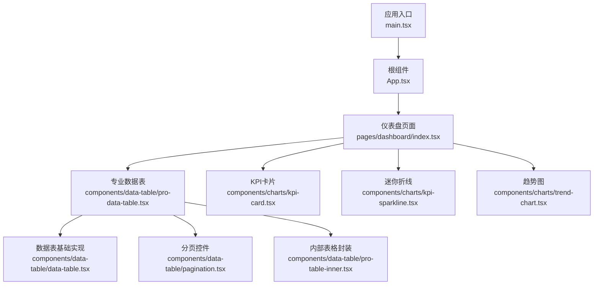
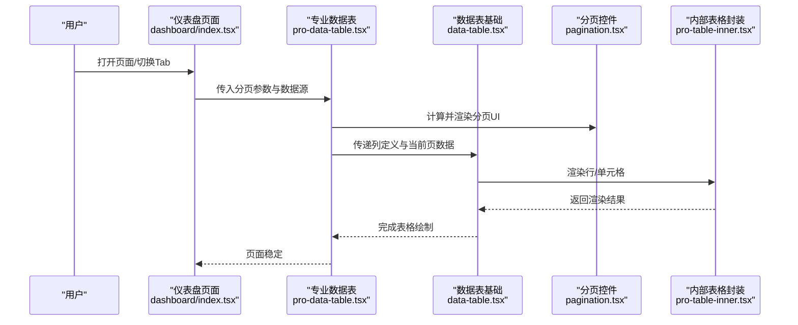
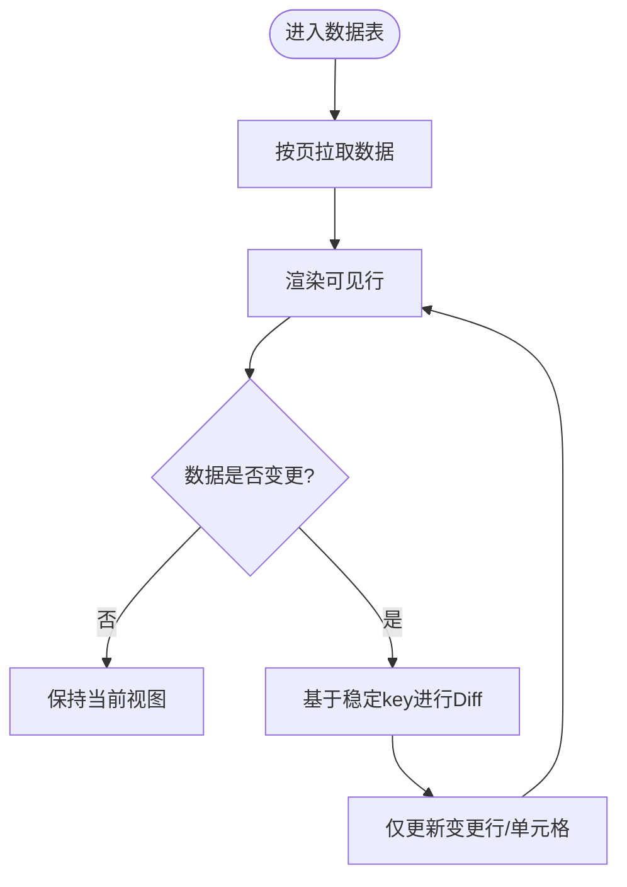
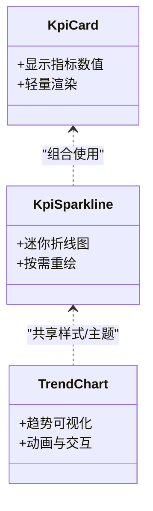
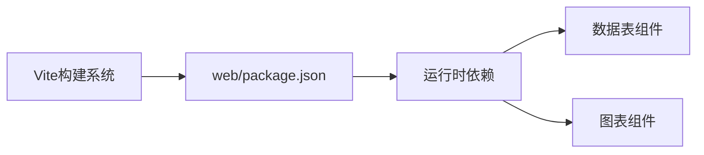

# 渲染优化

<cite>
**本文引用的文件**   
- [web/src/components/data-table/data-table.tsx](file://web/src/components/data-table/data-table.tsx)
- [web/src/components/data-table/pro-data-table.tsx](file://web/src/components/data-table/pro-data-table.tsx)
- [web/src/components/data-table/pagination.tsx](file://web/src/components/data-table/pagination.tsx)
- [web/src/components/data-table/pro-table-inner.tsx](file://web/src/components/data-table/pro-table-inner.tsx)
- [web/src/components/charts/kpi-card.tsx](file://web/src/components/charts/kpi-card.tsx)
- [web/src/components/charts/kpi-sparkline.tsx](file://web/src/components/charts/kpi-sparkline.tsx)
- [web/src/components/charts/trend-chart.tsx](file://web/src/components/charts/trend-chart.tsx)
- [web/src/pages/dashboard/index.tsx](file://web/src/pages/dashboard/index.tsx)
- [web/src/App.tsx](file://web/src/App.tsx)
- [web/src/main.tsx](file://web/src/main.tsx)
- [web/package.json](file://web/package.json)
</cite>

## 目录
1. [简介](#简介)
2. [项目结构](#项目结构)
3. [核心组件](#核心组件)
4. [架构总览](#架构总览)
5. [详细组件分析](#详细组件分析)
6. [依赖分析](#依赖分析)
7. [性能考量](#性能考量)
8. [故障排查指南](#故障排查指南)
9. [结论](#结论)
10. [附录](#附录)

## 简介
本指南面向pj3项目的渲染性能优化，聚焦以下目标：
- 深入理解React渲染机制与重渲染优化策略（状态管理、Context API使用注意事项、虚拟DOM diff关键点）
- 大型数据列表的渲染优化方案（虚拟滚动、分页加载、增量更新）
- 图表组件的性能优化技巧（Canvas/SVG选择、动画性能、数据更新频率控制）
- 提供可落地的监控与优化案例，帮助识别和解决渲染瓶颈

## 项目结构
本项目采用Vite + React + TypeScript的前端工程化方案。与渲染性能密切相关的代码主要分布在以下模块：
- 数据表格组件族：data-table、pro-data-table、pagination、pro-table-inner
- 图表组件族：kpi-card、kpi-sparkline、trend-chart
- 页面层：dashboard等聚合展示页
- 应用入口：App.tsx、main.tsx
- 依赖声明：package.json

图示来源
- [web/src/main.tsx](file://web/src/main.tsx)
- [web/src/App.tsx](file://web/src/App.tsx)
- [web/src/pages/dashboard/index.tsx](file://web/src/pages/dashboard/index.tsx)
- [web/src/components/data-table/pro-data-table.tsx](file://web/src/components/data-table/pro-data-table.tsx)
- [web/src/components/data-table/data-table.tsx](file://web/src/components/data-table/data-table.tsx)
- [web/src/components/data-table/pagination.tsx](file://web/src/components/data-table/pagination.tsx)
- [web/src/components/data-table/pro-table-inner.tsx](file://web/src/components/data-table/pro-table-inner.tsx)
- [web/src/components/charts/kpi-card.tsx](file://web/src/components/charts/kpi-card.tsx)
- [web/src/components/charts/kpi-sparkline.tsx](file://web/src/components/charts/kpi-sparkline.tsx)
- [web/src/components/charts/trend-chart.tsx](file://web/src/components/charts/trend-chart.tsx)

章节来源
- [web/src/main.tsx](file://web/src/main.tsx)
- [web/src/App.tsx](file://web/src/App.tsx)
- [web/src/pages/dashboard/index.tsx](file://web/src/pages/dashboard/index.tsx)
- [web/src/components/data-table/pro-data-table.tsx](file://web/src/components/data-table/pro-data-table.tsx)
- [web/src/components/data-table/data-table.tsx](file://web/src/components/data-table/data-table.tsx)
- [web/src/components/data-table/pagination.tsx](file://web/src/components/data-table/pagination.tsx)
- [web/src/components/data-table/pro-table-inner.tsx](file://web/src/components/data-table/pro-table-inner.tsx)
- [web/src/components/charts/kpi-card.tsx](file://web/src/components/charts/kpi-card.tsx)
- [web/src/components/charts/kpi-sparkline.tsx](file://web/src/components/charts/kpi-sparkline.tsx)
- [web/src/components/charts/trend-chart.tsx](file://web/src/components/charts/trend-chart.tsx)

## 核心组件
- 专业数据表（pro-data-table）：负责大数据量场景下的分页、排序、筛选与渲染组织，是列表性能优化的关键入口
- 数据表基础实现（data-table）：提供通用表格结构与列配置能力
- 分页控件（pagination）：承载分页交互与页码计算逻辑
- 内部表格封装（pro-table-inner）：对行渲染、单元格渲染进行二次封装，便于复用与优化
- 图表组件（kpi-card、kpi-sparkline、trend-chart）：用于指标展示与趋势可视化，需关注渲染路径与动画开销

章节来源
- [web/src/components/data-table/pro-data-table.tsx](file://web/src/components/data-table/pro-data-table.tsx)
- [web/src/components/data-table/data-table.tsx](file://web/src/components/data-table/data-table.tsx)
- [web/src/components/data-table/pagination.tsx](file://web/src/components/data-table/pagination.tsx)
- [web/src/components/data-table/pro-table-inner.tsx](file://web/src/components/data-table/pro-table-inner.tsx)
- [web/src/components/charts/kpi-card.tsx](file://web/src/components/charts/kpi-card.tsx)
- [web/src/components/charts/kpi-sparkline.tsx](file://web/src/components/charts/kpi-sparkline.tsx)
- [web/src/components/charts/trend-chart.tsx](file://web/src/components/charts/trend-chart.tsx)

## 架构总览
从渲染链路看，页面级状态变化会触发子树重渲染。通过合理的状态拆分、惰性加载与虚拟化手段，可将不必要的渲染控制在最小范围。

图示来源
- [web/src/pages/dashboard/index.tsx](file://web/src/pages/dashboard/index.tsx)
- [web/src/components/data-table/pro-data-table.tsx](file://web/src/components/data-table/pro-data-table.tsx)
- [web/src/components/data-table/data-table.tsx](file://web/src/components/data-table/data-table.tsx)
- [web/src/components/data-table/pagination.tsx](file://web/src/components/data-table/pagination.tsx)
- [web/src/components/data-table/pro-table-inner.tsx](file://web/src/components/data-table/pro-table-inner.tsx)

## 详细组件分析

### 数据表组件族（分页与虚拟化）
- 分页加载：将大数据集拆分为多页请求与渲染，降低单次渲染压力
- 增量更新：在数据变更时仅更新受影响区域（如单行或单单元格），避免整表重绘
- 行键稳定：为每行提供稳定的key，提升diff效率
- 列渲染优化：对复杂单元格进行懒渲染或按需计算，减少首屏时间

图示来源
- [web/src/components/data-table/pro-data-table.tsx](file://web/src/components/data-table/pro-data-table.tsx)
- [web/src/components/data-table/data-table.tsx](file://web/src/components/data-table/data-table.tsx)
- [web/src/components/data-table/pro-table-inner.tsx](file://web/src/components/data-table/pro-table-inner.tsx)
- [web/src/components/data-table/pagination.tsx](file://web/src/components/data-table/pagination.tsx)

章节来源
- [web/src/components/data-table/pro-data-table.tsx](file://web/src/components/data-table/pro-data-table.tsx)
- [web/src/components/data-table/data-table.tsx](file://web/src/components/data-table/data-table.tsx)
- [web/src/components/data-table/pro-table-inner.tsx](file://web/src/components/data-table/pro-table-inner.tsx)
- [web/src/components/data-table/pagination.tsx](file://web/src/components/data-table/pagination.tsx)

### 图表组件族（Canvas/SVG与动画）
- 渲染介质选择：大量点线图形优先Canvas；少量交互式元素优先SVG
- 动画性能：使用requestAnimationFrame节流动画帧，避免阻塞主线程
- 数据更新频率：对高频数据采用合并更新与降采样，降低重绘次数
- 缓存与去抖：对频繁变化的指标做防抖与局部更新，减少整体重绘

图示来源
- [web/src/components/charts/kpi-card.tsx](file://web/src/components/charts/kpi-card.tsx)
- [web/src/components/charts/kpi-sparkline.tsx](file://web/src/components/charts/kpi-sparkline.tsx)
- [web/src/components/charts/trend-chart.tsx](file://web/src/components/charts/trend-chart.tsx)

章节来源
- [web/src/components/charts/kpi-card.tsx](file://web/src/components/charts/kpi-card.tsx)
- [web/src/components/charts/kpi-sparkline.tsx](file://web/src/components/charts/kpi-sparkline.tsx)
- [web/src/components/charts/trend-chart.tsx](file://web/src/components/charts/trend-chart.tsx)

### 页面聚合与状态边界
- 页面级状态尽量下沉到具体组件，缩小重渲染范围
- 使用受控与非受控结合的策略，避免父组件频繁setState导致子组件大面积重渲染
- 对无关数据变更进行隔离，确保只触发必要子树的更新

章节来源
- [web/src/pages/dashboard/index.tsx](file://web/src/pages/dashboard/index.tsx)

## 依赖分析
- 构建与运行环境由Vite驱动，包依赖集中在web/package.json中
- 图表与表格组件可能引入第三方库以支持高性能渲染与交互

图示来源
- [web/package.json](file://web/package.json)

章节来源
- [web/package.json](file://web/package.json)

## 性能考量
- React渲染机制要点
  - 状态粒度：将频繁变化的状态拆分为更细粒度的state，减少不必要重渲染
  - Context使用：仅在必要时使用Context，避免大范围订阅；对高频更新的Context值考虑拆分或使用memo化提供者
  - 虚拟DOM diff：保证稳定的key，避免数组索引作为key；对不可变数据结构进行浅比较即可命中优化
- 大型数据列表优化
  - 分页加载：按页拉取与渲染，结合骨架屏提升感知性能
  - 虚拟滚动：仅渲染可视区域内的行，大幅降低DOM节点数量
  - 增量更新：基于稳定key进行局部patch，避免整表重绘
- 图表性能优化
  - Canvas vs SVG：大数据量用Canvas，小数据且强交互用SVG
  - 动画与帧率：使用requestAnimationFrame，限制最大帧率，避免过度绘制
  - 数据更新频率：合并多次更新、降采样、去抖/节流
- 监控与度量
  - 使用浏览器Performance面板记录长任务与布局抖动
  - 统计首次内容绘制、交互延迟与重渲染次数，定位热点组件

[本节为通用指导，不直接分析具体文件]

## 故障排查指南
- 常见症状
  - 页面卡顿：检查是否有长任务阻塞主线程，是否存在过多同步计算
  - 滚动掉帧：确认是否启用虚拟滚动，是否对行高进行固定或估算
  - 图表闪烁：检查是否频繁重建实例或未正确清理动画帧
- 定位步骤
  - 在页面开启性能录制，观察重渲染热点与耗时函数
  - 针对数据表与图表组件分别进行隔离测试，确认问题边界
  - 逐步关闭优化开关（如分页、虚拟化、动画），对比差异定位根因
- 修复建议
  - 将大对象拆分为更小状态，减少上下文传播范围
  - 对复杂计算进行异步化或Web Worker处理
  - 对图表数据做降采样与增量更新，避免全量重绘

[本节为通用指导，不直接分析具体文件]

## 结论
通过合理拆分状态、使用分页与虚拟化、选择合适的渲染介质与动画策略，并结合性能监控持续优化，可在pj3项目中显著提升渲染性能与用户体验。建议在迭代中建立性能基线与回归检测，确保优化效果长期稳定。

[本节为总结性内容，不直接分析具体文件]

## 附录
- 快速清单
  - 为列表项设置稳定key
  - 对高频状态进行细粒度拆分
  - 大数据列表启用分页与虚拟滚动
  - 图表数据降采样与增量更新
  - 使用性能面板定期巡检
- 参考入口
  - 应用入口：[web/src/main.tsx](file://web/src/main.tsx)
  - 根组件：[web/src/App.tsx](file://web/src/App.tsx)
  - 仪表盘页面：[web/src/pages/dashboard/index.tsx](file://web/src/pages/dashboard/index.tsx)
  - 数据表组件族：见“详细组件分析”
  - 图表组件族：见“详细组件分析”
  - 依赖声明：[web/package.json](file://web/package.json)