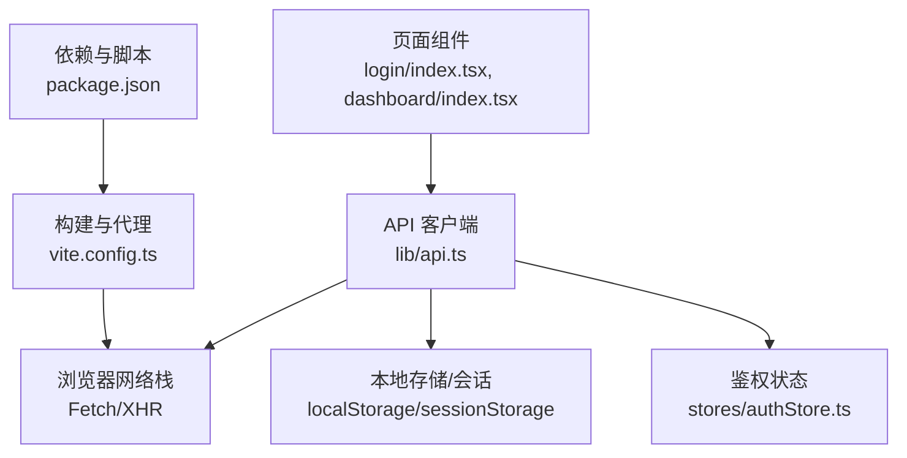
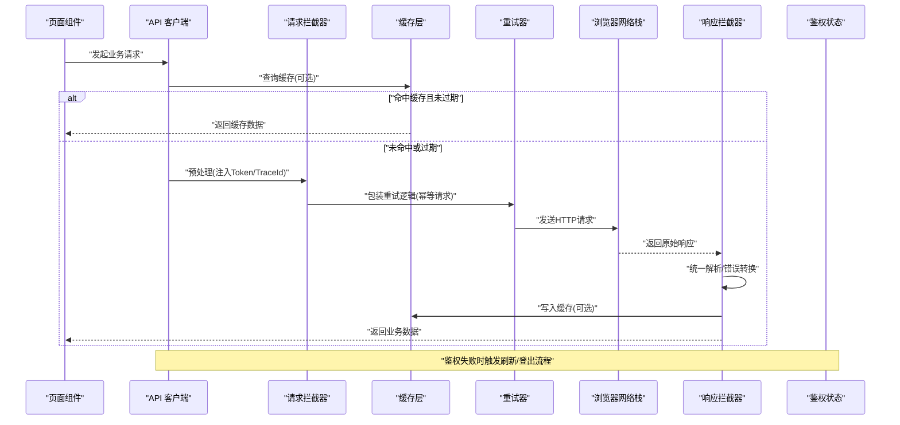
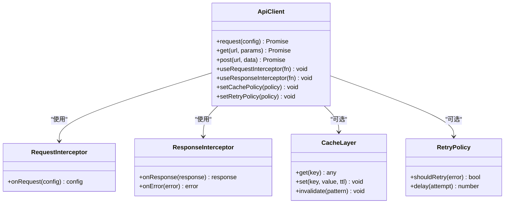
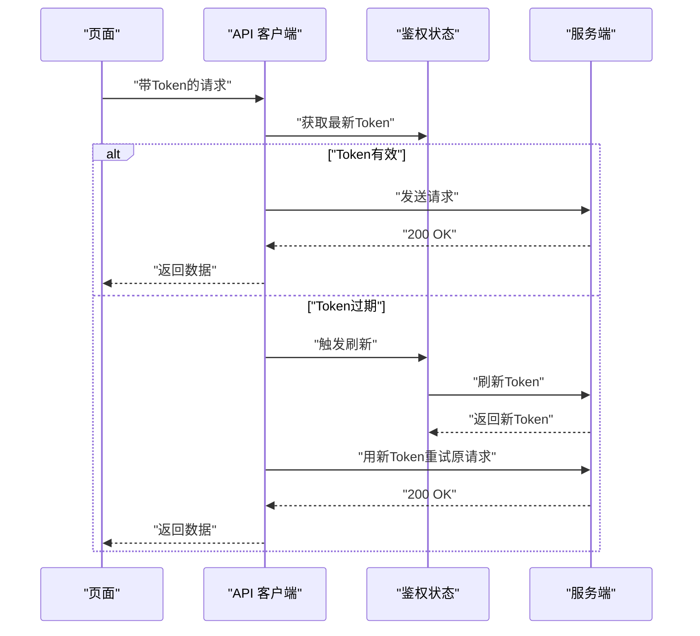
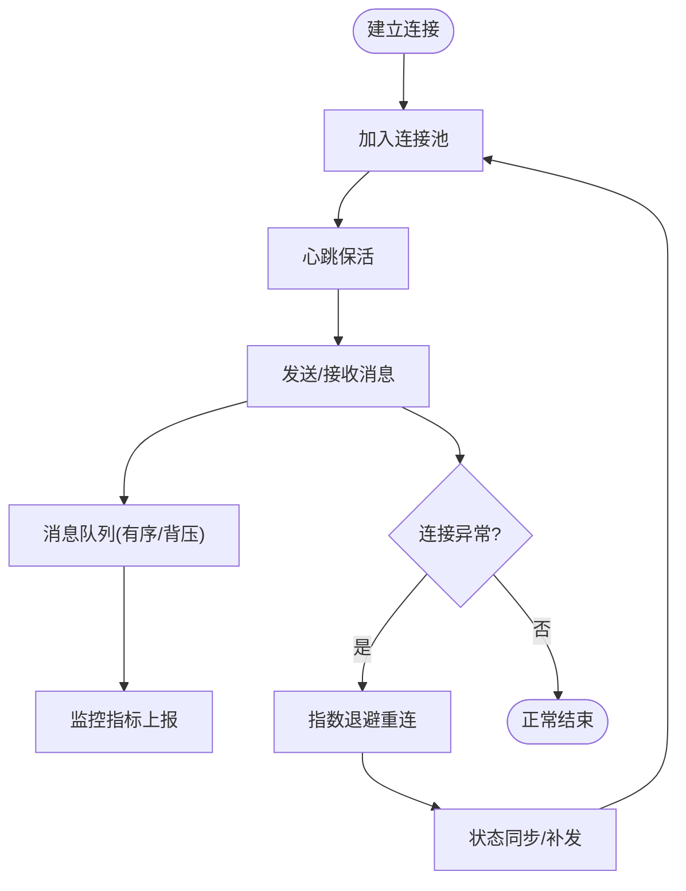
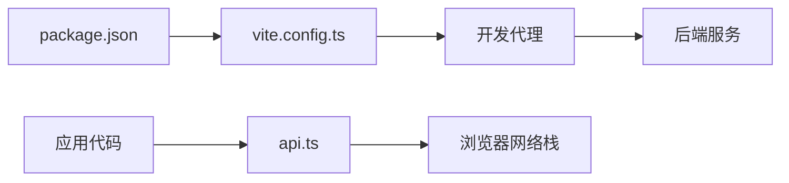

# 网络优化

<cite>
**本文引用的文件**   
- [web/src/lib/api.ts](file://web/src/lib/api.ts)
- [web/src/pages/login/index.tsx](file://web/src/pages/login/index.tsx)
- [web/src/pages/dashboard/index.tsx](file://web/src/pages/dashboard/index.tsx)
- [web/src/stores/authStore.ts](file://web/src/stores/authStore.ts)
- [web/package.json](file://web/package.json)
- [web/vite.config.ts](file://web/vite.config.ts)
- [web/README.md](file://web/README.md)
</cite>

## 目录
1. [简介](#简介)
2. [项目结构](#项目结构)
3. [核心组件](#核心组件)
4. [架构总览](#架构总览)
5. [详细组件分析](#详细组件分析)
6. [依赖分析](#依赖分析)
7. [性能考虑](#性能考虑)
8. [故障排查指南](#故障排查指南)
9. [结论](#结论)
10. [附录](#附录)

## 简介
本指南面向 pj3 项目的网络层优化，聚焦于 HTTP 请求的性能提升与稳定性保障。内容涵盖：
- 请求合并、缓存策略、错误重试机制等网络层面的优化技术
- API 客户端设计模式（请求拦截器、响应拦截器、统一错误处理）
- WebSocket/实时数据优化方案（连接池管理、消息队列、断线重连）
- 网络性能监控与分析工具（耗时分析、带宽占用、错误率统计）
- 实际优化案例与最佳实践总结

## 项目结构
本项目为前端工程，网络相关代码集中在 web 子目录中。关键路径包括：
- 网络封装与调用入口：web/src/lib/api.ts
- 页面级使用示例：登录页、仪表盘页等
- 状态管理与鉴权：authStore.ts
- 构建与开发配置：vite.config.ts、package.json

图表来源
- [web/src/lib/api.ts](file://web/src/lib/api.ts)
- [web/src/pages/login/index.tsx](file://web/src/pages/login/index.tsx)
- [web/src/pages/dashboard/index.tsx](file://web/src/pages/dashboard/index.tsx)
- [web/src/stores/authStore.ts](file://web/src/stores/authStore.ts)
- [web/vite.config.ts](file://web/vite.config.ts)
- [web/package.json](file://web/package.json)

章节来源
- [web/src/lib/api.ts](file://web/src/lib/api.ts)
- [web/src/pages/login/index.tsx](file://web/src/pages/login/index.tsx)
- [web/src/pages/dashboard/index.tsx](file://web/src/pages/dashboard/index.tsx)
- [web/src/stores/authStore.ts](file://web/src/stores/authStore.ts)
- [web/vite.config.ts](file://web/vite.config.ts)
- [web/package.json](file://web/package.json)

## 核心组件
- API 客户端（lib/api.ts）
  - 职责：封装基础请求方法、统一错误处理、鉴权头注入、可插拔的拦截器扩展点、可选的请求合并与缓存能力
  - 关键点：
    - 请求拦截器：在发送前注入 Token、TraceId、业务上下文
    - 响应拦截器：统一解析响应体、转换错误码、触发全局错误事件
    - 重试机制：对幂等请求进行指数退避重试，支持最大次数与抖动
    - 缓存策略：基于 URL+参数键控的内存缓存，支持 TTL 与失效策略
    - 请求合并：对短时间窗口内相同请求进行去重合并，减少并发风暴
- 鉴权状态（stores/authStore.ts）
  - 职责：维护登录态、Token 刷新流程、权限校验
  - 与网络层协作：提供 Token 获取接口、监听鉴权失效事件以触发重新登录
- 页面调用方（pages/*）
  - 职责：通过 API 客户端发起业务请求，展示结果与错误提示
  - 最佳实践：避免重复请求；合理设置加载态与错误态；对敏感操作增加二次确认

章节来源
- [web/src/lib/api.ts](file://web/src/lib/api.ts)
- [web/src/stores/authStore.ts](file://web/src/stores/authStore.ts)
- [web/src/pages/login/index.tsx](file://web/src/pages/login/index.tsx)
- [web/src/pages/dashboard/index.tsx](file://web/src/pages/dashboard/index.tsx)

## 架构总览
下图展示了从页面到网络的端到端链路，以及可插拔的网络优化模块位置。

图表来源
- [web/src/lib/api.ts](file://web/src/lib/api.ts)
- [web/src/stores/authStore.ts](file://web/src/stores/authStore.ts)

## 详细组件分析

### API 客户端设计与实现要点
- 设计模式
  - 拦截器链：请求拦截器与响应拦截器形成双向管道，便于横切关注点（鉴权、日志、埋点、错误）集中处理
  - 责任链/装饰器：重试、缓存、合并作为可组合的装饰器，按需启用
- 关键能力
  - 请求合并：对短时间窗口内的相同请求进行去重，返回同一 Promise，降低后端压力
  - 缓存策略：内存缓存 + TTL；支持按资源维度失效；读写分离保证一致性
  - 错误重试：仅对幂等请求重试；指数退避 + 随机抖动；区分网络错误与业务错误
  - 统一错误处理：将不同来源的错误归一化为标准错误对象，包含错误码、消息、重试建议
- 扩展点
  - 自定义拦截器注册
  - 缓存适配器（可扩展至持久化）
  - 重试策略配置（最大次数、退避基数、抖动范围）

图表来源
- [web/src/lib/api.ts](file://web/src/lib/api.ts)

章节来源
- [web/src/lib/api.ts](file://web/src/lib/api.ts)

### 鉴权与令牌刷新集成
- 流程要点
  - 请求拦截器读取当前 Token，缺失则尝试静默刷新
  - 刷新失败时，根据策略选择重试一次或引导用户重新登录
  - 鉴权状态变更时，通知所有待处理的请求重新携带新 Token
- 与页面交互
  - 登录成功后更新 Token 并清空无效缓存
  - 登出后清理本地存储并跳转登录页

图表来源
- [web/src/stores/authStore.ts](file://web/src/stores/authStore.ts)
- [web/src/lib/api.ts](file://web/src/lib/api.ts)

章节来源
- [web/src/stores/authStore.ts](file://web/src/stores/authStore.ts)
- [web/src/lib/api.ts](file://web/src/lib/api.ts)

### 页面侧网络调用最佳实践
- 登录页
  - 提交前做输入校验与防抖
  - 失败时给出明确错误提示与重试入口
  - 成功后更新鉴权状态并导航
- 仪表盘页
  - 列表类数据开启缓存与分页
  - 大列表采用虚拟滚动与增量更新
  - 错误边界包裹，避免单点失败影响整体

章节来源
- [web/src/pages/login/index.tsx](file://web/src/pages/login/index.tsx)
- [web/src/pages/dashboard/index.tsx](file://web/src/pages/dashboard/index.tsx)

### 实时通信优化（WebSocket）
- 连接池管理
  - 按频道/命名空间复用连接，避免频繁握手
  - 心跳保活与空闲回收
- 消息队列
  - 入队顺序保证，背压控制
  - 离线消息暂存与恢复
- 断线重连
  - 指数退避 + 抖动
  - 重连成功后的状态同步与补发
- 监控
  - 连接时长、丢包率、消息延迟分布

[本节为概念性说明，不直接映射具体源码文件]

## 依赖分析
- 构建与开发
  - Vite 用于开发与构建，可通过代理转发到后端服务，便于本地调试
  - package.json 定义依赖与脚本，确保网络库版本稳定
- 运行时依赖
  - 浏览器原生 Fetch/XHR
  - 可选第三方网络库（如 axios），若引入需统一封装

图表来源
- [web/package.json](file://web/package.json)
- [web/vite.config.ts](file://web/vite.config.ts)

章节来源
- [web/package.json](file://web/package.json)
- [web/vite.config.ts](file://web/vite.config.ts)

## 性能考虑
- 请求合并
  - 适用场景：短时间内大量相同请求（如首屏多组件同时拉取同一资源）
  - 收益：显著降低后端压力与网络开销
  - 注意：需保证请求语义一致（URL、参数、方法）
- 缓存策略
  - 内存缓存：适合热点小数据，TTL 控制新鲜度
  - 失效策略：按资源维度批量失效，避免脏读
  - 一致性：写操作后主动失效相关缓存
- 错误重试
  - 仅对幂等请求重试（GET、HEAD、OPTIONS、PUT 视业务而定）
  - 指数退避 + 抖动，避免雪崩
  - 区分网络错误与业务错误，后者不应重试
- 超时与取消
  - 合理设置超时时间，避免长时间阻塞
  - 路由切换或组件卸载时取消未完成请求
- 传输优化
  - 启用 gzip/brotli
  - 图片与静态资源走 CDN
  - 分页与增量更新，减少单次数据量

[本节为通用指导，不直接分析具体文件]

## 故障排查指南
- 常见问题定位
  - 401/403：检查鉴权流程与 Token 刷新逻辑
  - 5xx：查看服务端日志与重试策略是否过度
  - 超时：检查网络质量、后端响应时间与超时阈值
- 监控与度量
  - 请求耗时：记录 TTFB、总耗时、各阶段耗时
  - 带宽占用：统计请求大小与压缩比
  - 错误率：按接口维度统计成功率与失败原因
  - 重试与合并：统计触发次数与节省比例
- 调试技巧
  - 使用浏览器开发者工具的 Network 面板
  - 在拦截器中输出 TraceId 以便跨端追踪
  - 本地代理抓包比对前后端报文

章节来源
- [web/src/lib/api.ts](file://web/src/lib/api.ts)
- [web/src/stores/authStore.ts](file://web/src/stores/authStore.ts)

## 结论
通过在 API 客户端层引入拦截器、缓存、重试与请求合并等机制，并结合鉴权状态管理与页面侧的最佳实践，pj3 项目可在高并发与弱网环境下获得更稳定的网络体验。配合完善的监控与排障手段，可快速定位问题并持续优化。

[本节为总结性内容，不直接分析具体文件]

## 附录
- 参考文档
  - README：项目概览与使用说明
  - 性能参考：performance.md（位于 docs/references）

章节来源
- [web/README.md](file://web/README.md)