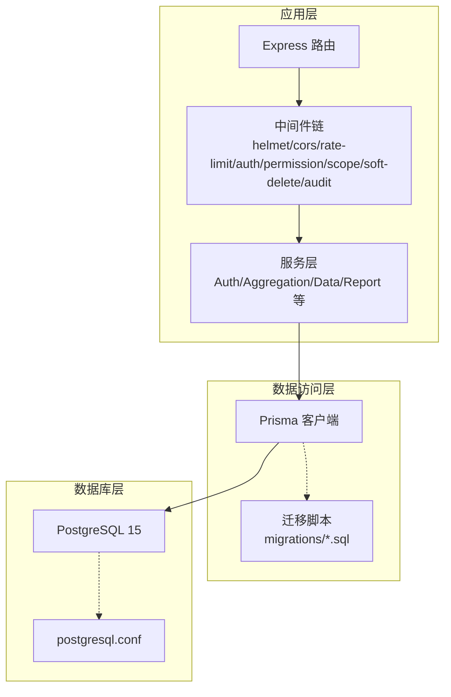
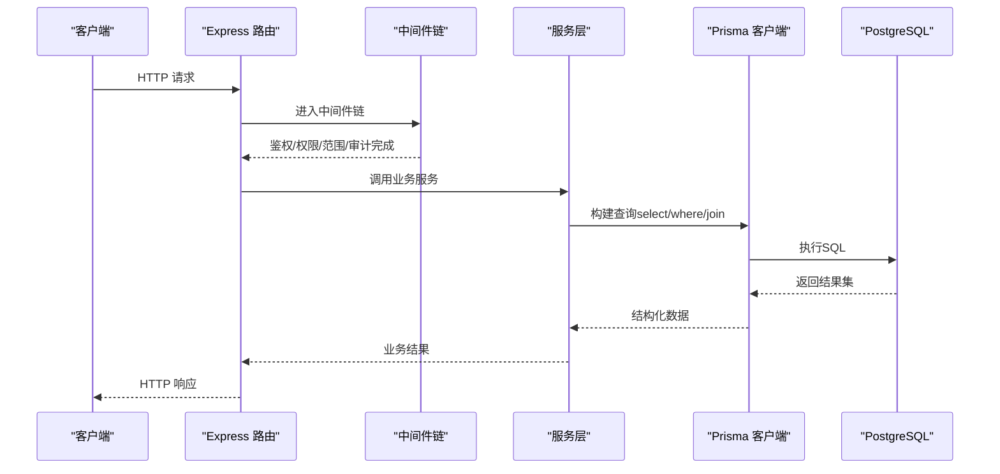
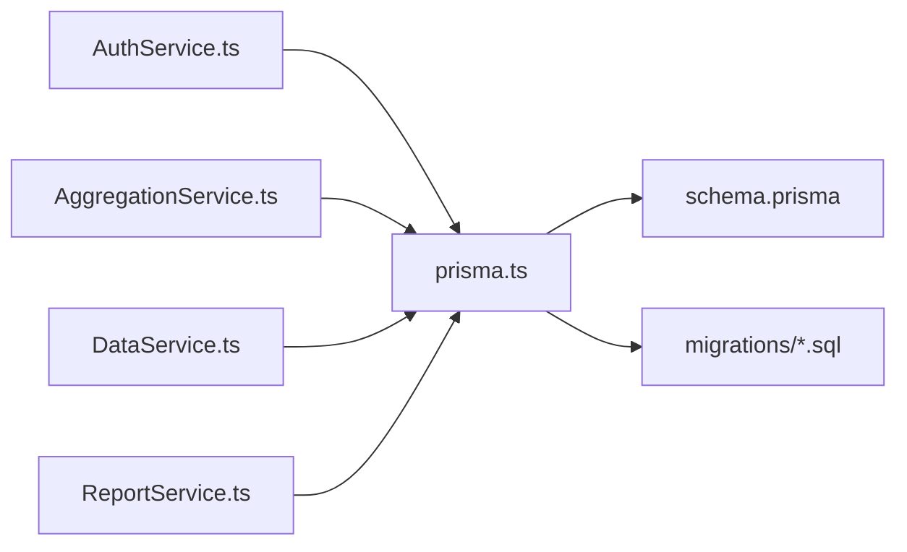

# 性能优化与索引设计

<cite>
**本文引用的文件**   
- [postgresql.conf](file://server/.pgdata/postgresql.conf)
- [schema.prisma](file://server/prisma/schema.prisma)
- [prisma.ts](file://server/src/lib/prisma.ts)
- [performance.md](file://docs/references/performance.md)
- [Database-Schema.md](file://.wiki/Database-Schema.md)
- [20260722121714_init/migration.sql](file://server/prisma/migrations/20260722121714_init/migration.sql)
- [20260722142144_add_formula_rule/migration.sql](file://server/prisma/migrations/20260722142144_add_formula_rule/migration.sql)
- [20260723120000_add_subject_analysis/migration.sql](file://server/prisma/migrations/20260723120000_add_subject_analysis/migration.sql)
- [20260724120000_remove_business_unit_org_scope/migration.sql](file://server/prisma/migrations/20260724120000_remove_business_unit_org_scope/migration.sql)
- [AuthService.ts](file://server/src/services/AuthService.ts)
- [AggregationService.ts](file://server/src/services/AggregationService.ts)
- [DataService.ts](file://server/src/services/DataService.ts)
- [ReportService.ts](file://server/src/services/ReportService.ts)
</cite>

## 目录
1. [简介](#简介)
2. [项目结构](#项目结构)
3. [核心组件](#核心组件)
4. [架构总览](#架构总览)
5. [详细组件分析](#详细组件分析)
6. [依赖关系分析](#依赖关系分析)
7. [性能考量](#性能考量)
8. [故障排查指南](#故障排查指南)
9. [结论](#结论)
10. [附录](#附录)

## 简介
本文件面向FY200数据库（PostgreSQL 15）的性能优化，聚焦索引设计策略、查询优化技巧、PostgreSQL配置调优、Prisma查询优化、分库分表与读写分离、监控指标采集、数据归档清理以及瓶颈定位方法。文档结合项目现有代码与迁移脚本，给出可落地的实践建议与可视化说明，帮助读者快速定位并解决数据库性能问题。

## 项目结构
后端采用Express + Prisma + PostgreSQL技术栈，数据库定义与迁移位于server/prisma目录，运行时PostgreSQL实例配置位于server/.pgdata。服务层通过Prisma客户端访问数据库，中间件链负责鉴权、权限、范围控制与审计等。

图表来源
- [schema.prisma](file://server/prisma/schema.prisma)
- [prisma.ts](file://server/src/lib/prisma.ts)
- [postgresql.conf](file://server/.pgdata/postgresql.conf)

章节来源
- [schema.prisma](file://server/prisma/schema.prisma)
- [prisma.ts](file://server/src/lib/prisma.ts)
- [postgresql.conf](file://server/.pgdata/postgresql.conf)

## 核心组件
- 数据库模型与索引：由Prisma schema定义，并通过迁移脚本生成DDL。当前仓库包含初始化及若干业务扩展的迁移，涵盖公式规则、科目分析、组织范围调整等。
- 服务层查询：认证、聚合计算、数据导入导出、报表生成等场景涉及不同复杂度SQL，需结合EXPLAIN分析与索引策略优化。
- 连接与配置：Prisma客户端连接参数与PostgreSQL服务器参数共同决定内存、并发与缓存行为。

章节来源
- [schema.prisma](file://server/prisma/schema.prisma)
- [20260722121714_init/migration.sql](file://server/prisma/migrations/20260722121714_init/migration.sql)
- [20260722142144_add_formula_rule/migration.sql](file://server/prisma/migrations/20260722142144_add_formula_rule/migration.sql)
- [20260723120000_add_subject_analysis/migration.sql](file://server/prisma/migrations/20260723120000_add_subject_analysis/migration.sql)
- [20260724120000_remove_business_unit_org_scope/migration.sql](file://server/prisma/migrations/20260724120000_remove_business_unit_org_scope/migration.sql)

## 架构总览
下图展示从HTTP请求到数据库查询的关键路径，突出Prisma扩展（scope）对查询条件的注入与审计日志记录点。

图表来源
- [AuthService.ts](file://server/src/services/AuthService.ts)
- [AggregationService.ts](file://server/src/services/AggregationService.ts)
- [DataService.ts](file://server/src/services/DataService.ts)
- [ReportService.ts](file://server/src/services/ReportService.ts)
- [prisma.ts](file://server/src/lib/prisma.ts)

## 详细组件分析

### 索引设计与策略
- 单列索引
  - 适用场景：高频过滤条件为单一字段（如公司ID、科目ID、时间范围中的年/月），且选择性较高。
  - 注意事项：避免在低选择性字段上建过多索引；注意更新开销与写入放大。
- 复合索引
  - 适用场景：多条件联合过滤或排序（如company_id + year + month），遵循最左前缀原则。
  - 设计要点：将区分度高的列放在前面；尽量覆盖常用查询的WHERE与ORDER BY。
- 唯一索引
  - 适用场景：保证业务唯一性（如公司+科目+期间组合唯一），同时提升查询性能。
  - 注意事项：唯一约束会引入插入校验成本，需评估写入负载。
- 函数/表达式索引
  - 适用场景：对字符串或日期进行规范化后查询（如lower(name)、date_trunc('month', created_at)）。
  - 注意事项：仅在确有稳定查询模式时启用，避免过度维护。

章节来源
- [schema.prisma](file://server/prisma/schema.prisma)
- [20260722121714_init/migration.sql](file://server/prisma/migrations/20260722121714_init/migration.sql)
- [20260722142144_add_formula_rule/migration.sql](file://server/prisma/migrations/20260722142144_add_formula_rule/migration.sql)
- [20260723120000_add_subject_analysis/migration.sql](file://server/prisma/migrations/20260723120000_add_subject_analysis/migration.sql)
- [20260724120000_remove_business_unit_org_scope/migration.sql](file://server/prisma/migrations/20260724120000_remove_business_unit_org_scope/migration.sql)

### 查询优化技巧
- EXPLAIN分析
  - 使用EXPLAIN/EXPLAIN ANALYZE观察执行计划，关注Seq Scan、Index Scan、Nested Loop、Hash Join等节点。
  - 识别全表扫描、回表频繁、临时表与外部排序等热点。
- 慢查询识别
  - 开启log_min_duration_statement收集慢查询；配合pg_stat_statements统计Top N语句。
  - 结合应用层埋点与链路追踪，定位高耗时接口。
- 查询重写
  - 将OR改写为UNION ALL（若可索引）；避免在WHERE中对列做函数运算。
  - 合理使用JOIN顺序与条件前置，减少中间结果集大小。
  - 分页查询优先使用基于主键或有序索引的游标式分页。

章节来源
- [performance.md](file://docs/references/performance.md)
- [AuthService.ts](file://server/src/services/AuthService.ts)
- [AggregationService.ts](file://server/src/services/AggregationService.ts)
- [DataService.ts](file://server/src/services/DataService.ts)
- [ReportService.ts](file://server/src/services/ReportService.ts)

### PostgreSQL配置优化参数
- 内存分配
  - shared_buffers：通常为物理内存的25%左右（根据实例规模调整）。
  - effective_cache_size：预估操作系统缓存可用量，通常设为物理内存的50%-75%。
  - work_mem：单次操作（排序、哈希）可用内存，按并发查询数谨慎设置。
  - maintenance_work_mem：VACUUM、CREATE INDEX等维护操作内存。
- 连接池与并发
  - max_connections：限制最大连接数，结合应用侧连接池上限。
  - superuser_reserved_connections：保留管理员连接。
- 缓存策略
  - random_page_cost/effective_io_concurrency：影响随机IO成本估计与并发I/O。
  - checkpoint相关参数：checkpoint_timeout、max_wal_size，平衡写入吞吐与恢复时间。
- 监控与诊断
  - log_min_duration_statement：记录慢查询阈值。
  - pg_stat_statements：启用并定期分析Top SQL。
  - autovacuum：确保自动清理与统计信息更新正常。

章节来源
- [postgresql.conf](file://server/.pgdata/postgresql.conf)
- [performance.md](file://docs/references/performance.md)

### Prisma查询优化方法
- select投影
  - 仅选择必要字段，减少网络传输与对象映射开销。
  - 对大字段（文本/JSON）按需加载，避免默认拉取全部列。
- where条件优化
  - 使用精确匹配与范围查询，避免对列使用函数导致索引失效。
  - 将高频过滤条件置于外层，减少JOIN前的数据量。
- 关联查询优化
  - 合理拆分复杂关联为多次简单查询，必要时使用批量查询（findMany + in）。
  - 利用Prisma扩展注入scope条件，确保行级安全的同时不破坏索引使用。
- 事务与批处理
  - 批量写入使用事务包裹，减少提交开销。
  - 长事务避免持有锁过久，拆分为短事务分批处理。

章节来源
- [prisma.ts](file://server/src/lib/prisma.ts)
- [AuthService.ts](file://server/src/services/AuthService.ts)
- [AggregationService.ts](file://server/src/services/AggregationService.ts)
- [DataService.ts](file://server/src/services/DataService.ts)
- [ReportService.ts](file://server/src/services/ReportService.ts)

### 分库分表策略与读写分离
- 分库分表
  - 按业务域或租户维度分库（如公司/事业部），降低单库压力。
  - 按时间维度分表（如按月/季度），便于归档与清理。
  - 路由层统一抽象，屏蔽底层分片细节。
- 读写分离
  - 写库承担INSERT/UPDATE/DELETE，读库承担SELECT。
  - 通过代理或ORM扩展实现自动路由，确保一致性要求。
- 迁移与扩容
  - 灰度迁移与双写验证，逐步切流；预留扩容空间与再平衡策略。

章节来源
- [performance.md](file://docs/references/performance.md)

### 性能监控工具与指标采集
- 系统级指标
  - CPU、内存、磁盘I/O、网络带宽与延迟。
- 数据库级指标
  - 连接数、锁等待、死锁、缓冲命中率、检查点频率、WAL增长。
  - 慢查询数量、Top SQL、索引命中率、表膨胀率。
- 应用级指标
  - 接口P95/P99延迟、错误率、数据库调用耗时分布。
- 工具推荐
  - pg_stat_statements、pg_stat_activity、EXPLAIN ANALYZE、Prometheus + Grafana、APM工具。

章节来源
- [performance.md](file://docs/references/performance.md)

### 数据归档与清理策略
- 归档策略
  - 按时间窗口（月/季/年）将历史数据迁移至归档库或冷存储。
  - 保留必要的统计摘要与审计轨迹，满足合规与回溯需求。
- 清理策略
  - 定期VACUUM与ANALYZE，重建碎片化索引。
  - 删除过期日志与临时数据，控制表膨胀。
- 自动化流程
  - 定时任务驱动归档与清理，失败重试与告警机制。

章节来源
- [performance.md](file://docs/references/performance.md)

### 瓶颈识别与解决方法
- 常见瓶颈
  - 索引缺失或不合理导致全表扫描；锁竞争与长事务；连接池耗尽；内存不足引发磁盘排序。
- 定位方法
  - EXPLAIN ANALYZE分析热点SQL；查看pg_stat_activity与锁视图；监控连接池与队列长度。
- 解决思路
  - 补充或重构索引；优化查询逻辑；调整work_mem与shared_buffers；拆分长事务；引入缓存与异步处理。

章节来源
- [performance.md](file://docs/references/performance.md)

## 依赖关系分析
服务层与Prisma客户端之间的依赖清晰，Prisma作为数据访问抽象层，屏蔽SQL细节。迁移脚本与schema保持同步，确保DDL变更可追溯。

图表来源
- [AuthService.ts](file://server/src/services/AuthService.ts)
- [AggregationService.ts](file://server/src/services/AggregationService.ts)
- [DataService.ts](file://server/src/services/DataService.ts)
- [ReportService.ts](file://server/src/services/ReportService.ts)
- [prisma.ts](file://server/src/lib/prisma.ts)
- [schema.prisma](file://server/prisma/schema.prisma)
- [20260722121714_init/migration.sql](file://server/prisma/migrations/20260722121714_init/migration.sql)

章节来源
- [prisma.ts](file://server/src/lib/prisma.ts)
- [schema.prisma](file://server/prisma/schema.prisma)
- [20260722121714_init/migration.sql](file://server/prisma/migrations/20260722121714_init/migration.sql)

## 性能考量
- 索引维护成本与查询收益的权衡，避免过度索引。
- 连接池大小与数据库max_connections匹配，防止连接风暴。
- 内存参数按工作负载调优，避免频繁磁盘IO。
- 复杂聚合与报表查询考虑物化视图或预计算，减轻实时压力。
- 读写分离与分库分表需结合数据一致性与运维复杂度综合评估。

[本节为通用指导，无需特定文件引用]

## 故障排查指南
- 慢查询定位
  - 开启慢查询日志，结合pg_stat_statements统计Top SQL。
  - 使用EXPLAIN ANALYZE分析执行计划，识别全表扫描与低效JOIN。
- 锁与阻塞
  - 查看pg_locks与pg_stat_activity，定位阻塞链与长事务。
  - 优化事务粒度，避免跨模块长事务。
- 连接池耗尽
  - 检查应用连接池配置与释放逻辑，修复未关闭连接。
  - 调整max_connections与连接池上限，增加超时与熔断。
- 内存与缓存
  - 调整work_mem与shared_buffers，监控临时文件生成。
  - 检查random_page_cost与effective_io_concurrency是否合理。

章节来源
- [performance.md](file://docs/references/performance.md)
- [postgresql.conf](file://server/.pgdata/postgresql.conf)

## 结论
通过合理的索引设计、查询重写与Prisma最佳实践，结合PostgreSQL参数调优与完善的监控体系，可显著提升FY200数据库性能。分库分表与读写分离适用于大规模数据与高并发场景，但需谨慎评估一致性与运维成本。持续监控与迭代优化是保障长期稳定性的关键。

[本节为总结性内容，无需特定文件引用]

## 附录
- 参考文档
  - [Database-Schema.md](file://.wiki/Database-Schema.md)
  - [performance.md](file://docs/references/performance.md)
- 迁移脚本清单
  - [20260722121714_init/migration.sql](file://server/prisma/migrations/20260722121714_init/migration.sql)
  - [20260722142144_add_formula_rule/migration.sql](file://server/prisma/migrations/20260722142144_add_formula_rule/migration.sql)
  - [20260723120000_add_subject_analysis/migration.sql](file://server/prisma/migrations/20260723120000_add_subject_analysis/migration.sql)
  - [20260724120000_remove_business_unit_org_scope/migration.sql](file://server/prisma/migrations/20260724120000_remove_business_unit_org_scope/migration.sql)