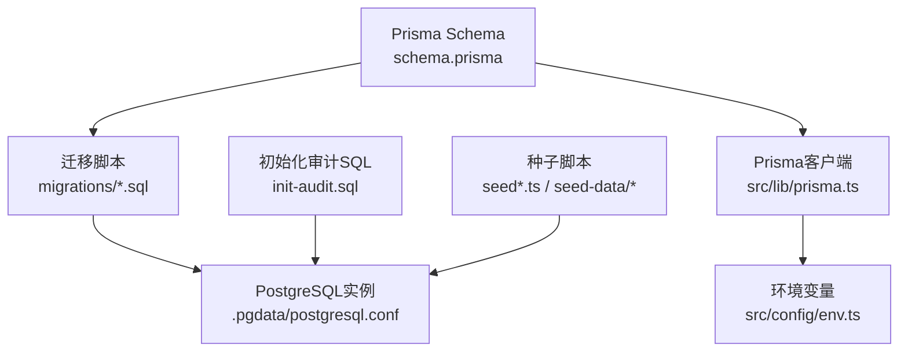
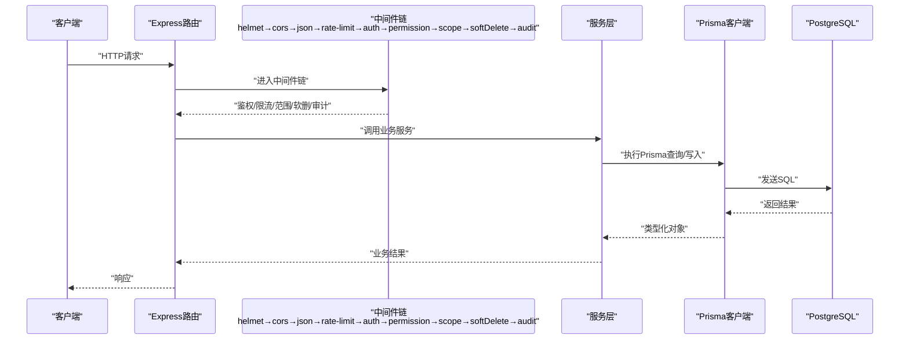
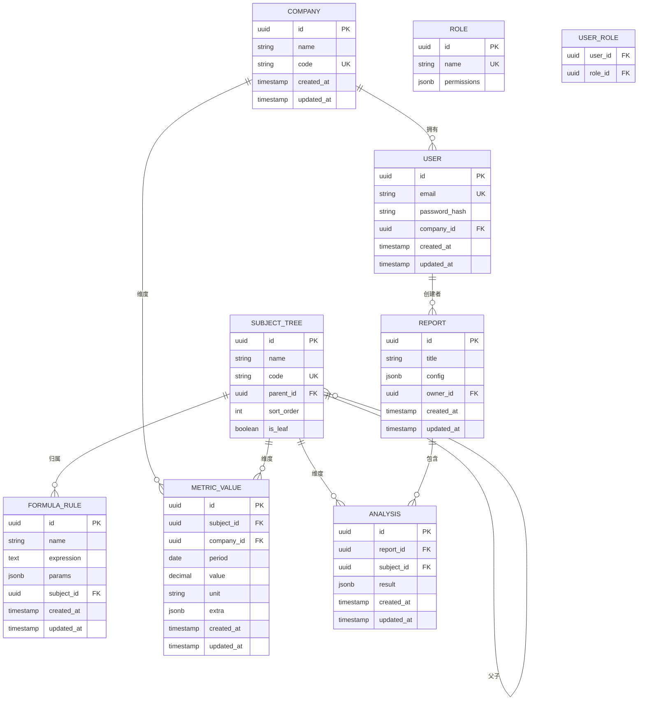
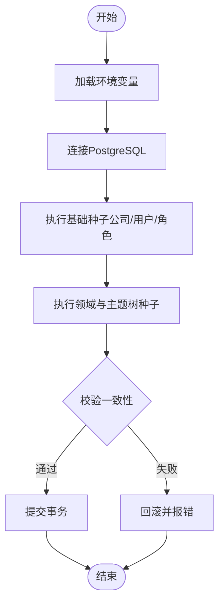
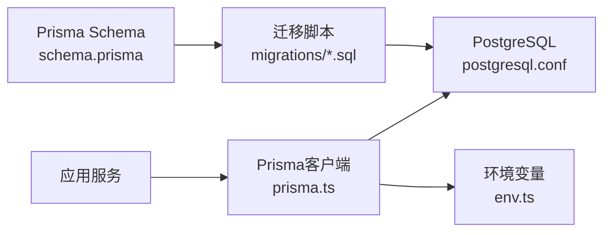

# 数据库设计

<cite>
**本文引用的文件**   
- [server/prisma/schema.prisma](file://server/prisma/schema.prisma)
- [server/prisma/migrations/20260722121714_init/migration.sql](file://server/prisma/migrations/20260722121714_init/migration.sql)
- [server/prisma/migrations/20260722142144_add_formula_rule/migration.sql](file://server/prisma/migrations/20260722142144_add_formula_rule/migration.sql)
- [server/prisma/migrations/20260723120000_add_subject_analysis/migration.sql](file://server/prisma/migrations/20260723120000_add_subject_analysis/migration.sql)
- [server/prisma/migrations/20260724120000_remove_business_unit_org_scope/migration.sql](file://server/prisma/migrations/20260724120000_remove_business_unit_org_scope/migration.sql)
- [server/prisma/migrations/migration_lock.toml](file://server/prisma/migrations/migration_lock.toml)
- [server/prisma/init-audit.sql](file://server/prisma/init-audit.sql)
- [server/prisma/seed.ts](file://server/prisma/seed.ts)
- [server/prisma/seed-companies.ts](file://server/prisma/seed-companies.ts)
- [server/prisma/seed-domain.ts](file://server/prisma/seed-domain.ts)
- [server/prisma/seed-data/subject-trees.ts](file://server/prisma/seed-data/subject-trees.ts)
- [server/src/lib/prisma.ts](file://server/src/lib/prisma.ts)
- [server/src/config/env.ts](file://server/src/config/env.ts)
- [server/.pgdata/postgresql.conf](file://server/.pgdata/postgresql.conf)
- [server/.pgdata/pg_hba.conf](file://server/.pgdata/pg_hba.conf)
- [docs/plans/数据模型规范.md](file://docs/plans/数据模型规范.md)
- [docs/plans/安全与权限规范.md](file://docs/plans/安全与权限规范.md)
</cite>

## 目录
1. [引言](#引言)
2. [项目结构](#项目结构)
3. [核心组件](#核心组件)
4. [架构总览](#架构总览)
5. [详细组件分析](#详细组件分析)
6. [依赖关系分析](#依赖关系分析)
7. [性能考虑](#性能考虑)
8. [故障排查指南](#故障排查指南)
9. [结论](#结论)
10. [附录](#附录)

## 引言
本文件面向FY200财年经营数据分析平台的数据库设计与实现，聚焦Prisma模型定义、实体关系、字段与数据类型、主外键约束、索引与查询优化、数据验证与业务规则在数据库层的落地、生命周期管理（保留与归档）、迁移路径与版本管理、数据安全与隐私保护、访问控制、种子数据生成与管理，以及PostgreSQL配置与性能调优建议。文档以仓库中的Prisma Schema、迁移脚本、初始化SQL、种子脚本、环境变量与PG配置文件为依据进行系统化梳理，并辅以ER图、类图、时序图与流程图帮助理解。

## 项目结构
与数据库相关的关键位置：
- Prisma模型与迁移：server/prisma/schema.prisma 与 server/prisma/migrations/*
- 数据库初始化审计表：server/prisma/init-audit.sql
- 种子数据脚本：server/prisma/seed*.ts 与 seed-data/*
- Prisma客户端与环境变量：server/src/lib/prisma.ts、server/src/config/env.ts
- PostgreSQL配置：server/.pgdata/postgresql.conf、server/.pgdata/pg_hba.conf
- 数据模型与安全规范参考：docs/plans/数据模型规范.md、docs/plans/安全与权限规范.md

图表来源
- [server/prisma/schema.prisma](file://server/prisma/schema.prisma)
- [server/prisma/migrations/20260722121714_init/migration.sql](file://server/prisma/migrations/20260722121714_init/migration.sql)
- [server/src/lib/prisma.ts](file://server/src/lib/prisma.ts)
- [server/src/config/env.ts](file://server/src/config/env.ts)
- [server/.pgdata/postgresql.conf](file://server/.pgdata/postgresql.conf)
- [server/prisma/init-audit.sql](file://server/prisma/init-audit.sql)
- [server/prisma/seed.ts](file://server/prisma/seed.ts)

章节来源
- [server/prisma/schema.prisma](file://server/prisma/schema.prisma)
- [server/src/lib/prisma.ts](file://server/src/lib/prisma.ts)
- [server/src/config/env.ts](file://server/src/config/env.ts)
- [server/.pgdata/postgresql.conf](file://server/.pgdata/postgresql.conf)

## 核心组件
- Prisma模型层：统一描述实体、字段、关系、约束与索引，作为数据库Schema的单一事实源。
- 迁移系统：按时间戳命名迁移，保证增量变更可追踪、可回滚。
- 初始化脚本：为审计等基础设施表提供DDL或初始数据。
- 种子数据：用于开发/测试环境快速填充基础数据（公司、主题树、领域等）。
- 客户端与环境：Prisma客户端通过环境变量连接PostgreSQL，确保连接池与超时策略一致。

章节来源
- [server/prisma/schema.prisma](file://server/prisma/schema.prisma)
- [server/prisma/migrations/20260722121714_init/migration.sql](file://server/prisma/migrations/20260722121714_init/migration.sql)
- [server/prisma/init-audit.sql](file://server/prisma/init-audit.sql)
- [server/prisma/seed.ts](file://server/prisma/seed.ts)
- [server/src/lib/prisma.ts](file://server/src/lib/prisma.ts)
- [server/src/config/env.ts](file://server/src/config/env.ts)

## 架构总览
下图展示从应用到数据库的数据流与控制流，体现中间件链对权限、范围、软删除与审计的影响，以及Prisma如何映射到PostgreSQL。

图表来源
- [server/src/lib/prisma.ts](file://server/src/lib/prisma.ts)
- [server/src/config/env.ts](file://server/src/config/env.ts)
- [server/.pgdata/postgresql.conf](file://server/.pgdata/postgresql.conf)

## 详细组件分析

### 数据模型与实体关系（ER图）
基于Prisma Schema与迁移脚本，FY200的核心实体包括：公司、组织/部门、用户与角色、指标主题树、公式规则、指标值、报表与分析等。以下为概念性ER图（以实际Schema为准）：

图表来源
- [server/prisma/schema.prisma](file://server/prisma/schema.prisma)
- [server/prisma/migrations/20260722121714_init/migration.sql](file://server/prisma/migrations/20260722121714_init/migration.sql)
- [server/prisma/migrations/20260722142144_add_formula_rule/migration.sql](file://server/prisma/migrations/20260722142144_add_formula_rule/migration.sql)
- [server/prisma/migrations/20260723120000_add_subject_analysis/migration.sql](file://server/prisma/migrations/20260723120000_add_subject_analysis/migration.sql)
- [server/prisma/migrations/20260724120000_remove_business_unit_org_scope/migration.sql](file://server/prisma/migrations/20260724120000_remove_business_unit_org_scope/migration.sql)

章节来源
- [server/prisma/schema.prisma](file://server/prisma/schema.prisma)
- [server/prisma/migrations/20260722121714_init/migration.sql](file://server/prisma/migrations/20260722121714_init/migration.sql)
- [server/prisma/migrations/20260722142144_add_formula_rule/migration.sql](file://server/prisma/migrations/20260722142144_add_formula_rule/migration.sql)
- [server/prisma/migrations/20260723120000_add_subject_analysis/migration.sql](file://server/prisma/migrations/20260723120000_add_subject_analysis/migration.sql)
- [server/prisma/migrations/20260724120000_remove_business_unit_org_scope/migration.sql](file://server/prisma/migrations/20260724120000_remove_business_unit_org_scope/migration.sql)

### 主键/外键约束与索引设计
- 主键：所有实体采用UUID作为主键，避免自增ID带来的泄露风险与热点写入。
- 唯一约束：公司编码、用户邮箱、主题树编码等使用唯一索引，保障业务主数据的唯一性。
- 外键约束：指标值、报表、分析等关联表通过外键维护引用完整性；主题树通过parent_id自引用形成层级。
- 索引策略：
  - 高频查询列建立B-tree索引，如METRIC_VALUE(company_id, subject_id, period)复合索引，支撑看板聚合与筛选。
  - 文本模糊检索可使用GIN索引（若引入JSONB或全文检索）。
  - 审计表按时间分区或建立时间索引，便于归档与清理。
- 约束校验：在Schema层声明NOT NULL、CHECK等约束，减少脏数据入库。

章节来源
- [server/prisma/schema.prisma](file://server/prisma/schema.prisma)
- [server/prisma/migrations/20260722121714_init/migration.sql](file://server/prisma/migrations/20260722121714_init/migration.sql)
- [server/prisma/migrations/20260722142144_add_formula_rule/migration.sql](file://server/prisma/migrations/20260722142144_add_formula_rule/migration.sql)
- [server/prisma/migrations/20260723120000_add_subject_analysis/migration.sql](file://server/prisma/migrations/20260723120000_add_subject_analysis/migration.sql)

### 数据验证规则与业务规则（数据库级）
- 字段级验证：
  - 金额字段使用DECIMAL(18,2)，单位统一为万元/人民币，禁止浮点误差。
  - 日期字段使用DATE，周期粒度明确（月/季/年），避免时区问题。
  - JSONB字段用于扩展属性，配合后端校验器限制结构与取值范围。
- 业务规则：
  - 公式规则表达式仅允许白名单算子（+-*/()），由服务端解析执行，不直接落库危险代码。
  - 同比/环比在后端实时计算，不持久化，避免冗余与不一致。
  - 软删除通过中间件与扩展实现，逻辑删除而非物理删除，保留历史追溯。
- 审计：
  - init-audit.sql提供审计表结构，记录关键操作轨迹，满足合规要求。

章节来源
- [server/prisma/schema.prisma](file://server/prisma/schema.prisma)
- [server/prisma/init-audit.sql](file://server/prisma/init-audit.sql)
- [docs/plans/数据模型规范.md](file://docs/plans/数据模型规范.md)

### 数据生命周期管理（保留与归档）
- 保留策略：
  - 指标值按公司+主题+周期维度保留，历史数据不可篡改，支持回溯。
  - 审计日志按时间滚动归档，超过保留期的数据转入冷存储或压缩归档。
- 归档规则：
  - 对超期报表与分析结果进行归档，保留必要元数据，原始明细可脱敏后归档。
  - 归档数据通过独立表或分区隔离，查询走归档路径。
- 清理任务：
  - 定时任务扫描过期数据，批量移动至归档表，释放热空间。

章节来源
- [server/prisma/init-audit.sql](file://server/prisma/init-audit.sql)
- [docs/plans/数据模型规范.md](file://docs/plans/数据模型规范.md)

### 数据迁移路径与版本管理
- 迁移命名：YYYYMMDDHHMMSS_描述.sql，保证顺序性与可读性。
- 版本锁定：migration_lock.toml锁定已应用迁移，防止漂移。
- 演进路径：
  - 初始模型建表与索引
  - 新增公式规则表与关联
  - 新增科目分析与报表关联
  - 移除业务单元/组织范围相关字段（简化权限模型）
- 回滚策略：每个迁移保持幂等，必要时提供反向迁移脚本。

章节来源
- [server/prisma/migrations/20260722121714_init/migration.sql](file://server/prisma/migrations/20260722121714_init/migration.sql)
- [server/prisma/migrations/20260722142144_add_formula_rule/migration.sql](file://server/prisma/migrations/20260722142144_add_formula_rule/migration.sql)
- [server/prisma/migrations/20260723120000_add_subject_analysis/migration.sql](file://server/prisma/migrations/20260723120000_add_subject_analysis/migration.sql)
- [server/prisma/migrations/20260724120000_remove_business_unit_org_scope/migration.sql](file://server/prisma/migrations/20260724120000_remove_business_unit_org_scope/migration.sql)
- [server/prisma/migrations/migration_lock.toml](file://server/prisma/migrations/migration_lock.toml)

### 数据安全、隐私保护与访问控制
- 传输与存储加密：HTTPS强制，敏感字段（密码哈希、令牌）不落明文。
- 鉴权与授权：JWT短期access令牌+长期refresh轮转；权限模型基于角色与资源范围，默认拒绝。
- 数据脱敏：AI管道中绝对金额映射为区间，公司名称动态映射，避免泄露。
- 访问控制：通过中间件scope扩展将公司/组织范围注入查询，确保多租户隔离。
- 审计：关键操作记录审计表，支持事后追溯。

章节来源
- [docs/plans/安全与权限规范.md](file://docs/plans/安全与权限规范.md)
- [server/prisma/init-audit.sql](file://server/prisma/init-audit.sql)

### 种子数据生成与管理
- 种子脚本职责：
  - seed.ts：初始化基础数据（公司、用户、角色等）
  - seed-companies.ts：批量导入公司数据
  - seed-domain.ts：初始化领域与主题树
  - seed-data/subject-trees.ts：预置指标主题树结构
- 执行流程：
  - 清空或合并已有种子数据
  - 按依赖顺序插入（先公司，再用户/角色，再主题树，最后指标模板）
  - 校验唯一性与完整性，失败即回滚

图表来源
- [server/prisma/seed.ts](file://server/prisma/seed.ts)
- [server/prisma/seed-companies.ts](file://server/prisma/seed-companies.ts)
- [server/prisma/seed-domain.ts](file://server/prisma/seed-domain.ts)
- [server/prisma/seed-data/subject-trees.ts](file://server/prisma/seed-data/subject-trees.ts)
- [server/src/config/env.ts](file://server/src/config/env.ts)

章节来源
- [server/prisma/seed.ts](file://server/prisma/seed.ts)
- [server/prisma/seed-companies.ts](file://server/prisma/seed-companies.ts)
- [server/prisma/seed-domain.ts](file://server/prisma/seed-domain.ts)
- [server/prisma/seed-data/subject-trees.ts](file://server/prisma/seed-data/subject-trees.ts)
- [server/src/config/env.ts](file://server/src/config/env.ts)

### PostgreSQL配置优化与性能调优建议
- 连接与并发：
  - 调整max_connections与work_mem，结合Prisma连接池大小，避免连接风暴。
  - 启用prepared statements，减少解析开销。
- 内存与缓存：
  - shared_buffers设为物理内存的25%左右，effective_cache_size合理估算。
  - maintenance_work_mem提升VACUUM与索引构建速度。
- I/O与WAL：
  - checkpoint_completion_target与wal_buffers优化写入吞吐。
  - 合理设置fsync与synchronous_commit，权衡一致性与性能。
- 查询优化：
  - 针对高频查询建立合适索引，定期analyze统计信息。
  - 使用EXPLAIN/EXPLAIN ANALYZE定位慢查询，避免全表扫描。
- 监控与诊断：
  - 启用pg_stat_statements，跟踪热点SQL。
  - 定期VACUUM与REINDEX，保持表健康。

章节来源
- [server/.pgdata/postgresql.conf](file://server/.pgdata/postgresql.conf)
- [server/.pgdata/pg_hba.conf](file://server/.pgdata/pg_hba.conf)

## 依赖关系分析
Prisma Schema是数据库结构的权威来源，迁移脚本由Schema生成并逐步应用到PostgreSQL；应用通过Prisma客户端访问数据库，环境变量决定连接参数。

图表来源
- [server/prisma/schema.prisma](file://server/prisma/schema.prisma)
- [server/prisma/migrations/20260722121714_init/migration.sql](file://server/prisma/migrations/20260722121714_init/migration.sql)
- [server/src/lib/prisma.ts](file://server/src/lib/prisma.ts)
- [server/src/config/env.ts](file://server/src/config/env.ts)
- [server/.pgdata/postgresql.conf](file://server/.pgdata/postgresql.conf)

章节来源
- [server/prisma/schema.prisma](file://server/prisma/schema.prisma)
- [server/src/lib/prisma.ts](file://server/src/lib/prisma.ts)
- [server/src/config/env.ts](file://server/src/config/env.ts)
- [server/.pgdata/postgresql.conf](file://server/.pgdata/postgresql.conf)

## 性能考虑
- 查询层面：
  - 优先使用覆盖索引与复合索引，减少回表。
  - 避免SELECT *，只取必要字段，降低网络与序列化开销。
  - 分页查询使用游标或基于主键的范围查询，避免OFFSET深分页。
- 写入层面：
  - 批量写入使用事务与UPSERT，减少锁竞争。
  - 异步计算指标值，避免阻塞主链路。
- 缓存层面：
  - 对热点看板数据使用Redis缓存，设置合理TTL与失效策略。
- 监控层面：
  - 采集慢查询日志与指标，持续优化。

[本节为通用指导，不直接分析具体文件]

## 故障排查指南
- 连接失败：检查环境变量DATABASE_URL、pg_hba.conf认证方式与防火墙。
- 迁移冲突：核对migration_lock与已应用迁移，必要时手动修复状态。
- 权限不足：确认用户角色与资源范围，检查中间件scope注入是否正确。
- 慢查询：使用EXPLAIN分析执行计划，补充索引或改写SQL。
- 审计缺失：确认审计中间件与init-audit.sql是否生效。

章节来源
- [server/src/config/env.ts](file://server/src/config/env.ts)
- [server/.pgdata/pg_hba.conf](file://server/.pgdata/pg_hba.conf)
- [server/prisma/init-audit.sql](file://server/prisma/init-audit.sql)

## 结论
FY200数据库设计以Prisma为核心，结合严格的迁移管理与审计机制，构建了安全、可扩展且高性能的数据底座。通过合理的索引与约束、清晰的实体关系与生命周期策略，以及完善的种子数据与配置优化，平台能够稳定支撑财年经营数据的采集、计算与可视化。后续应持续关注慢查询治理、归档策略落地与容量规划，确保系统长期稳健运行。

[本节为总结性内容，不直接分析具体文件]

## 附录
- 术语表：
  - 指标值：按公司、主题、周期记录的数值型数据。
  - 公式规则：用于计算衍生指标的表达式与参数。
  - 主题树：指标的分类与层级结构。
  - 审计：记录关键操作的日志表。
- 参考规范：
  - 数据模型规范：docs/plans/数据模型规范.md
  - 安全与权限规范：docs/plans/安全与权限规范.md

[本节为补充信息，不直接分析具体文件]