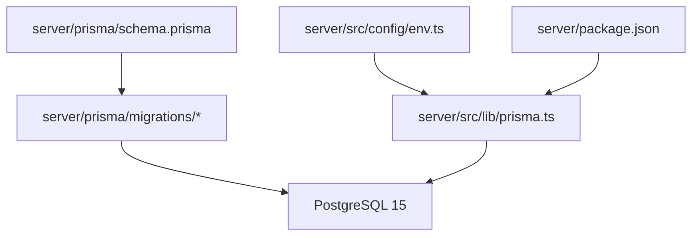
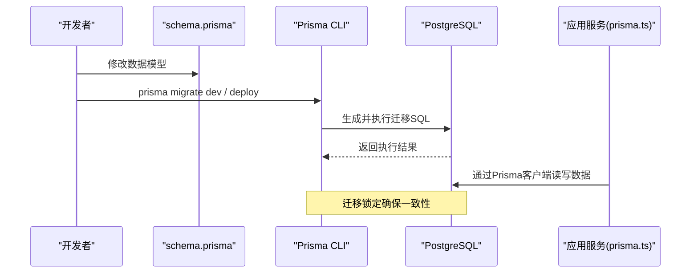
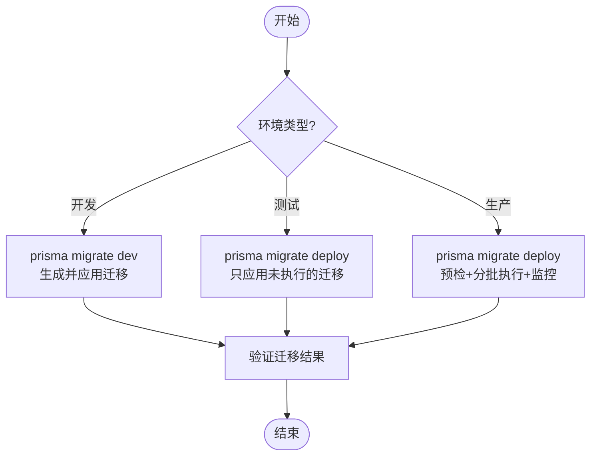
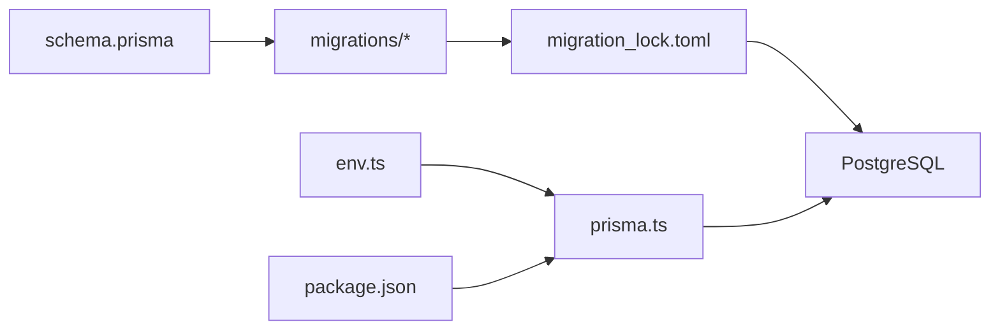

# 数据库迁移管理

<cite>
**本文引用的文件**   
- [schema.prisma](file://server/prisma/schema.prisma)
- [migration_lock.toml](file://server/prisma/migrations/migration_lock.toml)
- [20260722121714_init/migration.sql](file://server/prisma/migrations/20260722121714_init/migration.sql)
- [20260722142144_add_formula_rule/migration.sql](file://server/prisma/migrations/20260722142144_add_formula_rule/migration.sql)
- [20260723120000_add_subject_analysis/migration.sql](file://server/prisma/migrations/20260723120000_add_subject_analysis/migration.sql)
- [20260724120000_remove_business_unit_org_scope/migration.sql](file://server/prisma/migrations/20260724120000_remove_business_unit_org_scope/migration.sql)
- [prisma.ts](file://server/src/lib/prisma.ts)
- [env.ts](file://server/src/config/env.ts)
- [package.json](file://server/package.json)
</cite>

## 目录
1. [简介](#简介)
2. [项目结构](#项目结构)
3. [核心组件](#核心组件)
4. [架构总览](#架构总览)
5. [详细组件分析](#详细组件分析)
6. [依赖关系分析](#依赖关系分析)
7. [性能考虑](#性能考虑)
8. [故障排查指南](#故障排查指南)
9. [结论](#结论)
10. [附录](#附录)

## 简介
本文件面向FY200项目的数据库迁移管理，聚焦Prisma Migrate在PostgreSQL上的工作原理、版本控制策略与执行流程。文档覆盖命名规范、SQL编写规范、开发/测试/生产环境迁移策略、冲突处理与回滚、最佳实践（增量更新、数据备份、迁移验证）、常见场景示例（添加字段、修改表结构、重建索引）、迁移锁机制与并发控制，以及可重复执行的迁移脚本编写方法。内容基于仓库中的Prisma配置与迁移文件进行归纳总结，确保与实际实现一致。

## 项目结构
本项目在后端server目录下使用Prisma进行数据库建模与迁移管理：
- Prisma Schema定义位于 server/prisma/schema.prisma
- 迁移历史位于 server/prisma/migrations，每个迁移为一个带时间戳前缀的目录，内含 migration.sql
- 迁移锁定文件位于 server/prisma/migrations/migration_lock.toml
- 应用启动时通过 server/src/lib/prisma.ts 初始化Prisma客户端，读取环境变量配置数据库连接
- 环境变量由 server/src/config/env.ts 提供统一访问
- 包管理与脚本入口位于 server/package.json

图表来源 
- [schema.prisma](file://server/prisma/schema.prisma)
- [prisma.ts](file://server/src/lib/prisma.ts)
- [env.ts](file://server/src/config/env.ts)
- [package.json](file://server/package.json)

章节来源
- [schema.prisma](file://server/prisma/schema.prisma)
- [prisma.ts](file://server/src/lib/prisma.ts)
- [env.ts](file://server/src/config/env.ts)
- [package.json](file://server/package.json)

## 核心组件
- Prisma Schema（schema.prisma）：声明数据模型、关系、枚举与生成代码的目标语言；是迁移生成的唯一权威来源。
- 迁移目录（migrations/*）：按时间戳命名的不可变迁移快照，包含对应SQL变更。
- 迁移锁定（migration_lock.toml）：记录当前迁移状态与校验信息，防止不一致的迁移序列。
- Prisma客户端（prisma.ts）：应用内数据库连接与事务管理入口。
- 环境变量（env.ts）：集中管理数据库连接串、迁移相关环境变量。
- 包脚本（package.json）：封装常用命令如 prisma migrate dev/status/deploy/reset 等。

章节来源
- [schema.prisma](file://server/prisma/schema.prisma)
- [migration_lock.toml](file://server/prisma/migrations/migration_lock.toml)
- [prisma.ts](file://server/src/lib/prisma.ts)
- [env.ts](file://server/src/config/env.ts)
- [package.json](file://server/package.json)

## 架构总览
Prisma Migrate的工作流如下：开发者修改 schema.prisma → 生成迁移快照（含SQL）→ 在目标环境执行迁移 → 数据库状态与迁移目录保持一致。应用运行时通过Prisma客户端访问数据库，所有DDL/DML均受迁移版本约束。

图表来源 
- [schema.prisma](file://server/prisma/schema.prisma)
- [prisma.ts](file://server/src/lib/prisma.ts)
- [migration_lock.toml](file://server/prisma/migrations/migration_lock.toml)

## 详细组件分析

### 迁移文件命名规范与版本控制
- 命名规则：每个迁移目录以“YYYYMMDDHHmmss_描述”命名，保证全局唯一且有序。
- 不可变性：已发布的迁移不得修改，新增变更应创建新的迁移目录。
- 版本控制：迁移目录顺序即为执行顺序，Prisma通过内部状态表记录已执行迁移。

章节来源
- [20260722121714_init/migration.sql](file://server/prisma/migrations/20260722121714_init/migration.sql)
- [20260722142144_add_formula_rule/migration.sql](file://server/prisma/migrations/20260722142144_add_formula_rule/migration.sql)
- [20260723120000_add_subject_analysis/migration.sql](file://server/prisma/migrations/20260723120000_add_subject_analysis/migration.sql)
- [20260724120000_remove_business_unit_org_scope/migration.sql](file://server/prisma/migrations/20260724120000_remove_business_unit_org_scope/migration.sql)

### SQL语句编写规范
- 仅允许DDL与必要的数据迁移SQL；避免在迁移中执行业务逻辑。
- 幂等性：尽量使用IF NOT EXISTS、条件判断或兼容旧结构的写法，确保可重复执行。
- 事务性：单个迁移建议包裹在事务中，失败整体回滚。
- 兼容性：对大表变更采用在线安全模式（例如PostgreSQL的CONCURRENTLY），避免长时间锁表。

章节来源
- [20260722142144_add_formula_rule/migration.sql](file://server/prisma/migrations/20260722142144_add_formula_rule/migration.sql)
- [20260723120000_add_subject_analysis/migration.sql](file://server/prisma/migrations/20260723120000_add_subject_analysis/migration.sql)
- [20260724120000_remove_business_unit_org_scope/migration.sql](file://server/prisma/migrations/20260724120000_remove_business_unit_org_scope/migration.sql)

### 迁移执行流程与环境策略
- 开发环境：使用 prisma migrate dev 同步本地数据库与schema，支持快速迭代与回滚。
- 测试环境：CI中执行 prisma migrate deploy 确保测试数据与schema一致。
- 生产环境：通过部署流水线执行 prisma migrate deploy，配合灰度发布与回滚预案。

章节来源
- [package.json](file://server/package.json)
- [prisma.ts](file://server/src/lib/prisma.ts)

### 迁移冲突与回滚操作
- 冲突检测：当本地迁移与远程不一致时，Prisma会拒绝应用并提示差异。
- 解决策略：优先合并schema变更，重新生成迁移；必要时使用 prisma migrate resolve 修复状态。
- 回滚：开发环境可使用 prisma migrate reset；生产环境需准备反向迁移与数据备份，谨慎执行。

章节来源
- [migration_lock.toml](file://server/prisma/migrations/migration_lock.toml)
- [package.json](file://server/package.json)

### 迁移锁机制与并发控制
- 迁移锁：migration_lock.toml记录迁移状态与校验信息，防止多进程同时写入导致不一致。
- 并发控制：在生产环境建议使用外部协调器（如分布式锁）确保同一时刻仅一个实例执行迁移。
- 事务边界：单个迁移应在事务内执行，失败自动回滚，保障原子性。

章节来源
- [migration_lock.toml](file://server/prisma/migrations/migration_lock.toml)

### 可重复执行的迁移脚本
- 幂等设计：使用IF NOT EXISTS、CASE WHEN、临时表等手段确保多次执行不改变最终状态。
- 版本标记：在迁移中记录版本号或特征列，便于后续检查与清理。
- 验证步骤：迁移后运行校验SQL或轻量查询，确认结构/数据符合预期。

章节来源
- [20260722142144_add_formula_rule/migration.sql](file://server/prisma/migrations/20260722142144_add_formula_rule/migration.sql)
- [20260723120000_add_subject_analysis/migration.sql](file://server/prisma/migrations/20260723120000_add_subject_analysis/migration.sql)

### 常见迁移场景示例
- 添加字段：为现有表增加新列，设置默认值与约束，必要时填充历史数据。
- 修改表结构：调整列类型、长度或约束，注意数据类型转换与数据迁移。
- 重建索引：删除旧索引并创建新索引，使用CONCURRENTLY避免阻塞写操作。
- 拆分/合并表：引入中间表或视图过渡，逐步迁移数据并切换引用。

章节来源
- [20260722142144_add_formula_rule/migration.sql](file://server/prisma/migrations/20260722142144_add_formula_rule/migration.sql)
- [20260723120000_add_subject_analysis/migration.sql](file://server/prisma/migrations/20260723120000_add_subject_analysis/migration.sql)
- [20260724120000_remove_business_unit_org_scope/migration.sql](file://server/prisma/migrations/20260724120000_remove_business_unit_org_scope/migration.sql)

### 最佳实践
- 增量更新：每次变更仅做最小化改动，保持迁移小而清晰。
- 数据备份：生产迁移前执行全量或增量备份，确保可恢复。
- 迁移验证：在预发环境充分验证，包括结构校验、数据完整性与性能回归。
- 文档化：在PR中说明迁移目的、影响范围与回滚方案。

[本节为通用指导，不直接分析具体文件]

## 依赖关系分析
Prisma迁移与应用的依赖关系如下：
- schema.prisma驱动迁移生成
- 迁移目录与migration_lock.toml共同维护数据库状态
- prisma.ts加载环境变量并建立数据库连接
- package.json提供迁移命令入口

图表来源 
- [schema.prisma](file://server/prisma/schema.prisma)
- [migration_lock.toml](file://server/prisma/migrations/migration_lock.toml)
- [prisma.ts](file://server/src/lib/prisma.ts)
- [env.ts](file://server/src/config/env.ts)
- [package.json](file://server/package.json)

章节来源
- [schema.prisma](file://server/prisma/schema.prisma)
- [migration_lock.toml](file://server/prisma/migrations/migration_lock.toml)
- [prisma.ts](file://server/src/lib/prisma.ts)
- [env.ts](file://server/src/config/env.ts)
- [package.json](file://server/package.json)

## 性能考虑
- 大表变更：使用PostgreSQL的CONCURRENTLY选项创建索引或添加约束，减少锁等待。
- 批量数据迁移：分批次更新，避免长事务与内存溢出。
- 统计信息更新：变更后执行ANALYZE，确保查询计划准确。
- 监控与告警：迁移期间监控慢查询与锁等待，及时干预。

[本节为通用指导，不直接分析具体文件]

## 故障排查指南
- 迁移状态不一致：检查migration_lock.toml与数据库迁移表，必要时使用prisma migrate resolve修复。
- 权限不足：确认数据库用户具备DDL权限与对象所有权。
- 连接失败：核对env.ts中的数据库连接串与网络可达性。
- 回滚失败：确认存在反向迁移或备份可用，必要时人工介入恢复。

章节来源
- [migration_lock.toml](file://server/prisma/migrations/migration_lock.toml)
- [env.ts](file://server/src/config/env.ts)
- [prisma.ts](file://server/src/lib/prisma.ts)

## 结论
通过规范的Prisma迁移管理，FY200项目能够在多环境中稳定演进数据库结构。遵循命名与SQL规范、严格版本控制、完善环境与并发策略，并结合备份与验证流程，可显著降低迁移风险。建议在团队内推广最佳实践，持续优化迁移质量与效率。

[本节为总结性内容，不直接分析具体文件]

## 附录
- 常用命令参考：
  - 开发环境：prisma migrate dev
  - 应用迁移：prisma migrate deploy
  - 查看状态：prisma migrate status
  - 重置环境：prisma migrate reset
- 注意事项：
  - 禁止直接修改已发布迁移
  - 生产迁移必须经过预发验证
  - 重要变更需双人复核与审批

[本节为补充信息，不直接分析具体文件]