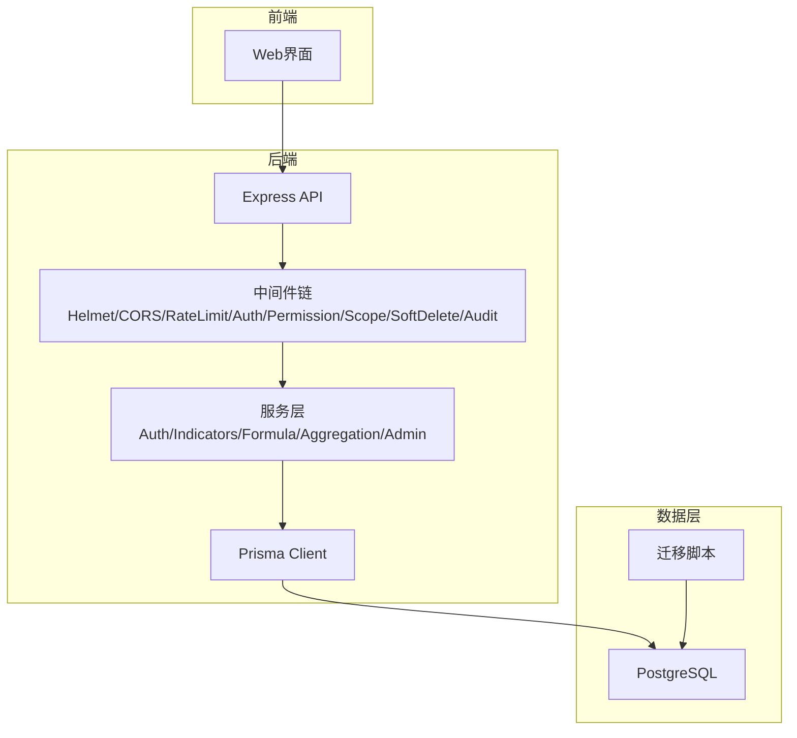
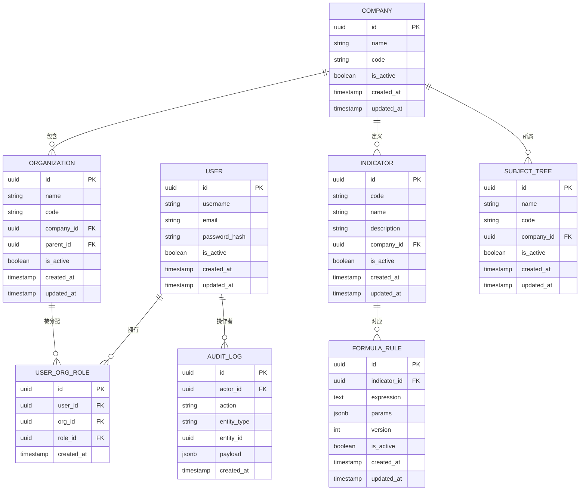
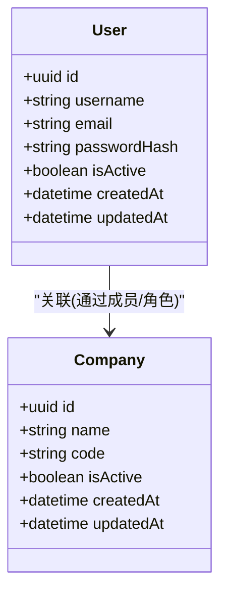
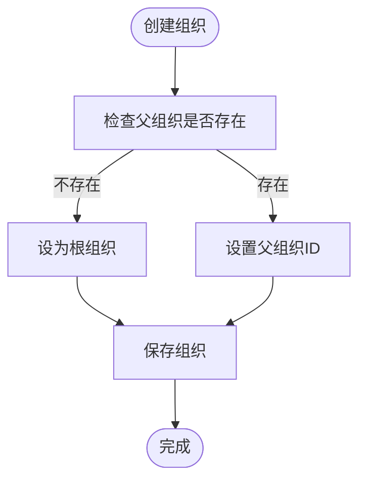
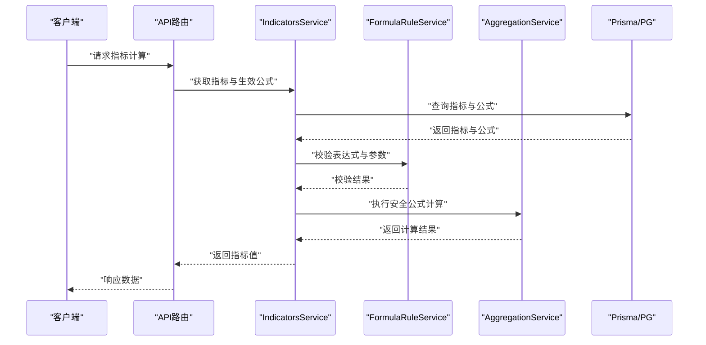
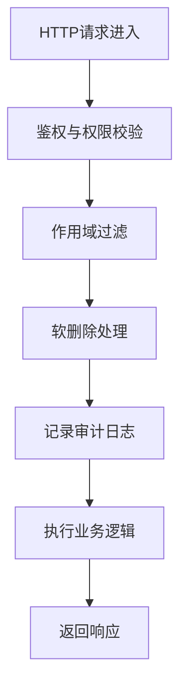
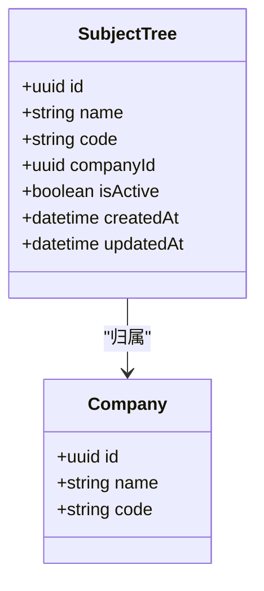
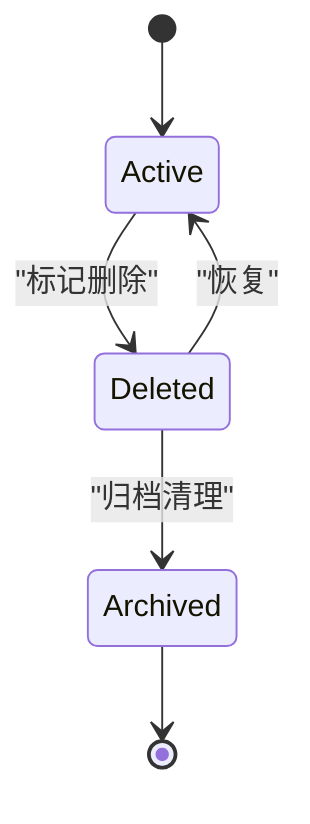
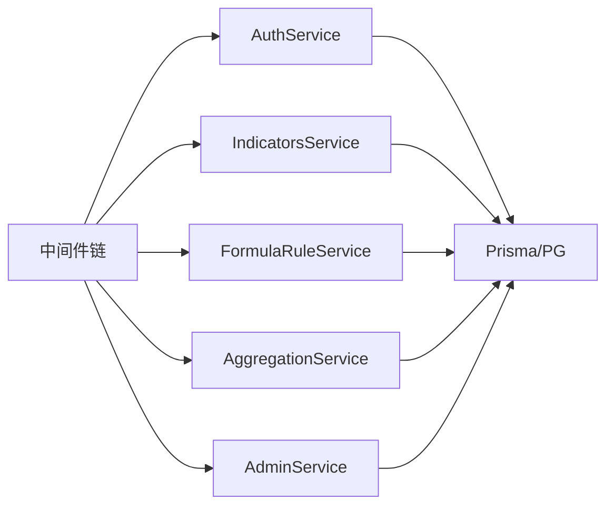

# 数据模型定义

<cite>
**本文引用的文件**   
- [schema.prisma](file://server/prisma/schema.prisma)
- [migration.sql（20260722121714_init）](file://server/prisma/migrations/20260722121714_init/migration.sql)
- [migration.sql（20260722142144_add_formula_rule）](file://server/prisma/migrations/20260722142144_add_formula_rule/migration.sql)
- [migration.sql（20260723120000_add_subject_analysis）](file://server/prisma/migrations/20260723120000_add_subject_analysis/migration.sql)
- [migration.sql（20260724120000_remove_business_unit_org_scope）](file://server/prisma/migrations/20260724120000_remove_business_unit_org_scope/migration.sql)
- [soft-delete.ts](file://server/src/middleware/soft-delete.ts)
- [audit.ts](file://server/src/middleware/audit.ts)
- [scope.ts](file://server/src/middleware/scope.ts)
- [formula.ts](file://server/src/lib/formula.ts)
- [metric-values.ts](file://server/src/lib/metric-values.ts)
- [period.ts](file://server/src/lib/period.ts)
- [AggregationService.ts](file://server/src/services/AggregationService.ts)
- [FormulaRuleService.ts](file://server/src/services/FormulaRuleService.ts)
- [IndicatorsService.ts](file://server/src/services/IndicatorsService.ts)
- [AuthService.ts](file://server/src/services/AuthService.ts)
- [AdminService.ts](file://server/src/services/AdminService.ts)
</cite>

## 目录
1. [引言](#引言)
2. [项目结构](#项目结构)
3. [核心组件](#核心组件)
4. [架构总览](#架构总览)
5. [详细组件分析](#详细组件分析)
6. [依赖关系分析](#依赖关系分析)
7. [性能考虑](#性能考虑)
8. [故障排查指南](#故障排查指南)
9. [结论](#结论)
10. [附录](#附录)

## 引言
本文件面向FY200财年经营数据分析平台的数据模型，聚焦Prisma schema中的实体定义与数据库级约束，覆盖用户、公司、组织架构、指标体系、公式规则、审计日志等核心表结构。文档将详细说明字段类型、约束条件、默认值与业务含义；阐述一对一、一对多、多对多的实现方式；解释主键设计策略与外键约束规则；给出数据验证与完整性约束的数据库级实现；提供ER图与关系图；并说明软删除机制与数据保留策略。

## 项目结构
本项目采用前后端分离架构，后端使用Express + Prisma + PostgreSQL。数据模型以Prisma schema为单一事实来源，配合迁移脚本生成PostgreSQL DDL。中间件链负责鉴权、权限、作用域、软删除与审计，服务层封装业务逻辑，计算类指标通过安全公式解析与后端实时计算完成。

**图表来源**
- [schema.prisma](file://server/prisma/schema.prisma)
- [middleware/soft-delete.ts](file://server/src/middleware/soft-delete.ts)
- [middleware/audit.ts](file://server/src/middleware/audit.ts)
- [middleware/scope.ts](file://server/src/middleware/scope.ts)

**章节来源**
- [schema.prisma](file://server/prisma/schema.prisma)

## 核心组件
- 用户与组织：用户、公司、部门/组织单元、成员关系、角色与权限。
- 指标体系：指标定义、维度、周期、取值与聚合。
- 公式规则：指标计算公式、版本化与校验。
- 审计日志：操作审计、访问追踪。
- 主题分析：科目树与主题分析相关数据。

上述组件在Prisma中通过实体建模，并在迁移脚本中落地为PostgreSQL表结构与约束。

**章节来源**
- [schema.prisma](file://server/prisma/schema.prisma)
- [migration.sql（20260722121714_init）](file://server/prisma/migrations/20260722121714_init/migration.sql)

## 架构总览
数据模型围绕“组织-用户-指标-公式-审计”的主线展开。用户隶属于公司与组织，指标由公式驱动并可按周期与维度聚合，所有关键变更通过审计记录。

**图表来源**
- [schema.prisma](file://server/prisma/schema.prisma)
- [migration.sql（20260722121714_init）](file://server/prisma/migrations/20260722121714_init/migration.sql)
- [migration.sql（20260722142144_add_formula_rule）](file://server/prisma/migrations/20260722142144_add_formula_rule/migration.sql)
- [migration.sql（20260723120000_add_subject_analysis）](file://server/prisma/migrations/20260723120000_add_subject_analysis/migration.sql)

## 详细组件分析

### 用户与公司
- 用户实体：唯一用户名与邮箱，密码哈希存储，启用状态与时间戳。
- 公司实体：公司名称与编码，启用状态与时间戳。
- 关系：用户可属于多个公司（通过角色或成员关系），公司为组织与指标的归属主体。

**图表来源**
- [schema.prisma](file://server/prisma/schema.prisma)
- [migration.sql（20260722121714_init）](file://server/prisma/migrations/20260722121714_init/migration.sql)

**章节来源**
- [schema.prisma](file://server/prisma/schema.prisma)
- [migration.sql（20260722121714_init）](file://server/prisma/migrations/20260722121714_init/migration.sql)

### 组织架构与成员关系
- 组织实体：名称、编码、所属公司、父组织（层级）、启用状态与时间戳。
- 用户-组织-角色：多对多关系，支持用户在多个组织中拥有不同角色。
- 主键与外键：组织主键自增UUID，公司ID作为外键；用户-组织-角色联合唯一性保证无重复分配。

**图表来源**
- [schema.prisma](file://server/prisma/schema.prisma)
- [migration.sql（20260722121714_init）](file://server/prisma/migrations/20260722121714_init/migration.sql)

**章节来源**
- [schema.prisma](file://server/prisma/schema.prisma)
- [migration.sql（20260722121714_init）](file://server/prisma/migrations/20260722121714_init/migration.sql)

### 指标体系与公式规则
- 指标实体：编码、名称、描述、所属公司、启用状态与时间戳。
- 公式规则实体：指标ID、表达式、参数JSON、版本号、启用状态与时间戳。
- 关系：一个指标对应多条公式规则（版本化），当前生效的规则由is_active与version共同决定。
- 计算：公式解析使用白名单算子，禁止eval；同比/环比由后端实时计算不存库。

**图表来源**
- [schema.prisma](file://server/prisma/schema.prisma)
- [migration.sql（20260722142144_add_formula_rule）](file://server/prisma/migrations/20260722142144_add_formula_rule/migration.sql)
- [formula.ts](file://server/src/lib/formula.ts)
- [AggregationService.ts](file://server/src/services/AggregationService.ts)

**章节来源**
- [schema.prisma](file://server/prisma/schema.prisma)
- [migration.sql（20260722142144_add_formula_rule）](file://server/prisma/migrations/20260722142144_add_formula_rule/migration.sql)
- [formula.ts](file://server/src/lib/formula.ts)
- [AggregationService.ts](file://server/src/services/AggregationService.ts)

### 审计日志
- 审计实体：操作者ID、动作、实体类型、实体ID、负载JSON、创建时间。
- 用途：记录关键操作与访问轨迹，便于合规与问题定位。
- 写入：中间件自动捕获请求上下文并落库。

**图表来源**
- [audit.ts](file://server/src/middleware/audit.ts)
- [schema.prisma](file://server/prisma/schema.prisma)

**章节来源**
- [audit.ts](file://server/src/middleware/audit.ts)
- [schema.prisma](file://server/prisma/schema.prisma)

### 主题分析与科目树
- 主题树实体：名称、编码、所属公司、启用状态与时间戳。
- 用途：支撑财务科目树与主题分析功能。

**图表来源**
- [schema.prisma](file://server/prisma/schema.prisma)
- [migration.sql（20260723120000_add_subject_analysis）](file://server/prisma/migrations/20260723120000_add_subject_analysis/migration.sql)

**章节来源**
- [schema.prisma](file://server/prisma/schema.prisma)
- [migration.sql（20260723120000_add_subject_analysis）](file://server/prisma/migrations/20260723120000_add_subject_analysis/migration.sql)

### 数据生命周期管理（软删除与保留）
- 软删除：通过中间件统一处理，查询时自动追加过滤条件，避免物理删除导致的数据不一致。
- 保留策略：审计日志按时间归档，历史指标与公式规则保留版本以便追溯。

**图表来源**
- [soft-delete.ts](file://server/src/middleware/soft-delete.ts)
- [schema.prisma](file://server/prisma/schema.prisma)

**章节来源**
- [soft-delete.ts](file://server/src/middleware/soft-delete.ts)
- [schema.prisma](file://server/prisma/schema.prisma)

## 依赖关系分析
- 服务层依赖：AuthService、IndicatorsService、FormulaRuleService、AggregationService、AdminService等。
- 中间件依赖：auth、permission、scope、soft-delete、audit。
- 数据层依赖：Prisma Client与PostgreSQL。

**图表来源**
- [AuthService.ts](file://server/src/services/AuthService.ts)
- [IndicatorsService.ts](file://server/src/services/IndicatorsService.ts)
- [FormulaRuleService.ts](file://server/src/services/FormulaRuleService.ts)
- [AggregationService.ts](file://server/src/services/AggregationService.ts)
- [AdminService.ts](file://server/src/services/AdminService.ts)

**章节来源**
- [AuthService.ts](file://server/src/services/AuthService.ts)
- [IndicatorsService.ts](file://server/src/services/IndicatorsService.ts)
- [FormulaRuleService.ts](file://server/src/services/FormulaRuleService.ts)
- [AggregationService.ts](file://server/src/services/AggregationService.ts)
- [AdminService.ts](file://server/src/services/AdminService.ts)

## 性能考虑
- 索引策略：对常用查询字段（如company_id、indicator_code、actor_id、created_at）建立索引以提升检索性能。
- 计算优化：同比/环比在后端实时计算，避免冗余存储；公式解析采用白名单算子，减少安全风险与开销。
- 分页与过滤：在服务层结合Prisma extension进行作用域过滤与分页，减少数据传输量。

[本节为通用指导，无需特定文件引用]

## 故障排查指南
- 软删除异常：检查中间件是否正确注入过滤条件，确认deleted_at字段与查询扩展是否生效。
- 审计缺失：确认audit中间件在链路中的位置与上下文传递是否正常。
- 公式错误：校验表达式语法与参数结构，查看FormulaRuleService的错误处理与日志。
- 权限问题：检查permission与scope中间件的配置与用户角色映射。

**章节来源**
- [soft-delete.ts](file://server/src/middleware/soft-delete.ts)
- [audit.ts](file://server/src/middleware/audit.ts)
- [scope.ts](file://server/src/middleware/scope.ts)
- [formula.ts](file://server/src/lib/formula.ts)
- [FormulaRuleService.ts](file://server/src/services/FormulaRuleService.ts)

## 结论
FY200数据模型以Prisma schema为核心，清晰定义了用户、公司、组织、指标、公式与审计等实体及其关系。通过中间件链实现鉴权、权限、作用域、软删除与审计，保障数据安全与可追溯性。指标计算采用安全公式解析与后端实时计算，兼顾性能与安全。建议持续完善索引与监控，确保系统在高并发场景下的稳定性与可维护性。

[本节为总结性内容，无需特定文件引用]

## 附录
- 迁移历史：包括初始化、公式规则添加、主题分析引入、业务单元组织范围移除等关键变更。
- 工具与库：period与metric-values用于周期与指标值处理，辅助计算与展示。

**章节来源**
- [migration.sql（20260722121714_init）](file://server/prisma/migrations/20260722121714_init/migration.sql)
- [migration.sql（20260722142144_add_formula_rule）](file://server/prisma/migrations/20260722142144_add_formula_rule/migration.sql)
- [migration.sql（20260723120000_add_subject_analysis）](file://server/prisma/migrations/20260723120000_add_subject_analysis/migration.sql)
- [migration.sql（20260724120000_remove_business_unit_org_scope）](file://server/prisma/migrations/20260724120000_remove_business_unit_org_scope/migration.sql)
- [period.ts](file://server/src/lib/period.ts)
- [metric-values.ts](file://server/src/lib/metric-values.ts)