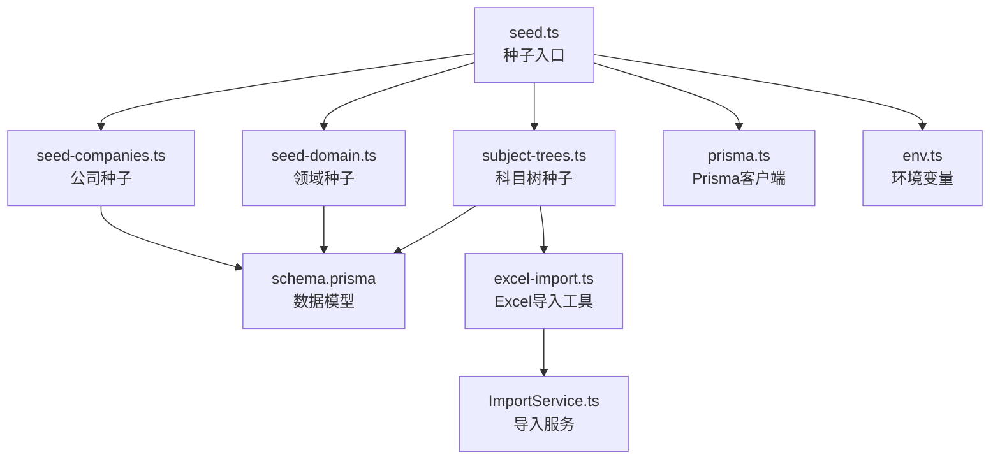
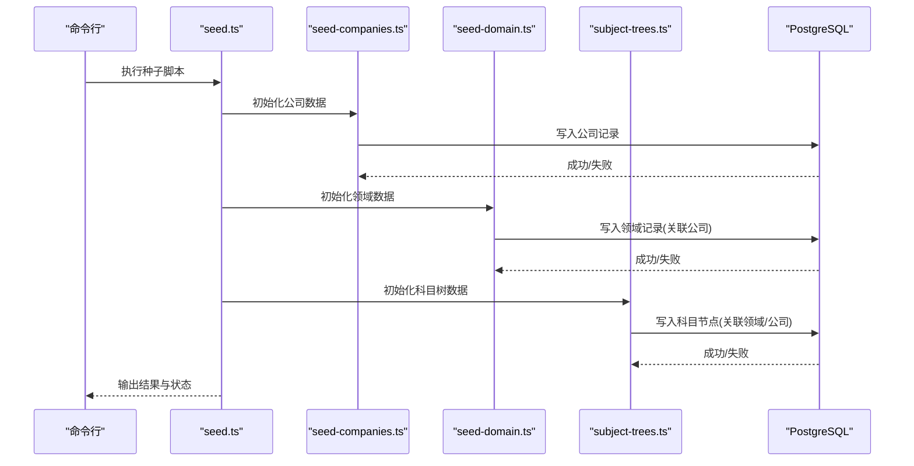
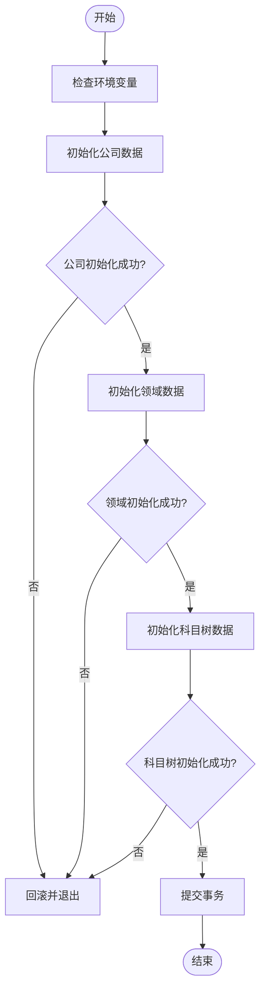
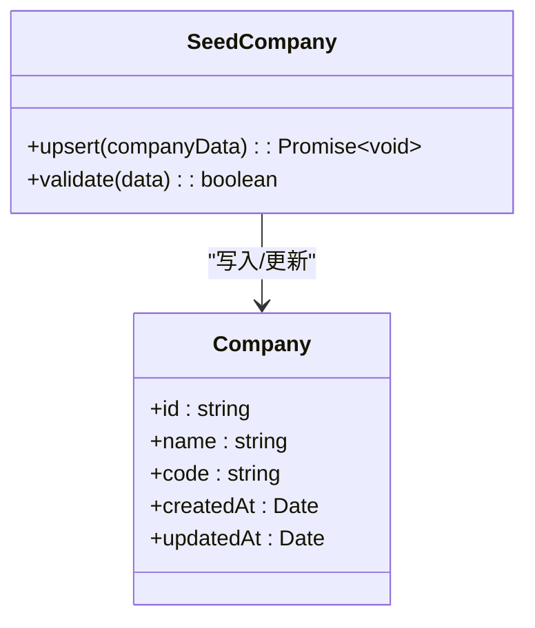
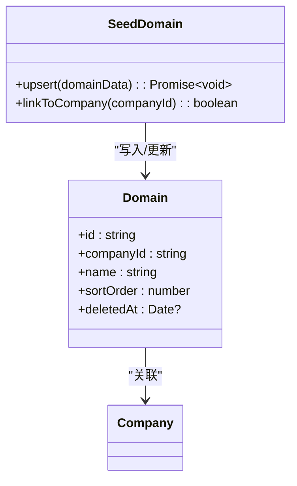
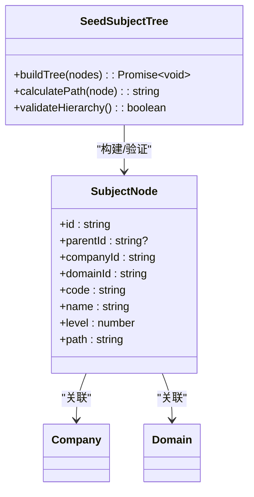
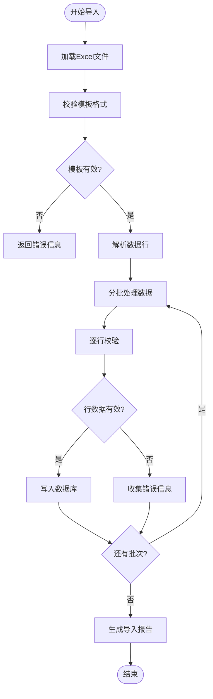

# 种子数据管理

<cite>
**本文引用的文件**   
- [seed.ts](file://server/prisma/seed.ts)
- [seed-companies.ts](file://server/prisma/seed-companies.ts)
- [seed-domain.ts](file://server/prisma/seed-domain.ts)
- [subject-trees.ts](file://server/prisma/seed-data/subject-trees.ts)
- [schema.prisma](file://server/prisma/schema.prisma)
- [env.ts](file://server/src/config/env.ts)
- [prisma.ts](file://server/src/lib/prisma.ts)
- [excel-import.ts](file://server/src/lib/excel-import.ts)
- [ImportService.ts](file://server/src/services/ImportService.ts)
- [20260722121714_init/migration.sql](file://server/prisma/migrations/20260722121714_init/migration.sql)
</cite>

## 目录
1. [简介](#简介)
2. [项目结构](#项目结构)
3. [核心组件](#核心组件)
4. [架构总览](#架构总览)
5. [详细组件分析](#详细组件分析)
6. [依赖关系分析](#依赖关系分析)
7. [性能考虑](#性能考虑)
8. [故障排查指南](#故障排查指南)
9. [结论](#结论)
10. [附录](#附录)

## 简介
本文件面向FY200项目的种子数据管理，系统性阐述公司数据、领域数据与科目树数据的初始化逻辑、数据结构设计、层次结构与依赖关系，并给出扩展新种子数据类型、批量导入方法、数据脱敏与安全策略、版本管理与更新机制、跨环境差异管理的实践指南。目标是帮助开发者快速理解并安全地维护种子数据生命周期。

## 项目结构
种子数据相关代码集中在后端 Prisma 工程下：
- 入口脚本：用于编排执行顺序与事务控制
- 类型化种子模块：按实体划分（公司、领域、科目树）
- 数据库模型与迁移：定义表结构与约束
- 配置与环境变量：控制数据库连接与运行参数
- 通用工具与服务：Prisma客户端、Excel导入服务

**图表来源** 
- [seed.ts](file://server/prisma/seed.ts)
- [seed-companies.ts](file://server/prisma/seed-companies.ts)
- [seed-domain.ts](file://server/prisma/seed-domain.ts)
- [subject-trees.ts](file://server/prisma/seed-data/subject-trees.ts)
- [schema.prisma](file://server/prisma/schema.prisma)
- [prisma.ts](file://server/src/lib/prisma.ts)
- [env.ts](file://server/src/config/env.ts)
- [excel-import.ts](file://server/src/lib/excel-import.ts)
- [ImportService.ts](file://server/src/services/ImportService.ts)

**章节来源**
- [seed.ts](file://server/prisma/seed.ts)
- [schema.prisma](file://server/prisma/schema.prisma)

## 核心组件
- 种子入口脚本：统一调度各模块的初始化流程，确保依赖顺序与事务一致性
- 公司种子：生成公司主数据，作为后续领域与科目的归属维度
- 领域种子：基于公司创建业务领域，支撑指标与报表的维度划分
- 科目树种子：构建科目层级结构，支持指标计算与分析
- Excel导入工具与服务：提供批量数据导入能力，便于非技术用户维护数据
- Prisma客户端与环境配置：保证数据库连接与运行时参数正确

**章节来源**
- [seed.ts](file://server/prisma/seed.ts)
- [seed-companies.ts](file://server/prisma/seed-companies.ts)
- [seed-domain.ts](file://server/prisma/seed-domain.ts)
- [subject-trees.ts](file://server/prisma/seed-data/subject-trees.ts)
- [excel-import.ts](file://server/src/lib/excel-import.ts)
- [ImportService.ts](file://server/src/services/ImportService.ts)
- [prisma.ts](file://server/src/lib/prisma.ts)
- [env.ts](file://server/src/config/env.ts)

## 架构总览
种子数据初始化遵循“先基础后依赖”的顺序：公司→领域→科目树。每个阶段通过Prisma客户端写入数据库，并在失败时回滚以保证一致性。

**图表来源** 
- [seed.ts](file://server/prisma/seed.ts)
- [seed-companies.ts](file://server/prisma/seed-companies.ts)
- [seed-domain.ts](file://server/prisma/seed-domain.ts)
- [subject-trees.ts](file://server/prisma/seed-data/subject-trees.ts)
- [schema.prisma](file://server/prisma/schema.prisma)

## 详细组件分析

### 种子入口脚本（seed.ts）
- 职责：编排执行顺序、事务控制、错误处理与日志输出
- 关键点：
  - 按依赖顺序调用公司、领域、科目树初始化
  - 使用Prisma事务确保原子性
  - 捕获异常并回滚，避免部分写入导致的数据不一致
  - 根据环境变量决定是否启用某些功能或跳过步骤

**图表来源** 
- [seed.ts](file://server/prisma/seed.ts)

**章节来源**
- [seed.ts](file://server/prisma/seed.ts)

### 公司种子（seed-companies.ts）
- 职责：生成公司主数据，建立公司维度基础
- 关键点：
  - 去重插入：依据唯一键判断是否已存在
  - 字段校验：名称、编码等必填项校验
  - 审计字段：自动填充创建时间、更新时间
  - 幂等性：重复执行不会破坏已有数据

**图表来源** 
- [seed-companies.ts](file://server/prisma/seed-companies.ts)
- [schema.prisma](file://server/prisma/schema.prisma)

**章节来源**
- [seed-companies.ts](file://server/prisma/seed-companies.ts)
- [schema.prisma](file://server/prisma/schema.prisma)

### 领域种子（seed-domain.ts）
- 职责：基于公司创建业务领域，支撑指标与报表维度
- 关键点：
  - 关联公司：通过外键或引用字段建立关系
  - 层级与排序：支持领域内排序与层级展示
  - 软删除：支持逻辑删除，保留历史数据
  - 权限隔离：结合中间件scope实现数据范围控制

**图表来源** 
- [seed-domain.ts](file://server/prisma/seed-domain.ts)
- [schema.prisma](file://server/prisma/schema.prisma)

**章节来源**
- [seed-domain.ts](file://server/prisma/seed-domain.ts)
- [schema.prisma](file://server/prisma/schema.prisma)

### 科目树种子（subject-trees.ts）
- 职责：构建科目层级结构，支持指标计算与分析
- 关键点：
  - 树形结构：父节点与子节点关系
  - 路径与深度：存储完整路径与层级深度
  - 关联维度：与公司、领域建立关联
  - 增量更新：支持新增、修改、删除节点

**图表来源** 
- [subject-trees.ts](file://server/prisma/seed-data/subject-trees.ts)
- [schema.prisma](file://server/prisma/schema.prisma)

**章节来源**
- [subject-trees.ts](file://server/prisma/seed-data/subject-trees.ts)
- [schema.prisma](file://server/prisma/schema.prisma)

### Excel导入工具与服务（excel-import.ts, ImportService.ts）
- 职责：提供批量数据导入能力，支持模板校验与错误处理
- 关键点：
  - 模板校验：验证列名、数据类型、必填项
  - 批量处理：分批次写入，避免单次事务过大
  - 错误收集：记录失败行与原因，支持重试
  - 事务边界：每批数据独立事务，提高稳定性

**图表来源** 
- [excel-import.ts](file://server/src/lib/excel-import.ts)
- [ImportService.ts](file://server/src/services/ImportService.ts)

**章节来源**
- [excel-import.ts](file://server/src/lib/excel-import.ts)
- [ImportService.ts](file://server/src/services/ImportService.ts)

## 依赖关系分析
种子数据之间存在明确的依赖关系：
- 公司数据是基础维度，被领域和科目树引用
- 领域数据依赖于公司，为科目树提供业务上下文
- 科目树数据同时依赖公司与领域，形成完整的分析维度

**图表来源** 
- [schema.prisma](file://server/prisma/schema.prisma)
- [20260722121714_init/migration.sql](file://server/prisma/migrations/20260722121714_init/migration.sql)

**章节来源**
- [schema.prisma](file://server/prisma/schema.prisma)
- [20260722121714_init/migration.sql](file://server/prisma/migrations/20260722121714_init/migration.sql)

## 性能考虑
- 批量操作：使用Prisma的批量写入减少数据库往返
- 索引优化：对常用查询字段建立索引，如公司编码、领域ID
- 事务粒度：合理划分事务边界，避免长事务锁表
- 内存管理：大文件导入时分块处理，防止内存溢出
- 并发控制：避免重复执行导致的竞争条件

[本节为通用指导，不直接分析具体文件]

## 故障排查指南
- 常见问题：
  - 数据库连接失败：检查环境变量配置
  - 约束冲突：确认唯一键与外键约束
  - 数据不一致：检查事务回滚逻辑
  - 导入失败：查看错误日志与失败行详情
- 调试技巧：
  - 启用详细日志输出
  - 使用Prisma Studio可视化数据
  - 逐步执行各种子模块定位问题

**章节来源**
- [env.ts](file://server/src/config/env.ts)
- [prisma.ts](file://server/src/lib/prisma.ts)

## 结论
FY200项目的种子数据管理采用模块化设计，通过清晰的依赖关系与事务控制确保数据一致性。Excel导入功能提供了灵活的批量数据处理能力。建议在生产环境中严格管理版本变更，实施数据脱敏策略，并建立完善的监控与告警机制。

[本节为总结性内容，不直接分析具体文件]

## 附录

### 扩展新种子数据类型指南
- 创建新的种子模块文件
- 定义数据模型与约束
- 实现幂等插入逻辑
- 在入口脚本中注册新模块
- 编写单元测试验证正确性

### 数据脱敏与安全策略
- 敏感字段加密存储
- 输出时进行动态脱敏
- 访问控制与权限验证
- 审计日志记录关键操作

### 版本管理与更新机制
- 使用迁移脚本管理数据库变更
- 种子数据版本化存储
- 灰度发布与回滚策略
- 环境差异配置文件管理

### 跨环境差异管理
- 开发/测试/生产环境分离
- 环境变量驱动的配置
- 模拟数据与真实数据区分
- 自动化部署流水线

[本节为概念性内容，不直接分析具体文件]