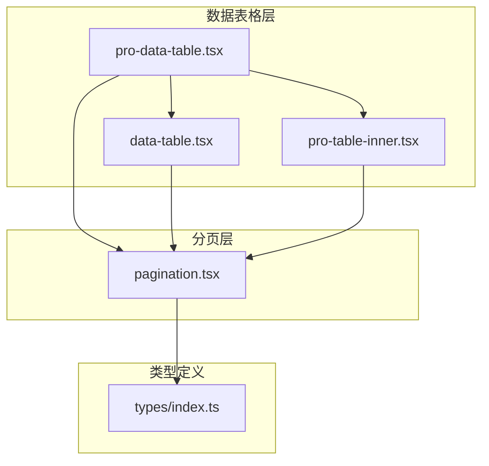
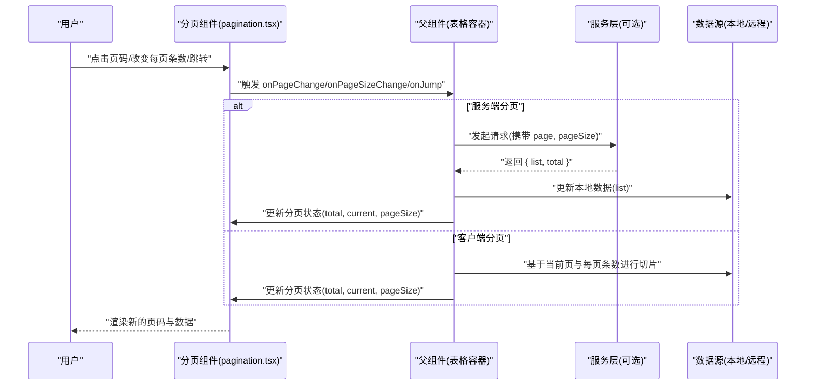
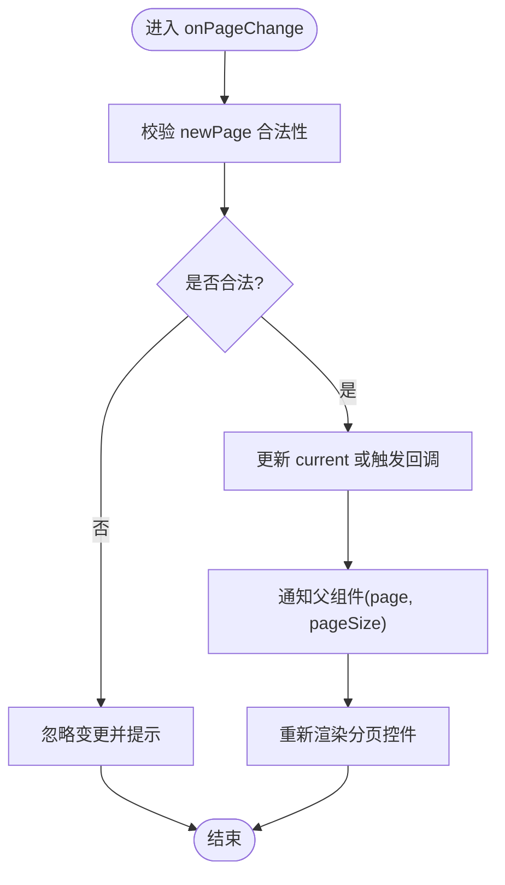
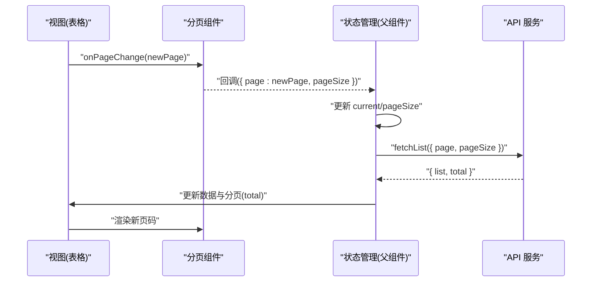
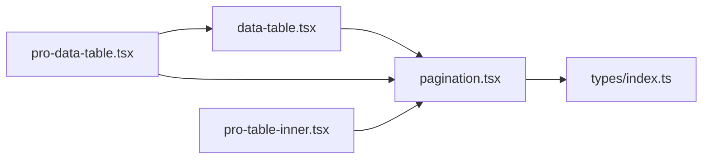

# 分页系统

<cite>
**本文引用的文件**   
- [pagination.tsx](file://web/src/components/data-table/pagination.tsx)
- [data-table.tsx](file://web/src/components/data-table/data-table.tsx)
- [pro-data-table.tsx](file://web/src/components/data-table/pro-data-table.tsx)
- [pro-table-inner.tsx](file://web/src/components/data-table/pro-table-inner.tsx)
- [index.ts](file://web/src/types/index.ts)
</cite>

## 目录
1. [简介](#简介)
2. [项目结构](#项目结构)
3. [核心组件](#核心组件)
4. [架构总览](#架构总览)
5. [详细组件分析](#详细组件分析)
6. [依赖关系分析](#依赖关系分析)
7. [性能考量](#性能考量)
8. [故障排查指南](#故障排查指南)
9. [结论](#结论)
10. [附录](#附录)

## 简介
本技术文档聚焦于 pj3 项目的分页系统，围绕数据表格与分页组件的协作展开。内容涵盖：
- 客户端分页与服务端分页两种策略的实现差异与适用场景
- 分页状态管理、页码计算逻辑、跳转功能的技术实现
- 分页组件与数据表格的集成方式（数据同步、状态保持、URL 参数管理）
- 分页配置项说明（每页条数、页码显示规则、自定义分页器）
- 大数据量场景下的性能优化方案与用户体验改进建议

## 项目结构
分页相关代码位于 web/src/components/data-table 目录下，核心文件包括：
- pagination.tsx：分页控件 UI 与交互逻辑
- data-table.tsx：基础数据表格封装
- pro-data-table.tsx：面向复杂场景的数据表格增强版
- pro-table-inner.tsx：内部表格渲染与列/行处理
- types/index.ts：类型定义（如分页接口、表格列定义等）

图表来源
- [pagination.tsx](file://web/src/components/data-table/pagination.tsx)
- [data-table.tsx](file://web/src/components/data-table/data-table.tsx)
- [pro-data-table.tsx](file://web/src/components/data-table/pro-data-table.tsx)
- [pro-table-inner.tsx](file://web/src/components/data-table/pro-table-inner.tsx)
- [index.ts](file://web/src/types/index.ts)

章节来源
- [pagination.tsx](file://web/src/components/data-table/pagination.tsx)
- [data-table.tsx](file://web/src/components/data-table/data-table.tsx)
- [pro-data-table.tsx](file://web/src/components/data-table/pro-data-table.tsx)
- [pro-table-inner.tsx](file://web/src/components/data-table/pro-table-inner.tsx)
- [index.ts](file://web/src/types/index.ts)

## 核心组件
- 分页组件（pagination.tsx）
  - 职责：提供页码展示、上一页/下一页、首页/末页、页码跳转、每页条数切换等交互；在受控模式下由父组件驱动当前页与总数，在非受控模式下维护内部状态。
  - 关键能力：
    - 页码范围计算（根据总页数与可见页码数量）
    - 边界保护（防止越界、非法输入）
    - 事件回调（onPageChange、onPageSizeChange、onJump）
    - 可配置项（showSizeChanger、showQuickJumper、showTotal、pageSizeOptions 等）
- 数据表格（data-table.tsx / pro-data-table.tsx / pro-table-inner.tsx）
  - 职责：承载数据列表渲染、列定义、排序/筛选（如有）、分页集成。
  - 与分页的集成：
    - 通过 props 将分页状态与回调传递给分页组件
    - 在分页变更时触发数据刷新（服务端分页）或本地切片（客户端分页）
    - 支持 URL 参数同步（可选），便于分享与回退

章节来源
- [pagination.tsx](file://web/src/components/data-table/pagination.tsx)
- [data-table.tsx](file://web/src/components/data-table/data-table.tsx)
- [pro-data-table.tsx](file://web/src/components/data-table/pro-data-table.tsx)
- [pro-table-inner.tsx](file://web/src/components/data-table/pro-table-inner.tsx)

## 架构总览
下图展示了分页系统与数据表格的整体交互关系，以及受控与非受控两种模式的数据流。

图表来源
- [pagination.tsx](file://web/src/components/data-table/pagination.tsx)
- [data-table.tsx](file://web/src/components/data-table/data-table.tsx)
- [pro-data-table.tsx](file://web/src/components/data-table/pro-data-table.tsx)

## 详细组件分析

### 分页组件（pagination.tsx）
- 设计要点
  - 受控模式：current、total、pageSize 由父组件传入，组件仅负责渲染与事件上报
  - 非受控模式：组件内部维护 current、pageSize 等状态，适合简单场景
  - 页码范围计算：根据 total 与 pageSize 得到 totalPages，再结合 visiblePages 计算起始与结束页码
  - 跳转校验：对输入页码进行边界检查与格式校验，避免非法值导致异常
  - 每页条数切换：支持预设选项与自定义数组，切换后自动回到第一页
- 关键流程（页码变化）

图表来源
- [pagination.tsx](file://web/src/components/data-table/pagination.tsx)

章节来源
- [pagination.tsx](file://web/src/components/data-table/pagination.tsx)

### 数据表格与分页集成（data-table.tsx / pro-data-table.tsx / pro-table-inner.tsx）
- 集成模式
  - 受控模式（推荐）：父组件持有分页状态，并在分页回调中更新状态与数据
  - 非受控模式：表格内部维护分页状态，适合快速原型
- 数据同步
  - 服务端分页：在 onPageChange/onPageSizeChange 时发起请求，使用返回的 total 更新分页，list 更新表格数据
  - 客户端分页：在 state 变化时对本地数据进行切片，无需额外请求
- 状态保持
  - 可通过 URL 参数（如 ?page=2&pageSize=20）持久化分页状态，便于分享与浏览器前进后退
  - 页面卸载前保存状态到 sessionStorage/localStorage（可选）
- URL 参数管理
  - 监听路由参数变化，初始化 current/pageSize
  - 在分页变更时同步更新 URL，避免重复请求与闪烁

图表来源
- [data-table.tsx](file://web/src/components/data-table/data-table.tsx)
- [pro-data-table.tsx](file://web/src/components/data-table/pro-data-table.tsx)
- [pro-table-inner.tsx](file://web/src/components/data-table/pro-table-inner.tsx)

章节来源
- [data-table.tsx](file://web/src/components/data-table/data-table.tsx)
- [pro-data-table.tsx](file://web/src/components/data-table/pro-data-table.tsx)
- [pro-table-inner.tsx](file://web/src/components/data-table/pro-table-inner.tsx)

### 类型与接口（types/index.ts）
- 分页相关类型
  - 分页结果：包含 list 与 total 字段
  - 分页参数：包含 page、pageSize 等
  - 分页配置：包含 showSizeChanger、showQuickJumper、showTotal、pageSizeOptions 等
- 表格列与行类型
  - 列定义：key、title、render 等
  - 行数据：泛型约束，确保类型安全

章节来源
- [index.ts](file://web/src/types/index.ts)

## 依赖关系分析
- 组件耦合
  - 分页组件与表格组件通过 props 与回调解耦，遵循受控组件原则
  - 类型定义集中管理，降低跨文件耦合风险
- 外部依赖
  - 若涉及 URL 同步，可能依赖路由库（如 react-router）
  - 若涉及网络请求，可能依赖 fetch/axios 等 HTTP 客户端

图表来源
- [pagination.tsx](file://web/src/components/data-table/pagination.tsx)
- [data-table.tsx](file://web/src/components/data-table/data-table.tsx)
- [pro-data-table.tsx](file://web/src/components/data-table/pro-data-table.tsx)
- [pro-table-inner.tsx](file://web/src/components/data-table/pro-table-inner.tsx)
- [index.ts](file://web/src/types/index.ts)

章节来源
- [pagination.tsx](file://web/src/components/data-table/pagination.tsx)
- [data-table.tsx](file://web/src/components/data-table/data-table.tsx)
- [pro-data-table.tsx](file://web/src/components/data-table/pro-data-table.tsx)
- [pro-table-inner.tsx](file://web/src/components/data-table/pro-table-inner.tsx)
- [index.ts](file://web/src/types/index.ts)

## 性能考量
- 大数据量场景
  - 优先采用服务端分页，减少前端内存占用与渲染压力
  - 合理设置 pageSize，避免单页数据过大导致卡顿
  - 对长列表启用虚拟滚动（如 react-window/react-virtualized）
- 渲染优化
  - 使用 React.memo 包裹分页组件与表格行，减少不必要的重渲染
  - 对分页回调进行防抖/节流，避免频繁请求
- 网络优化
  - 合并请求参数，避免重复请求
  - 使用缓存策略（如 SWR/React Query）提升二次访问体验
- 用户体验
  - 加载态与骨架屏，提升感知性能
  - 错误重试与友好提示
  - 支持键盘导航与无障碍标签

[本节为通用指导，不直接分析具体文件]

## 故障排查指南
- 常见问题
  - 页码越界：检查 onBeforeChange 或内部校验逻辑，确保 newPage 在 [1, totalPages] 范围内
  - 数据不同步：确认父组件是否在分页回调中正确更新 current/total/pageSize
  - URL 不同步：检查路由参数读写逻辑，避免循环更新
  - 每页条数无效：校验 pageSizeOptions 与后端支持的 pageSize 集合
- 调试建议
  - 打印分页回调参数与最终请求参数
  - 使用浏览器开发者工具观察网络请求与状态变化
  - 在分页组件内增加日志输出，定位渲染时机

章节来源
- [pagination.tsx](file://web/src/components/data-table/pagination.tsx)
- [data-table.tsx](file://web/src/components/data-table/data-table.tsx)
- [pro-data-table.tsx](file://web/src/components/data-table/pro-data-table.tsx)

## 结论
pj3 的分页系统以受控组件为核心，配合数据表格实现了灵活的客户端与服务端分页策略。通过清晰的类型定义与回调契约，分页组件具备良好的可复用性与可扩展性。在生产环境中，建议优先采用服务端分页并结合虚拟滚动与缓存策略，以获得更优的性能与用户体验。

[本节为总结性内容，不直接分析具体文件]

## 附录
- 配置项速查
  - showSizeChanger：是否显示每页条数选择器
  - showQuickJumper：是否显示快速跳转输入框
  - showTotal：是否显示“共 X 条”信息
  - pageSizeOptions：每页条数可选值数组
  - defaultCurrent/defaultPageSize：非受控模式的默认值
  - onChange/onPageSizeChange：分页与每页条数变更回调
- 最佳实践
  - 始终在父组件维护分页状态，保证单一数据源
  - 将分页参数纳入 URL，便于分享与回退
  - 对分页操作进行防抖，避免抖动导致的重复请求
  - 为大列表启用虚拟化渲染

[本节为补充说明，不直接分析具体文件]