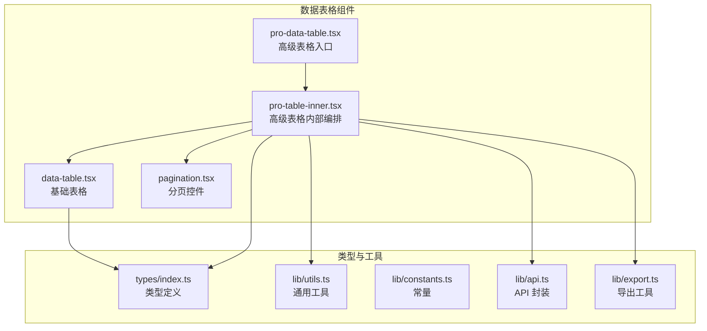
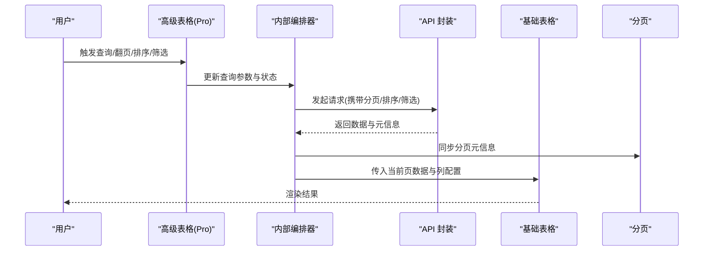
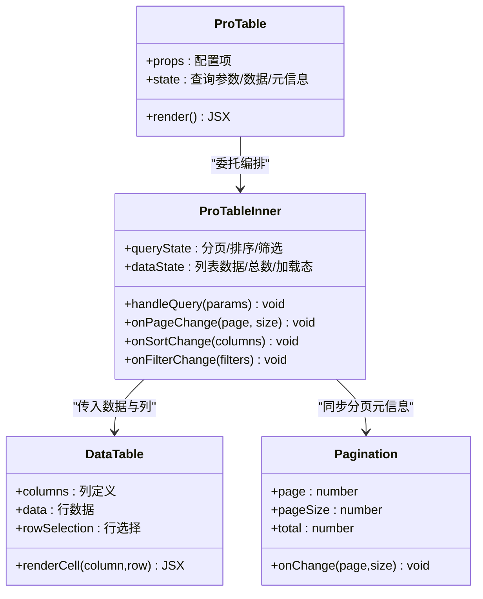
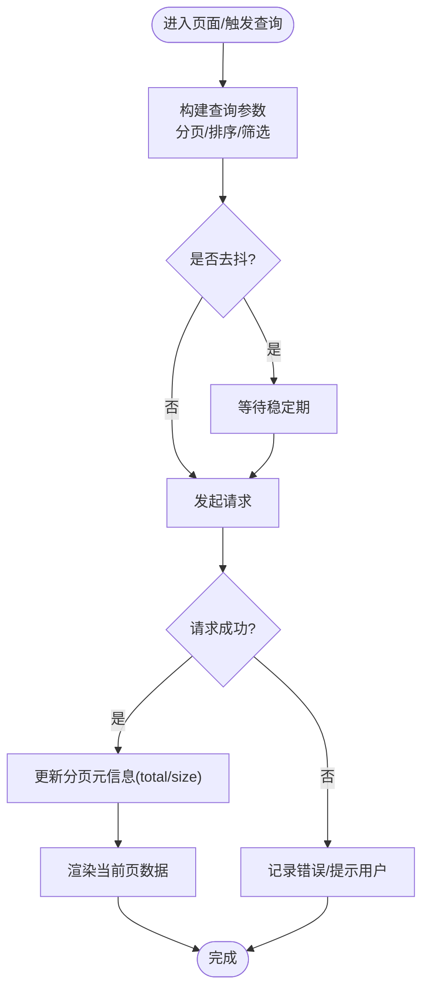
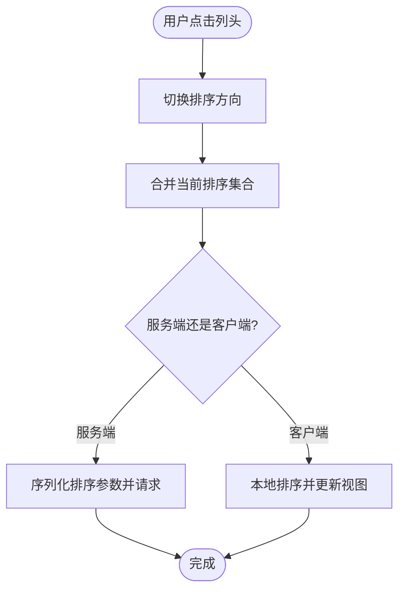
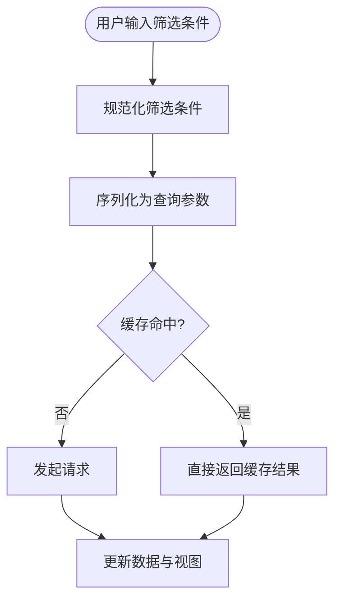
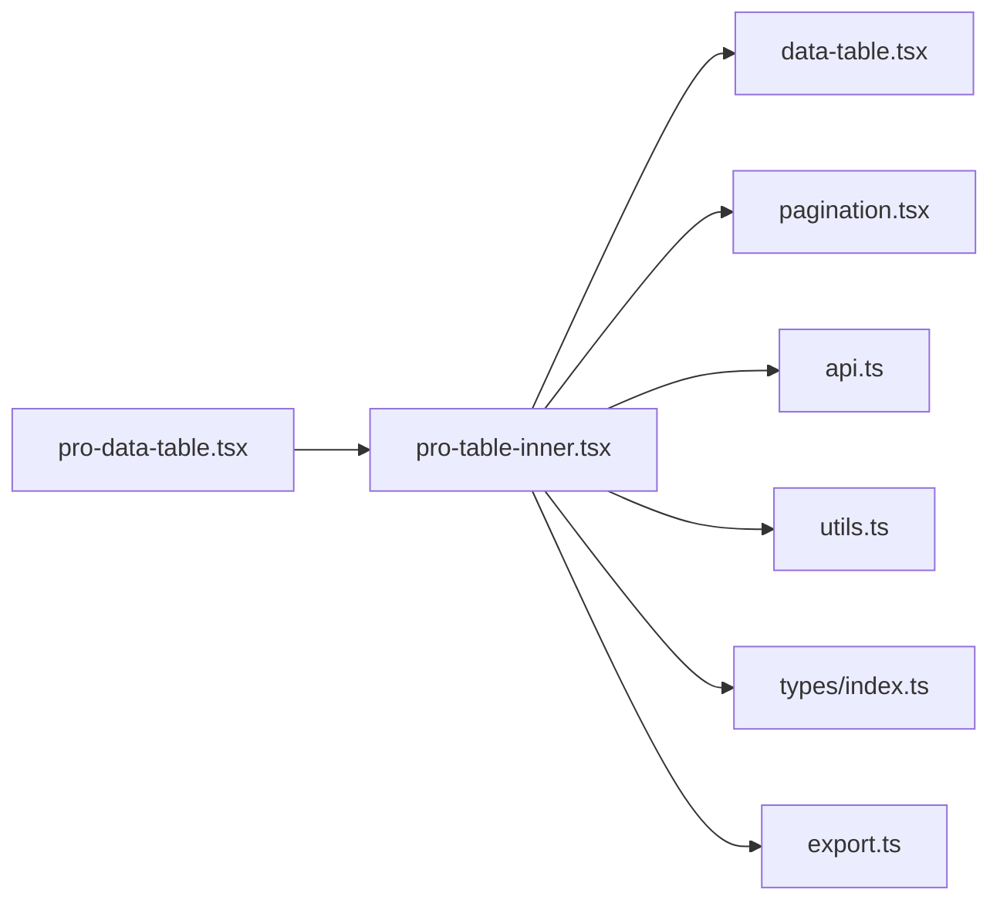

# 数据表格系统

<cite>
**本文引用的文件**   
- [data-table.tsx](file://web/src/components/data-table/data-table.tsx)
- [pro-data-table.tsx](file://web/src/components/data-table/pro-data-table.tsx)
- [pro-table-inner.tsx](file://web/src/components/data-table/pro-table-inner.tsx)
- [pagination.tsx](file://web/src/components/data-table/pagination.tsx)
- [data-table.test.tsx](file://web/src/components/data-table/__tests__/data-table.test.tsx)
- [api.ts](file://web/src/lib/api.ts)
- [constants.ts](file://web/src/lib/constants.ts)
- [export.ts](file://web/src/lib/export.ts)
- [utils.ts](file://web/src/lib/utils.ts)
- [index.ts](file://web/src/types/index.ts)
</cite>

## 更新摘要
**变更内容**   
- 更新了分页组件的功能增强和样式优化相关内容
- 增强了分页机制的实现细节说明
- 补充了分页组件的交互特性和性能优化策略
- 完善了分页系统与高级表格编排器的集成方式

## 目录
1. [简介](#简介)
2. [项目结构](#项目结构)
3. [核心组件](#核心组件)
4. [架构总览](#架构总览)
5. [详细组件分析](#详细组件分析)
6. [依赖关系分析](#依赖关系分析)
7. [性能考量](#性能考量)
8. [故障排查指南](#故障排查指南)
9. [结论](#结论)
10. [附录](#附录) 

## 简介
本技术文档围绕 pj3 前端的数据表格系统，系统性梳理通用数据表格组件的架构设计与实现原理，覆盖基础表格与高级表格的功能差异、分页机制（服务端/客户端）、排序（多列与自定义）、筛选（条件构建与参数序列化）、编辑（行内编辑与批量操作、数据验证）、配置示例与扩展方式，以及大数据量渲染的性能优化与内存管理策略。目标是帮助开发者快速理解并高效使用数据表格能力，同时为二次开发与集成第三方图表/交互组件提供指导。

## 项目结构
数据表格相关代码位于 web/src/components/data-table 目录下，包含基础表格、高级表格、内部编排与分页等模块；配套的类型定义、工具函数、API 封装与导出功能分别位于 types、lib 等目录。

图示来源
- [data-table.tsx](file://web/src/components/data-table/data-table.tsx)
- [pro-data-table.tsx](file://web/src/components/data-table/pro-data-table.tsx)
- [pro-table-inner.tsx](file://web/src/components/data-table/pro-table-inner.tsx)
- [pagination.tsx](file://web/src/components/data-table/pagination.tsx)
- [index.ts](file://web/src/types/index.ts)
- [utils.ts](file://web/src/lib/utils.ts)
- [constants.ts](file://web/src/lib/constants.ts)
- [api.ts](file://web/src/lib/api.ts)
- [export.ts](file://web/src/lib/export.ts)

章节来源
- [data-table.tsx](file://web/src/components/data-table/data-table.tsx)
- [pro-data-table.tsx](file://web/src/components/data-table/pro-data-table.tsx)
- [pro-table-inner.tsx](file://web/src/components/data-table/pro-table-inner.tsx)
- [pagination.tsx](file://web/src/components/data-table/pagination.tsx)
- [index.ts](file://web/src/types/index.ts)
- [utils.ts](file://web/src/lib/utils.ts)
- [constants.ts](file://web/src/lib/constants.ts)
- [api.ts](file://web/src/lib/api.ts)
- [export.ts](file://web/src/lib/export.ts)

## 核心组件
- 基础表格 data-table：提供最小可用能力，如列定义、数据绑定、基本展示与简单交互。适合轻量场景或作为高级表格的底层渲染器。
- 高级表格 pro-data-table：在基础表格之上，组合分页、排序、筛选、批量操作、导出等能力，并通过内部编排器 pro-table-inner 统一状态管理与副作用处理。
- 分页 pagination：支持页码切换、每页条数调整、跳转等交互，可与服务端/客户端分页模式联动，具备增强的样式和用户体验。
- 类型与工具：types/index.ts 提供表格列、分页、排序、筛选等类型；utils.ts 提供通用工具；constants.ts 提供默认值与常量；api.ts 负责请求封装；export.ts 提供导出能力。

章节来源
- [data-table.tsx](file://web/src/components/data-table/data-table.tsx)
- [pro-data-table.tsx](file://web/src/components/data-table/pro-data-table.tsx)
- [pro-table-inner.tsx](file://web/src/components/data-table/pro-table-inner.tsx)
- [pagination.tsx](file://web/src/components/data-table/pagination.tsx)
- [index.ts](file://web/src/types/index.ts)
- [utils.ts](file://web/src/lib/utils.ts)
- [constants.ts](file://web/src/lib/constants.ts)
- [api.ts](file://web/src/lib/api.ts)
- [export.ts](file://web/src/lib/export.ts)

## 架构总览
高级表格采用"编排器 + 渲染器"的分层设计：
- 编排层（pro-table-inner）：集中管理分页、排序、筛选、加载态、错误态等状态，协调 API 调用与 UI 更新。
- 渲染层（data-table）：专注列渲染、行渲染、单元格内容定制与事件派发。
- 能力插件：分页、排序、筛选、批量操作、导出等以配置项形式注入编排层，按需启用。

图示来源
- [pro-data-table.tsx](file://web/src/components/data-table/pro-data-table.tsx)
- [pro-table-inner.tsx](file://web/src/components/data-table/pro-table-inner.tsx)
- [data-table.tsx](file://web/src/components/data-table/data-table.tsx)
- [pagination.tsx](file://web/src/components/data-table/pagination.tsx)
- [api.ts](file://web/src/lib/api.ts)

## 详细组件分析

### 基础表格 data-table
- 职责：接收列定义与数据源，完成行/单元格渲染，派发点击、选择等事件。
- 关键特性：
  - 列配置驱动渲染，支持自定义单元格渲染函数。
  - 行选择与多选回调，便于后续批量操作。
  - 可插拔的单元格插槽，用于嵌入按钮、开关、进度条等。
- 性能要点：
  - 对大数据集建议配合虚拟滚动（由上层编排器控制）。
  - 避免在渲染路径中进行昂贵计算，尽量预计算或使用 memo。

章节来源
- [data-table.tsx](file://web/src/components/data-table/data-table.tsx)
- [index.ts](file://web/src/types/index.ts)

### 高级表格 pro-data-table 与内部编排器 pro-table-inner
- 职责：聚合分页、排序、筛选、批量操作、导出等能力，统一状态机与副作用。
- 状态模型：
  - 查询参数：分页（页码、每页大小）、排序（多列、方向）、筛选（字段、操作符、值）。
  - 数据与元信息：列表数据、总数、加载态、错误态。
  - 交互态：选中行、展开行、编辑态等。
- 生命周期：
  - 初始化：合并默认配置与用户配置，建立初始查询参数。
  - 变更：监听分页/排序/筛选变化，防抖后触发查询。
  - 响应：根据返回数据更新视图与分页元信息。
- 可扩展点：
  - 自定义排序比较器、筛选器、导出处理器。
  - 通过列配置注入自定义渲染与交互逻辑。

图示来源
- [pro-data-table.tsx](file://web/src/components/data-table/pro-data-table.tsx)
- [pro-table-inner.tsx](file://web/src/components/data-table/pro-table-inner.tsx)
- [data-table.tsx](file://web/src/components/data-table/data-table.tsx)
- [pagination.tsx](file://web/src/components/data-table/pagination.tsx)

章节来源
- [pro-data-table.tsx](file://web/src/components/data-table/pro-data-table.tsx)
- [pro-table-inner.tsx](file://web/src/components/data-table/pro-table-inner.tsx)
- [data-table.tsx](file://web/src/components/data-table/data-table.tsx)
- [pagination.tsx](file://web/src/components/data-table/pagination.tsx)

### 分页机制
- 服务端分页：
  - 由编排器将 page/pageSize 等参数附加到请求中，后端返回数据与 total 等元信息。
  - 优点：网络与渲染开销小，适合大数据集。
  - 注意：需保证后端稳定返回 consistent 的元信息结构。
- 客户端分页：
  - 一次性拉取全量数据，前端按 page/pageSize 切片显示。
  - 优点：交互更流畅，无频繁请求。
  - 注意：仅适用于数据量可控的场景，需结合内存与渲染优化。
- 性能优化策略：
  - 请求去抖与节流：避免高频翻页/搜索导致重复请求。
  - 取消过期请求：在 React 中可使用 AbortController 取消未完成的请求。
  - 增量更新：仅更新变化的行或列，减少重绘范围。
  - 虚拟滚动：对长列表进行可视区域渲染，降低 DOM 节点数量。

**更新** 分页组件经过功能增强和样式优化，提供了更好的用户体验和交互反馈。

图示来源
- [pro-table-inner.tsx](file://web/src/components/data-table/pro-table-inner.tsx)
- [pagination.tsx](file://web/src/components/data-table/pagination.tsx)
- [api.ts](file://web/src/lib/api.ts)

章节来源
- [pro-table-inner.tsx](file://web/src/components/data-table/pro-table-inner.tsx)
- [pagination.tsx](file://web/src/components/data-table/pagination.tsx)
- [api.ts](file://web/src/lib/api.ts)

### 排序功能
- 多列排序：
  - 支持按多列组合排序，每列指定方向（升序/降序/不排序）。
  - 编排器维护排序数组，将其序列化为请求参数传递给后端。
- 自定义排序逻辑：
  - 前端排序：在列配置中提供比较函数，适用于客户端排序。
  - 后端排序：在服务端模式下，将排序字段与方向透传给后端，由数据库完成排序。
- 性能优化：
  - 大列表优先使用服务端排序，避免前端 O(n log n) 排序开销。
  - 对字符串/日期/数值类型提供内置比较器，减少自定义实现成本。

图示来源
- [pro-table-inner.tsx](file://web/src/components/data-table/pro-table-inner.tsx)
- [data-table.tsx](file://web/src/components/data-table/data-table.tsx)

章节来源
- [pro-table-inner.tsx](file://web/src/components/data-table/pro-table-inner.tsx)
- [data-table.tsx](file://web/src/components/data-table/data-table.tsx)

### 筛选系统
- 条件构建：
  - 支持单字段与多字段筛选，字段名、操作符（等于/包含/大于/小于等）、值三元组。
  - 提供筛选器工厂或配置化生成器，便于复用与扩展。
- 查询参数序列化：
  - 将筛选条件扁平化为 URL 查询串或请求体字段，确保后端可解析。
  - 支持嵌套对象与数组值的编码策略。
- 性能优化：
  - 输入防抖：文本类筛选在输入时延迟触发查询。
  - 条件合并：相同字段的多次筛选合并为一次请求。
  - 缓存命中：对相同查询参数复用上次结果，避免重复请求。

图示来源
- [pro-table-inner.tsx](file://web/src/components/data-table/pro-table-inner.tsx)
- [utils.ts](file://web/src/lib/utils.ts)
- [api.ts](file://web/src/lib/api.ts)

章节来源
- [pro-table-inner.tsx](file://web/src/components/data-table/pro-table-inner.tsx)
- [utils.ts](file://web/src/lib/utils.ts)
- [api.ts](file://web/src/lib/api.ts)

### 编辑功能
- 行内编辑：
  - 在单元格或整行开启编辑态，支持表单校验与即时保存。
  - 通过列配置的编辑器组件或回调函数注入自定义编辑器。
- 批量操作：
  - 基于行选择，提供批量删除、批量修改等操作入口。
  - 编排器收集选中行 ID 或数据，组装批量请求。
- 数据验证：
  - 前端校验：必填、格式、范围等规则，失败时阻止提交并提示。
  - 后端校验：服务端再次校验，确保数据一致性。
- 撤销与冲突：
  - 对关键操作提供撤销能力，或在并发冲突时提示用户重试。

章节来源
- [pro-table-inner.tsx](file://web/src/components/data-table/pro-table-inner.tsx)
- [data-table.tsx](file://web/src/components/data-table/data-table.tsx)

### 导出与集成
- 导出：
  - 支持 CSV/Excel 等格式导出，可通过 export.ts 提供的工具函数完成。
  - 大数据导出建议走服务端流式导出，前端仅负责触发与下载。
- 第三方图表与交互：
  - 在列渲染中嵌入图表组件（如 KPI 卡片、趋势图），通过列配置注入。
  - 与弹窗、抽屉、下拉菜单等交互组件组合，形成丰富操作体验。

章节来源
- [export.ts](file://web/src/lib/export.ts)
- [data-table.tsx](file://web/src/components/data-table/data-table.tsx)

## 依赖关系分析
- 组件耦合：
  - 高级表格编排器与基础表格解耦，通过 props 传递数据与列配置。
  - 分页组件独立，仅关注分页交互与元信息同步。
- 外部依赖：
  - API 封装统一处理请求/响应拦截、错误处理与取消逻辑。
  - 工具函数与常量提供通用能力与默认值。
- 潜在循环依赖：
  - 通过分层与接口隔离避免循环引用，确保编排器不反向依赖渲染细节。

图示来源
- [pro-data-table.tsx](file://web/src/components/data-table/pro-data-table.tsx)
- [pro-table-inner.tsx](file://web/src/components/data-table/pro-table-inner.tsx)
- [data-table.tsx](file://web/src/components/data-table/data-table.tsx)
- [pagination.tsx](file://web/src/components/data-table/pagination.tsx)
- [api.ts](file://web/src/lib/api.ts)
- [utils.ts](file://web/src/lib/utils.ts)
- [index.ts](file://web/src/types/index.ts)
- [export.ts](file://web/src/lib/export.ts)

章节来源
- [pro-data-table.tsx](file://web/src/components/data-table/pro-data-table.tsx)
- [pro-table-inner.tsx](file://web/src/components/data-table/pro-table-inner.tsx)
- [data-table.tsx](file://web/src/components/data-table/data-table.tsx)
- [pagination.tsx](file://web/src/components/data-table/pagination.tsx)
- [api.ts](file://web/src/lib/api.ts)
- [utils.ts](file://web/src/lib/utils.ts)
- [index.ts](file://web/src/types/index.ts)
- [export.ts](file://web/src/lib/export.ts)

## 性能考量
- 渲染优化：
  - 虚拟滚动：仅渲染可视区域行，显著降低 DOM 节点数量与重排开销。
  - 行级 key 稳定：使用唯一稳定的 key，提升 diff 效率。
  - 单元格 memo：对复杂单元格渲染进行记忆化，避免重复计算。
- 请求优化：
  - 去抖/节流：对输入与高频交互进行限流。
  - 请求取消：在路由切换或新请求前取消旧请求，避免竞态。
  - 增量更新：只更新变化的数据片段，减少整体刷新。
- 内存管理：
  - 及时释放：在组件卸载时清理定时器、事件监听与 AbortController。
  - 数据裁剪：客户端分页时仅保留当前页数据，避免全量驻留内存。
  - 图片与资源懒加载：按需加载大图或重型资源。

**更新** 分页组件的样式优化减少了不必要的重绘和重排，提升了整体渲染性能。

[本节为通用性能建议，无需特定文件来源]

## 故障排查指南
- 常见问题定位：
  - 分页异常：检查后端返回的 total 与当前页数据是否一致，确认分页参数是否正确序列化。
  - 排序错乱：确认多列排序参数顺序与方向，核对前后端字段映射。
  - 筛选无效：检查筛选条件构建与序列化逻辑，确认后端是否支持对应操作符。
  - 编辑失败：查看前端校验与后端校验错误信息，确认请求体结构与权限。
- 调试技巧：
  - 打印查询参数与响应结构，对比期望契约。
  - 使用浏览器网络面板观察请求取消与重试情况。
  - 在关键路径添加日志，定位状态更新时机。

**更新** 分页组件的错误处理得到了增强，现在能更好地捕获和显示分页相关的异常情况。

章节来源
- [pro-table-inner.tsx](file://web/src/components/data-table/pro-table-inner.tsx)
- [api.ts](file://web/src/lib/api.ts)
- [data-table.test.tsx](file://web/src/components/data-table/__tests__/data-table.test.tsx)

## 结论
pj3 数据表格系统通过"编排器 + 渲染器"的分层架构，实现了高内聚、低耦合的可扩展表格能力。基础表格专注渲染，高级表格负责编排与状态管理，分页、排序、筛选、编辑、导出等能力以配置化方式注入，既满足通用场景，又便于深度定制。针对大数据量场景，提供了服务端分页、虚拟滚动、请求取消与增量更新等优化手段，保障性能与用户体验。

**更新** 分页系统的功能增强和样式优化进一步提升了用户体验，使数据表格在处理大量数据时更加流畅和直观。

[本节为总结性内容，无需特定文件来源]

## 附录
- 配置示例与扩展指南：
  - 列定义：通过列配置声明字段、标题、宽度、对齐、排序、筛选、编辑器与渲染函数。
  - 分页配置：设置默认页码、每页大小、是否显示跳转与每页条数选择器。
  - 排序配置：启用多列排序，必要时提供自定义比较器。
  - 筛选配置：定义筛选器类型与操作符，支持文本、数字、日期、枚举等。
  - 编辑配置：为列或整行启用编辑态，配置校验规则与保存回调。
  - 导出配置：选择导出格式与字段映射，大数据场景建议走服务端导出。
- 集成第三方组件：
  - 在列渲染中嵌入图表或交互组件，注意生命周期与性能影响。
  - 通过弹窗/抽屉承载复杂编辑表单，保持主表格简洁。

**更新** 分页组件现在支持更多自定义配置选项，包括样式主题、交互行为和数据绑定方式的灵活配置。

[本节为概念性说明，无需特定文件来源]