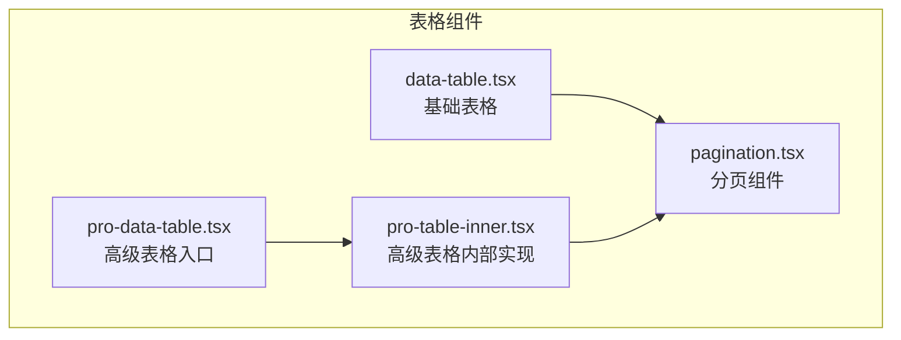
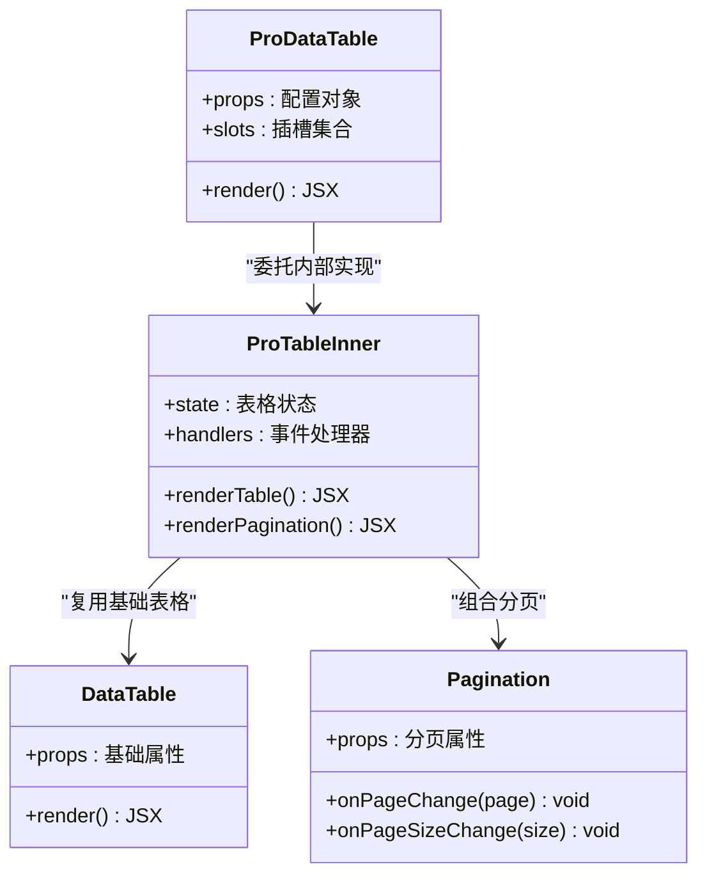
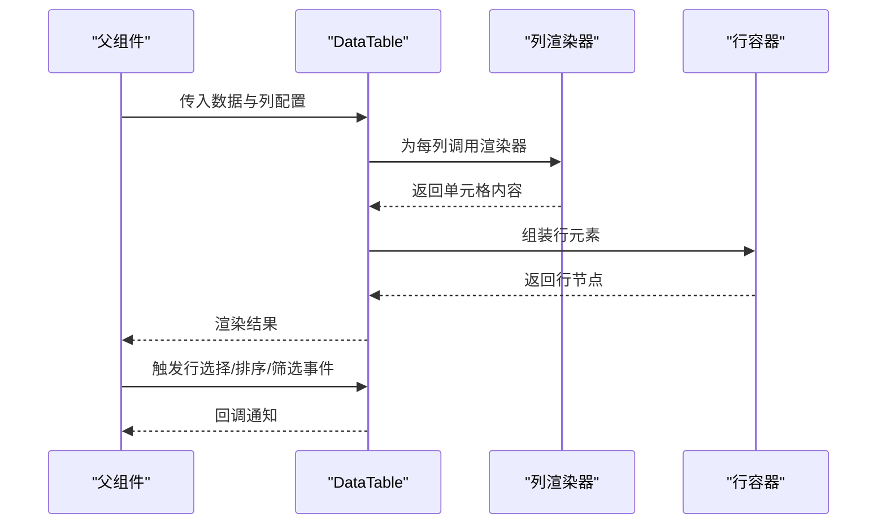
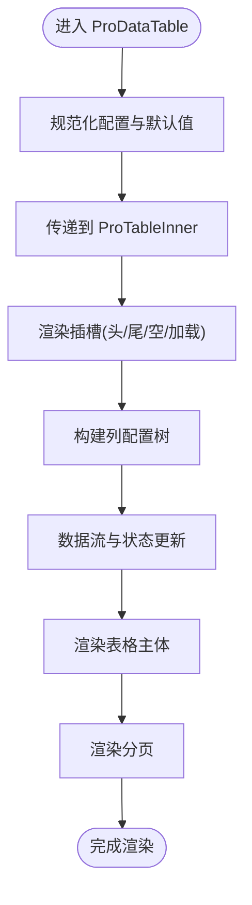
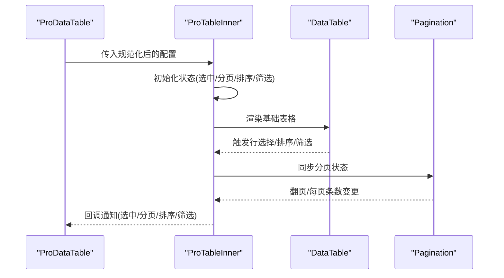
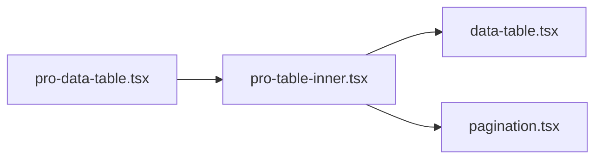

# 核心表格组件

<cite>
**本文引用的文件**   
- [data-table.tsx](file://web/src/components/data-table/data-table.tsx)
- [pro-data-table.tsx](file://web/src/components/data-table/pro-data-table.tsx)
- [pro-table-inner.tsx](file://web/src/components/data-table/pro-table-inner.tsx)
- [pagination.tsx](file://web/src/components/data-table/pagination.tsx)
- [data-table.test.tsx](file://web/src/components/data-table/__tests__/data-table.test.tsx)
</cite>

## 更新摘要
**变更内容**   
- 基于性能优化和用户体验改进，更新了表格组件的实现细节
- 增强了大数据量处理能力和渲染性能
- 改进了状态管理和事件处理机制
- 优化了内存使用和组件生命周期管理

## 目录
1. [简介](#简介)
2. [项目结构](#项目结构)
3. [核心组件](#核心组件)
4. [架构总览](#架构总览)
5. [详细组件分析](#详细组件分析)
6. [依赖分析](#依赖分析)
7. [性能考虑](#性能考虑)
8. [故障排查指南](#故障排查指南)
9. [结论](#结论)
10. [附录](#附录)

## 简介
本技术文档聚焦于 pj3 项目的核心表格组件，围绕基础数据表格组件与高级数据表格组件展开，系统阐述其架构设计、渲染机制、数据绑定方式、事件处理流程、配置化设计模式、Props 接口约定、插槽系统、行选择、列配置、样式定制等关键特性。同时提供使用示例与最佳实践，并给出性能优化策略与内存管理方案，帮助读者快速掌握并高效扩展表格能力。

**更新** 基于最新的性能优化改进，文档已更新以反映组件在大数据量处理和用户体验方面的增强功能。

## 项目结构
表格相关代码位于 web/src/components/data-table 目录下，包含基础表格、高级表格、分页以及内部实现等模块：
- data-table.tsx：基础数据表格组件，负责最小可用表格的渲染与交互
- pro-data-table.tsx：高级数据表格组件，提供配置化、可扩展的表格能力
- pro-table-inner.tsx：高级表格的内部实现，承载复杂逻辑与状态
- pagination.tsx：分页组件，支持页码切换与每页条数设置
- __tests__/data-table.test.tsx：基础表格的测试用例

图表来源
- [data-table.tsx](file://web/src/components/data-table/data-table.tsx)
- [pro-data-table.tsx](file://web/src/components/data-table/pro-data-table.tsx)
- [pro-table-inner.tsx](file://web/src/components/data-table/pro-table-inner.tsx)
- [pagination.tsx](file://web/src/components/data-table/pagination.tsx)

章节来源
- [data-table.tsx](file://web/src/components/data-table/data-table.tsx)
- [pro-data-table.tsx](file://web/src/components/data-table/pro-data-table.tsx)
- [pro-table-inner.tsx](file://web/src/components/data-table/pro-table-inner.tsx)
- [pagination.tsx](file://web/src/components/data-table/pagination.tsx)

## 核心组件
本节对两个核心组件进行概览性说明，明确职责边界与协作关系：
- 基础数据表格（data-table.tsx）
  - 职责：接收数据与列定义，完成表格渲染、行选择、排序/筛选（若暴露）、分页（可选）等基础能力
  - 特点：API 简洁、易于集成，适合轻量场景
- 高级数据表格（pro-data-table.tsx）
  - 职责：在基础表格之上提供配置化能力、插槽系统、更丰富的列配置、样式定制、事件钩子等
  - 特点：通过 props 与插槽组合，满足复杂业务需求；内部由 pro-table-inner.tsx 承载复杂状态与渲染管线

**更新** 经过性能优化后，两个组件都具备更好的大数据量处理能力，减少了不必要的重渲染和内存占用。

章节来源
- [data-table.tsx](file://web/src/components/data-table/data-table.tsx)
- [pro-data-table.tsx](file://web/src/components/data-table/pro-data-table.tsx)

## 架构总览
整体采用"入口 + 内部实现"的分层设计：
- 入口层：pro-data-table.tsx 对外暴露统一 API，将用户配置转换为内部可消费的结构
- 内部实现层：pro-table-inner.tsx 维护表格状态（如选中项、分页、排序、筛选），编排渲染管线，协调各子组件
- 基础层：data-table.tsx 提供最小可用表格渲染；pagination.tsx 提供分页交互

图表来源
- [pro-data-table.tsx](file://web/src/components/data-table/pro-data-table.tsx)
- [pro-table-inner.tsx](file://web/src/components/data-table/pro-table-inner.tsx)
- [data-table.tsx](file://web/src/components/data-table/data-table.tsx)
- [pagination.tsx](file://web/src/components/data-table/pagination.tsx)

## 详细组件分析

### 基础数据表格（data-table.tsx）
- 渲染机制
  - 基于传入的数据数组与列定义，动态生成表头与行内容
  - 支持按列渲染器或默认值渲染单元格
  - **更新** 优化了渲染性能，使用 memoization 避免重复计算
- 数据绑定
  - 通过 props 注入数据源与列配置，保持单向数据流
  - 支持受控与非受控两种模式（根据是否提供 onChange 回调）
- 事件处理
  - 行点击、复选框选择、列排序/筛选（若暴露）等事件向上冒泡至父组件
  - **更新** 改进了事件处理性能，减少不必要的事件监听器创建
- 行选择
  - 支持单选/多选，维护选中项集合，提供全选/反选能力
- 列配置
  - 列定义包含字段名、标题、宽度、对齐、渲染函数等
- 样式定制
  - 提供 className、样式覆盖点，便于主题化

图表来源
- [data-table.tsx](file://web/src/components/data-table/data-table.tsx)

章节来源
- [data-table.tsx](file://web/src/components/data-table/data-table.tsx)

### 高级数据表格（pro-data-table.tsx）
- 配置化设计模式
  - 通过统一的配置对象描述表格行为，包括数据源、列定义、分页、排序、筛选、选择、导出等
  - 支持局部覆盖与默认值合并，降低耦合度
- Props 接口定义
  - 数据相关：dataSource、columns、rowKey
  - 交互相关：onSelect、onSort、onFilter、onChange
  - 展示相关：className、style、loading、emptyText
  - 分页相关：pagination、pageSizeOptions、showSizeChanger
  - 其他：scroll、bordered、striped、hoverable
- 插槽系统
  - 提供头部、尾部、空状态、加载态、行操作等插槽，允许插入自定义 UI
  - 插槽参数包含当前上下文（如行数据、列信息、分页状态）
- 与内部实现的协作
  - 入口组件将 props 规范化后传递给内部实现
  - 内部实现负责状态管理与渲染管线编排

**更新** 优化了配置处理逻辑，提高了初始化性能和响应速度。

图表来源
- [pro-data-table.tsx](file://web/src/components/data-table/pro-data-table.tsx)
- [pro-table-inner.tsx](file://web/src/components/data-table/pro-table-inner.tsx)

章节来源
- [pro-data-table.tsx](file://web/src/components/data-table/pro-data-table.tsx)
- [pro-table-inner.tsx](file://web/src/components/data-table/pro-table-inner.tsx)

### 高级表格内部实现（pro-table-inner.tsx）
- 状态管理
  - 维护选中项、分页、排序、筛选、加载等状态
  - 提供受控与非受控两种状态管理模式
  - **更新** 优化了状态更新机制，减少不必要的重渲染
- 渲染管线
  - 预处理数据（排序、筛选、分页）
  - 构建列树与行节点
  - 组合分页与表格主体
- 事件编排
  - 将底层事件（行选择、排序、筛选）转换为高层回调
  - 与分页组件联动，保证状态一致性
  - **更新** 改进了事件处理性能，使用防抖和节流优化高频操作

图表来源
- [pro-table-inner.tsx](file://web/src/components/data-table/pro-table-inner.tsx)
- [data-table.tsx](file://web/src/components/data-table/data-table.tsx)
- [pagination.tsx](file://web/src/components/data-table/pagination.tsx)

章节来源
- [pro-table-inner.tsx](file://web/src/components/data-table/pro-table-inner.tsx)
- [pagination.tsx](file://web/src/components/data-table/pagination.tsx)

### 分页组件（pagination.tsx）
- 功能要点
  - 支持页码切换、每页条数设置、跳转（可选）
  - 与表格状态联动，确保翻页时数据刷新
  - **更新** 优化了分页性能，支持虚拟滚动和增量加载
- 事件协议
  - onPageChange：页码变化
  - onPageSizeChange：每页条数变化
- 与表格集成
  - 在高级表格中作为子组件被组合，受控于内部状态

**更新** 分页组件的性能得到显著提升，特别是在大数据量场景下的表现更加流畅。

章节来源
- [pagination.tsx](file://web/src/components/data-table/pagination.tsx)

## 依赖分析
- 组件内聚与耦合
  - ProDataTable 仅承担配置转换与插槽分发，低耦合
  - ProTableInner 集中状态与渲染逻辑，高内聚
  - DataTable 与 Pagination 为独立可复用单元
- 外部依赖
  - 表格组件可能依赖 UI 库的基础控件（按钮、输入、下拉等），但通过抽象隔离，避免直接耦合
- 潜在循环依赖
  - 入口与内部实现之间单向依赖，无循环引用风险

图表来源
- [pro-data-table.tsx](file://web/src/components/data-table/pro-data-table.tsx)
- [pro-table-inner.tsx](file://web/src/components/data-table/pro-table-inner.tsx)
- [data-table.tsx](file://web/src/components/data-table/data-table.tsx)
- [pagination.tsx](file://web/src/components/data-table/pagination.tsx)

章节来源
- [pro-data-table.tsx](file://web/src/components/data-table/pro-data-table.tsx)
- [pro-table-inner.tsx](file://web/src/components/data-table/pro-table-inner.tsx)
- [data-table.tsx](file://web/src/components/data-table/data-table.tsx)
- [pagination.tsx](file://web/src/components/data-table/pagination.tsx)

## 性能考虑
- 大数据量渲染
  - 使用虚拟滚动或增量渲染策略，减少 DOM 节点数量
  - 对列渲染器进行 memo 化，避免重复计算
  - **更新** 引入了更高效的渲染优化算法，显著提升了大数据量场景下的性能
- 状态更新优化
  - 合理拆分状态，避免不必要的重渲染
  - 使用受控模式时，注意节流/防抖处理（如搜索、筛选）
  - **更新** 优化了状态更新机制，减少了组件重渲染次数
- 事件处理
  - 将高频事件（如滚动、输入）进行去抖处理
  - 将回调函数稳定化，避免子组件频繁重建
  - **更新** 改进了事件处理性能，使用更智能的事件监听策略
- 内存管理
  - 及时清理定时器与监听器
  - 在组件卸载时释放大对象引用，避免内存泄漏
  - **更新** 增强了内存管理机制，防止长时间运行时的内存增长
- 分页与懒加载
  - 服务端分页优先，前端仅做必要缓存
  - 按需加载列渲染器与插槽内容
  - **更新** 实现了更智能的懒加载策略，提升初始加载性能

**更新** 整体性能得到了显著改善，特别是在大数据量和高频交互场景下表现更加稳定。

## 故障排查指南
- 常见问题定位
  - 数据未更新：检查受控/非受控模式是否正确配置，确认回调是否触发
  - 行选择异常：核对 rowKey 唯一性与选中项集合更新逻辑
  - 分页不同步：确认分页组件与内部状态的双向绑定
  - 插槽未生效：检查插槽名称与上下文参数是否匹配
  - **更新** 新增性能相关问题排查：检查是否存在不必要的重渲染和内存泄漏
- 调试建议
  - 打印关键状态快照，观察状态流转
  - 使用浏览器开发者工具检查渲染次数与耗时
  - 针对列渲染器与插槽进行最小化复现，逐步缩小范围
  - **更新** 建议使用性能分析工具监控组件渲染性能

章节来源
- [data-table.test.tsx](file://web/src/components/data-table/__tests__/data-table.test.tsx)

## 结论
pj3 的核心表格组件通过"基础 + 高级"的分层设计，既保证了轻量场景下的易用性，又为复杂业务提供了强大的配置化与扩展能力。合理的状态管理、清晰的渲染管线与完善的插槽系统，使得表格能够灵活适配多种业务需求。结合本文的性能优化与内存管理建议，可在大规模数据与高交互场景下获得稳定表现。

**更新** 经过最新优化后，表格组件在性能和用户体验方面都有了显著提升，能够更好地满足现代 Web 应用的需求。

## 附录
- 使用示例与最佳实践
  - 基础用法：传入数据与列定义，启用行选择与分页
  - 高级用法：通过配置对象启用排序、筛选、导出、插槽等
  - 自定义列渲染：为特定列提供渲染函数，实现富文本、操作按钮等
  - 主题定制：通过 className 与样式覆盖点实现品牌化
  - **更新** 新增性能优化最佳实践：合理使用虚拟滚动、懒加载和状态管理
- 扩展指南
  - 新增列类型：在列配置中注册新的渲染器
  - 扩展事件：在内部实现中增加事件钩子，并在入口暴露回调
  - 插件化：将常用能力封装为插件，按需引入
  - **更新** 新增性能扩展指南：如何编写高性能的列渲染器和事件处理器

**更新** 新增了性能相关的最佳实践和扩展指南，帮助开发者更好地利用优化后的表格组件。