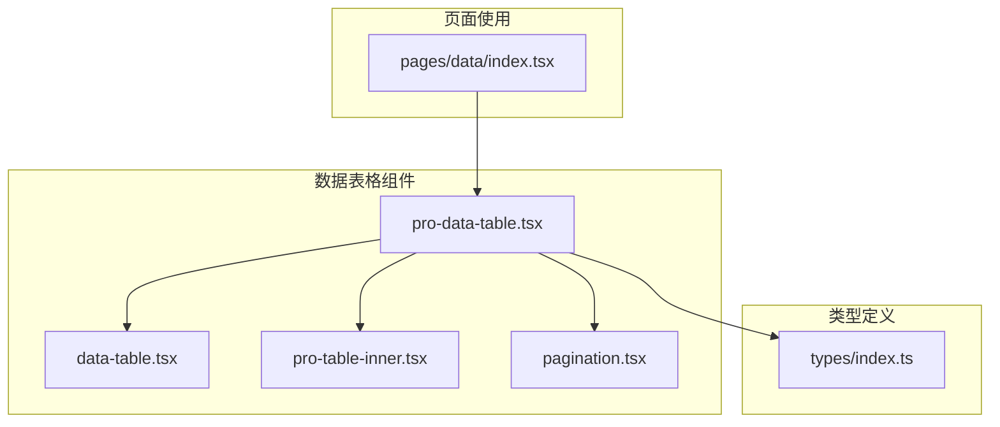
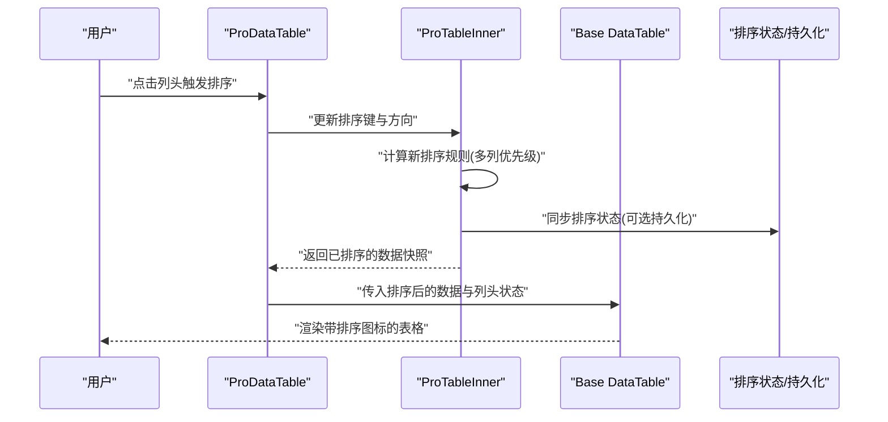
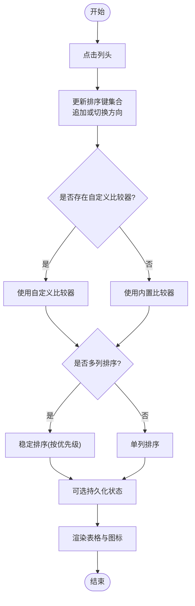
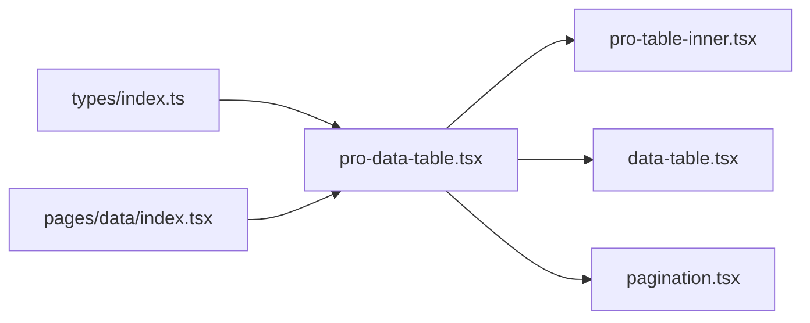

# 排序功能

<cite>
**本文引用的文件**   
- [data-table.tsx](file://web/src/components/data-table/data-table.tsx)
- [pro-data-table.tsx](file://web/src/components/data-table/pro-data-table.tsx)
- [pro-table-inner.tsx](file://web/src/components/data-table/pro-table-inner.tsx)
- [pagination.tsx](file://web/src/components/data-table/pagination.tsx)
- [index.tsx](file://web/src/pages/data/index.tsx)
- [types.ts](file://web/src/types/index.ts)
</cite>

## 目录
1. [简介](#简介)
2. [项目结构](#项目结构)
3. [核心组件](#核心组件)
4. [架构总览](#架构总览)
5. [详细组件分析](#详细组件分析)
6. [依赖关系分析](#依赖关系分析)
7. [性能考虑](#性能考虑)
8. [故障排查指南](#故障排查指南)
9. [结论](#结论)
10. [附录](#附录)

## 简介
本技术文档聚焦 pj3 项目中表格的排序能力，覆盖单列与多列排序的实现机制、状态管理、算法策略、配置方式与最佳实践。文档同时提供 API 参考、使用示例、图标显示与状态持久化等高级特性说明，并给出大数据集场景下的性能优化建议（如虚拟滚动集成）。

## 项目结构
与排序相关的代码主要位于数据表格组件目录与页面使用处：
- 基础表格组件：封装通用渲染与交互
- 专业表格组件：扩展排序、分页、筛选等企业级能力
- 内部实现：承载复杂逻辑（含排序）
- 页面示例：演示如何启用与配置排序

图表来源
- [data-table.tsx](file://web/src/components/data-table/data-table.tsx)
- [pro-data-table.tsx](file://web/src/components/data-table/pro-data-table.tsx)
- [pro-table-inner.tsx](file://web/src/components/data-table/pro-table-inner.tsx)
- [pagination.tsx](file://web/src/components/data-table/pagination.tsx)
- [index.tsx](file://web/src/pages/data/index.tsx)
- [types.ts](file://web/src/types/index.ts)

章节来源
- [data-table.tsx](file://web/src/components/data-table/data-table.tsx)
- [pro-data-table.tsx](file://web/src/components/data-table/pro-data-table.tsx)
- [pro-table-inner.tsx](file://web/src/components/data-table/pro-table-inner.tsx)
- [pagination.tsx](file://web/src/components/data-table/pagination.tsx)
- [index.tsx](file://web/src/pages/data/index.tsx)
- [types.ts](file://web/src/types/index.ts)

## 核心组件
- 基础表格 data-table：提供列定义、行渲染、事件透传等通用能力，为上层排序能力提供渲染基座。
- 专业表格 pro-data-table：对外暴露排序相关属性与方法，维护排序状态，协调内部排序实现与 UI 反馈。
- 内部实现 pro-table-inner：承载排序算法、多列优先级处理、排序方向切换、自定义比较函数执行等核心逻辑。
- 分页 pagination：与排序联动，在页内或跨页场景下配合后端/前端排序策略。
- 页面 index.tsx：展示如何声明列、开启排序、设置默认排序、绑定自定义比较器以及将排序状态持久化到 URL 或本地存储。

章节来源
- [data-table.tsx](file://web/src/components/data-table/data-table.tsx)
- [pro-data-table.tsx](file://web/src/components/data-table/pro-data-table.tsx)
- [pro-table-inner.tsx](file://web/src/components/data-table/pro-table-inner.tsx)
- [pagination.tsx](file://web/src/components/data-table/pagination.tsx)
- [index.tsx](file://web/src/pages/data/index.tsx)

## 架构总览
下图展示了从用户点击列头到最终渲染排序结果的调用链与数据流。

图表来源
- [pro-data-table.tsx](file://web/src/components/data-table/pro-data-table.tsx)
- [pro-table-inner.tsx](file://web/src/components/data-table/pro-table-inner.tsx)
- [data-table.tsx](file://web/src/components/data-table/data-table.tsx)

## 详细组件分析

### 多列排序实现机制
- 排序状态模型
  - 支持多列排序键集合，每列包含字段名、排序方向（升序/降序/未排序）、是否可排序等元信息。
  - 通过“优先级数组”控制多列排序顺序，先按高优先级列比较，再依次降级比较。
- 排序算法流程
  - 当用户点击列头时，若该列已在排序集中则切换方向；否则追加至末尾作为最低优先级。
  - 对数据集进行稳定排序，优先使用列定义的自定义比较函数，若无则回退到内置比较器（字符串、数字、日期等）。
  - 多列比较采用“短路比较”策略：一旦某一层级能分出大小，即返回结果，避免不必要的后续比较。
- 性能优化要点
  - 仅在排序键变化时重新计算，避免重复排序。
  - 对大数据集采用惰性比较与浅拷贝策略，减少对象创建开销。
  - 结合分页时，优先选择服务端排序；若必须前端排序，限制单次排序数据量或使用虚拟滚动。

图表来源
- [pro-table-inner.tsx](file://web/src/components/data-table/pro-table-inner.tsx)
- [pro-data-table.tsx](file://web/src/components/data-table/pro-data-table.tsx)

章节来源
- [pro-table-inner.tsx](file://web/src/components/data-table/pro-table-inner.tsx)
- [pro-data-table.tsx](file://web/src/components/data-table/pro-data-table.tsx)

### 单列排序与多列排序配置
- 单列排序
  - 在列定义中启用可排序开关，指定字段路径与比较器（可选）。
  - 可通过默认排序键与方向初始化首屏排序。
- 多列排序
  - 通过排序键集合维护当前激活的多列及方向。
  - 通过优先级数组明确多列比较顺序。
- 排序方向控制
  - 支持循环切换：未排序 → 升序 → 降序 → 未排序。
  - 可在列级别禁用某些方向的切换。
- 自定义排序函数
  - 列定义中提供比较函数接口，用于处理复杂数据类型（如金额、等级、复合字段）。
  - 比较函数需返回标准比较值（负数、零、正数），保证稳定性。
- 排序优先级设置
  - 通过显式优先级数组或插入顺序决定多列比较次序。
  - 动态调整优先级时，应触发一次完整重排以保证一致性。

章节来源
- [pro-data-table.tsx](file://web/src/components/data-table/pro-data-table.tsx)
- [pro-table-inner.tsx](file://web/src/components/data-table/pro-table-inner.tsx)
- [types.ts](file://web/src/types/index.ts)

### 排序图标显示与交互
- 图标语义
  - 未排序：无箭头或灰色图标
  - 升序：向上箭头
  - 降序：向下箭头
- 交互行为
  - 点击列头切换方向；按住修饰键（如 Shift）可追加为新的排序列。
  - 双击列头可重置该列排序。
- 视觉反馈
  - 当前活跃排序列高亮显示，非活跃列保持中性样式。
  - 鼠标悬停提示当前排序状态与快捷键说明。

章节来源
- [pro-data-table.tsx](file://web/src/components/data-table/pro-data-table.tsx)
- [data-table.tsx](file://web/src/components/data-table/data-table.tsx)

### 排序状态持久化
- URL 参数持久化
  - 将排序键集合与方向序列序列化到查询参数，便于分享与刷新后恢复。
  - 支持只读模式（仅读取 URL 中的排序，不写回）。
- 本地存储持久化
  - 将排序状态写入 localStorage/sessionStorage，按表维度隔离。
  - 提供清理与迁移策略以应对版本升级。
- 与分页联动
  - 切换页码时保留排序状态；跨页排序优先走服务端，避免全量数据在前端排序。

章节来源
- [pro-data-table.tsx](file://web/src/components/data-table/pro-data-table.tsx)
- [pagination.tsx](file://web/src/components/data-table/pagination.tsx)

### 使用示例与 API 参考
- 基本用法
  - 在列定义中启用可排序，并指定字段路径与比较器（可选）。
  - 通过默认排序键与方向初始化首屏排序。
- 高级用法
  - 启用多列排序，设置优先级数组。
  - 将排序状态同步到 URL 或本地存储。
  - 与分页组合，优先使用服务端排序。
- API 要点
  - 列定义：可排序开关、字段路径、比较器、方向约束、标题与图标映射。
  - 表格属性：默认排序、最大排序列数、是否允许取消排序、是否持久化、持久化目标（URL/localStorage）。
  - 回调与事件：排序变更回调、排序状态订阅、图标渲染钩子。

章节来源
- [index.tsx](file://web/src/pages/data/index.tsx)
- [pro-data-table.tsx](file://web/src/components/data-table/pro-data-table.tsx)
- [types.ts](file://web/src/types/index.ts)

## 依赖关系分析
- 组件耦合
  - ProDataTable 依赖 ProTableInner 完成排序计算，依赖 Base DataTable 完成渲染。
  - Pagination 与 ProDataTable 协作，确保排序与分页的一致性。
- 外部依赖
  - 类型定义集中在 types/index.ts，统一排序键、方向、列定义等数据结构。
- 潜在循环依赖
  - 组件间通过 props 与回调解耦，避免直接相互引用导致的循环依赖。

图表来源
- [types.ts](file://web/src/types/index.ts)
- [pro-data-table.tsx](file://web/src/components/data-table/pro-data-table.tsx)
- [pro-table-inner.tsx](file://web/src/components/data-table/pro-table-inner.tsx)
- [data-table.tsx](file://web/src/components/data-table/data-table.tsx)
- [pagination.tsx](file://web/src/components/data-table/pagination.tsx)
- [index.tsx](file://web/src/pages/data/index.tsx)

章节来源
- [types.ts](file://web/src/types/index.ts)
- [pro-data-table.tsx](file://web/src/components/data-table/pro-data-table.tsx)
- [pro-table-inner.tsx](file://web/src/components/data-table/pro-table-inner.tsx)
- [data-table.tsx](file://web/src/components/data-table/data-table.tsx)
- [pagination.tsx](file://web/src/components/data-table/pagination.tsx)
- [index.tsx](file://web/src/pages/data/index.tsx)

## 性能考虑
- 前端排序
  - 数据量较小（通常 < 10k 行）时可直接前端排序；使用稳定排序与惰性比较降低 CPU 占用。
  - 大数据集建议启用虚拟滚动，仅渲染可视区域行，显著减少 DOM 节点数量。
- 服务端排序
  - 大数据集或跨页排序优先使用服务端排序，前端仅传递排序键集合与方向。
  - 合理设计后端索引与排序字段，避免频繁全表扫描。
- 缓存与去抖
  - 对排序结果进行短期缓存，避免重复计算。
  - 在快速连续点击列头时使用去抖，减少不必要重排。
- 内存与 GC
  - 避免在比较函数中创建大量临时对象；尽量使用原始值比较。
  - 及时释放不再使用的排序状态引用，防止内存泄漏。

[本节为通用性能指导，无需列出具体文件来源]

## 故障排查指南
- 排序无效或不生效
  - 检查列定义是否正确启用可排序与字段路径。
  - 确认自定义比较器返回值符合规范（负数/零/正数）。
- 多列排序顺序异常
  - 核对优先级数组或插入顺序是否符合预期。
  - 确认排序键集合未被意外清空或覆盖。
- 图标显示不一致
  - 检查当前列是否在排序集中，以及方向状态是否与 UI 同步。
- 状态丢失
  - 若启用 URL 或本地存储持久化，检查序列化/反序列化逻辑与键命名冲突。
- 性能问题
  - 大数据集请切换到服务端排序或启用虚拟滚动。
  - 检查比较函数复杂度，避免 O(n^2) 操作。

章节来源
- [pro-data-table.tsx](file://web/src/components/data-table/pro-data-table.tsx)
- [pro-table-inner.tsx](file://web/src/components/data-table/pro-table-inner.tsx)
- [pagination.tsx](file://web/src/components/data-table/pagination.tsx)

## 结论
pj3 项目的表格排序功能通过分层组件设计实现了灵活且可扩展的单列与多列排序能力。借助自定义比较器、优先级控制与状态持久化，既能满足常规业务需求，也能支撑企业级复杂场景。在大数据集与跨页场景下，推荐与服务端排序和虚拟滚动结合，以获得更优的性能体验。

[本节为总结性内容，无需列出具体文件来源]

## 附录
- 术语
  - 排序键：标识某一列参与排序的键名。
  - 排序方向：升序、降序或未排序。
  - 优先级：多列排序时的比较顺序。
- 最佳实践清单
  - 小数据量用前端排序，大数据量用服务端排序。
  - 始终提供稳定的比较器，避免不稳定排序导致闪烁。
  - 将排序状态持久化到 URL，提升可分享性与可复现性。
  - 为常用排序字段建立后端索引，提高响应速度。

[本节为概念性补充，无需列出具体文件来源]