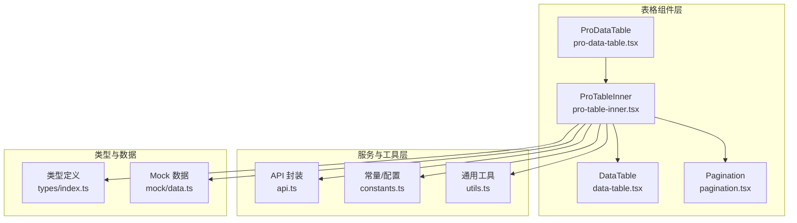
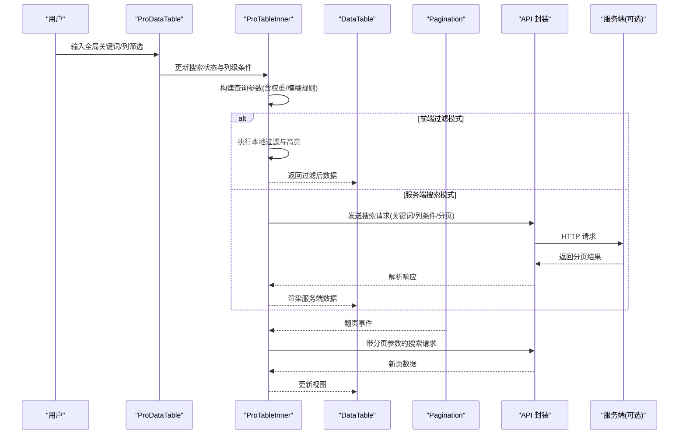
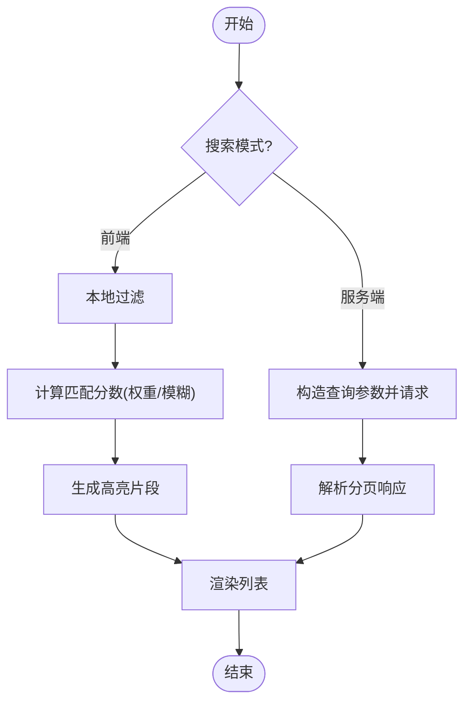
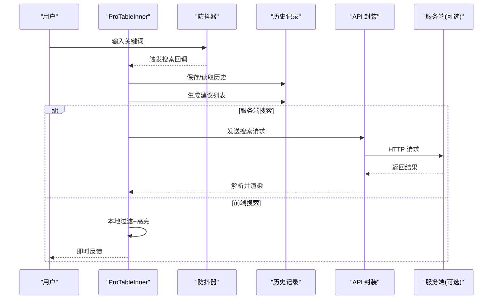
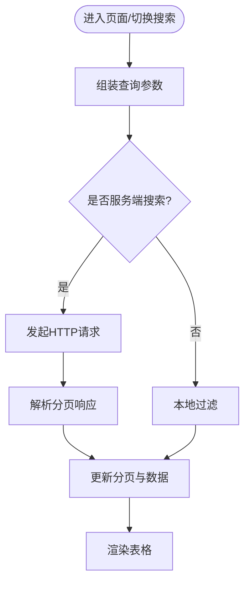
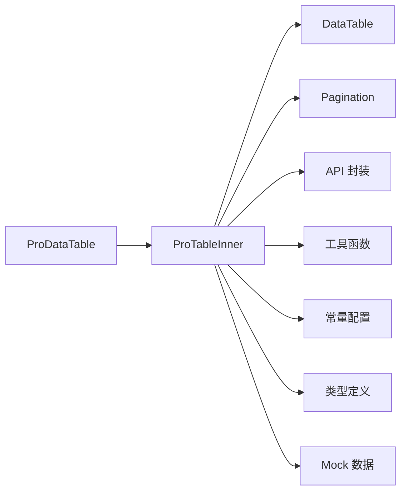

# 搜索功能

<cite>
**本文引用的文件**   
- [data-table.tsx](file://web/src/components/data-table/data-table.tsx)
- [pro-data-table.tsx](file://web/src/components/data-table/pro-data-table.tsx)
- [pro-table-inner.tsx](file://web/src/components/data-table/pro-table-inner.tsx)
- [pagination.tsx](file://web/src/components/data-table/pagination.tsx)
- [api.ts](file://web/src/lib/api.ts)
- [constants.ts](file://web/src/lib/constants.ts)
- [utils.ts](file://web/src/lib/utils.ts)
- [index.ts](file://web/src/types/index.ts)
- [data.ts](file://web/src/mock/data.ts)
</cite>

## 目录
1. [简介](#简介)
2. [项目结构](#项目结构)
3. [核心组件](#核心组件)
4. [架构总览](#架构总览)
5. [详细组件分析](#详细组件分析)
6. [依赖关系分析](#依赖关系分析)
7. [性能考虑](#性能考虑)
8. [故障排查指南](#故障排查指南)
9. [结论](#结论)
10. [附录：API参考](#附录api参考)

## 简介
本技术文档聚焦于 pj3 项目的表格搜索能力，覆盖全局搜索与列级搜索的实现机制、配置灵活性、结果高亮、实时搜索、搜索历史与建议等高级特性，并给出服务端集成与性能优化最佳实践。文档面向不同技术背景的读者，既提供高层概览，也深入到关键实现细节与流程图示。

## 项目结构
与搜索相关的代码主要位于 web/src/components/data-table 目录，配合 lib 层的 API 与工具函数、types 类型定义以及 mock 数据共同构成完整的搜索体验。

图表来源
- [pro-data-table.tsx](file://web/src/components/data-table/pro-data-table.tsx)
- [pro-table-inner.tsx](file://web/src/components/data-table/pro-table-inner.tsx)
- [data-table.tsx](file://web/src/components/data-table/data-table.tsx)
- [pagination.tsx](file://web/src/components/data-table/pagination.tsx)
- [api.ts](file://web/src/lib/api.ts)
- [constants.ts](file://web/src/lib/constants.ts)
- [utils.ts](file://web/src/lib/utils.ts)
- [index.ts](file://web/src/types/index.ts)
- [data.ts](file://web/src/mock/data.ts)

章节来源
- [pro-data-table.tsx](file://web/src/components/data-table/pro-data-table.tsx)
- [pro-table-inner.tsx](file://web/src/components/data-table/pro-table-inner.tsx)
- [data-table.tsx](file://web/src/components/data-table/data-table.tsx)
- [pagination.tsx](file://web/src/components/data-table/pagination.tsx)
- [api.ts](file://web/src/lib/api.ts)
- [constants.ts](file://web/src/lib/constants.ts)
- [utils.ts](file://web/src/lib/utils.ts)
- [index.ts](file://web/src/types/index.ts)
- [data.ts](file://web/src/mock/data.ts)

## 核心组件
- ProDataTable：对外暴露的“专业版”表格组件，聚合搜索、分页、排序、筛选等能力，负责将用户输入转换为查询参数并驱动数据加载。
- ProTableInner：内部实现，承载搜索状态管理、过滤逻辑、结果渲染与交互（如高亮、建议）。
- DataTable：基础表格展示与分页控制，接收过滤后的数据与分页信息。
- Pagination：分页控件，支持页码切换与每页条数调整，常与搜索联动触发重新加载。
- API 封装：统一发起请求，携带搜索条件、分页参数与排序字段。
- 常量与工具：提供默认搜索配置、防抖策略、匹配算法与高亮标记工具。
- 类型定义：约束搜索条件、列配置、搜索结果项的结构。
- Mock 数据：用于本地演示与测试搜索流程。

章节来源
- [pro-data-table.tsx](file://web/src/components/data-table/pro-data-table.tsx)
- [pro-table-inner.tsx](file://web/src/components/data-table/pro-table-inner.tsx)
- [data-table.tsx](file://web/src/components/data-table/data-table.tsx)
- [pagination.tsx](file://web/src/components/data-table/pagination.tsx)
- [api.ts](file://web/src/lib/api.ts)
- [constants.ts](file://web/src/lib/constants.ts)
- [utils.ts](file://web/src/lib/utils.ts)
- [index.ts](file://web/src/types/index.ts)
- [data.ts](file://web/src/mock/data.ts)

## 架构总览
下图展示了从用户输入到最终渲染的关键调用链，包括全局搜索与列级搜索的统一入口、过滤与高亮、分页与服务端同步。

图表来源
- [pro-data-table.tsx](file://web/src/components/data-table/pro-data-table.tsx)
- [pro-table-inner.tsx](file://web/src/components/data-table/pro-table-inner.tsx)
- [data-table.tsx](file://web/src/components/data-table/data-table.tsx)
- [pagination.tsx](file://web/src/components/data-table/pagination.tsx)
- [api.ts](file://web/src/lib/api.ts)

## 详细组件分析

### 全局搜索与列级搜索实现机制
- 统一入口：ProDataTable 暴露 searchQuery 与 columnFilters 两个维度，分别对应全局关键词与各列独立条件。
- 状态管理：ProTableInner 维护当前搜索词、列级过滤器、是否启用服务端搜索、分页与排序等状态。
- 过滤策略：
  - 前端模式：对内存数据进行逐行匹配，按列权重加权评分，支持大小写不敏感与多词拆分。
  - 服务端模式：将搜索条件序列化为查询参数，交由后端检索引擎处理，前端仅做轻量校验与结果渲染。
- 模糊匹配：
  - 支持子串包含、前缀匹配、分词匹配（空格/标点切分）三种模式，可通过配置选择。
  - 针对中文场景，可结合分词器或拼音首字母索引提升召回率（通过扩展列配置实现）。
- 结果高亮：
  - 在文本节点中定位匹配片段，包裹高亮标签；避免破坏 HTML 结构，使用安全的插入方式。
  - 支持自定义高亮样式类名，便于主题化。

图表来源
- [pro-table-inner.tsx](file://web/src/components/data-table/pro-table-inner.tsx)
- [utils.ts](file://web/src/lib/utils.ts)
- [constants.ts](file://web/src/lib/constants.ts)

章节来源
- [pro-data-table.tsx](file://web/src/components/data-table/pro-data-table.tsx)
- [pro-table-inner.tsx](file://web/src/components/data-table/pro-table-inner.tsx)
- [utils.ts](file://web/src/lib/utils.ts)
- [constants.ts](file://web/src/lib/constants.ts)

### 搜索配置灵活性
- 搜索字段配置：
  - 列级 searchable 开关：控制某列是否参与搜索。
  - 列级 filterType：指定该列的过滤类型（文本、数字范围、枚举下拉等）。
  - 列级 weight：为各列设置权重，影响全局搜索时的命中优先级。
  - 列级 highlight：是否对该列内容启用高亮。
- 搜索行为配置：
  - fuzzyMode：选择模糊匹配模式（子串/前缀/分词）。
  - caseSensitive：是否区分大小写。
  - serverSearch：是否走服务端搜索。
  - debounceMs：输入防抖延迟。
  - maxSuggestions：搜索建议最大条数。
- 结果展示配置：
  - highlightClass：高亮样式类名。
  - renderCell：自定义单元格渲染以支持富文本高亮。
- 示例路径（不含代码）：
  - 列级搜索配置：[pro-data-table.tsx](file://web/src/components/data-table/pro-data-table.tsx)
  - 搜索行为与高亮：[pro-table-inner.tsx](file://web/src/components/data-table/pro-table-inner.tsx)
  - 常量与默认值：[constants.ts](file://web/src/lib/constants.ts)

章节来源
- [pro-data-table.tsx](file://web/src/components/data-table/pro-data-table.tsx)
- [pro-table-inner.tsx](file://web/src/components/data-table/pro-table-inner.tsx)
- [constants.ts](file://web/src/lib/constants.ts)

### 搜索算法与索引优化
- 算法要点：
  - 多词拆分：将输入按分隔符拆分为多个 token，分别匹配后再合并评分。
  - 权重聚合：按列权重累加命中得分，超过阈值才纳入结果。
  - 快速失败：当单列未开启 searchable 时直接跳过，减少无效计算。
- 索引优化：
  - 预计算索引：对高频列建立倒排索引或前缀树（Trie），加速前缀匹配。
  - 缓存命中：对相同查询条件进行短期缓存，避免重复计算。
  - 惰性求值：仅在可见区域内计算高亮，降低首屏开销。
- 复杂度评估：
  - 前端过滤时间复杂度近似 O(N·M)，N 为行数，M 为列数；通过索引可将 M 侧降至 O(logM) 或常数级。
  - 空间复杂度取决于索引规模，通常与数据量线性相关。

章节来源
- [pro-table-inner.tsx](file://web/src/components/data-table/pro-table-inner.tsx)
- [utils.ts](file://web/src/lib/utils.ts)

### 实时搜索、搜索历史与搜索建议
- 实时搜索：
  - 基于防抖的输入监听，避免频繁触发过滤或服务端请求。
  - 支持取消上一次请求（AbortController）以减少竞态。
- 搜索历史：
  - 记录最近 N 次搜索词，支持一键回填与清空。
  - 持久化存储至 localStorage，刷新后恢复。
- 搜索建议：
  - 根据历史与热门词生成候选，支持键盘导航与回车确认。
  - 建议项可携带权重，优先展示更相关词条。

图表来源
- [pro-table-inner.tsx](file://web/src/components/data-table/pro-table-inner.tsx)
- [api.ts](file://web/src/lib/api.ts)

章节来源
- [pro-table-inner.tsx](file://web/src/components/data-table/pro-table-inner.tsx)
- [api.ts](file://web/src/lib/api.ts)

### 分页加载与服务端搜索集成
- 分页联动：
  - 翻页时自动带上当前搜索条件与排序字段，确保跨页一致性。
  - 支持每页条数变化时重置到第一页，避免空页显示。
- 服务端集成：
  - 将 searchQuery、columnFilters、sorters、page、pageSize 序列化到请求体或查询字符串。
  - 服务端返回 total、list、page、pageSize 等标准字段，前端据此更新分页状态。
- 错误处理：
  - 网络异常时回退到上次成功结果或空数据集，并提示用户重试。
  - 超时与取消请求需正确清理资源，避免内存泄漏。

图表来源
- [pro-table-inner.tsx](file://web/src/components/data-table/pro-table-inner.tsx)
- [pagination.tsx](file://web/src/components/data-table/pagination.tsx)
- [api.ts](file://web/src/lib/api.ts)

章节来源
- [pro-table-inner.tsx](file://web/src/components/data-table/pro-table-inner.tsx)
- [pagination.tsx](file://web/src/components/data-table/pagination.tsx)
- [api.ts](file://web/src/lib/api.ts)

## 依赖关系分析
- 组件耦合：
  - ProDataTable 作为门面，低耦合地组合 ProTableInner、Pagination 与外部 API。
  - ProTableInner 依赖 utils 与 constants 完成搜索与高亮逻辑，保持业务与工具解耦。
- 外部依赖：
  - API 封装统一处理请求生命周期，便于替换为真实后端或 Mock。
  - types 提供强类型约束，降低误用风险。
- 潜在循环依赖：
  - 组件间通过 props 与回调通信，避免直接相互引用，降低循环依赖风险。

图表来源
- [pro-data-table.tsx](file://web/src/components/data-table/pro-data-table.tsx)
- [pro-table-inner.tsx](file://web/src/components/data-table/pro-table-inner.tsx)
- [data-table.tsx](file://web/src/components/data-table/data-table.tsx)
- [pagination.tsx](file://web/src/components/data-table/pagination.tsx)
- [api.ts](file://web/src/lib/api.ts)
- [utils.ts](file://web/src/lib/utils.ts)
- [constants.ts](file://web/src/lib/constants.ts)
- [index.ts](file://web/src/types/index.ts)
- [data.ts](file://web/src/mock/data.ts)

章节来源
- [pro-data-table.tsx](file://web/src/components/data-table/pro-data-table.tsx)
- [pro-table-inner.tsx](file://web/src/components/data-table/pro-table-inner.tsx)
- [data-table.tsx](file://web/src/components/data-table/data-table.tsx)
- [pagination.tsx](file://web/src/components/data-table/pagination.tsx)
- [api.ts](file://web/src/lib/api.ts)
- [utils.ts](file://web/src/lib/utils.ts)
- [constants.ts](file://web/src/lib/constants.ts)
- [index.ts](file://web/src/types/index.ts)
- [data.ts](file://web/src/mock/data.ts)

## 性能考虑
- 防抖与节流：
  - 输入防抖默认 300ms，可根据数据规模调优；大数据集建议提高延迟。
  - 服务端请求采用取消机制，避免旧请求覆盖新结果。
- 分页与虚拟滚动：
  - 大列表建议启用分页与服务端搜索；必要时结合虚拟滚动减少 DOM 压力。
- 索引与缓存：
  - 对热点列建立索引，缩短匹配时间；对相同查询进行短期缓存。
- 高亮成本：
  - 仅对可视区域高亮；长文本可截断或懒加载详情。
- 内存管理：
  - 及时清理定时器与 AbortController；避免闭包持有大对象引用。

## 故障排查指南
- 搜索无结果：
  - 检查列级 searchable 与 filterType 配置是否正确。
  - 确认 fuzzyMode 与 caseSensitive 是否符合预期。
  - 若启用服务端搜索，核对后端接口字段映射与分页参数。
- 高亮异常：
  - 确认单元格渲染是否允许插入高亮标签；避免 XSS 风险。
  - 检查 highlightClass 是否被 CSS 覆盖。
- 性能问题：
  - 观察防抖延迟与数据量；必要时切换到服务端搜索。
  - 检查是否存在重复请求或未取消的异步任务。
- 分页不一致：
  - 验证翻页时是否携带完整搜索条件与排序字段。
  - 核对服务端返回的 total 与实际数据长度是否一致。

章节来源
- [pro-table-inner.tsx](file://web/src/components/data-table/pro-table-inner.tsx)
- [api.ts](file://web/src/lib/api.ts)
- [pagination.tsx](file://web/src/components/data-table/pagination.tsx)

## 结论
pj3 的表格搜索通过 ProDataTable 与 ProTableInner 的组合，提供了灵活的全局与列级搜索能力，支持前端与后端两种模式，具备高亮、建议、历史与分页联动等特性。通过合理的防抖、索引与分页策略，可在大数据量下保持良好体验。建议在复杂业务场景中优先采用服务端搜索，并结合列级权重与模糊模式提升相关性。

## 附录：API参考
以下为搜索相关的主要接口与配置项说明（不含具体代码，仅描述用途与字段含义）：

- 搜索状态与参数
  - searchQuery：全局搜索关键词
  - columnFilters：列级过滤集合，每项包含 field、operator、value
  - sorters：排序字段与方向
  - page/pageSize：分页参数
  - serverSearch：是否启用服务端搜索
  - fuzzyMode：模糊匹配模式（子串/前缀/分词）
  - caseSensitive：是否区分大小写
  - debounceMs：输入防抖毫秒数
  - maxSuggestions：搜索建议数量上限

- 列级搜索配置
  - searchable：是否参与搜索
  - filterType：过滤类型（text/range/select 等）
  - weight：列权重，影响全局搜索评分
  - highlight：是否对该列启用高亮
  - renderCell：自定义渲染函数，用于高亮与安全输出

- 搜索结果与高亮
  - highlightClass：高亮样式类名
  - matchedSegments：匹配片段数组（供调试或自定义渲染）

- 搜索历史与建议
  - history：最近搜索词列表
  - suggestions：建议词条列表，含 score 与 text

- 服务端集成约定
  - 请求参数：searchQuery、columnFilters、sorters、page、pageSize
  - 响应字段：total、list、page、pageSize
  - 错误码与消息：统一由 API 封装处理并向上抛出

章节来源
- [pro-data-table.tsx](file://web/src/components/data-table/pro-data-table.tsx)
- [pro-table-inner.tsx](file://web/src/components/data-table/pro-table-inner.tsx)
- [api.ts](file://web/src/lib/api.ts)
- [constants.ts](file://web/src/lib/constants.ts)
- [index.ts](file://web/src/types/index.ts)