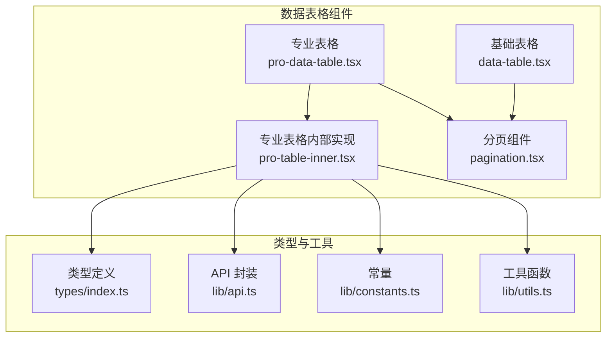
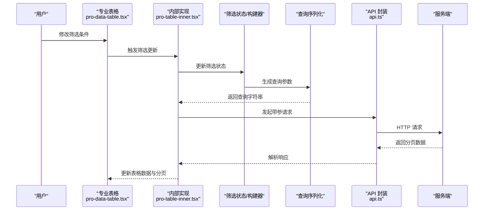
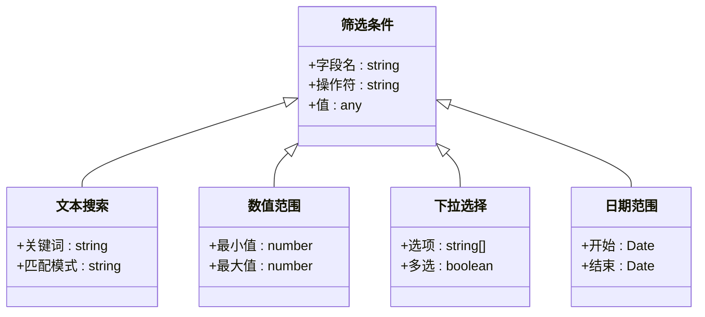
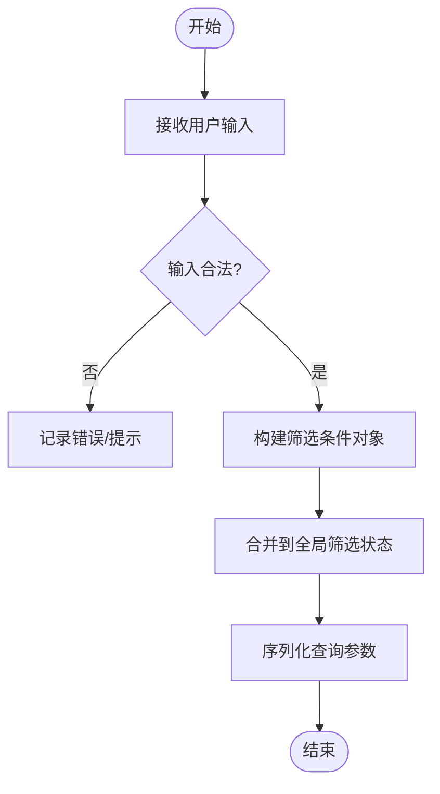
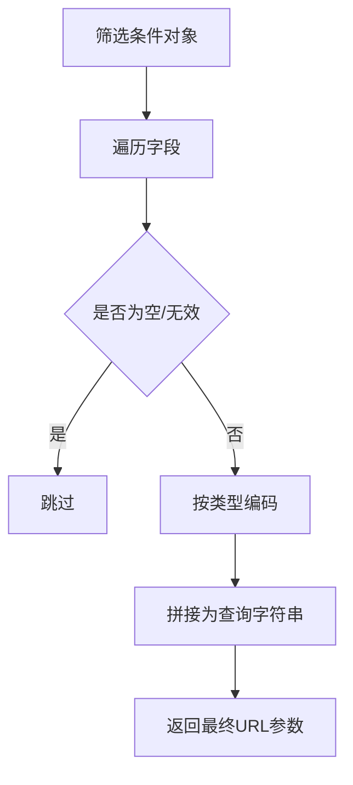
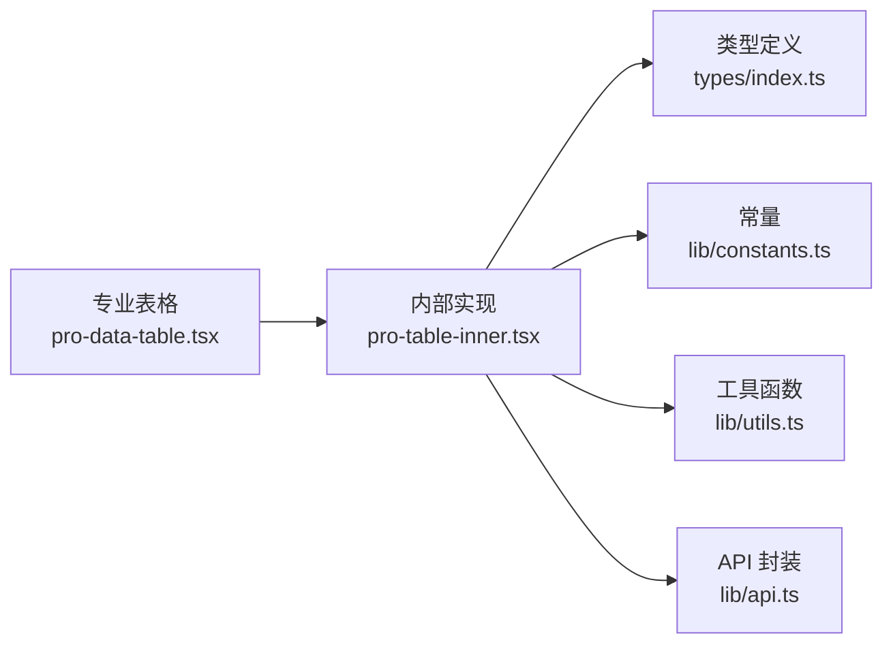

# 筛选功能

<cite>
**本文引用的文件**   
- [data-table.tsx](file://web/src/components/data-table/data-table.tsx)
- [pro-data-table.tsx](file://web/src/components/data-table/pro-data-table.tsx)
- [pro-table-inner.tsx](file://web/src/components/data-table/pro-table-inner.tsx)
- [pagination.tsx](file://web/src/components/data-table/pagination.tsx)
- [index.ts](file://web/src/types/index.ts)
- [api.ts](file://web/src/lib/api.ts)
- [constants.ts](file://web/src/lib/constants.ts)
- [utils.ts](file://web/src/lib/utils.ts)
</cite>

## 目录
1. [简介](#简介)
2. [项目结构](#项目结构)
3. [核心组件](#核心组件)
4. [架构总览](#架构总览)
5. [详细组件分析](#详细组件分析)
6. [依赖关系分析](#依赖关系分析)
7. [性能考虑](#性能考虑)
8. [故障排查指南](#故障排查指南)
9. [结论](#结论)
10. [附录：API与配置参考](#附录api与配置参考)

## 简介
本技术文档聚焦于 pj3 项目的表格筛选能力，围绕条件筛选系统的架构设计、筛选器类型定义、条件构建器模式、查询参数序列化机制展开，并覆盖文本搜索、数值范围、下拉选择、日期范围等常见筛选器的实现要点。同时提供筛选状态管理、结果缓存、条件持久化等高级特性说明，以及防抖、增量更新与服务端筛选集成等性能优化策略与最佳实践。

## 项目结构
筛选相关代码主要位于数据表格组件层与类型/工具库中，采用“基础表格 + 专业表格 + 内部实现”的分层组织方式：
- 基础表格：提供分页、列渲染等通用能力
- 专业表格：封装筛选、排序、分页、服务端交互等高级特性
- 内部实现：承载筛选状态、条件构建、序列化与去抖等逻辑
- 类型与工具：统一筛选条件类型、常量、请求封装与通用工具

图表来源
- [data-table.tsx](file://web/src/components/data-table/data-table.tsx)
- [pro-data-table.tsx](file://web/src/components/data-table/pro-data-table.tsx)
- [pro-table-inner.tsx](file://web/src/components/data-table/pro-table-inner.tsx)
- [pagination.tsx](file://web/src/components/data-table/pagination.tsx)
- [index.ts](file://web/src/types/index.ts)
- [api.ts](file://web/src/lib/api.ts)
- [constants.ts](file://web/src/lib/constants.ts)
- [utils.ts](file://web/src/lib/utils.ts)

章节来源
- [data-table.tsx](file://web/src/components/data-table/data-table.tsx)
- [pro-data-table.tsx](file://web/src/components/data-table/pro-data-table.tsx)
- [pro-table-inner.tsx](file://web/src/components/data-table/pro-table-inner.tsx)
- [pagination.tsx](file://web/src/components/data-table/pagination.tsx)
- [index.ts](file://web/src/types/index.ts)
- [api.ts](file://web/src/lib/api.ts)
- [constants.ts](file://web/src/lib/constants.ts)
- [utils.ts](file://web/src/lib/utils.ts)

## 核心组件
- 基础表格（data-table）：负责列定义、行渲染、分页展示等基础能力，为上层筛选扩展提供稳定基座。
- 专业表格（pro-data-table）：对外暴露筛选、排序、分页、服务端加载的统一接口；内部委托给内部实现完成筛选状态管理与查询构建。
- 专业表格内部实现（pro-table-inner）：维护筛选状态、条件构建器、查询参数序列化、去抖与缓存、与服务端 API 的交互。
- 分页组件（pagination）：与筛选联动，在筛选变化时重置或保持页码，保证用户体验一致性。

章节来源
- [data-table.tsx](file://web/src/components/data-table/data-table.tsx)
- [pro-data-table.tsx](file://web/src/components/data-table/pro-data-table.tsx)
- [pro-table-inner.tsx](file://web/src/components/data-table/pro-table-inner.tsx)
- [pagination.tsx](file://web/src/components/data-table/pagination.tsx)

## 架构总览
筛选系统采用“条件构建器 + 查询参数序列化 + 状态管理”的组合模式：
- 条件构建器：将用户输入转换为统一的筛选条件对象
- 查询参数序列化：将筛选条件序列化为 URL 查询字符串，支持持久化与分享
- 状态管理：集中维护筛选状态，驱动表格重新加载与分页联动
- 服务端集成：通过 API 封装发起带筛选参数的请求，返回分页数据

图表来源
- [pro-data-table.tsx](file://web/src/components/data-table/pro-data-table.tsx)
- [pro-table-inner.tsx](file://web/src/components/data-table/pro-table-inner.tsx)
- [api.ts](file://web/src/lib/api.ts)

## 详细组件分析

### 筛选器类型定义
- 统一筛选条件模型：以字段名为键，值为具体筛选值（如字符串、数值、区间、枚举集合等）
- 筛选器类型：文本搜索、数值范围、下拉选择、日期范围等
- 字段级配置：包含显示名、默认值、是否可空、校验规则、选项源等

图表来源
- [index.ts](file://web/src/types/index.ts)

章节来源
- [index.ts](file://web/src/types/index.ts)

### 条件构建器模式
- 职责：将用户输入映射为统一筛选条件对象，支持链式添加、合并、清空
- 关键点：
  - 原子操作：每个筛选器只负责自身字段的条件构造
  - 组合策略：按字段聚合，避免重复与冲突
  - 校验前置：在构建阶段进行基本合法性检查

图表来源
- [pro-table-inner.tsx](file://web/src/components/data-table/pro-table-inner.tsx)
- [utils.ts](file://web/src/lib/utils.ts)

章节来源
- [pro-table-inner.tsx](file://web/src/components/data-table/pro-table-inner.tsx)
- [utils.ts](file://web/src/lib/utils.ts)

### 查询参数序列化机制
- 目标：将筛选条件序列化为稳定的 URL 查询字符串，便于刷新、分享与回退
- 策略：
  - 扁平化：字段名作为 key，值根据类型编码（如数组使用多值或分隔符）
  - 过滤空值：忽略未设置或无效的筛选项
  - 稳定性：对枚举与日期进行规范化处理，确保相同语义产生相同字符串

图表来源
- [pro-table-inner.tsx](file://web/src/components/data-table/pro-table-inner.tsx)
- [constants.ts](file://web/src/lib/constants.ts)

章节来源
- [pro-table-inner.tsx](file://web/src/components/data-table/pro-table-inner.tsx)
- [constants.ts](file://web/src/lib/constants.ts)

### 文本搜索筛选器
- 行为：对指定字段进行模糊匹配，支持大小写不敏感与多词拆分
- 配置项：字段名、占位符、默认值、是否启用高亮（前端展示）、是否服务端匹配
- 性能建议：结合去抖与服务端匹配，减少前端计算量

章节来源
- [pro-data-table.tsx](file://web/src/components/data-table/pro-data-table.tsx)
- [pro-table-inner.tsx](file://web/src/components/data-table/pro-table-inner.tsx)

### 数值范围筛选器
- 行为：支持最小值/最大值区间筛选，含闭区间/开区间策略
- 配置项：字段名、单位、步长、默认区间、校验范围
- 边界处理：空值表示不限制该侧；非法输入需拦截并提示

章节来源
- [pro-data-table.tsx](file://web/src/components/data-table/pro-data-table.tsx)
- [pro-table-inner.tsx](file://web/src/components/data-table/pro-table-inner.tsx)

### 下拉选择筛选器
- 行为：单选或多选，支持远程选项加载与本地缓存
- 配置项：字段名、选项源、是否多选、是否可搜索、默认选中
- 性能建议：选项量大时使用虚拟滚动与懒加载

章节来源
- [pro-data-table.tsx](file://web/src/components/data-table/pro-data-table.tsx)
- [pro-table-inner.tsx](file://web/src/components/data-table/pro-table-inner.tsx)

### 日期范围筛选器
- 行为：支持起止日期选择，自动归一化时区与格式
- 配置项：字段名、默认范围、可选范围、快捷预设
- 序列化：使用 ISO 字符串或时间戳，确保跨端一致

章节来源
- [pro-data-table.tsx](file://web/src/components/data-table/pro-data-table.tsx)
- [pro-table-inner.tsx](file://web/src/components/data-table/pro-table-inner.tsx)

### 筛选状态管理与结果缓存
- 状态管理：集中维护当前筛选条件、加载态、错误态、分页信息
- 缓存策略：
  - 内存缓存：基于查询字符串缓存最近结果，命中则直接返回
  - 失效策略：筛选条件变更或分页切换时失效对应缓存
- 持久化：将筛选条件写入 URL，支持刷新恢复与分享链接

章节来源
- [pro-table-inner.tsx](file://web/src/components/data-table/pro-table-inner.tsx)
- [api.ts](file://web/src/lib/api.ts)

### 筛选条件持久化与回退
- URL 同步：筛选变化时更新查询参数，保留分页与排序
- 初始化恢复：从 URL 解析筛选条件并回填表单
- 回退兼容：当后端不支持某筛选字段时，优雅降级为前端过滤或忽略

章节来源
- [pro-table-inner.tsx](file://web/src/components/data-table/pro-table-inner.tsx)
- [constants.ts](file://web/src/lib/constants.ts)

## 依赖关系分析
- 组件耦合：
  - 专业表格依赖内部实现完成筛选与数据加载
  - 内部实现依赖类型定义、常量、工具函数与 API 封装
- 外部依赖：
  - API 封装负责网络请求与错误处理
  - 工具函数提供去抖、深比较、格式化等能力

图表来源
- [pro-data-table.tsx](file://web/src/components/data-table/pro-data-table.tsx)
- [pro-table-inner.tsx](file://web/src/components/data-table/pro-table-inner.tsx)
- [index.ts](file://web/src/types/index.ts)
- [constants.ts](file://web/src/lib/constants.ts)
- [utils.ts](file://web/src/lib/utils.ts)
- [api.ts](file://web/src/lib/api.ts)

章节来源
- [pro-data-table.tsx](file://web/src/components/data-table/pro-data-table.tsx)
- [pro-table-inner.tsx](file://web/src/components/data-table/pro-table-inner.tsx)
- [index.ts](file://web/src/types/index.ts)
- [constants.ts](file://web/src/lib/constants.ts)
- [utils.ts](file://web/src/lib/utils.ts)
- [api.ts](file://web/src/lib/api.ts)

## 性能考虑
- 防抖处理：对高频输入（如文本搜索）进行去抖，降低请求频率
- 增量更新：仅对受影响的筛选字段进行局部重建与请求
- 服务端筛选：优先在服务端执行复杂筛选与分页，减少前端负载
- 缓存复用：基于查询字符串缓存结果，避免重复请求
- 选项懒加载：下拉选项按需加载与虚拟滚动，提升大列表体验
- 序列化优化：避免不必要的字段参与序列化，减少 URL 长度

[本节为通用指导，无需特定文件引用]

## 故障排查指南
- 常见问题
  - 筛选后无数据：检查查询参数是否正确序列化、服务端字段映射是否一致
  - 刷新丢失筛选：确认 URL 同步与初始化恢复逻辑是否生效
  - 下拉选项过多卡顿：启用虚拟滚动与懒加载
  - 日期跨时区异常：统一使用 UTC 或固定时区进行序列化
- 定位步骤
  - 查看 URL 查询字符串是否符合预期
  - 检查 API 请求参数与响应结构
  - 验证筛选状态与表单控件的双向绑定
  - 审查缓存命中与失效时机

章节来源
- [pro-table-inner.tsx](file://web/src/components/data-table/pro-table-inner.tsx)
- [api.ts](file://web/src/lib/api.ts)

## 结论
pj3 的表格筛选功能通过“条件构建器 + 查询参数序列化 + 状态管理”的清晰分层，实现了可扩展、可测试、高性能的筛选体系。配合防抖、缓存与服务端集成等策略，可在复杂业务场景下保持稳定与流畅的用户体验。

[本节为总结性内容，无需特定文件引用]

## 附录：API与配置参考

### 筛选器配置项（字段级）
- 字段名：用于标识筛选字段
- 显示名：界面展示的友好名称
- 类型：文本搜索、数值范围、下拉选择、日期范围等
- 默认值：初始筛选条件
- 是否必填：控制空值处理策略
- 选项源：下拉选择的静态或动态数据源
- 校验规则：范围、格式、唯一性等约束
- 服务端开关：是否由服务端执行筛选

章节来源
- [index.ts](file://web/src/types/index.ts)
- [pro-data-table.tsx](file://web/src/components/data-table/pro-data-table.tsx)

### 查询参数规范
- 命名约定：字段名作为 key，值按类型编码
- 空值处理：未设置的筛选项不参与序列化
- 稳定性：枚举与日期标准化，确保相同语义等价
- 兼容性：新增字段向后兼容，旧客户端忽略未知字段

章节来源
- [pro-table-inner.tsx](file://web/src/components/data-table/pro-table-inner.tsx)
- [constants.ts](file://web/src/lib/constants.ts)

### 状态与事件
- 状态字段：筛选条件、加载态、错误态、分页信息
- 事件回调：筛选变化、加载开始/结束、错误捕获
- 生命周期：初始化恢复、销毁清理缓存

章节来源
- [pro-table-inner.tsx](file://web/src/components/data-table/pro-table-inner.tsx)

### 服务端集成要点
- 请求封装：统一附加筛选参数与分页信息
- 错误处理：区分网络错误、业务错误与参数错误
- 幂等性：相同查询参数多次请求应返回一致结果
- 超时与重试：合理设置超时与重试策略

章节来源
- [api.ts](file://web/src/lib/api.ts)