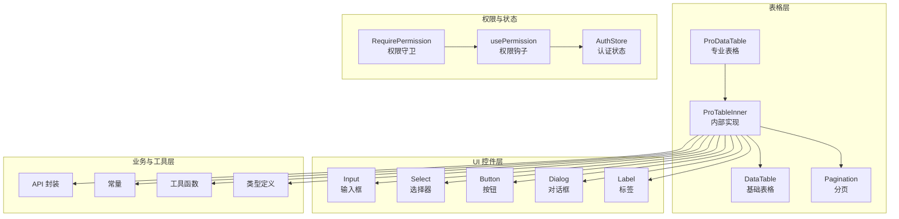
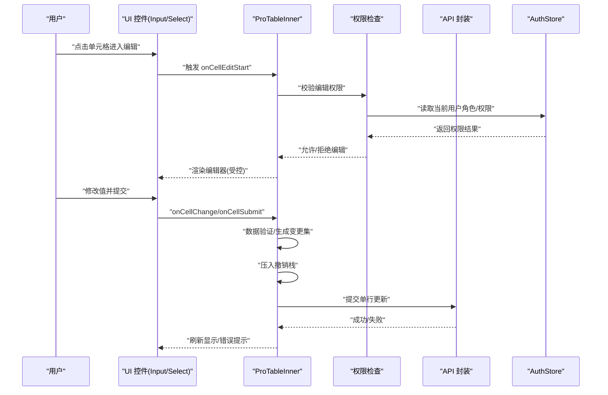
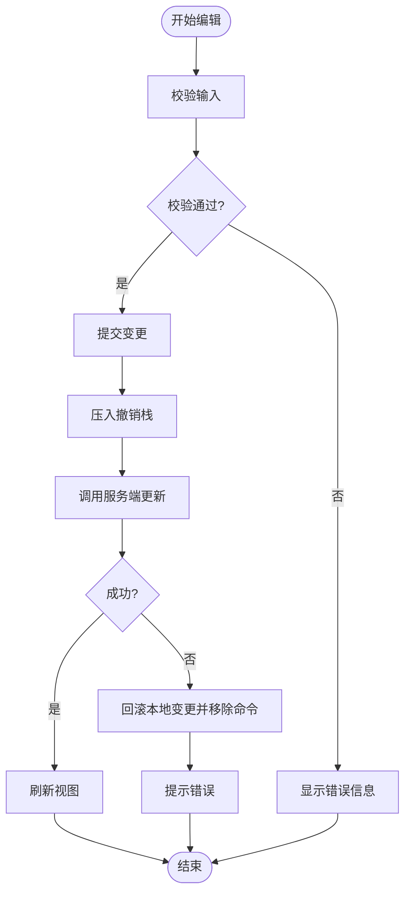
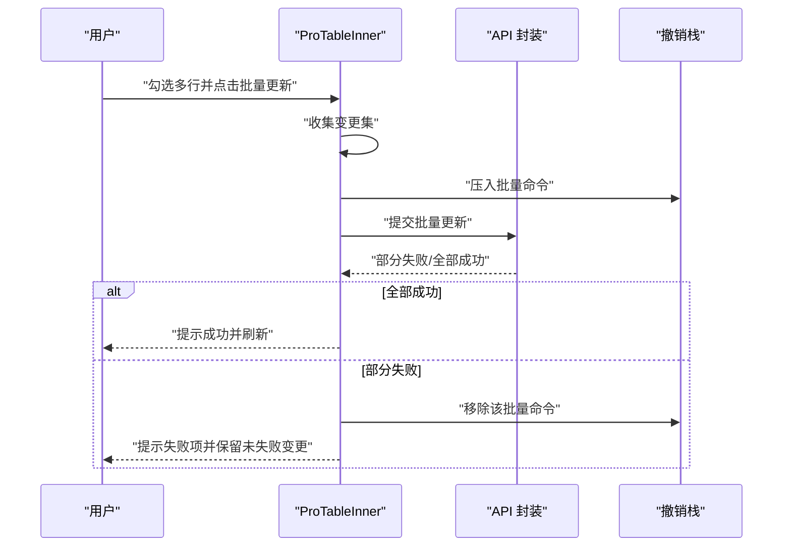
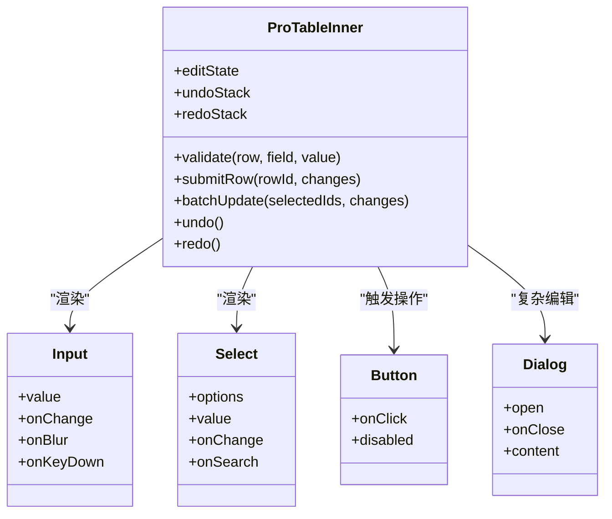
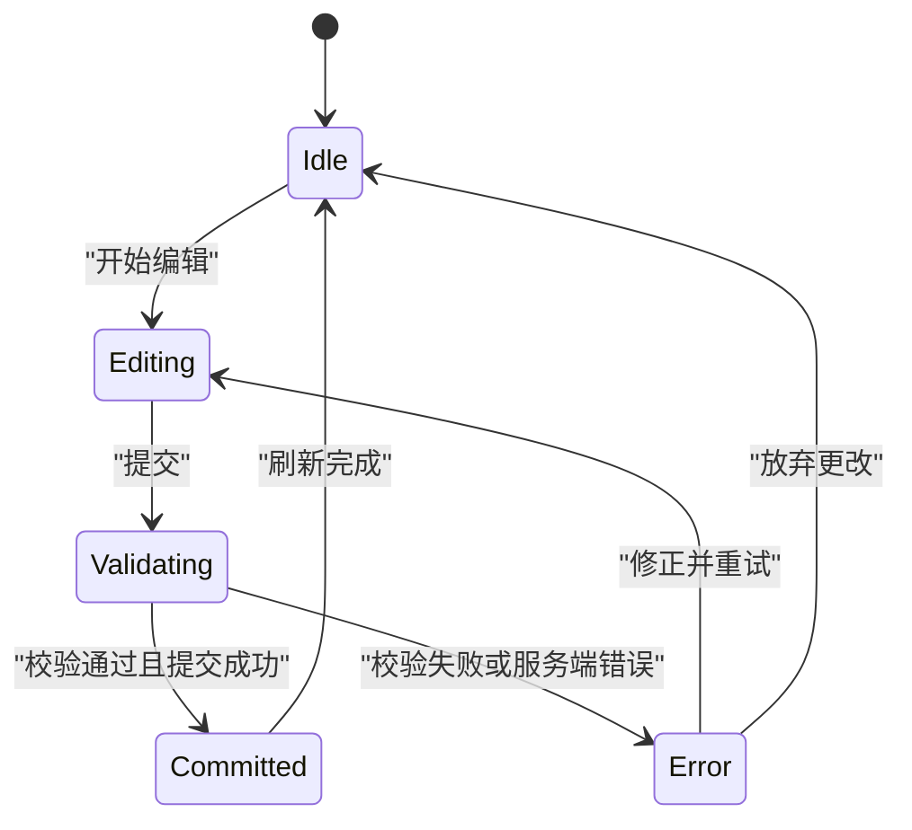
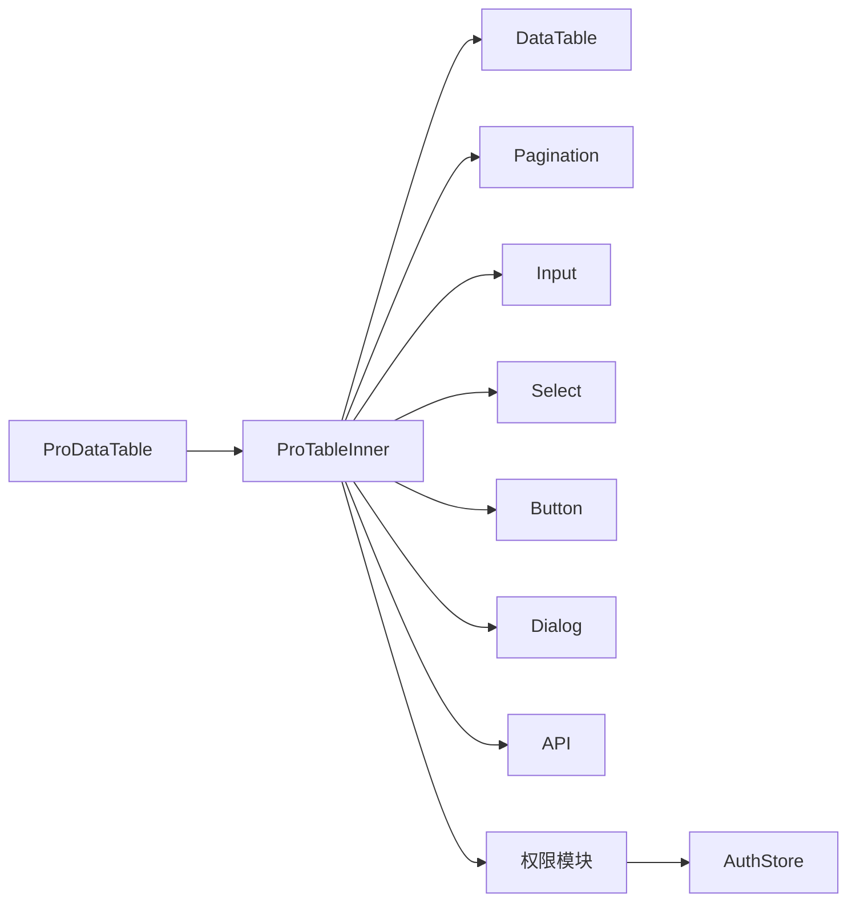

# 编辑功能

<cite>
**本文引用的文件**   
- [data-table.tsx](file://web/src/components/data-table/data-table.tsx)
- [pro-data-table.tsx](file://web/src/components/data-table/pro-data-table.tsx)
- [pro-table-inner.tsx](file://web/src/components/data-table/pro-table-inner.tsx)
- [pagination.tsx](file://web/src/components/data-table/pagination.tsx)
- [input.tsx](file://web/src/components/ui/input.tsx)
- [select.tsx](file://web/src/components/ui/select.tsx)
- [button.tsx](file://web/src/components/ui/button.tsx)
- [dialog.tsx](file://web/src/components/ui/dialog.tsx)
- [label.tsx](file://web/src/components/ui/label.tsx)
- [api.ts](file://web/src/lib/api.ts)
- [constants.ts](file://web/src/lib/constants.ts)
- [utils.ts](file://web/src/lib/utils.ts)
- [index.ts](file://web/src/types/index.ts)
- [require-permission.tsx](file://web/src/components/layout/require-permission.tsx)
- [usePermission.ts](file://web/src/hooks/usePermission.ts)
- [authStore.ts](file://web/src/stores/authStore.ts)
</cite>

## 目录
1. [简介](#简介)
2. [项目结构](#项目结构)
3. [核心组件](#核心组件)
4. [架构总览](#架构总览)
5. [详细组件分析](#详细组件分析)
6. [依赖关系分析](#依赖关系分析)
7. [性能考虑](#性能考虑)
8. [故障排查指南](#故障排查指南)
9. [结论](#结论)
10. [附录](#附录)

## 简介
本技术文档围绕 pj3 项目的表格编辑能力，系统性阐述行内编辑与批量编辑的实现机制、编辑器组件集成方式、权限控制与数据一致性保障、冲突解决策略以及错误处理与用户反馈。文档面向开发者与产品实施人员，既提供高层架构说明，也给出代码级实现要点与可视化图示，帮助快速理解并扩展表格编辑能力。

## 项目结构
与表格编辑相关的核心代码主要位于 web/src/components/data-table 与 web/src/components/ui 两个目录：
- data-table 层：提供基础表格、专业版表格及其内部实现，承载行内编辑、多选、分页等交互。
- ui 层：提供输入框、选择器、按钮、对话框、标签等通用表单控件，作为编辑器的输入载体。
- lib 层：封装 API 调用、常量定义与工具函数，为编辑操作提供网络与数据处理支撑。
- types 层：统一类型定义，确保编辑状态与数据模型的一致性。
- layout 与 hooks：提供权限校验与权限状态管理，用于编辑权限控制。
- stores：集中式认证与权限状态存储，驱动界面渲染与操作可用性。

图表来源
- [pro-data-table.tsx](file://web/src/components/data-table/pro-data-table.tsx)
- [pro-table-inner.tsx](file://web/src/components/data-table/pro-table-inner.tsx)
- [data-table.tsx](file://web/src/components/data-table/data-table.tsx)
- [pagination.tsx](file://web/src/components/data-table/pagination.tsx)
- [input.tsx](file://web/src/components/ui/input.tsx)
- [select.tsx](file://web/src/components/ui/select.tsx)
- [button.tsx](file://web/src/components/ui/button.tsx)
- [dialog.tsx](file://web/src/components/ui/dialog.tsx)
- [label.tsx](file://web/src/components/ui/label.tsx)
- [api.ts](file://web/src/lib/api.ts)
- [constants.ts](file://web/src/lib/constants.ts)
- [utils.ts](file://web/src/lib/utils.ts)
- [index.ts](file://web/src/types/index.ts)
- [require-permission.tsx](file://web/src/components/layout/require-permission.tsx)
- [usePermission.ts](file://web/src/hooks/usePermission.ts)
- [authStore.ts](file://web/src/stores/authStore.ts)

章节来源
- [pro-data-table.tsx](file://web/src/components/data-table/pro-data-table.tsx)
- [pro-table-inner.tsx](file://web/src/components/data-table/pro-table-inner.tsx)
- [data-table.tsx](file://web/src/components/data-table/data-table.tsx)
- [pagination.tsx](file://web/src/components/data-table/pagination.tsx)
- [input.tsx](file://web/src/components/ui/input.tsx)
- [select.tsx](file://web/src/components/ui/select.tsx)
- [button.tsx](file://web/src/components/ui/button.tsx)
- [dialog.tsx](file://web/src/components/ui/dialog.tsx)
- [label.tsx](file://web/src/components/ui/label.tsx)
- [api.ts](file://web/src/lib/api.ts)
- [constants.ts](file://web/src/lib/constants.ts)
- [utils.ts](file://web/src/lib/utils.ts)
- [index.ts](file://web/src/types/index.ts)
- [require-permission.tsx](file://web/src/components/layout/require-permission.tsx)
- [usePermission.ts](file://web/src/hooks/usePermission.ts)
- [authStore.ts](file://web/src/stores/authStore.ts)

## 核心组件
- ProDataTable：对外暴露的专业表格组件，聚合行内编辑、多选、批量更新、撤销重做、权限控制等能力。
- ProTableInner：内部实现，负责编辑状态机、数据验证、撤销重做栈、批量事务、冲突检测与回滚。
- DataTable：基础表格展示与交互容器，被 ProTableInner 复用。
- Pagination：分页组件，支持按页加载与批量操作的跨页范围控制。
- UI 控件：Input、Select、Button、Dialog、Label 等，作为编辑器输入载体与操作入口。
- API 封装：统一请求封装，提供批量更新接口、事务提交与错误码解析。
- 权限模块：RequirePermission、usePermission、AuthStore 共同完成编辑权限判定与状态同步。

章节来源
- [pro-data-table.tsx](file://web/src/components/data-table/pro-data-table.tsx)
- [pro-table-inner.tsx](file://web/src/components/data-table/pro-table-inner.tsx)
- [data-table.tsx](file://web/src/components/data-table/data-table.tsx)
- [pagination.tsx](file://web/src/components/data-table/pagination.tsx)
- [input.tsx](file://web/src/components/ui/input.tsx)
- [select.tsx](file://web/src/components/ui/select.tsx)
- [button.tsx](file://web/src/components/ui/button.tsx)
- [dialog.tsx](file://web/src/components/ui/dialog.tsx)
- [label.tsx](file://web/src/components/ui/label.tsx)
- [api.ts](file://web/src/lib/api.ts)
- [require-permission.tsx](file://web/src/components/layout/require-permission.tsx)
- [usePermission.ts](file://web/src/hooks/usePermission.ts)
- [authStore.ts](file://web/src/stores/authStore.ts)

## 架构总览
表格编辑采用“表现层（UI）— 表格层（ProTableInner）— 业务层（API）”的分层设计。ProTableInner 维护编辑状态与撤销重做栈，对 UI 控件进行编排；通过 API 层执行单行或批量更新，并在失败时触发回滚与提示。权限模块在渲染前拦截不可编辑场景，避免非法操作。

图表来源
- [pro-table-inner.tsx](file://web/src/components/data-table/pro-table-inner.tsx)
- [input.tsx](file://web/src/components/ui/input.tsx)
- [select.tsx](file://web/src/components/ui/select.tsx)
- [require-permission.tsx](file://web/src/components/layout/require-permission.tsx)
- [usePermission.ts](file://web/src/hooks/usePermission.ts)
- [authStore.ts](file://web/src/stores/authStore.ts)
- [api.ts](file://web/src/lib/api.ts)

## 详细组件分析

### 行内编辑机制
- 编辑状态管理
  - 使用受控模式：单元格值由外部数据源驱动，编辑态由 ProTableInner 维护。
  - 状态字段包括：当前编辑行标识、原始值快照、当前值、验证错误、是否处于编辑态。
  - 失焦/回车/确认按钮触发提交；Esc 取消编辑并恢复原值。
- 数据验证
  - 内置规则：必填、长度、格式、枚举值、数值范围等。
  - 自定义规则：通过配置项注入校验函数，支持异步校验（如唯一性）。
  - 错误信息：即时反馈到对应单元格下方或 Tooltip 中。
- 撤销重做
  - 基于命令模式：每次提交生成一个“变更命令”，包含行 ID、旧值、新值、时间戳。
  - 撤销：从栈顶弹出命令，反向应用至本地数据，并重新渲染。
  - 重做：将已撤销的命令再次应用到本地数据。
  - 边界：当发生服务端失败时，自动回滚本地变更并从撤销栈移除对应命令。

图表来源
- [pro-table-inner.tsx](file://web/src/components/data-table/pro-table-inner.tsx)
- [input.tsx](file://web/src/components/ui/input.tsx)
- [select.tsx](file://web/src/components/ui/select.tsx)
- [api.ts](file://web/src/lib/api.ts)

章节来源
- [pro-table-inner.tsx](file://web/src/components/data-table/pro-table-inner.tsx)
- [input.tsx](file://web/src/components/ui/input.tsx)
- [select.tsx](file://web/src/components/ui/select.tsx)
- [api.ts](file://web/src/lib/api.ts)

### 批量编辑方案
- 多选操作
  - 表头复选框支持全选/反选；每行复选框支持单选。
  - 多选集合由 ProTableInner 维护，支持跨页多选（结合分页参数）。
- 批量更新
  - 构建批量变更集：仅包含选中行的差异字段。
  - 事务处理：调用批量更新接口，若任一记录失败，整体回滚并提示具体失败项。
  - 并发控制：串行提交或分片并行（可配置），避免服务端过载。
- 撤销重做
  - 批量命令同样压入撤销栈，撤销时逐条反向应用。
  - 重做时按顺序正向应用，保证幂等性与一致性。

图表来源
- [pro-table-inner.tsx](file://web/src/components/data-table/pro-table-inner.tsx)
- [pagination.tsx](file://web/src/components/data-table/pagination.tsx)
- [api.ts](file://web/src/lib/api.ts)

章节来源
- [pro-table-inner.tsx](file://web/src/components/data-table/pro-table-inner.tsx)
- [pagination.tsx](file://web/src/components/data-table/pagination.tsx)
- [api.ts](file://web/src/lib/api.ts)

### 编辑器组件集成指南
- 输入框（Input）
  - 受控模式：value 与 onChange 由表格层传入，确保双向绑定。
  - 事件：onChange、onBlur、onKeyDown（Enter 提交、Esc 取消）。
  - 校验：实时校验与提交校验双轨制。
- 选择器（Select）
  - 选项来源：静态枚举或动态接口加载。
  - 行为：单选/多选、搜索过滤、禁用态。
- 日期选择器
  - 建议以 Select 或 Dialog 包裹的日历组件形式集成，遵循受控模式。
  - 格式化：本地化与区域设置。
- 其他控件
  - Button：用于确认/取消/批量操作入口。
  - Dialog：用于复杂编辑场景（如批量模板导入）。
  - Label：增强可读性与无障碍访问。

图表来源
- [pro-table-inner.tsx](file://web/src/components/data-table/pro-table-inner.tsx)
- [input.tsx](file://web/src/components/ui/input.tsx)
- [select.tsx](file://web/src/components/ui/select.tsx)
- [button.tsx](file://web/src/components/ui/button.tsx)
- [dialog.tsx](file://web/src/components/ui/dialog.tsx)

章节来源
- [pro-table-inner.tsx](file://web/src/components/data-table/pro-table-inner.tsx)
- [input.tsx](file://web/src/components/ui/input.tsx)
- [select.tsx](file://web/src/components/ui/select.tsx)
- [button.tsx](file://web/src/components/ui/button.tsx)
- [dialog.tsx](file://web/src/components/ui/dialog.tsx)

### 权限控制与数据一致性
- 权限控制
  - RequirePermission 在页面或操作级别拦截，依据 AuthStore 中的用户角色与资源权限决定可编辑性。
  - usePermission 提供细粒度权限判断，供表格列或操作按钮启用/禁用。
- 数据一致性
  - 乐观更新：提交成功后立即刷新视图；失败则回滚并提示。
  - 冲突检测：服务端返回版本号或时间戳，前端比较后提示冲突并引导合并。
  - 事务语义：批量更新要么全成功，要么全失败；部分失败需明确失败项与重试策略。

图表来源
- [require-permission.tsx](file://web/src/components/layout/require-permission.tsx)
- [usePermission.ts](file://web/src/hooks/usePermission.ts)
- [authStore.ts](file://web/src/stores/authStore.ts)
- [pro-table-inner.tsx](file://web/src/components/data-table/pro-table-inner.tsx)

章节来源
- [require-permission.tsx](file://web/src/components/layout/require-permission.tsx)
- [usePermission.ts](file://web/src/hooks/usePermission.ts)
- [authStore.ts](file://web/src/stores/authStore.ts)
- [pro-table-inner.tsx](file://web/src/components/data-table/pro-table-inner.tsx)

### 错误处理与用户反馈
- 客户端校验错误：即时显示错误消息，阻止提交。
- 服务端错误：根据错误码分类提示（网络异常、权限不足、数据冲突、业务校验失败）。
- 批量操作反馈：汇总成功/失败数量，列出失败明细并提供重试入口。
- 撤销重做反馈：操作后提供 Toast 提示，支持快捷键撤销/重做。

章节来源
- [pro-table-inner.tsx](file://web/src/components/data-table/pro-table-inner.tsx)
- [api.ts](file://web/src/lib/api.ts)
- [constants.ts](file://web/src/lib/constants.ts)
- [utils.ts](file://web/src/lib/utils.ts)

## 依赖关系分析
- 组件耦合
  - ProTableInner 强依赖 UI 控件与 API 封装，弱依赖权限模块（通过钩子注入）。
  - UI 控件无业务逻辑，保持高内聚低耦合。
- 外部依赖
  - API 层可能依赖 HTTP 客户端与错误码映射。
  - 权限模块依赖认证状态存储。
- 潜在循环依赖
  - 通过解耦（钩子与配置项）避免表格层与权限层的直接循环引用。

图表来源
- [pro-data-table.tsx](file://web/src/components/data-table/pro-data-table.tsx)
- [pro-table-inner.tsx](file://web/src/components/data-table/pro-table-inner.tsx)
- [data-table.tsx](file://web/src/components/data-table/data-table.tsx)
- [pagination.tsx](file://web/src/components/data-table/pagination.tsx)
- [input.tsx](file://web/src/components/ui/input.tsx)
- [select.tsx](file://web/src/components/ui/select.tsx)
- [button.tsx](file://web/src/components/ui/button.tsx)
- [dialog.tsx](file://web/src/components/ui/dialog.tsx)
- [api.ts](file://web/src/lib/api.ts)
- [require-permission.tsx](file://web/src/components/layout/require-permission.tsx)
- [usePermission.ts](file://web/src/hooks/usePermission.ts)
- [authStore.ts](file://web/src/stores/authStore.ts)

章节来源
- [pro-data-table.tsx](file://web/src/components/data-table/pro-data-table.tsx)
- [pro-table-inner.tsx](file://web/src/components/data-table/pro-table-inner.tsx)
- [data-table.tsx](file://web/src/components/data-table/data-table.tsx)
- [pagination.tsx](file://web/src/components/data-table/pagination.tsx)
- [input.tsx](file://web/src/components/ui/input.tsx)
- [select.tsx](file://web/src/components/ui/select.tsx)
- [button.tsx](file://web/src/components/ui/button.tsx)
- [dialog.tsx](file://web/src/components/ui/dialog.tsx)
- [api.ts](file://web/src/lib/api.ts)
- [require-permission.tsx](file://web/src/components/layout/require-permission.tsx)
- [usePermission.ts](file://web/src/hooks/usePermission.ts)
- [authStore.ts](file://web/src/stores/authStore.ts)

## 性能考虑
- 虚拟滚动：大数据量表格建议使用虚拟化列表减少 DOM 节点。
- 增量更新：仅更新变更行与单元格，避免整表重渲染。
- 批量提交分片：大批次拆分为小片段并行提交，降低超时风险。
- 防抖与节流：输入框与搜索防抖，减少频繁校验与请求。
- 缓存选项：选择器选项与服务端字典缓存，提升交互速度。

[本节为通用指导，不直接分析具体文件]

## 故障排查指南
- 无法进入编辑
  - 检查权限：确认当前用户具备编辑权限；查看 RequirePermission 与 usePermission 的判定逻辑。
  - 检查受控值：确认表格数据源中对应字段存在且可写。
- 提交失败
  - 查看错误码：对照 constants 中的错误码定义，定位具体原因。
  - 检查网络与后端：确认 API 响应结构与业务状态。
- 撤销重做无效
  - 检查命令栈：确认命令是否正确压入与弹出。
  - 检查幂等性：确保反向应用不会引入副作用。
- 批量更新部分失败
  - 查看失败明细：确认失败项与原因，提供重试入口。
  - 检查事务语义：确保回滚逻辑正确执行。

章节来源
- [require-permission.tsx](file://web/src/components/layout/require-permission.tsx)
- [usePermission.ts](file://web/src/hooks/usePermission.ts)
- [constants.ts](file://web/src/lib/constants.ts)
- [api.ts](file://web/src/lib/api.ts)
- [pro-table-inner.tsx](file://web/src/components/data-table/pro-table-inner.tsx)

## 结论
pj3 的表格编辑能力通过分层架构与受控模式实现了稳健的行内编辑与批量编辑。ProTableInner 作为核心编排者，统一管理编辑状态、验证、撤销重做与事务提交；UI 控件保持简洁与可复用；权限与状态管理确保安全性与一致性。建议在大数据量场景下引入虚拟化与分片提交，进一步提升性能与用户体验。

[本节为总结，不直接分析具体文件]

## 附录
- 类型定义参考：index.ts 中定义了表格数据、编辑状态、命令对象等关键类型，确保前后端一致。
- 工具函数参考：utils.ts 提供深拷贝、差异计算、格式化等常用方法，便于扩展编辑逻辑。

章节来源
- [index.ts](file://web/src/types/index.ts)
- [utils.ts](file://web/src/lib/utils.ts)