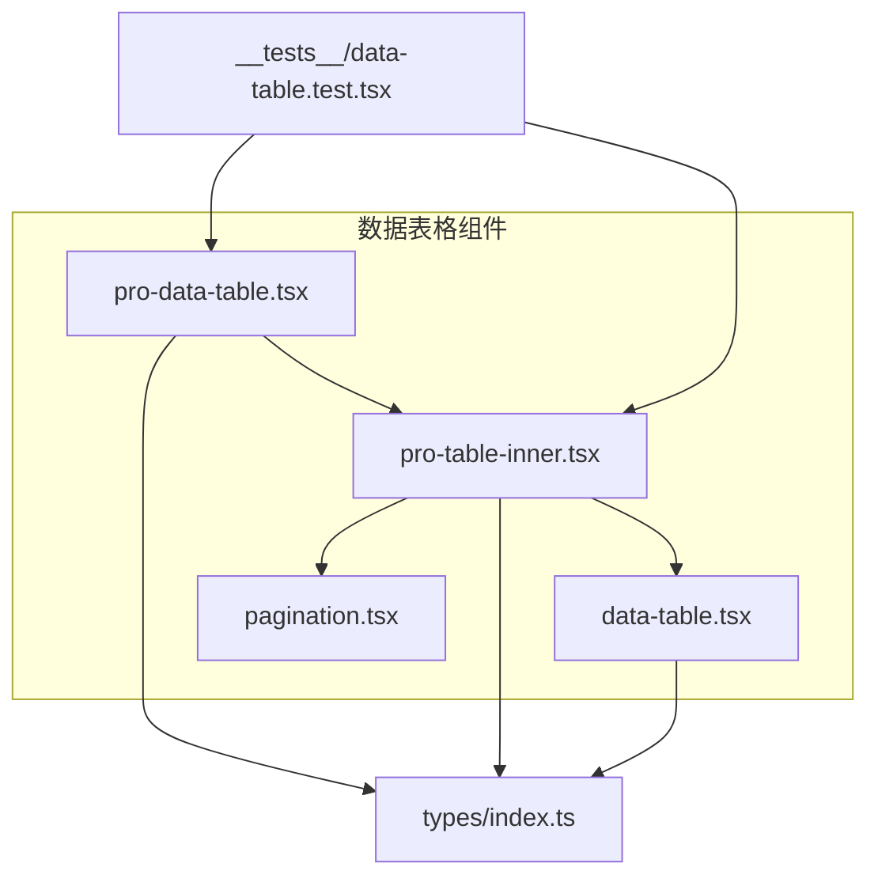
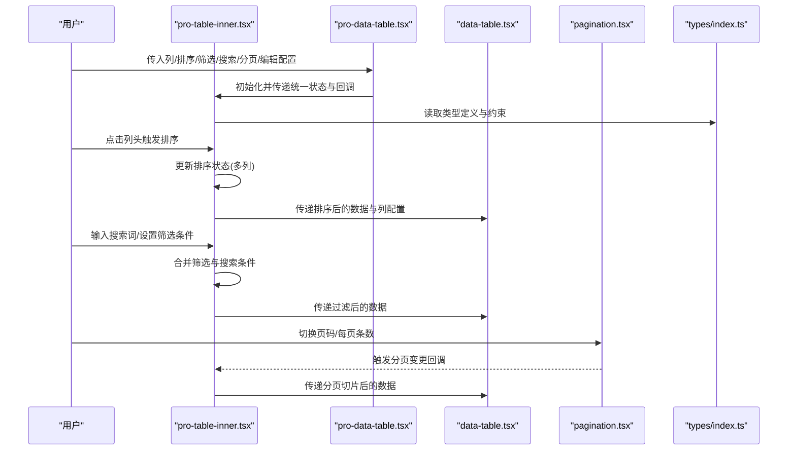
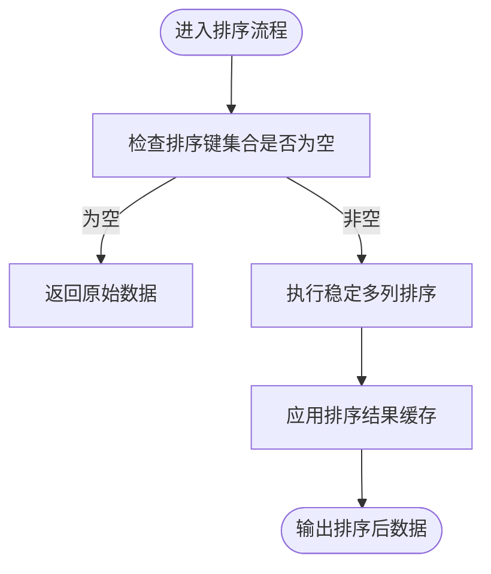
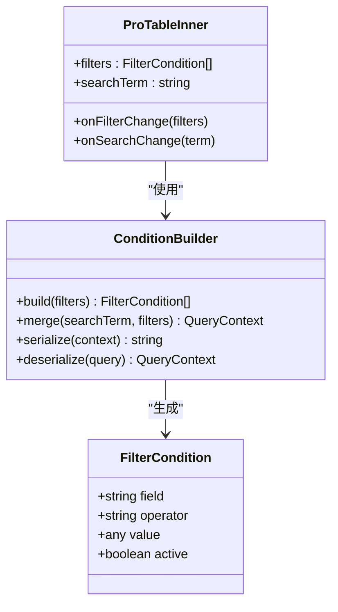
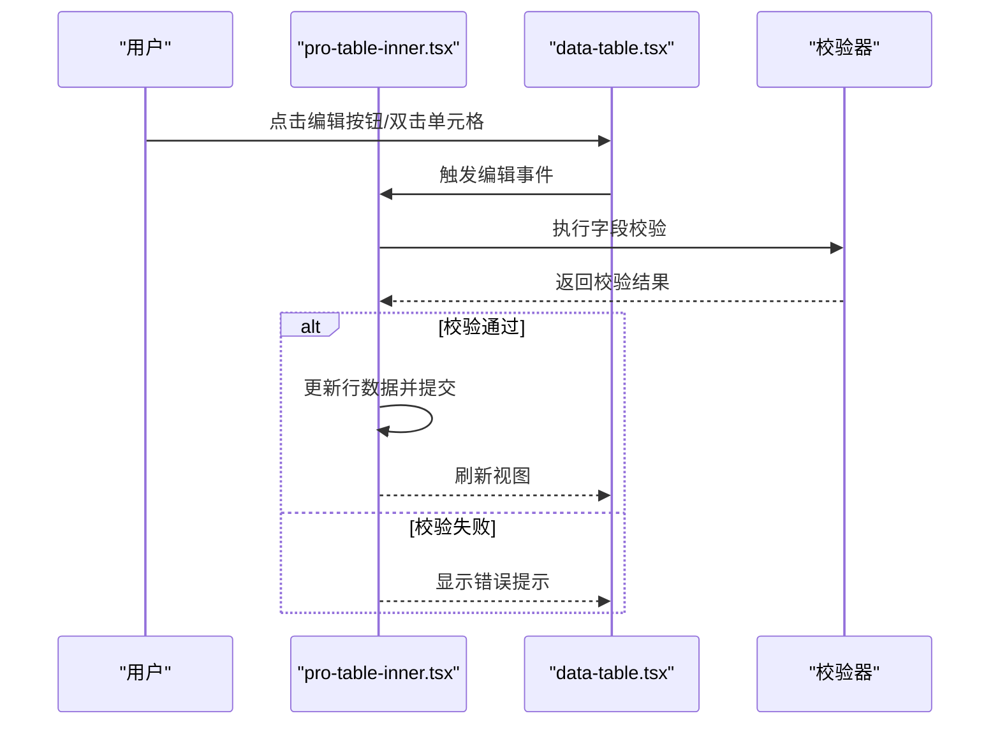
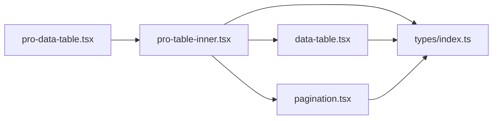

# 高级表格功能

<cite>
**本文引用的文件**   
- [pro-table-inner.tsx](file://web/src/components/data-table/pro-table-inner.tsx)
- [pro-data-table.tsx](file://web/src/components/data-table/pro-data-table.tsx)
- [data-table.tsx](file://web/src/components/data-table/data-table.tsx)
- [pagination.tsx](file://web/src/components/data-table/pagination.tsx)
- [data-table.test.tsx](file://web/src/components/data-table/__tests__/data-table.test.tsx)
- [index.ts](file://web/src/types/index.ts)
</cite>

## 目录
1. [简介](#简介)
2. [项目结构](#项目结构)
3. [核心组件](#核心组件)
4. [架构总览](#架构总览)
5. [详细组件分析](#详细组件分析)
6. [依赖关系分析](#依赖关系分析)
7. [性能考虑](#性能考虑)
8. [故障排查指南](#故障排查指南)
9. [结论](#结论)
10. [附录：API参考与使用示例](#附录api参考与使用示例)

## 简介
本技术文档聚焦于 pj3 项目中“高级表格”能力，围绕内部核心组件 pro-table-inner.tsx 的架构设计展开，系统阐述排序、筛选、搜索等高级特性的实现机制；深入解析多列排序的状态管理、算法与优化策略；介绍条件筛选系统的架构（筛选器类型、条件构建、查询参数序列化）；说明表格编辑能力（行内编辑、批量操作、数据验证）；并提供完整的 API 参考、使用示例以及测试策略与质量保证方案。

## 项目结构
高级表格相关代码位于 web/src/components/data-table 目录下，采用分层组织方式：
- 基础展示层：data-table.tsx 负责最基础的表格渲染与列定义
- 增强封装层：pro-data-table.tsx 提供面向业务的高阶配置与默认行为
- 核心逻辑层：pro-table-inner.tsx 承载排序、筛选、搜索、分页、编辑等高级特性
- 分页控件：pagination.tsx 提供页码、每页条数等交互
- 类型定义：types/index.ts 提供统一的数据模型与接口契约
- 测试用例：__tests__/data-table.test.tsx 覆盖关键交互路径

图表来源
- [pro-data-table.tsx](file://web/src/components/data-table/pro-data-table.tsx)
- [pro-table-inner.tsx](file://web/src/components/data-table/pro-table-inner.tsx)
- [data-table.tsx](file://web/src/components/data-table/data-table.tsx)
- [pagination.tsx](file://web/src/components/data-table/pagination.tsx)
- [index.ts](file://web/src/types/index.ts)
- [data-table.test.tsx](file://web/src/components/data-table/__tests__/data-table.test.tsx)

章节来源
- [pro-data-table.tsx](file://web/src/components/data-table/pro-data-table.tsx)
- [pro-table-inner.tsx](file://web/src/components/data-table/pro-table-inner.tsx)
- [data-table.tsx](file://web/src/components/data-table/data-table.tsx)
- [pagination.tsx](file://web/src/components/data-table/pagination.tsx)
- [index.ts](file://web/src/types/index.ts)
- [data-table.test.tsx](file://web/src/components/data-table/__tests__/data-table.test.tsx)

## 核心组件
- pro-table-inner.tsx：高级表格的核心实现，集中处理排序、筛选、搜索、分页、编辑等状态与交互逻辑，向上暴露稳定的 props 与回调，向下驱动 data-table 渲染与 pagination 控制。
- pro-data-table.tsx：对 pro-table-inner.tsx 进行二次封装，提供默认配置、便捷 API 与业务常用组合。
- data-table.tsx：基础表格渲染，关注列定义、单元格渲染、选择与行操作等展示逻辑。
- pagination.tsx：分页控件，支持页码切换、每页条数调整、跳转等。
- types/index.ts：统一类型定义，包括列定义、排序状态、筛选条件、分页参数、编辑状态等。

章节来源
- [pro-table-inner.tsx](file://web/src/components/data-table/pro-table-inner.tsx)
- [pro-data-table.tsx](file://web/src/components/data-table/pro-data-table.tsx)
- [data-table.tsx](file://web/src/components/data-table/data-table.tsx)
- [pagination.tsx](file://web/src/components/data-table/pagination.tsx)
- [index.ts](file://web/src/types/index.ts)

## 架构总览
高级表格采用“配置驱动 + 状态提升”的架构模式：上层通过 props 声明式配置列、排序、筛选、搜索、分页与编辑行为；内部维护统一的查询状态（排序、筛选、搜索、分页），在状态变化时触发数据刷新或本地计算；最终将渲染所需的最小数据集传递给基础表格组件。

图表来源
- [pro-table-inner.tsx](file://web/src/components/data-table/pro-table-inner.tsx)
- [pro-data-table.tsx](file://web/src/components/data-table/pro-data-table.tsx)
- [data-table.tsx](file://web/src/components/data-table/data-table.tsx)
- [pagination.tsx](file://web/src/components/data-table/pagination.tsx)
- [index.ts](file://web/src/types/index.ts)

## 详细组件分析

### 核心组件：pro-table-inner.tsx
该组件是高级表格能力的中枢，承担以下职责：
- 排序：支持单列与多列排序，维护排序键集合与方向，提供稳定且可复用的排序算法与性能优化策略。
- 筛选：提供多种筛选器类型（如等于、包含、范围、多选等），统一构建筛选条件树，并与搜索词合并。
- 搜索：基于关键词进行轻量级本地匹配，支持字段白名单与大小写不敏感策略。
- 分页：与 pagination.tsx 协作，根据当前页码与每页条数对数据进行切片。
- 编辑：支持行内编辑与批量操作，结合表单校验规则确保数据一致性。
- 状态管理：以受控与非受控两种模式对外暴露状态，保证与上层业务无缝集成。

#### 多列排序实现原理
- 排序状态管理：维护一个有序的多列排序键数组，每个键包含列标识与排序方向；当新增排序键时，若已存在则翻转方向，否则追加到末尾。
- 排序算法：采用稳定排序策略，按多列优先级依次比较，保证相同主键下的次级排序稳定性。
- 性能优化：
  - 惰性排序：仅在必要时机触发（如排序键变化、数据源更新）。
  - 局部重排：对大数据集采用分片或虚拟滚动配合排序，减少一次性计算开销。
  - 缓存排序结果：对相同输入保持引用稳定，避免不必要的重渲染。

图表来源
- [pro-table-inner.tsx](file://web/src/components/data-table/pro-table-inner.tsx)

章节来源
- [pro-table-inner.tsx](file://web/src/components/data-table/pro-table-inner.tsx)

#### 条件筛选系统架构
- 筛选器类型：
  - 文本类：等于、包含、前缀、后缀
  - 数值类：大于、小于、区间
  - 枚举类：多选、单选
  - 日期类：早于、晚于、区间
- 条件构建器：
  - 将用户选择的筛选器转换为结构化条件对象
  - 支持 AND/OR 组合与嵌套层级
  - 与搜索词合并为统一查询上下文
- 查询参数序列化：
  - 将结构化条件序列化为 URL 查询字符串或后端请求体
  - 支持去重、空值剔除与类型转换
  - 提供反序列化能力，用于从 URL 恢复筛选状态

图表来源
- [pro-table-inner.tsx](file://web/src/components/data-table/pro-table-inner.tsx)
- [index.ts](file://web/src/types/index.ts)

章节来源
- [pro-table-inner.tsx](file://web/src/components/data-table/pro-table-inner.tsx)
- [index.ts](file://web/src/types/index.ts)

#### 表格编辑功能实现
- 行内编辑：
  - 通过列级别的编辑配置启用单元格或整行编辑
  - 支持即时保存与取消，保留撤销/重做历史
  - 与表单校验规则联动，阻止非法提交
- 批量操作：
  - 支持多选行后进行批量删除、批量更新等操作
  - 提供确认对话框与进度反馈
- 数据验证：
  - 前端校验：必填、格式、范围、唯一性等
  - 后端校验：提交前预检与错误回显
  - 冲突解决：乐观锁提示与重试策略

图表来源
- [pro-table-inner.tsx](file://web/src/components/data-table/pro-table-inner.tsx)
- [data-table.tsx](file://web/src/components/data-table/data-table.tsx)

章节来源
- [pro-table-inner.tsx](file://web/src/components/data-table/pro-table-inner.tsx)
- [data-table.tsx](file://web/src/components/data-table/data-table.tsx)

### 高阶封装：pro-data-table.tsx
- 提供默认列模板、默认排序与筛选预设
- 简化常见场景的配置项，降低接入成本
- 统一错误边界与加载态处理

章节来源
- [pro-data-table.tsx](file://web/src/components/data-table/pro-data-table.tsx)

### 基础渲染：data-table.tsx
- 负责列定义、单元格渲染、选择框、操作列等展示逻辑
- 接收来自上层的状态与回调，最小化自身状态复杂度

章节来源
- [data-table.tsx](file://web/src/components/data-table/data-table.tsx)

### 分页控件：pagination.tsx
- 提供页码、每页条数、跳转等交互
- 与 pro-table-inner.tsx 的双向绑定，确保分页状态一致

章节来源
- [pagination.tsx](file://web/src/components/data-table/pagination.tsx)

## 依赖关系分析
- 组件耦合：
  - pro-data-table.tsx 强依赖 pro-table-inner.tsx
  - pro-table-inner.tsx 依赖 data-table.tsx 与 pagination.tsx
  - 所有组件共享 types/index.ts 的类型契约
- 外部依赖：
  - React 生态（hooks、状态管理）
  - UI 库（按钮、输入、下拉等基础控件）
  - 可选：虚拟列表、导出工具等扩展能力

图表来源
- [pro-data-table.tsx](file://web/src/components/data-table/pro-data-table.tsx)
- [pro-table-inner.tsx](file://web/src/components/data-table/pro-table-inner.tsx)
- [data-table.tsx](file://web/src/components/data-table/data-table.tsx)
- [pagination.tsx](file://web/src/components/data-table/pagination.tsx)
- [index.ts](file://web/src/types/index.ts)

章节来源
- [pro-data-table.tsx](file://web/src/components/data-table/pro-data-table.tsx)
- [pro-table-inner.tsx](file://web/src/components/data-table/pro-table-inner.tsx)
- [data-table.tsx](file://web/src/components/data-table/data-table.tsx)
- [pagination.tsx](file://web/src/components/data-table/pagination.tsx)
- [index.ts](file://web/src/types/index.ts)

## 性能考虑
- 排序与筛选：
  - 使用稳定排序与惰性计算，避免频繁重排
  - 对大数据集采用分片或虚拟滚动
  - 缓存中间结果，减少重复计算
- 渲染优化：
  - 列与单元格级别的可插拔渲染函数，按需加载
  - 使用 memo 与 shouldComponentUpdate 思想减少重渲染
- 网络与状态：
  - 服务端分页与过滤优先，本地仅做轻量处理
  - 防抖与节流搜索输入，降低请求频率
- 内存管理：
  - 及时释放监听与定时器
  - 大对象深拷贝谨慎使用，必要时采用不可变数据结构

[本节为通用性能建议，无需特定文件来源]

## 故障排查指南
- 常见问题定位：
  - 排序异常：检查排序键集合是否被意外清空，确认多列优先级顺序
  - 筛选失效：核对筛选器类型与字段映射，确认条件构建器是否正确序列化
  - 搜索无结果：确认搜索词大小写策略与字段白名单配置
  - 编辑失败：查看前端校验错误信息，检查后端返回的错误码与字段提示
- 调试技巧：
  - 打印查询上下文（排序、筛选、搜索、分页）
  - 断点跟踪条件构建与序列化过程
  - 使用浏览器开发者工具观察网络请求与响应
- 日志与监控：
  - 记录关键操作的耗时与错误堆栈
  - 上报用户操作路径以便复现问题

章节来源
- [data-table.test.tsx](file://web/src/components/data-table/__tests__/data-table.test.tsx)

## 结论
pro-table-inner.tsx 作为高级表格的核心，通过清晰的状态管理与模块化设计，实现了排序、筛选、搜索、分页与编辑等高级特性。其多列排序的稳定算法、条件筛选的结构化构建与序列化、以及编辑功能的校验与批处理能力，共同构成了高性能、可扩展的表格解决方案。配合 pro-data-table.tsx 的封装与 data-table.tsx 的基础渲染，整体架构具备良好的可维护性与可测试性。

[本节为总结性内容，无需特定文件来源]

## 附录：API参考与使用示例

### 核心 Props 与回调（pro-table-inner.tsx）
- 数据与列
  - dataSource：数据源数组
  - columns：列定义数组（含标题、字段、渲染函数、编辑配置等）
- 排序
  - sortState：多列排序状态（列标识与方向）
  - onSortChange：排序变更回调
- 筛选与搜索
  - filters：筛选条件数组
  - searchTerm：搜索关键词
  - onFilterChange：筛选变更回调
  - onSearchChange：搜索变更回调
- 分页
  - pagination：分页配置（当前页、每页条数、总数）
  - onPaginationChange：分页变更回调
- 编辑
  - editable：是否启用编辑
  - onEditChange：编辑变更回调
  - validators：字段校验规则
- 其他
  - loading：加载态
  - error：错误信息
  - renderFooter：底部自定义渲染

章节来源
- [pro-table-inner.tsx](file://web/src/components/data-table/pro-table-inner.tsx)
- [index.ts](file://web/src/types/index.ts)

### 使用示例（概念性步骤）
- 引入组件与类型定义
- 配置列定义（标题、字段、渲染、编辑、校验）
- 初始化排序、筛选、搜索、分页状态
- 绑定变更回调，触发数据刷新或本地计算
- 处理加载与错误状态，提供用户反馈

章节来源
- [pro-data-table.tsx](file://web/src/components/data-table/pro-data-table.tsx)
- [pro-table-inner.tsx](file://web/src/components/data-table/pro-table-inner.tsx)
- [data-table.tsx](file://web/src/components/data-table/data-table.tsx)
- [pagination.tsx](file://web/src/components/data-table/pagination.tsx)
- [index.ts](file://web/src/types/index.ts)

### 测试策略与质量保证
- 单元测试
  - 排序：验证多列排序稳定性与方向切换
  - 筛选：验证条件构建与序列化/反序列化
  - 搜索：验证关键词匹配与字段白名单
  - 分页：验证页码与每页条数变更
  - 编辑：验证校验规则与提交流程
- 集成测试
  - 端到端流程：从配置到渲染再到交互的完整链路
  - 错误边界：异常输入与网络错误的容错处理
- 性能测试
  - 大数据集排序与筛选的性能基准
  - 渲染性能与内存占用评估
- 质量门禁
  - 覆盖率阈值
  - 静态检查与类型安全
  - 回归测试自动化

章节来源
- [data-table.test.tsx](file://web/src/components/data-table/__tests__/data-table.test.tsx)