# 本地开发环境启动指南

<cite>
**本文引用的文件**   
- [package.json](file://package.json)
- [server/package.json](file://server/package.json)
- [web/package.json](file://web/package.json)
- [server/src/server.ts](file://server/src/server.ts)
- [server/src/app.ts](file://server/src/app.ts)
- [server/src/config/env.ts](file://server/src/config/env.ts)
- [server/prisma/schema.prisma](file://server/prisma/schema.prisma)
- [server/scripts/local-db.ts](file://server/scripts/local-db.ts)
- [web/vite.config.ts](file://web/vite.config.ts)
- [web/src/lib/api.ts](file://web/src/lib/api.ts)
- [docs/本地开发环境启动指南.md](file://docs/本地开发环境启动指南.md)
- [server/prisma/migrations/20260803000000_add_must_change_password/migration.sql](file://server/prisma/migrations/20260803000000_add_must_change_password/migration.sql)
- [server/prisma/seed.ts](file://server/prisma/seed.ts)
- [server/src/lib/password.ts](file://server/src/lib/password.ts)
- [server/src/middleware/auth.ts](file://server/src/middleware/auth.ts)
- [server/src/services/AuthService.ts](file://server/src/services/AuthService.ts)
- [server/src/routes/auth.ts](file://server/src/routes/auth.ts)
</cite>

## 更新摘要
**变更内容**   
- 新增首次登录强制改密功能，包含数据库迁移和认证流程增强
- 更新种子用户默认密码策略，每个演示用户拥有独立初始口令
- 完善密码哈希安全机制，确保 bcrypt cost 配置正确
- 增强认证中间件对强制改密用户的访问控制

## 目录
1. [简介](#简介)
2. [项目结构](#项目结构)
3. [核心组件](#核心组件)
4. [架构总览](#架构总览)
5. [详细组件分析](#详细组件分析)
6. [依赖关系分析](#依赖关系分析)
7. [性能注意事项](#性能注意事项)
8. [故障排查指南](#故障排查指南)
9. [结论](#结论)
10. [附录](#附录)

## 简介
本指南面向首次参与"浙江壹品慧财年经营数据分析平台"的开发者，目标是帮助你在本地快速搭建并运行前后端服务、数据库与必要工具链，完成从环境准备到首次访问的完整流程。项目定位为"Excel进、看板/报表出"的内部管理口径财务数据平台，单位统一为万元/人民币。后端采用 Express + Prisma + PostgreSQL + JWT + DeepSeek API（SSE 流式），前端基于 Vite + React。

**最新更新**：系统现已支持首次登录强制改密功能，所有新创建或重置密码的用户必须在首次登录后修改密码才能继续使用业务功能。

## 项目结构
仓库采用多包结构：
- server：Express 后端服务、Prisma 数据层、脚本与迁移
- web：Vite 前端应用、页面与组件
- docs：文档与规范
- 根级 package.json：提供统一的脚本入口（如安装依赖、构建等）

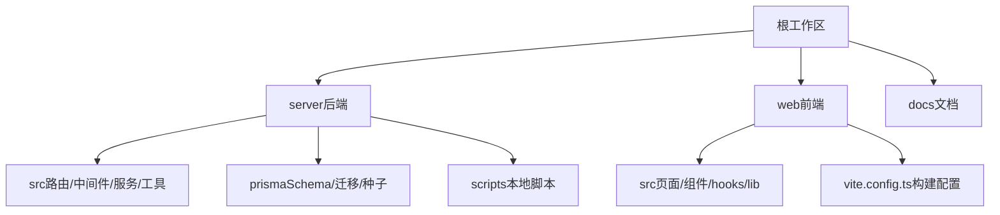

**图表来源**
- [package.json](file://package.json)
- [server/package.json](file://server/package.json)
- [web/package.json](file://web/package.json)

**章节来源**
- [package.json](file://package.json)
- [server/package.json](file://server/package.json)
- [web/package.json](file://web/package.json)

## 核心组件
- 后端服务入口与装配：Express 应用初始化、中间件链、路由挂载
- 数据库与迁移：Prisma Schema、PostgreSQL 本地实例、迁移与种子数据
- 认证与权限：JWT 双令牌（access/refresh）、黑名单校验、默认拒绝的权限模型、**首次登录强制改密**
- 安全与限流：Helmet、CORS、速率限制、审计日志、软删除
- AI 能力：DeepSeek SSE 流式接口，双管道（polish/analyze）与脱敏还原
- 指标计算：安全公式解析器（白名单算子）、同比/环比实时计算

**章节来源**
- [server/src/app.ts](file://server/src/app.ts)
- [server/src/middleware/cors.ts](file://server/src/middleware/cors.ts)
- [server/src/middleware/helmet.ts](file://server/src/middleware/helmet.ts)
- [server/src/middleware/rate-limit.ts](file://server/src/middleware/rate-limit.ts)
- [server/src/middleware/auth.ts](file://server/src/middleware/auth.ts)
- [server/src/middleware/permission.ts](file://server/src/middleware/permission.ts)
- [server/src/middleware/scope.ts](file://server/src/middleware/scope.ts)
- [server/src/middleware/soft-delete.test.ts](file://server/src/middleware/soft-delete.test.ts)
- [server/src/middleware/audit.ts](file://server/src/middleware/audit.ts)
- [server/src/lib/formula.ts](file://server/src/lib/formula.ts)
- [server/src/services/AIProxyService.ts](file://server/src/services/AIProxyService.ts)

## 架构总览
下图展示了请求进入后端后的中间件执行链与关键处理阶段，体现了"默认拒绝"的权限策略与安全加固，以及新增的首次登录强制改密检查。

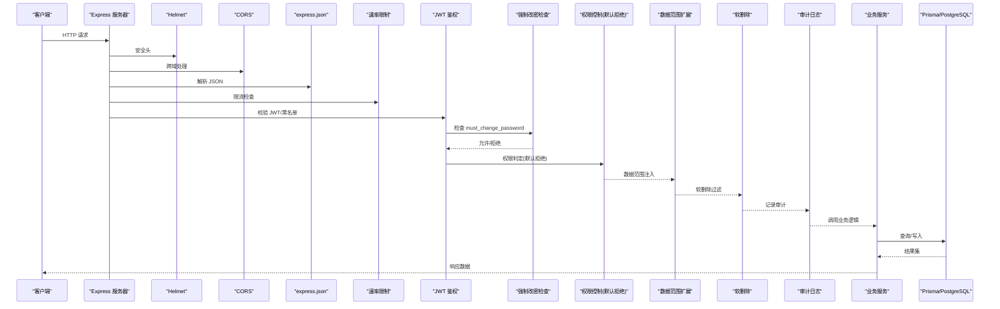

**图表来源**
- [server/src/app.ts](file://server/src/app.ts)
- [server/src/middleware/cors.ts](file://server/src/middleware/cors.ts)
- [server/src/middleware/helmet.ts](file://server/src/middleware/helmet.ts)
- [server/src/middleware/rate-limit.ts](file://server/src/middleware/rate-limit.ts)
- [server/src/middleware/auth.ts](file://server/src/middleware/auth.ts)
- [server/src/middleware/permission.ts](file://server/src/middleware/permission.ts)
- [server/src/middleware/scope.ts](file://server/src/middleware/scope.ts)
- [server/src/middleware/soft-delete.test.ts](file://server/src/middleware/soft-delete.test.ts)
- [server/src/middleware/audit.ts](file://server/src/middleware/audit.ts)

## 详细组件分析

### 后端服务启动与配置
- 应用入口负责加载环境变量、注册中间件、挂载路由、启动监听端口
- 环境变量通过集中配置模块读取，建议以 .env 或系统环境变量注入
- 数据库连接由 Prisma 管理，确保迁移已执行且连接可用

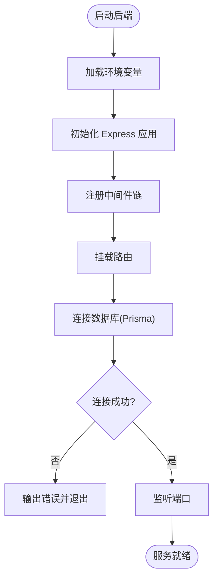

**图表来源**
- [server/src/server.ts](file://server/src/server.ts)
- [server/src/app.ts](file://server/src/app.ts)
- [server/src/config/env.ts](file://server/src/config/env.ts)

**章节来源**
- [server/src/server.ts](file://server/src/server.ts)
- [server/src/app.ts](file://server/src/app.ts)
- [server/src/config/env.ts](file://server/src/config/env.ts)

### 数据库与迁移
- 使用 Prisma 管理 Schema 与迁移，本地可通过内置脚本启动 PostgreSQL
- 首次运行需执行迁移与种子数据，确保表结构与基础数据存在
- **新增**：首次登录强制改密字段 `must_change_password` 已添加到用户表

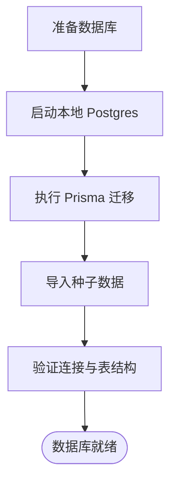

**图表来源**
- [server/scripts/local-db.ts](file://server/scripts/local-db.ts)
- [server/prisma/schema.prisma](file://server/prisma/schema.prisma)

**章节来源**
- [server/scripts/local-db.ts](file://server/scripts/local-db.ts)
- [server/prisma/schema.prisma](file://server/prisma/schema.prisma)

### 首次登录强制改密机制
**新增功能**：系统现在支持首次登录强制改密，确保用户账户安全性。

- 数据库层面：用户表新增 `must_change_password` 布尔字段，默认值为 `false`
- 认证流程：管理员创建或重置密码后将该字段设为 `true`
- 访问控制：强制改密用户仅能访问改密、登出、资料三个接口
- 自动清除：成功修改密码后自动将该标志位设为 `false`

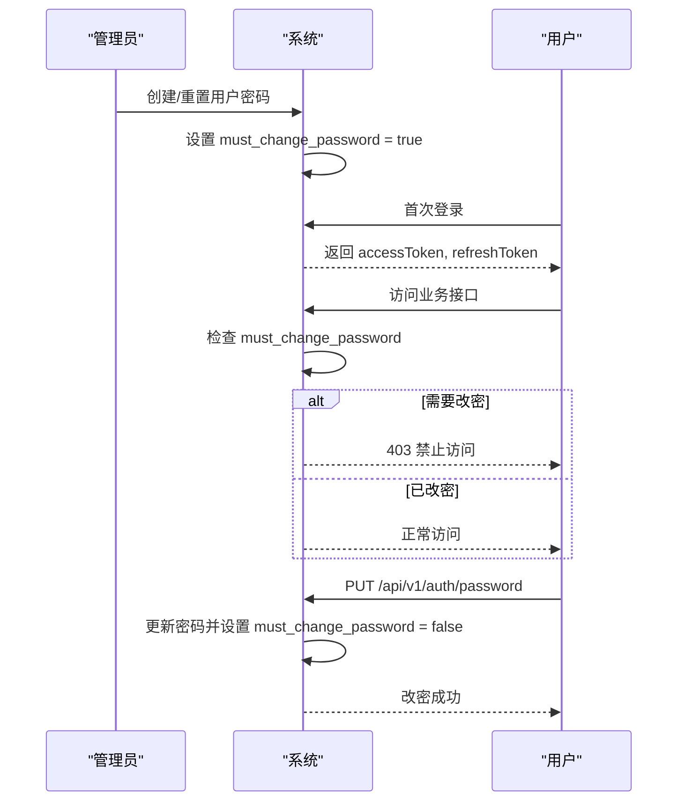

**图表来源**
- [server/prisma/migrations/20260803000000_add_must_change_password/migration.sql](file://server/prisma/migrations/20260803000000_add_must_change_password/migration.sql)
- [server/src/middleware/auth.ts](file://server/src/middleware/auth.ts)
- [server/src/services/AuthService.ts](file://server/src/services/AuthService.ts)

**章节来源**
- [server/prisma/migrations/20260803000000_add_must_change_password/migration.sql](file://server/prisma/migrations/20260803000000_add_must_change_password/migration.sql)
- [server/src/middleware/auth.ts](file://server/src/middleware/auth.ts)
- [server/src/services/AuthService.ts](file://server/src/services/AuthService.ts)

### 种子用户与密码策略
**更新**：种子数据的密码策略已增强，每个演示用户拥有独立的初始口令。

- 安全要求：每个密码至少 8 位且包含字母与数字
- 独立密码：每个演示用户使用不同的初始密码，避免共享同一哈希
- 密码哈希：使用 bcrypt 算法，cost 值默认为 12（可配置）
- 幂等性：种子数据支持重复执行，保护已通过界面重置过密码的用户

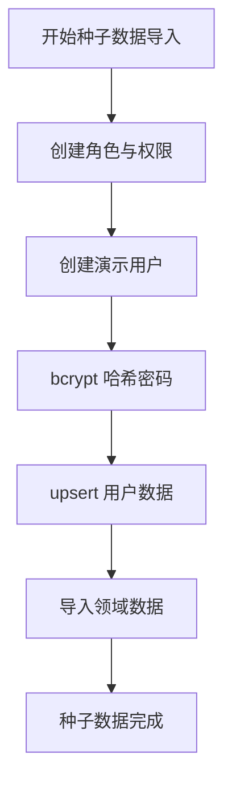

**图表来源**
- [server/prisma/seed.ts](file://server/prisma/seed.ts)
- [server/src/lib/password.ts](file://server/src/lib/password.ts)

**章节来源**
- [server/prisma/seed.ts](file://server/prisma/seed.ts)
- [server/src/lib/password.ts](file://server/src/lib/password.ts)

### 前端开发与代理
- 前端基于 Vite，开发时通过代理将 API 请求转发至后端
- 本地开发端口与后端地址需在配置中保持一致

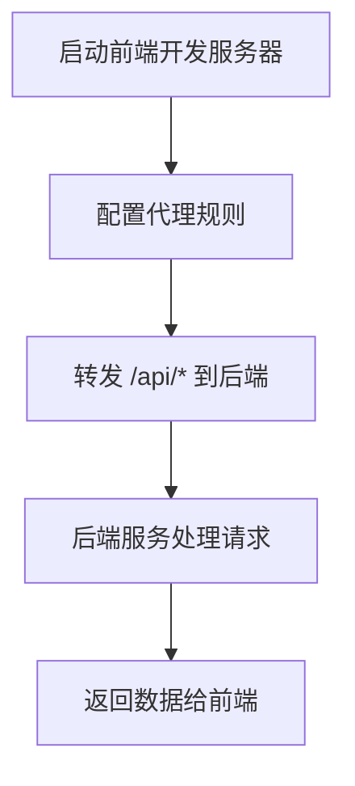

**图表来源**
- [web/vite.config.ts](file://web/vite.config.ts)
- [web/src/lib/api.ts](file://web/src/lib/api.ts)

**章节来源**
- [web/vite.config.ts](file://web/vite.config.ts)
- [web/src/lib/api.ts](file://web/src/lib/api.ts)

### 认证与权限流程
- 登录成功后颁发 access（短期）与 refresh（长期）令牌
- 后续请求携带 access 令牌，服务端校验有效性并检查黑名单
- 权限模型默认拒绝，需显式授权；数据范围通过 Prisma 扩展注入
- **新增**：强制改密检查在认证中间件中执行，未改密用户被限制访问

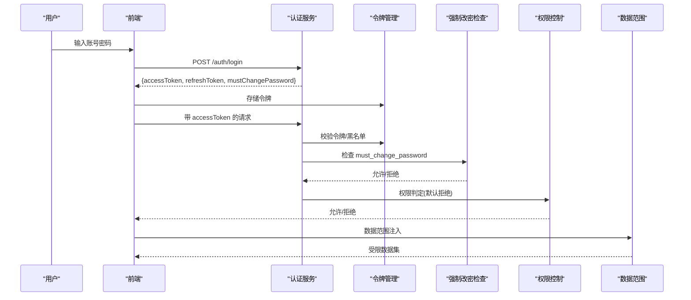

**图表来源**
- [server/src/middleware/auth.ts](file://server/src/middleware/auth.ts)
- [server/src/middleware/permission.ts](file://server/src/middleware/permission.ts)
- [server/src/middleware/scope.ts](file://server/src/middleware/scope.ts)
- [server/src/services/AuthService.ts](file://server/src/services/AuthService.ts)

**章节来源**
- [server/src/middleware/auth.ts](file://server/src/middleware/auth.ts)
- [server/src/middleware/permission.ts](file://server/src/middleware/permission.ts)
- [server/src/middleware/scope.ts](file://server/src/middleware/scope.ts)
- [server/src/services/AuthService.ts](file://server/src/services/AuthService.ts)

### 指标计算与公式解析
- 指标计算采用安全公式解析器，仅允许白名单算子（加减乘除与括号）
- 同比/环比由后端实时计算，不持久化存储，保证口径一致

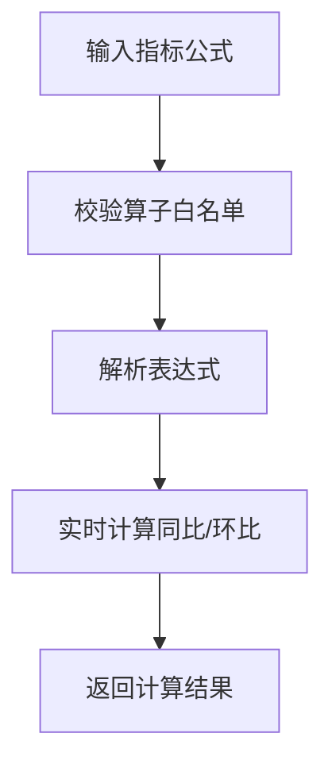

**图表来源**
- [server/src/lib/formula.ts](file://server/src/lib/formula.ts)

**章节来源**
- [server/src/lib/formula.ts](file://server/src/lib/formula.ts)

### AI 双管道与脱敏
- polish 管道：文本 → 脱敏 → LLM → 还原
- analyze 管道：结构化数据 → 计算 → 脱敏 → LLM → 生成
- 脱敏规则：绝对金额映射为区间，公司名动态映射

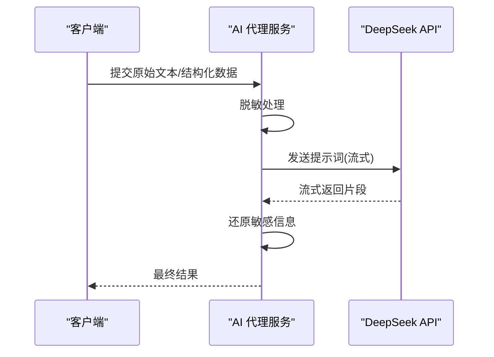

**图表来源**
- [server/src/services/AIProxyService.ts](file://server/src/services/AIProxyService.ts)

**章节来源**
- [server/src/services/AIProxyService.ts](file://server/src/services/AIProxyService.ts)

## 依赖关系分析
- 根级 package.json 提供统一脚本，便于在单仓内协调前后端依赖安装与构建
- server 与 web 各自维护依赖，避免冲突
- 运行时依赖包括 Express、Prisma、PostgreSQL、JWT、DeepSeek SDK（SSE）

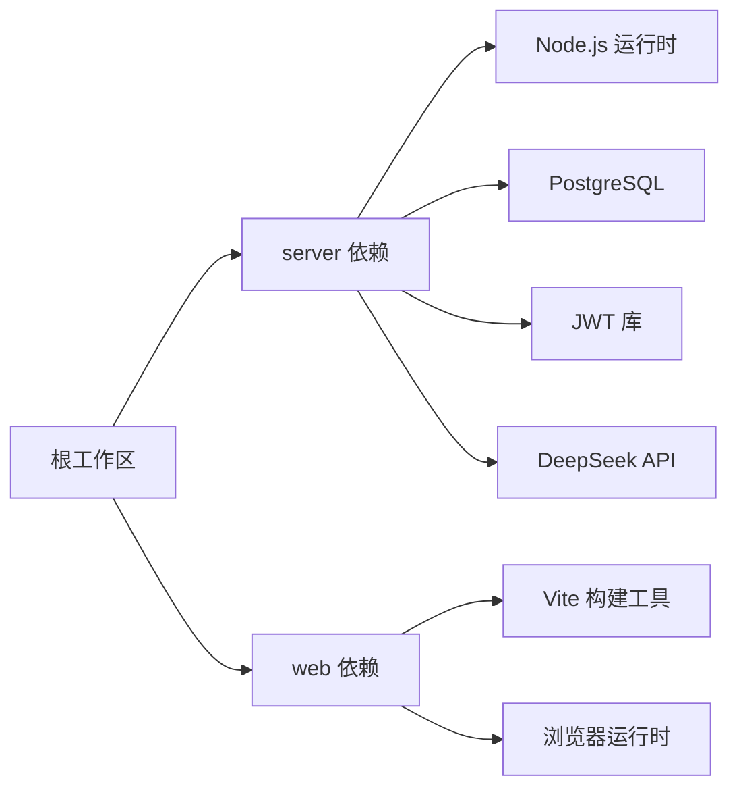

**图表来源**
- [package.json](file://package.json)
- [server/package.json](file://server/package.json)
- [web/package.json](file://web/package.json)

**章节来源**
- [package.json](file://package.json)
- [server/package.json](file://server/package.json)
- [web/package.json](file://web/package.json)

## 性能注意事项
- 中间件顺序影响性能与安全性，尽量将轻量级中间件前置
- 数据库连接池与慢查询监控建议在 Prisma 层开启日志
- 指标计算避免重复计算，必要时引入缓存（注意一致性）
- AI 流式响应可降低首屏延迟，注意背压与超时处理
- **新增**：强制改密检查在认证中间件中执行，开销极小（单次布尔值检查）

## 故障排查指南
- 数据库无法连接：检查本地 Postgres 是否启动、Prisma 连接字符串是否正确、迁移是否执行
- 权限被拒：确认路由是否已授权，权限策略是否为"默认拒绝"，用户角色与资源匹配
- **首次登录被拦截**：检查用户 `must_change_password` 字段是否为 `true`，需要通过 PUT /api/v1/auth/password 修改密码
- **强制改密用户无法访问业务接口**：确认请求路径是否在豁免列表中（/api/v1/auth/password、/api/v1/auth/logout、/api/v1/auth/profile）
- 跨域失败：检查 CORS 配置与前端代理设置
- 限流触发：查看速率限制阈值与 IP/用户维度计数
- AI 流式异常：确认 DeepSeek API Key 与网络连通性，关注 SSE 断连重试

**章节来源**
- [server/src/config/env.ts](file://server/src/config/env.ts)
- [server/src/middleware/cors.ts](file://server/src/middleware/cors.ts)
- [server/src/middleware/rate-limit.ts](file://server/src/middleware/rate-limit.ts)
- [server/src/middleware/permission.ts](file://server/src/middleware/permission.ts)
- [server/src/middleware/auth.ts](file://server/src/middleware/auth.ts)
- [server/src/services/AIProxyService.ts](file://server/src/services/AIProxyService.ts)

## 结论
按照本指南完成环境准备后，你将能够在本机运行前后端服务、连接本地数据库并完成基本功能验证。**新增的首次登录强制改密功能**进一步增强了系统安全性，确保所有用户账户都使用安全的个人密码。建议结合单元测试与集成测试进一步验证稳定性，并在迭代过程中保持中间件链与权限策略的一致性。

## 附录
- 常用命令参考（请根据实际 package.json 中的脚本定义调整）
  - 安装依赖：在根目录与 server/web 子目录分别执行
  - 启动本地数据库：使用 server 提供的脚本
  - 执行迁移与种子：在 server 目录执行 Prisma 相关命令
  - 启动后端：在 server 目录执行开发模式
  - 启动前端：在 web 目录执行开发模式
- 环境变量清单（示例）
  - 数据库连接串、JWT 密钥、DeepSeek API Key、CORS 白名单、限流阈值等
- **新增 API 端点**
  - PUT /api/v1/auth/password：修改密码（需登录，用于首次改密）
- **新增用户字段**
  - must_change_password：布尔值，表示是否需要首次登录改密

**章节来源**
- [docs/本地开发环境启动指南.md](file://docs/本地开发环境启动指南.md)
- [server/src/routes/auth.ts](file://server/src/routes/auth.ts)
- [server/prisma/schema.prisma](file://server/prisma/schema.prisma)