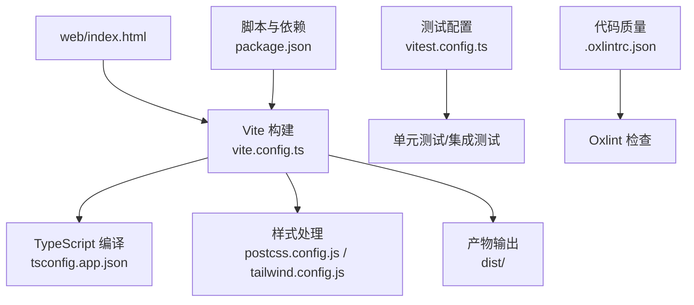
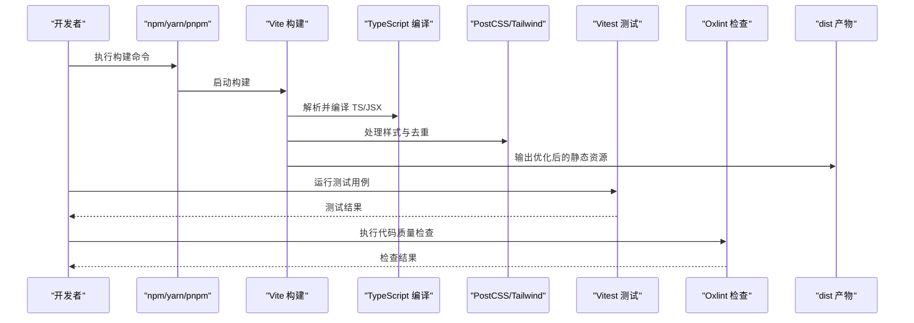
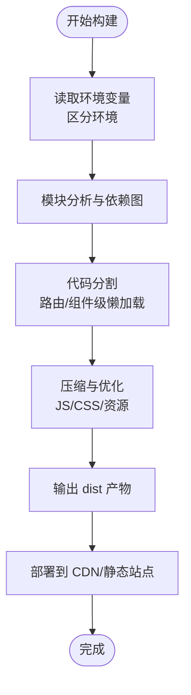
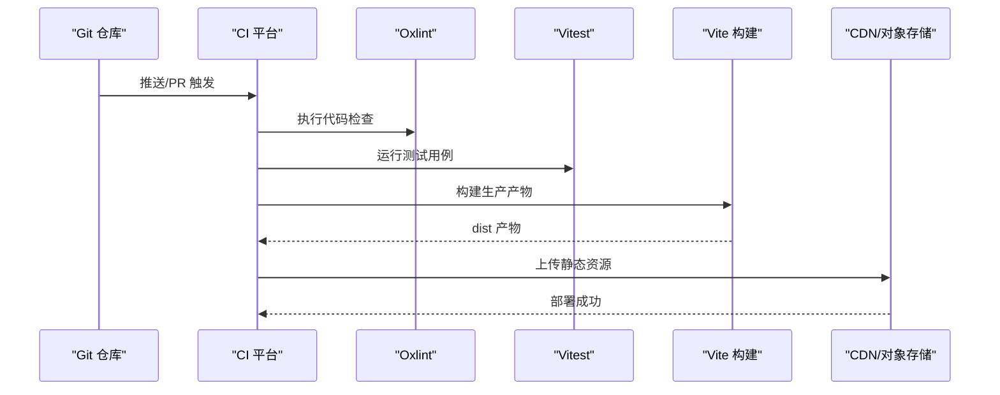
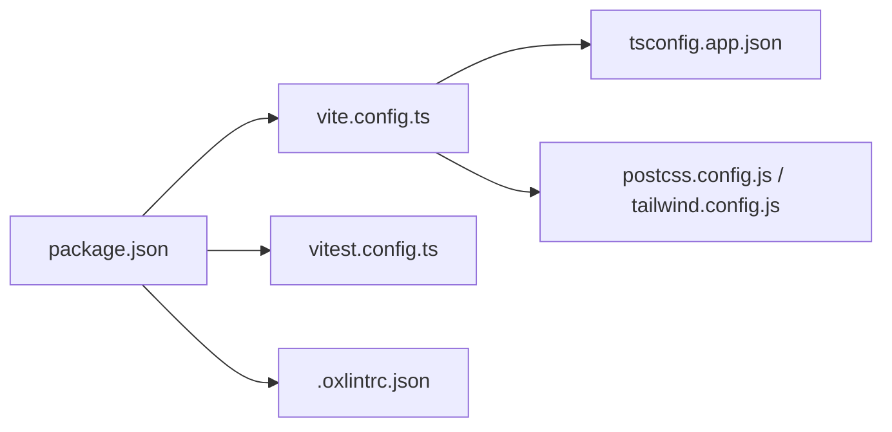

# 构建与部署

<cite>
**本文引用的文件**   
- [vite.config.ts](file://web/vite.config.ts)
- [package.json](file://web/package.json)
- [index.html](file://web/index.html)
- [tsconfig.app.json](file://web/tsconfig.app.json)
- [postcss.config.js](file://web/postcss.config.js)
- [tailwind.config.js](file://web/tailwind.config.js)
- [vitest.config.ts](file://web/vitest.config.ts)
- [.oxlintrc.json](file://web/.oxlintrc.json)
- [devops.md](file://docs/references/devops.md)
</cite>

## 目录
1. [简介](#简介)
2. [项目结构](#项目结构)
3. [核心组件](#核心组件)
4. [架构总览](#架构总览)
5. [详细组件分析](#详细组件分析)
6. [依赖分析](#依赖分析)
7. [性能考虑](#性能考虑)
8. [故障排查指南](#故障排查指南)
9. [结论](#结论)
10. [附录](#附录)

## 简介
本指南面向 pj3 项目的构建与部署，围绕 Vite 构建工具的生产优化、多环境配置、静态资源优化、持续集成与运维保障展开。文档基于仓库中现有配置文件进行分析，并提供可操作的实践建议，帮助团队在开发、测试、预发布与生产环境中实现稳定高效的交付流程。

## 项目结构
本项目采用前端工程化标准结构，关键构建与部署相关配置集中在 web 目录下：
- 构建与打包：Vite（入口配置 vite.config.ts）
- 样式处理：PostCSS + Tailwind CSS（postcss.config.js、tailwind.config.js）
- 类型与编译：TypeScript（tsconfig.app.json）
- 测试：Vitest（vitest.config.ts）
- 代码质量：Oxlint（.oxlintrc.json）
- 应用入口：index.html
- 脚本与依赖：package.json

图表来源
- [vite.config.ts](file://web/vite.config.ts)
- [index.html](file://web/index.html)
- [tsconfig.app.json](file://web/tsconfig.app.json)
- [postcss.config.js](file://web/postcss.config.js)
- [tailwind.config.js](file://web/tailwind.config.js)
- [vitest.config.ts](file://web/vitest.config.ts)
- [.oxlintrc.json](file://web/.oxlintrc.json)
- [package.json](file://web/package.json)

章节来源
- [vite.config.ts](file://web/vite.config.ts)
- [package.json](file://web/package.json)
- [index.html](file://web/index.html)
- [tsconfig.app.json](file://web/tsconfig.app.json)
- [postcss.config.js](file://web/postcss.config.js)
- [tailwind.config.js](file://web/tailwind.config.js)
- [vitest.config.ts](file://web/vitest.config.ts)
- [.oxlintrc.json](file://web/.oxlintrc.json)

## 核心组件
本节聚焦构建与部署的核心能力点，结合仓库中的实际配置进行说明。

- 构建工具与打包策略
  - Vite 作为开发与构建核心，负责模块解析、按需加载、Tree Shaking、代码分割与资源优化。
  - 通过环境变量区分不同环境的构建行为，便于实现多环境差异化配置。
  - 产物输出至 dist 目录，便于后续部署到静态托管或 CDN。

- 样式与主题
  - PostCSS 提供插件扩展能力，Tailwind CSS 用于原子化样式生成与精简。
  - 生产构建时可通过 Purge/Tailwind 的 Tree Shaking 移除未使用样式，减小体积。

- 类型系统与编译
  - TypeScript 配置确保类型安全与编译选项一致，提升构建稳定性与可维护性。

- 测试与质量
  - Vitest 提供快速测试执行，配合 setup 与覆盖率报告，保障构建前质量。
  - Oxlint 提供高性能静态检查，可在 CI 中阻断低质量代码合并。

- 脚本与依赖管理
  - package.json 定义常用命令（如 dev/build/test/lint），统一本地与 CI 的执行方式。

章节来源
- [vite.config.ts](file://web/vite.config.ts)
- [postcss.config.js](file://web/postcss.config.js)
- [tailwind.config.js](file://web/tailwind.config.js)
- [tsconfig.app.json](file://web/tsconfig.app.json)
- [vitest.config.ts](file://web/vitest.config.ts)
- [.oxlintrc.json](file://web/.oxlintrc.json)
- [package.json](file://web/package.json)

## 架构总览
下图展示从源码到产物的构建链路，以及测试与质量检查在流水线中的位置。

图表来源
- [vite.config.ts](file://web/vite.config.ts)
- [vitest.config.ts](file://web/vitest.config.ts)
- [.oxlintrc.json](file://web/.oxlintrc.json)
- [package.json](file://web/package.json)

## 详细组件分析

### Vite 构建优化与生产流程
- 代码分割与动态导入
  - 利用路由级或组件级的动态导入，将大模块拆分为独立 chunk，减少首屏加载时间。
  - 对第三方库（如图表、富文本等）进行单独分包，提高缓存命中率。
- 资源压缩与优化
  - JS/CSS 在生产构建时启用压缩，去除注释与多余空白。
  - 图片与字体等资源进行压缩与格式转换（如 WebP/SVG），降低传输体积。
- Tree Shaking 与死代码消除
  - 确保模块导出为 ES 模块，避免副作用；合理使用命名导出，使打包器能剔除未使用代码。
  - 样式方面借助 Tailwind 的扫描机制，仅保留被使用的类名。
- 环境变量与多环境配置
  - 通过环境变量注入 API 地址、功能开关、日志级别等，实现开发/测试/预发/生产的差异化。
  - 在 index.html 中引入运行时变量或使用构建期替换，注意安全性与可维护性。
- CDN 与缓存策略
  - 将静态资源部署到 CDN，开启长缓存与版本化文件名，提升全球访问速度与缓存命中。
  - 设置合理的 Cache-Control 与 ETag，保证更新及时且缓存有效。

图表来源
- [vite.config.ts](file://web/vite.config.ts)
- [index.html](file://web/index.html)
- [package.json](file://web/package.json)

章节来源
- [vite.config.ts](file://web/vite.config.ts)
- [index.html](file://web/index.html)
- [package.json](file://web/package.json)

### 静态资源优化方案
- 图片优化
  - 优先使用现代格式（WebP/AVIF），必要时回退到 JPEG/PNG。
  - 根据设备像素比与屏幕尺寸提供多分辨率资源，减少带宽消耗。
- 字体优化
  - 使用子集化字体与 font-display 策略，避免阻塞渲染。
  - 将字体资源缓存更长时间，并通过 CDN 就近分发。
- CSS 精简
  - 借助 Tailwind 的扫描与 PostCSS 插件，移除未使用样式。
  - 拆分公共样式与页面样式，提升复用与缓存效率。

章节来源
- [postcss.config.js](file://web/postcss.config.js)
- [tailwind.config.js](file://web/tailwind.config.js)

### 持续集成与 DevOps 实践
- 自动化测试
  - 在 CI 中执行 Vitest 测试套件，生成覆盖率报告，设定阈值阻断合并。
- 代码质量检查
  - 使用 Oxlint 进行静态检查，统一规则并在 PR 阶段拦截问题。
- 构建流水线
  - 安装依赖、执行 lint 与 test、构建产物、上传到对象存储或 CDN。
  - 支持多环境构建与灰度发布，结合环境变量切换后端接口与功能开关。
- 参考文档
  - 仓库中包含 DevOps 参考文档，可作为流水线设计与最佳实践的补充。

图表来源
- [.oxlintrc.json](file://web/.oxlintrc.json)
- [vitest.config.ts](file://web/vitest.config.ts)
- [vite.config.ts](file://web/vite.config.ts)
- [devops.md](file://docs/references/devops.md)

章节来源
- [.oxlintrc.json](file://web/.oxlintrc.json)
- [vitest.config.ts](file://web/vitest.config.ts)
- [vite.config.ts](file://web/vite.config.ts)
- [devops.md](file://docs/references/devops.md)

### 多环境部署方案
- 环境划分
  - 开发（dev）、测试（test）、预发布（staging）、生产（prod）。
- 差异化配置
  - 通过环境变量注入后端 API 地址、日志上报端点、功能开关等。
  - 在构建阶段替换常量或在运行时读取全局变量，确保一致性。
- 部署策略
  - 蓝绿/灰度发布：先部署新版本到少量实例，验证后再全量切换。
  - 回滚策略：保留上一版本产物，出现问题快速回滚。

章节来源
- [vite.config.ts](file://web/vite.config.ts)
- [index.html](file://web/index.html)
- [package.json](file://web/package.json)

### 监控与日志收集
- 前端监控
  - 接入错误上报与性能采集（白屏、接口失败、JS 异常、资源加载耗时）。
  - 结合用户标识与环境信息，定位问题范围。
- 日志收集
  - 将关键操作与错误日志上报到集中式日志系统，便于检索与分析。
- 告警与复盘
  - 设置阈值告警，建立复盘流程，持续改进用户体验与稳定性。

[本节为通用指导，不直接分析具体文件]

## 依赖分析
- 构建与样式
  - Vite 为核心构建器，依赖 TypeScript 与 PostCSS/Tailwind 进行编译与样式处理。
- 测试与质量
  - Vitest 与 Oxlint 分别承担测试与静态检查职责，在本地与 CI 中保持一致。
- 脚本与命令
  - package.json 统一定义常用命令，便于跨环境与团队协作。

图表来源
- [package.json](file://web/package.json)
- [vite.config.ts](file://web/vite.config.ts)
- [tsconfig.app.json](file://web/tsconfig.app.json)
- [postcss.config.js](file://web/postcss.config.js)
- [tailwind.config.js](file://web/tailwind.config.js)
- [vitest.config.ts](file://web/vitest.config.ts)
- [.oxlintrc.json](file://web/.oxlintrc.json)

章节来源
- [package.json](file://web/package.json)
- [vite.config.ts](file://web/vite.config.ts)
- [tsconfig.app.json](file://web/tsconfig.app.json)
- [postcss.config.js](file://web/postcss.config.js)
- [tailwind.config.js](file://web/tailwind.config.js)
- [vitest.config.ts](file://web/vitest.config.ts)
- [.oxlintrc.json](file://web/.oxlintrc.json)

## 性能考虑
- 首屏优化
  - 路由级懒加载与关键路径内联，减少首屏请求数与体积。
  - 预加载关键资源（字体、图标、核心样式）。
- 缓存与网络
  - 使用版本化文件名与强缓存策略，结合 CDN 边缘节点加速。
  - 合理设置 HTTP 头（Cache-Control、ETag、Last-Modified）。
- 资源体积控制
  - 定期分析 bundle 大小，识别大包依赖并进行分包或替换。
  - 图片与字体按需加载与格式优化，避免不必要的资源传输。

[本节为通用指导，不直接分析具体文件]

## 故障排查指南
- 构建失败
  - 检查环境变量是否缺失或类型不匹配，确认依赖安装完整。
  - 查看构建日志，定位模块解析或样式处理错误。
- 运行时错误
  - 通过前端监控与日志上报定位异常堆栈与上下文。
  - 核对环境变量与后端接口地址，确保环境一致性。
- 性能问题
  - 使用浏览器性能面板分析加载与渲染瓶颈。
  - 检查资源缓存策略与 CDN 命中率，优化分包与懒加载。

章节来源
- [vite.config.ts](file://web/vite.config.ts)
- [vitest.config.ts](file://web/vitest.config.ts)
- [.oxlintrc.json](file://web/.oxlintrc.json)
- [package.json](file://web/package.json)

## 结论
通过对 Vite 构建优化、静态资源治理、持续集成与多环境部署的系统化实践，pj3 项目能够在保证质量的前提下实现高效交付与稳定运行。建议团队在 CI 中固化 lint/test/build 流程，结合监控与日志体系形成闭环，持续提升用户体验与运维效率。

## 附录
- 参考文档
  - DevOps 参考文档可用于完善流水线设计与最佳实践。

章节来源
- [devops.md](file://docs/references/devops.md)