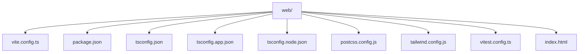
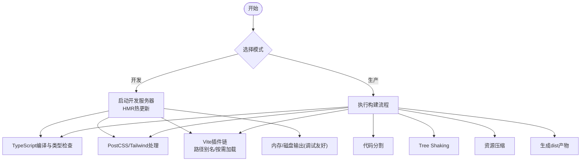
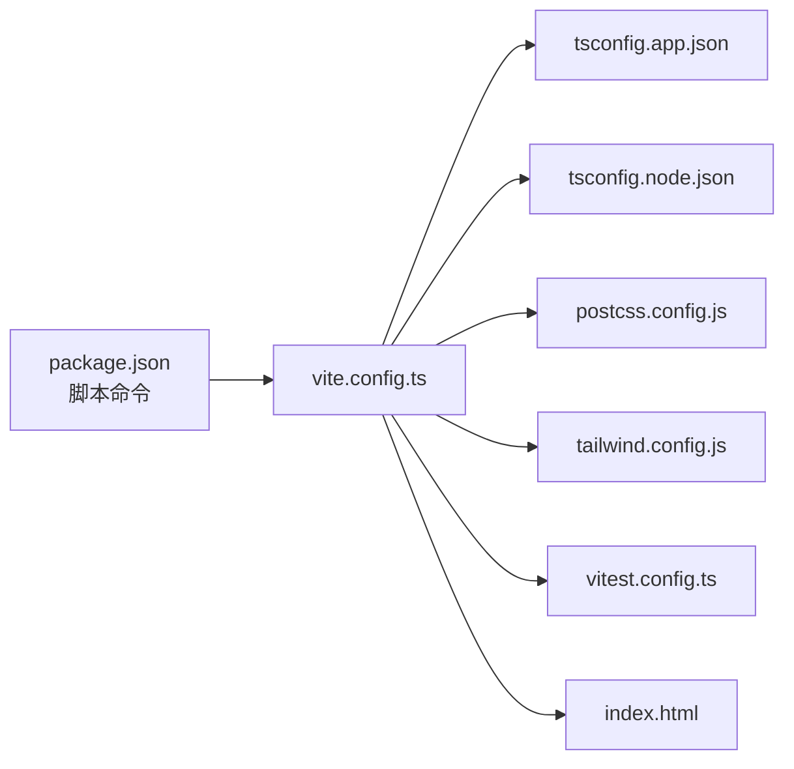

# 构建配置详解

<cite>
**本文引用的文件**   
- [vite.config.ts](file://web/vite.config.ts)
- [package.json](file://web/package.json)
- [tsconfig.app.json](file://web/tsconfig.app.json)
- [tsconfig.node.json](file://web/tsconfig.node.json)
- [tsconfig.json](file://web/tsconfig.json)
- [postcss.config.js](file://web/postcss.config.js)
- [tailwind.config.js](file://web/tailwind.config.js)
- [vitest.config.ts](file://web/vitest.config.ts)
- [index.html](file://web/index.html)
</cite>

## 目录
1. [简介](#简介)
2. [项目结构](#项目结构)
3. [核心组件](#核心组件)
4. [架构总览](#架构总览)
5. [详细组件分析](#详细组件分析)
6. [依赖分析](#依赖分析)
7. [性能考虑](#性能考虑)
8. [故障排查指南](#故障排查指南)
9. [结论](#结论)
10. [附录](#附录)

## 简介
本文件面向pj3项目的构建与打包配置，聚焦于Vite作为前端构建工具的核心配置与实践。内容覆盖开发服务器、热重载、路径别名、生产环境优化（代码分割、Tree Shaking、资源压缩、CSS处理）、TypeScript编译配置、包管理器脚本命令以及构建性能优化最佳实践。目标是帮助开发者快速理解并高效使用当前项目的构建体系。

## 项目结构
本项目采用单仓库多模块组织方式，前端工程位于web子目录，包含Vite、TypeScript、PostCSS、Tailwind CSS、Vitest等关键构建与测试工具的配置入口。

图表来源
- [vite.config.ts](file://web/vite.config.ts)
- [package.json](file://web/package.json)
- [tsconfig.json](file://web/tsconfig.json)
- [tsconfig.app.json](file://web/tsconfig.app.json)
- [tsconfig.node.json](file://web/tsconfig.node.json)
- [postcss.config.js](file://web/postcss.config.js)
- [tailwind.config.js](file://web/tailwind.config.js)
- [vitest.config.ts](file://web/vitest.config.ts)
- [index.html](file://web/index.html)

章节来源
- [vite.config.ts](file://web/vite.config.ts)
- [package.json](file://web/package.json)
- [tsconfig.json](file://web/tsconfig.json)
- [tsconfig.app.json](file://web/tsconfig.app.json)
- [tsconfig.node.json](file://web/tsconfig.node.json)
- [postcss.config.js](file://web/postcss.config.js)
- [tailwind.config.js](file://web/tailwind.config.js)
- [vitest.config.ts](file://web/vitest.config.ts)
- [index.html](file://web/index.html)

## 核心组件
本节概述与构建相关的关键配置文件及其职责：
- Vite配置：定义开发服务器、插件链、路径别名、构建产物与优化策略
- TypeScript配置：区分应用与Node端类型检查、模块解析与目标版本
- PostCSS与Tailwind：样式预处理与原子化样式集成
- Vitest：单元测试与测试运行器配置
- package.json：脚本命令与依赖声明

章节来源
- [vite.config.ts](file://web/vite.config.ts)
- [tsconfig.app.json](file://web/tsconfig.app.json)
- [tsconfig.node.json](file://web/tsconfig.node.json)
- [postcss.config.js](file://web/postcss.config.js)
- [tailwind.config.js](file://web/tailwind.config.js)
- [vitest.config.ts](file://web/vitest.config.ts)
- [package.json](file://web/package.json)

## 架构总览
下图展示了从源码到产物的主要流程与关键节点，包括开发模式与生产模式的差异点。

图表来源
- [vite.config.ts](file://web/vite.config.ts)
- [tsconfig.app.json](file://web/tsconfig.app.json)
- [postcss.config.js](file://web/postcss.config.js)
- [tailwind.config.js](file://web/tailwind.config.js)

## 详细组件分析

### Vite构建配置
- 开发服务器
  - 监听端口、主机地址、代理转发、HTTPS、基础路径等
  - 热模块替换(HMR)默认启用，支持React/TSX增量更新
- 路径别名
  - 通过别名映射简化导入路径，提升可读性与可维护性
- 插件链
  - React、TypeScript、CSS、静态资源等插件组合
- 构建优化
  - 代码分割：按路由或大依赖进行分包
  - Tree Shaking：移除未使用导出
  - 资源压缩：JS/CSS/图片等压缩策略
  - 预构建与缓存：依赖预构建加速冷启动
- 环境变量
  - 通过.env文件注入构建期变量，区分开发与生产行为

章节来源
- [vite.config.ts](file://web/vite.config.ts)

### TypeScript编译配置
- tsconfig.json
  - 聚合多个tsconfig，统一引用与共享设置
- tsconfig.app.json
  - 应用层类型检查、模块解析、目标版本、严格模式、jsx/react-jsx等
- tsconfig.node.json
  - Node端工具与脚本的类型检查与模块解析
- 模块解析与路径映射
  - baseUrl、paths等用于与Vite别名保持一致
- 目标与兼容性
  - target、lib、moduleResolution等影响兼容性与性能

章节来源
- [tsconfig.json](file://web/tsconfig.json)
- [tsconfig.app.json](file://web/tsconfig.app.json)
- [tsconfig.node.json](file://web/tsconfig.node.json)

### PostCSS与Tailwind CSS
- PostCSS配置
  - 引入必要的处理器与插件，如autoprefixer
- Tailwind配置
  - 主题扩展、自定义颜色、断点、插件启用等
- 与Vite集成
  - 在入口样式中引入Tailwind指令，确保构建时正确生成样式

章节来源
- [postcss.config.js](file://web/postcss.config.js)
- [tailwind.config.js](file://web/tailwind.config.js)

### Vitest测试配置
- 测试环境与入口
  - 指定测试入口、全局setup文件、覆盖率报告等
- 与Vite复用
  - 复用Vite的模块解析与别名，保证测试与运行时代码一致
- 并行与隔离
  - 合理配置并发度与隔离策略，提高测试速度

章节来源
- [vitest.config.ts](file://web/vitest.config.ts)

### 包管理器脚本命令
- 常用命令
  - 开发：启动本地服务与HMR
  - 构建：生成生产产物
  - 预览：本地预览构建结果
  - 测试：运行单元测试与覆盖率
- 扩展方法
  - 通过环境变量切换构建模式
  - 通过CLI参数控制日志级别、是否开启sourcemap等

章节来源
- [package.json](file://web/package.json)

### HTML入口与资源
- index.html
  - 作为Vite应用的根模板，注入入口脚本与全局样式
- 静态资源
  - public目录下的资源在构建时原样拷贝

章节来源
- [index.html](file://web/index.html)

## 依赖分析
下图展示构建阶段的主要依赖关系与调用顺序。

图表来源
- [package.json](file://web/package.json)
- [vite.config.ts](file://web/vite.config.ts)
- [tsconfig.app.json](file://web/tsconfig.app.json)
- [tsconfig.node.json](file://web/tsconfig.node.json)
- [postcss.config.js](file://web/postcss.config.js)
- [tailwind.config.js](file://web/tailwind.config.js)
- [vitest.config.ts](file://web/vitest.config.ts)
- [index.html](file://web/index.html)

章节来源
- [package.json](file://web/package.json)
- [vite.config.ts](file://web/vite.config.ts)

## 性能考虑
- 增量构建与缓存
  - 利用Vite依赖预构建与文件系统缓存，缩短冷启动时间
  - 合理使用.esbuild缓存与node_modules/.vite缓存
- 代码分割
  - 基于路由或大依赖进行动态导入，减少首屏体积
- Tree Shaking
  - 保持ESM导出风格，避免副作用污染，确保摇树生效
- 资源压缩
  - JS/CSS压缩、图片无损/有损压缩、字体子集化
- 并行处理
  - 测试与构建任务并行化，充分利用CPU核数
- 构建产物分析
  - 使用可视化分析定位大包与重复依赖，针对性优化

[本节为通用指导，不直接分析具体文件]

## 故障排查指南
- 开发服务器无法启动
  - 检查端口占用、主机绑定、代理配置是否正确
- HMR不生效
  - 确认插件链与模块热更新兼容性，避免破坏状态的全局副作用
- 路径别名失效
  - 核对Vite别名与TS paths配置一致性
- 构建产物异常
  - 检查环境变量、外部依赖、资源路径与权限
- 测试失败
  - 确认测试入口、全局setup、模拟数据与环境变量

章节来源
- [vite.config.ts](file://web/vite.config.ts)
- [vitest.config.ts](file://web/vitest.config.ts)
- [tsconfig.app.json](file://web/tsconfig.app.json)

## 结论
通过对Vite、TypeScript、PostCSS/Tailwind与Vitest等构建配置的梳理，可以清晰地看到pj3项目在开发体验与生产优化上的整体设计。遵循本文的最佳实践，可在保证开发效率的同时获得高质量的生产产物。

[本节为总结性内容，不直接分析具体文件]

## 附录
- 术语说明
  - HMR：热模块替换
  - Tree Shaking：死代码消除
  - 代码分割：将大体积代码拆分为多个可独立加载的块
- 参考入口
  - 构建配置入口：[vite.config.ts](file://web/vite.config.ts)
  - 类型配置入口：[tsconfig.app.json](file://web/tsconfig.app.json)、[tsconfig.node.json](file://web/tsconfig.node.json)
  - 样式处理入口：[postcss.config.js](file://web/postcss.config.js)、[tailwind.config.js](file://web/tailwind.config.js)
  - 测试配置入口：[vitest.config.ts](file://web/vitest.config.ts)
  - 脚本命令入口：[package.json](file://web/package.json)
  - HTML入口：[index.html](file://web/index.html)