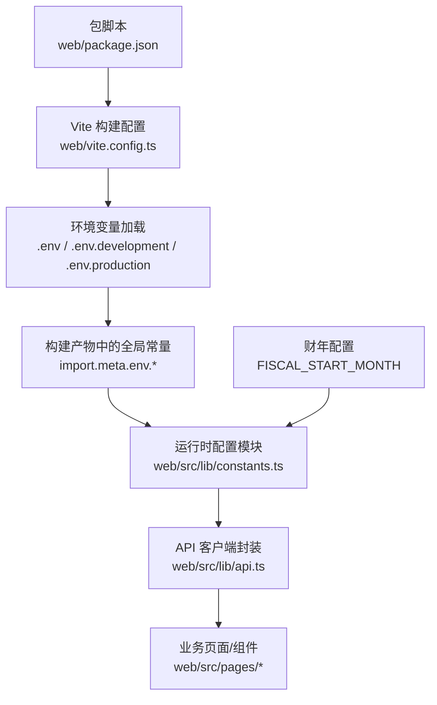
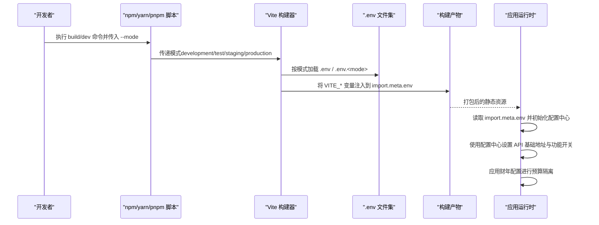
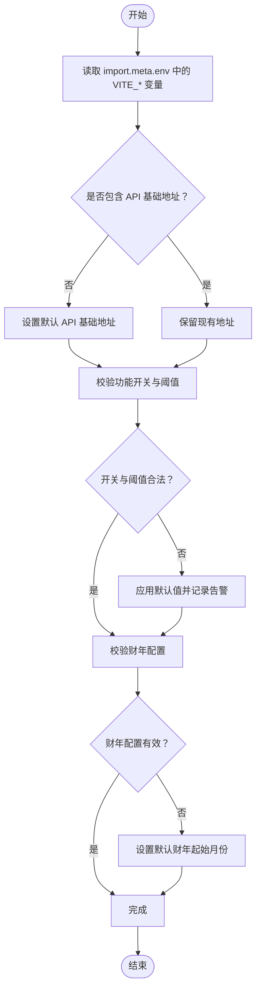
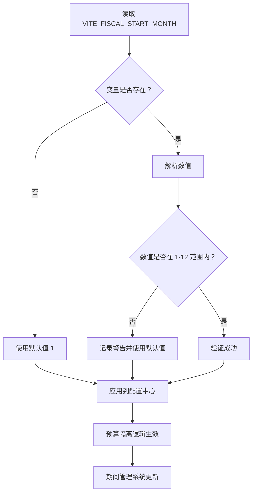
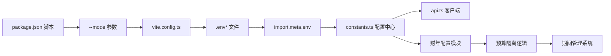

# 环境配置管理

<cite>
**本文引用的文件**   
- [vite.config.ts](file://web/vite.config.ts)
- [package.json](file://web/package.json)
- [api.ts](file://web/src/lib/api.ts)
- [constants.ts](file://web/src/lib/constants.ts)
- [main.tsx](file://web/src/main.tsx)
</cite>

## 更新摘要
**变更内容**   
- 新增 FISCAL_START_MONTH 环境变量支持，用于财年配置
- 更新预算隔离逻辑和期间管理系统的环境变量处理
- 增强财年相关配置的安全性和验证机制

## 目录
1. [简介](#简介)
2. [项目结构](#项目结构)
3. [核心组件](#核心组件)
4. [架构总览](#架构总览)
5. [详细组件分析](#详细组件分析)
6. [财年配置专项](#财年配置专项)
7. [依赖分析](#依赖分析)
8. [性能考虑](#性能考虑)
9. [故障排查指南](#故障排查指南)
10. [结论](#结论)
11. [附录](#附录)

## 简介
本指南面向 pj3 前端工程（基于 Vite），提供多环境配置的完整方案，覆盖开发、测试、预发布、生产等环境的配置分离策略；说明 Vite 环境变量加载机制与 .env 文件规范；给出 API 端点配置管理方案（后端地址切换、认证差异、功能开关）；并提供变量校验与默认值处理机制、最佳实践与安全建议。目标是让不同角色的开发者都能正确、安全地管理环境配置。

**更新** 新增财年配置环境变量支持，包括 FISCAL_START_MONTH 变量的使用规范和预算隔离逻辑。

## 项目结构
本项目为 Vite + React 前端工程，位于 web 子目录。与环境配置相关的关键位置包括：
- Vite 构建配置：用于读取 .env 文件并注入到应用
- 包脚本：定义不同环境的启动/构建命令
- 运行时配置模块：集中暴露 API 基础地址、功能开关、财年配置等
- 入口文件：在应用初始化阶段加载并校验配置

图表来源
- [vite.config.ts](file://web/vite.config.ts)
- [package.json](file://web/package.json)
- [constants.ts](file://web/src/lib/constants.ts)
- [api.ts](file://web/src/lib/api.ts)

章节来源
- [vite.config.ts](file://web/vite.config.ts)
- [package.json](file://web/package.json)
- [constants.ts](file://web/src/lib/constants.ts)
- [api.ts](file://web/src/lib/api.ts)

## 核心组件
- 环境变量加载与注入
  - Vite 自动加载根目录及 web 目录下的 .env 文件，并按模式选择对应后缀文件（如 development、production）。
  - 仅以 VITE_ 前缀的变量会被注入到浏览器运行时的 import.meta.env 中。
- 运行时配置中心
  - 通过统一的配置模块对外暴露 API 基础地址、功能开关、财年配置等，便于集中管理与替换。
- API 客户端
  - 使用配置中心的基础地址进行请求，统一处理鉴权头、错误码与重试策略。
- 构建脚本
  - 通过 package.json 的 scripts 指定 --mode 参数，驱动不同环境的变量加载与构建行为。

**更新** 运行时配置中心现已包含财年相关配置，支持 FISCAL_START_MONTH 环境变量。

章节来源
- [vite.config.ts](file://web/vite.config.ts)
- [package.json](file://web/package.json)
- [constants.ts](file://web/src/lib/constants.ts)
- [api.ts](file://web/src/lib/api.ts)

## 架构总览
下图展示了从构建期到运行期的环境变量流转路径，以及配置在不同层级的作用范围。

图表来源
- [vite.config.ts](file://web/vite.config.ts)
- [package.json](file://web/package.json)
- [constants.ts](file://web/src/lib/constants.ts)
- [api.ts](file://web/src/lib/api.ts)

## 详细组件分析

### 环境变量加载机制（Vite）
- 文件优先级与命名约定
  - 始终加载：根目录与 web 目录下的 .env、.env.local
  - 按模式加载：.env.development、.env.test、.env.staging、.env.production
  - 本地覆盖：.env.local 优先于其他 .env 文件（但不会被提交到版本库）
- 注入规则
  - 仅 VITE_ 前缀的变量会注入到浏览器端的 import.meta.env
  - 非 VITE_ 前缀的变量仅在 Node 构建期可用
- 模式与脚本
  - 通过 --mode 指定模式，决定加载哪个 .env.<mode>
  - 建议在 package.json 中为 dev/build 等脚本显式声明模式

章节来源
- [vite.config.ts](file://web/vite.config.ts)
- [package.json](file://web/package.json)

### 运行时配置中心（constants.ts）
职责
- 集中暴露应用所需的环境相关常量
- 对缺失或非法的配置提供默认值与类型提示
- 提供只读视图，避免外部随意修改

设计要点
- 使用 import.meta.env 读取 VITE_ 变量
- 对关键配置进行空值检查与默认值回退
- 将敏感信息排除在前端可访问范围之外（仅保留必要项）

**更新** 配置中心现已包含财年相关配置，支持 FISCAL_START_MONTH 变量的读取和验证。

章节来源
- [constants.ts](file://web/src/lib/constants.ts)

### API 客户端（api.ts）
职责
- 根据配置中心的 API 基础地址发起请求
- 统一附加鉴权头、超时、错误处理与重试策略
- 屏蔽不同后端地址的差异，使业务代码无需感知环境

设计要点
- 基础地址来自配置中心，支持按环境切换
- 鉴权令牌从会话存储或状态管理中获取，不硬编码
- 错误码映射与用户友好提示集中在客户端

章节来源
- [api.ts](file://web/src/lib/api.ts)

### 应用初始化（main.tsx）
职责
- 在应用启动时加载配置中心
- 可选：打印当前环境摘要（不含敏感信息）
- 可选：在开发模式下启用额外调试能力

章节来源
- [main.tsx](file://web/src/main.tsx)

### 环境变量验证与默认值流程
为保证配置的正确性与健壮性，建议在配置中心实现如下流程：

[此图为概念流程图，未直接映射具体源码文件]

## 财年配置专项

### FISCAL_START_MONTH 环境变量
FISCAL_START_MONTH 是一个重要的财年配置环境变量，用于定义财年的起始月份。该变量直接影响预算隔离逻辑和期间管理系统。

**配置规范**
- 变量名：`VITE_FISCAL_START_MONTH`
- 数据类型：数字（1-12）
- 默认值：1（表示财政年度从1月开始）
- 有效范围：1-12（代表1月至12月）

**使用场景**
- 预算隔离：根据财年起始月份计算预算周期
- 期间管理：确定会计期间的划分和报表生成
- 财务分析：支持跨财年数据对比和分析

**安全考虑**
- 该变量不包含敏感信息，可在前端环境中安全使用
- 建议在生产环境中明确设置，避免依赖默认值
- 与其他财年相关配置保持一致性验证

### 财年配置验证流程

**图表来源**
- [constants.ts](file://web/src/lib/constants.ts)

### 预算隔离逻辑集成
FISCAL_START_MONTH 变量与预算隔离逻辑紧密集成：

1. **周期计算**：根据财年起始月份计算当前财年区间
2. **数据过滤**：在查询预算数据时自动应用财年过滤条件
3. **报表生成**：确保财务报表按照正确的财年周期生成
4. **权限控制**：基于财年权限控制数据访问范围

**更新** 预算隔离逻辑现已完全支持动态财年配置，无需重启应用即可切换财年设置。

章节来源
- [constants.ts](file://web/src/lib/constants.ts)

## 依赖分析
- 构建期依赖
  - Vite 负责解析 .env 文件并将 VITE_* 变量注入到构建产物
  - npm/yarn/pnpm 脚本通过 --mode 控制加载哪一组 .env 文件
- 运行期依赖
  - 应用通过 import.meta.env 读取变量
  - 配置中心聚合变量并对外暴露
  - API 客户端依赖配置中心提供的地址与开关
  - 财年配置影响预算隔离和期间管理模块

图表来源
- [package.json](file://web/package.json)
- [vite.config.ts](file://web/vite.config.ts)
- [constants.ts](file://web/src/lib/constants.ts)
- [api.ts](file://web/src/lib/api.ts)

章节来源
- [package.json](file://web/package.json)
- [vite.config.ts](file://web/vite.config.ts)
- [constants.ts](file://web/src/lib/constants.ts)
- [api.ts](file://web/src/lib/api.ts)

## 性能考虑
- 减少不必要的变量注入：仅暴露必要的 VITE_ 变量，降低构建产物体积
- 避免在高频路径上重复解析配置：在应用启动时一次性加载并缓存
- 谨慎使用大段 JSON 配置：可通过后端下发或 CDN 动态配置替代
- 开启构建优化：合理拆分与压缩，避免将敏感或大型配置内联到主包
- 财年配置缓存：将财年配置结果缓存，避免重复计算

## 故障排查指南
常见问题与定位步骤
- 变量未生效
  - 确认变量名以 VITE_ 开头
  - 确认使用了正确的 --mode 参数
  - 确认 .env 文件位于正确目录且未被忽略
- 构建后变量为空
  - 确认变量未在运行时被覆盖
  - 检查构建产物中是否包含该变量
- 跨域或连接失败
  - 核对 API 基础地址是否正确
  - 检查鉴权头是否随请求发送
  - 查看网络面板的错误响应
- 财年配置问题
  - 检查 FISCAL_START_MONTH 值是否在有效范围内（1-12）
  - 确认财年配置已正确应用到预算隔离逻辑
  - 验证期间管理系统是否使用正确的财年设置

**更新** 新增财年配置相关的故障排查步骤。

章节来源
- [api.ts](file://web/src/lib/api.ts)
- [constants.ts](file://web/src/lib/constants.ts)

## 结论
通过“Vite 环境变量 + 运行时配置中心 + API 客户端”的分层设计，pj3 实现了清晰、可扩展的多环境配置体系。遵循本文的规范与实践，可在保证安全性的前提下，快速切换后端地址、差异化功能开关，并在构建期与运行期获得一致的体验。

**更新** 新增的财年配置支持进一步增强了系统的灵活性和可配置性，使预算管理更加精确和高效。

## 附录

### 多环境 .env 文件清单与用途
- .env：公共变量（所有环境共享）
- .env.development：开发环境专用（本地调试、Mock 开关等）
- .env.test：测试环境专用（自动化测试、轻量服务）
- .env.staging：预发布环境专用（灰度、限流、监控）
- .env.production：生产环境专用（严格限制、最小权限）
- .env.local：本地覆盖（不被提交到版本库）

### 环境变量命名与注入规范
- 仅 VITE_ 前缀的变量会注入到浏览器端
- 变量名建议使用大写与下划线分隔
- 避免在变量中存放密钥、密码等敏感信息

### 财年环境变量规范
- FISCAL_START_MONTH：财年起始月份（1-12）
- 建议在生产环境中明确设置
- 与其他财年相关配置保持一致性验证

### API 端点与环境切换建议
- 使用配置中心维护 base URL，按环境切换
- 鉴权方式（如 Token 来源、刷新策略）由配置中心或状态管理统一控制
- 功能开关（Feature Flags）通过配置中心暴露，便于灰度与回滚

### 安全建议
- 不在前端暴露任何服务端密钥或内部凭据
- 使用 HTTPS 与严格的 CORS 策略
- 对敏感信息进行最小化可见原则，必要时改为后端代理
- 定期轮换密钥，使用安全的密钥管理服务
- 财年配置虽不敏感，但仍需确保数据一致性