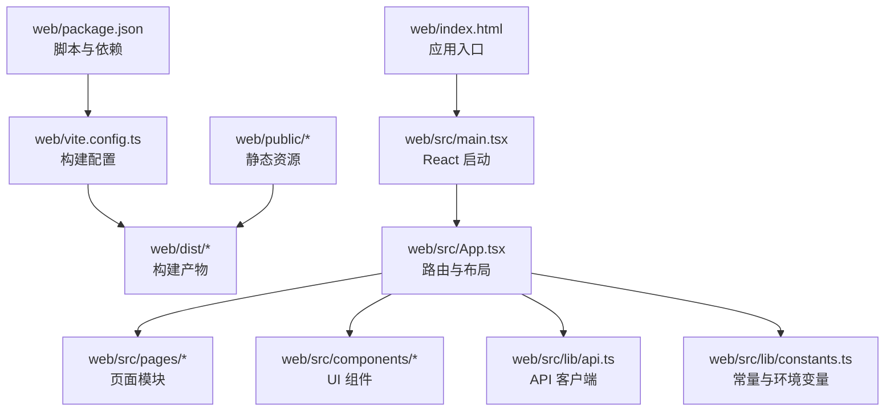
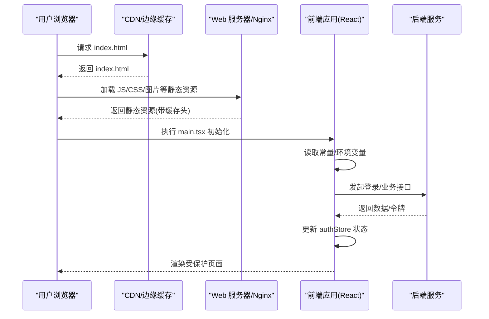
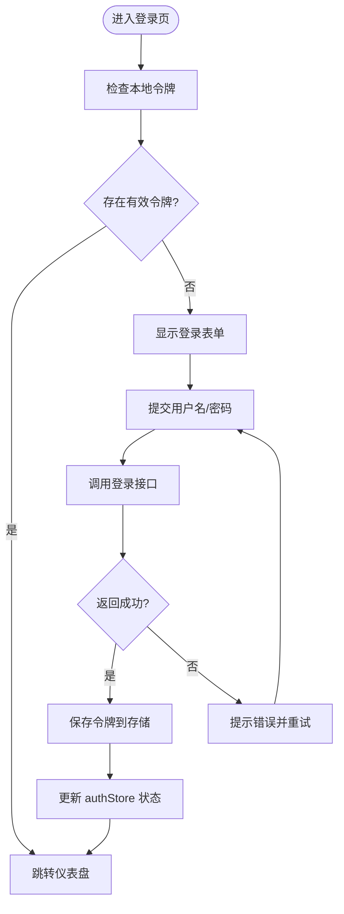
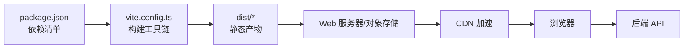

# 部署策略与流程

<cite>
**本文引用的文件**   
- [web/package.json](file://web/package.json)
- [web/vite.config.ts](file://web/vite.config.ts)
- [web/index.html](file://web/index.html)
- [web/src/main.tsx](file://web/src/main.tsx)
- [web/src/App.tsx](file://web/src/App.tsx)
- [web/src/lib/api.ts](file://web/src/lib/api.ts)
- [web/src/lib/constants.ts](file://web/src/lib/constants.ts)
- [web/src/pages/login/index.tsx](file://web/src/pages/login/index.tsx)
- [web/src/pages/dashboard/index.tsx](file://web/src/pages/dashboard/index.tsx)
- [web/src/stores/authStore.ts](file://web/src/stores/authStore.ts)
- [web/public/](file://web/public/)
- [web/dist/](file://web/dist/)
- [docs/references/devops.md](file://docs/references/devops.md)
</cite>

## 目录
1. [简介](#简介)
2. [项目结构](#项目结构)
3. [核心组件](#核心组件)
4. [架构总览](#架构总览)
5. [详细组件分析](#详细组件分析)
6. [依赖分析](#依赖分析)
7. [性能考虑](#性能考虑)
8. [故障排查指南](#故障排查指南)
9. [结论](#结论)
10. [附录](#附录)

## 简介
本文件面向 pj3 项目的部署与发布，提供多场景部署方案（传统服务器、容器化、云平台）、静态资源托管最佳实践（CDN、缓存、域名绑定）、版本管理与发布流程（版本号规范、回滚、灰度）、以及监控告警与常见问题的排障方法。文档以仓库中的前端工程为基础，结合通用运维实践给出可落地的步骤与注意事项。

## 项目结构
pj3 为基于 Vite + React 的前端应用，构建产物位于 web/dist，源码位于 web/src，入口 HTML 位于 web/index.html，构建配置位于 web/vite.config.ts，包管理信息位于 web/package.json。

图示来源
- [web/package.json](file://web/package.json)
- [web/vite.config.ts](file://web/vite.config.ts)
- [web/index.html](file://web/index.html)
- [web/src/main.tsx](file://web/src/main.tsx)
- [web/src/App.tsx](file://web/src/App.tsx)
- [web/src/lib/api.ts](file://web/src/lib/api.ts)
- [web/src/lib/constants.ts](file://web/src/lib/constants.ts)
- [web/public/](file://web/public/)
- [web/dist/](file://web/dist/)

章节来源
- [web/package.json](file://web/package.json)
- [web/vite.config.ts](file://web/vite.config.ts)
- [web/index.html](file://web/index.html)
- [web/src/main.tsx](file://web/src/main.tsx)
- [web/src/App.tsx](file://web/src/App.tsx)
- [web/src/lib/api.ts](file://web/src/lib/api.ts)
- [web/src/lib/constants.ts](file://web/src/lib/constants.ts)
- [web/public/](file://web/public/)
- [web/dist/](file://web/dist/)

## 核心组件
- 构建与打包：通过 Vite 将 TypeScript/JSX 源码编译为静态资源，输出到 dist 目录，便于直接由 Web 服务器或 CDN 托管。
- 应用入口：index.html 作为单页应用入口，main.tsx 初始化 React 应用并挂载根节点。
- 路由与页面：App.tsx 组织全局路由与布局，pages 下按功能划分页面模块。
- API 客户端：lib/api.ts 封装网络请求，配合 lib/constants.ts 中的基础地址与常量进行环境适配。
- 状态与权限：stores/authStore.ts 管理认证状态；login 页面负责登录流程；dashboard 等页面消费认证状态。

章节来源
- [web/src/main.tsx](file://web/src/main.tsx)
- [web/src/App.tsx](file://web/src/App.tsx)
- [web/src/lib/api.ts](file://web/src/lib/api.ts)
- [web/src/lib/constants.ts](file://web/src/lib/constants.ts)
- [web/src/stores/authStore.ts](file://web/src/stores/authStore.ts)
- [web/src/pages/login/index.tsx](file://web/src/pages/login/index.tsx)
- [web/src/pages/dashboard/index.tsx](file://web/src/pages/dashboard/index.tsx)

## 架构总览
下图展示从浏览器访问到后端 API 的端到端路径，包括静态资源分发与鉴权流程。

图示来源
- [web/index.html](file://web/index.html)
- [web/src/main.tsx](file://web/src/main.tsx)
- [web/src/lib/constants.ts](file://web/src/lib/constants.ts)
- [web/src/lib/api.ts](file://web/src/lib/api.ts)
- [web/src/stores/authStore.ts](file://web/src/stores/authStore.ts)
- [web/src/pages/login/index.tsx](file://web/src/pages/login/index.tsx)
- [web/src/pages/dashboard/index.tsx](file://web/src/pages/dashboard/index.tsx)

## 详细组件分析

### 构建与产物
- 构建目标：生成优化后的 JS/CSS/HTML 与静态资源，启用代码分割与压缩。
- 关键配置：Vite 构建选项、输出目录、资源哈希、公共路径等。
- 产物使用：dist 目录可直接被 Nginx/Apache/对象存储/CDN 托管。

章节来源
- [web/vite.config.ts](file://web/vite.config.ts)
- [web/package.json](file://web/package.json)
- [web/dist/](file://web/dist/)

### 应用入口与路由
- index.html 作为 SPA 入口，确保所有路由回退到该文件。
- main.tsx 初始化 React 应用并挂载到 DOM。
- App.tsx 定义全局路由、布局与权限守卫逻辑。

章节来源
- [web/index.html](file://web/index.html)
- [web/src/main.tsx](file://web/src/main.tsx)
- [web/src/App.tsx](file://web/src/App.tsx)

### 网络与鉴权
- api.ts 统一封装请求，处理基础 URL、错误码、重试与拦截器。
- constants.ts 集中管理环境变量与默认值，便于多环境切换。
- login 页面完成登录交互，authStore 持久化令牌与会话状态。
- dashboard 等页面根据权限决定是否渲染。

图示来源
- [web/src/pages/login/index.tsx](file://web/src/pages/login/index.tsx)
- [web/src/lib/api.ts](file://web/src/lib/api.ts)
- [web/src/lib/constants.ts](file://web/src/lib/constants.ts)
- [web/src/stores/authStore.ts](file://web/src/stores/authStore.ts)
- [web/src/pages/dashboard/index.tsx](file://web/src/pages/dashboard/index.tsx)

章节来源
- [web/src/lib/api.ts](file://web/src/lib/api.ts)
- [web/src/lib/constants.ts](file://web/src/lib/constants.ts)
- [web/src/stores/authStore.ts](file://web/src/stores/authStore.ts)
- [web/src/pages/login/index.tsx](file://web/src/pages/login/index.tsx)
- [web/src/pages/dashboard/index.tsx](file://web/src/pages/dashboard/index.tsx)

## 依赖分析
- 运行时依赖：React、路由库、状态管理等在 package.json 中声明。
- 构建依赖：Vite、TypeScript、Tailwind 等在开发时用于编译与样式处理。
- 外部集成：通过 api.ts 与后端服务通信，遵循统一的错误码与鉴权约定。

图示来源
- [web/package.json](file://web/package.json)
- [web/vite.config.ts](file://web/vite.config.ts)
- [web/dist/](file://web/dist/)

章节来源
- [web/package.json](file://web/package.json)
- [web/vite.config.ts](file://web/vite.config.ts)

## 性能考虑
- 静态资源缓存：对 JS/CSS/图片设置长期缓存，HTML 短缓存或不缓存，避免旧版本污染。
- 资源压缩与分块：启用 gzip/brotli，按需加载路由与组件，减少首屏体积。
- CDN 与边缘缓存：开启 HTTP/2、预取与预连接，合理配置 Cache-Control 与 ETag。
- 字体与图标：子集化与内联关键 CSS，减少阻塞。
- 监控指标：关注 LCP、FID、CLS 等核心 Web 指标，结合 RUM 采集真实用户体验。

[本节为通用指导，不直接分析具体文件]

## 故障排查指南
- 构建失败：检查 Node 版本、依赖安装、Vite 配置与 TS 类型错误。
- 路由 404：确认服务器将所有未知路径重定向到 index.html。
- 跨域问题：核对后端 CORS 配置与前端基础 URL。
- 鉴权异常：检查令牌有效期、刷新机制与存储键名一致性。
- 资源未命中：确认 public 目录资源路径与构建后引用一致。
- 日志与监控：接入错误上报与性能监控，定位线上问题。

章节来源
- [docs/references/devops.md](file://docs/references/devops.md)

## 结论
本策略围绕 pj3 前端工程的构建产物与运行特性，提供了多场景部署、静态资源托管、版本与发布管理、监控告警及排障建议。落地时请结合企业现有基础设施与合规要求，完善 CI/CD 流水线与变更管控流程，确保稳定、可观测、可回滚的持续交付能力。

## 附录

### 一、部署方案

#### 1. 传统服务器部署（Nginx/Apache）
- 前置条件
  - 已构建出 web/dist 目录
  - 服务器具备 Nginx/Apache 与 HTTPS 证书
- 部署步骤
  - 将 dist 目录上传至服务器指定站点目录
  - 配置反向代理与静态资源缓存头
  - 配置路由回退到 index.html
  - 重启服务并验证页面与接口连通性
- 回滚策略
  - 保留历史版本目录，切换软链接或站点根目录指向旧版本
  - 快速回切并观察监控指标
- 参考要点
  - 静态资源长缓存、HTML 短缓存
  - 开启 gzip/brotli 与 HTTP/2
  - 安全头与 CSP 策略

章节来源
- [web/dist/](file://web/dist/)
- [web/index.html](file://web/index.html)

#### 2. 容器化部署（Docker + Nginx）
- 镜像构建
  - 使用多阶段构建：第一阶段安装依赖并构建产物，第二阶段仅包含 Nginx 与 dist
  - 将 dist 复制到 Nginx 静态目录，并挂载配置文件
- 运行编排
  - 使用 docker-compose 或 Kubernetes Deployment/Service/Ingress
  - 暴露 80/443 端口，配置 TLS 终止
- 滚动升级
  - 更新镜像标签并滚动替换 Pod
  - 健康检查就绪探针确保流量平滑切换
- 回滚策略
  - 回滚到上一镜像标签，保持数据与配置不变

章节来源
- [web/dist/](file://web/dist/)
- [web/index.html](file://web/index.html)

#### 3. 云平台部署（对象存储 + CDN）
- 静态托管
  - 将 dist 上传至对象存储桶，开启静态网站托管
  - 配置 CDN 源站为对象存储域名
- 缓存策略
  - 对 JS/CSS/图片设置长期缓存，HTML 短缓存或不缓存
  - 开启 ETag/Last-Modified 校验
- 域名与证书
  - 绑定自定义域名，配置 HTTPS 与强制跳转
  - 启用 HSTS 与安全头
- 灰度发布
  - 通过 CDN 权重或路径分流实现小流量灰度
  - 对比核心指标后全量切换

章节来源
- [web/dist/](file://web/dist/)
- [web/index.html](file://web/index.html)

### 二、静态资源托管最佳实践
- CDN 配置
  - 开启边缘缓存、HTTP/2、预取与预连接
  - 针对大资源启用分片与断点续传
- 缓存策略
  - 资源文件名加哈希，浏览器可长期缓存
  - HTML 不缓存或短缓存，确保新版本及时生效
- 域名与路由
  - 主域名与静态资源域名分离，避免 Cookie 传输开销
  - 所有路由回退到 index.html，保证 SPA 路由正常
- 安全与合规
  - 强制 HTTPS、CSP、X-Frame-Options、Referrer-Policy 等

章节来源
- [web/index.html](file://web/index.html)
- [web/dist/](file://web/dist/)

### 三、版本管理与发布流程
- 版本号规范
  - 采用语义化版本（主.次.修订），重大变更递增主版本
  - 构建产物文件名包含哈希，便于追踪与回滚
- 分支策略
  - main 稳定分支，develop 集成分支，feature 分支并行开发
  - 合并前完成自动化测试与安全检查
- 发布流程
  - CI 触发构建与测试，生成 dist 并上传到目标环境
  - 自动注入环境变量与构建时间戳
- 灰度发布
  - 先对小比例用户开放新版本，观察错误率与性能指标
  - 达标后全量发布，未达标则自动回滚
- 回滚策略
  - 一键回滚到上一个稳定版本，优先恢复可用性
  - 记录回滚原因与影响范围

章节来源
- [web/package.json](file://web/package.json)
- [web/vite.config.ts](file://web/vite.config.ts)
- [web/dist/](file://web/dist/)

### 四、监控与告警
- 错误日志收集
  - 前端捕获未处理异常与 Promise 拒绝，上报到日志平台
  - 统一错误码与上下文信息（页面、操作、设备、网络）
- 性能监控
  - 采集 Core Web Vitals、接口耗时与成功率
  - 建立基线与阈值，异常波动触发告警
- 可用性检测
  - 定时探测首页与关键接口，失败次数超过阈值告警
  - 多地域探测，覆盖不同网络与运营商
- 告警渠道
  - 邮件、短信、IM 群机器人等多通道通知
  - 分级告警与降噪，避免告警风暴

章节来源
- [docs/references/devops.md](file://docs/references/devops.md)

### 五、常见问题与解决方案
- 构建产物无法访问
  - 检查服务器静态目录映射与权限
  - 确认 CDN 源站配置与缓存刷新
- 路由 404
  - 确认所有未知路径回退到 index.html
  - 检查 base 路径与相对路径引用
- 跨域报错
  - 核对后端 CORS 白名单与请求头
  - 调整前端基础 URL 与协议
- 鉴权失效
  - 检查令牌有效期与刷新逻辑
  - 确认存储键名与过期策略一致
- 资源未命中或缓存异常
  - 清理浏览器缓存或强制刷新
  - 检查 Cache-Control 与 ETag 响应头

章节来源
- [web/index.html](file://web/index.html)
- [web/src/lib/api.ts](file://web/src/lib/api.ts)
- [web/src/lib/constants.ts](file://web/src/lib/constants.ts)