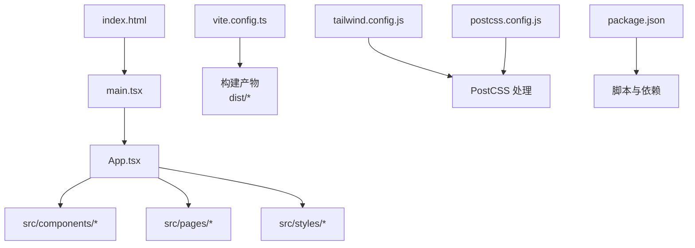
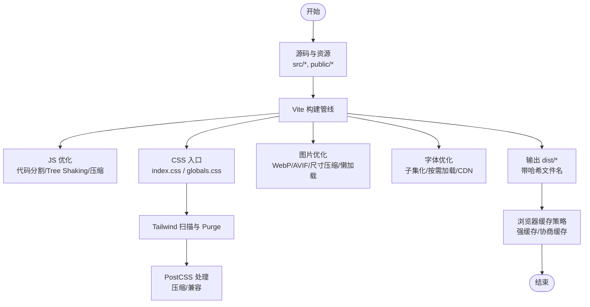
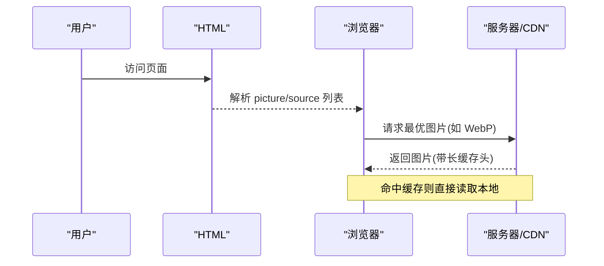
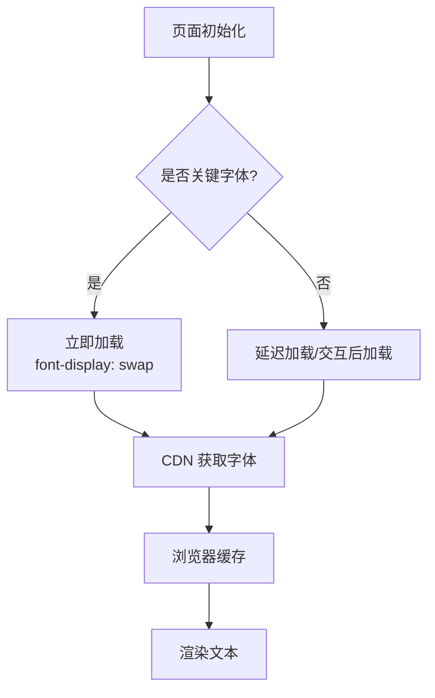
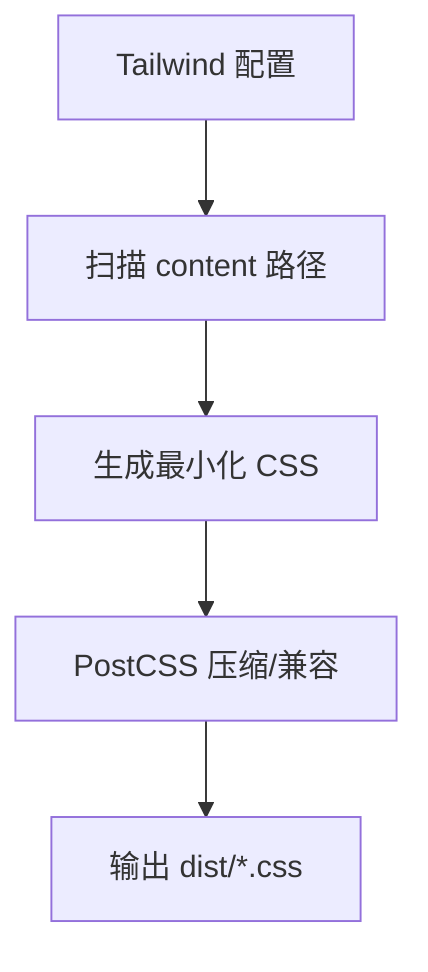
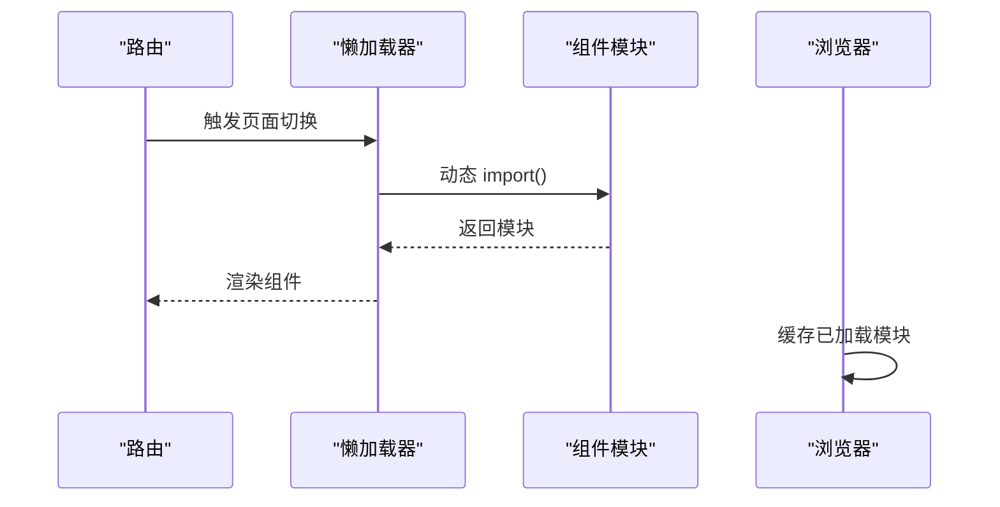
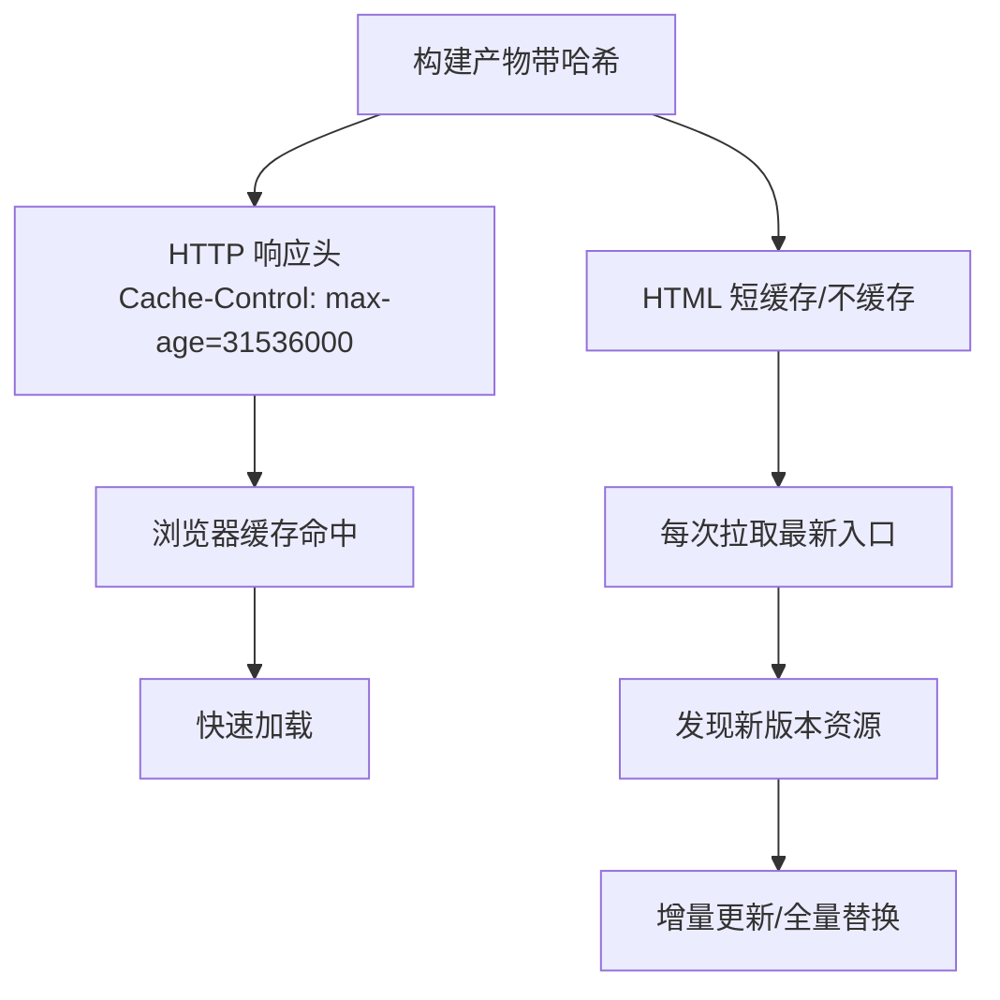
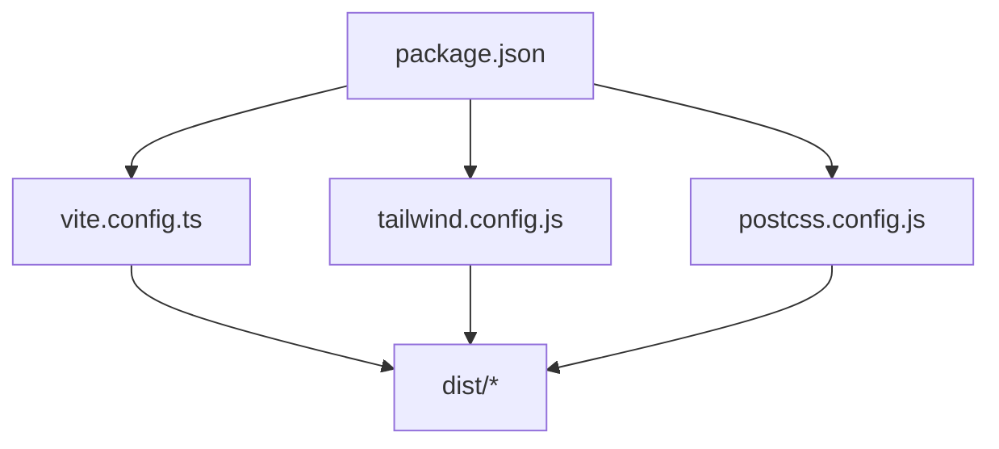

# 静态资源优化

<cite>
**本文引用的文件**   
- [vite.config.ts](file://web/vite.config.ts)
- [tailwind.config.js](file://web/tailwind.config.js)
- [postcss.config.js](file://web/postcss.config.js)
- [package.json](file://web/package.json)
- [index.html](file://web/index.html)
- [App.tsx](file://web/src/App.tsx)
- [main.tsx](file://web/src/main.tsx)
- [globals.css](file://web/src/styles/globals.css)
- [index.css](file://web/src/index.css)
</cite>

## 目录
1. [简介](#简介)
2. [项目结构](#项目结构)
3. [核心组件](#核心组件)
4. [架构总览](#架构总览)
5. [详细组件分析](#详细组件分析)
6. [依赖分析](#依赖分析)
7. [性能考虑](#性能考虑)
8. [故障排查指南](#故障排查指南)
9. [结论](#结论)
10. [附录](#附录)

## 简介
本指南面向 pj3 项目的静态资源优化，聚焦图片、字体、CSS 与 JavaScript 的构建期与运行期优化策略，并结合 Vite + Tailwind CSS 的工程实践给出可落地的方案。内容涵盖：
- 图片资源的格式选择、尺寸压缩、懒加载与 WebP/AVIF 支持
- 字体文件的子集化、按需加载与 CDN 加速
- CSS 的 Tree Shaking、样式合并与压缩
- JavaScript 的代码分割、按需加载与第三方库优化
- 缓存策略与版本管理，确保更新高效且兼容

## 项目结构
本项目采用 Vite 作为前端构建工具，Tailwind CSS 提供原子化样式能力，PostCSS 负责样式处理链。关键配置文件位于 web 目录下，源码位于 web/src，入口为 index.html 与 main.tsx。

图表来源
- [index.html:1-50](file://web/index.html#L1-L50)
- [main.tsx:1-50](file://web/src/main.tsx#L1-L50)
- [App.tsx:1-50](file://web/src/App.tsx#L1-L50)
- [vite.config.ts:1-120](file://web/vite.config.ts#L1-L120)
- [tailwind.config.js:1-120](file://web/tailwind.config.js#L1-L120)
- [postcss.config.js:1-60](file://web/postcss.config.js#L1-L60)
- [package.json:1-120](file://web/package.json#L1-L120)

章节来源
- [index.html:1-50](file://web/index.html#L1-L50)
- [main.tsx:1-50](file://web/src/main.tsx#L1-L50)
- [App.tsx:1-50](file://web/src/App.tsx#L1-L50)
- [vite.config.ts:1-120](file://web/vite.config.ts#L1-L120)
- [tailwind.config.js:1-120](file://web/tailwind.config.js#L1-L120)
- [postcss.config.js:1-60](file://web/postcss.config.js#L1-L60)
- [package.json:1-120](file://web/package.json#L1-L120)

## 核心组件
- 构建配置（Vite）：控制打包、插件、输出命名、代理等，是静态资源优化的核心枢纽。
- 样式系统（Tailwind + PostCSS）：通过 Tailwind 扫描与 Purge 实现样式 Tree Shaking，配合 PostCSS 完成压缩与兼容性处理。
- 入口与路由：在页面级进行代码分割与按需加载，减少首屏体积。
- 资源组织：将图片、字体等资源按类型与用途分层管理，便于后续自动化处理与缓存策略落地。

章节来源
- [vite.config.ts:1-120](file://web/vite.config.ts#L1-L120)
- [tailwind.config.js:1-120](file://web/tailwind.config.js#L1-L120)
- [postcss.config.js:1-60](file://web/postcss.config.js#L1-L60)
- [main.tsx:1-50](file://web/src/main.tsx#L1-L50)
- [App.tsx:1-50](file://web/src/App.tsx#L1-L50)

## 架构总览
下图展示了从源码到构建产物的静态资源优化链路，包括图片、字体、CSS 与 JS 的处理流程。

图表来源
- [vite.config.ts:1-120](file://web/vite.config.ts#L1-L120)
- [tailwind.config.js:1-120](file://web/tailwind.config.js#L1-L120)
- [postcss.config.js:1-60](file://web/postcss.config.js#L1-L60)
- [index.css:1-50](file://web/src/index.css#L1-L50)
- [globals.css:1-50](file://web/src/styles/globals.css#L1-L50)

## 详细组件分析

### 图片资源优化
目标：降低传输体积、提升渲染性能、兼顾兼容性。

- 格式选择
  - 优先使用现代格式：WebP、AVIF；对旧浏览器回退到 JPEG/PNG/SVG。
  - 图标与矢量图形优先 SVG，避免位图缩放失真。
- 尺寸压缩
  - 根据展示容器生成多分辨率版本，结合 srcset/picture 标签实现响应式加载。
  - 使用构建期工具进行有损/无损压缩，平衡质量与体积。
- 懒加载
  - 使用原生 loading="lazy" 或 IntersectionObserver 实现滚动可见时再加载。
  - 对首屏关键图片禁用懒加载，非首屏图片启用懒加载。
- WebP/AVIF 支持
  - 通过 <picture> 元素声明多种格式，浏览器自动选择最优格式。
  - 在构建阶段自动生成 WebP/AVIF 变体并注入 HTML。
- 缓存与版本
  - 图片文件名带内容哈希，变更即换名，利于长期强缓存。
  - 大图建议走 CDN，开启 gzip/br 压缩与 HTTP/2 多路复用。

图表来源
- [index.html:1-50](file://web/index.html#L1-L50)
- [vite.config.ts:1-120](file://web/vite.config.ts#L1-L120)

章节来源
- [index.html:1-50](file://web/index.html#L1-L50)
- [vite.config.ts:1-120](file://web/vite.config.ts#L1-L120)

### 字体文件优化
目标：减少首屏阻塞、降低带宽占用、提升可读性与一致性。

- 字体子集化
  - 仅包含页面实际使用的字符集，显著减小字体体积。
  - 针对中文字体尤为重要，可按页面语言动态生成子集。
- 按需加载
  - 使用 font-display: swap 避免文本不可见。
  - 将非关键字体延迟加载或在交互后加载。
- CDN 加速
  - 将字体部署至 CDN，利用就近节点与持久连接。
  - 开启跨域资源共享（CORS），允许跨域加载。
- 缓存策略
  - 字体文件名带哈希，设置长期缓存；必要时使用预加载提示。

图表来源
- [vite.config.ts:1-120](file://web/vite.config.ts#L1-L120)
- [index.css:1-50](file://web/src/index.css#L1-L50)

章节来源
- [vite.config.ts:1-120](file://web/vite.config.ts#L1-L120)
- [index.css:1-50](file://web/src/index.css#L1-L50)

### CSS 资源优化（Tailwind + PostCSS）
目标：最小化样式体积、消除未使用样式、提升渲染效率。

- Tailwind Tree Shaking
  - 基于类名扫描与 Purge，剔除未使用的样式规则。
  - 合理配置 content 路径，确保覆盖所有模板与组件。
- 样式合并与压缩
  - 通过 PostCSS 合并重复规则，压缩空白与注释。
  - 启用 autoprefixer 保证跨浏览器兼容。
- 按需引入与模块化
  - 将全局样式与页面样式分离，避免不必要的样式进入首屏。
  - 使用 CSS Modules 或作用域样式减少冲突与冗余。
- 构建产物
  - 输出带哈希的 CSS 文件，配合强缓存策略。

图表来源
- [tailwind.config.js:1-120](file://web/tailwind.config.js#L1-L120)
- [postcss.config.js:1-60](file://web/postcss.config.js#L1-L60)
- [index.css:1-50](file://web/src/index.css#L1-L50)
- [globals.css:1-50](file://web/src/styles/globals.css#L1-L50)

章节来源
- [tailwind.config.js:1-120](file://web/tailwind.config.js#L1-L120)
- [postcss.config.js:1-60](file://web/postcss.config.js#L1-L60)
- [index.css:1-50](file://web/src/index.css#L1-L50)
- [globals.css:1-50](file://web/src/styles/globals.css#L1-L50)

### JavaScript 资源优化
目标：减少首屏体积、提升加载与执行效率、增强可维护性。

- 代码分割
  - 基于路由或功能模块进行动态导入，拆分独立 chunk。
  - 将大型第三方库拆分为 vendor 包，提高缓存命中率。
- 按需加载
  - 对重型组件与图表库使用懒加载，仅在需要时加载。
  - 使用 Suspense 或占位骨架屏提升用户体验。
- 第三方库优化
  - 仅引入需要的 API，避免全量引入。
  - 使用 tree-shaking 友好的库与版本，减少死代码。
- 构建与缓存
  - 输出带哈希的文件名，启用长期缓存。
  - 合理使用预取与预加载，平衡速度与资源竞争。

图表来源
- [App.tsx:1-50](file://web/src/App.tsx#L1-L50)
- [main.tsx:1-50](file://web/src/main.tsx#L1-L50)
- [vite.config.ts:1-120](file://web/vite.config.ts#L1-L120)

章节来源
- [App.tsx:1-50](file://web/src/App.tsx#L1-L50)
- [main.tsx:1-50](file://web/src/main.tsx#L1-L50)
- [vite.config.ts:1-120](file://web/vite.config.ts#L1-L120)

### 缓存策略与版本管理
目标：在保证一致性的前提下最大化缓存命中率，缩短冷启动时间。

- 文件名哈希
  - 构建产物文件名包含内容哈希，变更即换名，避免缓存污染。
- 缓存头设置
  - 静态资源（js/css/img/font）设置长期缓存（如一年）。
  - HTML 文件设置短缓存或无缓存，确保入口及时更新。
- 版本管理与灰度
  - 通过版本号或特性开关控制资源回滚与灰度发布。
  - 使用 CDN 的缓存刷新接口进行精准失效。
- 兼容性策略
  - 对不支持新格式的浏览器提供降级方案。
  - 渐进增强：先加载基础资源，再按需加载高级特性。

图表来源
- [vite.config.ts:1-120](file://web/vite.config.ts#L1-L120)
- [index.html:1-50](file://web/index.html#L1-L50)

章节来源
- [vite.config.ts:1-120](file://web/vite.config.ts#L1-L120)
- [index.html:1-50](file://web/index.html#L1-L50)

## 依赖分析
- 构建与样式依赖
  - Vite 作为核心构建工具，协调 JS/CSS/资源处理。
  - Tailwind CSS 与 PostCSS 协同完成样式扫描、去重与压缩。
- 脚本与命令
  - package.json 定义开发、构建与预览脚本，统一工程行为。
- 外部服务
  - 建议将静态资源托管至 CDN，提升全球访问速度。

图表来源
- [package.json:1-120](file://web/package.json#L1-L120)
- [vite.config.ts:1-120](file://web/vite.config.ts#L1-L120)
- [tailwind.config.js:1-120](file://web/tailwind.config.js#L1-L120)
- [postcss.config.js:1-60](file://web/postcss.config.js#L1-L60)

章节来源
- [package.json:1-120](file://web/package.json#L1-L120)
- [vite.config.ts:1-120](file://web/vite.config.ts#L1-L120)
- [tailwind.config.js:1-120](file://web/tailwind.config.js#L1-L120)
- [postcss.config.js:1-60](file://web/postcss.config.js#L1-L60)

## 性能考虑
- 首屏优化
  - 关键 CSS 内联，非关键 CSS 异步加载。
  - 关键 JS 同步加载，非关键 JS 延迟或异步加载。
- 网络优化
  - 启用 HTTP/2 与多路复用，减少连接开销。
  - 使用 Brotli/Gzip 压缩，权衡 CPU 与带宽。
- 渲染优化
  - 避免布局抖动，使用 will-change 与合成层优化。
  - 图片与视频使用合适的编码与码率，避免过度压缩导致画质劣化。
- 监控与分析
  - 使用 Lighthouse/WebPageTest 定期评估性能指标。
  - 在生产环境接入性能埋点，持续跟踪优化效果。

[本节为通用指导，不涉及具体文件分析]

## 故障排查指南
- 样式未生效
  - 检查 Tailwind content 路径是否覆盖所有模板与组件。
  - 确认 PostCSS 插件顺序与配置是否正确。
- 图片未显示或体积过大
  - 检查 picture/source 格式回退逻辑与 MIME 类型。
  - 验证构建期压缩参数与多分辨率生成是否成功。
- 字体加载缓慢
  - 检查 font-display 与预加载策略。
  - 确认 CORS 与 CDN 缓存头配置。
- JS 未分割或体积异常
  - 检查动态导入位置与第三方库引入方式。
  - 确认 tree-shaking 与分包策略是否生效。

章节来源
- [tailwind.config.js:1-120](file://web/tailwind.config.js#L1-L120)
- [postcss.config.js:1-60](file://web/postcss.config.js#L1-L60)
- [index.html:1-50](file://web/index.html#L1-L50)
- [vite.config.ts:1-120](file://web/vite.config.ts#L1-L120)

## 结论
通过系统化的图片、字体、CSS 与 JS 优化策略，结合合理的缓存与版本管理，pj3 项目可在保证兼容性的前提下显著提升加载与渲染性能。建议在迭代过程中持续监控关键指标，逐步完善优化闭环。

[本节为总结性内容，不涉及具体文件分析]

## 附录
- 参考清单
  - 构建配置：vite.config.ts
  - 样式配置：tailwind.config.js、postcss.config.js
  - 入口与全局样式：index.html、index.css、globals.css
  - 应用入口与根组件：main.tsx、App.tsx
  - 脚本与依赖：package.json

章节来源
- [vite.config.ts:1-120](file://web/vite.config.ts#L1-L120)
- [tailwind.config.js:1-120](file://web/tailwind.config.js#L1-L120)
- [postcss.config.js:1-60](file://web/postcss.config.js#L1-L60)
- [index.html:1-50](file://web/index.html#L1-L50)
- [index.css:1-50](file://web/src/index.css#L1-L50)
- [globals.css:1-50](file://web/src/styles/globals.css#L1-L50)
- [main.tsx:1-50](file://web/src/main.tsx#L1-L50)
- [App.tsx:1-50](file://web/src/App.tsx#L1-L50)
- [package.json:1-120](file://web/package.json#L1-L120)