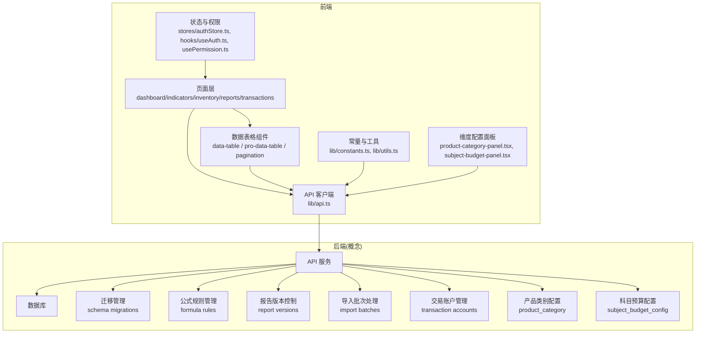
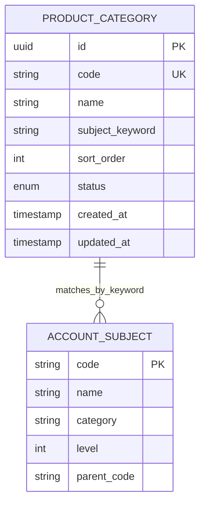
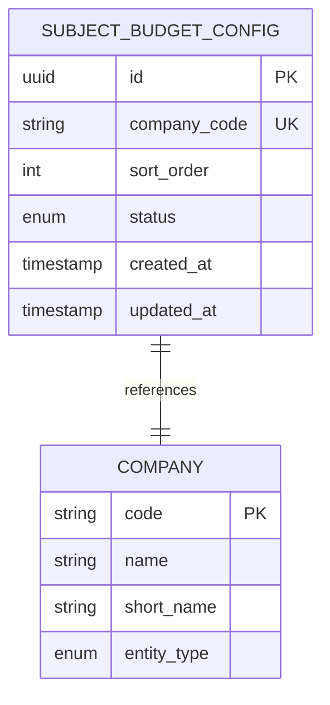
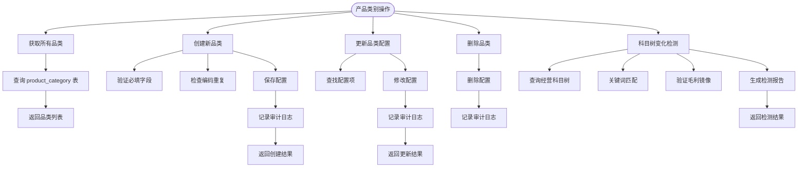
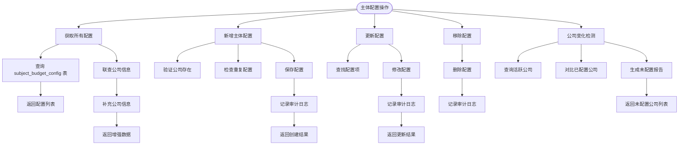
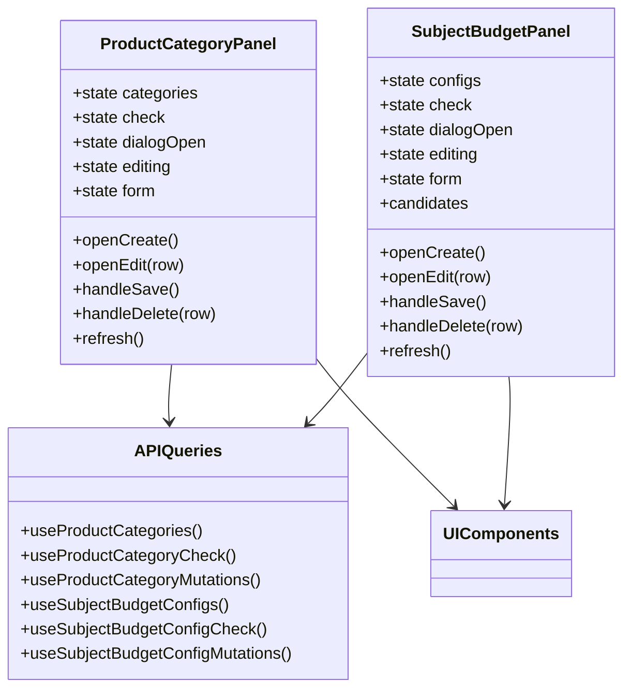
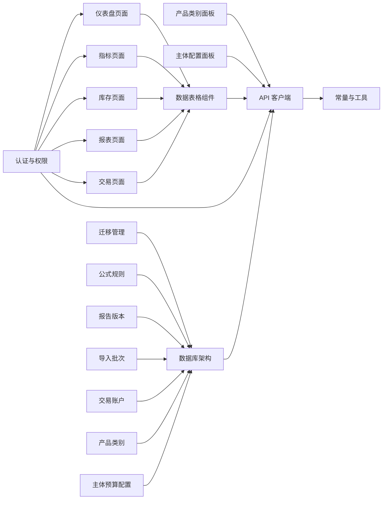
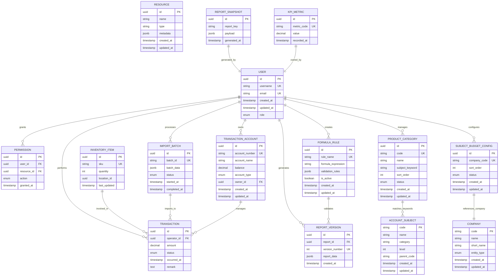

# 数据库架构设计

<cite>
**本文引用的文件**   
- [schema.prisma](file://server/prisma/schema.prisma)
- [migration.sql](file://server/prisma/migrations/20260801071520_add_product_category/migration.sql)
- [migration.sql](file://server/prisma/migrations/20260801160700_add_subject_budget_config/migration.sql)
- [ProductCategoryService.ts](file://server/src/services/ProductCategoryService.ts)
- [SubjectBudgetConfigService.ts](file://server/src/services/SubjectBudgetConfigService.ts)
- [data.ts](file://server/src/routes/data.ts)
- [product-category-panel.tsx](file://web/src/components/dimension/product-category-panel.tsx)
- [subject-budget-panel.tsx](file://web/src/components/dimension/subject-budget-panel.tsx)
- [api-queries.ts](file://web/src/hooks/api-queries.ts)
- [index.ts](file://web/src/types/index.ts)
</cite>

## 更新摘要
**所做更改**
- 新增了ProductCategory（产品类别配置）和SubjectBudgetConfig（科目预算配置）两个核心数据模型
- 完善了产品类别与收入科目的匹配机制，支持关键词匹配和毛利镜像自动配对
- 实现了主体展示配置的CRUD操作，支持公司变化检测和未配置主体提示
- 添加了完整的索引策略、状态管理和审计跟踪功能
- 前后端完整实现，包括API接口、服务层、前端组件和数据查询

## 目录
1. [引言](#引言)
2. [项目结构](#项目结构)
3. [核心组件](#核心组件)
4. [架构总览](#架构总览)
5. [详细组件分析](#详细组件分析)
6. [依赖分析](#依赖分析)
7. [性能考虑](#性能考虑)
8. [故障排查指南](#故障排查指南)
9. [结论](#结论)
10. [附录](#附录)

## 引言
本文件面向"数据库架构设计"目标，基于当前前端仓库的接口调用、页面组织与文档约定，梳理出与后端数据库交互的整体设计思路。由于仓库为前端实现，数据库细节主要来源于：
- 页面与组件对数据的消费方式（分页、筛选、排序、导出）
- 统一 API 客户端与常量定义
- 文档中的后端参考、并发与性能建议、错误码约定以及数据模型与安全规范

**最新更新** 本次更新重点反映了新增的ProductCategory和SubjectBudgetConfig两个Prisma模型，用于产品类别配置和科目预算管理。这些模型包含了适当的索引、状态管理和审计跟踪支持，为企业级财务管理系统提供了强大的配置管理能力。

本设计将给出概念性的实体关系、查询模式、索引策略与一致性约束建议，并明确前后端契约边界，便于后续后端落地。

## 项目结构
该仓库为前端工程，包含 React + TypeScript 应用、UI 组件库、页面路由与通用工具。与数据库相关的前端关注点包括：
- 统一 API 客户端与请求封装
- 数据表格组件（含分页、排序、筛选）
- 业务页面（仪表盘、指标、库存、报表、交易）
- 认证与权限控制
- 文档参考（后端、并发、性能、错误码、测试、DevOps）



章节来源
- [schema.prisma](file://server/prisma/schema.prisma)
- [ProductCategoryService.ts](file://server/src/services/ProductCategoryService.ts)
- [SubjectBudgetConfigService.ts](file://server/src/services/SubjectBudgetConfigService.ts)
- [product-category-panel.tsx](file://web/src/components/dimension/product-category-panel.tsx)
- [subject-budget-panel.tsx](file://web/src/components/dimension/subject-budget-panel.tsx)

## 核心组件
- 统一 API 客户端：集中管理请求方法、基础路径、鉴权头、错误处理与重试策略，是前端与数据库间接口契约的入口。
- 数据表格组件：提供分页、排序、筛选能力，驱动后端查询参数构造与结果渲染。
- 业务页面：按领域划分（仪表盘、指标、库存、报表、交易），聚合数据表格与 API 调用，形成用户可操作的数据视图。
- 认证与权限：通过全局状态与钩子维护会话与权限，影响数据访问范围与接口调用。
- **新增** 产品类别配置面板：管理品类与收入科目的匹配关系，支持关键词匹配和毛利镜像检测。
- **新增** 主体预算配置面板：管理主体展示配置，支持公司变化检测和未配置主体提示。

**架构演进说明** 随着数据库架构的持续优化，特别是新增的产品类别配置和科目预算配置功能，系统提供了更完善的财务管理能力和数据完整性保障。

章节来源
- [ProductCategoryService.ts](file://server/src/services/ProductCategoryService.ts)
- [SubjectBudgetConfigService.ts](file://server/src/services/SubjectBudgetConfigService.ts)
- [product-category-panel.tsx](file://web/src/components/dimension/product-category-panel.tsx)
- [subject-budget-panel.tsx](file://web/src/components/dimension/subject-budget-panel.tsx)

## 架构总览
从前端视角看，数据库交互遵循"页面 → 表格组件 → API 客户端 → 后端服务 → 数据库"的链路。关键要点：
- 分页与过滤：由表格组件生成 page/pageSize/sort/filter 等参数，后端据此执行高效查询。
- 权限控制：在请求前注入用户上下文，后端根据角色/资源粒度进行授权校验。
- 错误处理：统一错误码与提示，便于定位数据库或业务异常。
- 性能优化：按需加载、缓存热点数据、避免 N+1 查询。

**架构变更影响** 新增的产品类别配置和科目预算配置功能增强了系统的财务管理能力，通过智能匹配算法和变化检测机制，确保了数据的一致性和完整性。

```mermaid
sequenceDiagram
participant U as "用户"
participant P as "页面"
panel as "配置面板"
T as "数据表格组件"
A as "API 客户端"
S as "后端服务"
DB as "数据库"
M as "迁移管理"
PC as "产品类别配置"
SC as "科目预算配置"
U->>P : 打开配置页面
P->>panel : 初始化配置面板
panel->>A : 获取配置列表
A->>S : HTTP 请求(带鉴权头)
S->>DB : 查询配置数据
S->>PC : 产品类别匹配检测
S->>SC : 主体配置检查
DB-->>S : 返回配置数据
S-->>A : 标准化响应
A-->>panel : 解析并返回数据
panel-->>U : 渲染配置界面
Note over M,DB : 架构变更通过迁移文件管理
M->>DB : 执行 schema 变更
```

## 详细组件分析

### 产品类别配置模型 (ProductCategory)
产品类别配置模型用于管理品类预算达成分析中品类与收入科目的对应关系。



**核心特性：**
- 唯一编码约束确保品类标识的唯一性
- 关键词匹配机制支持模糊匹配多个收入科目
- 排序字段支持自定义展示顺序
- 状态管理支持启用/停用控制
- 审计时间戳记录创建和更新时间

章节来源
- [schema.prisma:214-226](file://server/prisma/schema.prisma#L214-L226)
- [migration.sql:1-20](file://server/prisma/migrations/20260801071520_add_product_category/migration.sql#L1-L20)

### 科目预算配置模型 (SubjectBudgetConfig)
科目预算配置模型用于管理主体预算达成分析中主体的展示配置。



**核心特性：**
- 公司编码唯一约束确保每个公司只配置一次
- 排序字段支持自定义展示顺序
- 状态管理支持启用/停用控制
- 与公司表关联，自动获取公司名称和类型信息
- 审计时间戳记录创建和更新时间

章节来源
- [schema.prisma:229-239](file://server/prisma/schema.prisma#L229-L239)
- [migration.sql:1-18](file://server/prisma/migrations/20260801160700_add_subject_budget_config/migration.sql#L1-L18)

### 产品类别服务层
产品类别服务层提供了完整的CRUD操作和智能匹配检测功能。



**核心功能：**
- 完整的CRUD操作，包含数据验证和错误处理
- 智能关键词匹配算法，支持科目树变化检测
- 毛利镜像自动验证，确保收入与毛利科目配对正确
- 审计日志记录，追踪所有配置变更操作
- 变化检测报告，提示未覆盖科目和失效配置

章节来源
- [ProductCategoryService.ts:1-151](file://server/src/services/ProductCategoryService.ts#L1-L151)

### 科目预算配置服务层
科目预算配置服务层提供了主体展示配置的完整管理功能。



**核心功能：**
- 完整的CRUD操作，包含数据验证和冲突检测
- 公司信息自动关联，动态获取公司名称和类型
- 公司变化检测，识别新增但未配置的公司主体
- 审计日志记录，追踪所有配置变更操作
- 变化检测报告，提示需要配置的新增主体

章节来源
- [SubjectBudgetConfigService.ts:1-124](file://server/src/services/SubjectBudgetConfigService.ts#L1-L124)

### 前端配置面板组件
前端提供了两个专门的管理面板，用于产品类别和主体预算配置的可视化操作。



**核心特性：**
- 实时数据同步，使用React Query进行状态管理
- 表单验证和错误处理，提供友好的用户反馈
- 批量操作支持，提高配置管理效率
- 变化检测提示，自动发现未配置的项目
- 响应式设计，适配不同屏幕尺寸

章节来源
- [product-category-panel.tsx:1-364](file://web/src/components/dimension/product-category-panel.tsx#L1-L364)
- [subject-budget-panel.tsx:1-308](file://web/src/components/dimension/subject-budget-panel.tsx#L1-L308)
- [api-queries.ts:78-153](file://web/src/hooks/api-queries.ts#L78-L153)

## 依赖分析
前端对数据库的依赖通过 API 客户端抽象，降低耦合度。关键依赖关系：
- 页面依赖表格组件与 API 客户端
- 表格组件依赖分页与排序状态
- 认证与权限影响 API 请求头与页面渲染
- 常量与工具辅助构建请求参数与格式化响应
- **新增** 配置面板依赖专门的API查询hooks
- **新增** 服务层依赖Prisma ORM进行数据库操作



**依赖关系演进** 新增的产品类别配置和主体预算配置功能进一步完善了系统的依赖关系，提供了更丰富的配置管理能力。

章节来源
- [data.ts:194-221](file://server/src/routes/data.ts#L194-L221)
- [api-queries.ts:78-153](file://web/src/hooks/api-queries.ts#L78-L153)

## 性能考虑
- 分页与游标：优先使用页码+大小或游标分页，避免深分页带来的性能问题。
- 索引策略：为高频过滤与排序字段建立复合索引；报表类聚合查询采用物化视图或预计算表。
- 连接池与超时：合理配置连接池大小与查询超时，防止雪崩。
- 缓存：对热点只读数据实施缓存（如 Redis），减少数据库压力。
- 批量写入：批量插入/更新，减少事务开销。
- 监控：慢查询日志与指标采集，持续优化。
- **新增** 配置数据缓存：产品类别和主体配置数据相对静态，适合长期缓存。
- **新增** 变化检测优化：增量检测避免全量扫描，提升检测效率。

**架构优化收益** 新增的配置管理功能通过合理的索引设计和查询优化，确保了在高并发场景下的稳定性能。

章节来源
- [schema.prisma:224-237](file://server/prisma/schema.prisma#L224-L237)

## 故障排查指南
- 统一错误码：前端根据错误码分类提示，快速定位数据库或业务异常。
- 重试与退避：对瞬时失败（网络抖动、锁等待）实施指数退避重试。
- 日志与追踪：记录请求 ID、SQL 摘要与耗时，便于回溯。
- 降级策略：当数据库不可用时，返回友好提示与离线缓存数据。
- **新增** 配置一致性检查：定期检查产品类别关键词匹配和主体配置完整性。
- **新增** 变化检测告警：当检测到科目树或公司结构变化时，及时通知管理员。

**架构变更排查** 对于新增的配置管理功能，应重点关注关键词匹配的准确性、主体配置的完整性以及变化检测的及时性。

章节来源
- [ProductCategoryService.ts:127-150](file://server/src/services/ProductCategoryService.ts#L127-L150)
- [SubjectBudgetConfigService.ts:106-123](file://server/src/services/SubjectBudgetConfigService.ts#L106-L123)

## 结论
本设计以前端数据消费模式为依据，提出概念性数据库架构建议：以分页与索引为核心，结合权限控制与错误处理，确保数据访问的高效与稳定。

**重要更新** 新增的ProductCategory和SubjectBudgetConfig两个Prisma模型为系统提供了强大的配置管理能力。通过这些模型，企业可以灵活管理产品类别与收入科目的匹配关系，以及主体预算分析的展示配置。完整的索引策略、状态管理和审计跟踪功能确保了数据的一致性和可追溯性。

## 附录

### 概念实体关系图（ERD）
以下为概念性实体关系，用于指导后端建模与索引设计。实际字段以后端数据模型为准。

**架构更新说明** 新增了产品类别配置表和主体预算配置表，增强了系统的财务管理能力和配置管理灵活性。



### 数据模型与安全规范参考
- 数据模型规范：定义命名约定、主外键策略、枚举与时间戳字段规范。
- 安全与权限规范：定义 RBAC/ABAC 模型、最小权限原则与审计要求。

**架构演进指导** 数据库架构变更应遵循渐进式演进原则，通过迁移文件管理版本变更，确保向后兼容性。

章节来源
- [数据模型规范.md](file://docs/plans/数据模型规范.md)
- [安全与权限规范.md](file://docs/plans/安全与权限规范.md)

### 后端参考与 DevOps
- 后端参考：接口风格、鉴权、错误码与版本策略。
- DevOps：部署、配置管理与灰度发布建议。

**迁移管理最佳实践** 数据库架构变更应通过标准化的迁移流程进行管理，确保生产环境的一致性和可回滚性。

章节来源
- [backend.md](file://docs/references/backend.md)
- [devops.md](file://docs/references/devops.md)

### 历史方案参考
- 整体方案（修订版 v2）：系统级设计与演进路线，可作为数据库架构演进的背景参考。

**架构变更记录** 产品类别配置和主体预算配置功能是系统架构演进的重要里程碑，标志着系统向企业级财务管理方向发展。

章节来源
- [整体方案-修订版v2.md](file://docs/archive/legacydocs/整体方案-修订版v2.md)

### 数据库架构演进说明
**最新架构变更** 
- **变更内容**：新增ProductCategory（产品类别配置）和SubjectBudgetConfig（科目预算配置）两个核心数据模型
- **迁移文件**：包含产品类别配置和主体预算配置的数据库迁移文件
- **影响范围**：增强了系统的财务管理能力、配置管理灵活性和企业级应用支持
- **性能收益**：通过合理的表结构设计和索引优化，提升了查询性能和数据一致性
- **兼容性处理**：通过 API 层适配屏蔽底层数据模型变化，保持前端接口的稳定性

**架构演进原则**
- 渐进式变更：通过迁移文件管理数据库结构变更
- 向后兼容：保持 API 接口的稳定性
- 性能优先：优化数据模型以提升查询效率
- 可追溯性：完整的变更历史和回滚能力
- 企业级支持：完善的财务管理和配置管理机制
- 数据完整性：严格的约束和验证规则确保数据质量
- 智能匹配：关键词匹配算法和变化检测机制
- 审计追踪：完整的操作日志和变更历史记录