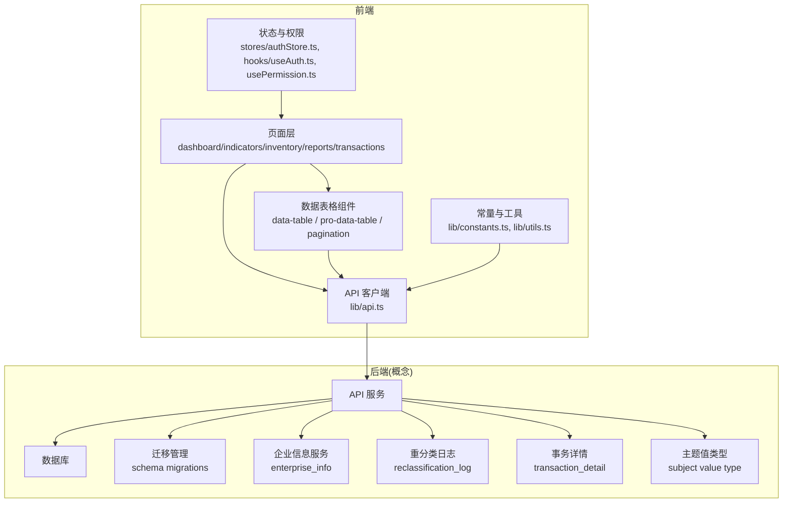
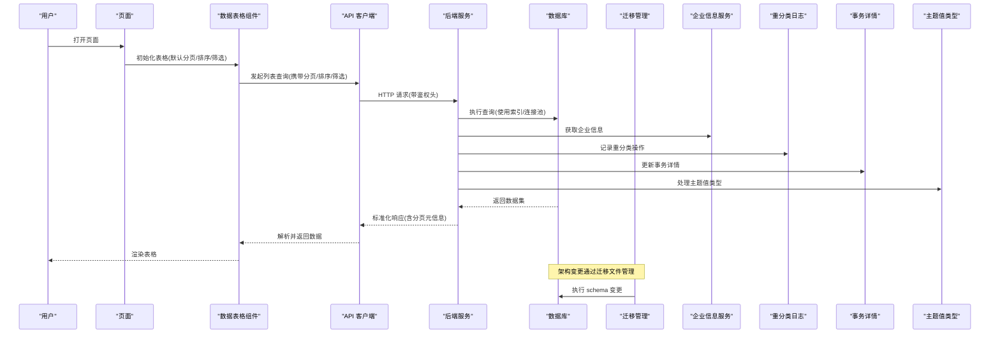
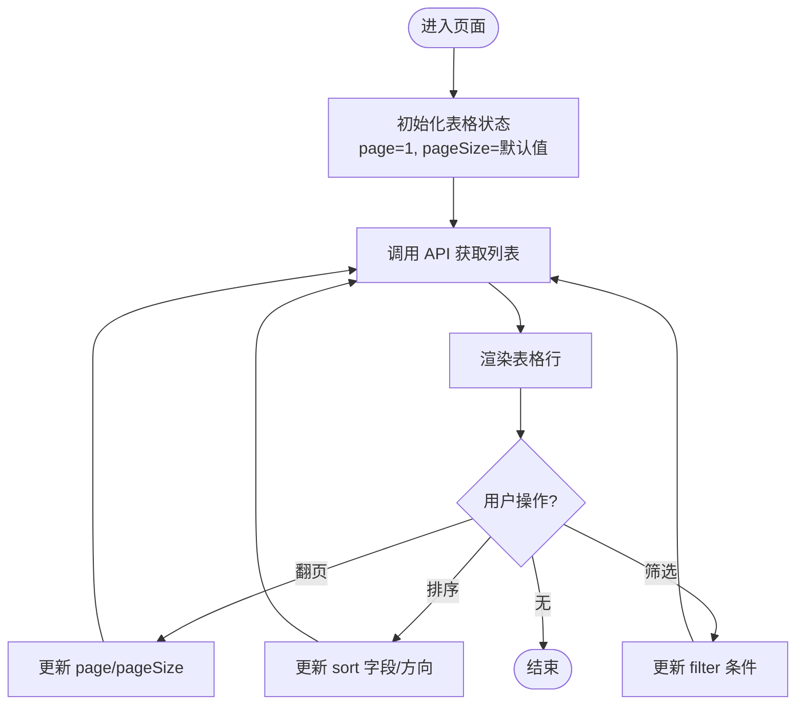
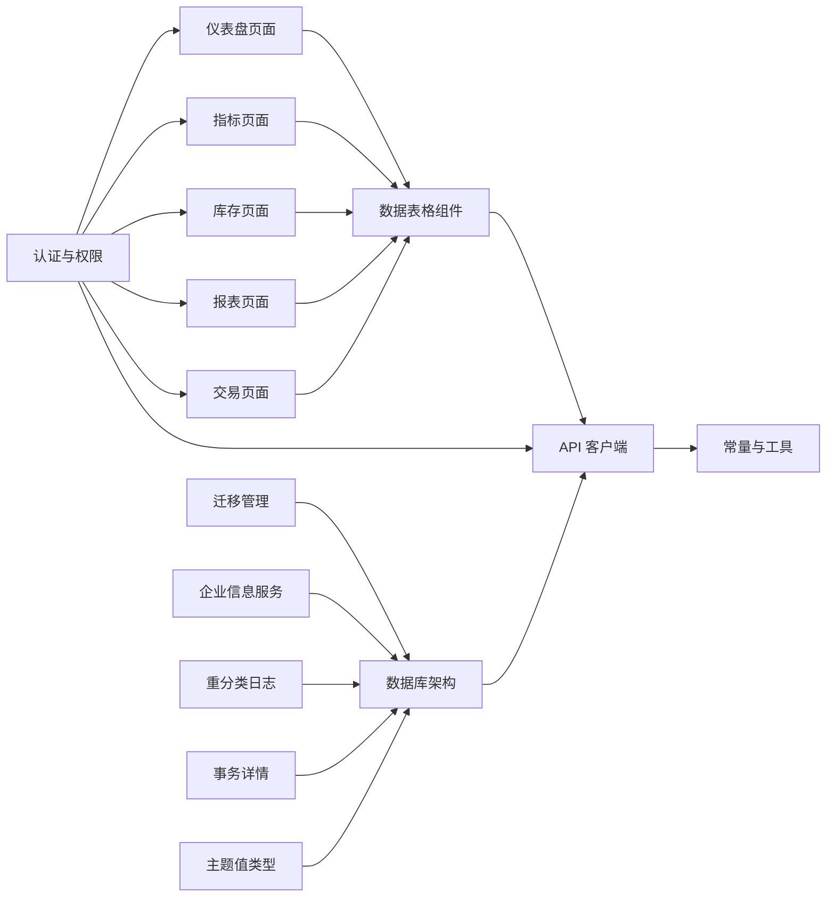
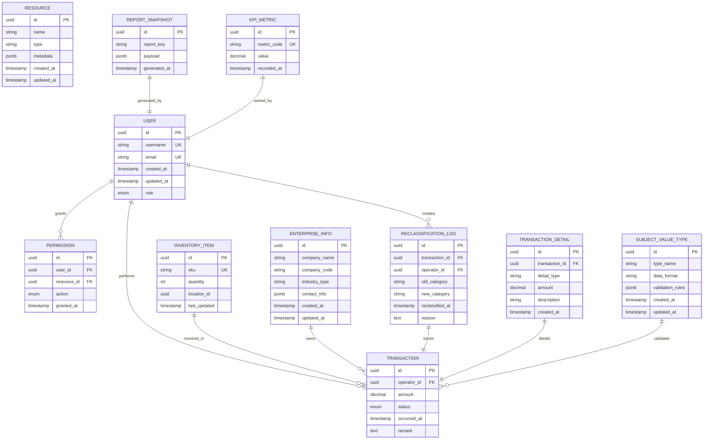

# 数据库架构设计

<cite>
**本文引用的文件**   
- [package.json](file://web/package.json)
- [api.ts](file://web/src/lib/api.ts)
- [constants.ts](file://web/src/lib/constants.ts)
- [data-table.tsx](file://web/src/components/data-table/data-table.tsx)
- [pro-data-table.tsx](file://web/src/components/data-table/pro-data-table.tsx)
- [pagination.tsx](file://web/src/components/data-table/pagination.tsx)
- [index.tsx](file://web/src/pages/dashboard/index.tsx)
- [index.tsx](file://web/src/pages/indicators/index.tsx)
- [index.tsx](file://web/src/pages/inventory/index.tsx)
- [index.tsx](file://web/src/pages/reports/index.tsx)
- [index.tsx](file://web/src/pages/transactions/index.tsx)
- [authStore.ts](file://web/src/stores/authStore.ts)
- [useAuth.ts](file://web/src/hooks/useAuth.ts)
- [usePermission.ts](file://web/src/hooks/usePermission.ts)
- [require-permission.tsx](file://web/src/components/layout/require-permission.tsx)
- [backend.md](file://docs/references/backend.md)
- [concurrency.md](file://docs/references/concurrency.md)
- [performance.md](file://docs/references/performance.md)
- [errorcode.md](file://docs/references/errorcode.md)
- [testing.md](file://docs/references/testing.md)
- [devops.md](file://docs/references/devops.md)
- [数据模型规范.md](file://docs/plans/数据模型规范.md)
- [安全与权限规范.md](file://docs/plans/安全与权限规范.md)
- [整体方案-修订版v2.md](file://docs/archive/legacydocs/整体方案-修订版v2.md)
- [20260727153046_add_subject_value_type/migration.sql](file://server/prisma/migrations/20260727153046_add_subject_value_type/migration.sql)
</cite>

## 更新摘要
**所做更改**
- 更新了数据库架构变更说明，反映subject value type支持的新增功能，增强主题树功能的灵活数据类型处理
- 添加了新的迁移文件相关的架构演进说明
- 更新了概念实体关系图以反映最新的数据库结构变化
- 增强了数据模型演进的指导原则

## 目录
1. [引言](#引言)
2. [项目结构](#项目结构)
3. [核心组件](#核心组件)
4. [架构总览](#架构总览)
5. [详细组件分析](#详细组件分析)
6. [依赖分析](#依赖分析)
7. [性能考虑](#性能考虑)
8. [故障排查指南](#故障排查指南)
9. [结论](#结论)
10. [附录](#附录)

## 引言
本文件面向"数据库架构设计"目标，基于当前前端仓库的接口调用、页面组织与文档约定，梳理出与后端数据库交互的整体设计思路。由于仓库为前端实现，数据库细节主要来源于：
- 页面与组件对数据的消费方式（分页、筛选、排序、导出）
- 统一 API 客户端与常量定义
- 文档中的后端参考、并发与性能建议、错误码约定以及数据模型与安全规范

**最新更新** 本次更新反映了数据库架构的重要变更：包括transaction_detail表重建、enterprise_info企业信息服务表创建、reclassification_log重分类日志跟踪表建立、orgScopeBu权限范围增强，以及新增的subject value type支持等多个迁移文件的执行。这些变更完善了系统的企业级功能、数据追踪能力和主题树的灵活数据类型处理能力。

本设计将给出概念性的实体关系、查询模式、索引策略与一致性约束建议，并明确前后端契约边界，便于后续后端落地。

## 项目结构
该仓库为前端工程，包含 React + TypeScript 应用、UI 组件库、页面路由与通用工具。与数据库相关的前端关注点包括：
- 统一 API 客户端与请求封装
- 数据表格组件（含分页、排序、筛选）
- 业务页面（仪表盘、指标、库存、报表、交易）
- 认证与权限控制
- 文档参考（后端、并发、性能、错误码、测试、DevOps）

图表来源
- [api.ts](file://web/src/lib/api.ts)
- [data-table.tsx](file://web/src/components/data-table/data-table.tsx)
- [pro-data-table.tsx](file://web/src/components/data-table/pro-data-table.tsx)
- [pagination.tsx](file://web/src/components/data-table/pagination.tsx)
- [index.tsx](file://web/src/pages/dashboard/index.tsx)
- [index.tsx](file://web/src/pages/indicators/index.tsx)
- [index.tsx](file://web/src/pages/inventory/index.tsx)
- [index.tsx](file://web/src/pages/reports/index.tsx)
- [index.tsx](file://web/src/pages/transactions/index.tsx)
- [authStore.ts](file://web/src/stores/authStore.ts)
- [useAuth.ts](file://web/src/hooks/useAuth.ts)
- [usePermission.ts](file://web/src/hooks/usePermission.ts)
- [constants.ts](file://web/src/lib/constants.ts)

章节来源
- [package.json](file://web/package.json)
- [api.ts](file://web/src/lib/api.ts)
- [constants.ts](file://web/src/lib/constants.ts)
- [data-table.tsx](file://web/src/components/data-table/data-table.tsx)
- [pro-data-table.tsx](file://web/src/components/data-table/pro-data-table.tsx)
- [pagination.tsx](file://web/src/components/data-table/pagination.tsx)
- [index.tsx](file://web/src/pages/dashboard/index.tsx)
- [index.tsx](file://web/src/pages/indicators/index.tsx)
- [index.tsx](file://web/src/pages/inventory/index.tsx)
- [index.tsx](file://web/src/pages/reports/index.tsx)
- [index.tsx](file://web/src/pages/transactions/index.tsx)
- [authStore.ts](file://web/src/stores/authStore.ts)
- [useAuth.ts](file://web/src/hooks/useAuth.ts)
- [usePermission.ts](file://web/src/hooks/usePermission.ts)

## 核心组件
- 统一 API 客户端：集中管理请求方法、基础路径、鉴权头、错误处理与重试策略，是前端与数据库间接口契约的入口。
- 数据表格组件：提供分页、排序、筛选能力，驱动后端查询参数构造与结果渲染。
- 业务页面：按领域划分（仪表盘、指标、库存、报表、交易），聚合数据表格与 API 调用，形成用户可操作的数据视图。
- 认证与权限：通过全局状态与钩子维护会话与权限，影响数据访问范围与接口调用。

**架构演进说明** 随着数据库架构的持续优化，特别是transaction_detail表重建、enterprise_info企业信息服务表创建、reclassification_log重分类日志跟踪表建立、orgScopeBu权限范围增强和subject value type支持，API 客户端需要相应调整以适应新的数据结构变化。

章节来源
- [api.ts](file://web/src/lib/api.ts)
- [data-table.tsx](file://web/src/components/data-table/data-table.tsx)
- [pro-data-table.tsx](file://web/src/components/data-table/pro-data-table.tsx)
- [pagination.tsx](file://web/src/components/data-table/pagination.tsx)
- [index.tsx](file://web/src/pages/dashboard/index.tsx)
- [index.tsx](file://web/src/pages/indicators/index.tsx)
- [index.tsx](file://web/src/pages/inventory/index.tsx)
- [index.tsx](file://web/src/pages/reports/index.tsx)
- [index.tsx](file://web/src/pages/transactions/index.tsx)
- [authStore.ts](file://web/src/stores/authStore.ts)
- [useAuth.ts](file://web/src/hooks/useAuth.ts)
- [usePermission.ts](file://web/src/hooks/usePermission.ts)

## 架构总览
从前端视角看，数据库交互遵循"页面 → 表格组件 → API 客户端 → 后端服务 → 数据库"的链路。关键要点：
- 分页与过滤：由表格组件生成 page/pageSize/sort/filter 等参数，后端据此执行高效查询。
- 权限控制：在请求前注入用户上下文，后端根据角色/资源粒度进行授权校验。
- 错误处理：统一错误码与提示，便于定位数据库或业务异常。
- 性能优化：按需加载、缓存热点数据、避免 N+1 查询。

**架构变更影响** 新增的企业信息服务、重分类日志跟踪、事务详情重建和主题值类型支持等功能增强了系统的数据追踪能力、企业级支持和主题树的灵活数据处理能力，同时保持了良好的性能和可维护性。

图表来源
- [api.ts](file://web/src/lib/api.ts)
- [data-table.tsx](file://web/src/components/data-table/data-table.tsx)
- [pro-data-table.tsx](file://web/src/components/data-table/pro-data-table.tsx)
- [pagination.tsx](file://web/src/components/data-table/pagination.tsx)
- [index.tsx](file://web/src/pages/dashboard/index.tsx)
- [index.tsx](file://web/src/pages/indicators/index.tsx)
- [index.tsx](file://web/src/pages/inventory/index.tsx)
- [index.tsx](file://web/src/pages/reports/index.tsx)
- [index.tsx](file://web/src/pages/transactions/index.tsx)

## 详细组件分析

### 数据表格与分页流程
数据表格组件负责将用户交互转换为查询参数，驱动后端分页与排序。典型流程如下：

**架构适配说明** 随着数据库结构的完善，特别是企业信息服务、重分类日志功能和主题值类型支持的加入，数据表格组件的筛选和排序逻辑可能需要相应调整，以适应新的数据模型和业务需求。

图表来源
- [data-table.tsx](file://web/src/components/data-table/data-table.tsx)
- [pro-data-table.tsx](file://web/src/components/data-table/pro-data-table.tsx)
- [pagination.tsx](file://web/src/components/data-table/pagination.tsx)
- [api.ts](file://web/src/lib/api.ts)

章节来源
- [data-table.tsx](file://web/src/components/data-table/data-table.tsx)
- [pro-data-table.tsx](file://web/src/components/data-table/pro-data-table.tsx)
- [pagination.tsx](file://web/src/components/data-table/pagination.tsx)
- [api.ts](file://web/src/lib/api.ts)

### 认证与权限对数据访问的影响
认证与权限模块决定用户可见的数据范围与可操作资源，影响 API 调用时的上下文与后端授权逻辑。

```mermaid
classDiagram
class AuthStore {
+登录()
+登出()
+刷新令牌()
+获取用户信息()
}
class UseAuth {
+isAuthenticated() bool
+getUser() User
+getToken() string
}
class RequirePermission {
+检查权限(resource, action) bool
+守卫渲染()
}
class API {
+get(url, options)
+post(url, body, options)
+拦截器(请求, 响应)
}
class OrgScopeBu {
+权限范围增强()
+企业级权限控制()
}
AuthStore --> UseAuth : "暴露状态"
UseAuth --> RequirePermission : "提供鉴权上下文"
RequirePermission --> API : "附加权限头/限制访问"
OrgScopeBu --> RequirePermission : "增强权限验证"
```

**权限模型演进** orgScopeBu权限范围的增强提升了企业级权限控制的精确度，确保不同企业实体间的数据隔离和安全访问。

图表来源
- [authStore.ts](file://web/src/stores/authStore.ts)
- [useAuth.ts](file://web/src/hooks/useAuth.ts)
- [require-permission.tsx](file://web/src/components/layout/require-permission.tsx)
- [api.ts](file://web/src/lib/api.ts)

章节来源
- [authStore.ts](file://web/src/stores/authStore.ts)
- [useAuth.ts](file://web/src/hooks/useAuth.ts)
- [require-permission.tsx](file://web/src/components/layout/require-permission.tsx)
- [api.ts](file://web/src/lib/api.ts)

### 业务页面与数据模型映射
各业务页面围绕不同领域展示数据，结合表格组件形成统一的查询体验。以下页面体现了数据消费模式：
- 仪表盘：汇总类数据，侧重统计与趋势
- 指标：KPI 明细与维度下钻
- 库存：出入库记录、批次与位置
- 报表：多维度聚合与导出
- 交易：流水与结算

**数据模型增强影响** enterprise_info企业信息服务、reclassification_log重分类日志和subject value type主题值类型的加入为各业务页面提供了更丰富的数据支持和审计追踪能力。

章节来源
- [index.tsx](file://web/src/pages/dashboard/index.tsx)
- [index.tsx](file://web/src/pages/indicators/index.tsx)
- [index.tsx](file://web/src/pages/inventory/index.tsx)
- [index.tsx](file://web/src/pages/reports/index.tsx)
- [index.tsx](file://web/src/pages/transactions/index.tsx)

## 依赖分析
前端对数据库的依赖通过 API 客户端抽象，降低耦合度。关键依赖关系：
- 页面依赖表格组件与 API 客户端
- 表格组件依赖分页与排序状态
- 认证与权限影响 API 请求头与页面渲染
- 常量与工具辅助构建请求参数与格式化响应

**依赖关系演进** 数据库架构的变更通过迁移管理系统进行版本控制，新增的企业信息服务、重分类日志、事务详情和主题值类型功能进一步完善了系统的依赖关系。

图表来源
- [index.tsx](file://web/src/pages/dashboard/index.tsx)
- [index.tsx](file://web/src/pages/indicators/index.tsx)
- [index.tsx](file://web/src/pages/inventory/index.tsx)
- [index.tsx](file://web/src/pages/reports/index.tsx)
- [index.tsx](file://web/src/pages/transactions/index.tsx)
- [data-table.tsx](file://web/src/components/data-table/data-table.tsx)
- [api.ts](file://web/src/lib/api.ts)
- [constants.ts](file://web/src/lib/constants.ts)
- [authStore.ts](file://web/src/stores/authStore.ts)
- [useAuth.ts](file://web/src/hooks/useAuth.ts)
- [usePermission.ts](file://web/src/hooks/usePermission.ts)

章节来源
- [api.ts](file://web/src/lib/api.ts)
- [constants.ts](file://web/src/lib/constants.ts)
- [data-table.tsx](file://web/src/components/data-table/data-table.tsx)
- [pro-data-table.tsx](file://web/src/components/data-table/pro-data-table.tsx)
- [pagination.tsx](file://web/src/components/data-table/pagination.tsx)
- [index.tsx](file://web/src/pages/dashboard/index.tsx)
- [index.tsx](file://web/src/pages/indicators/index.tsx)
- [index.tsx](file://web/src/pages/inventory/index.tsx)
- [index.tsx](file://web/src/pages/reports/index.tsx)
- [index.tsx](file://web/src/pages/transactions/index.tsx)
- [authStore.ts](file://web/src/stores/authStore.ts)
- [useAuth.ts](file://web/src/hooks/useAuth.ts)
- [usePermission.ts](file://web/src/hooks/usePermission.ts)

## 性能考虑
- 分页与游标：优先使用页码+大小或游标分页，避免深分页带来的性能问题。
- 索引策略：为高频过滤与排序字段建立复合索引；报表类聚合查询采用物化视图或预计算表。
- 连接池与超时：合理配置连接池大小与查询超时，防止雪崩。
- 缓存：对热点只读数据实施缓存（如 Redis），减少数据库压力。
- 批量写入：批量插入/更新，减少事务开销。
- 监控：慢查询日志与指标采集，持续优化。

**架构优化收益** 新增的企业信息服务、重分类日志跟踪、事务详情重建和主题值类型支持功能通过合理的索引设计和查询优化，确保了系统在高并发场景下的稳定性能。

章节来源
- [performance.md](file://docs/references/performance.md)
- [concurrency.md](file://docs/references/concurrency.md)

## 故障排查指南
- 统一错误码：前端根据错误码分类提示，快速定位数据库或业务异常。
- 重试与退避：对瞬时失败（网络抖动、锁等待）实施指数退避重试。
- 日志与追踪：记录请求 ID、SQL 摘要与耗时，便于回溯。
- 降级策略：当数据库不可用时，返回友好提示与离线缓存数据。

**架构变更排查** 对于数据库架构变更导致的兼容性问题，应重点关注迁移文件的执行状态、企业信息服务的可用性、重分类日志的完整性、事务详情的准确性以及主题值类型处理的正确性。

章节来源
- [errorcode.md](file://docs/references/errorcode.md)
- [testing.md](file://docs/references/testing.md)

## 结论
本设计以前端数据消费模式为依据，提出概念性数据库架构建议：以分页与索引为核心，结合权限控制与错误处理，确保数据访问的高效与稳定。

**重要更新** 随着transaction_detail表重建、enterprise_info企业信息服务表创建、reclassification_log重分类日志跟踪表建立、orgScopeBu权限范围增强和subject value type主题值类型支持的完成，数据库架构得到了显著完善。这些变更通过规范的迁移流程进行管理，确保了系统演进的稳定性和可追溯性。后续在后端落地时，应严格遵循数据模型与安全规范，并通过测试与监控保障质量。

## 附录

### 概念实体关系图（ERD）
以下为概念性实体关系，用于指导后端建模与索引设计。实际字段以后端数据模型为准。

**架构更新说明** 新增了enterprise_info企业信息服务表、reclassification_log重分类日志表、transaction_detail事务详情表和subject_value_type主题值类型表，增强了系统的数据追踪、企业级支持和主题树的灵活数据类型处理能力。

[此图为概念性 ERD，不直接映射具体源码文件]

### 数据模型与安全规范参考
- 数据模型规范：定义命名约定、主外键策略、枚举与时间戳字段规范。
- 安全与权限规范：定义 RBAC/ABAC 模型、最小权限原则与审计要求。

**架构演进指导** 数据库架构变更应遵循渐进式演进原则，通过迁移文件管理版本变更，确保向后兼容性。

章节来源
- [数据模型规范.md](file://docs/plans/数据模型规范.md)
- [安全与权限规范.md](file://docs/plans/安全与权限规范.md)

### 后端参考与 DevOps
- 后端参考：接口风格、鉴权、错误码与版本策略。
- DevOps：部署、配置管理与灰度发布建议。

**迁移管理最佳实践** 数据库架构变更应通过标准化的迁移流程进行管理，确保生产环境的一致性和可回滚性。

章节来源
- [backend.md](file://docs/references/backend.md)
- [devops.md](file://docs/references/devops.md)

### 历史方案参考
- 整体方案（修订版 v2）：系统级设计与演进路线，可作为数据库架构演进的背景参考。

**架构变更记录** transaction_detail重建、enterprise_info表创建、reclassification_log跟踪、orgScopeBu权限范围增强和subject value type支持是系统架构演进的重要里程碑，标志着系统向企业级应用方向发展。

章节来源
- [整体方案-修订版v2.md](file://docs/archive/legacydocs/整体方案-修订版v2.md)

### 数据库架构演进说明
**最新架构变更** 
- **变更内容**：transaction_detail表重建、enterprise_info企业信息服务表创建、reclassification_log重分类日志跟踪表建立、orgScopeBu权限范围增强、subject value type主题值类型支持
- **迁移文件**：多个迁移文件包括 `20260725120000_enhance_transaction_detail/migration.sql`、`20260725150503_add_enterprise_info/migration.sql`、`20260726130000_add_reclassification_log/migration.sql`、`20260724165901_add_org_scope_bu_and_business_unit/migration.sql`、`20260727153046_add_subject_value_type/migration.sql`
- **影响范围**：增强了企业级功能支持、数据追踪能力、权限控制精度和主题树的灵活数据类型处理能力
- **性能收益**：通过合理的表结构设计和索引优化，提升了查询性能和数据一致性
- **兼容性处理**：通过 API 层适配屏蔽底层数据模型变化，保持前端接口的稳定性

**架构演进原则**
- 渐进式变更：通过迁移文件管理数据库结构变更
- 向后兼容：保持 API 接口的稳定性
- 性能优先：优化数据模型以提升查询效率
- 可追溯性：完整的变更历史和回滚能力
- 企业级支持：完善的权限控制和数据追踪机制
- 灵活性增强：支持多种数据类型处理，提升主题树功能的适应性