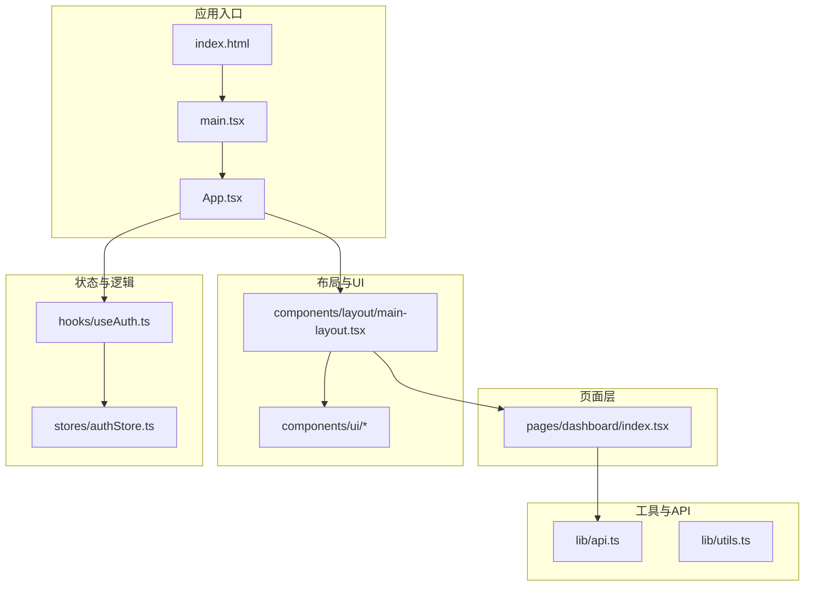
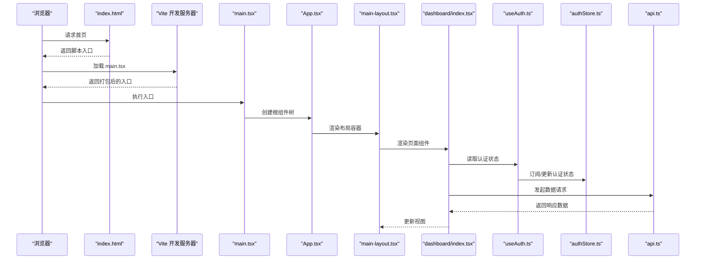
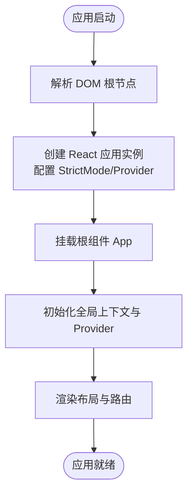
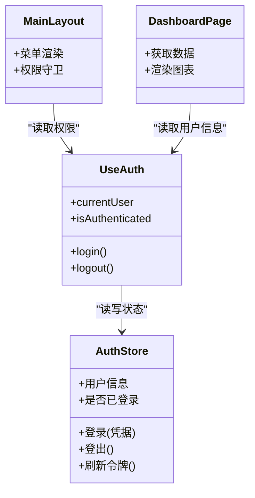
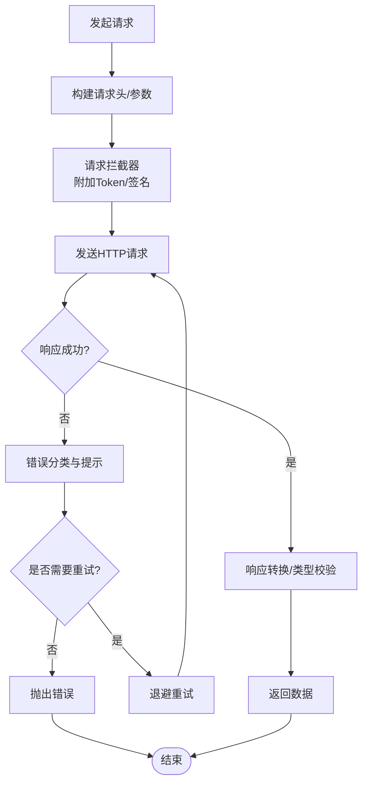
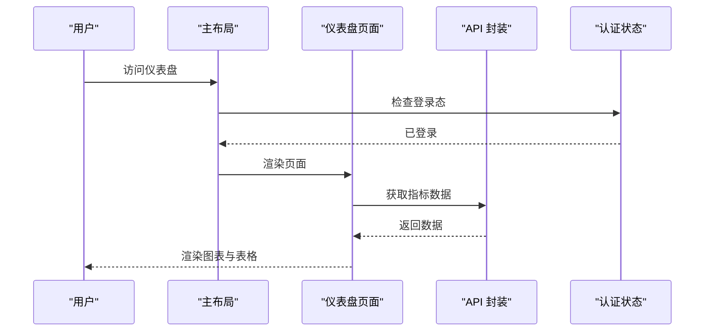
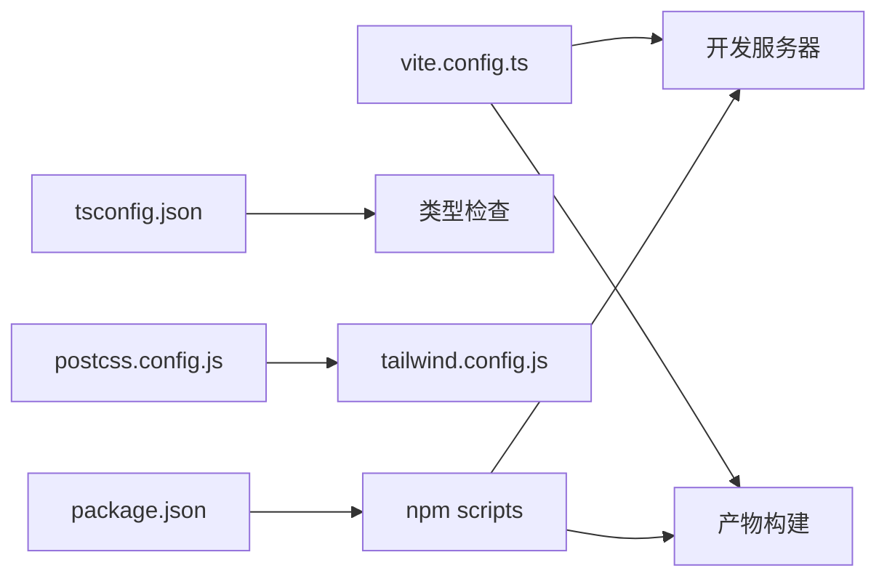

# 整体架构

<cite>
**本文引用的文件**   
- [web/src/main.tsx](file://web/src/main.tsx)
- [web/src/App.tsx](file://web/src/App.tsx)
- [web/vite.config.ts](file://web/vite.config.ts)
- [web/package.json](file://web/package.json)
- [web/tsconfig.json](file://web/tsconfig.json)
- [web/tsconfig.app.json](file://web/tsconfig.app.json)
- [web/tsconfig.node.json](file://web/tsconfig.node.json)
- [web/index.html](file://web/index.html)
- [web/postcss.config.js](file://web/postcss.config.js)
- [web/tailwind.config.js](file://web/tailwind.config.js)
- [web/src/lib/api.ts](file://web/src/lib/api.ts)
- [web/src/stores/authStore.ts](file://web/src/stores/authStore.ts)
- [web/src/hooks/useAuth.ts](file://web/src/hooks/useAuth.ts)
- [web/src/components/layout/main-layout.tsx](file://web/src/components/layout/main-layout.tsx)
- [web/src/pages/dashboard/index.tsx](file://web/src/pages/dashboard/index.tsx)
</cite>

## 目录
1. [简介](#简介)
2. [项目结构](#项目结构)
3. [核心组件](#核心组件)
4. [架构总览](#架构总览)
5. [详细组件分析](#详细组件分析)
6. [依赖分析](#依赖分析)
7. [性能考虑](#性能考虑)
8. [故障排查指南](#故障排查指南)
9. [结论](#结论)
10. [附录](#附录)

## 简介
本文件为 pj3 前端应用的整体架构文档，聚焦于分层架构、模块化组织与依赖管理策略；详细说明 React 应用的启动流程（从 main.tsx 到 App 根组件）；阐述技术栈选择的技术考量（React 18、Vite、TypeScript）；解释 src 目录的模块职责与文件组织规范；并提供系统架构图展示核心模块交互关系与数据流向。同时包含构建配置与开发环境设置说明，帮助开发者快速理解并高效协作。

## 项目结构
本项目采用“按功能域+通用能力”的分层与模块化组织方式：
- 页面层 pages：业务页面入口，负责路由级组合与布局挂载
- 组件层 components：可复用 UI 与业务组件，进一步细分为 ui、layout、charts、data-table 等子域
- 状态层 stores：基于轻量状态库的全局状态（如认证状态）
- 逻辑层 hooks：跨组件复用的自定义 Hook（如鉴权、权限判断）
- 工具层 lib：API 封装、常量、导出、校验、权限、通用工具
- 类型层 types：全局类型定义
- 资源层 assets/styles：静态资源与全局样式
- 测试与 Mock：__tests__ 与 mock 数据

图表来源
- [web/index.html](file://web/index.html)
- [web/src/main.tsx](file://web/src/main.tsx)
- [web/src/App.tsx](file://web/src/App.tsx)
- [web/src/components/layout/main-layout.tsx](file://web/src/components/layout/main-layout.tsx)
- [web/src/pages/dashboard/index.tsx](file://web/src/pages/dashboard/index.tsx)
- [web/src/stores/authStore.ts](file://web/src/stores/authStore.ts)
- [web/src/hooks/useAuth.ts](file://web/src/hooks/useAuth.ts)
- [web/src/lib/api.ts](file://web/src/lib/api.ts)

章节来源
- [web/src/main.tsx](file://web/src/main.tsx)
- [web/src/App.tsx](file://web/src/App.tsx)
- [web/src/components/layout/main-layout.tsx](file://web/src/components/layout/main-layout.tsx)
- [web/src/pages/dashboard/index.tsx](file://web/src/pages/dashboard/index.tsx)
- [web/src/stores/authStore.ts](file://web/src/stores/authStore.ts)
- [web/src/hooks/useAuth.ts](file://web/src/hooks/useAuth.ts)
- [web/src/lib/api.ts](file://web/src/lib/api.ts)

## 核心组件
- 应用入口与根组件
  - main.tsx：创建 React 应用实例、挂载根节点、初始化运行时上下文（如 StrictMode、错误边界、Provider 等）
  - App.tsx：顶层路由/布局容器、全局 Provider 注入、主题/国际化等横切关注点
- 布局与页面
  - main-layout.tsx：统一侧边栏/头部/内容区布局，承载权限守卫与导航
  - dashboard/index.tsx：仪表盘页面，聚合图表与数据表格
- 状态与逻辑
  - authStore.ts：认证状态存储（用户信息、令牌、登录态）
  - useAuth.ts：暴露认证相关 Hook，供页面与组件消费
- 工具与 API
  - api.ts：HTTP 客户端封装、拦截器、错误处理、重试/超时策略
  - utils.ts：通用工具函数（格式化、校验、ID 生成等）

章节来源
- [web/src/main.tsx](file://web/src/main.tsx)
- [web/src/App.tsx](file://web/src/App.tsx)
- [web/src/components/layout/main-layout.tsx](file://web/src/components/layout/main-layout.tsx)
- [web/src/pages/dashboard/index.tsx](file://web/src/pages/dashboard/index.tsx)
- [web/src/stores/authStore.ts](file://web/src/stores/authStore.ts)
- [web/src/hooks/useAuth.ts](file://web/src/hooks/useAuth.ts)
- [web/src/lib/api.ts](file://web/src/lib/api.ts)

## 架构总览
下图展示了从浏览器加载到页面渲染的关键路径，以及各层之间的依赖关系。

图表来源
- [web/index.html](file://web/index.html)
- [web/src/main.tsx](file://web/src/main.tsx)
- [web/src/App.tsx](file://web/src/App.tsx)
- [web/src/components/layout/main-layout.tsx](file://web/src/components/layout/main-layout.tsx)
- [web/src/pages/dashboard/index.tsx](file://web/src/pages/dashboard/index.tsx)
- [web/src/hooks/useAuth.ts](file://web/src/hooks/useAuth.ts)
- [web/src/stores/authStore.ts](file://web/src/stores/authStore.ts)
- [web/src/lib/api.ts](file://web/src/lib/api.ts)

## 详细组件分析

### 启动流程：从 main.tsx 到 App 根组件
- 入口职责
  - 解析 DOM 根节点
  - 创建 React 应用实例（含 StrictMode、错误边界、Provider 等）
  - 将根组件挂载至 DOM
- 根组件职责
  - 提供全局上下文（主题、语言、路由、状态等）
  - 组装布局与路由
  - 初始化必要的全局副作用（如埋点、统计）

图表来源
- [web/src/main.tsx](file://web/src/main.tsx)
- [web/src/App.tsx](file://web/src/App.tsx)

章节来源
- [web/src/main.tsx](file://web/src/main.tsx)
- [web/src/App.tsx](file://web/src/App.tsx)

### 认证与权限：useAuth + authStore
- 设计要点
  - 使用集中式 store 保存认证状态，避免 prop drilling
  - 通过 Hook 暴露状态与操作，便于在任意组件订阅
  - 结合布局层的权限守卫，实现路由级访问控制
- 数据流
  - 登录成功后写入 store
  - 页面通过 Hook 读取当前用户与权限
  - 布局根据权限动态显示菜单或跳转登录页

图表来源
- [web/src/stores/authStore.ts](file://web/src/stores/authStore.ts)
- [web/src/hooks/useAuth.ts](file://web/src/hooks/useAuth.ts)
- [web/src/components/layout/main-layout.tsx](file://web/src/components/layout/main-layout.tsx)
- [web/src/pages/dashboard/index.tsx](file://web/src/pages/dashboard/index.tsx)

章节来源
- [web/src/stores/authStore.ts](file://web/src/stores/authStore.ts)
- [web/src/hooks/useAuth.ts](file://web/src/hooks/useAuth.ts)
- [web/src/components/layout/main-layout.tsx](file://web/src/components/layout/main-layout.tsx)
- [web/src/pages/dashboard/index.tsx](file://web/src/pages/dashboard/index.tsx)

### 数据请求：API 封装与错误处理
- 封装职责
  - 统一 baseURL、超时、重试、取消请求
  - 请求/响应拦截：附加 Token、统一错误码映射、幂等处理
  - 类型化响应：配合 TypeScript 约束接口契约
- 错误处理
  - 网络异常、超时、服务端错误分类提示
  - 敏感错误脱敏与上报

图表来源
- [web/src/lib/api.ts](file://web/src/lib/api.ts)

章节来源
- [web/src/lib/api.ts](file://web/src/lib/api.ts)

### 页面与布局：Dashboard 与主布局
- 主布局
  - 统一 Header/Sider/Main 区域
  - 集成权限守卫与面包屑
- 仪表盘页面
  - 聚合 KPI 卡片、趋势图、数据表格
  - 通过 API 拉取指标数据，结合本地缓存提升体验

图表来源
- [web/src/components/layout/main-layout.tsx](file://web/src/components/layout/main-layout.tsx)
- [web/src/pages/dashboard/index.tsx](file://web/src/pages/dashboard/index.tsx)
- [web/src/lib/api.ts](file://web/src/lib/api.ts)
- [web/src/stores/authStore.ts](file://web/src/stores/authStore.ts)

章节来源
- [web/src/components/layout/main-layout.tsx](file://web/src/components/layout/main-layout.tsx)
- [web/src/pages/dashboard/index.tsx](file://web/src/pages/dashboard/index.tsx)
- [web/src/lib/api.ts](file://web/src/lib/api.ts)
- [web/src/stores/authStore.ts](file://web/src/stores/authStore.ts)

## 依赖分析
- 构建与运行
  - Vite：作为开发与生产构建工具，提供极速热更新与按需打包
  - PostCSS + Tailwind：原子化样式方案，提高样式一致性与可维护性
  - TypeScript：强类型保障，贯穿编译期与 IDE 体验
- 关键配置文件
  - vite.config.ts：插件、别名、代理、优化策略
  - tsconfig*.json：类型检查、模块解析、目标平台
  - postcss.config.js / tailwind.config.js：样式管线与主题定制
  - package.json：依赖声明、脚本命令、工程元信息

图表来源
- [web/vite.config.ts](file://web/vite.config.ts)
- [web/tsconfig.json](file://web/tsconfig.json)
- [web/tsconfig.app.json](file://web/tsconfig.app.json)
- [web/tsconfig.node.json](file://web/tsconfig.node.json)
- [web/postcss.config.js](file://web/postcss.config.js)
- [web/tailwind.config.js](file://web/tailwind.config.js)
- [web/package.json](file://web/package.json)

章节来源
- [web/vite.config.ts](file://web/vite.config.ts)
- [web/tsconfig.json](file://web/tsconfig.json)
- [web/tsconfig.app.json](file://web/tsconfig.app.json)
- [web/tsconfig.node.json](file://web/tsconfig.node.json)
- [web/postcss.config.js](file://web/postcss.config.js)
- [web/tailwind.config.js](file://web/tailwind.config.js)
- [web/package.json](file://web/package.json)

## 性能考虑
- 构建优化
  - 开启代码分割与懒加载，减少首屏体积
  - 合理使用 Vite 预构建与依赖外置策略
  - 图片/字体等资源压缩与 CDN 部署
- 运行时优化
  - 列表虚拟化、分页与增量更新
  - 请求去重、缓存与失败重试
  - 组件级 memo 与 useMemo/useCallback 合理运用
- 监控与度量
  - 接入性能埋点（FCP/LCP/CLS）
  - 错误上报与告警

[本节为通用指导，不直接分析具体文件]

## 故障排查指南
- 常见问题定位
  - 启动失败：检查端口占用、环境变量、代理配置
  - 类型报错：确认 tsconfig 模块解析与路径别名
  - 样式未生效：确认 Tailwind 扫描路径与 PostCSS 顺序
  - 请求失败：查看拦截器日志、Token 过期与跨域策略
- 调试建议
  - 使用浏览器 Network/Console 定位网络问题
  - 使用 React DevTools 检查组件树与状态
  - 在 API 层增加结构化日志与错误码映射

章节来源
- [web/vite.config.ts](file://web/vite.config.ts)
- [web/tsconfig.json](file://web/tsconfig.json)
- [web/postcss.config.js](file://web/postcss.config.js)
- [web/tailwind.config.js](file://web/tailwind.config.js)
- [web/src/lib/api.ts](file://web/src/lib/api.ts)

## 结论
pj3 前端采用清晰的分层与模块化设计：以 Vite 为构建核心，React 18 为运行时，TypeScript 提供类型保障；通过 stores/hooks/lib 的解耦实现高内聚低耦合；布局与页面职责明确，认证与权限贯穿全局。该架构具备良好的可扩展性与可维护性，适合中大型项目的持续演进。

[本节为总结性内容，不直接分析具体文件]

## 附录
- 技术栈选型要点
  - React 18：并发特性、自动批处理、Suspense 生态完善
  - Vite：ESM 原生、极快冷/热启动、插件生态丰富
  - TypeScript：严格模式、类型推导、IDE 友好
  - Tailwind + PostCSS：原子化样式、主题定制、构建时优化
- 开发环境设置
  - 安装依赖后执行开发脚本，启动本地服务与热重载
  - 配置代理以对接后端接口，确保跨域与鉴权正确
  - 使用 ESLint/Oxlint 与 Prettier 保持代码风格一致

章节来源
- [web/package.json](file://web/package.json)
- [web/vite.config.ts](file://web/vite.config.ts)
- [web/tsconfig.json](file://web/tsconfig.json)
- [web/postcss.config.js](file://web/postcss.config.js)
- [web/tailwind.config.js](file://web/tailwind.config.js)