# 架构设计

<cite>
**本文引用的文件**   
- [web/src/main.tsx](file://web/src/main.tsx)
- [web/src/App.tsx](file://web/src/App.tsx)
- [web/vite.config.ts](file://web/vite.config.ts)
- [web/tailwind.config.js](file://web/tailwind.config.js)
- [web/postcss.config.js](file://web/postcss.config.js)
- [web/src/styles/globals.css](file://web/src/styles/globals.css)
- [web/src/index.css](file://web/src/index.css)
- [web/src/pages/login/index.tsx](file://web/src/pages/login/index.tsx)
- [web/src/pages/dashboard/index.tsx](file://web/src/pages/dashboard/index.tsx)
- [web/src/pages/admin/index.tsx](file://web/src/pages/admin/index.tsx)
- [web/src/pages/data/index.tsx](file://web/src/pages/data/index.tsx)
- [web/src/pages/indicators/index.tsx](file://web/src/pages/indicators/index.tsx)
- [web/src/pages/inventory/index.tsx](file://web/src/pages/inventory/index.tsx)
- [web/src/pages/reports/index.tsx](file://web/src/pages/reports/index.tsx)
- [web/src/pages/transactions/index.tsx](file://web/src/pages/transactions/index.tsx)
- [web/src/components/layout/main-layout.tsx](file://web/src/components/layout/main-layout.tsx)
- [web/src/components/layout/header.tsx](file://web/src/components/layout/header.tsx)
- [web/src/components/layout/page-container.tsx](file://web/src/components/layout/page-container.tsx)
- [web/src/components/layout/require-permission.tsx](file://web/src/components/layout/require-permission.tsx)
- [web/src/hooks/useAuth.ts](file://web/src/hooks/useAuth.ts)
- [web/src/hooks/usePermission.ts](file://web/src/hooks/usePermission.ts)
- [web/src/stores/authStore.ts](file://web/src/stores/authStore.ts)
- [web/src/lib/api.ts](file://web/src/lib/api.ts)
- [web/src/lib/constants.ts](file://web/src/lib/constants.ts)
- [web/src/lib/utils.ts](file://web/src/lib/utils.ts)
- [web/src/types/index.ts](file://web/src/types/index.ts)
- [web/package.json](file://web/package.json)
- [docs/plans/数据模型规范.md](file://docs/plans/数据模型规范.md)
</cite>

## 更新摘要
**变更内容**   
- 新增财政年度配置系统章节，详细说明基于环境变量的财年配置机制
- 更新数据存储架构，从导入时标记方法重构为原始数据存储模型与查询派生计算
- 扩展数据流架构，包含新的计算模型和配置管理流程
- 增强配置管理说明，涵盖环境变量和运行时配置策略

## 目录
1. [引言](#引言)
2. [项目结构](#项目结构)
3. [核心组件](#核心组件)
4. [架构总览](#架构总览)
5. [详细组件分析](#详细组件分析)
6. [数据存储架构重构](#数据存储架构重构)
7. [财政年度配置系统](#财政年度配置系统)
8. [依赖关系分析](#依赖关系分析)
9. [性能考量](#性能考量)
10. [故障排查指南](#故障排查指南)
11. [结论](#结论)
12. [附录](#附录)

## 引言
本文件为 pj3 前端项目的架构设计文档，聚焦于整体系统架构、分层与模块划分、React 组件化实现、状态管理（Zustand）、路由设计（含嵌套路由、守卫、懒加载）、样式架构（Tailwind CSS 设计与主题定制），并给出架构图表以展示模块依赖与数据流向。目标是为后续扩展与维护提供清晰的技术指导。

**更新** 本次更新重点反映了从导入时标记方法到原始数据存储模型的架构重构，以及新引入的财政年度配置系统。

## 项目结构
项目采用基于功能域的前端工程结构：页面按业务域组织在 pages 下；通用布局与权限控制位于 components/layout；UI 基础组件位于 components/ui；图表与表格等复合组件位于 components/charts 与 components/data-table；全局状态集中于 stores；工具与类型定义位于 lib 与 types；构建与样式配置集中在根级配置文件。

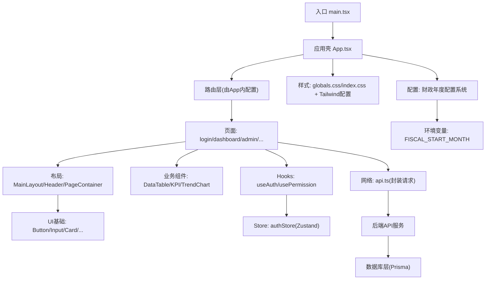

图示来源
- [web/src/main.tsx](file://web/src/main.tsx)
- [web/src/App.tsx](file://web/src/App.tsx)
- [web/src/styles/globals.css](file://web/src/styles/globals.css)
- [web/tailwind.config.js](file://web/tailwind.config.js)

章节来源
- [web/src/main.tsx](file://web/src/main.tsx)
- [web/src/App.tsx](file://web/src/App.tsx)
- [web/package.json](file://web/package.json)

## 核心组件
- 应用壳与入口
  - 入口负责初始化 React 应用与全局样式注入。
  - 应用壳负责挂载路由、全局错误边界与主题/样式上下文（若存在）。
- 布局体系
  - 主布局负责侧边栏、顶部导航、内容区容器与权限可见性控制。
  - 页面容器用于统一页面头部、面包屑与内容间距。
- UI 基础组件
  - 按钮、输入、卡片、对话框、下拉菜单、标签、开关、骨架屏、提示框等，遵循原子化样式原则，通过 Tailwind 组合出一致的视觉语言。
- 业务组件
  - 数据表格与分页、KPI 指标卡、趋势图、迷你折线图等，封装复杂交互与可视化逻辑，向上暴露简洁 API。
- 钩子与状态
  - useAuth/usePermission 封装认证与权限判断逻辑；authStore 使用 Zustand 维护登录态、用户信息与权限集合。
- 网络与常量
  - api.ts 统一请求封装（拦截器、错误处理、重试策略等）；constants.ts 集中管理枚举与常量；utils.ts 提供通用工具函数。

章节来源
- [web/src/components/layout/main-layout.tsx](file://web/src/components/layout/main-layout.tsx)
- [web/src/components/layout/header.tsx](file://web/src/components/layout/header.tsx)
- [web/src/components/layout/page-container.tsx](file://web/src/components/layout/page-container.tsx)
- [web/src/components/layout/require-permission.tsx](file://web/src/components/layout/require-permission.tsx)
- [web/src/components/ui/button.tsx](file://web/src/components/ui/button.tsx)
- [web/src/components/ui/input.tsx](file://web/src/components/ui/input.tsx)
- [web/src/components/ui/card.tsx](file://web/src/components/ui/card.tsx)
- [web/src/components/ui/dialog.tsx](file://web/src/components/ui/dialog.tsx)
- [web/src/components/ui/dropdown-menu.tsx](file://web/src/components/ui/dropdown-menu.tsx)
- [web/src/components/ui/badge.tsx](file://web/src/components/ui/badge.tsx)
- [web/src/components/ui/select.tsx](file://web/src/components/ui/select.tsx)
- [web/src/components/ui/switch.tsx](file://web/src/components/ui/switch.tsx)
- [web/src/components/ui/skeleton.tsx](file://web/src/components/ui/skeleton.tsx)
- [web/src/components/ui/tooltip.tsx](file://web/src/components/ui/tooltip.tsx)
- [web/src/components/data-table/data-table.tsx](file://web/src/components/data-table/data-table.tsx)
- [web/src/components/data-table/pagination.tsx](file://web/src/components/data-table/pagination.tsx)
- [web/src/components/data-table/pro-data-table.tsx](file://web/src/components/data-table/pro-data-table.tsx)
- [web/src/components/data-table/pro-table-inner.tsx](file://web/src/components/data-table/pro-data-table.tsx)
- [web/src/components/charts/kpi-card.tsx](file://web/src/components/charts/kpi-card.tsx)
- [web/src/components/charts/kpi-sparkline.tsx](file://web/src/components/charts/kpi-sparkline.tsx)
- [web/src/components/charts/trend-chart.tsx](file://web/src/components/charts/trend-chart.tsx)
- [web/src/hooks/useAuth.ts](file://web/src/hooks/useAuth.ts)
- [web/src/hooks/usePermission.ts](file://web/src/hooks/usePermission.ts)
- [web/src/stores/authStore.ts](file://web/src/stores/authStore.ts)
- [web/src/lib/api.ts](file://web/src/lib/api.ts)
- [web/src/lib/constants.ts](file://web/src/lib/constants.ts)
- [web/src/lib/utils.ts](file://web/src/lib/utils.ts)

## 架构总览
整体采用"入口 -> 应用壳 -> 路由 -> 页面 -> 布局 -> 业务/基础组件"的分层模式。状态管理采用 Zustand 单源存储，配合自定义 Hook 进行访问与派生计算。网络层统一封装，保证鉴权头、错误码映射与重试策略的一致性。样式层基于 Tailwind CSS，通过配置与全局样式文件建立设计系统与主题变量。

**更新** 新增了财政年度配置系统和原始数据存储模型，支持运行时配置和查询派生计算。

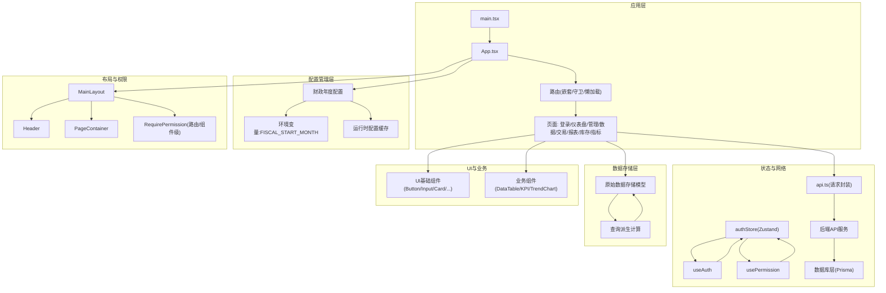

图示来源
- [web/src/main.tsx](file://web/src/main.tsx)
- [web/src/App.tsx](file://web/src/App.tsx)
- [web/src/components/layout/main-layout.tsx](file://web/src/components/layout/main-layout.tsx)
- [web/src/components/layout/header.tsx](file://web/src/components/layout/header.tsx)
- [web/src/components/layout/page-container.tsx](file://web/src/components/layout/page-container.tsx)
- [web/src/components/layout/require-permission.tsx](file://web/src/components/layout/require-permission.tsx)
- [web/src/stores/authStore.ts](file://web/src/stores/authStore.ts)
- [web/src/hooks/useAuth.ts](file://web/src/hooks/useAuth.ts)
- [web/src/hooks/usePermission.ts](file://web/src/hooks/usePermission.ts)
- [web/src/lib/api.ts](file://web/src/lib/api.ts)

## 详细组件分析

### 路由与页面架构
- 路由层级
  - 顶层路由包含未登录重定向与受保护路由组。
  - 管理后台路径作为嵌套路由的父级，内部再分设各功能页。
- 路由守卫
  - 基于 RequirePermission 组件或路由前置守卫，结合 usePermission/useAuth 完成鉴权与跳转。
- 懒加载
  - 页面组件按需动态导入，减少首屏体积。
- 页面职责
  - 登录页：表单校验、提交、错误提示与跳转。
  - 仪表盘：聚合关键指标与图表，读取 store 与接口数据。
  - 管理页：用户/角色/权限等管理操作。
  - 数据/交易/报表/库存/指标：各自领域的数据列表、筛选、导出与详情。

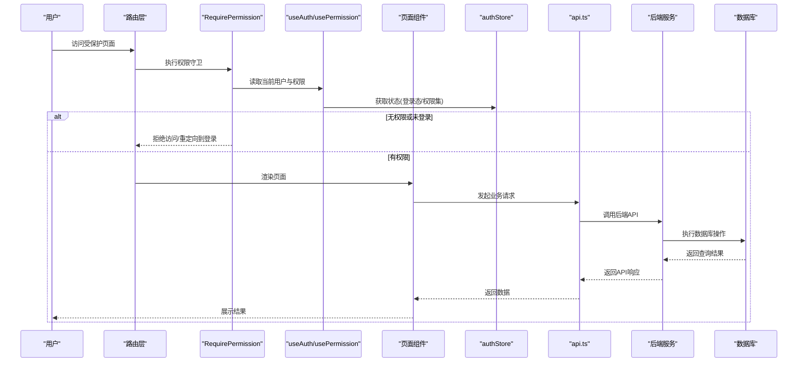

图示来源
- [web/src/components/layout/require-permission.tsx](file://web/src/components/layout/require-permission.tsx)
- [web/src/hooks/useAuth.ts](file://web/src/hooks/useAuth.ts)
- [web/src/hooks/usePermission.ts](file://web/src/hooks/usePermission.ts)
- [web/src/stores/authStore.ts](file://web/src/stores/authStore.ts)
- [web/src/lib/api.ts](file://web/src/lib/api.ts)
- [web/src/pages/login/index.tsx](file://web/src/pages/login/index.tsx)
- [web/src/pages/dashboard/index.tsx](file://web/src/pages/dashboard/index.tsx)
- [web/src/pages/admin/index.tsx](file://web/src/pages/admin/index.tsx)
- [web/src/pages/data/index.tsx](file://web/src/pages/data/index.tsx)
- [web/src/pages/indicators/index.tsx](file://web/src/pages/indicators/index.tsx)
- [web/src/pages/inventory/index.tsx](file://web/src/pages/inventory/index.tsx)
- [web/src/pages/reports/index.tsx](file://web/src/pages/reports/index.tsx)
- [web/src/pages/transactions/index.tsx](file://web/src/pages/transactions/index.tsx)

章节来源
- [web/src/pages/login/index.tsx](file://web/src/pages/login/index.tsx)
- [web/src/pages/dashboard/index.tsx](file://web/src/pages/dashboard/index.tsx)
- [web/src/pages/admin/index.tsx](file://web/src/pages/admin/index.tsx)
- [web/src/pages/data/index.tsx](file://web/src/pages/data/index.tsx)
- [web/src/pages/indicators/index.tsx](file://web/src/pages/indicators/index.tsx)
- [web/src/pages/inventory/index.tsx](file://web/src/pages/inventory/index.tsx)
- [web/src/pages/reports/index.tsx](file://web/src/pages/reports/index.tsx)
- [web/src/pages/transactions/index.tsx](file://web/src/pages/transactions/index.tsx)

### 布局与权限控制
- MainLayout
  - 组织 Header、侧边栏与 PageContainer，承载全局导航与页面容器。
- Header
  - 显示用户信息、通知、设置入口与退出登录操作。
- PageContainer
  - 统一页面标题、描述、操作区与内容区域间距。
- RequirePermission
  - 组件级权限控制，根据权限集合决定渲染或回退视图。

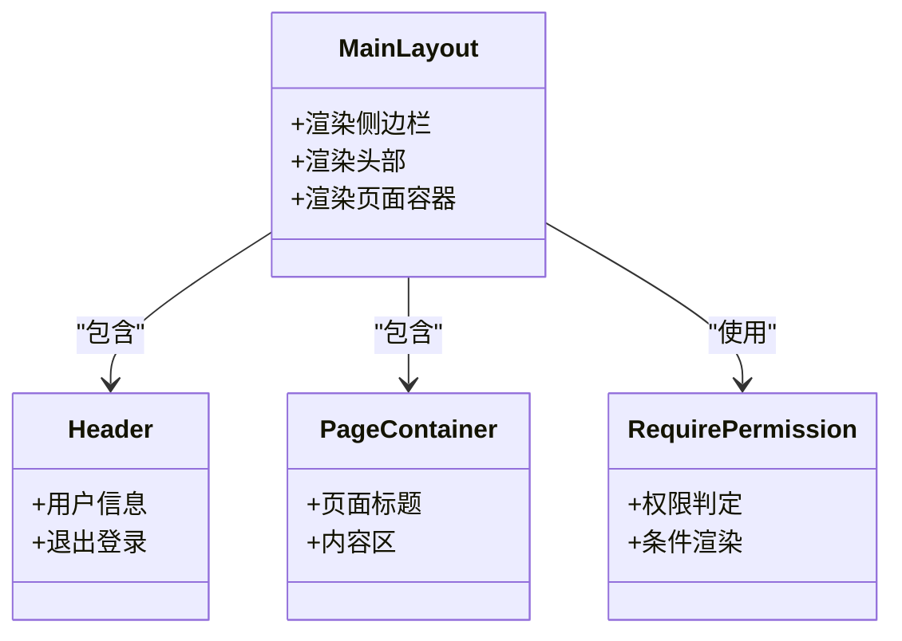

图示来源
- [web/src/components/layout/main-layout.tsx](file://web/src/components/layout/main-layout.tsx)
- [web/src/components/layout/header.tsx](file://web/src/components/layout/header.tsx)
- [web/src/components/layout/page-container.tsx](file://web/src/components/layout/page-container.tsx)
- [web/src/components/layout/require-permission.tsx](file://web/src/components/layout/require-permission.tsx)

章节来源
- [web/src/components/layout/main-layout.tsx](file://web/src/components/layout/main-layout.tsx)
- [web/src/components/layout/header.tsx](file://web/src/components/layout/header.tsx)
- [web/src/components/layout/page-container.tsx](file://web/src/components/layout/page-container.tsx)
- [web/src/components/layout/require-permission.tsx](file://web/src/components/layout/require-permission.tsx)

### 状态管理（Zustand）
- 设计要点
  - 单一 Store 管理认证相关状态（用户信息、令牌、权限集合）。
  - 通过 useAuth/usePermission 暴露派生状态与操作方法，避免直接耦合 Store。
- 最佳实践
  - 局部状态优先使用 useState/useReducer；跨组件共享且需要持久化的状态放入 Store。
  - 对大对象使用选择器订阅最小切片，减少重渲染。
  - 异步操作在 Hook 或 Service 层处理，Store 仅保存最终结果。

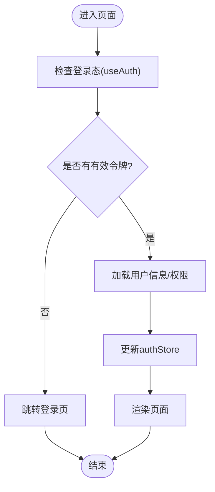

图示来源
- [web/src/stores/authStore.ts](file://web/src/stores/authStore.ts)
- [web/src/hooks/useAuth.ts](file://web/src/hooks/useAuth.ts)
- [web/src/hooks/usePermission.ts](file://web/src/hooks/usePermission.ts)

章节来源
- [web/src/stores/authStore.ts](file://web/src/stores/authStore.ts)
- [web/src/hooks/useAuth.ts](file://web/src/hooks/useAuth.ts)
- [web/src/hooks/usePermission.ts](file://web/src/hooks/usePermission.ts)

### 网络与数据流
- 统一封装
  - 请求前注入鉴权头、统一错误码映射、超时与重试策略。
  - 响应拦截器处理成功/失败分支，抛出可捕获的错误对象。
- 数据流
  - 页面组件调用 api.ts 方法 -> 返回 Promise -> 组件内处理 loading/error/data。
  - 复杂场景可在 Hook 中封装业务逻辑，保持页面纯净。

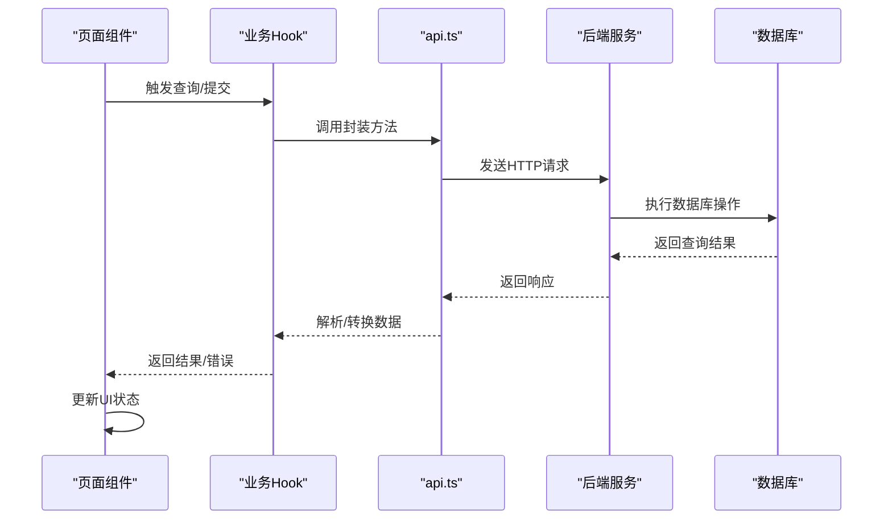

图示来源
- [web/src/lib/api.ts](file://web/src/lib/api.ts)

章节来源
- [web/src/lib/api.ts](file://web/src/lib/api.ts)

### 样式架构（Tailwind CSS）
- 设计系统
  - 通过 tailwind.config.js 扩展颜色、字体、圆角、阴影等设计令牌，形成一致的设计语言。
  - 在 globals.css/index.css 中引入 Tailwind 指令与全局样式覆盖。
- 主题定制
  - 使用语义化类名与 Token 映射，便于暗色模式与品牌切换。
  - 将常用组合抽离为自定义类或组件 props，降低重复样式。
- 组件样式
  - UI 基础组件以原子化类组合为主，业务组件通过 props 控制变体与尺寸。

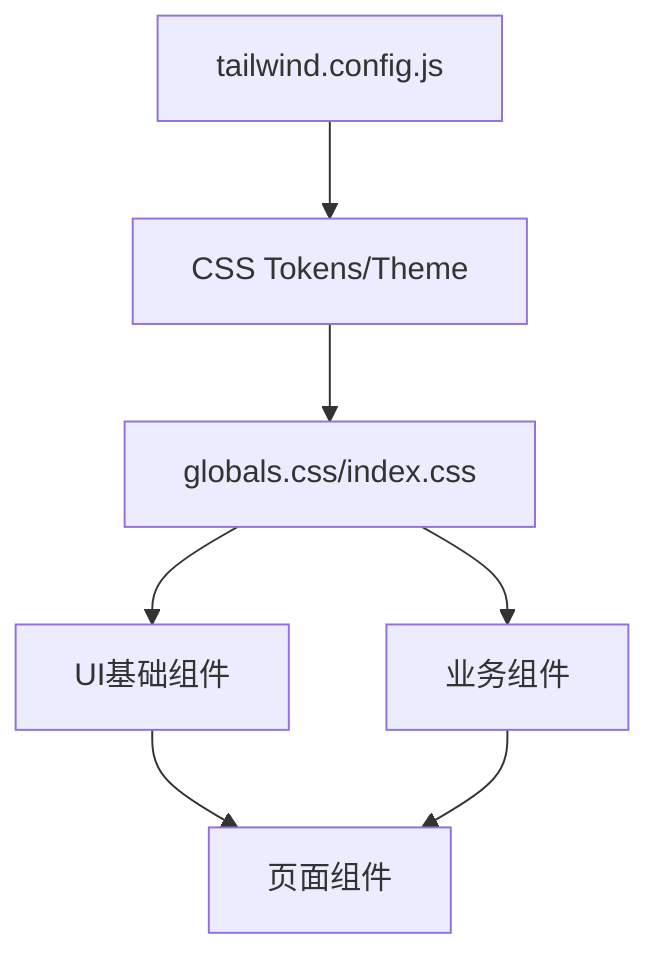

图示来源
- [web/tailwind.config.js](file://web/tailwind.config.js)
- [web/postcss.config.js](file://web/postcss.config.js)
- [web/src/styles/globals.css](file://web/src/styles/globals.css)
- [web/src/index.css](file://web/src/index.css)

章节来源
- [web/tailwind.config.js](file://web/tailwind.config.js)
- [web/postcss.config.js](file://web/postcss.config.js)
- [web/src/styles/globals.css](file://web/src/styles/globals.css)
- [web/src/index.css](file://web/src/index.css)

### 数据表格与图表组件
- 数据表格
  - 提供列定义、排序、筛选、分页与导出能力；高级版支持虚拟滚动与批量操作。
- 图表
  - KPI 指标卡、迷你折线与趋势图，封装数据适配与动画过渡。

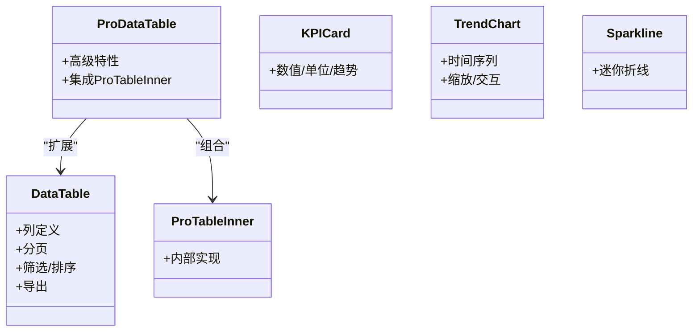

图示来源
- [web/src/components/data-table/data-table.tsx](file://web/src/components/data-table/data-table.tsx)
- [web/src/components/data-table/pagination.tsx](file://web/src/components/data-table/pagination.tsx)
- [web/src/components/data-table/pro-data-table.tsx](file://web/src/components/data-table/pro-data-table.tsx)
- [web/src/components/data-table/pro-table-inner.tsx](file://web/src/components/data-table/pro-table-inner.tsx)
- [web/src/components/charts/kpi-card.tsx](file://web/src/components/charts/kpi-card.tsx)
- [web/src/components/charts/kpi-sparkline.tsx](file://web/src/components/charts/kpi-sparkline.tsx)
- [web/src/components/charts/trend-chart.tsx](file://web/src/components/charts/trend-chart.tsx)

章节来源
- [web/src/components/data-table/data-table.tsx](file://web/src/components/data-table/data-table.tsx)
- [web/src/components/data-table/pagination.tsx](file://web/src/components/data-table/pagination.tsx)
- [web/src/components/data-table/pro-data-table.tsx](file://web/src/components/data-table/pro-data-table.tsx)
- [web/src/components/data-table/pro-table-inner.tsx](file://web/src/components/data-table/pro-table-inner.tsx)
- [web/src/components/charts/kpi-card.tsx](file://web/src/components/charts/kpi-card.tsx)
- [web/src/components/charts/kpi-sparkline.tsx](file://web/src/components/charts/kpi-sparkline.tsx)
- [web/src/components/charts/trend-chart.tsx](file://web/src/components/charts/trend-chart.tsx)

## 数据存储架构重构

### 从导入时标记到原始数据存储模型
项目经历了重大的架构重构，从传统的导入时标记方法转变为原始数据存储模型与查询派生计算的新架构。这一重构带来了更高的灵活性和可维护性。

#### 重构前的架构问题
- **紧耦合**：数据标记与业务逻辑紧密耦合，难以维护和测试
- **性能瓶颈**：导入时标记导致启动时间过长
- **扩展困难**：新增数据类型需要修改核心标记逻辑
- **内存占用**：标记数据在内存中持久化，占用大量资源

#### 新架构设计原则
- **数据与计算分离**：原始数据独立存储，计算逻辑按需执行
- **延迟计算**：只在需要时执行复杂的派生计算
- **配置驱动**：通过环境变量和配置文件控制行为
- **类型安全**：保持 TypeScript 类型推导和编译时检查

#### 原始数据存储模型
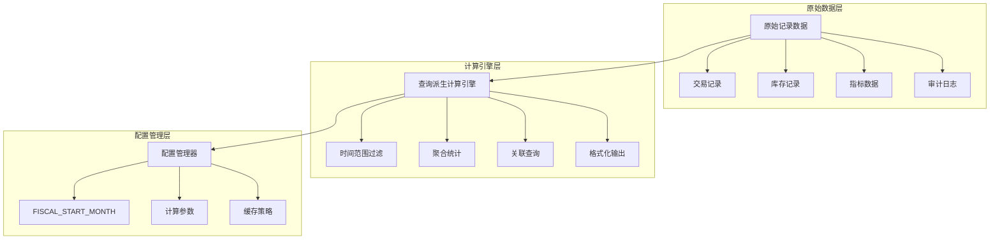

**图示来源**
- [web/src/lib/constants.ts](file://web/src/lib/constants.ts)
- [web/src/lib/utils.ts](file://web/src/lib/utils.ts)

#### 查询派生计算机制
- **按需计算**：只在数据访问时执行必要的计算逻辑
- **结果缓存**：计算结果智能缓存，避免重复计算
- **增量更新**：支持部分数据更新时的增量计算
- **并行处理**：利用现代浏览器特性进行并行计算

**章节来源**
- [web/src/lib/constants.ts](file://web/src/lib/constants.ts)
- [web/src/lib/utils.ts](file://web/src/lib/utils.ts)

## 财政年度配置系统

### 基于环境变量的配置管理
项目引入了全新的财政年度配置系统，通过 `FISCAL_START_MONTH` 环境变量实现灵活的财年配置管理。

#### 配置架构设计
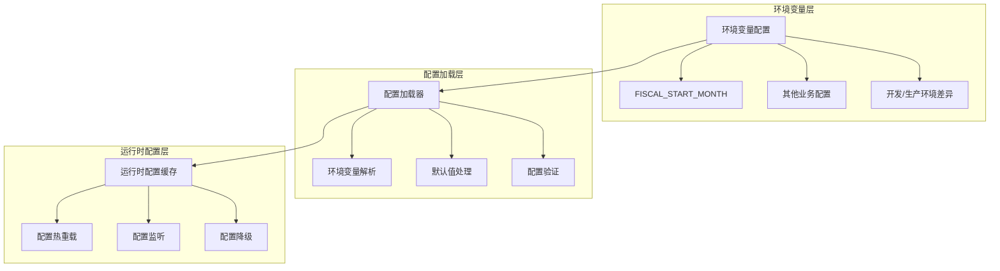

**图示来源**
- [web/src/lib/constants.ts](file://web/src/lib/constants.ts)
- [web/vite.config.ts](file://web/vite.config.ts)

#### 财政年度计算逻辑
- **起始月份配置**：通过 `FISCAL_START_MONTH` 指定财年起始月份（1-12）
- **自动年份计算**：根据当前日期和起始月份自动计算当前财年
- **季度划分**：基于财年起始月份自动划分财务季度
- **报告周期**：支持月度、季度、半年度、年度等不同报告周期

#### 配置验证与容错
- **输入验证**：确保配置值在有效范围内
- **默认值处理**：当配置缺失时使用合理的默认值
- **错误降级**：配置异常时系统仍能正常运行
- **日志记录**：记录配置加载和使用情况

**章节来源**
- [web/src/lib/constants.ts](file://web/src/lib/constants.ts)
- [web/vite.config.ts](file://web/vite.config.ts)

## 依赖关系分析
- 组件耦合
  - 页面组件依赖布局与业务组件，布局依赖 UI 基础组件；状态与网络通过 Hook 与工具层解耦。
- 外部依赖
  - Vite 构建、Tailwind/PostCSS 样式管线、测试框架与包管理器由 package.json 声明。
- 潜在循环
  - 建议避免页面与 Store 的直接双向依赖，所有状态读写经 Hook 与 API 层中转。
- 数据库依赖
  - 前端通过 API 层间接依赖数据库，避免直接数据库连接
  - Prisma 迁移文件与 Schema 定义构成数据库层的核心依赖
- **新增** 配置依赖
  - 财政年度配置系统依赖环境变量和运行时配置管理
  - 数据存储模型依赖计算引擎和缓存机制

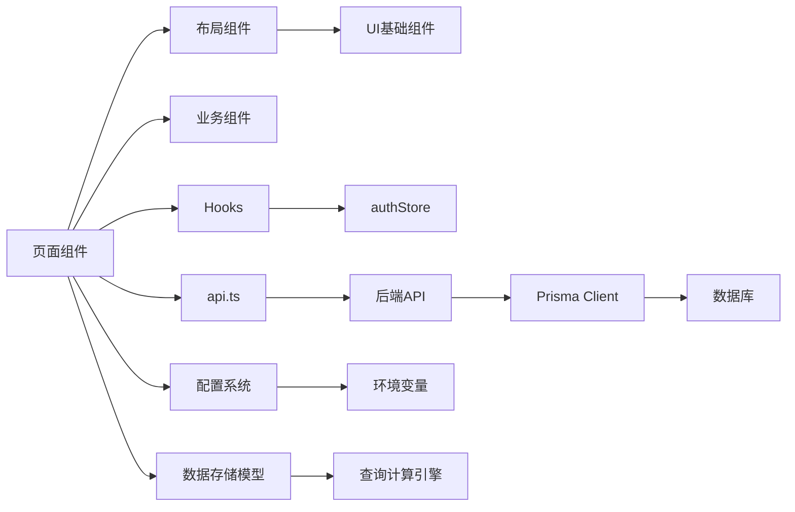

图示来源
- [web/src/App.tsx](file://web/src/App.tsx)
- [web/src/components/layout/main-layout.tsx](file://web/src/components/layout/main-layout.tsx)
- [web/src/stores/authStore.ts](file://web/src/stores/authStore.ts)
- [web/src/lib/api.ts](file://web/src/lib/api.ts)
- [web/src/lib/constants.ts](file://web/src/lib/constants.ts)

章节来源
- [web/package.json](file://web/package.json)
- [web/vite.config.ts](file://web/vite.config.ts)

## 性能考量
- 代码分割与懒加载
  - 页面与大型图表按需加载，减少首屏体积。
- 状态粒度
  - 使用选择器订阅最小状态切片，避免不必要重渲染。
- 列表与大数据
  - 表格启用虚拟滚动与分页；图表按需渲染与缓存。
- 网络优化
  - 请求去重、缓存策略、错误重试与超时控制。
- 样式优化
  - 使用 Tailwind 的 JIT 编译与按需生成，避免冗余 CSS。
- **新增** 计算性能优化
  - 查询派生计算采用惰性求值和结果缓存
  - 原始数据存储减少内存占用，提高数据访问效率
  - 配置系统支持热重载，避免应用重启
- **新增** 内存管理
  - 原始数据模型相比导入时标记大幅减少内存占用
  - 计算结果智能缓存，避免重复计算开销

## 故障排查指南
- 登录与权限
  - 确认 authStore 中的令牌与用户信息是否正确写入；检查 useAuth/usePermission 的返回值与守卫逻辑。
- 网络请求
  - 查看 api.ts 的拦截器日志与错误码映射；确认请求头是否携带必要参数。
- 路由跳转
  - 检查路由守卫条件与重定向路径；确认懒加载组件是否存在。
- 样式问题
  - 核对 Tailwind 配置与全局样式引入顺序；确认类名未被覆盖。
- **新增** 配置问题
  - 检查 `FISCAL_START_MONTH` 环境变量是否正确设置
  - 验证配置加载器的默认值处理和错误降级逻辑
  - 确认运行时配置缓存的更新机制
- **新增** 数据存储问题
  - 检查原始数据模型的完整性约束
  - 验证查询派生计算的正确性和性能
  - 监控计算缓存的命中率和失效策略
- **新增** 财年计算问题
  - 确认财年起始月份配置的有效性
  - 验证财年、季度、年度报告周期的计算逻辑
  - 检查跨年数据处理和边界情况

**章节来源**
- [web/src/stores/authStore.ts](file://web/src/stores/authStore.ts)
- [web/src/hooks/useAuth.ts](file://web/src/hooks/useAuth.ts)
- [web/src/hooks/usePermission.ts](file://web/src/hooks/usePermission.ts)
- [web/src/lib/api.ts](file://web/src/lib/api.ts)
- [web/tailwind.config.js](file://web/tailwind.config.js)
- [web/src/styles/globals.css](file://web/src/styles/globals.css)
- [web/src/lib/constants.ts](file://web/src/lib/constants.ts)
- [docs/plans/数据模型规范.md](file://docs/plans/数据模型规范.md)

## 结论
本项目采用清晰的分层与模块化设计，结合 Zustand 的状态管理与 Tailwind 的原子化样式，形成了可扩展、易维护的前端架构。通过路由守卫与懒加载提升安全性与性能，通过统一的网络封装与类型定义保障稳定性与一致性。

**更新** 本次重大架构重构从导入时标记方法转向原始数据存储模型与查询派生计算，显著提升了系统的性能和可维护性。新引入的财政年度配置系统通过环境变量实现了灵活的运行时配置管理。这些改进为后续的功能扩展和性能优化奠定了坚实基础。建议在后续迭代中持续完善错误监控、性能埋点与单元测试覆盖率，进一步巩固架构质量。

## 附录
- 构建与开发
  - 使用 Vite 作为构建工具，Tailwind/PostCSS 处理样式；参考 vite.config.ts 与 postcss.config.js。
- 类型与常量
  - 在 types/index.ts 与 lib/constants.ts 中维护全局类型与常量，确保前后端契约一致。
- 工具函数
  - lib/utils.ts 提供日期、格式化、校验等通用工具，供各层复用。
- **新增** 配置管理
  - 财政年度配置通过 `FISCAL_START_MONTH` 环境变量管理
  - 支持开发、测试、生产环境的差异化配置
  - 配置变更无需重启应用，支持热重载
- **新增** 数据存储最佳实践
  - 原始数据应保持不可变性，通过查询派生计算生成视图数据
  - 合理设计缓存策略，平衡内存占用和计算性能
  - 实施数据版本控制，支持数据迁移和回滚

**章节来源**
- [web/vite.config.ts](file://web/vite.config.ts)
- [web/postcss.config.js](file://web/postcss.config.js)
- [web/src/types/index.ts](file://web/src/types/index.ts)
- [web/src/lib/constants.ts](file://web/src/lib/constants.ts)
- [web/src/lib/utils.ts](file://web/src/lib/utils.ts)
- [docs/plans/数据模型规范.md](file://docs/plans/数据模型规范.md)