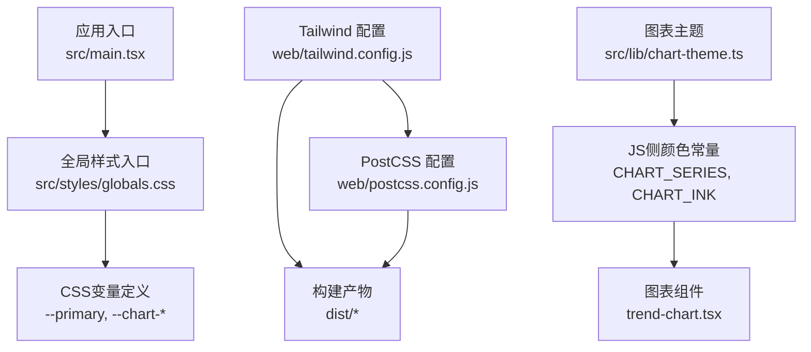
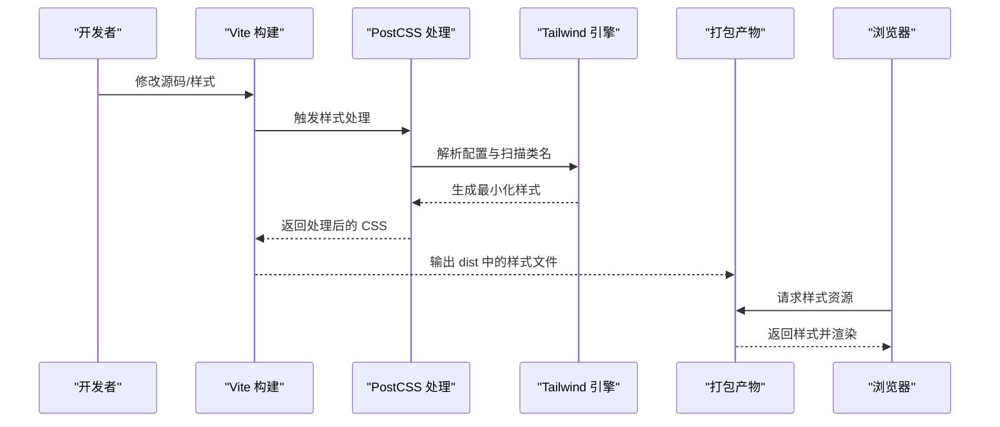
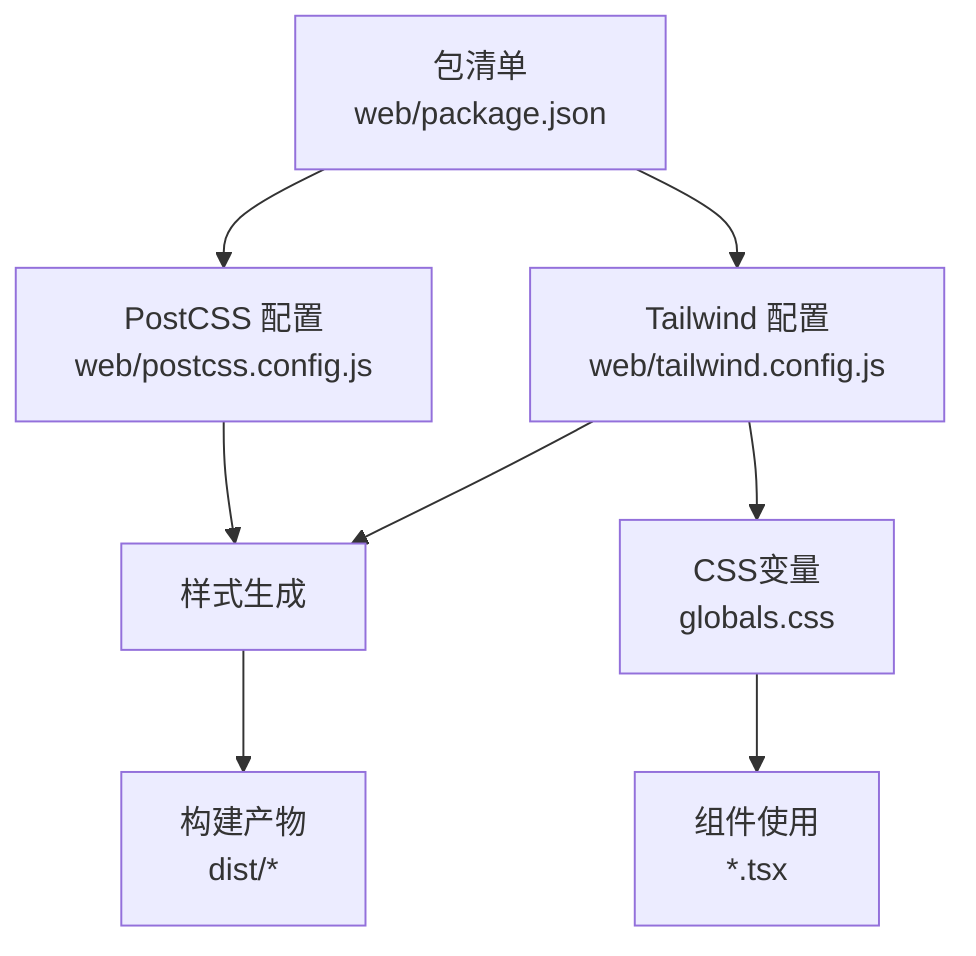

# 样式系统

<cite>
**本文引用的文件**   
- [tailwind.config.js](file://web/tailwind.config.js)
- [postcss.config.js](file://web/postcss.config.js)
- [globals.css](file://web/src/styles/globals.css)
- [chart-theme.ts](file://web/src/lib/chart-theme.ts)
- [chart-colors.ts](file://web/src/lib/chart-colors.ts)
- [trend-chart.tsx](file://web/src/components/charts/trend-chart.tsx)
- [main.tsx](file://web/src/main.tsx)
- [package.json](file://web/package.json)
</cite>

## 更新摘要
**所做更改**   
- 新增品牌橙色主题令牌系统章节，详细说明CSS自定义属性替代硬编码十六进制颜色的实现
- 更新颜色体系部分，增加13个图表系列颜色和暖色调中性色的详细说明
- 完善暗色模式支持机制，说明class策略与CSS变量的协同工作
- 新增图表主题集成章节，展示CHART_SERIES与CSS变量的映射关系
- 更新依赖分析，反映新的样式架构变化

## 目录
1. [简介](#简介)
2. [项目结构](#项目结构)
3. [核心组件](#核心组件)
4. [架构总览](#架构总览)
5. [详细组件分析](#详细组件分析)
6. [依赖分析](#依赖分析)
7. [性能考虑](#性能考虑)
8. [故障排查指南](#故障排查指南)
9. [结论](#结论)
10. [附录](#附录)

## 简介
本样式系统文档面向 pj3 项目的 Web 前端，聚焦于基于 Tailwind CSS 的设计系统实现。内容涵盖主题配置、颜色体系、字体规范与间距标准；CSS 架构分层（全局、组件、页面）；响应式设计与断点策略；样式定制与扩展机制（自定义类名、插件、第三方集成）；CSS-in-JS 与传统 CSS 的混合使用策略；以及样式性能优化技巧（压缩、按需加载、隔离等）。同时提供设计令牌定义建议，统一颜色、字体、阴影等变量规范，确保团队一致性与可维护性。

**更新** 本次更新重点介绍了品牌橙色主题令牌系统的引入，采用CSS自定义属性替代硬编码十六进制颜色，支持13个图表系列颜色和暖色调中性色，并统一了暗色模式支持。

## 项目结构
Web 端的样式相关资源主要分布在以下位置：
- 构建与工具链：Tailwind 与 PostCSS 配置文件位于 web 根目录
- 全局样式入口：src/styles/globals.css 定义CSS变量和基础样式
- 图表主题：src/lib/chart-theme.ts 提供JS侧的颜色常量镜像
- 应用入口：src/main.tsx 负责引入样式与初始化应用

**图示来源**   
- [main.tsx:1-11](file://web/src/main.tsx#L1-L11)
- [globals.css:1-50](file://web/src/styles/globals.css#L1-L50)
- [tailwind.config.js:1-140](file://web/tailwind.config.js#L1-L140)
- [postcss.config.js:1-7](file://web/postcss.config.js#L1-L7)
- [chart-theme.ts:1-84](file://web/src/lib/chart-theme.ts#L1-L84)

**章节来源**   
- [main.tsx:1-11](file://web/src/main.tsx#L1-L11)
- [globals.css:1-50](file://web/src/styles/globals.css#L1-L50)
- [tailwind.config.js:1-140](file://web/tailwind.config.js#L1-L140)
- [postcss.config.js:1-7](file://web/postcss.config.js#L1-L7)
- [chart-theme.ts:1-84](file://web/src/lib/chart-theme.ts#L1-L84)

## 核心组件
本节从"设计系统"的角度梳理样式系统的核心要素与职责边界：
- 主题配置中心：集中管理颜色、字体、间距、圆角、阴影等设计令牌，并通过 Tailwind 配置暴露为原子类
- 全局样式层：定义基础重置、排版基线、容器与布局约束、全局动画与过渡
- 组件样式层：以原子类组合为主，必要时补充少量局部样式用于复杂交互或状态
- 页面样式层：仅承载页面级布局与业务特定样式，避免污染全局与组件
- 图表主题层：提供JS侧颜色常量，与CSS变量保持同步

**更新** 新增图表主题层，专门处理ECharts等第三方库的颜色需求，通过CHART_SERIES数组与CSS变量一一对应。

**章节来源**   
- [tailwind.config.js:1-140](file://web/tailwind.config.js#L1-L140)
- [globals.css:1-50](file://web/src/styles/globals.css#L1-L50)
- [chart-theme.ts:1-84](file://web/src/lib/chart-theme.ts#L1-L84)

## 架构总览
下图展示样式系统在构建与运行时的整体流程：Tailwind 通过 PostCSS 处理并生成最终样式；应用入口引入全局样式，组件与页面通过原子类组合完成渲染。

**图示来源**   
- [postcss.config.js:1-7](file://web/postcss.config.js#L1-L7)
- [tailwind.config.js:1-140](file://web/tailwind.config.js#L1-L140)
- [main.tsx:1-11](file://web/src/main.tsx#L1-L11)

## 详细组件分析

### 品牌橙色主题令牌系统
**新增** 项目引入了完整的品牌橙色主题令牌系统，采用CSS自定义属性替代硬编码十六进制颜色，实现了高度可维护和可扩展的颜色管理体系。

#### CSS自定义属性架构
- **基础变量定义**：在 `:root` 中定义所有设计令牌，包括背景、前景、边框等基础颜色
- **语义化命名**：使用 `--primary`、`--success`、`--warning` 等语义化变量名
- **HSL色彩空间**：采用HSL格式定义颜色，便于动态调整亮度和饱和度

#### 品牌主色调
- **主色**：`--primary: 25 95% 53%` - 温暖的橙色，体现品牌活力
- **前景色**：`--foreground: 24 10% 10%` - 深褐色文本，保证可读性
- **页面底色**：`--page: 30 30% 98%` - 浅暖灰色背景

#### 语义化颜色系统
- **成功色**：`--success: 160 84% 39%` - 翠绿色，用于正向反馈
- **警告色**：`--warning: 38 92% 50%` - 琥珀色，用于警示信息
- **错误色**：`--destructive: 0 84% 60%` - 红色，用于错误提示
- **信息色**：`--info: 205 80% 38%` - 蓝色，用于中性提示

#### 暗色模式支持
- **class策略**：通过 `darkMode: 'class'` 启用暗色模式
- **变量覆盖**：可在 `:root.dark` 中重新定义所有变量值
- **自动切换**：支持用户偏好检测和手动切换

**章节来源**   
- [globals.css:6-50](file://web/src/styles/globals.css#L6-L50)
- [tailwind.config.js:3-4](file://web/tailwind.config.js#L3-L4)

### 13个图表系列颜色系统
**新增** 项目建立了完整的13色图表系列系统，确保数据可视化的一致性和美观性。

#### 颜色设计原则
- **橙主导**：第一个颜色使用品牌橙色，强化品牌识别
- **和谐配色**：其他12个颜色经过精心搭配，确保视觉和谐
- **对比度保证**：每个颜色都经过对比度测试，保证可读性

#### 完整色板
1. **品牌橙**：`--chart-1: 25 95% 53%` (#F97316)
2. **青蓝**：`--chart-2: 200 78% 45%` (#199BCC)
3. **翠绿**：`--chart-3: 160 84% 39%` (#10B981)
4. **琥珀**：`--chart-4: 38 92% 50%` (#F59E0B)
5. **柔紫**：`--chart-5: 262 58% 60%` (#8B6FD8)
6. **暖灰**：`--chart-6: 25 12% 55%` (#9A8F85)
7. **玫红**：`--chart-7: 340 68% 55%` (#D9527A)
8. **青**：`--chart-8: 190 58% 42%` (#2B93A6)
9. **橄榄**：`--chart-9: 95 42% 42%` (#6C9B3D)
10. **赭**：`--chart-10: 12 68% 48%` (#CE5A2A)
11. **紫**：`--chart-11: 280 42% 55%` (#9B62BE)
12. **芥黄**：`--chart-12: 45 72% 44%` (#C0951E)
13. **蓝灰**：`--chart-13: 210 20% 52%` (#6B7F99)

#### JS侧镜像实现
- **单一来源**：`CHART_SERIES` 数组与CSS变量一一对应
- **类型安全**：TypeScript确保颜色值的正确性
- **便捷访问**：通过索引直接获取对应颜色

**章节来源**   
- [globals.css:36-49](file://web/src/styles/globals.css#L36-L49)
- [chart-theme.ts:8-23](file://web/src/lib/chart-theme.ts#L8-L23)
- [chart-colors.ts:1-3](file://web/src/lib/chart-colors.ts#L1-L3)

### 暖色调中性色系统
**新增** 项目采用了暖色调的中性色系统，替代传统的冷灰色调，营造更温暖舒适的视觉体验。

#### 中性色定义
- **前景色**：`--foreground: 24 10% 10%` - 深褐色文本
- **次要文字**：`--muted-foreground: 25 8% 45%` - 中等褐灰色
- **边框色**：`--border: 30 18% 89%` - 浅暖灰色边框
- **输入框**：`--input: 30 18% 89%` - 与边框一致的输入框样式

#### 阴影系统优化
- **暖调阴影**：使用 `rgb(28 20 12 / opacity)` 替代纯黑色阴影
- **层次分明**：sm、DEFAULT、md、lg、xl 五个层级
- **品牌协调**：阴影色调与品牌橙色更加协调

**章节来源**   
- [globals.css:8-34](file://web/src/styles/globals.css#L8-L34)
- [tailwind.config.js:76-83](file://web/tailwind.config.js#L76-L83)

### 主题与令牌（颜色、字体、间距、圆角、阴影）
- **颜色体系**
  - 品牌色、中性色、语义色在主题中统一定义，通过 Tailwind 配置映射到命名空间
  - 支持明暗模式时，可为同一令牌提供 light/dark 两套值
- **字体规范**
  - 定义主字体族、备用字体族、字重阶梯、行高比例，并在主题中暴露为 token
  - 对标题、正文、辅助文本建立统一的字号与行高层级
- **间距与尺寸**
  - 采用 4px 基准网格，定义 spacing token，保证视觉节奏一致
  - 圆角、阴影、透明度等视觉属性也应纳入令牌管理
- **导出方式**
  - 通过 Tailwind 配置将令牌映射为可用类名，便于在 JSX 中直接使用
  - 对于需要跨语言复用的令牌，可在运行时导出常量供 JS 侧使用

**章节来源**   
- [tailwind.config.js:11-101](file://web/tailwind.config.js#L11-L101)

### 全局样式（重置、排版、布局）
- **基础重置**
  - 统一 box-sizing、默认边距、链接样式、列表样式等
- **排版基线**
  - 设置根字体大小、行高、段落间距、标题层级
- **布局约束**
  - 定义最大宽度、居中容器、栅格基础规则
- **全局动画与过渡**
  - 提供常用缓动函数与过渡时长，保持交互一致性

**章节来源**   
- [globals.css:52-67](file://web/src/styles/globals.css#L52-L67)

### 组件样式（原子类组合 + 必要局部样式）
- **原则**
  - 优先使用原子类组合表达样式意图，减少自定义 CSS
  - 仅在复杂交互、伪元素、选择器限制无法满足时引入局部样式
- **组织**
  - 组件内样式尽量就近管理，避免全局污染
  - 通过命名空间或作用域避免冲突

### 页面样式（业务布局与页面专属）
- **原则**
  - 页面级样式仅承载布局与业务特定表现，不侵入组件与全局
- **组织**
  - 按页面划分样式文件，配合路由懒加载实现按需加载

### 响应式设计策略（移动端适配与断点）
- **断点策略**
  - 基于移动优先原则，先写小屏样式，再通过断点逐步增强大屏体验
  - 在主题中定义一致的断点集合，避免散乱数值
- **布局适配**
  - 使用弹性布局与栅格类进行自适应排列
  - 图片、图表等媒体资源采用相对单位与缩放策略
- **交互适配**
  - 针对触摸设备调整点击区域与反馈效果

**章节来源**   
- [tailwind.config.js:5-8](file://web/tailwind.config.js#L5-L8)

### 样式定制与扩展（自定义类名、插件、第三方集成）
- **自定义类名**
  - 通过主题扩展与配置别名，创建领域内的高阶类名
- **插件开发**
  - 封装通用交互或复杂组件为 Tailwind 插件，提升复用度
- **第三方样式集成**
  - 通过 PostCSS 管线引入第三方库，注意优先级与作用域控制

**章节来源**   
- [postcss.config.js:1-7](file://web/postcss.config.js#L1-L7)
- [tailwind.config.js:138-139](file://web/tailwind.config.js#L138-L139)

### CSS-in-JS 与传统 CSS 的选择与混合策略
- **选择考量**
  - 传统 CSS（含 Tailwind）适合静态主题、批量生成与构建期优化
  - CSS-in-JS 适合动态主题切换、运行时计算与强耦合组件状态
- **混合策略**
  - 以 Tailwind 作为基础样式框架，CSS-in-JS 仅用于动态场景
  - 通过构建工具将两者合并，确保最终产物体积可控

**章节来源**   
- [main.tsx:1-11](file://web/src/main.tsx#L1-L11)

### 图表主题集成
**新增** 项目建立了完整的图表主题集成方案，解决ECharts等第三方库无法直接使用CSS变量的问题。

#### 单一来源原则
- **CSS变量定义**：所有颜色首先在CSS中定义为变量
- **JS镜像导出**：在 `chart-theme.ts` 中提供对应的JS常量
- **严格同步**：修改颜色时必须同时更新两处，确保一致性

#### 图表专用颜色系统
- **序列色**：`CHART_SERIES` 数组包含13个图表系列颜色
- **墨水色**：`CHART_INK` 对象定义文字、坐标轴、网格等框架色
- **字体配置**：`CHART_FONT` 确保图表字体与全局一致

#### 第三方组件适配
- **antd主题**：`THEME_HEX` 提供hex格式颜色供antd theme.token使用
- **ECharts配置**：直接在图表option中使用CHART_SERIES和CHART_INK
- **Tooltip样式**：统一的tooltip外观和格式化函数

**章节来源**   
- [chart-theme.ts:1-84](file://web/src/lib/chart-theme.ts#L1-L84)
- [trend-chart.tsx:1-181](file://web/src/components/charts/trend-chart.tsx#L1-L181)

## 依赖分析
样式系统的关键依赖包括 Tailwind CSS、PostCSS 及构建工具链。它们在 package.json 中声明，并由 postcss.config.js 与 tailwind.config.js 驱动。

**图示来源**   
- [package.json:1-75](file://web/package.json#L1-L75)
- [tailwind.config.js:1-140](file://web/tailwind.config.js#L1-L140)
- [postcss.config.js:1-7](file://web/postcss.config.js#L1-L7)
- [globals.css:1-50](file://web/src/styles/globals.css#L1-L50)

**章节来源**   
- [package.json:1-75](file://web/package.json#L1-L75)
- [tailwind.config.js:1-140](file://web/tailwind.config.js#L1-L140)
- [postcss.config.js:1-7](file://web/postcss.config.js#L1-L7)

## 性能考虑
- **构建期优化**
  - 启用 Purge/Tree-shaking，仅保留实际使用的类名，减小 CSS 体积
  - 开启 CSS 压缩与 Source Map 按需生成
- **运行时优化**
  - 按需加载页面与组件样式，避免首屏冗余
  - 合理使用缓存与 CDN，缩短传输时间
- **样式隔离**
  - 组件样式尽量作用域化，避免全局覆盖导致的回退成本
- **可观测性**
  - 监控样式体积变化与关键指标，持续回归

**更新** 新增CSS自定义属性的性能优势：浏览器原生支持，无需额外处理开销；变量复用减少重复代码；支持运行时动态修改。

## 故障排查指南
- **样式未生效**
  - 检查入口是否正确引入全局样式
  - 确认 Tailwind 扫描路径包含所有使用类名的文件
- **主题变量无效**
  - 核对主题键名与配置映射是否一致
  - 确认构建后产物是否更新
- **第三方样式冲突**
  - 调整引入顺序与优先级
  - 使用更具体的选择器或命名空间隔离
- **构建失败**
  - 检查 PostCSS 插件版本兼容
  - 清理缓存并重试构建
- **图表颜色不一致**
  - 确保CSS变量与JS常量同步更新
  - 检查CHART_SERIES数组长度是否与CSS变量数量匹配

**更新** 新增图表颜色一致性检查，确保CSS变量与JS镜像保持一致。

**章节来源**   
- [postcss.config.js:1-7](file://web/postcss.config.js#L1-L7)
- [tailwind.config.js:1-140](file://web/tailwind.config.js#L1-L140)
- [main.tsx:1-11](file://web/src/main.tsx#L1-L11)

## 结论
本样式系统以 Tailwind CSS 为核心，结合 PostCSS 构建管线，形成"主题令牌—全局样式—组件样式—页面样式"的分层架构。通过移动优先的响应式策略与严格的样式组织规范，兼顾了可维护性与性能。

**更新** 本次更新引入的品牌橙色主题令牌系统显著提升了样式的可维护性和扩展性。CSS自定义属性的使用使得颜色管理更加灵活，13个图表系列颜色确保了数据可视化的一致性，暖色调中性色营造了更舒适的视觉体验。未来可进一步沉淀设计令牌与插件生态，完善自动化测试与可视化校验，持续提升团队协作效率与用户体验。

## 附录

### 设计令牌清单（建议）
- **颜色**
  - 品牌色：主色、辅色、强调色
  - 中性色：灰阶系列（暖色调）
  - 语义色：成功、警告、错误、信息
  - 图表色：13个系列颜色
- **字体**
  - 字体族：主字体、备用字体
  - 字重阶梯：常规、中等、加粗
  - 字号与行高：标题、正文、辅助
- **间距与尺寸**
  - 间距刻度：4px 基准
  - 圆角：小、中、大、全圆
  - 阴影：轻、中、重（暖调）
- **断点**
  - 小屏、平板、桌面、超大屏

**更新** 新增图表色系和暖调阴影的令牌定义。

### 品牌橙色主题令牌参考
- **主色调**：`--primary: 25 95% 53%`
- **前景色**：`--foreground: 24 10% 10%`
- **页面底色**：`--page: 30 30% 98%`
- **成功色**：`--success: 160 84% 39%`
- **警告色**：`--warning: 38 92% 50%`
- **错误色**：`--destructive: 0 84% 60%`
- **信息色**：`--info: 205 80% 38%`

### 图表系列颜色参考
- **品牌橙**：`--chart-1: 25 95% 53%` (#F97316)
- **青蓝**：`--chart-2: 200 78% 45%` (#199BCC)
- **翠绿**：`--chart-3: 160 84% 39%` (#10B981)
- **琥珀**：`--chart-4: 38 92% 50%` (#F59E0B)
- **柔紫**：`--chart-5: 262 58% 60%` (#8B6FD8)

**更新** 新增品牌橙色主题令牌和图表系列颜色的详细参考。