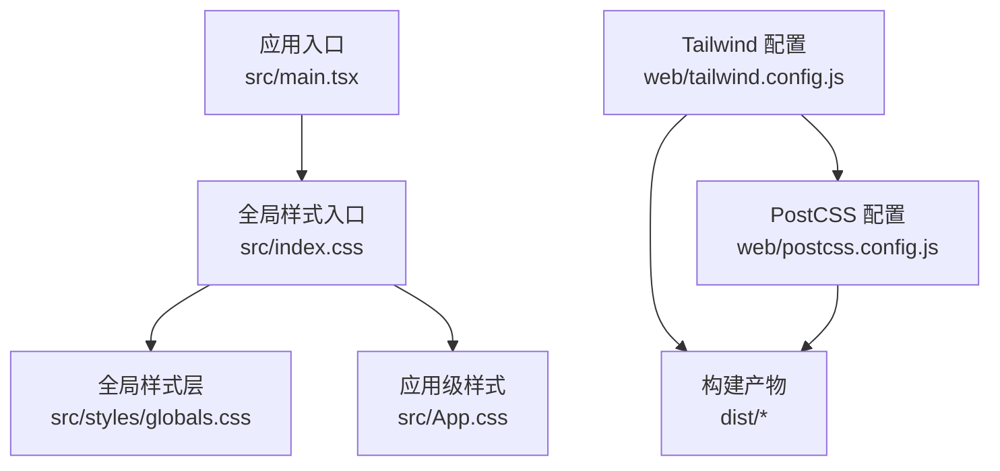
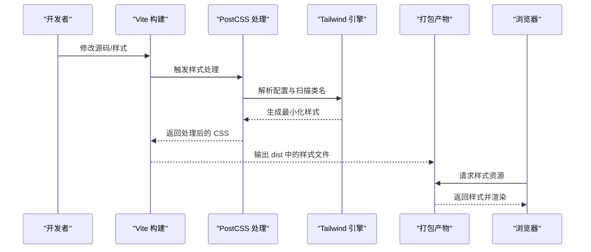
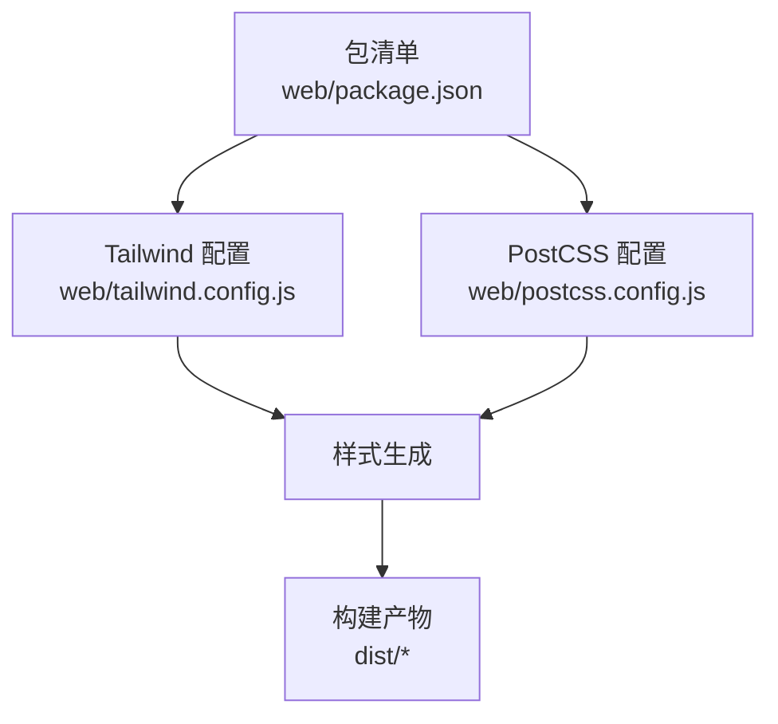

# 样式系统

<cite>
**本文引用的文件**   
- [tailwind.config.js](file://web/tailwind.config.js)
- [postcss.config.js](file://web/postcss.config.js)
- [globals.css](file://web/src/styles/globals.css)
- [index.css](file://web/src/index.css)
- [App.css](file://web/src/App.css)
- [main.tsx](file://web/src/main.tsx)
- [package.json](file://web/package.json)
</cite>

## 目录
1. [简介](#简介)
2. [项目结构](#项目结构)
3. [核心组件](#核心组件)
4. [架构总览](#架构总览)
5. [详细组件分析](#详细组件分析)
6. [依赖分析](#依赖分析)
7. [性能考虑](#性能考虑)
8. [故障排查指南](#故障排查指南)
9. [结论](#结论)
10. [附录](#附录)

## 简介
本样式系统文档面向 pj3 项目的 Web 前端，聚焦于基于 Tailwind CSS 的设计系统实现。内容涵盖主题配置、颜色体系、字体规范与间距标准；CSS 架构分层（全局、组件、页面）；响应式设计与断点策略；样式定制与扩展机制（自定义类名、插件、第三方集成）；CSS-in-JS 与传统 CSS 的混合使用策略；以及样式性能优化技巧（压缩、按需加载、隔离等）。同时提供设计令牌定义建议，统一颜色、字体、阴影等变量规范，确保团队一致性与可维护性。

## 项目结构
Web 端的样式相关资源主要分布在以下位置：
- 构建与工具链：Tailwind 与 PostCSS 配置文件位于 web 根目录
- 全局样式入口：src/styles/globals.css、src/index.css、src/App.css
- 应用入口：src/main.tsx 负责引入样式与初始化应用

图示来源
- [main.tsx:1-50](file://web/src/main.tsx#L1-L50)
- [index.css:1-50](file://web/src/index.css#L1-L50)
- [globals.css:1-50](file://web/src/styles/globals.css#L1-L50)
- [App.css:1-50](file://web/src/App.css#L1-L50)
- [tailwind.config.js:1-50](file://web/tailwind.config.js#L1-L50)
- [postcss.config.js:1-50](file://web/postcss.config.js#L1-L50)

章节来源
- [main.tsx:1-50](file://web/src/main.tsx#L1-L50)
- [index.css:1-50](file://web/src/index.css#L1-L50)
- [globals.css:1-50](file://web/src/styles/globals.css#L1-L50)
- [App.css:1-50](file://web/src/App.css#L1-L50)
- [tailwind.config.js:1-50](file://web/tailwind.config.js#L1-L50)
- [postcss.config.js:1-50](file://web/postcss.config.js#L1-L50)

## 核心组件
本节从“设计系统”的角度梳理样式系统的核心要素与职责边界：
- 主题配置中心：集中管理颜色、字体、间距、圆角、阴影等设计令牌，并通过 Tailwind 配置暴露为原子类
- 全局样式层：定义基础重置、排版基线、容器与布局约束、全局动画与过渡
- 组件样式层：以原子类组合为主，必要时补充少量局部样式用于复杂交互或状态
- 页面样式层：仅承载页面级布局与业务特定样式，避免污染全局与组件

章节来源
- [tailwind.config.js:1-50](file://web/tailwind.config.js#L1-L50)
- [globals.css:1-50](file://web/src/styles/globals.css#L1-L50)
- [index.css:1-50](file://web/src/index.css#L1-L50)
- [App.css:1-50](file://web/src/App.css#L1-L50)

## 架构总览
下图展示样式系统在构建与运行时的整体流程：Tailwind 通过 PostCSS 处理并生成最终样式；应用入口引入全局样式，组件与页面通过原子类组合完成渲染。

图示来源
- [postcss.config.js:1-50](file://web/postcss.config.js#L1-L50)
- [tailwind.config.js:1-50](file://web/tailwind.config.js#L1-L50)
- [main.tsx:1-50](file://web/src/main.tsx#L1-L50)

## 详细组件分析

### 主题与令牌（颜色、字体、间距、圆角、阴影）
- 颜色体系
  - 建议将品牌色、中性色、语义色（成功、警告、错误、信息）在主题中统一定义，并通过 Tailwind 配置映射到命名空间
  - 支持明暗模式时，可为同一令牌提供 light/dark 两套值
- 字体规范
  - 定义主字体族、备用字体族、字重阶梯、行高比例，并在主题中暴露为 token
  - 对标题、正文、辅助文本建立统一的字号与行高层级
- 间距与尺寸
  - 采用 4px 基准网格，定义 spacing token，保证视觉节奏一致
  - 圆角、阴影、透明度等视觉属性也应纳入令牌管理
- 导出方式
  - 通过 Tailwind 配置将令牌映射为可用类名，便于在 JSX 中直接使用
  - 对于需要跨语言复用的令牌，可在运行时导出常量供 JS 侧使用

章节来源
- [tailwind.config.js:1-50](file://web/tailwind.config.js#L1-L50)

### 全局样式（重置、排版、布局）
- 基础重置
  - 统一 box-sizing、默认边距、链接样式、列表样式等
- 排版基线
  - 设置根字体大小、行高、段落间距、标题层级
- 布局约束
  - 定义最大宽度、居中容器、栅格基础规则
- 全局动画与过渡
  - 提供常用缓动函数与过渡时长，保持交互一致性

章节来源
- [globals.css:1-50](file://web/src/styles/globals.css#L1-L50)
- [index.css:1-50](file://web/src/index.css#L1-L50)

### 组件样式（原子类组合 + 必要局部样式）
- 原则
  - 优先使用原子类组合表达样式意图，减少自定义 CSS
  - 仅在复杂交互、伪元素、选择器限制无法满足时引入局部样式
- 组织
  - 组件内样式尽量就近管理，避免全局污染
  - 通过命名空间或作用域避免冲突

章节来源
- [App.css:1-50](file://web/src/App.css#L1-L50)

### 页面样式（业务布局与页面专属）
- 原则
  - 页面级样式仅承载布局与业务特定表现，不侵入组件与全局
- 组织
  - 按页面划分样式文件，配合路由懒加载实现按需加载

章节来源
- [main.tsx:1-50](file://web/src/main.tsx#L1-L50)

### 响应式设计策略（移动端适配与断点）
- 断点策略
  - 基于移动优先原则，先写小屏样式，再通过断点逐步增强大屏体验
  - 在主题中定义一致的断点集合，避免散乱数值
- 布局适配
  - 使用弹性布局与栅格类进行自适应排列
  - 图片、图表等媒体资源采用相对单位与缩放策略
- 交互适配
  - 针对触摸设备调整点击区域与反馈效果

章节来源
- [tailwind.config.js:1-50](file://web/tailwind.config.js#L1-L50)

### 样式定制与扩展（自定义类名、插件、第三方集成）
- 自定义类名
  - 通过主题扩展与配置别名，创建领域内的高阶类名
- 插件开发
  - 封装通用交互或复杂组件为 Tailwind 插件，提升复用度
- 第三方样式集成
  - 通过 PostCSS 管线引入第三方库，注意优先级与作用域控制

章节来源
- [postcss.config.js:1-50](file://web/postcss.config.js#L1-L50)
- [tailwind.config.js:1-50](file://web/tailwind.config.js#L1-L50)

### CSS-in-JS 与传统 CSS 的选择与混合策略
- 选择考量
  - 传统 CSS（含 Tailwind）适合静态主题、批量生成与构建期优化
  - CSS-in-JS 适合动态主题切换、运行时计算与强耦合组件状态
- 混合策略
  - 以 Tailwind 作为基础样式框架，CSS-in-JS 仅用于动态场景
  - 通过构建工具将两者合并，确保最终产物体积可控

章节来源
- [main.tsx:1-50](file://web/src/main.tsx#L1-L50)

## 依赖分析
样式系统的关键依赖包括 Tailwind CSS、PostCSS 及构建工具链。它们在 package.json 中声明，并由 postcss.config.js 与 tailwind.config.js 驱动。

图示来源
- [package.json:1-50](file://web/package.json#L1-L50)
- [tailwind.config.js:1-50](file://web/tailwind.config.js#L1-L50)
- [postcss.config.js:1-50](file://web/postcss.config.js#L1-L50)

章节来源
- [package.json:1-50](file://web/package.json#L1-L50)
- [tailwind.config.js:1-50](file://web/tailwind.config.js#L1-L50)
- [postcss.config.js:1-50](file://web/postcss.config.js#L1-L50)

## 性能考虑
- 构建期优化
  - 启用 Purge/Tree-shaking，仅保留实际使用的类名，减小 CSS 体积
  - 开启 CSS 压缩与 Source Map 按需生成
- 运行时优化
  - 按需加载页面与组件样式，避免首屏冗余
  - 合理使用缓存与 CDN，缩短传输时间
- 样式隔离
  - 组件样式尽量作用域化，避免全局覆盖导致的回退成本
- 可观测性
  - 监控样式体积变化与关键指标，持续回归

[本节为通用指导，无需列出具体文件来源]

## 故障排查指南
- 样式未生效
  - 检查入口是否正确引入全局样式
  - 确认 Tailwind 扫描路径包含所有使用类名的文件
- 主题变量无效
  - 核对主题键名与配置映射是否一致
  - 确认构建后产物是否更新
- 第三方样式冲突
  - 调整引入顺序与优先级
  - 使用更具体的选择器或命名空间隔离
- 构建失败
  - 检查 PostCSS 插件版本兼容
  - 清理缓存并重试构建

章节来源
- [postcss.config.js:1-50](file://web/postcss.config.js#L1-L50)
- [tailwind.config.js:1-50](file://web/tailwind.config.js#L1-L50)
- [main.tsx:1-50](file://web/src/main.tsx#L1-L50)

## 结论
本样式系统以 Tailwind CSS 为核心，结合 PostCSS 构建管线，形成“主题令牌—全局样式—组件样式—页面样式”的分层架构。通过移动优先的响应式策略与严格的样式组织规范，兼顾了可维护性与性能。未来可进一步沉淀设计令牌与插件生态，完善自动化测试与可视化校验，持续提升团队协作效率与用户体验。

[本节为总结性内容，无需列出具体文件来源]

## 附录

### 设计令牌清单（建议）
- 颜色
  - 品牌色：主色、辅色、强调色
  - 中性色：灰阶系列
  - 语义色：成功、警告、错误、信息
- 字体
  - 字体族：主字体、备用字体
  - 字重阶梯：常规、中等、加粗
  - 字号与行高：标题、正文、辅助
- 间距与尺寸
  - 间距刻度：4px 基准
  - 圆角：小、中、大、全圆
  - 阴影：轻、中、重
- 断点
  - 小屏、平板、桌面、超大屏

[本节为概念性说明，无需列出具体文件来源]