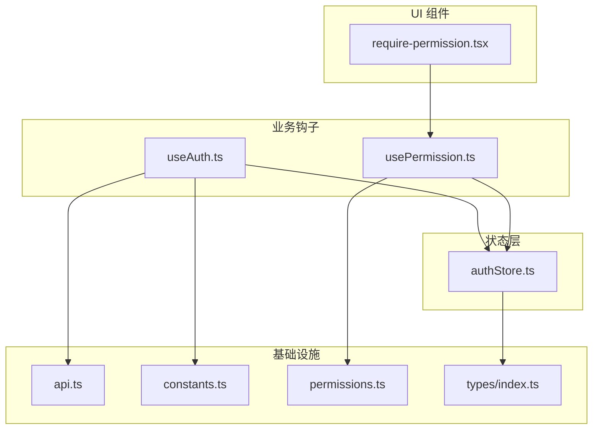
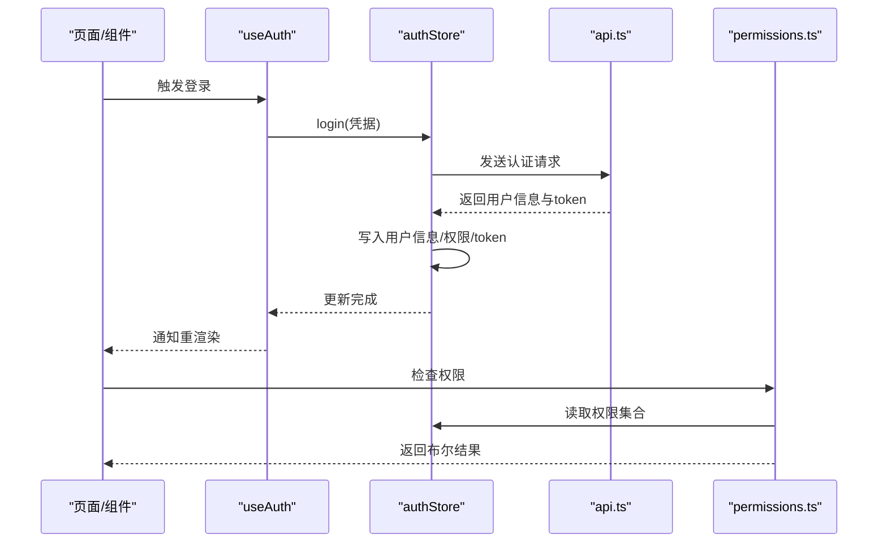
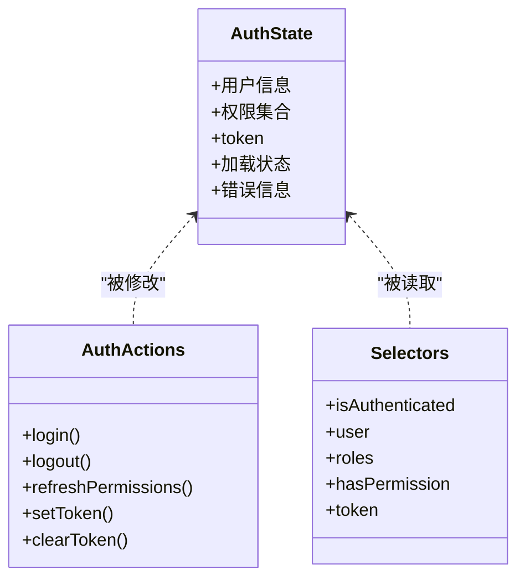
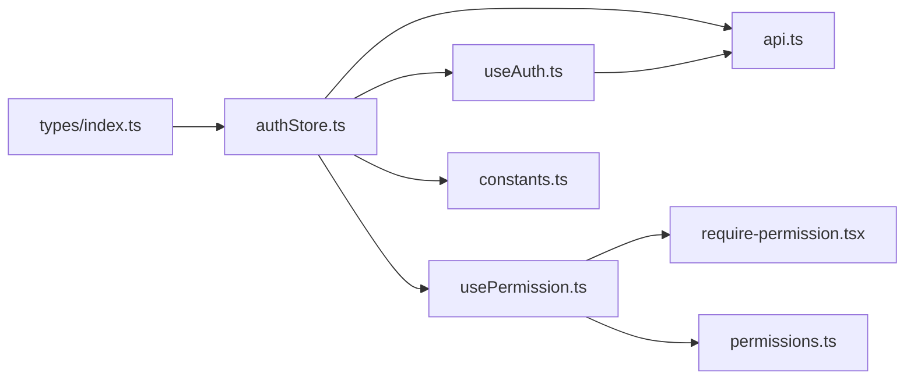
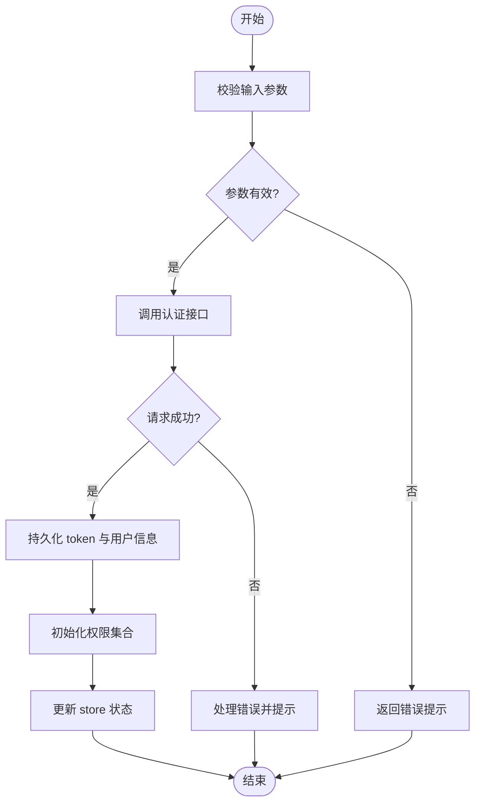

# Zustand Store设计

<cite>
**本文引用的文件**   
- [authStore.ts](file://web/src/stores/authStore.ts)
- [useAuth.ts](file://web/src/hooks/useAuth.ts)
- [usePermission.ts](file://web/src/hooks/usePermission.ts)
- [require-permission.tsx](file://web/src/components/layout/require-permission.tsx)
- [api.ts](file://web/src/lib/api.ts)
- [constants.ts](file://web/src/lib/constants.ts)
- [permissions.ts](file://web/src/lib/permissions.ts)
- [index.ts](file://web/src/types/index.ts)
</cite>

## 目录
1. [简介](#简介)
2. [项目结构](#项目结构)
3. [核心组件](#核心组件)
4. [架构总览](#架构总览)
5. [详细组件分析](#详细组件分析)
6. [依赖分析](#依赖分析)
7. [性能考虑](#性能考虑)
8. [故障排查指南](#故障排查指南)
9. [结论](#结论)
10. [附录](#附录)

## 简介
本设计文档围绕 pj3 项目的认证状态管理，聚焦于基于 Zustand 的 authStore 实现。文档从状态定义、action 方法、选择器模式入手，深入解析用户认证状态的存储结构（用户信息、权限数据、会话 token），并阐述 store 的模块化设计原则（状态分割、命名空间组织、依赖管理）。同时介绍中间件的使用方式（如持久化中间件的配置与自定义中间件思路），并提供最佳实践（状态更新模式、错误处理、性能优化）以及使用场景示例。

## 项目结构
与认证相关的代码主要分布在以下位置：
- 状态层：stores/authStore.ts
- 业务钩子：hooks/useAuth.ts、hooks/usePermission.ts
- 权限控制组件：components/layout/require-permission.tsx
- 网络与常量：lib/api.ts、lib/constants.ts、lib/permissions.ts
- 类型定义：types/index.ts

图表来源
- [authStore.ts](file://web/src/stores/authStore.ts)
- [useAuth.ts](file://web/src/hooks/useAuth.ts)
- [usePermission.ts](file://web/src/hooks/usePermission.ts)
- [require-permission.tsx](file://web/src/components/layout/require-permission.tsx)
- [api.ts](file://web/src/lib/api.ts)
- [constants.ts](file://web/src/lib/constants.ts)
- [permissions.ts](file://web/src/lib/permissions.ts)
- [index.ts](file://web/src/types/index.ts)

章节来源
- [authStore.ts](file://web/src/stores/authStore.ts)
- [useAuth.ts](file://web/src/hooks/useAuth.ts)
- [usePermission.ts](file://web/src/hooks/usePermission.ts)
- [require-permission.tsx](file://web/src/components/layout/require-permission.tsx)
- [api.ts](file://web/src/lib/api.ts)
- [constants.ts](file://web/src/lib/constants.ts)
- [permissions.ts](file://web/src/lib/permissions.ts)
- [index.ts](file://web/src/types/index.ts)

## 核心组件
- authStore：集中式认证状态容器，包含用户信息、权限集合、token 等字段，提供登录、登出、刷新权限等 action，并通过选择器暴露细粒度订阅。
- useAuth：封装对 authStore 的常用操作，简化组件中的调用，统一错误处理与副作用。
- usePermission：基于权限数据计算当前用户是否具备某权限或角色，供页面与路由守卫使用。
- require-permission：高阶组件，用于在渲染前进行权限校验与拦截。

章节来源
- [authStore.ts](file://web/src/stores/authStore.ts)
- [useAuth.ts](file://web/src/hooks/useAuth.ts)
- [usePermission.ts](file://web/src/hooks/usePermission.ts)
- [require-permission.tsx](file://web/src/components/layout/require-permission.tsx)

## 架构总览
认证流程的关键交互如下：

图表来源
- [useAuth.ts](file://web/src/hooks/useAuth.ts)
- [authStore.ts](file://web/src/stores/authStore.ts)
- [api.ts](file://web/src/lib/api.ts)
- [permissions.ts](file://web/src/lib/permissions.ts)

## 详细组件分析

### authStore 设计与实现
- 状态定义
  - 用户信息：包含用户标识、基础资料等。
  - 权限数据：以集合形式存储，便于快速判断。
  - 会话 token：保存访问令牌，必要时支持刷新逻辑。
  - 加载与错误状态：用于 UI 反馈与异常分支。
- Action 方法
  - 登录：校验输入、发起请求、落盘 token、初始化权限、更新用户信息。
  - 登出：清理本地 token、重置用户与权限、恢复初始状态。
  - 刷新权限：根据当前用户重新拉取权限集合并更新。
  - 设置/清除 token：供其他模块直接操作 token 时使用。
- 选择器模式
  - 通过选择器将大对象拆分为最小订阅单元，避免无关组件重渲染。
  - 典型选择器包括：isAuthenticated、user、roles、hasPermission、token。
- 中间件
  - 持久化：可将 token 与必要用户信息持久到 localStorage/sessionStorage，并在应用启动时恢复。
  - 自定义中间件：可记录日志、统计指标、或在状态变更前后执行副作用。

图表来源
- [authStore.ts](file://web/src/stores/authStore.ts)
- [index.ts](file://web/src/types/index.ts)

章节来源
- [authStore.ts](file://web/src/stores/authStore.ts)
- [index.ts](file://web/src/types/index.ts)

### useAuth 钩子
- 职责
  - 封装登录、登出、刷新权限等动作，统一错误处理与 loading 状态。
  - 提供便捷的选择器组合，减少组件中重复的 store 订阅逻辑。
- 使用建议
  - 在表单提交处调用登录；在退出按钮处调用登出。
  - 结合路由守卫在受保护页面入口进行鉴权检查。

章节来源
- [useAuth.ts](file://web/src/hooks/useAuth.ts)

### usePermission 钩子
- 职责
  - 基于权限集合计算当前用户是否拥有指定权限或角色。
  - 提供缓存与记忆化能力，避免重复计算。
- 使用建议
  - 在页面级或菜单项渲染时调用，决定可见性与可操作态。

章节来源
- [usePermission.ts](file://web/src/hooks/usePermission.ts)

### require-permission 组件
- 职责
  - 作为高阶组件，在渲染前进行权限校验，不满足条件时显示占位或跳转。
- 使用建议
  - 包裹需要权限控制的页面或区块，配合路由守卫形成双重保障。

章节来源
- [require-permission.tsx](file://web/src/components/layout/require-permission.tsx)

### 网络与权限工具
- api.ts
  - 负责 HTTP 请求封装，统一处理鉴权头、错误码与重试策略。
- permissions.ts
  - 提供权限判定工具函数，与 store 的权限集合协作。
- constants.ts
  - 集中管理接口路径、默认值、错误码等常量。

章节来源
- [api.ts](file://web/src/lib/api.ts)
- [permissions.ts](file://web/src/lib/permissions.ts)
- [constants.ts](file://web/src/lib/constants.ts)

## 依赖分析
- 低耦合高内聚
  - authStore 仅依赖类型定义与必要的工具函数，避免直接耦合 UI。
  - useAuth/usePermission 作为薄封装层，屏蔽 store 细节，提升可读性。
- 外部依赖
  - 网络层 api.ts 与权限工具 permissions.ts 为认证流程的关键支撑。
- 可能的循环依赖
  - 确保 hooks 不反向导入 store 的实现细节，保持单向依赖。

图表来源
- [authStore.ts](file://web/src/stores/authStore.ts)
- [useAuth.ts](file://web/src/hooks/useAuth.ts)
- [usePermission.ts](file://web/src/hooks/usePermission.ts)
- [require-permission.tsx](file://web/src/components/layout/require-permission.tsx)
- [api.ts](file://web/src/lib/api.ts)
- [permissions.ts](file://web/src/lib/permissions.ts)
- [constants.ts](file://web/src/lib/constants.ts)
- [index.ts](file://web/src/types/index.ts)

章节来源
- [authStore.ts](file://web/src/stores/authStore.ts)
- [useAuth.ts](file://web/src/hooks/useAuth.ts)
- [usePermission.ts](file://web/src/hooks/usePermission.ts)
- [require-permission.tsx](file://web/src/components/layout/require-permission.tsx)
- [api.ts](file://web/src/lib/api.ts)
- [permissions.ts](file://web/src/lib/permissions.ts)
- [constants.ts](file://web/src/lib/constants.ts)
- [index.ts](file://web/src/types/index.ts)

## 性能考虑
- 选择器粒度
  - 按字段拆分选择器，避免整块状态变化导致大面积重渲染。
- 记忆化
  - 对复杂计算（如权限判定）使用记忆化，减少重复运算。
- 批量更新
  - 在一次 action 中合并多次状态更新，降低渲染次数。
- 懒加载
  - 仅在需要时加载敏感或大型数据（如完整用户画像），其余时间只保留必要字段。
- 中间件开销
  - 持久化中间件应做节流与增量写入，避免频繁 I/O。

[本节为通用指导，无需列出具体文件来源]

## 故障排查指南
- 常见问题
  - Token 未持久化：检查持久化中间件配置与存储键名。
  - 权限不生效：确认权限集合是否正确初始化与刷新。
  - 登录成功但页面仍提示未登录：检查选择器订阅与路由守卫逻辑。
- 定位步骤
  - 在登录 action 前后打印关键状态快照。
  - 在 API 层捕获并上报错误码与响应体摘要。
  - 在权限判定处输出当前权限集合与目标权限对比。

章节来源
- [authStore.ts](file://web/src/stores/authStore.ts)
- [api.ts](file://web/src/lib/api.ts)
- [usePermission.ts](file://web/src/hooks/usePermission.ts)

## 结论
authStore 采用清晰的状态分层与选择器模式，结合 useAuth/usePermission 等薄封装钩子，实现了高内聚、低耦合的认证状态管理。通过合理的中间件与错误处理策略，系统具备良好的可维护性与可扩展性。建议在后续迭代中持续细化选择器粒度、完善权限模型与监控埋点，进一步提升用户体验与稳定性。

[本节为总结性内容，无需列出具体文件来源]

## 附录

### 状态更新流程图（登录）

图表来源
- [authStore.ts](file://web/src/stores/authStore.ts)
- [api.ts](file://web/src/lib/api.ts)

### 使用场景示例（描述性）
- 登录页
  - 用户在登录页输入账号密码后，调用 useAuth 的登录方法，成功后跳转到仪表盘。
- 受保护页面
  - 页面入口处使用 require-permission 或 usePermission 进行权限校验，无权限则跳转至未授权页。
- 侧边栏菜单
  - 根据用户角色与权限动态渲染菜单项，隐藏不可见功能。

[本节为概念性说明，无需列出具体文件来源]