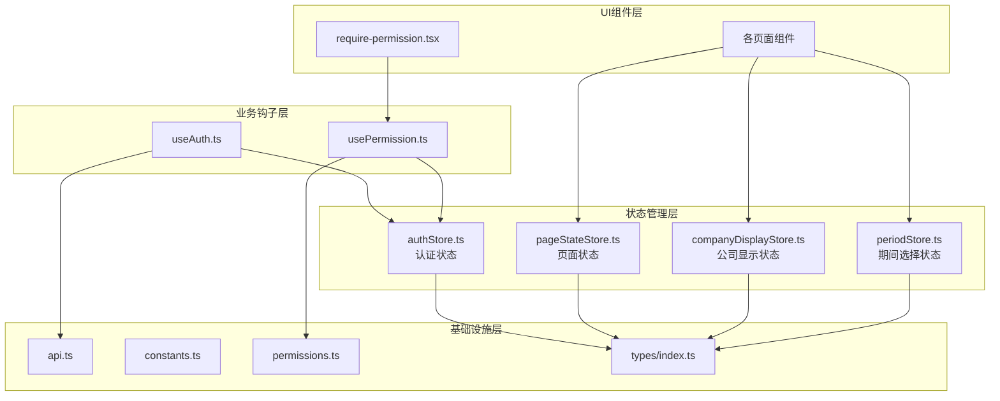
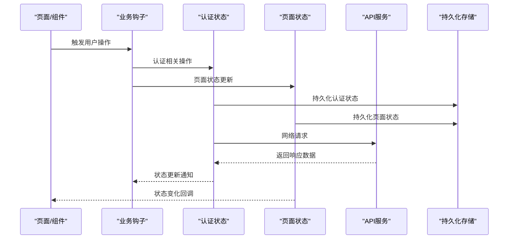
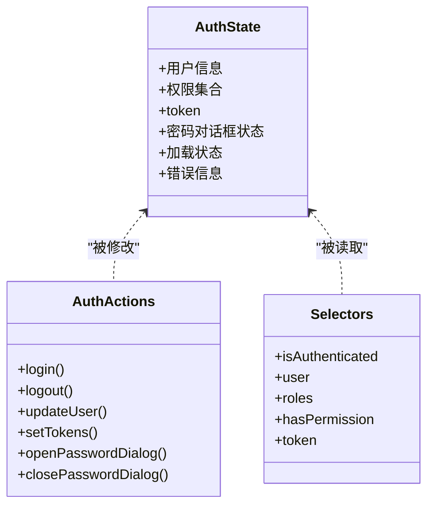
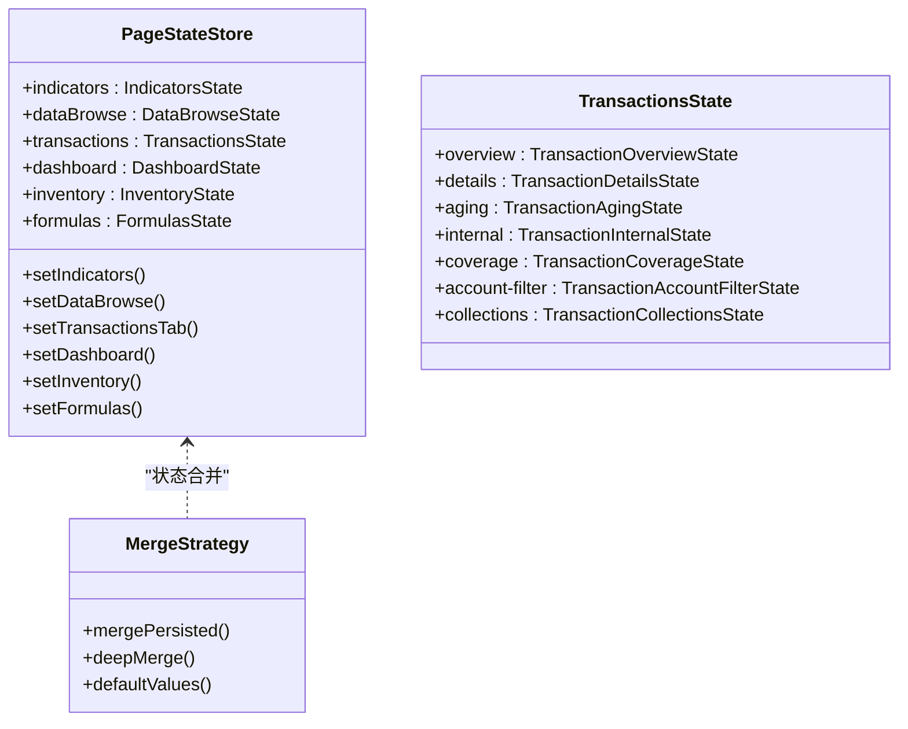
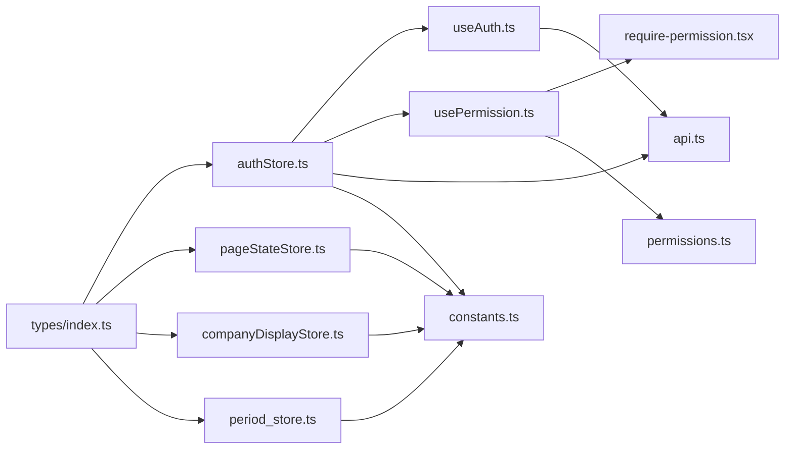
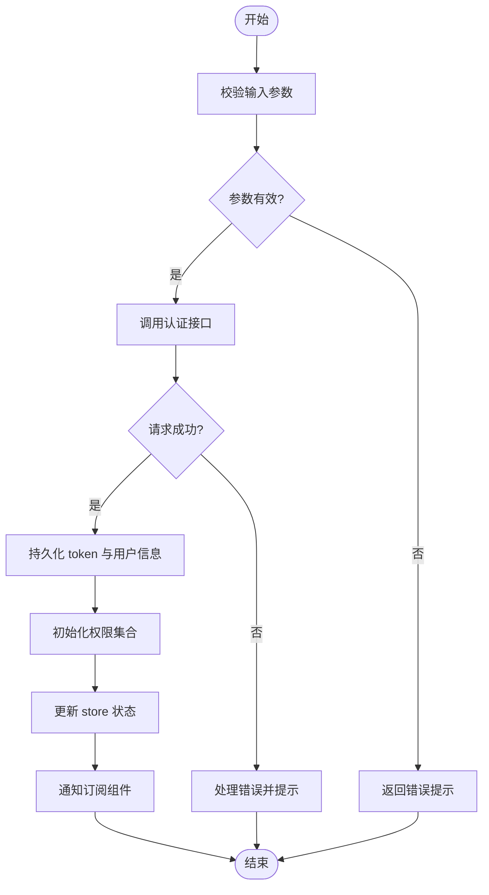
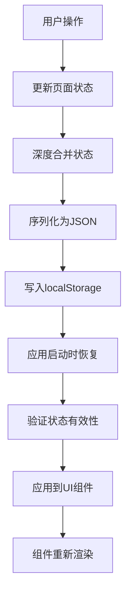

# Zustand Store设计

<cite>
**本文引用的文件**   
- [authStore.ts](file://web/src/stores/authStore.ts)
- [pageStateStore.ts](file://web/src/stores/pageStateStore.ts)
- [companyDisplayStore.ts](file://web/src/stores/companyDisplayStore.ts)
- [periodStore.ts](file://web/src/stores/periodStore.ts)
- [useAuth.ts](file://web/src/hooks/useAuth.ts)
- [usePermission.ts](file://web/src/hooks/usePermission.ts)
- [require-permission.tsx](file://web/src/components/layout/require-permission.tsx)
- [api.ts](file://web/src/lib/api.ts)
- [constants.ts](file://web/src/lib/constants.ts)
- [permissions.ts](file://web/src/lib/permissions.ts)
- [index.ts](file://web/src/types/index.ts)
</cite>

## 更新摘要
**变更内容**   
- 新增页面状态持久化系统 pageStateStore.ts，实现多应用页面的Zustand持久化状态管理
- 扩展认证状态管理架构，整合多个store模块的统一管理模式
- 完善中间件使用模式，统一localStorage持久化策略
- 增强状态分割与命名空间组织原则

## 目录
1. [简介](#简介)
2. [项目结构](#项目结构)
3. [核心组件](#核心组件)
4. [架构总览](#架构总览)
5. [详细组件分析](#详细组件分析)
6. [依赖分析](#依赖分析)
7. [性能考虑](#性能考虑)
8. [故障排查指南](#故障排查指南)
9. [结论](#结论)
10. [附录](#附录)

## 简介
本设计文档围绕 pj3 项目的状态管理系统，聚焦于基于 Zustand 的 store 架构实现。文档从认证状态管理、页面状态持久化、全局状态分割等维度入手，深入解析用户认证状态的存储结构（用户信息、权限数据、会话 token）以及多页面查询条件与视图状态的持久化管理机制。阐述 store 的模块化设计原则（状态分割、命名空间组织、依赖管理），介绍中间件的统一使用模式（持久化中间件的配置与自定义中间件思路），并提供最佳实践（状态更新模式、错误处理、性能优化）以及使用场景示例。

## 项目结构
与状态管理相关的代码主要分布在以下位置：
- 认证状态层：stores/authStore.ts
- 页面状态层：stores/pageStateStore.ts
- 全局显示状态：stores/companyDisplayStore.ts
- 期间选择状态：stores/periodStore.ts
- 业务钩子：hooks/useAuth.ts、hooks/usePermission.ts
- 权限控制组件：components/layout/require-permission.tsx
- 网络与常量：lib/api.ts、lib/constants.ts、lib/permissions.ts
- 类型定义：types/index.ts

图表来源
- [authStore.ts](file://web/src/stores/authStore.ts)
- [pageStateStore.ts](file://web/src/stores/pageStateStore.ts)
- [companyDisplayStore.ts](file://web/src/stores/companyDisplayStore.ts)
- [periodStore.ts](file://web/src/stores/periodStore.ts)
- [useAuth.ts](file://web/src/hooks/useAuth.ts)
- [usePermission.ts](file://web/src/hooks/usePermission.ts)
- [require-permission.tsx](file://web/src/components/layout/require-permission.tsx)
- [api.ts](file://web/src/lib/api.ts)
- [constants.ts](file://web/src/lib/constants.ts)
- [permissions.ts](file://web/src/lib/permissions.ts)
- [index.ts](file://web/src/types/index.ts)

章节来源
- [authStore.ts](file://web/src/stores/authStore.ts)
- [pageStateStore.ts](file://web/src/stores/pageStateStore.ts)
- [companyDisplayStore.ts](file://web/src/stores/companyDisplayStore.ts)
- [periodStore.ts](file://web/src/stores/periodStore.ts)
- [useAuth.ts](file://web/src/hooks/useAuth.ts)
- [usePermission.ts](file://web/src/hooks/usePermission.ts)
- [require-permission.tsx](file://web/src/components/layout/require-permission.tsx)
- [api.ts](file://web/src/lib/api.ts)
- [constants.ts](file://web/src/lib/constants.ts)
- [permissions.ts](file://web/src/lib/permissions.ts)
- [index.ts](file://web/src/types/index.ts)

## 核心组件
- authStore：集中式认证状态容器，包含用户信息、权限集合、token 等字段，提供登录、登出、刷新权限等 action，并通过选择器暴露细粒度订阅。
- pageStateStore：全面的页面状态持久化系统，管理仪表盘、数据浏览、交易、指标、库存和公式维护等多个应用的查询条件与视图状态。
- companyDisplayStore：全局公司简称显示状态管理，支持跨组件的公司名称显示格式切换。
- periodStore：全局财年选择状态管理，提供期间过滤工具函数。
- useAuth：封装对 authStore 的常用操作，简化组件中的调用，统一错误处理与副作用。
- usePermission：基于权限数据计算当前用户是否具备某权限或角色，供页面与路由守卫使用。
- require-permission：高阶组件，用于在渲染前进行权限校验与拦截。

章节来源
- [authStore.ts](file://web/src/stores/authStore.ts)
- [pageStateStore.ts](file://web/src/stores/pageStateStore.ts)
- [companyDisplayStore.ts](file://web/src/stores/companyDisplayStore.ts)
- [periodStore.ts](file://web/src/stores/periodStore.ts)
- [useAuth.ts](file://web/src/hooks/useAuth.ts)
- [usePermission.ts](file://web/src/hooks/usePermission.ts)
- [require-permission.tsx](file://web/src/components/layout/require-permission.tsx)

## 架构总览
状态管理的整体交互流程如下：

图表来源
- [authStore.ts](file://web/src/stores/authStore.ts)
- [pageStateStore.ts](file://web/src/stores/pageStateStore.ts)
- [useAuth.ts](file://web/src/hooks/useAuth.ts)
- [api.ts](file://web/src/lib/api.ts)

## 详细组件分析

### authStore 设计与实现
- 状态定义
  - 用户信息：包含用户标识、基础资料等。
  - 权限数据：以集合形式存储，便于快速判断。
  - 会话 token：保存访问令牌，必要时支持刷新逻辑。
  - 加载与错误状态：用于 UI 反馈与异常分支。
  - 密码对话框状态：支持强制改密模式的对话框管理。
- Action 方法
  - 登录：校验输入、发起请求、落盘 token、初始化权限、更新用户信息。
  - 登出：清理本地 token、重置用户与权限、恢复初始状态。
  - 更新用户信息：支持部分字段更新。
  - 设置/清除 token：供其他模块直接操作 token 时使用。
  - 密码对话框控制：打开/关闭改密对话框，支持强制模式。
- 中间件
  - 持久化：将用户信息、token 和认证状态持久到 localStorage，并在应用启动时恢复。

图表来源
- [authStore.ts](file://web/src/stores/authStore.ts)
- [index.ts](file://web/src/types/index.ts)

章节来源
- [authStore.ts](file://web/src/stores/authStore.ts)
- [index.ts](file://web/src/types/index.ts)

### pageStateStore 页面状态持久化系统
- 设计理念
  - 统一管理多个应用页面的查询条件与视图状态
  - 支持路由切换和页面刷新后的状态自动恢复
  - 区分持久化状态与瞬时状态的管理边界
- 支持的页面状态
  - 指标分析：维度筛选、期间筛选、排除重分类、科目展开状态
  - 数据浏览：公司多选、期间选择、科目类型、行展开状态
  - 交易概览：公司选择、期间跟随、趋势筛选配置
  - 交易明细：分页、公司、期间、类型、科目、往来方、关键词
  - 账龄分析：公司、期间、类型、科目、往来方、分组方式
  - 内部交易：公司筛选
  - 覆盖率分析：月份窗口配置
  - 账户筛选：显示全部科目开关
  - 收款管理：分页、公司、状态、关键词
  - 仪表盘：期间、维度、趋势指标
  - 库存管理：公司多选、期间选择
  - 公式维护：科目类型、关键词、分类、状态、分页
- 状态合并策略
  - 深合并持久化值，缺字段用默认值补全
  - 支持结构演进时的安全升级
  - 嵌套对象（如 transactions.trend）的深度合并

图表来源
- [pageStateStore.ts](file://web/src/stores/pageStateStore.ts)

章节来源
- [pageStateStore.ts](file://web/src/stores/pageStateStore.ts)

### 全局状态管理组件
- companyDisplayStore
  - 管理公司简称显示的全局开关
  - 支持跨组件的名称显示格式同步
  - 简单的布尔状态持久化
- periodStore
  - 管理全局财年选择状态
  - 提供期间过滤工具函数
  - 支持财年与期间的关联计算

章节来源
- [companyDisplayStore.ts](file://web/src/stores/companyDisplayStore.ts)
- [periodStore.ts](file://web/src/stores/periodStore.ts)

### useAuth 钩子
- 职责
  - 封装登录、登出、刷新权限等动作，统一错误处理与 loading 状态。
  - 提供便捷的选择器组合，减少组件中重复的 store 订阅逻辑。
- 使用建议
  - 在表单提交处调用登录；在退出按钮处调用登出。
  - 结合路由守卫在受保护页面入口进行鉴权检查。

章节来源
- [useAuth.ts](file://web/src/hooks/useAuth.ts)

### usePermission 钩子
- 职责
  - 基于权限集合计算当前用户是否拥有指定权限或角色。
  - 提供缓存与记忆化能力，避免重复计算。
- 使用建议
  - 在页面级或菜单项渲染时调用，决定可见性与可操作态。

章节来源
- [usePermission.ts](file://web/src/hooks/usePermission.ts)

### require-permission 组件
- 职责
  - 作为高阶组件，在渲染前进行权限校验，不满足条件时显示占位或跳转。
- 使用建议
  - 包裹需要权限控制的页面或区块，配合路由守卫形成双重保障。

章节来源
- [require-permission.tsx](file://web/src/components/layout/require-permission.tsx)

### 网络与权限工具
- api.ts
  - 负责 HTTP 请求封装，统一处理鉴权头、错误码与重试策略。
- permissions.ts
  - 提供权限判定工具函数，与 store 的权限集合协作。
- constants.ts
  - 集中管理接口路径、默认值、错误码等常量。

章节来源
- [api.ts](file://web/src/lib/api.ts)
- [permissions.ts](file://web/src/lib/permissions.ts)
- [constants.ts](file://web/src/lib/constants.ts)

## 依赖分析
- 低耦合高内聚
  - 各 store 模块独立管理各自的状态领域，避免状态交叉污染。
  - useAuth/usePermission 作为薄封装层，屏蔽 store 细节，提升可读性。
  - pageStateStore 通过统一的命名空间和 action 模式管理复杂的状态结构。
- 外部依赖
  - 网络层 api.ts 与权限工具 permissions.ts 为认证流程的关键支撑。
  - zustand/middleware 提供统一的持久化能力。
- 可能的循环依赖
  - 确保 hooks 不反向导入 store 的实现细节，保持单向依赖。

图表来源
- [authStore.ts](file://web/src/stores/authStore.ts)
- [pageStateStore.ts](file://web/src/stores/pageStateStore.ts)
- [companyDisplayStore.ts](file://web/src/stores/companyDisplayStore.ts)
- [periodStore.ts](file://web/src/stores/periodStore.ts)
- [useAuth.ts](file://web/src/hooks/useAuth.ts)
- [usePermission.ts](file://web/src/hooks/usePermission.ts)
- [require-permission.tsx](file://web/src/components/layout/require-permission.tsx)
- [api.ts](file://web/src/lib/api.ts)
- [permissions.ts](file://web/src/lib/permissions.ts)
- [constants.ts](file://web/src/lib/constants.ts)
- [index.ts](file://web/src/types/index.ts)

章节来源
- [authStore.ts](file://web/src/stores/authStore.ts)
- [pageStateStore.ts](file://web/src/stores/pageStateStore.ts)
- [companyDisplayStore.ts](file://web/src/stores/companyDisplayStore.ts)
- [periodStore.ts](file://web/src/stores/periodStore.ts)
- [useAuth.ts](file://web/src/hooks/useAuth.ts)
- [usePermission.ts](file://web/src/hooks/usePermission.ts)
- [require-permission.tsx](file://web/src/components/layout/require-permission.tsx)
- [api.ts](file://web/src/lib/api.ts)
- [permissions.ts](file://web/src/lib/permissions.ts)
- [constants.ts](file://web/src/lib/constants.ts)
- [index.ts](file://web/src/types/index.ts)

## 性能考虑
- 选择器粒度
  - 按字段拆分选择器，避免整块状态变化导致大面积重渲染。
  - pageStateStore 通过细粒度的 setXxx 方法实现精准状态更新。
- 记忆化
  - 对复杂计算（如权限判定、期间过滤）使用记忆化，减少重复运算。
- 批量更新
  - 在一次 action 中合并多次状态更新，降低渲染次数。
  - pageStateStore 的 deep merge 策略避免不必要的状态重建。
- 懒加载
  - 仅在需要时加载敏感或大型数据（如完整用户画像），其余时间只保留必要字段。
- 中间件开销
  - 持久化中间件应做节流与增量写入，避免频繁 I/O。
  - 合理配置 partialize 只序列化必要的状态字段。
- 状态分割
  - 将认证状态、页面状态、全局状态分离，减少状态树大小。
  - 使用命名空间组织相关状态，提高可维护性。

## 故障排查指南
- 常见问题
  - Token 未持久化：检查持久化中间件配置与存储键名。
  - 权限不生效：确认权限集合是否正确初始化与刷新。
  - 登录成功但页面仍提示未登录：检查选择器订阅与路由守卫逻辑。
  - 页面状态丢失：验证 pageStateStore 的 merge 函数配置是否正确。
  - 状态版本冲突：检查 persist 中间件的 version 配置。
- 定位步骤
  - 在登录 action 前后打印关键状态快照。
  - 在 API 层捕获并上报错误码与响应体摘要。
  - 在权限判定处输出当前权限集合与目标权限对比。
  - 使用浏览器开发者工具检查 localStorage 中的状态数据。
  - 验证状态合并函数的深度合并逻辑。

章节来源
- [authStore.ts](file://web/src/stores/authStore.ts)
- [pageStateStore.ts](file://web/src/stores/pageStateStore.ts)
- [api.ts](file://web/src/lib/api.ts)
- [usePermission.ts](file://web/src/hooks/usePermission.ts)

## 结论
pj3 项目的 Zustand Store 架构采用了清晰的状态分层与模块化设计，通过 authStore 实现认证状态管理，pageStateStore 实现全面的页面状态持久化，配合 companyDisplayStore 和 periodStore 完成全局状态管理。这种设计实现了高内聚、低耦合的状态管理体系，通过统一的中间件模式和选择器模式，具备良好的可维护性与可扩展性。建议在后续迭代中持续细化选择器粒度、完善权限模型与监控埋点，进一步提升用户体验与稳定性。

## 附录

### 状态更新流程图（认证流程）

图表来源
- [authStore.ts](file://web/src/stores/authStore.ts)
- [api.ts](file://web/src/lib/api.ts)

### 页面状态持久化流程图

图表来源
- [pageStateStore.ts](file://web/src/stores/pageStateStore.ts)

### 使用场景示例（描述性）
- 登录页
  - 用户在登录页输入账号密码后，调用 useAuth 的登录方法，成功后跳转到仪表盘。
- 受保护页面
  - 页面入口处使用 require-permission 或 usePermission 进行权限校验，无权限则跳转至未授权页。
- 侧边栏菜单
  - 根据用户角色与权限动态渲染菜单项，隐藏不可见功能。
- 数据浏览页面
  - 用户设置的筛选条件、分页状态、展开的行等在页面刷新后自动恢复。
- 交易分析页面
  - 各个标签页的查询条件独立持久化，支持复杂的筛选组合。
- 仪表盘页面
  - 期间选择、维度筛选、趋势指标等配置状态持久化保存。

[本节为概念性说明，无需列出具体文件来源]