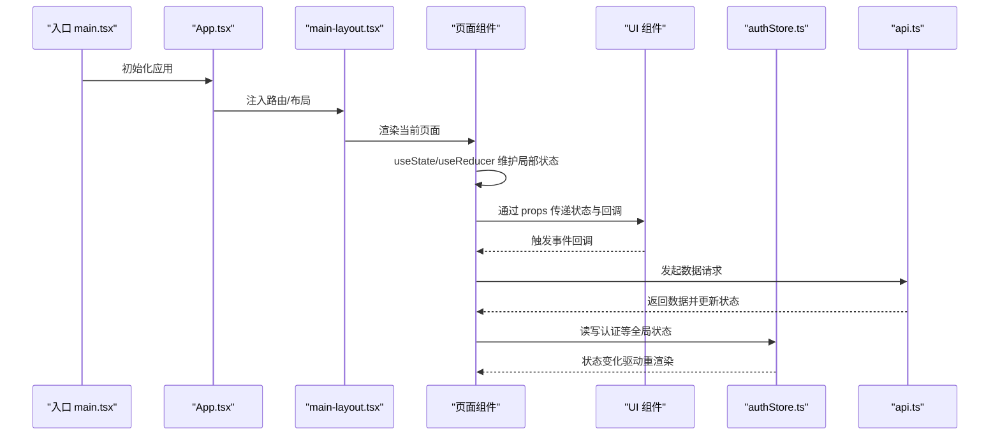
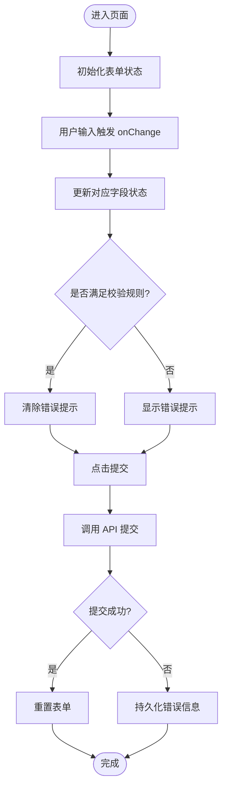
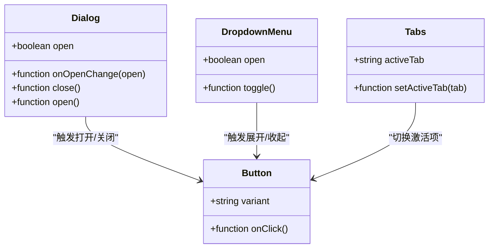
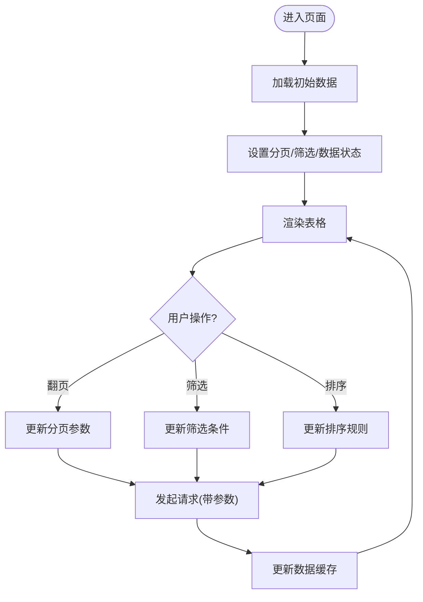
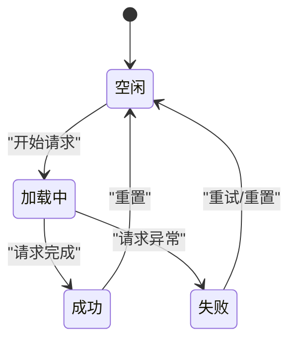
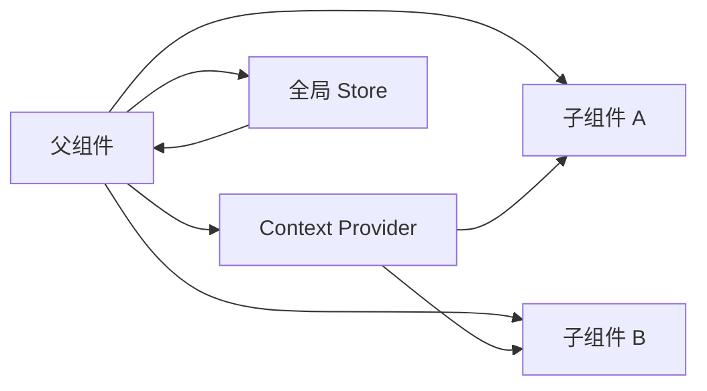
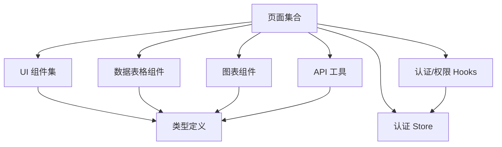

# 局部状态管理

<cite>
**本文引用的文件**   
- [web/src/App.tsx](file://web/src/App.tsx)
- [web/src/main.tsx](file://web/src/main.tsx)
- [web/src/pages/dashboard/index.tsx](file://web/src/pages/dashboard/index.tsx)
- [web/src/pages/data/index.tsx](file://web/src/pages/data/index.tsx)
- [web/src/pages/indicators/index.tsx](file://web/src/pages/indicators/index.tsx)
- [web/src/pages/inventory/index.tsx](file://web/src/pages/inventory/index.tsx)
- [web/src/pages/login/index.tsx](file://web/src/pages/login/index.tsx)
- [web/src/pages/reports/index.tsx](file://web/src/pages/reports/index.tsx)
- [web/src/pages/transactions/index.tsx](file://web/src/pages/transactions/index.tsx)
- [web/src/components/layout/header.tsx](file://web/src/components/layout/header.tsx)
- [web/src/components/layout/main-layout.tsx](file://web/src/components/layout/main-layout.tsx)
- [web/src/components/layout/page-container.tsx](file://web/src/components/layout/page-container.tsx)
- [web/src/components/ui/dialog.tsx](file://web/src/components/ui/dialog.tsx)
- [web/src/components/ui/button.tsx](file://web/src/components/ui/button.tsx)
- [web/src/components/ui/input.tsx](file://web/src/components/ui/input.tsx)
- [web/src/components/ui/select.tsx](file://web/src/components/ui/select.tsx)
- [web/src/components/ui/tabs.tsx](file://web/src/components/ui/tabs.tsx)
- [web/src/components/ui/dropdown-menu.tsx](file://web/src/components/ui/dropdown-menu.tsx)
- [web/src/components/ui/badge.tsx](file://web/src/components/ui/badge.tsx)
- [web/src/components/ui/avatar.tsx](file://web/src/components/ui/avatar.tsx)
- [web/src/components/ui/card.tsx](file://web/src/components/ui/card.tsx)
- [web/src/components/ui/label.tsx](file://web/src/components/ui/label.tsx)
- [web/src/components/ui/separator.tsx](file://web/src/components/ui/separator.tsx)
- [web/src/components/ui/skeleton.tsx](file://web/src/components/ui/skeleton.tsx)
- [web/src/components/ui/switch.tsx](file://web/src/components/ui/switch.tsx)
- [web/src/components/ui/tooltip.tsx](file://web/src/components/ui/tooltip.tsx)
- [web/src/components/charts/kpi-card.tsx](file://web/src/components/charts/kpi-card.tsx)
- [web/src/components/charts/kpi-sparkline.tsx](file://web/src/components/charts/kpi-sparkline.tsx)
- [web/src/components/charts/trend-chart.tsx](file://web/src/components/charts/trend-chart.tsx)
- [web/src/components/data-table/data-table.tsx](file://web/src/components/data-table/data-table.tsx)
- [web/src/components/data-table/pagination.tsx](file://web/src/components/data-table/pagination.tsx)
- [web/src/components/data-table/pro-data-table.tsx](file://web/src/components/data-table/pro-data-table.tsx)
- [web/src/components/data-table/pro-table-inner.tsx](file://web/src/components/data-table/pro-table-inner.tsx)
- [web/src/hooks/useAuth.ts](file://web/src/hooks/useAuth.ts)
- [web/src/hooks/usePermission.ts](file://web/src/hooks/usePermission.ts)
- [web/src/stores/authStore.ts](file://web/src/stores/authStore.ts)
- [web/src/lib/api.ts](file://web/src/lib/api.ts)
- [web/src/lib/constants.ts](file://web/src/lib/constants.ts)
- [web/src/lib/utils.ts](file://web/src/lib/utils.ts)
- [web/src/types/index.ts](file://web/src/types/index.ts)
</cite>

## 目录
1. [简介](#简介)
2. [项目结构](#项目结构)
3. [核心组件与状态边界](#核心组件与状态边界)
4. [架构总览](#架构总览)
5. [详细组件分析](#详细组件分析)
6. [依赖关系分析](#依赖关系分析)
7. [性能考虑](#性能考虑)
8. [故障排查指南](#故障排查指南)
9. [结论](#结论)
10. [附录：常见状态管理模式示例](#附录常见状态管理模式示例)

## 简介
本文件面向 pj3 项目的“局部状态管理”实践，聚焦在 React 组件内使用 useState 与 useReducer 的规范、模式与优化策略。文档覆盖以下主题：
- 表单状态、UI 交互状态与数据缓存的管理策略
- 复杂状态逻辑中的 useReducer 应用（状态机与动作分发）
- 组件间状态共享的最佳实践（Props 传递、Context API、状态提升）
- 状态更新性能优化（状态分割、批量更新、避免不必要重渲染）
- 常见状态管理模式的具体实现示例（模态框、分页、筛选等）

## 项目结构
pj3 采用基于功能域与 UI 组件分层的前端结构：页面层负责业务编排与状态组合；UI 组件保持无状态或最小局部状态；hooks 封装可复用的状态与副作用；stores 提供跨组件的全局状态（如认证）。

```mermaid
graph TB
A["入口 main.tsx"] --> B["App.tsx"]
B --> C["布局 main-layout.tsx"]
C --> D["页面: dashboard/index.tsx"]
C --> E["页面: data/index.tsx"]
C --> F["页面: indicators/index.tsx"]
C --> G["页面: inventory/index.tsx"]
C --> H["页面: login/index.tsx"]
C --> I["页面: reports/index.tsx"]
C --> J["页面: transactions/index.tsx"]
subgraph "UI 组件"
K["dialog.tsx"]
L["button.tsx"]
M["input.tsx"]
N["select.tsx"]
O["tabs.tsx"]
P["dropdown-menu.tsx"]
Q["badge.tsx"]
R["avatar.tsx"]
S["card.tsx"]
T["label.tsx"]
U["separator.tsx"]
V["skeleton.tsx"]
W["switch.tsx"]
X["tooltip.tsx"]
end
subgraph "数据表格"
Y["data-table.tsx"]
Z["pagination.tsx"]
AA["pro-data-table.tsx"]
AB["pro-table-inner.tsx"]
end
subgraph "图表"
AC["kpi-card.tsx"]
AD["kpi-sparkline.tsx"]
AE["trend-chart.tsx"]
end
subgraph "Hooks/Stores"
AF["useAuth.ts"]
AG["usePermission.ts"]
AH["authStore.ts"]
end
subgraph "工具/类型"
AI["api.ts"]
AJ["constants.ts"]
AK["utils.ts"]
AL["types/index.ts"]
end
D --> Y
E --> Y
F --> AC
G --> Y
H --> K
I --> Y
J --> Y
C --> K
C --> L
C --> M
C --> N
C --> O
C --> P
C --> Q
C --> R
C --> S
C --> T
C --> U
C --> V
C --> W
C --> X
D --> AF
D --> AH
E --> AI
F --> AI
G --> AI
H --> AF
I --> AI
J --> AI
```

图示来源
- [web/src/main.tsx](file://web/src/main.tsx)
- [web/src/App.tsx](file://web/src/App.tsx)
- [web/src/components/layout/main-layout.tsx](file://web/src/components/layout/main-layout.tsx)
- [web/src/pages/dashboard/index.tsx](file://web/src/pages/dashboard/index.tsx)
- [web/src/pages/data/index.tsx](file://web/src/pages/data/index.tsx)
- [web/src/pages/indicators/index.tsx](file://web/src/pages/indicators/index.tsx)
- [web/src/pages/inventory/index.tsx](file://web/src/pages/inventory/index.tsx)
- [web/src/pages/login/index.tsx](file://web/src/pages/login/index.tsx)
- [web/src/pages/reports/index.tsx](file://web/src/pages/reports/index.tsx)
- [web/src/pages/transactions/index.tsx](file://web/src/pages/transactions/index.tsx)
- [web/src/components/ui/dialog.tsx](file://web/src/components/ui/dialog.tsx)
- [web/src/components/ui/button.tsx](file://web/src/components/ui/button.tsx)
- [web/src/components/ui/input.tsx](file://web/src/components/ui/input.tsx)
- [web/src/components/ui/select.tsx](file://web/src/components/ui/select.tsx)
- [web/src/components/ui/tabs.tsx](file://web/src/components/ui/tabs.tsx)
- [web/src/components/ui/dropdown-menu.tsx](file://web/src/components/ui/dropdown-menu.tsx)
- [web/src/components/ui/badge.tsx](file://web/src/components/ui/badge.tsx)
- [web/src/components/ui/avatar.tsx](file://web/src/components/ui/avatar.tsx)
- [web/src/components/ui/card.tsx](file://web/src/components/ui/card.tsx)
- [web/src/components/ui/label.tsx](file://web/src/components/ui/label.tsx)
- [web/src/components/ui/separator.tsx](file://web/src/components/ui/separator.tsx)
- [web/src/components/ui/skeleton.tsx](file://web/src/components/ui/skeleton.tsx)
- [web/src/components/ui/switch.tsx](file://web/src/components/ui/switch.tsx)
- [web/src/components/ui/tooltip.tsx](file://web/src/components/ui/tooltip.tsx)
- [web/src/components/charts/kpi-card.tsx](file://web/src/components/charts/kpi-card.tsx)
- [web/src/components/charts/kpi-sparkline.tsx](file://web/src/components/charts/kpi-sparkline.tsx)
- [web/src/components/charts/trend-chart.tsx](file://web/src/components/charts/trend-chart.tsx)
- [web/src/components/data-table/data-table.tsx](file://web/src/components/data-table/data-table.tsx)
- [web/src/components/data-table/pagination.tsx](file://web/src/components/data-table/pagination.tsx)
- [web/src/components/data-table/pro-data-table.tsx](file://web/src/components/data-table/pro-data-table.tsx)
- [web/src/components/data-table/pro-table-inner.tsx](file://web/src/components/data-table/pro-table-inner.tsx)
- [web/src/hooks/useAuth.ts](file://web/src/hooks/useAuth.ts)
- [web/src/hooks/usePermission.ts](file://web/src/hooks/usePermission.ts)
- [web/src/stores/authStore.ts](file://web/src/stores/authStore.ts)
- [web/src/lib/api.ts](file://web/src/lib/api.ts)
- [web/src/lib/constants.ts](file://web/src/lib/constants.ts)
- [web/src/lib/utils.ts](file://web/src/lib/utils.ts)
- [web/src/types/index.ts](file://web/src/types/index.ts)

章节来源
- [web/src/main.tsx](file://web/src/main.tsx)
- [web/src/App.tsx](file://web/src/App.tsx)
- [web/src/components/layout/main-layout.tsx](file://web/src/components/layout/main-layout.tsx)

## 核心组件与状态边界
- 页面组件（pages/*）：承载业务状态组合，通常通过 useState/useReducer 维护本地状态，并通过 props 将状态与回调下传给子组件。
- UI 组件（components/ui/*）：尽量无状态或仅持有最小 UI 状态（如展开/收起），通过 props 接收值与变更回调。
- 数据表格（components/data-table/*）：封装分页、排序、筛选等状态，对外暴露受控接口。
- 图表（components/charts/*）：以只读数据为输入，内部可能维护展示态（如 tooltip 显隐）。
- Hooks（hooks/*）：封装可复用状态逻辑（如权限判断、认证流程）。
- Stores（stores/*）：跨组件全局状态（如认证信息），由页面或 hooks 订阅。

章节来源
- [web/src/pages/dashboard/index.tsx](file://web/src/pages/dashboard/index.tsx)
- [web/src/pages/data/index.tsx](file://web/src/pages/data/index.tsx)
- [web/src/pages/indicators/index.tsx](file://web/src/pages/indicators/index.tsx)
- [web/src/pages/inventory/index.tsx](file://web/src/pages/inventory/index.tsx)
- [web/src/pages/login/index.tsx](file://web/src/pages/login/index.tsx)
- [web/src/pages/reports/index.tsx](file://web/src/pages/reports/index.tsx)
- [web/src/pages/transactions/index.tsx](file://web/src/pages/transactions/index.tsx)
- [web/src/components/ui/dialog.tsx](file://web/src/components/ui/dialog.tsx)
- [web/src/components/data-table/data-table.tsx](file://web/src/components/data-table/data-table.tsx)
- [web/src/components/charts/kpi-card.tsx](file://web/src/components/charts/kpi-card.tsx)
- [web/src/hooks/useAuth.ts](file://web/src/hooks/useAuth.ts)
- [web/src/stores/authStore.ts](file://web/src/stores/authStore.ts)

## 架构总览
下图展示了从入口到页面再到 UI 组件的状态流向，以及网络请求与 stores 的交互点。

图示来源
- [web/src/main.tsx](file://web/src/main.tsx)
- [web/src/App.tsx](file://web/src/App.tsx)
- [web/src/components/layout/main-layout.tsx](file://web/src/components/layout/main-layout.tsx)
- [web/src/stores/authStore.ts](file://web/src/stores/authStore.ts)
- [web/src/lib/api.ts](file://web/src/lib/api.ts)

## 详细组件分析

### 表单状态管理（useState）
- 适用场景：登录页、数据录入、搜索过滤等需要频繁更新的字段。
- 建议模式：
  - 将每个输入字段拆分为独立 state，或使用对象聚合但配合浅比较与稳定 key。
  - 使用受控组件，统一处理 onChange，避免直接操作 DOM。
  - 对提交进行防抖/节流，减少不必要的网络请求。
  - 错误提示与校验结果可与表单状态合并，便于集中渲染。

图示来源
- [web/src/pages/login/index.tsx](file://web/src/pages/login/index.tsx)
- [web/src/components/ui/input.tsx](file://web/src/components/ui/input.tsx)
- [web/src/components/ui/button.tsx](file://web/src/components/ui/button.tsx)
- [web/src/lib/api.ts](file://web/src/lib/api.ts)

章节来源
- [web/src/pages/login/index.tsx](file://web/src/pages/login/index.tsx)
- [web/src/components/ui/input.tsx](file://web/src/components/ui/input.tsx)
- [web/src/components/ui/button.tsx](file://web/src/components/ui/button.tsx)
- [web/src/lib/api.ts](file://web/src/lib/api.ts)

### UI 交互状态（useState）
- 适用场景：对话框显隐、下拉菜单展开、Tab 切换、开关切换、Tooltip 显隐等。
- 建议模式：
  - 将显隐状态与内容状态分离，避免耦合。
  - 使用受控组件，确保外部可控制行为（如父组件关闭弹窗）。
  - 对高频交互（如滚动加载、快速点击）做去抖/节流。

图示来源
- [web/src/components/ui/dialog.tsx](file://web/src/components/ui/dialog.tsx)
- [web/src/components/ui/button.tsx](file://web/src/components/ui/button.tsx)
- [web/src/components/ui/dropdown-menu.tsx](file://web/src/components/ui/dropdown-menu.tsx)
- [web/src/components/ui/tabs.tsx](file://web/src/components/ui/tabs.tsx)

章节来源
- [web/src/components/ui/dialog.tsx](file://web/src/components/ui/dialog.tsx)
- [web/src/components/ui/dropdown-menu.tsx](file://web/src/components/ui/dropdown-menu.tsx)
- [web/src/components/ui/tabs.tsx](file://web/src/components/ui/tabs.tsx)
- [web/src/components/ui/button.tsx](file://web/src/components/ui/button.tsx)

### 数据缓存与列表状态（useState/useReducer）
- 适用场景：数据表格的分页、排序、筛选、选中项、加载态等。
- 建议模式：
  - 简单列表：使用 useState 维护分页参数、筛选条件、数据数组与加载态。
  - 复杂表格：使用 useReducer 管理多字段状态与动作，保证状态更新的可预测性。
  - 将“数据缓存”与“查询参数”分离，避免重复请求。

图示来源
- [web/src/components/data-table/data-table.tsx](file://web/src/components/data-table/data-table.tsx)
- [web/src/components/data-table/pagination.tsx](file://web/src/components/data-table/pagination.tsx)
- [web/src/components/data-table/pro-data-table.tsx](file://web/src/components/data-table/pro-data-table.tsx)
- [web/src/components/data-table/pro-table-inner.tsx](file://web/src/components/data-table/pro-table-inner.tsx)
- [web/src/lib/api.ts](file://web/src/lib/api.ts)

章节来源
- [web/src/components/data-table/data-table.tsx](file://web/src/components/data-table/data-table.tsx)
- [web/src/components/data-table/pagination.tsx](file://web/src/components/data-table/pagination.tsx)
- [web/src/components/data-table/pro-data-table.tsx](file://web/src/components/data-table/pro-data-table.tsx)
- [web/src/components/data-table/pro-table-inner.tsx](file://web/src/components/data-table/pro-table-inner.tsx)
- [web/src/lib/api.ts](file://web/src/lib/api.ts)

### 复杂状态逻辑（useReducer 与状态机）
- 适用场景：多步骤表单、审批流、表格多选与批量操作、复杂筛选器。
- 建议模式：
  - 定义清晰的动作类型与状态结构，遵循不可变更新原则。
  - 将副作用（如网络请求）放在动作派发后处理，或在自定义 hook 中封装。
  - 使用 reducer 组合函数拆分大逻辑，提高可读性与可测试性。

图示来源
- [web/src/components/data-table/pro-data-table.tsx](file://web/src/components/data-table/pro-data-table.tsx)
- [web/src/components/data-table/pro-table-inner.tsx](file://web/src/components/data-table/pro-table-inner.tsx)
- [web/src/lib/api.ts](file://web/src/lib/api.ts)

章节来源
- [web/src/components/data-table/pro-data-table.tsx](file://web/src/components/data-table/pro-data-table.tsx)
- [web/src/components/data-table/pro-table-inner.tsx](file://web/src/components/data-table/pro-table-inner.tsx)
- [web/src/lib/api.ts](file://web/src/lib/api.ts)

### 组件间状态共享最佳实践
- Props 传递：适用于父子/兄弟组件间的少量状态共享，保持单向数据流。
- Context API：适用于主题、语言、权限等跨层级共享，避免 prop drilling。
- 状态提升：将状态提升到最近公共父组件，使多个子组件能同步状态。
- 全局 store：适用于认证、用户信息等跨页面共享（如 authStore）。

图示来源
- [web/src/components/layout/main-layout.tsx](file://web/src/components/layout/main-layout.tsx)
- [web/src/hooks/useAuth.ts](file://web/src/hooks/useAuth.ts)
- [web/src/stores/authStore.ts](file://web/src/stores/authStore.ts)

章节来源
- [web/src/components/layout/main-layout.tsx](file://web/src/components/layout/main-layout.tsx)
- [web/src/hooks/useAuth.ts](file://web/src/hooks/useAuth.ts)
- [web/src/stores/authStore.ts](file://web/src/stores/authStore.ts)

## 依赖关系分析
- 页面依赖 UI 组件与数据表格组件，通过 props 传递状态与回调。
- 页面依赖 hooks 与 stores 获取认证与权限信息。
- 页面与 lib/api.ts 交互进行数据请求，更新本地状态。
- UI 组件之间相对解耦，通过 props 与事件回调通信。

图示来源
- [web/src/pages/dashboard/index.tsx](file://web/src/pages/dashboard/index.tsx)
- [web/src/pages/data/index.tsx](file://web/src/pages/data/index.tsx)
- [web/src/pages/indicators/index.tsx](file://web/src/pages/indicators/index.tsx)
- [web/src/pages/inventory/index.tsx](file://web/src/pages/inventory/index.tsx)
- [web/src/pages/login/index.tsx](file://web/src/pages/login/index.tsx)
- [web/src/pages/reports/index.tsx](file://web/src/pages/reports/index.tsx)
- [web/src/pages/transactions/index.tsx](file://web/src/pages/transactions/index.tsx)
- [web/src/components/data-table/data-table.tsx](file://web/src/components/data-table/data-table.tsx)
- [web/src/components/charts/kpi-card.tsx](file://web/src/components/charts/kpi-card.tsx)
- [web/src/hooks/useAuth.ts](file://web/src/hooks/useAuth.ts)
- [web/src/stores/authStore.ts](file://web/src/stores/authStore.ts)
- [web/src/lib/api.ts](file://web/src/lib/api.ts)
- [web/src/types/index.ts](file://web/src/types/index.ts)

章节来源
- [web/src/pages/dashboard/index.tsx](file://web/src/pages/dashboard/index.tsx)
- [web/src/pages/data/index.tsx](file://web/src/pages/data/index.tsx)
- [web/src/pages/indicators/index.tsx](file://web/src/pages/indicators/index.tsx)
- [web/src/pages/inventory/index.tsx](file://web/src/pages/inventory/index.tsx)
- [web/src/pages/login/index.tsx](file://web/src/pages/login/index.tsx)
- [web/src/pages/reports/index.tsx](file://web/src/pages/reports/index.tsx)
- [web/src/pages/transactions/index.tsx](file://web/src/pages/transactions/index.tsx)
- [web/src/components/data-table/data-table.tsx](file://web/src/components/data-table/data-table.tsx)
- [web/src/components/charts/kpi-card.tsx](file://web/src/components/charts/kpi-card.tsx)
- [web/src/hooks/useAuth.ts](file://web/src/hooks/useAuth.ts)
- [web/src/stores/authStore.ts](file://web/src/stores/authStore.ts)
- [web/src/lib/api.ts](file://web/src/lib/api.ts)
- [web/src/types/index.ts](file://web/src/types/index.ts)

## 性能考虑
- 状态分割：将不同用途的状态拆分为多个 useState，避免无关更新导致的大范围重渲染。
- 批量更新：在同一事件处理器中多次 setState 会被 React 批处理，减少中间渲染。
- 避免不必要重渲染：
  - 使用 useMemo 计算派生数据，使用 useCallback 稳定回调引用。
  - 将纯展示组件提取为 React.memo，避免子树重复渲染。
  - 对大型列表使用虚拟滚动或分页加载。
- 状态提升与上下文：仅在必要时提升状态或使用 Context，避免过度共享导致的全局重渲染。
- 网络请求优化：
  - 使用请求去抖与取消机制，避免竞态。
  - 合理缓存数据，结合失效策略（如时间戳或版本号）。

[本节为通用指导，不直接分析具体文件]

## 故障排查指南
- 常见问题定位：
  - 表单未更新：检查是否为受控组件，onChange 是否正确绑定。
  - 弹窗无法关闭：确认 open 状态是否被父组件正确控制，回调是否触发。
  - 表格数据不刷新：检查分页/筛选参数是否变化，请求是否携带最新参数。
  - 认证状态不一致：确认 store 订阅与 hooks 使用是否正确。
- 调试建议：
  - 在关键状态更新处打印日志，观察状态变化路径。
  - 使用浏览器开发者工具的 React DevTools 检查组件树与状态。
  - 对复杂 reducer 编写单元测试，验证动作与状态转换。

章节来源
- [web/src/components/ui/dialog.tsx](file://web/src/components/ui/dialog.tsx)
- [web/src/components/ui/input.tsx](file://web/src/components/ui/input.tsx)
- [web/src/components/data-table/data-table.tsx](file://web/src/components/data-table/data-table.tsx)
- [web/src/hooks/useAuth.ts](file://web/src/hooks/useAuth.ts)
- [web/src/stores/authStore.ts](file://web/src/stores/authStore.ts)

## 结论
pj3 项目在局部状态管理上遵循清晰的职责划分：页面负责状态组合与业务流程，UI 组件保持简洁与可控，hooks 与 stores 提供可复用能力。通过合理使用 useState 与 useReducer、Props 传递、Context 与状态提升，并结合性能优化策略，可实现高内聚、低耦合且易维护的状态管理体系。

[本节为总结，不直接分析具体文件]

## 附录：常见状态管理模式示例

### 模态框状态
- 状态设计：open 布尔值 + onOpenChange 回调。
- 交互流程：按钮触发打开 -> 设置 open=true -> 渲染弹窗 -> 点击遮罩/关闭按钮 -> 设置 open=false。
- 注意事项：支持外部控制（父组件可强制关闭），避免内存泄漏。

章节来源
- [web/src/components/ui/dialog.tsx](file://web/src/components/ui/dialog.tsx)
- [web/src/components/ui/button.tsx](file://web/src/components/ui/button.tsx)

### 分页状态
- 状态设计：currentPage、pageSize、total、loading、data。
- 交互流程：切换页码/每页条数 -> 更新分页参数 -> 发起请求 -> 更新 data 与 total。
- 注意事项：防止重复请求，处理空数据与错误状态。

章节来源
- [web/src/components/data-table/pagination.tsx](file://web/src/components/data-table/pagination.tsx)
- [web/src/components/data-table/data-table.tsx](file://web/src/components/data-table/data-table.tsx)
- [web/src/lib/api.ts](file://web/src/lib/api.ts)

### 筛选状态
- 状态设计：filters 对象（按字段组织）、activeFilters 计数、reset 回调。
- 交互流程：选择筛选项 -> 更新 filters -> 触发查询 -> 更新列表数据。
- 注意事项：支持清空筛选、默认值恢复、URL 同步（可选）。

章节来源
- [web/src/components/data-table/pro-data-table.tsx](file://web/src/components/data-table/pro-data-table.tsx)
- [web/src/components/data-table/pro-table-inner.tsx](file://web/src/components/data-table/pro-table-inner.tsx)
- [web/src/lib/api.ts](file://web/src/lib/api.ts)

### 认证与权限状态
- 状态设计：用户信息、token、权限列表、loading/error。
- 交互流程：登录 -> 保存认证信息 -> 更新全局 store -> 页面根据权限渲染。
- 注意事项：安全存储 token、登出清理状态、权限变更时刷新路由。

章节来源
- [web/src/hooks/useAuth.ts](file://web/src/hooks/useAuth.ts)
- [web/src/stores/authStore.ts](file://web/src/stores/authStore.ts)
- [web/src/pages/login/index.tsx](file://web/src/pages/login/index.tsx)