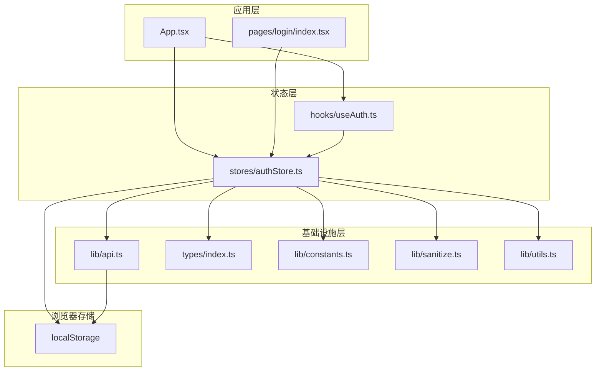
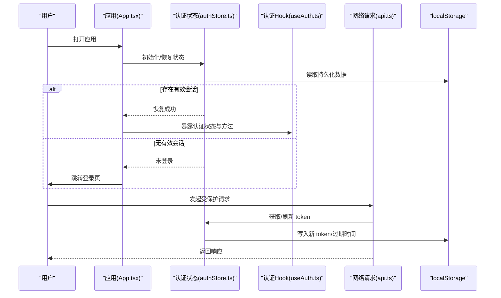
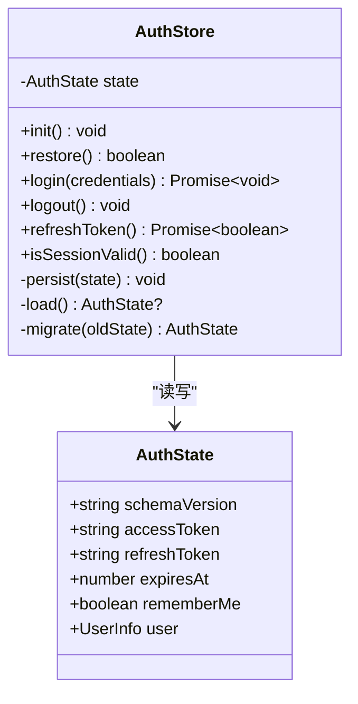
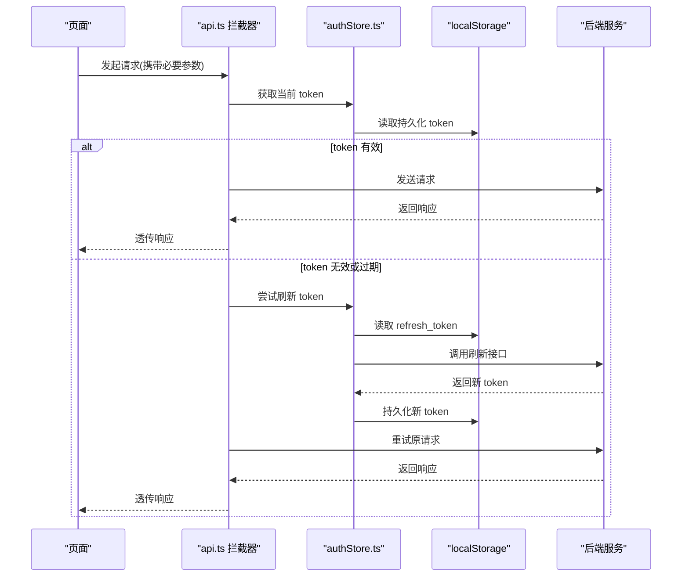
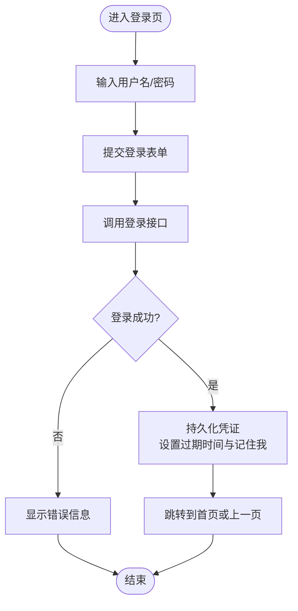
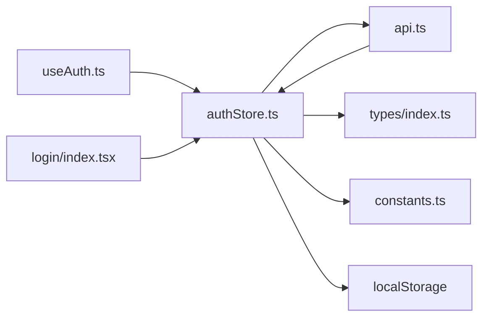

# 状态持久化

<cite>
**本文引用的文件**   
- [web/src/stores/authStore.ts](file://web/src/stores/authStore.ts)
- [web/src/hooks/useAuth.ts](file://web/src/hooks/useAuth.ts)
- [web/src/lib/api.ts](file://web/src/lib/api.ts)
- [web/src/pages/login/index.tsx](file://web/src/pages/login/index.tsx)
- [web/src/types/index.ts](file://web/src/types/index.ts)
- [web/src/lib/constants.ts](file://web/src/lib/constants.ts)
- [web/src/lib/sanitize.ts](file://web/src/lib/sanitize.ts)
- [web/src/lib/utils.ts](file://web/src/lib/utils.ts)
- [web/src/App.tsx](file://web/src/App.tsx)
- [web/src/main.tsx](file://web/src/main.tsx)
</cite>

## 目录
1. [简介](#简介)
2. [项目结构](#项目结构)
3. [核心组件](#核心组件)
4. [架构总览](#架构总览)
5. [详细组件分析](#详细组件分析)
6. [依赖分析](#依赖分析)
7. [性能考虑](#性能考虑)
8. [故障排除指南](#故障排除指南)
9. [结论](#结论)
10. [附录](#附录)

## 简介
本文件面向 pj3 项目的“状态持久化”能力，重点围绕以下目标展开：
- localStorage 集成方案：敏感数据安全存储、数据格式化与版本迁移策略
- 会话管理：token 刷新、自动登录与会话超时处理
- 状态恢复：应用启动时的状态重建、断线重连与数据同步
- 安全考量：XSS 防护、数据加密与访问控制
- 性能优化：增量更新、压缩存储与异步操作
- 实现示例与故障排除

说明：当前仓库中已存在认证相关代码（如 authStore、useAuth、api 请求封装等），但尚未发现明确的本地持久化实现。本文在尊重现有代码的基础上，给出可落地的设计与实现建议，并标注需要新增或改造的文件位置。

## 项目结构
与状态持久化直接相关的目录与文件主要集中在 web/src 下：
- stores/authStore.ts：认证状态管理与副作用逻辑
- hooks/useAuth.ts：认证上下文 Hook
- lib/api.ts：网络请求封装（可能包含拦截器）
- pages/login/index.tsx：登录页面入口
- types/index.ts：类型定义
- lib/constants.ts：常量配置
- lib/sanitize.ts：输入清洗工具
- lib/utils.ts：通用工具函数
- App.tsx / main.tsx：应用初始化与根组件

图表来源
- [web/src/App.tsx](file://web/src/App.tsx)
- [web/src/stores/authStore.ts](file://web/src/stores/authStore.ts)
- [web/src/hooks/useAuth.ts](file://web/src/hooks/useAuth.ts)
- [web/src/lib/api.ts](file://web/src/lib/api.ts)
- [web/src/pages/login/index.tsx](file://web/src/pages/login/index.tsx)
- [web/src/types/index.ts](file://web/src/types/index.ts)
- [web/src/lib/constants.ts](file://web/src/lib/constants.ts)
- [web/src/lib/sanitize.ts](file://web/src/lib/sanitize.ts)
- [web/src/lib/utils.ts](file://web/src/lib/utils.ts)

章节来源
- [web/src/App.tsx](file://web/src/App.tsx)
- [web/src/main.tsx](file://web/src/main.tsx)
- [web/src/stores/authStore.ts](file://web/src/stores/authStore.ts)
- [web/src/hooks/useAuth.ts](file://web/src/hooks/useAuth.ts)
- [web/src/lib/api.ts](file://web/src/lib/api.ts)
- [web/src/pages/login/index.tsx](file://web/src/pages/login/index.tsx)
- [web/src/types/index.ts](file://web/src/types/index.ts)
- [web/src/lib/constants.ts](file://web/src/lib/constants.ts)
- [web/src/lib/sanitize.ts](file://web/src/lib/sanitize.ts)
- [web/src/lib/utils.ts](file://web/src/lib/utils.ts)

## 核心组件
- 认证状态管理（authStore）：集中管理用户身份、令牌、过期时间、自动登录开关等；负责与后端交互、刷新 token、维护会话生命周期。
- 认证 Hook（useAuth）：为页面提供便捷的状态读取与触发方法（如登录、登出、刷新）。
- 网络请求封装（api.ts）：统一拦截器，注入/刷新 token、处理鉴权错误、重试策略。
- 登录页（login/index.tsx）：触发登录流程，接收服务端返回的凭证并交由 authStore 持久化。
- 类型与常量（types/index.ts, constants.ts）：定义持久化数据结构、键名、过期策略等。
- 安全与工具（sanitize.ts, utils.ts）：输入清洗、序列化/反序列化、时间计算、随机数生成等。

章节来源
- [web/src/stores/authStore.ts](file://web/src/stores/authStore.ts)
- [web/src/hooks/useAuth.ts](file://web/src/hooks/useAuth.ts)
- [web/src/lib/api.ts](file://web/src/lib/api.ts)
- [web/src/pages/login/index.tsx](file://web/src/pages/login/index.tsx)
- [web/src/types/index.ts](file://web/src/types/index.ts)
- [web/src/lib/constants.ts](file://web/src/lib/constants.ts)
- [web/src/lib/sanitize.ts](file://web/src/lib/sanitize.ts)
- [web/src/lib/utils.ts](file://web/src/lib/utils.ts)

## 架构总览
下图展示从应用启动到状态恢复、再到网络请求与本地存储的整体流程。

图表来源
- [web/src/App.tsx](file://web/src/App.tsx)
- [web/src/stores/authStore.ts](file://web/src/stores/authStore.ts)
- [web/src/hooks/useAuth.ts](file://web/src/hooks/useAuth.ts)
- [web/src/lib/api.ts](file://web/src/lib/api.ts)
- [web/src/pages/login/index.tsx](file://web/src/pages/login/index.tsx)

## 详细组件分析

### 认证状态管理（authStore）
职责
- 管理用户信息、access_token、refresh_token、过期时间、是否记住登录等
- 提供登录、登出、刷新 token、检查会话有效性等方法
- 负责将关键状态持久化到 localStorage，并在应用启动时恢复

关键设计点
- 数据模型：使用 types/index.ts 中的类型约束，确保序列化前后一致
- 持久化键名：通过 constants.ts 集中管理，避免硬编码
- 版本迁移：引入 schemaVersion 字段，支持旧数据兼容升级
- 安全存储：对敏感字段进行简单混淆或二次编码（见“安全考虑”）
- 会话超时：基于过期时间判断，必要时触发刷新或强制登出
- 自动登录：根据“记住我”选项决定是否在下次启动时自动恢复会话

图表来源
- [web/src/stores/authStore.ts](file://web/src/stores/authStore.ts)
- [web/src/types/index.ts](file://web/src/types/index.ts)
- [web/src/lib/constants.ts](file://web/src/lib/constants.ts)

章节来源
- [web/src/stores/authStore.ts](file://web/src/stores/authStore.ts)
- [web/src/types/index.ts](file://web/src/types/index.ts)
- [web/src/lib/constants.ts](file://web/src/lib/constants.ts)

### 认证 Hook（useAuth）
职责
- 暴露认证状态与操作方法给页面组件
- 监听全局事件（如 token 刷新、登出）以驱动 UI 更新

典型用法
- 在页面中调用 useAuth().login(...) 完成登录
- 在路由守卫或布局中检查 isSessionValid() 决定跳转

章节来源
- [web/src/hooks/useAuth.ts](file://web/src/hooks/useAuth.ts)

### 网络请求封装（api.ts）
职责
- 统一请求拦截：注入 access_token、处理 401/403
- Token 刷新：在 refresh 成功后重试原请求
- 错误处理：区分网络错误、业务错误与鉴权错误

图表来源
- [web/src/lib/api.ts](file://web/src/lib/api.ts)
- [web/src/stores/authStore.ts](file://web/src/stores/authStore.ts)

章节来源
- [web/src/lib/api.ts](file://web/src/lib/api.ts)
- [web/src/stores/authStore.ts](file://web/src/stores/authStore.ts)

### 登录流程（login/index.tsx）
职责
- 收集用户凭据，调用认证接口
- 将返回的凭证交给 authStore 持久化
- 根据“记住我”设置自动登录策略

图表来源
- [web/src/pages/login/index.tsx](file://web/src/pages/login/index.tsx)
- [web/src/stores/authStore.ts](file://web/src/stores/authStore.ts)

章节来源
- [web/src/pages/login/index.tsx](file://web/src/pages/login/index.tsx)
- [web/src/stores/authStore.ts](file://web/src/stores/authStore.ts)

### 类型与常量（types/index.ts, constants.ts）
- types/index.ts：定义 AuthState、UserInfo、登录请求/响应等类型，保证持久化数据结构的稳定性
- constants.ts：集中管理 localStorage 键名、默认过期时间、版本号等，便于统一维护

章节来源
- [web/src/types/index.ts](file://web/src/types/index.ts)
- [web/src/lib/constants.ts](file://web/src/lib/constants.ts)

### 安全与工具（sanitize.ts, utils.ts）
- sanitize.ts：对用户输入进行清洗，防止 XSS 注入
- utils.ts：提供时间戳转换、随机数生成、JSON 序列化/反序列化工具等

章节来源
- [web/src/lib/sanitize.ts](file://web/src/lib/sanitize.ts)
- [web/src/lib/utils.ts](file://web/src/lib/utils.ts)

## 依赖分析
- authStore 依赖 api.ts 进行网络通信，依赖 constants.ts 与 types/index.ts 进行配置与类型约束，依赖 localStorage 进行持久化
- useAuth 依赖 authStore 暴露状态与方法
- api.ts 依赖 authStore 获取/刷新 token
- login 页面依赖 authStore 完成登录后的状态持久化

图表来源
- [web/src/stores/authStore.ts](file://web/src/stores/authStore.ts)
- [web/src/hooks/useAuth.ts](file://web/src/hooks/useAuth.ts)
- [web/src/lib/api.ts](file://web/src/lib/api.ts)
- [web/src/pages/login/index.tsx](file://web/src/pages/login/index.tsx)
- [web/src/types/index.ts](file://web/src/types/index.ts)
- [web/src/lib/constants.ts](file://web/src/lib/constants.ts)

章节来源
- [web/src/stores/authStore.ts](file://web/src/stores/authStore.ts)
- [web/src/hooks/useAuth.ts](file://web/src/hooks/useAuth.ts)
- [web/src/lib/api.ts](file://web/src/lib/api.ts)
- [web/src/pages/login/index.tsx](file://web/src/pages/login/index.tsx)
- [web/src/types/index.ts](file://web/src/types/index.ts)
- [web/src/lib/constants.ts](file://web/src/lib/constants.ts)

## 性能考虑
- 增量更新：仅持久化变更字段，减少 JSON 体积与写入次数
- 压缩存储：对大对象进行压缩后再写入 localStorage（注意 CPU 开销）
- 异步操作：使用 requestIdleCallback 或微任务队列批量写入，避免阻塞主线程
- 缓存策略：对只读配置类数据采用内存缓存，仅在首次加载时写盘
- 防抖节流：频繁触发的保存动作进行节流，降低 I/O 压力

[本节为通用指导，不直接分析具体文件]

## 故障排除指南
常见问题与定位步骤
- 登录后立即失效
  - 检查过期时间计算是否正确
  - 确认刷新 token 流程是否被正确触发
  - 查看 api.ts 拦截器对 401 的处理逻辑
- 自动登录失败
  - 校验“记住我”标志位与持久化键值
  - 确认应用启动时是否执行了状态恢复
- 跨标签页不同步
  - 监听 storage 事件，实现多标签页状态同步
- 数据损坏或格式不一致
  - 增加 schemaVersion 校验与迁移逻辑
  - 记录异常日志并回滚到默认状态

章节来源
- [web/src/stores/authStore.ts](file://web/src/stores/authStore.ts)
- [web/src/lib/api.ts](file://web/src/lib/api.ts)

## 结论
通过统一的认证状态管理、健壮的网络拦截器与完善的本地持久化策略，pj3 可实现可靠的会话管理与状态恢复。结合安全加固与性能优化，可在保障用户体验的同时提升系统安全性与稳定性。后续建议在现有基础上完善版本迁移、多端同步与更细粒度的权限持久化。

[本节为总结性内容，不直接分析具体文件]

## 附录

### 数据模型与持久化键名建议
- 数据模型
  - schemaVersion：用于版本迁移
  - accessToken：短期访问令牌
  - refreshToken：长期刷新令牌
  - expiresAt：访问令牌过期时间戳
  - rememberMe：是否启用自动登录
  - user：用户基本信息（脱敏）
- 持久化键名
  - AUTH_STATE_KEY：认证状态主键
  - SCHEMA_VERSION_KEY：版本键（可选）
  - 其他业务键按模块划分，避免冲突

章节来源
- [web/src/types/index.ts](file://web/src/types/index.ts)
- [web/src/lib/constants.ts](file://web/src/lib/constants.ts)

### 安全最佳实践
- 最小化敏感数据：仅持久化必要字段，避免明文存储高敏感信息
- 输入清洗：对所有用户输入进行清洗，防止 XSS
- 传输安全：所有网络请求强制 HTTPS
- 访问控制：前端仅做体验增强，后端严格校验权限
- 审计与日志：记录关键操作与异常，便于问题追踪

章节来源
- [web/src/lib/sanitize.ts](file://web/src/lib/sanitize.ts)
- [web/src/lib/api.ts](file://web/src/lib/api.ts)