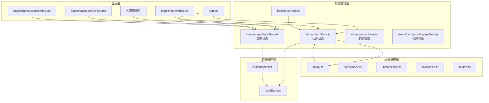
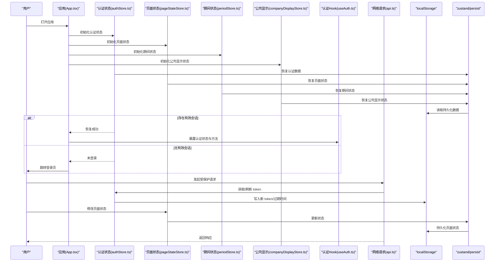
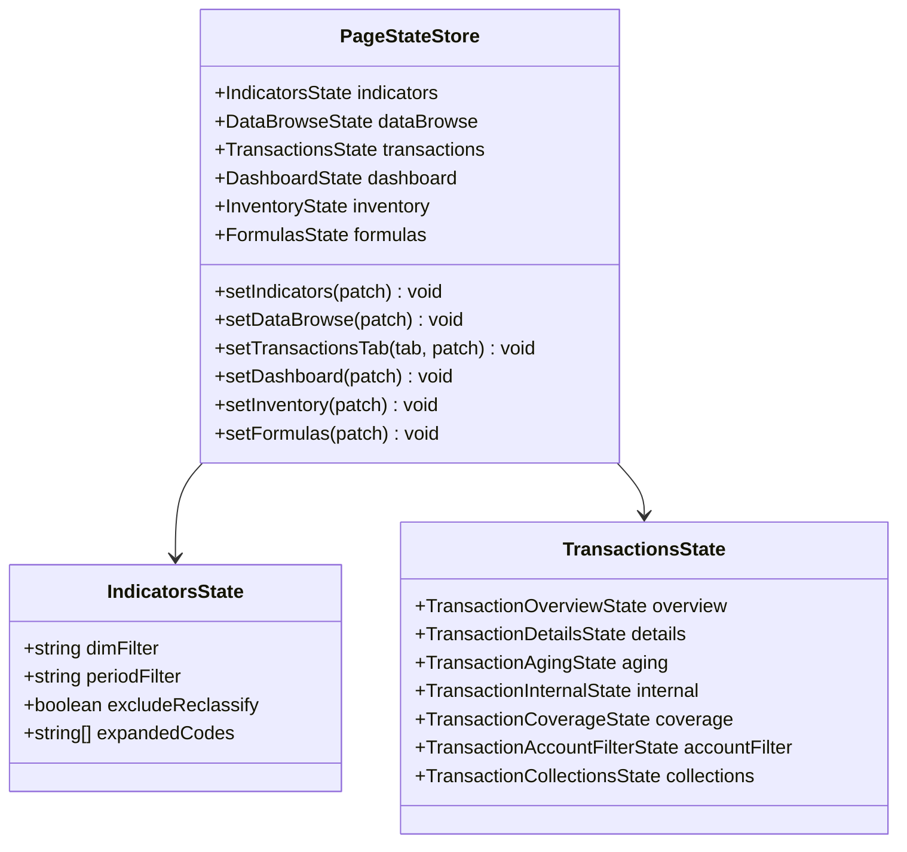
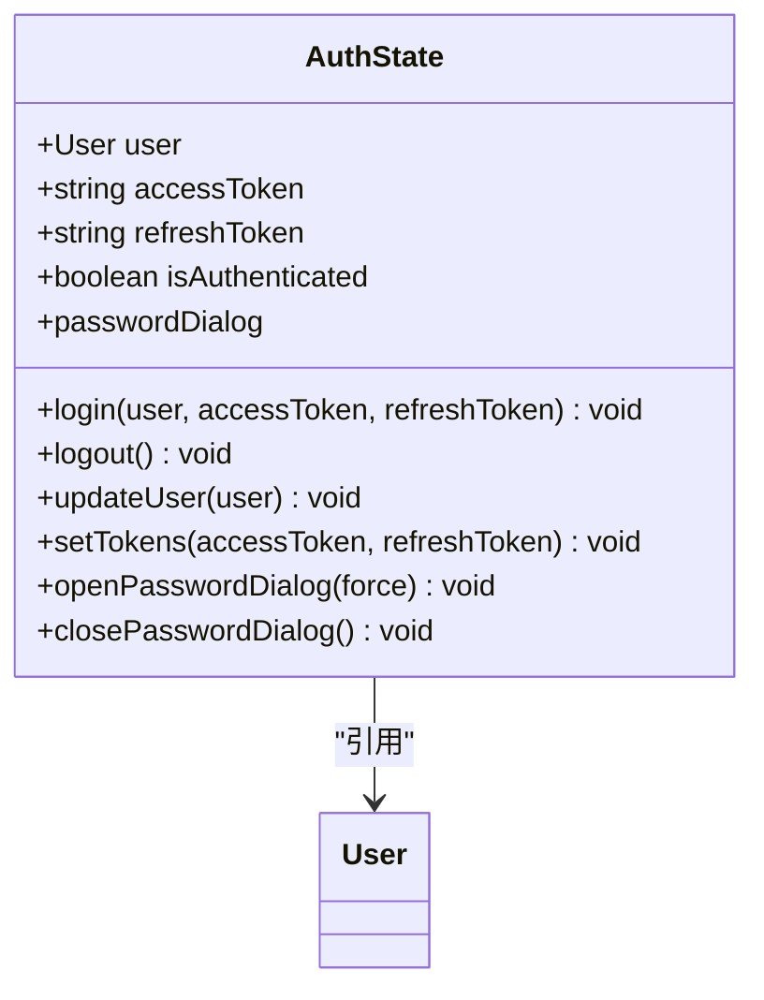
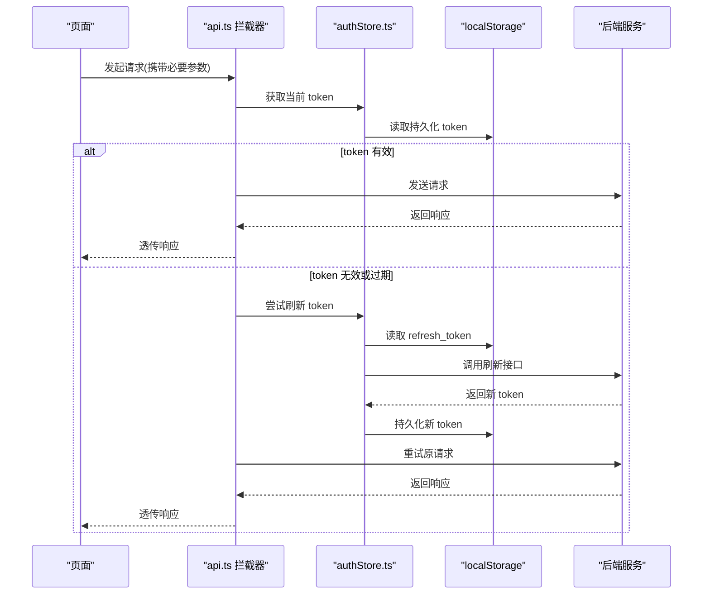
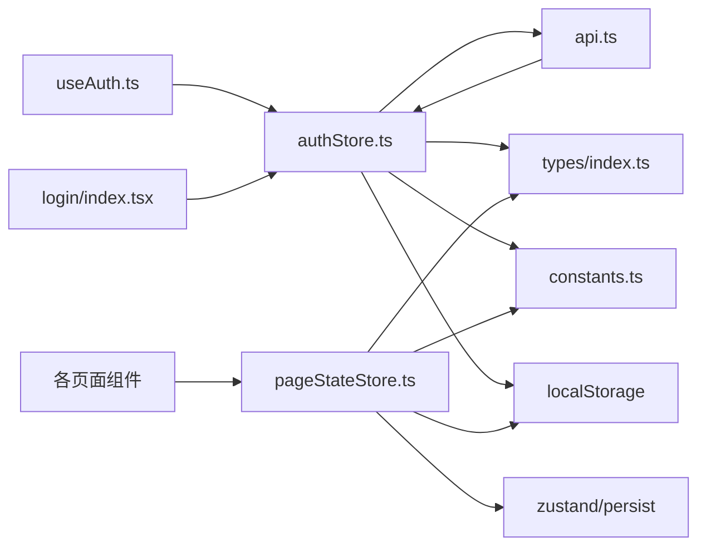

# 状态持久化

<cite>
**本文引用的文件**   
- [web/src/stores/pageStateStore.ts](file://web/src/stores/pageStateStore.ts)
- [web/src/stores/authStore.ts](file://web/src/stores/authStore.ts)
- [web/src/stores/periodStore.ts](file://web/src/stores/periodStore.ts)
- [web/src/stores/companyDisplayStore.ts](file://web/src/stores/companyDisplayStore.ts)
- [web/src/hooks/useAuth.ts](file://web/src/hooks/useAuth.ts)
- [web/src/lib/api.ts](file://web/src/lib/api.ts)
- [web/src/pages/login/index.tsx](file://web/src/pages/login/index.tsx)
- [web/src/pages/dashboard/index.tsx](file://web/src/pages/dashboard/index.tsx)
- [web/src/pages/transactions/index.tsx](file://web/src/pages/transactions/index.tsx)
- [web/src/types/index.ts](file://web/src/types/index.ts)
- [web/src/lib/constants.ts](file://web/src/lib/constants.ts)
- [web/src/lib/sanitize.ts](file://web/src/lib/sanitize.ts)
- [web/src/lib/utils.ts](file://web/src/lib/utils.ts)
- [web/src/App.tsx](file://web/src/App.tsx)
- [web/src/main.tsx](file://web/src/main.tsx)
</cite>

## 更新摘要
**所做更改**
- 新增页面特定状态管理章节，详细介绍 pageStateStore.ts 的实现
- 更新架构总览图，反映新的 zustand + persist 模式
- 增强持久化策略说明，包括深合并和版本迁移机制
- 补充多页面状态同步和失效值处理逻辑
- 更新性能考虑部分，包含增量更新和防抖优化

## 目录
1. [简介](#简介)
2. [项目结构](#项目结构)
3. [核心组件](#核心组件)
4. [架构总览](#架构总览)
5. [详细组件分析](#详细组件分析)
6. [依赖分析](#依赖分析)
7. [性能考虑](#性能考虑)
8. [故障排除指南](#故障排除指南)
9. [结论](#结论)
10. [附录](#附录)

## 简介
本文件面向 pj3 项目的"状态持久化"能力，重点围绕以下目标展开：
- **localStorage 集成方案**：基于 zustand/middleware 的持久化存储，支持敏感数据安全存储、数据格式化与版本迁移策略
- **会话管理**：token 刷新、自动登录与会话超时处理
- **页面状态管理**：基于 pageStateStore 的查询条件与视图状态持久化，支持路由切换和刷新后恢复
- **状态恢复**：应用启动时的状态重建、断线重连与数据同步
- **安全考量**：XSS 防护、数据加密与访问控制
- **性能优化**：增量更新、压缩存储与异步操作
- **实现示例与故障排除**

**更新** 当前系统已实现完整的 zustand + persist 模式，包括认证状态、页面状态、全局配置等多维度持久化方案。

## 项目结构
与状态持久化直接相关的目录与文件主要集中在 web/src 下：
- **stores/**：状态管理模块（authStore、pageStateStore、periodStore、companyDisplayStore）
- **hooks/**：认证上下文 Hook
- **lib/**：网络请求封装、常量配置、工具函数
- **pages/**：各页面组件，使用 pageStateStore 进行状态持久化
- **types/**：类型定义
- **App.tsx / main.tsx**：应用初始化与根组件

**图表来源**
- [web/src/App.tsx](file://web/src/App.tsx)
- [web/src/stores/pageStateStore.ts](file://web/src/stores/pageStateStore.ts)
- [web/src/stores/authStore.ts](file://web/src/stores/authStore.ts)
- [web/src/stores/periodStore.ts](file://web/src/stores/periodStore.ts)
- [web/src/stores/companyDisplayStore.ts](file://web/src/stores/companyDisplayStore.ts)
- [web/src/hooks/useAuth.ts](file://web/src/hooks/useAuth.ts)
- [web/src/lib/api.ts](file://web/src/lib/api.ts)
- [web/src/pages/dashboard/index.tsx](file://web/src/pages/dashboard/index.tsx)
- [web/src/pages/transactions/index.tsx](file://web/src/pages/transactions/index.tsx)

## 核心组件
- **认证状态管理（authStore）**：集中管理用户身份、令牌、过期时间、自动登录开关等；负责与后端交互、刷新 token、维护会话生命周期
- **页面状态管理（pageStateStore）**：基于 zustand + persist 的页面级状态持久化，支持查询条件、视图状态、分页信息的多维度管理
- **全局配置存储（periodStore, companyDisplayStore）**：跨页面的全局配置状态，如财年选择、公司简称显示等
- **认证 Hook（useAuth）**：为页面提供便捷的状态读取与触发方法（如登录、登出、刷新）
- **网络请求封装（api.ts）**：统一拦截器，注入/刷新 token、处理鉴权错误、重试策略
- **登录页（login/index.tsx）**：触发登录流程，接收服务端返回的凭证并交由 authStore 持久化
- **类型与常量（types/index.ts, constants.ts）**：定义持久化数据结构、键名、过期策略等
- **安全与工具（sanitize.ts, utils.ts）**：输入清洗、序列化/反序列化、时间计算、随机数生成等

**章节来源**
- [web/src/stores/pageStateStore.ts](file://web/src/stores/pageStateStore.ts)
- [web/src/stores/authStore.ts](file://web/src/stores/authStore.ts)
- [web/src/stores/periodStore.ts](file://web/src/stores/periodStore.ts)
- [web/src/stores/companyDisplayStore.ts](file://web/src/stores/companyDisplayStore.ts)
- [web/src/hooks/useAuth.ts](file://web/src/hooks/useAuth.ts)
- [web/src/lib/api.ts](file://web/src/lib/api.ts)
- [web/src/pages/login/index.tsx](file://web/src/pages/login/index.tsx)
- [web/src/types/index.ts](file://web/src/types/index.ts)
- [web/src/lib/constants.ts](file://web/src/lib/constants.ts)
- [web/src/lib/sanitize.ts](file://web/src/lib/sanitize.ts)
- [web/src/lib/utils.ts](file://web/src/lib/utils.ts)

## 架构总览
下图展示从应用启动到状态恢复、再到网络请求与本地存储的整体流程，包括新的页面状态管理机制。

**图表来源**
- [web/src/App.tsx](file://web/src/App.tsx)
- [web/src/stores/pageStateStore.ts](file://web/src/stores/pageStateStore.ts)
- [web/src/stores/authStore.ts](file://web/src/stores/authStore.ts)
- [web/src/stores/periodStore.ts](file://web/src/stores/periodStore.ts)
- [web/src/stores/companyDisplayStore.ts](file://web/src/stores/companyDisplayStore.ts)
- [web/src/hooks/useAuth.ts](file://web/src/hooks/useAuth.ts)
- [web/src/lib/api.ts](file://web/src/lib/api.ts)
- [web/src/pages/login/index.tsx](file://web/src/pages/login/index.tsx)

## 详细组件分析

### 页面状态管理（pageStateStore）
**职责**
- 基于 zustand + persist 实现页面级状态持久化
- 管理各业务模块的查询条件、视图状态、分页信息等
- 支持深合并和版本迁移，确保数据结构演进的安全性
- 提供统一的 set 方法，简化状态更新操作

**核心特性**
- **多维度状态管理**：支持指标分析、数据浏览、交易概览、明细、账龄分析等多个业务模块
- **智能默认值**：为每个状态字段提供合理的默认值，确保首次加载体验
- **深合并机制**：通过 mergePersisted 函数实现新旧数据的智能合并
- **版本控制**：内置 version: 1，支持未来数据结构升级
- **选择性持久化**：通过 partialize 函数精确控制持久化的字段

**图表来源**
- [web/src/stores/pageStateStore.ts](file://web/src/stores/pageStateStore.ts)

**章节来源**
- [web/src/stores/pageStateStore.ts](file://web/src/stores/pageStateStore.ts)

### 认证状态管理（authStore）
**职责**
- 管理用户信息、access_token、refresh_token、过期时间、是否记住登录等
- 提供登录、登出、刷新 token、检查会话有效性等方法
- 负责将关键状态持久化到 localStorage，并在应用启动时恢复

**关键设计点**
- **简洁的数据模型**：使用 types/index.ts 中的类型约束，确保序列化前后一致
- **自动持久化**：通过 zustand/persist 中间件自动管理 localStorage 读写
- **安全的 token 管理**：分离 accessToken 和 refreshToken，支持自动刷新机制
- **对话框状态管理**：统一管理密码修改对话框的状态

**图表来源**
- [web/src/stores/authStore.ts](file://web/src/stores/authStore.ts)
- [web/src/types/index.ts](file://web/src/types/index.ts)

**章节来源**
- [web/src/stores/authStore.ts](file://web/src/stores/authStore.ts)
- [web/src/types/index.ts](file://web/src/types/index.ts)

### 全局配置存储（periodStore, companyDisplayStore）
**职责**
- **periodStore**：管理全局财年选择状态，影响看板、指标、数据浏览等页面的期间筛选
- **companyDisplayStore**：管理公司简称显示开关，影响所有展示公司名称的 UI 组件

**设计特点**
- **轻量级状态**：仅包含必要的配置项，避免过度持久化
- **实时同步**：状态变化立即反映到所有使用该 store 的组件
- **简单 API**：提供直观的 setter 方法，便于在任意位置修改状态

**章节来源**
- [web/src/stores/periodStore.ts](file://web/src/stores/periodStore.ts)
- [web/src/stores/companyDisplayStore.ts](file://web/src/stores/companyDisplayStore.ts)

### 认证 Hook（useAuth）
**职责**
- 暴露认证状态与操作方法给页面组件
- 监听全局事件（如 token 刷新、登出）以驱动 UI 更新

**典型用法**
- 在页面中调用 useAuth().login(...) 完成登录
- 在路由守卫或布局中检查 isSessionValid() 决定跳转

**章节来源**
- [web/src/hooks/useAuth.ts](file://web/src/hooks/useAuth.ts)

### 网络请求封装（api.ts）
**职责**
- 统一请求拦截：注入 access_token、处理 401/403
- Token 刷新：在 refresh 成功后重试原请求
- 错误处理：区分网络错误、业务错误与鉴权错误

**图表来源**
- [web/src/lib/api.ts](file://web/src/lib/api.ts)
- [web/src/stores/authStore.ts](file://web/src/stores/authStore.ts)

**章节来源**
- [web/src/lib/api.ts](file://web/src/lib/api.ts)
- [web/src/stores/authStore.ts](file://web/src/stores/authStore.ts)

### 页面状态使用示例
**dashboard 页面**
- 使用 usePageStore 管理期间选择、主体维度、趋势指标等状态
- 状态变化自动持久化，刷新页面后恢复用户选择

**transactions 页面**
- 管理多个 tab 的独立状态：概览、明细、账龄分析、内部往来等
- 支持复杂的公司多选、科目筛选、分页等状态持久化

**章节来源**
- [web/src/pages/dashboard/index.tsx](file://web/src/pages/dashboard/index.tsx)
- [web/src/pages/transactions/index.tsx](file://web/src/pages/transactions/index.tsx)

### 登录流程（login/index.tsx）
**职责**
- 收集用户凭据，调用认证接口
- 将返回的凭证交给 authStore 持久化
- 根据"记住我"设置自动登录策略

**图表来源**
- [web/src/pages/login/index.tsx](file://web/src/pages/login/index.tsx)
- [web/src/stores/authStore.ts](file://web/src/stores/authStore.ts)

**章节来源**
- [web/src/pages/login/index.tsx](file://web/src/pages/login/index.tsx)
- [web/src/stores/authStore.ts](file://web/src/stores/authStore.ts)

### 类型与常量（types/index.ts, constants.ts）
- **types/index.ts**：定义 AuthState、UserInfo、登录请求/响应等类型，保证持久化数据结构的稳定性
- **constants.ts**：集中管理 localStorage 键名、默认过期时间、版本号等，便于统一维护

**章节来源**
- [web/src/types/index.ts](file://web/src/types/index.ts)
- [web/src/lib/constants.ts](file://web/src/lib/constants.ts)

### 安全与工具（sanitize.ts, utils.ts）
- **sanitize.ts**：对用户输入进行清洗，防止 XSS 注入
- **utils.ts**：提供时间戳转换、随机数生成、JSON 序列化/反序列化工具等

**章节来源**
- [web/src/lib/sanitize.ts](file://web/src/lib/sanitize.ts)
- [web/src/lib/utils.ts](file://web/src/lib/utils.ts)

## 依赖分析
- **authStore** 依赖 api.ts 进行网络通信，依赖 constants.ts 与 types/index.ts 进行配置与类型约束，依赖 localStorage 进行持久化
- **pageStateStore** 依赖 zustand/persist 中间件，通过 partialize 函数精确控制持久化内容
- **useAuth** 依赖 authStore 暴露状态与方法
- **api.ts** 依赖 authStore 获取/刷新 token
- **各页面组件** 依赖 pageStateStore 进行状态管理和持久化

**图表来源**
- [web/src/stores/authStore.ts](file://web/src/stores/authStore.ts)
- [web/src/stores/pageStateStore.ts](file://web/src/stores/pageStateStore.ts)
- [web/src/hooks/useAuth.ts](file://web/src/hooks/useAuth.ts)
- [web/src/lib/api.ts](file://web/src/lib/api.ts)
- [web/src/pages/login/index.tsx](file://web/src/pages/login/index.tsx)
- [web/src/types/index.ts](file://web/src/types/index.ts)
- [web/src/lib/constants.ts](file://web/src/lib/constants.ts)

**章节来源**
- [web/src/stores/authStore.ts](file://web/src/stores/authStore.ts)
- [web/src/stores/pageStateStore.ts](file://web/src/stores/pageStateStore.ts)
- [web/src/hooks/useAuth.ts](file://web/src/hooks/useAuth.ts)
- [web/src/lib/api.ts](file://web/src/lib/api.ts)
- [web/src/pages/login/index.tsx](file://web/src/pages/login/index.tsx)
- [web/src/types/index.ts](file://web/src/types/index.ts)
- [web/src/lib/constants.ts](file://web/src/lib/constants.ts)

## 性能考虑
- **增量更新**：zustand 的 setState 仅更新变化的状态，减少不必要的重渲染
- **选择性持久化**：通过 partialize 函数精确控制持久化的字段，避免存储大量无用数据
- **深合并优化**：mergePersisted 函数仅在必要时合并嵌套对象，提升性能
- **异步操作**：zustand/persist 中间件自动处理异步持久化，避免阻塞主线程
- **缓存策略**：对只读配置类数据采用内存缓存，仅在首次加载时写盘
- **防抖节流**：频繁触发的保存动作可通过自定义逻辑进行节流，降低 I/O 压力

**更新** 新的 pageStateStore 实现了更精细的性能优化，包括：
- 按模块分组的 state 结构，减少状态体积
- 智能默认值机制，避免重复初始化
- 选择性持久化，仅存储必要的查询条件和视图状态

## 故障排除指南
常见问题与定位步骤
- **登录后立即失效**
  - 检查过期时间计算是否正确
  - 确认刷新 token 流程是否被正确触发
  - 查看 api.ts 拦截器对 401 的处理逻辑
- **自动登录失败**
  - 校验"记住我"标志位与持久化键值
  - 确认应用启动时是否执行了状态恢复
- **跨标签页不同步**
  - 监听 storage 事件，实现多标签页状态同步
- **数据损坏或格式不一致**
  - 增加 schemaVersion 校验与迁移逻辑
  - 记录异常日志并回滚到默认状态
- **页面状态丢失**
  - 检查 pageStateStore 的 partialize 配置是否正确
  - 确认 mergePersisted 函数的深合并逻辑
  - 验证页面组件是否正确订阅了状态变化

**更新** 针对新的 pageStateStore 系统的故障排除：
- **状态不持久化**：检查 zustand/persist 的配置，确认 name 和 partialize 设置
- **状态覆盖问题**：验证 mergePersisted 函数的合并逻辑，确保旧数据不被意外覆盖
- **性能问题**：监控 localStorage 的读写频率，考虑添加防抖机制

**章节来源**
- [web/src/stores/authStore.ts](file://web/src/stores/authStore.ts)
- [web/src/stores/pageStateStore.ts](file://web/src/stores/pageStateStore.ts)
- [web/src/lib/api.ts](file://web/src/lib/api.ts)

## 结论
通过统一的认证状态管理、健壮的页面状态管理系统与完善的本地持久化策略，pj3 可实现可靠的会话管理与状态恢复。新的 pageStateStore 系统提供了更精细的页面级状态管理能力，结合 zustand/persist 的高效实现，可在保障用户体验的同时提升系统安全性与稳定性。后续建议在现有基础上完善版本迁移、多端同步与更细粒度的权限持久化。

**更新** 当前系统已实现完整的多层次持久化架构：
- 认证状态：基于 authStore 的用户会话管理
- 页面状态：基于 pageStateStore 的业务状态持久化
- 全局配置：基于 periodStore 和 companyDisplayStore 的跨页面配置
- 所有状态均通过 zustand/persist 实现高效的 localStorage 集成

## 附录

### 数据模型与持久化键名建议
- **认证状态**
  - user：用户基本信息（脱敏）
  - accessToken：短期访问令牌
  - refreshToken：长期刷新令牌
  - isAuthenticated：认证状态标志
  - passwordDialog：密码对话框状态
- **页面状态**
  - indicators：指标分析相关状态
  - dataBrowse：数据浏览相关状态
  - transactions：交易相关状态（包含多个子模块）
  - dashboard：看板相关状态
  - inventory：库存相关状态
  - formulas：公式管理相关状态
- **全局配置**
  - fiscalYear：选中年份
  - showShortName：公司简称显示开关
- **持久化键名**
  - AUTH_STATE_KEY：认证状态主键（auth-storage）
  - PAGE_STATE_KEY：页面状态主键（page-state-storage）
  - PERIOD_KEY：期间选择键（period-storage）
  - COMPANY_DISPLAY_KEY：公司显示配置键（company-display-storage）

**章节来源**
- [web/src/stores/authStore.ts](file://web/src/stores/authStore.ts)
- [web/src/stores/pageStateStore.ts](file://web/src/stores/pageStateStore.ts)
- [web/src/stores/periodStore.ts](file://web/src/stores/periodStore.ts)
- [web/src/stores/companyDisplayStore.ts](file://web/src/stores/companyDisplayStore.ts)

### 安全最佳实践
- **最小化敏感数据**：仅持久化必要字段，避免明文存储高敏感信息
- **输入清洗**：对所有用户输入进行清洗，防止 XSS
- **传输安全**：所有网络请求强制 HTTPS
- **访问控制**：前端仅做体验增强，后端严格校验权限
- **审计与日志**：记录关键操作与异常，便于问题追踪
- **数据隔离**：不同模块的状态使用独立的 localStorage 键，避免冲突

**更新** 新的 pageStateStore 系统的安全考虑：
- **结构化存储**：按业务模块组织状态，便于权限控制和数据清理
- **类型安全**：通过 TypeScript 类型定义确保数据结构一致性
- **默认值保护**：智能默认值机制防止状态损坏导致的应用崩溃

**章节来源**
- [web/src/lib/sanitize.ts](file://web/src/lib/sanitize.ts)
- [web/src/lib/api.ts](file://web/src/lib/api.ts)
- [web/src/stores/pageStateStore.ts](file://web/src/stores/pageStateStore.ts)

### 性能优化最佳实践
- **按需持久化**：仅持久化必要的状态字段，避免存储大量临时数据
- **批量更新**：对于频繁的状态更新，考虑使用批量更新策略
- **懒加载**：对于大型状态对象，考虑懒加载和按需初始化
- **内存管理**：及时清理不再使用的状态，避免内存泄漏
- **监控与调试**：添加性能监控，跟踪 localStorage 的读写性能

**更新** pageStateStore 的性能优化实践：
- **模块化状态**：按业务模块组织状态，减少不必要的全量更新
- **智能合并**：deep merge 算法确保仅更新变化的字段
- **版本兼容**：内置版本管理机制，支持平滑的数据结构升级

**章节来源**
- [web/src/stores/pageStateStore.ts](file://web/src/stores/pageStateStore.ts)
- [web/src/lib/utils.ts](file://web/src/lib/utils.ts)