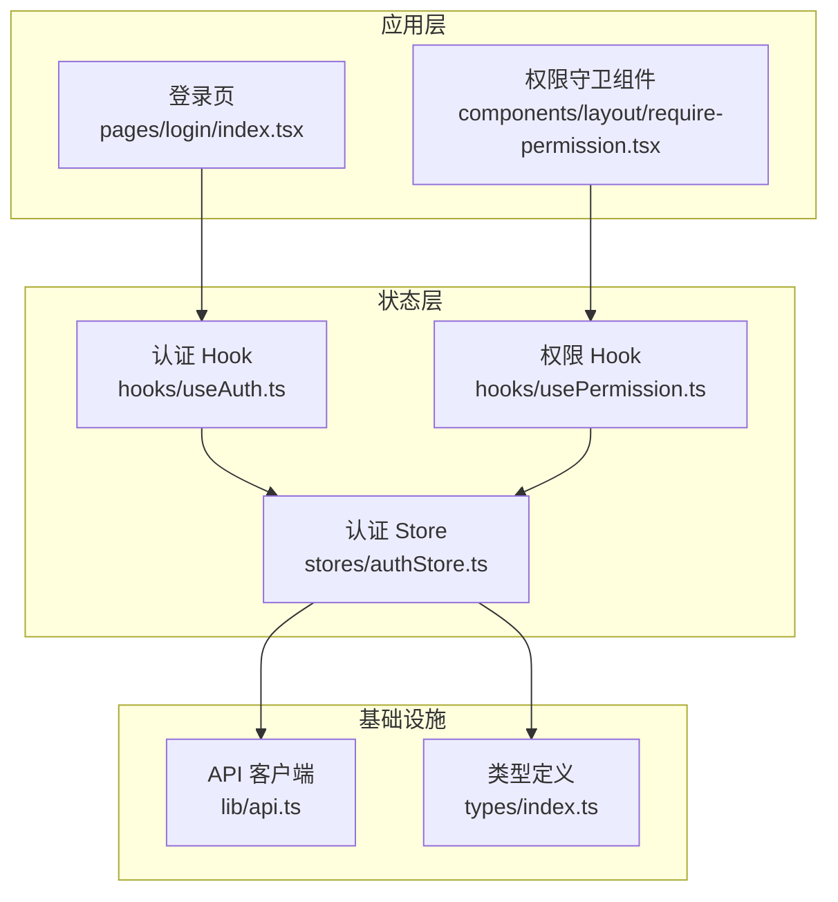
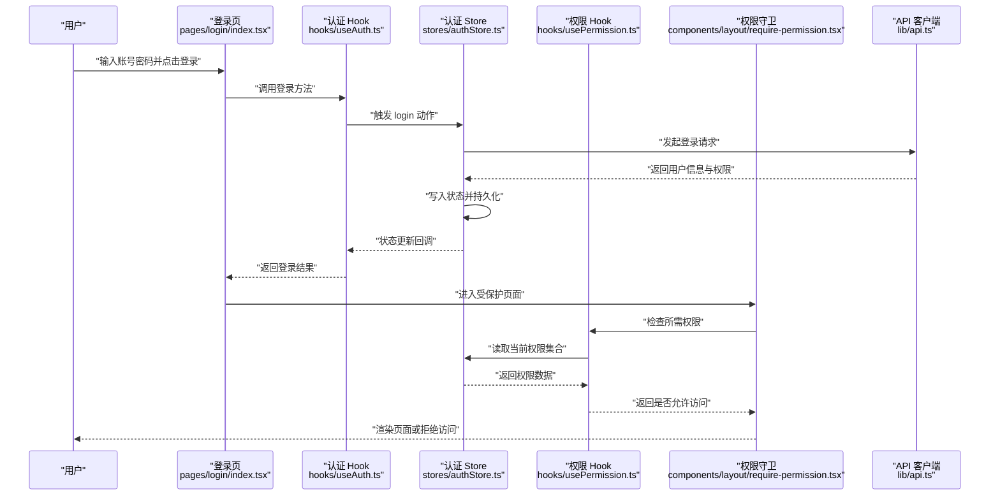
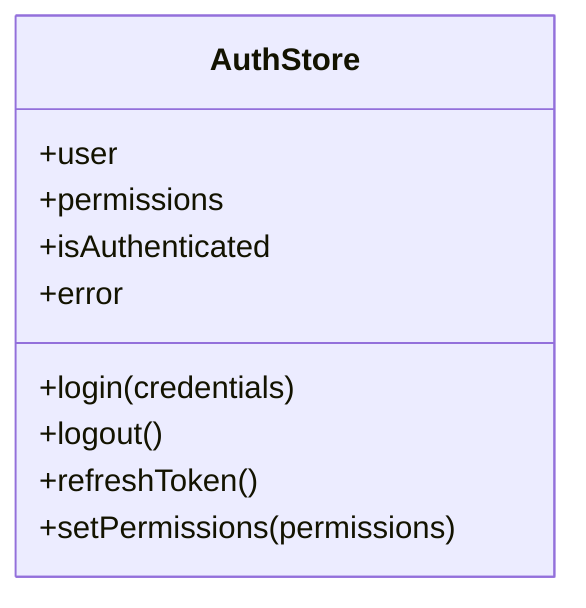
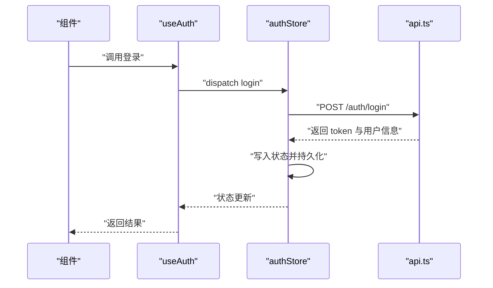
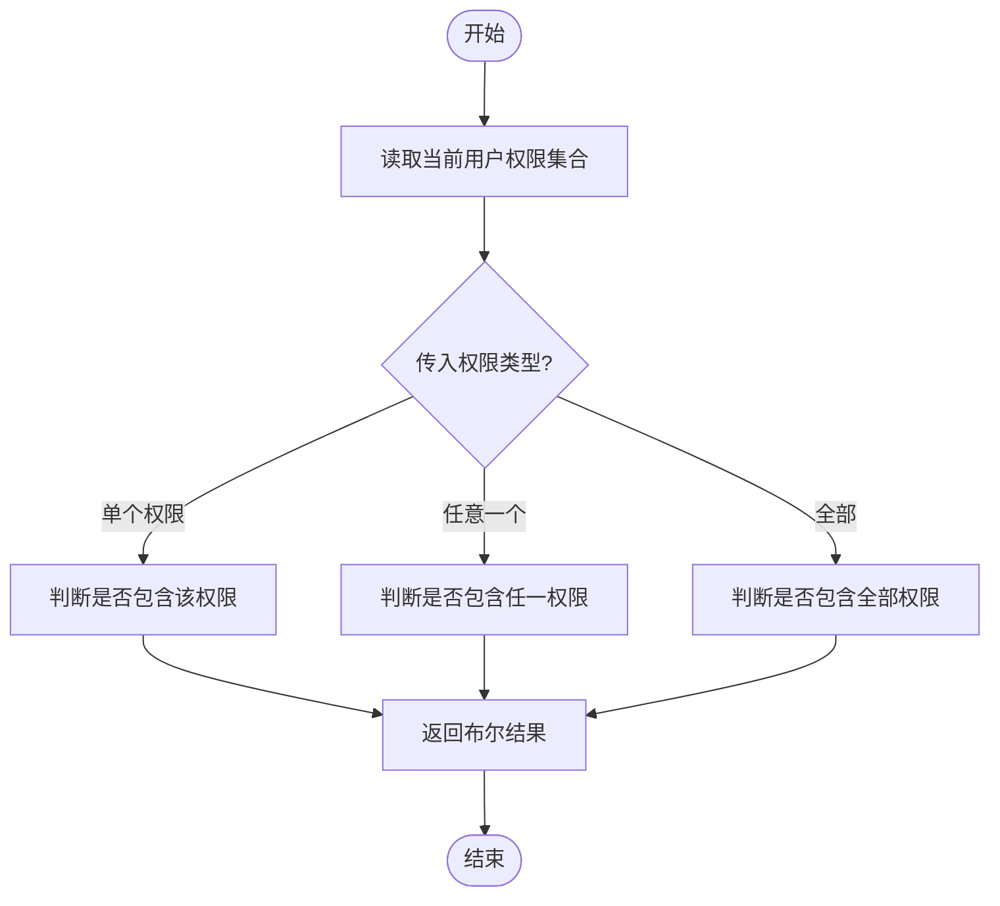
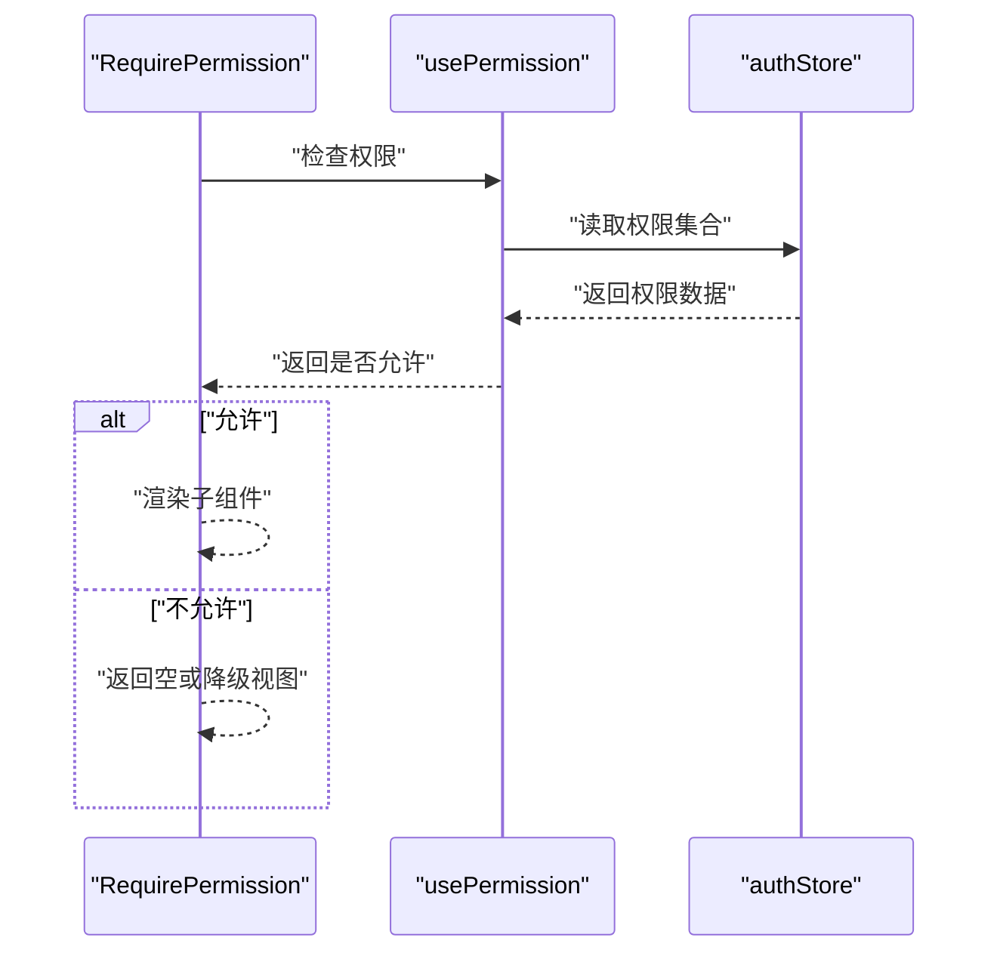
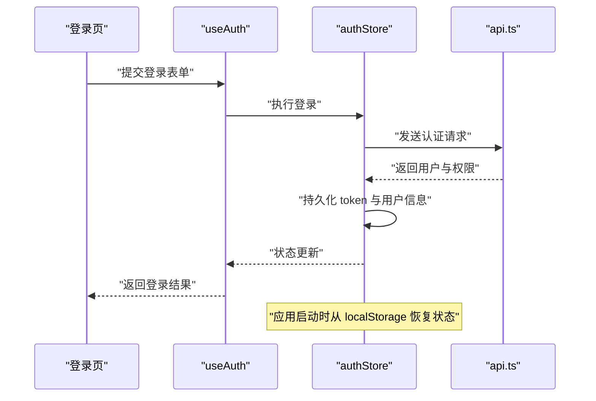
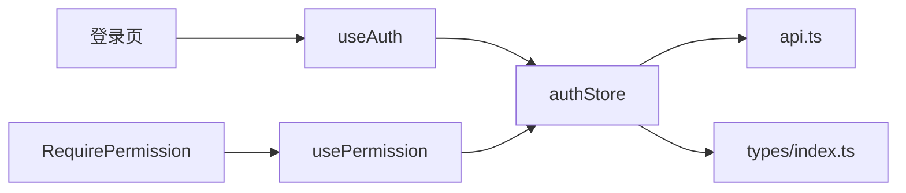

# 状态管理

<cite>
**本文引用的文件**
- [web/src/stores/authStore.ts](file://web/src/stores/authStore.ts)
- [web/src/hooks/useAuth.ts](file://web/src/hooks/useAuth.ts)
- [web/src/hooks/usePermission.ts](file://web/src/hooks/usePermission.ts)
- [web/src/components/layout/require-permission.tsx](file://web/src/components/layout/require-permission.tsx)
- [web/src/pages/login/index.tsx](file://web/src/pages/login/index.tsx)
- [web/src/lib/api.ts](file://web/src/lib/api.ts)
- [web/src/types/index.ts](file://web/src/types/index.ts)
</cite>

## 目录
1. [简介](#简介)
2. [项目结构](#项目结构)
3. [核心组件](#核心组件)
4. [架构总览](#架构总览)
5. [详细组件分析](#详细组件分析)
6. [依赖关系分析](#依赖关系分析)
7. [性能考虑](#性能考虑)
8. [故障排查指南](#故障排查指南)
9. [结论](#结论)
10. [附录](#附录)

## 简介
本文件为 pj3 项目的状态管理架构文档，聚焦于基于 Zustand 的全局状态管理模式。内容涵盖：
- Store 设计与状态订阅、更新机制
- 认证状态管理（登录态、权限信息、会话）
- 自定义 Hooks 的状态封装与复用策略（useAuth、usePermission）
- 局部状态最佳实践（useState、useReducer）
- 状态持久化方案（localStorage 集成与恢复）
- 性能优化技巧（状态分割、选择性订阅、内存管理）
- 状态流转图，展示数据在各模块间的传递路径

## 项目结构
本项目采用“按领域/功能组织”的目录结构，状态相关代码集中在以下位置：
- stores：全局状态定义（Zustand store）
- hooks：封装业务语义的 Hook（如 useAuth、usePermission）
- components/layout：权限控制组件（如 require-permission）
- pages：页面级入口，使用上述 Hook 和组件完成认证与权限流程
- lib：网络请求与工具函数（api.ts）
- types：类型定义

图表来源
- [web/src/pages/login/index.tsx](file://web/src/pages/login/index.tsx)
- [web/src/components/layout/require-permission.tsx](file://web/src/components/layout/require-permission.tsx)
- [web/src/stores/authStore.ts](file://web/src/stores/authStore.ts)
- [web/src/hooks/useAuth.ts](file://web/src/hooks/useAuth.ts)
- [web/src/hooks/usePermission.ts](file://web/src/hooks/usePermission.ts)
- [web/src/lib/api.ts](file://web/src/lib/api.ts)
- [web/src/types/index.ts](file://web/src/types/index.ts)

章节来源
- [web/src/stores/authStore.ts](file://web/src/stores/authStore.ts)
- [web/src/hooks/useAuth.ts](file://web/src/hooks/useAuth.ts)
- [web/src/hooks/usePermission.ts](file://web/src/hooks/usePermission.ts)
- [web/src/components/layout/require-permission.tsx](file://web/src/components/layout/require-permission.tsx)
- [web/src/pages/login/index.tsx](file://web/src/pages/login/index.tsx)
- [web/src/lib/api.ts](file://web/src/lib/api.ts)
- [web/src/types/index.ts](file://web/src/types/index.ts)

## 核心组件
本节概述状态管理的核心构件及其职责：
- 认证 Store（authStore）：集中管理用户登录态、权限集合、会话信息等；提供登录、登出、刷新等动作；负责与后端交互及本地持久化。
- 认证 Hook（useAuth）：对 authStore 进行轻量封装，暴露更贴近业务语义的方法与派生状态，便于在组件中直接消费。
- 权限 Hook（usePermission）：基于当前用户权限集合，提供细粒度权限判断能力，供 UI 或路由守卫使用。
- 权限守卫组件（RequirePermission）：在渲染前检查权限，决定显示或降级处理。

章节来源
- [web/src/stores/authStore.ts](file://web/src/stores/authStore.ts)
- [web/src/hooks/useAuth.ts](file://web/src/hooks/useAuth.ts)
- [web/src/hooks/usePermission.ts](file://web/src/hooks/usePermission.ts)
- [web/src/components/layout/require-permission.tsx](file://web/src/components/layout/require-permission.tsx)

## 架构总览
下图展示了从用户操作到状态更新的端到端流程，包括登录、权限校验与页面渲染的关键路径。

图表来源
- [web/src/pages/login/index.tsx](file://web/src/pages/login/index.tsx)
- [web/src/hooks/useAuth.ts](file://web/src/hooks/useAuth.ts)
- [web/src/stores/authStore.ts](file://web/src/stores/authStore.ts)
- [web/src/hooks/usePermission.ts](file://web/src/hooks/usePermission.ts)
- [web/src/components/layout/require-permission.tsx](file://web/src/components/layout/require-permission.tsx)
- [web/src/lib/api.ts](file://web/src/lib/api.ts)

## 详细组件分析

### 认证 Store（authStore）
- 设计要点
  - 状态字段：用户基本信息、权限集合、登录态标志、错误信息等。
  - 动作方法：登录、登出、刷新令牌、设置权限等。
  - 副作用处理：在登录成功后调用 API 获取用户与权限，并写入本地存储。
  - 持久化：通过中间件或手动逻辑将关键状态同步至 localStorage，并在初始化时恢复。
- 订阅与更新
  - 使用 Zustand 的选择性订阅，仅订阅必要字段，避免无关重渲染。
  - 动作方法内部保证原子性更新，必要时合并多个字段变更。
- 错误处理
  - 捕获网络异常与业务错误，统一设置错误状态并提供重试提示。
- 复杂度与性能
  - 状态分割：将高频变动的状态（如加载态）与低频状态（如用户信息）分离，减少不必要的订阅范围。
  - 选择性订阅：在组件中使用选择器只订阅需要的切片，降低渲染成本。

章节来源
- [web/src/stores/authStore.ts](file://web/src/stores/authStore.ts)

#### 类图（概念映射）

图表来源
- [web/src/stores/authStore.ts](file://web/src/stores/authStore.ts)

### 认证 Hook（useAuth）
- 设计思路
  - 对 authStore 进行二次封装，暴露更具业务语义的方法（如“登录”、“退出”），同时提供派生状态（如“是否已登录”）。
  - 在 Hook 内部处理常见副作用（如失败重试、跳转逻辑），使页面组件保持简洁。
- 复用策略
  - 在多个页面与布局中复用，统一登录态判断与导航行为。
  - 结合 TypeScript 类型约束，确保接口稳定与可维护性。

章节来源
- [web/src/hooks/useAuth.ts](file://web/src/hooks/useAuth.ts)

#### 序列图（登录流程）

图表来源
- [web/src/hooks/useAuth.ts](file://web/src/hooks/useAuth.ts)
- [web/src/stores/authStore.ts](file://web/src/stores/authStore.ts)
- [web/src/lib/api.ts](file://web/src/lib/api.ts)

### 权限 Hook（usePermission）
- 设计思路
  - 基于当前用户的权限集合，提供 isAllowed、hasAny、hasAll 等方法，支持字符串或规则表达式匹配。
  - 在 Hook 内缓存计算结果，避免重复计算带来的性能损耗。
- 复用策略
  - 在按钮、菜单、路由守卫等多处复用，统一权限判定逻辑。
  - 与 RequirePermission 组件配合，实现声明式权限控制。

章节来源
- [web/src/hooks/usePermission.ts](file://web/src/hooks/usePermission.ts)

#### 流程图（权限判定）

图表来源
- [web/src/hooks/usePermission.ts](file://web/src/hooks/usePermission.ts)
- [web/src/stores/authStore.ts](file://web/src/stores/authStore.ts)

### 权限守卫组件（RequirePermission）
- 设计思路
  - 在渲染前根据 props 指定的权限要求，调用 usePermission 进行判断。
  - 若未通过，则返回空节点或降级视图，并可记录审计日志。
- 与路由集成
  - 可在路由层级包裹该组件，实现页面级访问控制。

章节来源
- [web/src/components/layout/require-permission.tsx](file://web/src/components/layout/require-permission.tsx)
- [web/src/hooks/usePermission.ts](file://web/src/hooks/usePermission.ts)

#### 序列图（受保护页面渲染）

图表来源
- [web/src/components/layout/require-permission.tsx](file://web/src/components/layout/require-permission.tsx)
- [web/src/hooks/usePermission.ts](file://web/src/hooks/usePermission.ts)
- [web/src/stores/authStore.ts](file://web/src/stores/authStore.ts)

### 登录页（Login）
- 设计思路
  - 收集表单数据，调用 useAuth 提供的登录方法。
  - 根据返回结果进行成功跳转或错误提示。
  - 在首次加载时尝试自动恢复会话（如存在有效 token）。
- 与权限联动
  - 登录后立即刷新权限信息，确保后续页面渲染正确。

章节来源
- [web/src/pages/login/index.tsx](file://web/src/pages/login/index.tsx)
- [web/src/hooks/useAuth.ts](file://web/src/hooks/useAuth.ts)
- [web/src/stores/authStore.ts](file://web/src/stores/authStore.ts)

#### 序列图（登录与恢复）

图表来源
- [web/src/pages/login/index.tsx](file://web/src/pages/login/index.tsx)
- [web/src/hooks/useAuth.ts](file://web/src/hooks/useAuth.ts)
- [web/src/stores/authStore.ts](file://web/src/stores/authStore.ts)
- [web/src/lib/api.ts](file://web/src/lib/api.ts)

## 依赖关系分析
- 组件与 Hook 的耦合
  - 登录页依赖 useAuth，useAuth 依赖 authStore。
  - 权限守卫依赖 usePermission，usePermission 依赖 authStore。
- 外部依赖
  - api.ts 作为 HTTP 客户端，被 authStore 调用以完成认证与权限拉取。
  - types/index.ts 提供统一的类型定义，贯穿各层。

图表来源
- [web/src/pages/login/index.tsx](file://web/src/pages/login/index.tsx)
- [web/src/components/layout/require-permission.tsx](file://web/src/components/layout/require-permission.tsx)
- [web/src/hooks/useAuth.ts](file://web/src/hooks/useAuth.ts)
- [web/src/hooks/usePermission.ts](file://web/src/hooks/usePermission.ts)
- [web/src/stores/authStore.ts](file://web/src/stores/authStore.ts)
- [web/src/lib/api.ts](file://web/src/lib/api.ts)
- [web/src/types/index.ts](file://web/src/types/index.ts)

章节来源
- [web/src/pages/login/index.tsx](file://web/src/pages/login/index.tsx)
- [web/src/components/layout/require-permission.tsx](file://web/src/components/layout/require-permission.tsx)
- [web/src/hooks/useAuth.ts](file://web/src/hooks/useAuth.ts)
- [web/src/hooks/usePermission.ts](file://web/src/hooks/usePermission.ts)
- [web/src/stores/authStore.ts](file://web/src/stores/authStore.ts)
- [web/src/lib/api.ts](file://web/src/lib/api.ts)
- [web/src/types/index.ts](file://web/src/types/index.ts)

## 性能考虑
- 状态分割
  - 将用户信息、权限集合、加载态、错误信息等拆分为独立字段，按需订阅，避免全量更新。
- 选择性订阅
  - 在组件中使用选择器只订阅必要切片，减少重渲染次数。
- 计算缓存
  - 在 usePermission 中对复杂权限判断进行缓存，避免重复计算。
- 内存管理
  - 在登出时清理敏感数据（token、用户信息），防止泄露。
  - 避免在 store 中持有大对象引用，必要时深拷贝或序列化后持久化。
- 网络请求优化
  - 在登录成功后批量拉取权限与用户信息，减少往返次数。
  - 对频繁变化的状态（如加载态）使用乐观更新与回滚策略。

[本节为通用指导，不直接分析具体文件]

## 故障排查指南
- 常见问题
  - 登录后权限未生效：检查是否在登录成功后刷新权限集合，并确保订阅了正确的权限字段。
  - 页面无法渲染：确认 RequirePermission 的权限要求与当前用户权限一致。
  - 状态丢失：检查 localStorage 的读写逻辑与键名一致性，确保恢复流程在应用启动时执行。
- 调试建议
  - 在 authStore 的动作方法中添加日志输出，观察状态变更顺序。
  - 在 usePermission 中打印权限集合与判定结果，定位权限规则问题。
  - 在登录页捕获并展示错误信息，辅助定位网络或服务端问题。

章节来源
- [web/src/stores/authStore.ts](file://web/src/stores/authStore.ts)
- [web/src/hooks/usePermission.ts](file://web/src/hooks/usePermission.ts)
- [web/src/components/layout/require-permission.tsx](file://web/src/components/layout/require-permission.tsx)
- [web/src/pages/login/index.tsx](file://web/src/pages/login/index.tsx)

## 结论
本项目采用 Zustand 构建全局状态管理，围绕认证与权限两大核心场景，形成清晰的层次与职责划分：
- 认证 Store 集中管理用户与会话，提供统一的数据源与动作接口。
- 认证 Hook 与权限 Hook 分别封装业务语义与权限判定，提升复用性与可读性。
- 权限守卫组件实现声明式权限控制，简化页面级访问控制逻辑。
- 通过状态分割、选择性订阅与计算缓存等手段，保障性能与用户体验。

[本节为总结性内容，不直接分析具体文件]

## 附录
- 术语说明
  - 状态分割：将不同关注点的数据拆分到独立字段或子 store，提高可维护性与性能。
  - 选择性订阅：仅订阅组件所需的特定状态切片，避免不必要重渲染。
  - 权限判定：根据用户角色与资源需求，判断是否允许访问或操作。
- 参考文件
  - [web/src/stores/authStore.ts](file://web/src/stores/authStore.ts)
  - [web/src/hooks/useAuth.ts](file://web/src/hooks/useAuth.ts)
  - [web/src/hooks/usePermission.ts](file://web/src/hooks/usePermission.ts)
  - [web/src/components/layout/require-permission.tsx](file://web/src/components/layout/require-permission.tsx)
  - [web/src/pages/login/index.tsx](file://web/src/pages/login/index.tsx)
  - [web/src/lib/api.ts](file://web/src/lib/api.ts)
  - [web/src/types/index.ts](file://web/src/types/index.ts)