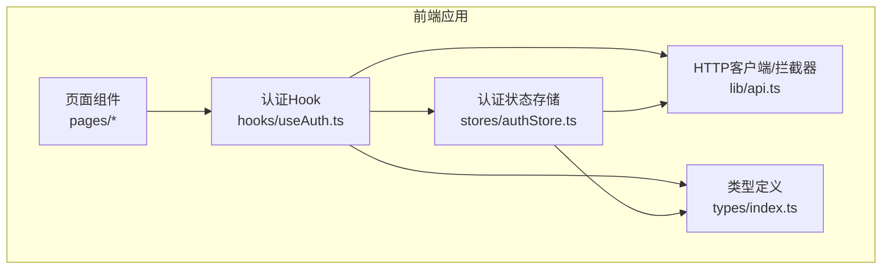
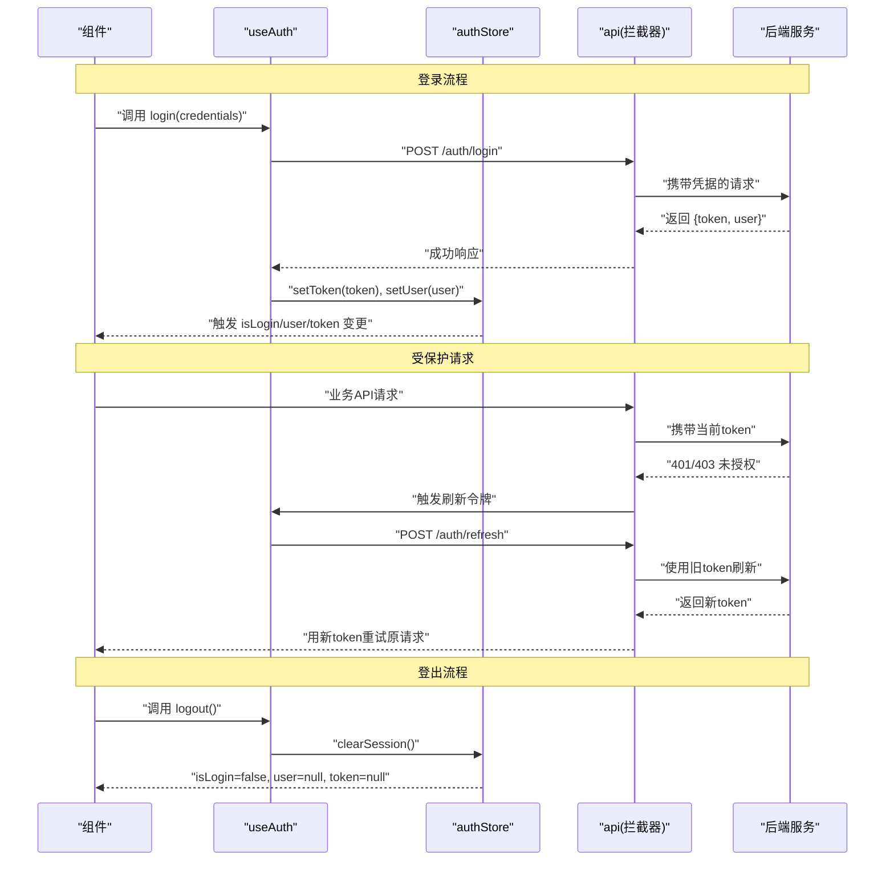
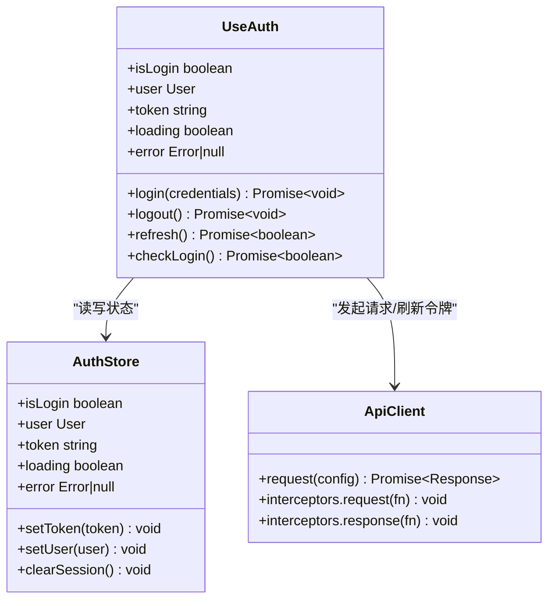
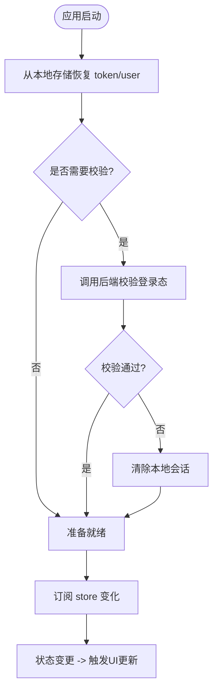
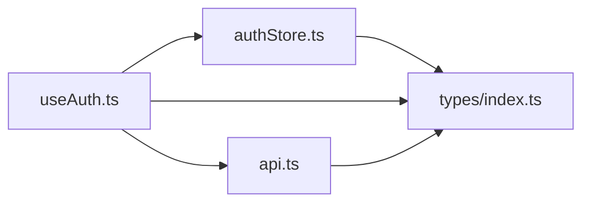

# useAuth认证Hook

<cite>
**本文引用的文件**   
- [useAuth.ts](file://web/src/hooks/useAuth.ts)
- [authStore.ts](file://web/src/stores/authStore.ts)
- [api.ts](file://web/src/lib/api.ts)
- [index.ts](file://web/src/types/index.ts)
- [login/index.tsx](file://web/src/pages/login/index.tsx)
</cite>

## 目录
1. [简介](#简介)
2. [项目结构](#项目结构)
3. [核心组件](#核心组件)
4. [架构总览](#架构总览)
5. [详细组件分析](#详细组件分析)
6. [依赖分析](#依赖分析)
7. [性能考虑](#性能考虑)
8. [故障排查指南](#故障排查指南)
9. [结论](#结论)
10. [附录](#附录)

## 简介
本文件为 pj3 项目的 useAuth Hook 提供完整的技术文档。内容涵盖：
- 认证状态管理机制与用户登录、登出流程的实现原理
- 与 authStore 的状态同步机制，以及如何订阅认证状态变化
- 用户信息获取与缓存策略（token 管理、会话保持）
- 完整的 API 接口说明（方法与属性）
- 在组件中的集成方式与最佳实践
- 错误处理机制（网络请求失败、token 过期等异常场景）

## 项目结构
与 useAuth 相关的核心代码位于以下位置：
- hooks/useAuth.ts：封装认证逻辑的 React Hook
- stores/authStore.ts：基于 zustand 的认证状态存储
- lib/api.ts：HTTP 客户端与拦截器（用于 token 注入、刷新与错误处理）
- types/index.ts：认证相关类型定义
- pages/login/index.tsx：登录页面示例，演示如何调用 useAuth

图表来源
- [useAuth.ts](file://web/src/hooks/useAuth.ts)
- [authStore.ts](file://web/src/stores/authStore.ts)
- [api.ts](file://web/src/lib/api.ts)
- [index.ts](file://web/src/types/index.ts)

章节来源
- [useAuth.ts](file://web/src/hooks/useAuth.ts)
- [authStore.ts](file://web/src/stores/authStore.ts)
- [api.ts](file://web/src/lib/api.ts)
- [index.ts](file://web/src/types/index.ts)

## 核心组件
- useAuth Hook
  - 职责：对外暴露登录、登出、刷新令牌、检查登录态等方法；提供 isLogin、user、token 等只读状态；内部协调 authStore 与 api 客户端。
  - 关键能力：
    - 登录：提交凭据，成功后持久化 token 并更新 store
    - 登出：清除本地持久化数据并重置 store
    - 刷新令牌：在 token 即将过期或已过期时自动刷新
    - 状态订阅：通过 store.subscribe 监听认证状态变化
- authStore
  - 职责：集中管理认证状态（isLogin、user、token、loading、error），并提供 setToken、setUser、clearSession 等动作
  - 持久化：将 token 与必要用户信息持久化到 localStorage/sessionStorage，保证刷新后仍保持会话
- api 客户端
  - 职责：统一发起网络请求；在请求头中注入 token；对 401/403 等响应进行拦截与重试；支持 token 刷新流程

章节来源
- [useAuth.ts](file://web/src/hooks/useAuth.ts)
- [authStore.ts](file://web/src/stores/authStore.ts)
- [api.ts](file://web/src/lib/api.ts)

## 架构总览
下图展示了从组件调用 useAuth 到后端鉴权的整体流程，包括登录、登出、token 刷新与错误处理路径。

图表来源
- [useAuth.ts](file://web/src/hooks/useAuth.ts)
- [authStore.ts](file://web/src/stores/authStore.ts)
- [api.ts](file://web/src/lib/api.ts)

## 详细组件分析

### useAuth Hook 设计
- 对外暴露方法
  - login(credentials): 执行登录，成功后设置 token 与用户信息
  - logout(): 清理本地会话并重置状态
  - refresh(): 主动刷新 token
  - checkLogin(): 校验当前登录态（可结合后端接口验证）
- 对外暴露状态
  - isLogin: 是否已登录
  - user: 当前用户信息
  - token: 当前访问令牌
  - loading/error: 操作过程中的加载与错误状态
- 内部实现要点
  - 通过 authStore 读写状态，确保跨组件共享
  - 借助 api 拦截器统一注入 token 与处理 401/403
  - 使用 store.subscribe 订阅状态变化，驱动 UI 更新
  - 在首次挂载时尝试恢复持久化的 token 并校验有效性

图表来源
- [useAuth.ts](file://web/src/hooks/useAuth.ts)
- [authStore.ts](file://web/src/stores/authStore.ts)
- [api.ts](file://web/src/lib/api.ts)

章节来源
- [useAuth.ts](file://web/src/hooks/useAuth.ts)
- [authStore.ts](file://web/src/stores/authStore.ts)
- [api.ts](file://web/src/lib/api.ts)

### 认证状态同步机制
- 状态源：authStore 作为单一事实来源，保存 isLogin、user、token、loading、error
- 订阅更新：useAuth 在初始化时订阅 store 的变化，当状态改变时触发组件重渲染
- 持久化：store 在 token 或 user 变更时写入本地存储；应用启动时从本地存储恢复状态
- 一致性保障：所有写操作均通过 store 的动作函数完成，避免分散状态导致不一致

图表来源
- [authStore.ts](file://web/src/stores/authStore.ts)
- [api.ts](file://web/src/lib/api.ts)

章节来源
- [authStore.ts](file://web/src/stores/authStore.ts)
- [api.ts](file://web/src/lib/api.ts)

### 用户信息获取与缓存策略
- 用户信息获取
  - 登录成功后由后端返回 user 信息，useAuth 将其写入 store
  - 登出后清空 user
- 缓存策略
  - token 与必要用户信息持久化到本地存储，保证刷新后仍保持会话
  - 对于敏感字段，建议仅缓存最小必要信息
- Token 管理
  - 请求前自动注入 Authorization 头
  - 收到 401/403 时触发刷新流程，刷新成功后重试原请求
  - 刷新失败则清理会话并跳转至登录页

章节来源
- [useAuth.ts](file://web/src/hooks/useAuth.ts)
- [authStore.ts](file://web/src/stores/authStore.ts)
- [api.ts](file://web/src/lib/api.ts)

### API 接口说明
以下为 useAuth 对外提供的常用方法与属性说明（以行为描述为主，不展示具体代码）：
- 方法
  - login(credentials): 提交用户名/密码或其他凭据，成功后设置 token 与用户信息
  - logout(): 清理本地会话并重置认证状态
  - refresh(): 主动刷新 token，返回刷新是否成功
  - checkLogin(): 校验当前登录态，返回布尔值
- 属性
  - isLogin: 当前是否已登录
  - user: 当前用户信息对象
  - token: 当前访问令牌
  - loading: 是否有正在进行的认证操作
  - error: 最近一次认证操作的错误信息
- 事件与副作用
  - 状态变化会触发订阅者更新
  - 401/403 响应会触发自动刷新与重试
  - 刷新失败会清理会话并提示用户重新登录

章节来源
- [useAuth.ts](file://web/src/hooks/useAuth.ts)
- [authStore.ts](file://web/src/stores/authStore.ts)
- [api.ts](file://web/src/lib/api.ts)

### 在组件中的集成方式与最佳实践
- 基本用法
  - 在任意组件中引入 useAuth，解构所需方法与状态
  - 在需要鉴权的区域根据 isLogin 控制渲染或路由跳转
- 登录表单集成
  - 在登录页面调用 login(credentials)，成功后跳转到目标页面
  - 失败时读取 error 并展示给用户
- 受保护资源
  - 在路由守卫或布局层统一检查 isLogin，未登录时重定向到登录页
- 最佳实践
  - 避免在高频渲染路径中重复调用 login/logout
  - 使用防抖/节流优化刷新逻辑，避免并发刷新
  - 仅在必要时缓存用户信息，减少敏感数据暴露面

章节来源
- [login/index.tsx](file://web/src/pages/login/index.tsx)
- [useAuth.ts](file://web/src/hooks/useAuth.ts)

## 依赖分析
useAuth 与 authStore、api 客户端之间存在明确的依赖关系：
- useAuth 依赖 authStore 读写认证状态
- useAuth 依赖 api 客户端发起登录、刷新与业务请求
- api 客户端依赖全局配置与拦截器处理 token 注入与错误

图表来源
- [useAuth.ts](file://web/src/hooks/useAuth.ts)
- [authStore.ts](file://web/src/stores/authStore.ts)
- [api.ts](file://web/src/lib/api.ts)
- [index.ts](file://web/src/types/index.ts)

章节来源
- [useAuth.ts](file://web/src/hooks/useAuth.ts)
- [authStore.ts](file://web/src/stores/authStore.ts)
- [api.ts](file://web/src/lib/api.ts)
- [index.ts](file://web/src/types/index.ts)

## 性能考虑
- 避免不必要的重渲染
  - 使用 store 的 select 订阅最小状态片段，减少组件重渲染范围
- 刷新去抖与并发控制
  - 对刷新令牌进行去抖与锁，防止多次并发刷新造成竞态
- 本地存储读写优化
  - 合并频繁的状态写入，降低 I/O 开销
- 错误重试退避
  - 对刷新失败采用指数退避，避免雪崩效应

[本节为通用指导，无需列出具体文件来源]

## 故障排查指南
常见问题与定位步骤：
- 网络请求失败
  - 检查 api 拦截器的错误分支是否正确捕获与上报
  - 确认后端返回的错误码与消息格式是否符合预期
- Token 过期
  - 观察 401/403 响应是否触发刷新流程
  - 检查刷新接口是否可用，以及旧 token 是否被正确传递
- 会话丢失
  - 确认本地存储是否被浏览器策略或隐私模式限制
  - 检查应用启动时的恢复逻辑是否执行成功
- 状态不同步
  - 确认所有写操作均通过 store 的动作函数完成
  - 检查是否存在多处直接修改状态的代码

章节来源
- [api.ts](file://web/src/lib/api.ts)
- [authStore.ts](file://web/src/stores/authStore.ts)
- [useAuth.ts](file://web/src/hooks/useAuth.ts)

## 结论
useAuth 通过集中式的 authStore 与统一的 api 拦截器，实现了稳定可靠的认证状态管理与会话保持。其设计遵循单一事实来源、最小权限与可观测性原则，便于在复杂业务场景中扩展与维护。建议在项目中严格遵循本文的最佳实践，以确保用户体验与安全性的平衡。

[本节为总结性内容，无需列出具体文件来源]

## 附录
- 类型参考
  - 用户信息、错误对象、认证响应等类型定义参见 types/index.ts
- 示例页面
  - 登录页面集成示例参见 pages/login/index.tsx

章节来源
- [index.ts](file://web/src/types/index.ts)
- [login/index.tsx](file://web/src/pages/login/index.tsx)