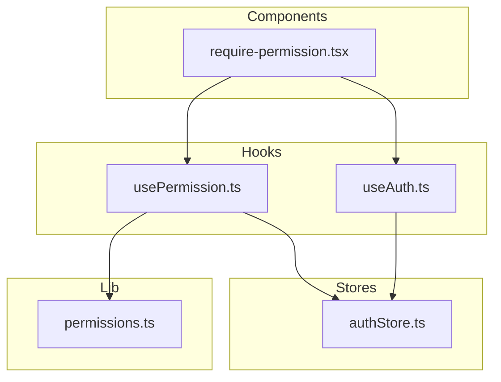
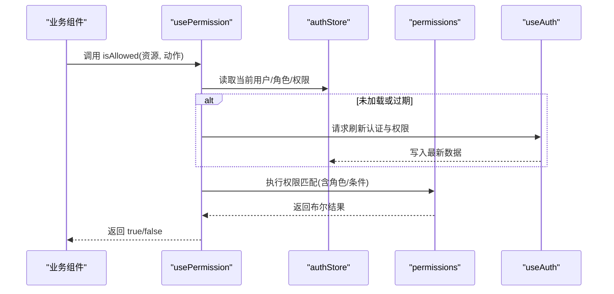
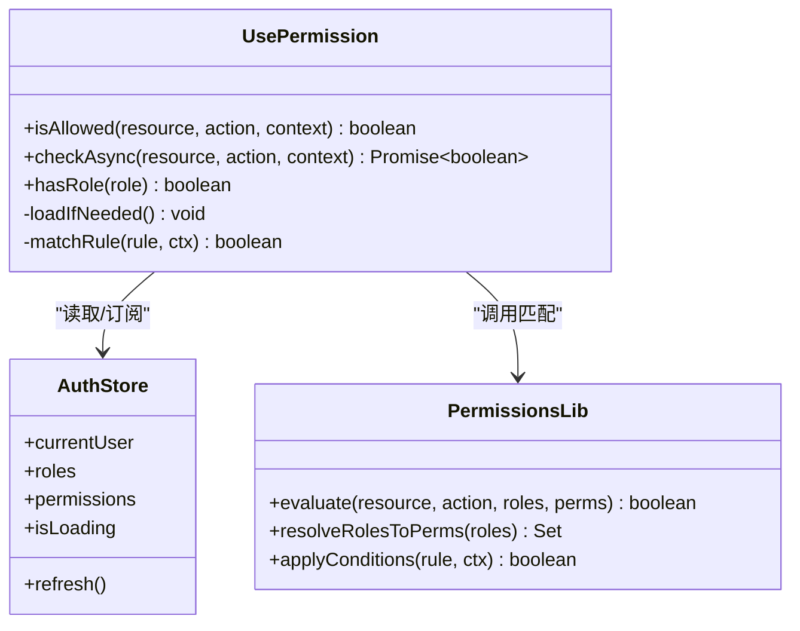
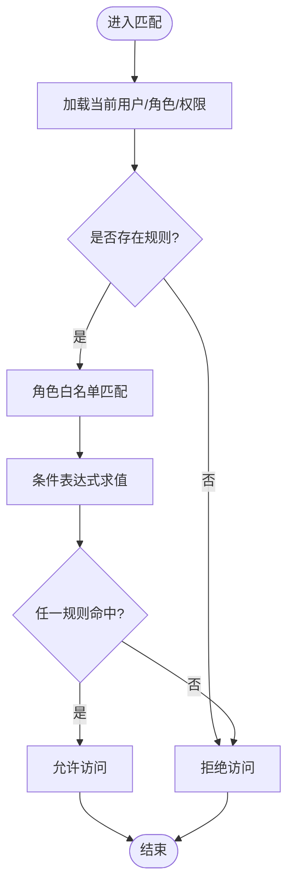
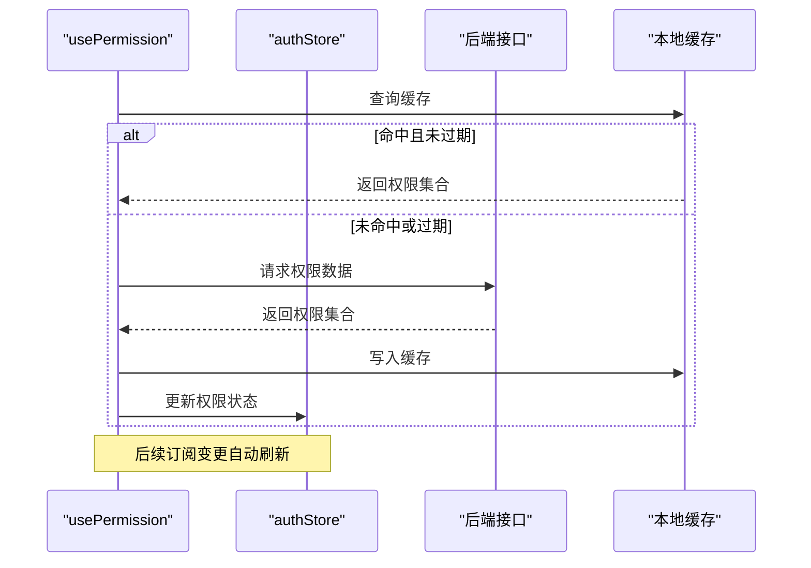
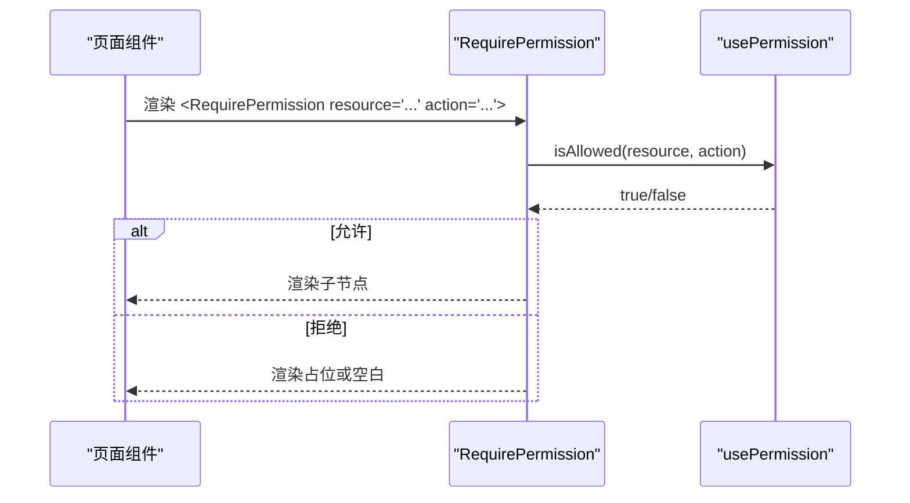
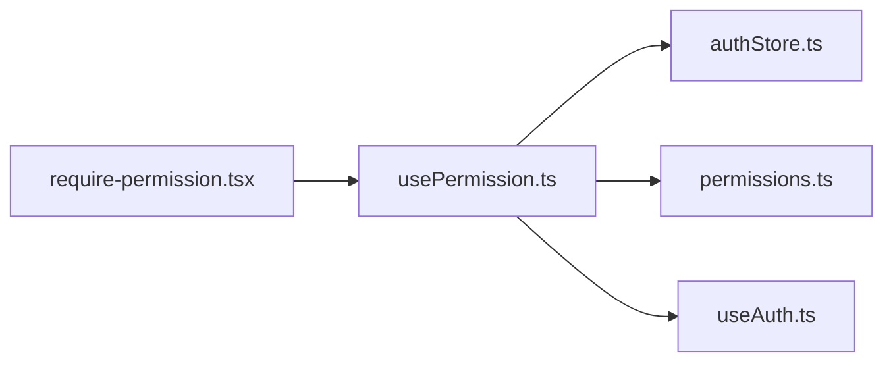

# usePermission权限Hook

<cite>
**本文引用的文件**   
- [usePermission.ts](file://web/src/hooks/usePermission.ts)
- [useAuth.ts](file://web/src/hooks/useAuth.ts)
- [authStore.ts](file://web/src/stores/authStore.ts)
- [permissions.ts](file://web/src/lib/permissions.ts)
- [require-permission.tsx](file://web/src/components/layout/require-permission.tsx)
- [usePermission.test.tsx](file://web/src/hooks/__tests__/usePermission.test.tsx)
- [require-permission.test.tsx](file://web/src/components/layout/__tests__/require-permission.test.tsx)
</cite>

## 目录
1. [简介](#简介)
2. [项目结构](#项目结构)
3. [核心组件](#核心组件)
4. [架构总览](#架构总览)
5. [详细组件分析](#详细组件分析)
6. [依赖分析](#依赖分析)
7. [性能考虑](#性能考虑)
8. [故障排查指南](#故障排查指南)
9. [结论](#结论)
10. [附录](#附录)

## 简介
本文件为 pj3 项目的 usePermission Hook 提供系统化文档，覆盖权限检查机制的实现原理、与权限系统的集成方式、异步加载与缓存策略、配置示例、典型应用场景（路由守卫、按钮级控制）、继承与组合模式、扩展自定义规则以及性能优化与常见问题解决方案。目标是帮助开发者快速理解并正确使用该 Hook，构建稳定、可维护的前端权限体系。

## 项目结构
与 usePermission 相关的代码主要分布在 hooks、stores、lib 和 components 四个层次：
- hooks：暴露 usePermission 与 useAuth 两个关键 Hook
- stores：集中管理认证与权限状态
- lib：封装权限判断与规则解析逻辑
- components：提供基于 Hook 的声明式权限守卫组件

图表来源
- [usePermission.ts](file://web/src/hooks/usePermission.ts)
- [useAuth.ts](file://web/src/hooks/useAuth.ts)
- [authStore.ts](file://web/src/stores/authStore.ts)
- [permissions.ts](file://web/src/lib/permissions.ts)
- [require-permission.tsx](file://web/src/components/layout/require-permission.tsx)

章节来源
- [usePermission.ts](file://web/src/hooks/usePermission.ts)
- [useAuth.ts](file://web/src/hooks/useAuth.ts)
- [authStore.ts](file://web/src/stores/authStore.ts)
- [permissions.ts](file://web/src/lib/permissions.ts)
- [require-permission.tsx](file://web/src/components/layout/require-permission.tsx)

## 核心组件
- usePermission：提供 isAllowed、hasRole、checkAsync 等能力，统一进行权限判定；内部负责从 store 获取当前用户角色与权限集合，调用权限库进行匹配，并处理异步加载与缓存。
- useAuth：封装认证相关状态与刷新流程，供 usePermission 在必要时触发重新加载或刷新。
- authStore：集中存储用户信息、角色列表、权限集合及加载状态，提供更新与订阅能力。
- permissions：实现权限规则解析、角色到权限映射、条件表达式求值等核心算法。
- require-permission：基于 usePermission 的声明式权限守卫组件，用于页面或区块级别的访问控制。

章节来源
- [usePermission.ts](file://web/src/hooks/usePermission.ts)
- [useAuth.ts](file://web/src/hooks/useAuth.ts)
- [authStore.ts](file://web/src/stores/authStore.ts)
- [permissions.ts](file://web/src/lib/permissions.ts)
- [require-permission.tsx](file://web/src/components/layout/require-permission.tsx)

## 架构总览
下图展示了 usePermission 在应用中的整体交互关系：组件通过 Hook 发起权限检查，Hook 从 Store 读取当前上下文，使用权限库执行规则匹配，必要时触发异步加载与缓存更新，最终返回布尔结果或 Promise。

图表来源
- [usePermission.ts](file://web/src/hooks/usePermission.ts)
- [authStore.ts](file://web/src/stores/authStore.ts)
- [permissions.ts](file://web/src/lib/permissions.ts)
- [useAuth.ts](file://web/src/hooks/useAuth.ts)

## 详细组件分析

### usePermission 设计要点
- 输入参数
  - 资源标识：字符串或对象键名
  - 动作标识：字符串或枚举
  - 可选条件：用于动态校验的上下文数据
- 返回值
  - 同步方法：isAllowed(resource, action, context?) -> boolean
  - 异步方法：checkAsync(resource, action, context?) -> Promise<boolean>
  - 辅助方法：hasRole(role) -> boolean
- 内部职责
  - 从 authStore 拉取当前用户、角色与权限集合
  - 调用 permissions 模块进行规则匹配
  - 管理权限数据的加载、缓存与失效策略
  - 在认证状态变化时自动刷新权限

图表来源
- [usePermission.ts](file://web/src/hooks/usePermission.ts)
- [authStore.ts](file://web/src/stores/authStore.ts)
- [permissions.ts](file://web/src/lib/permissions.ts)

章节来源
- [usePermission.ts](file://web/src/hooks/usePermission.ts)
- [authStore.ts](file://web/src/stores/authStore.ts)
- [permissions.ts](file://web/src/lib/permissions.ts)

### 权限判断与规则引擎
- 规则模型
  - 资源-动作对：如 ["orders", "create"]
  - 角色白名单：仅允许特定角色访问
  - 条件表达式：基于上下文字段进行细粒度控制
- 匹配流程
  - 先按角色白名单过滤
  - 再按条件表达式求值
  - 支持“或”组合多个规则项
- 复杂度
  - 单次匹配时间复杂度近似 O(R + C)，R 为规则数量，C 为条件项数量
  - 可通过缓存与索引优化热点路径

图表来源
- [permissions.ts](file://web/src/lib/permissions.ts)

章节来源
- [permissions.ts](file://web/src/lib/permissions.ts)

### 异步加载、缓存与更新策略
- 加载时机
  - 首次调用时若权限未就绪，则触发异步加载
  - 认证状态变更时主动刷新
- 缓存策略
  - 内存缓存：避免重复网络请求
  - 失效策略：基于时间戳或事件驱动（如登录成功、角色切换）
- 更新机制
  - 通过 authStore 的更新回调通知 usePermission 刷新
  - 支持按需局部刷新（仅刷新受影响规则）

图表来源
- [usePermission.ts](file://web/src/hooks/usePermission.ts)
- [authStore.ts](file://web/src/stores/authStore.ts)

章节来源
- [usePermission.ts](file://web/src/hooks/usePermission.ts)
- [authStore.ts](file://web/src/stores/authStore.ts)

### 与认证系统集成
- useAuth 提供统一的认证生命周期管理，包括登录、登出、刷新 token 与权限
- usePermission 在需要时调用 useAuth 刷新，确保权限与当前会话一致
- 建议在应用启动阶段预加载权限，减少首屏阻塞

章节来源
- [useAuth.ts](file://web/src/hooks/useAuth.ts)
- [usePermission.ts](file://web/src/hooks/usePermission.ts)

### 声明式权限守卫：RequirePermission
- 作用：在组件树中根据权限决定是否渲染子节点
- 用法：包裹需要保护的页面或区块，传入资源与动作
- 行为：无权限时渲染 fallback 或直接隐藏

图表来源
- [require-permission.tsx](file://web/src/components/layout/require-permission.tsx)
- [usePermission.ts](file://web/src/hooks/usePermission.ts)

章节来源
- [require-permission.tsx](file://web/src/components/layout/require-permission.tsx)
- [usePermission.ts](file://web/src/hooks/usePermission.ts)

### 测试与验证
- usePermission 单元测试：覆盖正常允许、拒绝、异步加载、缓存命中等场景
- RequirePermission 组件测试：验证不同权限下的渲染分支

章节来源
- [usePermission.test.tsx](file://web/src/hooks/__tests__/usePermission.test.tsx)
- [require-permission.test.tsx](file://web/src/components/layout/__tests__/require-permission.test.tsx)

## 依赖分析
- 耦合关系
  - usePermission 强依赖 authStore 与 permissions
  - RequirePermission 依赖 usePermission 与 useAuth
- 外部依赖
  - 认证服务与权限接口由 useAuth 抽象，便于替换实现
- 潜在循环依赖
  - 当前结构清晰，未见循环引用风险

图表来源
- [require-permission.tsx](file://web/src/components/layout/require-permission.tsx)
- [usePermission.ts](file://web/src/hooks/usePermission.ts)
- [authStore.ts](file://web/src/stores/authStore.ts)
- [permissions.ts](file://web/src/lib/permissions.ts)
- [useAuth.ts](file://web/src/hooks/useAuth.ts)

章节来源
- [require-permission.tsx](file://web/src/components/layout/require-permission.tsx)
- [usePermission.ts](file://web/src/hooks/usePermission.ts)
- [authStore.ts](file://web/src/stores/authStore.ts)
- [permissions.ts](file://web/src/lib/permissions.ts)
- [useAuth.ts](file://web/src/hooks/useAuth.ts)

## 性能考虑
- 缓存优先：优先命中内存缓存，减少网络请求
- 增量更新：仅在必要范围触发重渲染，避免整页刷新
- 规则索引：对高频资源建立索引，降低匹配开销
- 懒加载：非首屏权限按需加载，缩短首屏时间
- 去抖与合并：批量权限检查时合并请求，避免抖动

[本节为通用建议，不直接分析具体文件]

## 故障排查指南
- 现象：权限始终为 false
  - 检查 authStore 是否已正确加载用户与权限
  - 确认 permissions 规则定义与资源/动作命名一致
  - 查看日志输出与断点位置，定位匹配失败环节
- 现象：权限更新不及时
  - 确认认证刷新后是否正确触发权限重载
  - 检查缓存失效策略是否合理
- 现象：首屏卡顿
  - 评估是否启用预加载与并行请求
  - 将非关键权限延迟加载

章节来源
- [usePermission.ts](file://web/src/hooks/usePermission.ts)
- [authStore.ts](file://web/src/stores/authStore.ts)
- [permissions.ts](file://web/src/lib/permissions.ts)

## 结论
usePermission 以 Hook 形式将权限检查内聚于组件层，结合 authStore 与权限规则引擎，实现了灵活、可扩展且高性能的权限控制方案。通过声明式守卫与异步缓存策略，既保证了安全性，又兼顾了用户体验。建议在生产环境中配合监控与测试用例持续完善权限规则与边界场景。

## 附录

### 配置与使用示例（说明性）
- 基础用法
  - 在组件中调用 isAllowed("orders", "create") 判断是否允许创建订单
  - 使用 hasRole("admin") 判断是否为管理员
- 异步用法
  - 使用 checkAsync("reports", "export") 等待权限加载完成后返回结果
- 路由守卫
  - 在路由层使用 RequirePermission 包裹受保护页面
- 按钮级控制
  - 在按钮渲染前使用 isAllowed 控制显示/禁用

[本节为概念性说明，不直接分析具体文件]