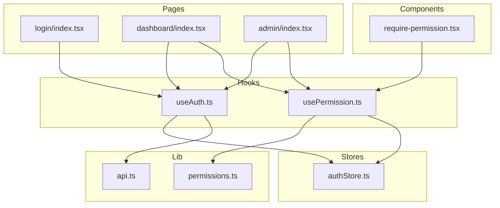
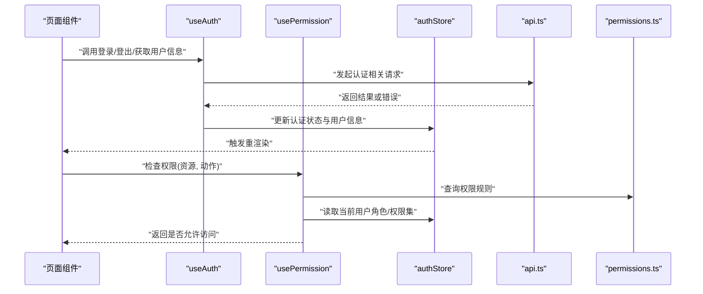
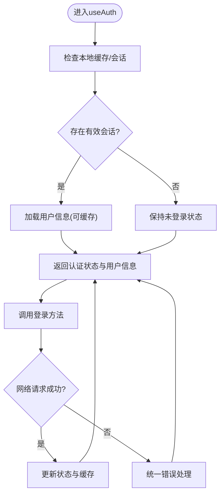
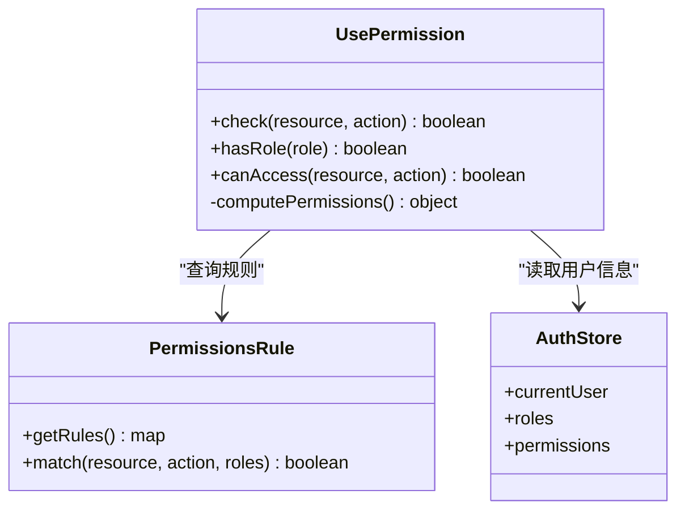
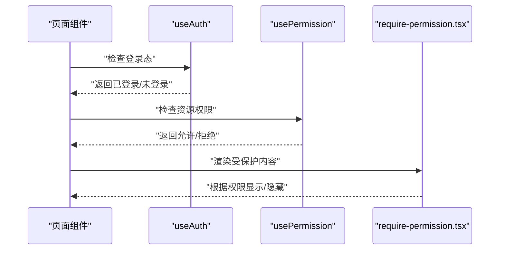
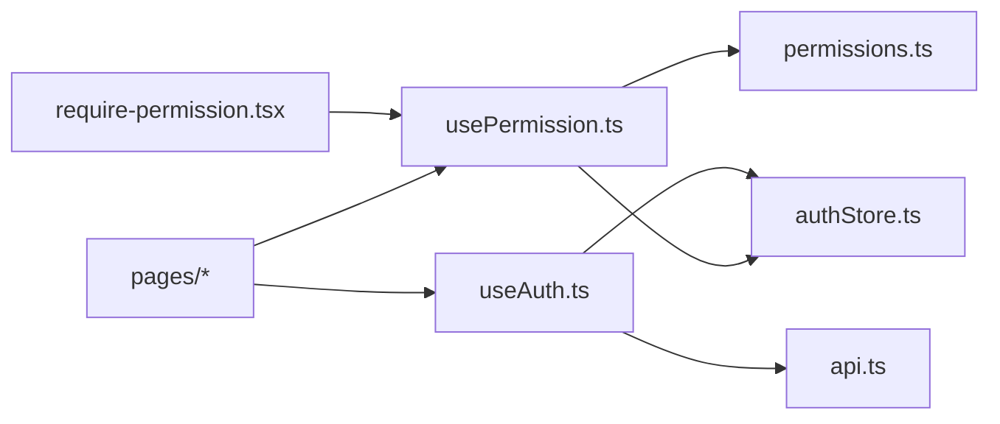

# 自定义Hooks模式

<cite>
**本文引用的文件**   
- [useAuth.ts](file://web/src/hooks/useAuth.ts)
- [usePermission.ts](file://web/src/hooks/usePermission.ts)
- [authStore.ts](file://web/src/stores/authStore.ts)
- [permissions.ts](file://web/src/lib/permissions.ts)
- [api.ts](file://web/src/lib/api.ts)
- [require-permission.tsx](file://web/src/components/layout/require-permission.tsx)
- [login/index.tsx](file://web/src/pages/login/index.tsx)
- [dashboard/index.tsx](file://web/src/pages/dashboard/index.tsx)
- [admin/index.tsx](file://web/src/pages/admin/index.tsx)
</cite>

## 目录
1. [简介](#简介)
2. [项目结构](#项目结构)
3. [核心组件](#核心组件)
4. [架构总览](#架构总览)
5. [详细组件分析](#详细组件分析)
6. [依赖分析](#依赖分析)
7. [性能考虑](#性能考虑)
8. [故障排查指南](#故障排查指南)
9. [结论](#结论)
10. [附录](#附录)

## 简介
本文件面向pj3项目的自定义Hooks模式，重点围绕认证与权限两大能力展开：
- useAuth Hook：封装认证状态订阅、登录登出流程与用户信息获取，提供稳定的响应式数据源。
- usePermission Hook：封装权限检查、角色验证与访问控制逻辑，支持细粒度资源级权限判断。
- 组合模式：展示如何将多个Hook组合使用，实现复杂业务场景（如页面级权限守卫、条件渲染等）。
- 错误处理：覆盖网络请求失败、权限拒绝等异常路径的统一处理策略。
- 性能优化：结合React最佳实践，给出useMemo、useCallback等优化建议与示例路径。

## 项目结构
与自定义Hooks相关的核心位置如下：
- hooks：自定义Hook实现（useAuth、usePermission）
- stores：全局状态存储（authStore）
- lib：通用工具与权限规则（permissions、api）
- components/layout：基于Hook的UI层权限守卫（require-permission）
- pages：典型页面集成示例（登录、仪表盘、管理员）

图表来源
- [useAuth.ts:1-200](file://web/src/hooks/useAuth.ts#L1-L200)
- [usePermission.ts:1-200](file://web/src/hooks/usePermission.ts#L1-L200)
- [authStore.ts:1-200](file://web/src/stores/authStore.ts#L1-L200)
- [permissions.ts:1-200](file://web/src/lib/permissions.ts#L1-L200)
- [api.ts:1-200](file://web/src/lib/api.ts#L1-L200)
- [require-permission.tsx:1-200](file://web/src/components/layout/require-permission.tsx#L1-L200)
- [login/index.tsx:1-200](file://web/src/pages/login/index.tsx#L1-L200)
- [dashboard/index.tsx:1-200](file://web/src/pages/dashboard/index.tsx#L1-L200)
- [admin/index.tsx:1-200](file://web/src/pages/admin/index.tsx#L1-L200)

章节来源
- [useAuth.ts:1-200](file://web/src/hooks/useAuth.ts#L1-L200)
- [usePermission.ts:1-200](file://web/src/hooks/usePermission.ts#L1-L200)
- [authStore.ts:1-200](file://web/src/stores/authStore.ts#L1-L200)
- [permissions.ts:1-200](file://web/src/lib/permissions.ts#L1-L200)
- [api.ts:1-200](file://web/src/lib/api.ts#L1-L200)
- [require-permission.tsx:1-200](file://web/src/components/layout/require-permission.tsx#L1-L200)
- [login/index.tsx:1-200](file://web/src/pages/login/index.tsx#L1-L200)
- [dashboard/index.tsx:1-200](file://web/src/pages/dashboard/index.tsx#L1-L200)
- [admin/index.tsx:1-200](file://web/src/pages/admin/index.tsx#L1-L200)

## 核心组件
本节聚焦两个核心Hook的设计与职责边界：
- useAuth：负责认证生命周期管理（登录、登出、刷新）、用户信息读取、认证状态订阅与持久化。
- usePermission：负责权限判定（资源+动作）、角色校验、访问控制决策，并暴露便捷API供组件消费。

章节来源
- [useAuth.ts:1-200](file://web/src/hooks/useAuth.ts#L1-L200)
- [usePermission.ts:1-200](file://web/src/hooks/usePermission.ts#L1-L200)

## 架构总览
下图展示了从页面到Hook再到Store与权限库的调用关系，以及UI层对权限守卫的使用方式。

图表来源
- [useAuth.ts:1-200](file://web/src/hooks/useAuth.ts#L1-L200)
- [usePermission.ts:1-200](file://web/src/hooks/usePermission.ts#L1-L200)
- [authStore.ts:1-200](file://web/src/stores/authStore.ts#L1-L200)
- [api.ts:1-200](file://web/src/lib/api.ts#L1-L200)
- [permissions.ts:1-200](file://web/src/lib/permissions.ts#L1-L200)

## 详细组件分析

### useAuth Hook 分析
- 设计目标
  - 统一认证状态订阅：将认证状态与用户信息集中管理，避免分散在多处。
  - 登录/登出流程封装：对外暴露简洁方法，内部处理网络请求、状态同步与错误提示。
  - 用户信息获取：提供受控的用户信息读取接口，支持缓存与失效策略。
- 关键能力
  - 认证状态订阅：通过Store提供的响应式数据源，自动订阅变更并驱动UI更新。
  - 登录流程：校验输入、发送请求、落盘Token/会话、更新用户信息、路由跳转。
  - 登出流程：清理本地凭证、重置状态、跳转至登录页。
  - 用户信息获取：优先读缓存，必要时拉取服务端最新信息并缓存。
- 错误处理
  - 网络异常：捕获超时、断网、服务端错误，统一提示并重试策略。
  - 认证失败：根据错误码区分未授权、令牌过期等，执行相应恢复流程。
- 性能优化
  - 使用useMemo缓存派生值（如“是否已登录”、“用户角色集合”）。
  - 使用useCallback稳定函数引用，避免子组件不必要的重渲染。
  - 合理设置订阅粒度，避免全量状态变化导致的过度渲染。

图表来源
- [useAuth.ts:1-200](file://web/src/hooks/useAuth.ts#L1-L200)
- [authStore.ts:1-200](file://web/src/stores/authStore.ts#L1-L200)
- [api.ts:1-200](file://web/src/lib/api.ts#L1-L200)

章节来源
- [useAuth.ts:1-200](file://web/src/hooks/useAuth.ts#L1-L200)
- [authStore.ts:1-200](file://web/src/stores/authStore.ts#L1-L200)
- [api.ts:1-200](file://web/src/lib/api.ts#L1-L200)

### usePermission Hook 分析
- 设计目标
  - 统一的权限检查入口：屏蔽底层规则与角色细节，提供一致的API。
  - 资源+动作模型：以“资源:动作”形式进行细粒度控制。
  - 角色验证：支持基于角色的快速判定与扩展。
- 关键能力
  - 权限检查机制：根据当前用户权限集与规则表进行匹配。
  - 访问控制逻辑：返回布尔值或结构化结果，便于UI层分支渲染或拦截。
  - 组合判断：支持多条件与优先级策略（例如显式允许优先于默认拒绝）。
- 错误处理
  - 规则缺失：当权限规则未配置时，采用安全默认（拒绝或降级）。
  - 状态不一致：当用户信息与权限不同步时，触发重新计算或提示刷新。
- 性能优化
  - 使用useMemo缓存权限检查结果，减少重复计算。
  - 使用useCallback包装权限检查函数，保证引用稳定。
  - 针对高频判定的场景，引入局部缓存或预计算策略。

图表来源
- [usePermission.ts:1-200](file://web/src/hooks/usePermission.ts#L1-L200)
- [permissions.ts:1-200](file://web/src/lib/permissions.ts#L1-L200)
- [authStore.ts:1-200](file://web/src/stores/authStore.ts#L1-L200)

章节来源
- [usePermission.ts:1-200](file://web/src/hooks/usePermission.ts#L1-L200)
- [permissions.ts:1-200](file://web/src/lib/permissions.ts#L1-L200)
- [authStore.ts:1-200](file://web/src/stores/authStore.ts#L1-L200)

### Hook的组合模式
- 常见组合
  - 页面级守卫：在页面入口处同时使用useAuth与usePermission，完成登录态与权限双重校验。
  - 按钮级控制：在交互元素上基于usePermission的结果动态启用/禁用或隐藏。
  - 数据加载前置：在useAuth确认登录后，再触发需要鉴权的业务数据拉取。
- 示例路径
  - 登录页：结合useAuth完成登录流程与跳转。
  - 仪表盘：在useAuth基础上，按需使用usePermission控制功能可见性。
  - 管理员页：严格依赖usePermission进行高敏感操作保护。

图表来源
- [login/index.tsx:1-200](file://web/src/pages/login/index.tsx#L1-L200)
- [dashboard/index.tsx:1-200](file://web/src/pages/dashboard/index.tsx#L1-L200)
- [admin/index.tsx:1-200](file://web/src/pages/admin/index.tsx#L1-L200)
- [require-permission.tsx:1-200](file://web/src/components/layout/require-permission.tsx#L1-L200)

章节来源
- [login/index.tsx:1-200](file://web/src/pages/login/index.tsx#L1-L200)
- [dashboard/index.tsx:1-200](file://web/src/pages/dashboard/index.tsx#L1-L200)
- [admin/index.tsx:1-200](file://web/src/pages/admin/index.tsx#L1-L200)
- [require-permission.tsx:1-200](file://web/src/components/layout/require-permission.tsx#L1-L200)

## 依赖分析
- 直接依赖
  - useAuth依赖authStore与api，用于状态管理与网络请求。
  - usePermission依赖permissions与authStore，用于规则匹配与用户上下文。
- 间接依赖
  - UI层通过require-permission组件间接依赖usePermission。
  - 页面组件通过useAuth与usePermission组合，形成完整的认证与权限闭环。
- 潜在耦合点
  - authStore的状态结构与字段命名变更会影响useAuth与usePermission。
  - permissions规则表的结构变更需同步调整usePermission的匹配逻辑。

图表来源
- [useAuth.ts:1-200](file://web/src/hooks/useAuth.ts#L1-L200)
- [usePermission.ts:1-200](file://web/src/hooks/usePermission.ts#L1-L200)
- [authStore.ts:1-200](file://web/src/stores/authStore.ts#L1-L200)
- [permissions.ts:1-200](file://web/src/lib/permissions.ts#L1-L200)
- [api.ts:1-200](file://web/src/lib/api.ts#L1-L200)
- [require-permission.tsx:1-200](file://web/src/components/layout/require-permission.tsx#L1-L200)

章节来源
- [useAuth.ts:1-200](file://web/src/hooks/useAuth.ts#L1-L200)
- [usePermission.ts:1-200](file://web/src/hooks/usePermission.ts#L1-L200)
- [authStore.ts:1-200](file://web/src/stores/authStore.ts#L1-L200)
- [permissions.ts:1-200](file://web/src/lib/permissions.ts#L1-L200)
- [api.ts:1-200](file://web/src/lib/api.ts#L1-L200)
- [require-permission.tsx:1-200](file://web/src/components/layout/require-permission.tsx#L1-L200)

## 性能考虑
- useMemo
  - 适用于计算密集型派生值，如“用户角色集合”、“权限矩阵”。
  - 注意依赖数组的正确维护，避免遗漏导致缓存失效。
- useCallback
  - 适用于作为props传递给子组件的回调函数，防止子组件因引用变化而重渲染。
  - 对于频繁触发的事件处理（如点击检查权限），建议使用useCallback包装。
- 订阅粒度
  - 在authStore中尽量拆分状态，使useAuth只订阅必要字段，降低重渲染范围。
- 缓存策略
  - 用户信息与权限结果可短期缓存，配合失效策略（如登出、切换账号）清理。
- 错误重试与退避
  - 对网络请求实施指数退避与最大重试次数限制，避免雪崩。

[本节为通用性能指导，不直接分析具体文件]

## 故障排查指南
- 常见问题
  - 登录成功后仍显示未登录：检查authStore状态更新与useAuth订阅是否正确。
  - 权限检查误判：核对permissions规则与用户角色是否一致。
  - 网络请求失败：查看api的错误处理与重试策略，确认后端返回码。
- 定位步骤
  - 在useAuth与usePermission中加入日志输出，记录关键状态与返回值。
  - 使用浏览器开发者工具观察状态变化与网络请求。
  - 在require-permission组件中打印权限判定结果，辅助定位UI层问题。
- 恢复策略
  - 令牌过期：自动刷新或引导重新登录。
  - 权限不足：提供清晰的提示信息与替代路径。
  - 网络异常：提供重试按钮与离线提示。

章节来源
- [useAuth.ts:1-200](file://web/src/hooks/useAuth.ts#L1-L200)
- [usePermission.ts:1-200](file://web/src/hooks/usePermission.ts#L1-L200)
- [require-permission.tsx:1-200](file://web/src/components/layout/require-permission.tsx#L1-L200)
- [api.ts:1-200](file://web/src/lib/api.ts#L1-L200)

## 结论
通过useAuth与usePermission两个核心Hook，pj3项目在认证与权限方面实现了清晰的分层与良好的可扩展性。结合组合模式与完善的错误处理策略，能够在复杂业务场景中保持一致性与稳定性。遵循本文的性能优化建议与最佳实践，可进一步提升用户体验与系统健壮性。

[本节为总结性内容，不直接分析具体文件]

## 附录
- 代码示例路径（不含具体代码内容）
  - 登录流程示例：[login/index.tsx:1-200](file://web/src/pages/login/index.tsx#L1-L200)
  - 仪表盘权限控制示例：[dashboard/index.tsx:1-200](file://web/src/pages/dashboard/index.tsx#L1-L200)
  - 管理员页面守卫示例：[admin/index.tsx:1-200](file://web/src/pages/admin/index.tsx#L1-L200)
  - 权限守卫组件示例：[require-permission.tsx:1-200](file://web/src/components/layout/require-permission.tsx#L1-L200)
  - 认证Hook实现：[useAuth.ts:1-200](file://web/src/hooks/useAuth.ts#L1-L200)
  - 权限Hook实现：[usePermission.ts:1-200](file://web/src/hooks/usePermission.ts#L1-L200)
  - 权限规则定义：[permissions.ts:1-200](file://web/src/lib/permissions.ts#L1-L200)
  - 认证状态存储：[authStore.ts:1-200](file://web/src/stores/authStore.ts#L1-L200)
  - 网络请求封装：[api.ts:1-200](file://web/src/lib/api.ts#L1-L200)

[本节为参考路径汇总，不直接分析具体文件]