# UI基础组件

<cite>
**本文引用的文件**   
- [button.tsx](file://web/src/components/ui/button.tsx)
- [input.tsx](file://web/src/components/ui/input.tsx)
- [dialog.tsx](file://web/src/components/ui/dialog.tsx)
- [card.tsx](file://web/src/components/ui/card.tsx)
- [badge.tsx](file://web/src/components/ui/badge.tsx)
- [select.tsx](file://web/src/components/ui/select.tsx)
- [label.tsx](file://web/src/components/ui/label.tsx)
- [dropdown-menu.tsx](file://web/src/components/ui/dropdown-menu.tsx)
- [tabs.tsx](file://web/src/components/ui/tabs.tsx)
- [tooltip.tsx](file://web/src/components/ui/tooltip.tsx)
- [switch.tsx](file://web/src/components/ui/switch.tsx)
- [skeleton.tsx](file://web/src/components/ui/skeleton.tsx)
- [separator.tsx](file://web/src/components/ui/separator.tsx)
- [avatar.tsx](file://web/src/components/ui/avatar.tsx)
- [collapsible.tsx](file://web/src/components/ui/collapsible.tsx)
- [status-indicator.tsx](file://web/src/components/ui/status-indicator.tsx)
- [utils.ts](file://web/src/lib/utils.ts)
- [constants.ts](file://web/src/lib/constants.ts)
- [globals.css](file://web/src/styles/globals.css)
- [index.css](file://web/src/index.css)
- [tailwind.config.js](file://web/tailwind.config.js)
</cite>

## 更新摘要
**所做更改**   
- 新增状态指示器组件章节，详细介绍样式更新以对齐新的主题规范
- 更新核心组件概览，包含新的状态指示器组件
- 更新架构总览图，添加状态指示器组件关系
- 补充状态指示器组件的详细分析和使用示例

## 目录
1. [简介](#简介)
2. [项目结构](#项目结构)
3. [核心组件](#核心组件)
4. [架构总览](#架构总览)
5. [详细组件分析](#详细组件分析)
6. [依赖分析](#依赖分析)
7. [性能考虑](#性能考虑)
8. [故障排查指南](#故障排查指南)
9. [结论](#结论)
10. [附录](#附录)

## 简介
本文件为 pj3 项目的 UI 基础组件文档，聚焦于 button、input、dialog、card、badge、select 等基础组件的设计模式与实现细节。文档涵盖：
- Props 接口定义（类型约束、默认值、可选参数）
- 事件处理机制与状态管理方式
- 可访问性支持与响应式设计
- 使用示例与最佳实践（样式定制、主题适配）
- 组件组合与复用策略

**最新更新**：新增了 Collapsible 可折叠组件和状态指示器组件，提供零依赖的折叠展开功能、用户偏好持久化存储以及符合新主题规范的样式系统。

## 项目结构
UI 基础组件位于 web/src/components/ui 目录下，采用"按功能拆分"的组织方式，每个组件独立文件，便于维护与测试。通用工具与常量位于 lib 目录，全局样式与 Tailwind 配置位于 styles 与根目录。

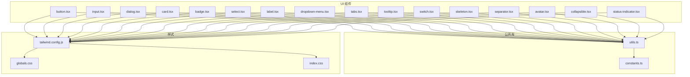

**图表来源**
- [button.tsx](file://web/src/components/ui/button.tsx)
- [input.tsx](file://web/src/components/ui/input.tsx)
- [dialog.tsx](file://web/src/components/ui/dialog.tsx)
- [card.tsx](file://web/src/components/ui/card.tsx)
- [badge.tsx](file://web/src/components/ui/badge.tsx)
- [select.tsx](file://web/src/components/ui/select.tsx)
- [label.tsx](file://web/src/components/ui/label.tsx)
- [dropdown-menu.tsx](file://web/src/components/ui/dropdown-menu.tsx)
- [tabs.tsx](file://web/src/components/ui/tabs.tsx)
- [tooltip.tsx](file://web/src/components/ui/tooltip.tsx)
- [switch.tsx](file://web/src/components/ui/switch.tsx)
- [skeleton.tsx](file://web/src/components/ui/skeleton.tsx)
- [separator.tsx](file://web/src/components/ui/separator.tsx)
- [avatar.tsx](file://web/src/components/ui/avatar.tsx)
- [collapsible.tsx](file://web/src/components/ui/collapsible.tsx)
- [status-indicator.tsx](file://web/src/components/ui/status-indicator.tsx)
- [utils.ts](file://web/src/lib/utils.ts)
- [constants.ts](file://web/src/lib/constants.ts)
- [globals.css](file://web/src/styles/globals.css)
- [index.css](file://web/src/index.css)
- [tailwind.config.js](file://web/tailwind.config.js)

## 核心组件
本节概述各基础组件的职责边界与共性设计：
- 统一通过 props 暴露配置项，内部状态最小化且可控
- 基于 Tailwind CSS 进行样式与主题适配，支持变体与尺寸
- 遵循 ARIA 规范，提供键盘导航与焦点管理
- 对输入类组件提供受控与非受控两种模式
- 对外暴露稳定事件回调，避免直接操作 DOM

**新增**：Collapsible 组件提供可折叠内容区域，支持动画过渡和状态持久化；状态指示器组件提供符合新主题规范的视觉反馈系统。

## 架构总览
UI 组件整体采用"原子化 + 组合式"的架构：
- 原子组件：button、input、badge、label、separator、skeleton、avatar、status-indicator 等
- 复合组件：dialog、select、tabs、dropdown-menu、tooltip、collapsible 等
- 公共能力：utils.ts 提供工具函数；constants.ts 提供常量；Tailwind 配置集中管理主题与变体

```mermaid
classDiagram
class Button {
+variant : string
+size : string
+disabled : boolean
+onClick(event)
}
class Input {
+value : string
+onChange(value)
+placeholder : string
+disabled : boolean
+readOnly : boolean
+type : string
}
class Dialog {
+open : boolean
+onOpenChange(open)
+title : string
+children : any
}
class Card {
+header : any
+body : any
+footer : any
}
class Badge {
+content : string
+variant : string
}
class Select {
+options : array
+value : any
+onChange(value)
+placeholder : string
+disabled : boolean
}
class Label {
+htmlFor : string
+children : any
}
class DropdownMenu {
+trigger : any
+items : array
}
class Tabs {
+activeTab : string
+onTabChange(tab)
+tabs : array
}
class Tooltip {
+content : string
+trigger : any
}
class Switch {
+checked : boolean
+onCheckedChange(checked)
}
class Skeleton {
+className : string
}
class Separator {
+orientation : string
}
class Avatar {
+src : string
+alt : string
}
class Collapsible {
+defaultOpen : boolean
+onOpenChange(open)
+trigger : any
+content : any
+persistKey : string
}
class StatusIndicator {
+status : string
+variant : string
+size : string
+showAnimation : boolean
}
Button --> utils : "使用工具函数"
Input --> utils : "使用工具函数"
Dialog --> utils : "使用工具函数"
Select --> utils : "使用工具函数"
Tabs --> utils : "使用工具函数"
Tooltip --> utils : "使用工具函数"
Switch --> utils : "使用工具函数"
Collapsible --> utils : "使用工具函数"
StatusIndicator --> utils : "使用工具函数"
Badge --> constants : "使用常量"
Card --> constants : "使用常量"
StatusIndicator --> constants : "使用常量"
```

**图表来源**
- [button.tsx](file://web/src/components/ui/button.tsx)
- [input.tsx](file://web/src/components/ui/input.tsx)
- [dialog.tsx](file://web/src/components/ui/dialog.tsx)
- [card.tsx](file://web/src/components/ui/card.tsx)
- [badge.tsx](file://web/src/components/ui/badge.tsx)
- [select.tsx](file://web/src/components/ui/select.tsx)
- [label.tsx](file://web/src/components/ui/label.tsx)
- [dropdown-menu.tsx](file://web/src/components/ui/dropdown-menu.tsx)
- [tabs.tsx](file://web/src/components/ui/tabs.tsx)
- [tooltip.tsx](file://web/src/components/ui/tooltip.tsx)
- [switch.tsx](file://web/src/components/ui/switch.tsx)
- [skeleton.tsx](file://web/src/components/ui/skeleton.tsx)
- [separator.tsx](file://web/src/components/ui/separator.tsx)
- [avatar.tsx](file://web/src/components/ui/avatar.tsx)
- [collapsible.tsx](file://web/src/components/ui/collapsible.tsx)
- [status-indicator.tsx](file://web/src/components/ui/status-indicator.tsx)
- [utils.ts](file://web/src/lib/utils.ts)
- [constants.ts](file://web/src/lib/constants.ts)

## 详细组件分析

### Button 按钮
- 职责：提供可点击的交互元素，支持多种视觉变体与尺寸
- Props 要点
  - variant：控制外观风格（如主按钮、次按钮、幽灵按钮等）
  - size：控制尺寸（如小、中、大）
  - disabled：禁用状态
  - onClick：点击回调
- 事件处理
  - 点击时触发 onClick，并在禁用状态下阻止默认行为
- 可访问性
  - 正确设置 role、aria-disabled、tabIndex 等属性
  - 支持键盘 Enter/Space 触发
- 响应式
  - 通过 Tailwind 断点与尺寸变量适配不同屏幕
- 样式定制与主题
  - 通过 variant 与 size 快速切换样式
  - 可通过 Tailwind 覆盖默认样式或扩展新变体
- 组合与复用
  - 常与 Icon、Tooltip 组合使用，形成带提示的按钮
  - 在表单中与 Input、Label 配合完成输入校验与提交

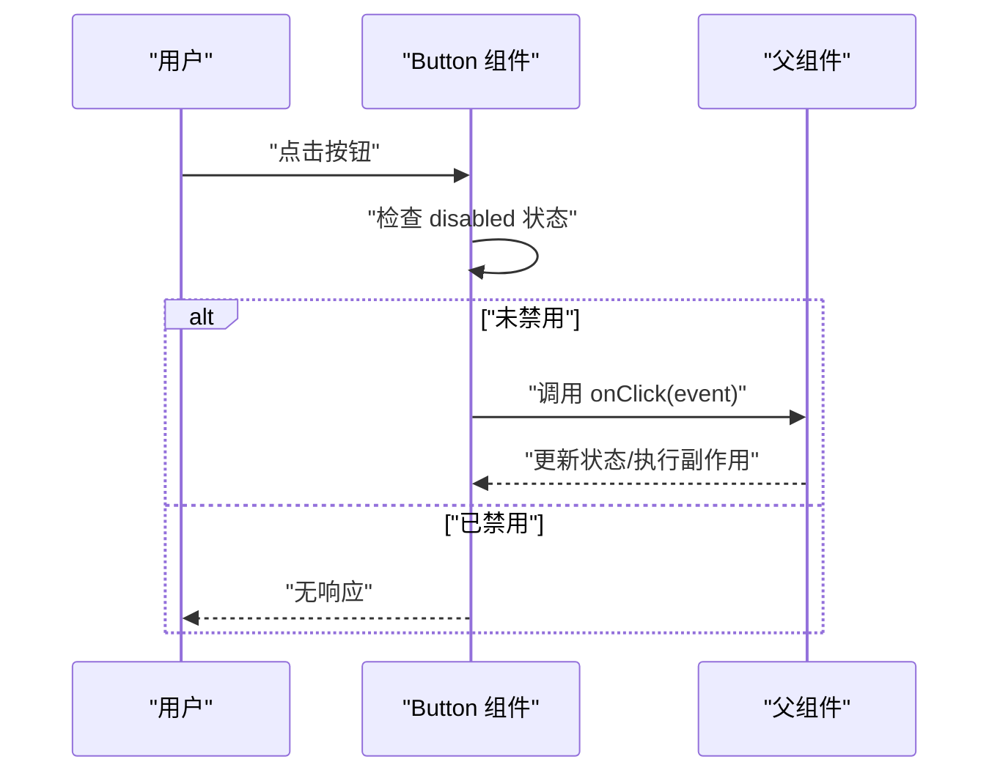

**图表来源**
- [button.tsx](file://web/src/components/ui/button.tsx)

**章节来源**
- [button.tsx](file://web/src/components/ui/button.tsx)
- [utils.ts](file://web/src/lib/utils.ts)
- [tailwind.config.js](file://web/tailwind.config.js)

### Input 输入框
- 职责：文本输入控件，支持多种输入类型与状态
- Props 要点
  - value：当前值（受控模式）
  - onChange：值变化回调
  - placeholder：占位符
  - disabled：禁用
  - readOnly：只读
  - type：输入类型（text、email、password 等）
- 事件处理
  - 输入变化时触发 onChange，并同步更新父组件状态
- 可访问性
  - 与 Label 关联，设置 aria-describedby、aria-invalid 等
  - 支持键盘输入与焦点管理
- 响应式
  - 宽度与内边距随断点自适应
- 样式定制与主题
  - 通过 Tailwind 类名覆盖边框、背景、阴影等
  - 结合 focus-within 提升交互反馈
- 组合与复用
  - 与 Label 组合用于表单标签
  - 与 Tooltip 组合用于输入提示
  - 与 Button 组合用于搜索、筛选等场景

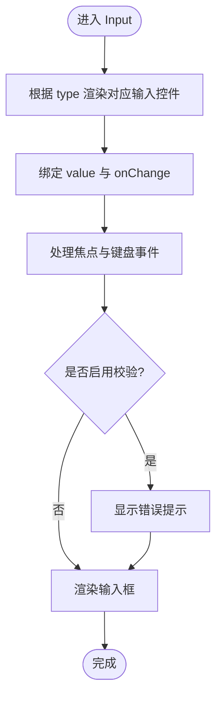

**图表来源**
- [input.tsx](file://web/src/components/ui/input.tsx)
- [label.tsx](file://web/src/components/ui/label.tsx)
- [tooltip.tsx](file://web/src/components/ui/tooltip.tsx)

**章节来源**
- [input.tsx](file://web/src/components/ui/input.tsx)
- [label.tsx](file://web/src/components/ui/label.tsx)
- [tooltip.tsx](file://web/src/components/ui/tooltip.tsx)
- [utils.ts](file://web/src/lib/utils.ts)
- [tailwind.config.js](file://web/tailwind.config.js)

### Dialog 对话框
- 职责：模态弹窗容器，承载标题、内容、操作区
- Props 要点
  - open：控制打开/关闭
  - onOpenChange：打开状态变更回调
  - title：标题
  - children：内容区域
- 事件处理
  - 外部点击遮罩、ESC 键关闭
  - 子组件通过 onOpenChange 通知父组件
- 可访问性
  - 设置 role="dialog"、aria-modal、aria-labelledby
  - 焦点陷阱与初始焦点管理
- 响应式
  - 移动端全屏或居中卡片布局
- 样式定制与主题
  - 通过 Tailwind 调整圆角、阴影、层级 z-index
- 组合与复用
  - 与 Button 组合触发打开
  - 与 Form 组合完成确认/编辑流程

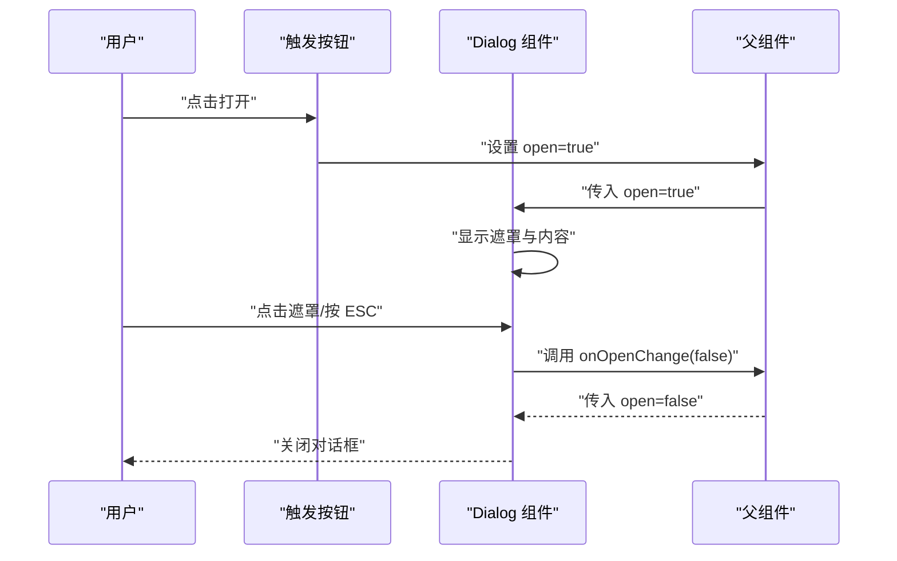

**图表来源**
- [dialog.tsx](file://web/src/components/ui/dialog.tsx)
- [button.tsx](file://web/src/components/ui/button.tsx)

**章节来源**
- [dialog.tsx](file://web/src/components/ui/dialog.tsx)
- [button.tsx](file://web/src/components/ui/button.tsx)
- [utils.ts](file://web/src/lib/utils.ts)
- [tailwind.config.js](file://web/tailwind.config.js)

### Card 卡片
- 职责：信息分组与展示容器
- Props 要点
  - header：头部区域
  - body：主体内容
  - footer：底部操作区
- 事件处理
  - 通常作为容器不直接处理事件，交由子组件处理
- 可访问性
  - 语义化结构，必要时添加 role="article"
- 响应式
  - 在不同断点下调整内边距与布局
- 样式定制与主题
  - 通过 Tailwind 控制圆角、阴影、背景色
- 组合与复用
  - 与 Badge 组合展示状态
  - 与 Button 组合提供操作入口

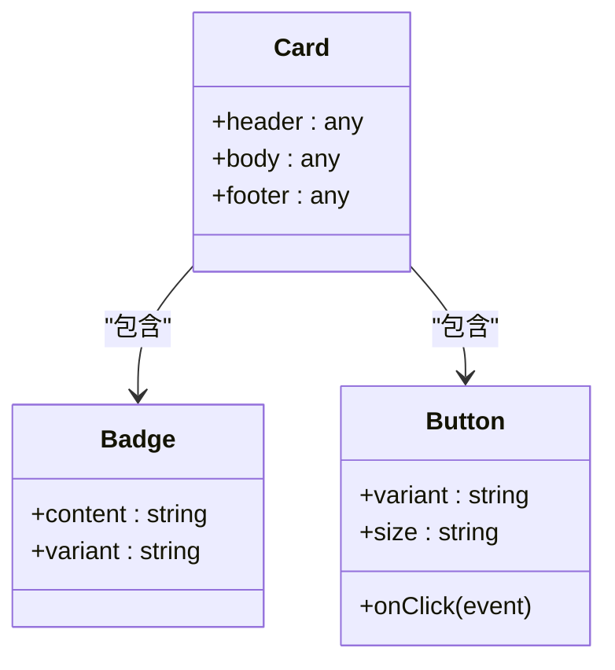

**图表来源**
- [card.tsx](file://web/src/components/ui/card.tsx)
- [badge.tsx](file://web/src/components/ui/badge.tsx)
- [button.tsx](file://web/src/components/ui/button.tsx)

**章节来源**
- [card.tsx](file://web/src/components/ui/card.tsx)
- [badge.tsx](file://web/src/components/ui/badge.tsx)
- [button.tsx](file://web/src/components/ui/button.tsx)
- [constants.ts](file://web/src/lib/constants.ts)
- [tailwind.config.js](file://web/tailwind.config.js)

### Badge 徽章
- 职责：轻量级状态标记与计数展示
- Props 要点
  - content：显示文本或数字
  - variant：颜色风格（成功、警告、危险等）
- 事件处理
  - 通常为纯展示，无需事件
- 可访问性
  - 当具有交互意义时，设置 role="status" 并提供 aria-label
- 响应式
  - 字号与间距随屏幕缩放
- 样式定制与主题
  - 通过 variant 映射到 Tailwind 颜色变量
- 组合与复用
  - 与 Button 组合表示未读数量
  - 与 Card 组合表示任务状态

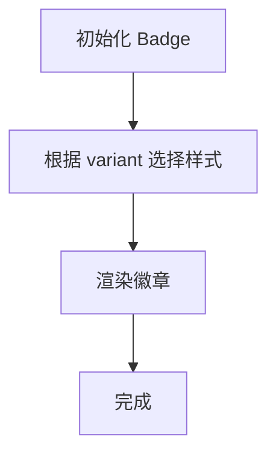

**图表来源**
- [badge.tsx](file://web/src/components/ui/badge.tsx)
- [constants.ts](file://web/src/lib/constants.ts)

**章节来源**
- [badge.tsx](file://web/src/components/ui/badge.tsx)
- [constants.ts](file://web/src/lib/constants.ts)
- [tailwind.config.js](file://web/tailwind.config.js)

### Select 下拉选择
- 职责：提供选项列表供用户选择
- Props 要点
  - options：选项数组（每项含 label/value）
  - value：当前选中值
  - onChange：选中变化回调
  - placeholder：占位文本
  - disabled：禁用
- 事件处理
  - 键盘上下选择、回车确认、Esc 关闭
- 可访问性
  - 设置 role="listbox"、aria-selected、aria-activedescendant
  - 与 Label 关联
- 响应式
  - 下拉面板定位与宽度自适应
- 样式定制与主题
  - 通过 Tailwind 控制边框、阴影、高亮
- 组合与复用
  - 与 Button 组合实现筛选器
  - 与 Tooltip 组合提供选项说明

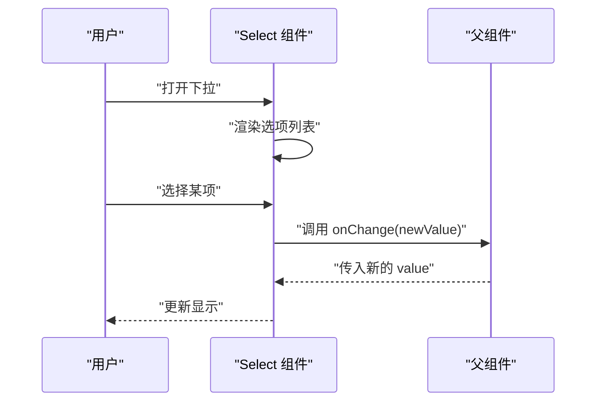

**图表来源**
- [select.tsx](file://web/src/components/ui/select.tsx)
- [label.tsx](file://web/src/components/ui/label.tsx)

**章节来源**
- [select.tsx](file://web/src/components/ui/select.tsx)
- [label.tsx](file://web/src/components/ui/label.tsx)
- [utils.ts](file://web/src/lib/utils.ts)
- [tailwind.config.js](file://web/tailwind.config.js)

### Collapsible 可折叠组件
- 职责：提供可折叠的内容区域，支持平滑动画和用户偏好持久化
- Props 要点
  - defaultOpen：默认展开状态（非受控模式）
  - open：受控展开状态
  - onOpenChange：展开状态变更回调
  - trigger：触发折叠的元素
  - content：可折叠的内容区域
  - persistKey：localStorage 持久化键名
  - animationDuration：动画持续时间（毫秒）
- 事件处理
  - 点击触发器时切换展开/折叠状态
  - 支持键盘 Space/Enter 触发
  - 状态变更时调用 onOpenChange 回调
- 状态管理
  - 支持受控和非受控两种模式
  - 使用 localStorage 持久化用户偏好
  - 自动检测浏览器环境，避免 SSR 问题
- 可访问性
  - 设置 role="region"、aria-expanded、aria-controls
  - 与触发器建立正确的关联关系
  - 支持键盘导航和焦点管理
- 动画效果
  - 使用 CSS transitions 实现平滑过渡
  - 支持自定义动画时长和缓动函数
  - 跨浏览器兼容性处理
- 响应式设计
  - 在不同屏幕尺寸下保持良好体验
  - 移动端触摸优化
- 样式定制与主题
  - 通过 Tailwind 类名控制样式
  - 支持自定义动画和过渡效果
- 组合与复用
  - 与任何可点击元素组合使用
  - 适合 FAQ、设置面板、内容区块等场景

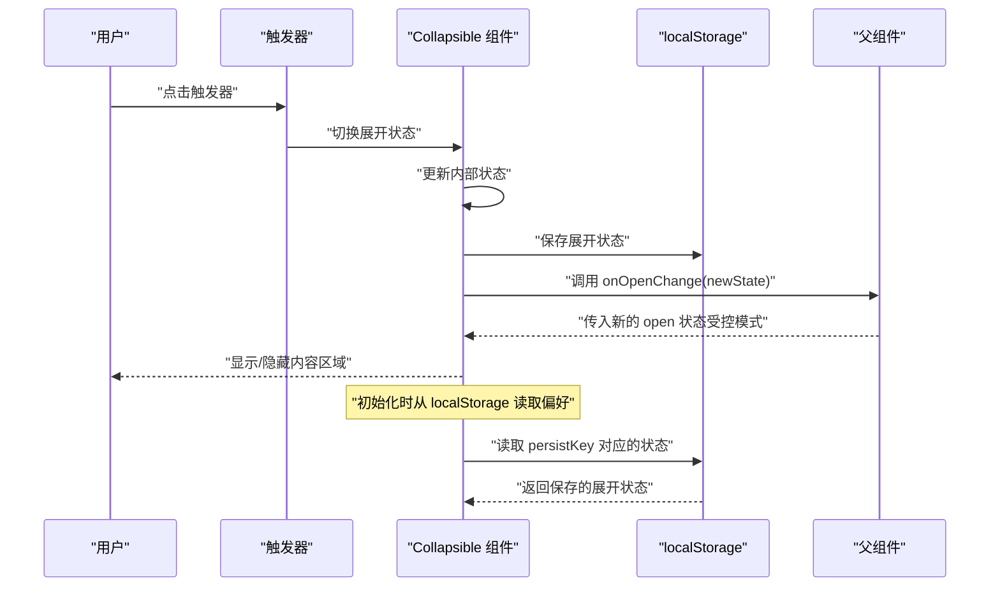

**图表来源**
- [collapsible.tsx](file://web/src/components/ui/collapsible.tsx)

**章节来源**
- [collapsible.tsx](file://web/src/components/ui/collapsible.tsx)
- [utils.ts](file://web/src/lib/utils.ts)
- [tailwind.config.js](file://web/tailwind.config.js)

### Status Indicator 状态指示器
- 职责：提供视觉状态反馈，支持多种状态类型和动画效果
- Props 要点
  - status：状态类型（success、warning、error、info、loading）
  - variant：视觉变体（dot、ring、pulse 等）
  - size：尺寸大小（sm、md、lg）
  - showAnimation：是否显示动画效果
  - text：可选的状态描述文本
- 事件处理
  - 通常为纯展示组件，无需事件处理
  - 可选的点击回调用于交互场景
- 可访问性
  - 设置 role="status" 和 aria-live 属性
  - 提供适当的 aria-label 描述状态含义
  - 支持屏幕阅读器朗读状态变化
- 动画效果
  - 支持脉冲、呼吸、旋转等多种动画效果
  - 使用 CSS animations 实现流畅过渡
  - 可配置动画持续时间和循环模式
- 样式定制与主题
  - 基于新的主题规范设计颜色系统
  - 支持暗色模式和主题切换
  - 通过 Tailwind 类名快速定制样式
- 响应式设计
  - 在不同屏幕尺寸下保持清晰的视觉效果
  - 移动端优化触摸交互
- 组合与复用
  - 与 Button、Card、Table 等组件组合使用
  - 适合表单验证、加载状态、操作结果反馈等场景

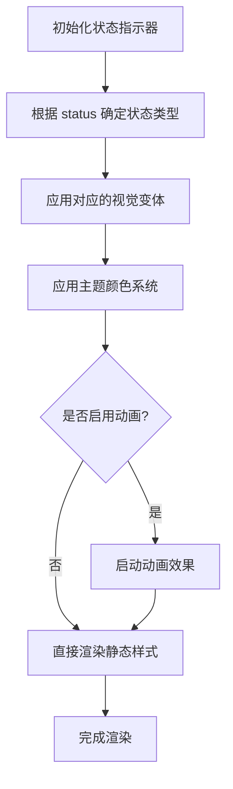

**图表来源**
- [status-indicator.tsx](file://web/src/components/ui/status-indicator.tsx)

**章节来源**
- [status-indicator.tsx](file://web/src/components/ui/status-indicator.tsx)
- [constants.ts](file://web/src/lib/constants.ts)
- [tailwind.config.js](file://web/tailwind.config.js)

### 其他基础组件概览
- Label 标签：为输入控件提供可点击的关联标签，提升可访问性与易用性
- Dropdown Menu 下拉菜单：提供一组动作入口，支持键盘导航与焦点管理
- Tabs 标签页：多视图切换容器，支持键盘左右切换与活动态管理
- Tooltip 提示：悬停或聚焦时显示简短说明
- Switch 开关：二元状态切换控件，适合偏好设置
- Skeleton 骨架屏：加载占位，提升感知性能
- Separator 分割线：视觉分隔内容区块
- Avatar 头像：展示用户图像或首字母占位

**章节来源**
- [label.tsx](file://web/src/components/ui/label.tsx)
- [dropdown-menu.tsx](file://web/src/components/ui/dropdown-menu.tsx)
- [tabs.tsx](file://web/src/components/ui/tabs.tsx)
- [tooltip.tsx](file://web/src/components/ui/tooltip.tsx)
- [switch.tsx](file://web/src/components/ui/switch.tsx)
- [skeleton.tsx](file://web/src/components/ui/skeleton.tsx)
- [separator.tsx](file://web/src/components/ui/separator.tsx)
- [avatar.tsx](file://web/src/components/ui/avatar.tsx)
- [utils.ts](file://web/src/lib/utils.ts)
- [tailwind.config.js](file://web/tailwind.config.js)

## 依赖分析
- 组件间耦合度低，主要依赖公共工具与样式系统
- utils.ts 提供跨组件复用的工具函数（如合并类名、格式化等）
- constants.ts 提供主题色、尺寸等常量，保证一致性
- Tailwind 配置集中管理主题与变体，确保全局样式一致

**更新**：Collapsible 组件依赖 localStorage API 进行用户偏好持久化，同时使用 CSS transitions 实现动画效果；状态指示器组件基于新的主题规范设计，支持多种动画效果和主题切换。

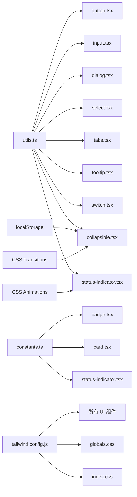

**图表来源**
- [utils.ts](file://web/src/lib/utils.ts)
- [constants.ts](file://web/src/lib/constants.ts)
- [tailwind.config.js](file://web/tailwind.config.js)
- [globals.css](file://web/src/styles/globals.css)
- [index.css](file://web/src/index.css)
- [button.tsx](file://web/src/components/ui/button.tsx)
- [input.tsx](file://web/src/components/ui/input.tsx)
- [dialog.tsx](file://web/src/components/ui/dialog.tsx)
- [select.tsx](file://web/src/components/ui/select.tsx)
- [tabs.tsx](file://web/src/components/ui/tabs.tsx)
- [tooltip.tsx](file://web/src/components/ui/tooltip.tsx)
- [switch.tsx](file://web/src/components/ui/switch.tsx)
- [collapsible.tsx](file://web/src/components/ui/collapsible.tsx)
- [status-indicator.tsx](file://web/src/components/ui/status-indicator.tsx)
- [badge.tsx](file://web/src/components/ui/badge.tsx)
- [card.tsx](file://web/src/components/ui/card.tsx)

**章节来源**
- [utils.ts](file://web/src/lib/utils.ts)
- [constants.ts](file://web/src/lib/constants.ts)
- [tailwind.config.js](file://web/tailwind.config.js)
- [globals.css](file://web/src/styles/globals.css)
- [index.css](file://web/src/index.css)

## 性能考虑
- 避免不必要的重渲染：将受控组件的状态提升到合适的父层，减少频繁 setState
- 懒加载与虚拟化：长列表选择（Select）建议使用虚拟滚动或分页
- 事件节流与防抖：高频输入（Input）建议对 onChange 做防抖
- 样式计算优化：合并类名与条件类名，减少运行时字符串拼接开销
- 资源加载：Avatar 图片使用懒加载与占位图，Skeleton 提升感知性能
- **Collapsible 优化**：使用 CSS transitions 而非 JavaScript 动画，避免重排重绘；localStorage 读写操作异步化，不影响主线程
- **状态指示器优化**：使用 CSS animations 替代 JavaScript 动画，减少主线程压力；动画效果按需启用，避免不必要的性能开销

## 故障排查指南
- 无法触发事件
  - 检查 disabled 状态与事件冒泡
  - 确认父组件是否正确传递了回调
- 键盘导航异常
  - 检查 ARIA 属性与 tabIndex 设置
  - 确认焦点顺序与焦点陷阱逻辑
- 样式错乱
  - 检查 Tailwind 配置与全局样式冲突
  - 确认自定义类名优先级
- 主题不一致
  - 核对 constants.ts 中的主题常量
  - 确认组件是否使用了正确的 variant 映射
- **Collapsible 问题**
  - 检查 localStorage 权限和可用性
  - 验证 persistKey 的唯一性和命名规范
  - 确认动画时长配置合理，避免过长影响用户体验
- **状态指示器问题**
  - 检查主题配置是否正确加载
  - 验证动画效果是否被浏览器支持
  - 确认状态值的合法性与映射关系

**章节来源**
- [button.tsx](file://web/src/components/ui/button.tsx)
- [input.tsx](file://web/src/components/ui/input.tsx)
- [dialog.tsx](file://web/src/components/ui/dialog.tsx)
- [select.tsx](file://web/src/components/ui/select.tsx)
- [collapsible.tsx](file://web/src/components/ui/collapsible.tsx)
- [status-indicator.tsx](file://web/src/components/ui/status-indicator.tsx)
- [utils.ts](file://web/src/lib/utils.ts)
- [constants.ts](file://web/src/lib/constants.ts)
- [tailwind.config.js](file://web/tailwind.config.js)

## 结论
pj3 的 UI 基础组件以原子化与组合式为核心，借助 Tailwind 构建一致的视觉语言，并通过 ARIA 与键盘交互保障可访问性。通过统一的 Props 约定与事件模型，组件具备良好的可组合性与可扩展性。新增的 Collapsible 组件为零依赖的可折叠解决方案，提供了完整的用户偏好持久化功能；状态指示器组件则基于新的主题规范设计，提供了丰富的视觉反馈系统。建议在业务中优先复用这些基础组件，并结合主题常量与工具函数保持风格一致与性能最优。

## 附录
- 使用示例与最佳实践
  - 表单场景：Label + Input + Tooltip + Button 组合，提供清晰的标签、提示与提交入口
  - 数据展示：Card + Badge + Button 组合，呈现信息块与关键状态
  - 交互引导：Dialog + Button 组合，完成确认/编辑流程
  - **内容组织：Collapsible + Content 组合，实现可折叠的信息区块和设置面板**
  - **状态反馈：Status Indicator + Action 组合，提供清晰的操作结果反馈**
- 主题适配
  - 通过 Tailwind 配置扩展新变体与尺寸
  - 使用 constants.ts 中的主题常量，避免硬编码颜色
  - **状态指示器支持暗色模式和主题切换，确保一致的视觉体验**
- 组合与复用策略
  - 将常用组合封装为高阶组件或页面级模板
  - 通过 props 透传与插槽模式增强灵活性
  - **Collapsible 使用建议：为不同的折叠区域设置唯一的 persistKey，避免状态冲突**
  - **状态指示器使用建议：根据业务场景选择合适的状态类型和动画效果**