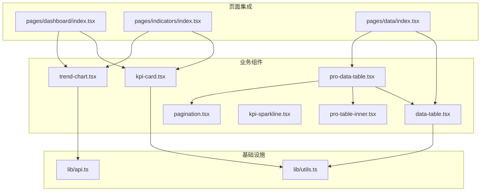
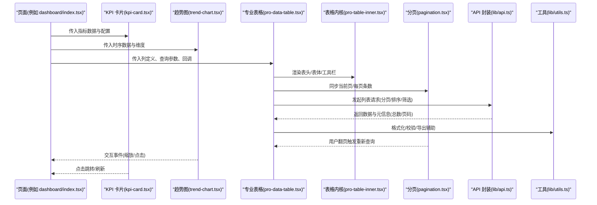
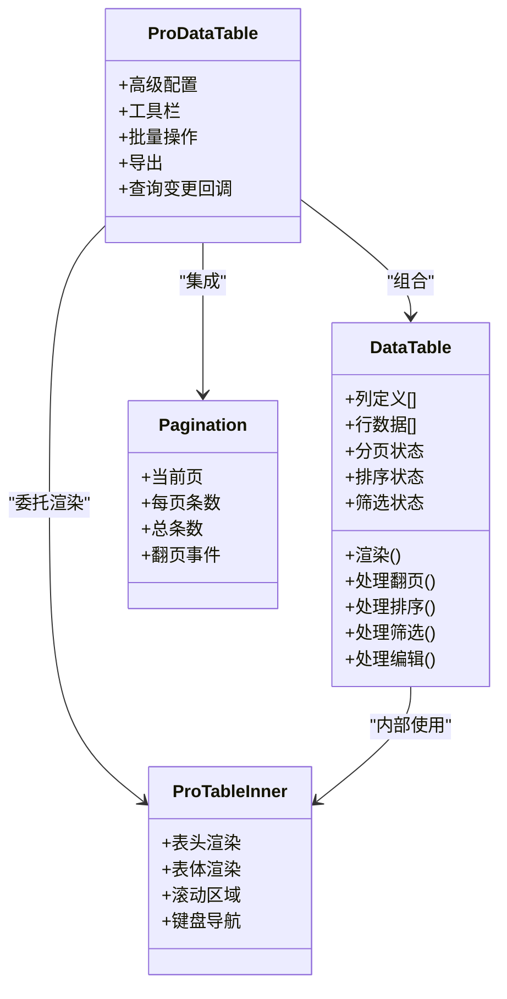
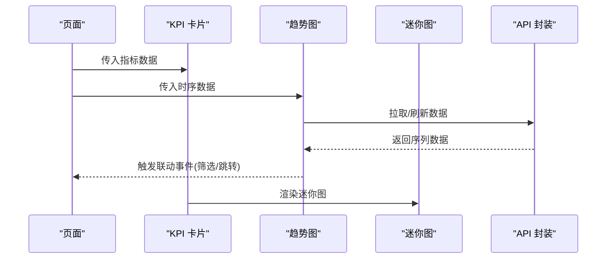
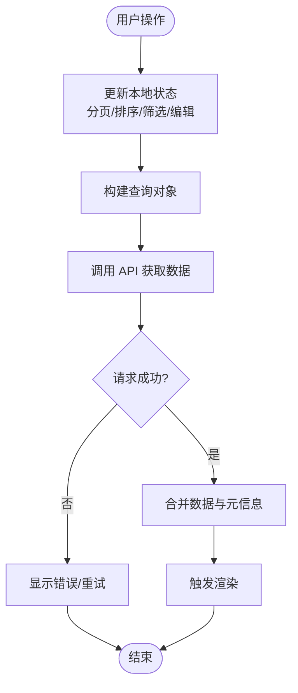
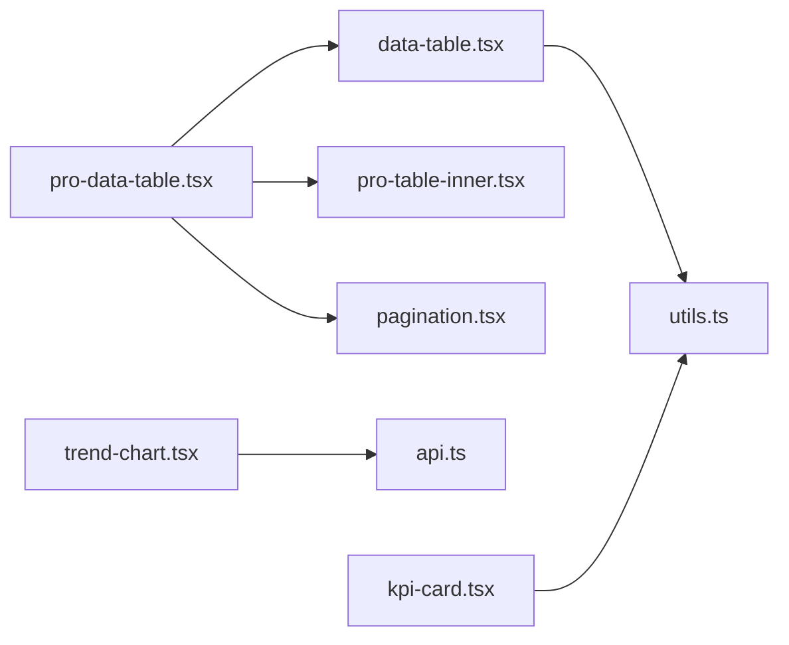

# 业务组件

<cite>
**本文引用的文件**   
- [data-table.tsx](file://web/src/components/data-table/data-table.tsx)
- [pro-data-table.tsx](file://web/src/components/data-table/pro-data-table.tsx)
- [pro-table-inner.tsx](file://web/src/components/data-table/pro-table-inner.tsx)
- [pagination.tsx](file://web/src/components/data-table/pagination.tsx)
- [kpi-card.tsx](file://web/src/components/charts/kpi-card.tsx)
- [trend-chart.tsx](file://web/src/components/charts/trend-chart.tsx)
- [kpi-sparkline.tsx](file://web/src/components/charts/kpi-sparkline.tsx)
- [dashboard/index.tsx](file://web/src/pages/dashboard/index.tsx)
- [indicators/index.tsx](file://web/src/pages/indicators/index.tsx)
- [data/index.tsx](file://web/src/pages/data/index.tsx)
- [api.ts](file://web/src/lib/api.ts)
- [utils.ts](file://web/src/lib/utils.ts)
</cite>

## 目录
1. [简介](#简介)
2. [项目结构](#项目结构)
3. [核心组件](#核心组件)
4. [架构总览](#架构总览)
5. [详细组件分析](#详细组件分析)
6. [依赖关系分析](#依赖关系分析)
7. [性能考虑](#性能考虑)
8. [故障排查指南](#故障排查指南)
9. [结论](#结论)
10. [附录](#附录)

## 简介
本文件面向 pj3 项目的业务组件，聚焦以下组件的设计模式与复杂功能实现：
- data-table、pro-data-table：数据表格基础与增强能力（分页、排序、筛选、编辑等）
- kpi-card、trend-chart：关键指标卡片与趋势图表的数据绑定与交互
- 状态管理与数据流：组件间如何组织状态、调用 API、处理加载与错误
- 配置项与扩展：如何通过 props、插槽或回调进行定制
- 性能优化：虚拟滚动、懒加载、渲染优化策略
- 使用示例与最佳实践：结合页面级用法说明典型场景

## 项目结构
业务组件主要分布在 web/src/components 下，按功能域划分：
- data-table：表格基础与增强实现
- charts：KPI 卡片与趋势图
- pages：页面级集成示例（dashboard、indicators、data）
- lib：通用工具与 API 封装

图示来源
- [data-table.tsx](file://web/src/components/data-table/data-table.tsx)
- [pro-data-table.tsx](file://web/src/components/data-table/pro-data-table.tsx)
- [pro-table-inner.tsx](file://web/src/components/data-table/pro-table-inner.tsx)
- [pagination.tsx](file://web/src/components/data-table/pagination.tsx)
- [kpi-card.tsx](file://web/src/components/charts/kpi-card.tsx)
- [trend-chart.tsx](file://web/src/components/charts/trend-chart.tsx)
- [kpi-sparkline.tsx](file://web/src/components/charts/kpi-sparkline.tsx)
- [dashboard/index.tsx](file://web/src/pages/dashboard/index.tsx)
- [indicators/index.tsx](file://web/src/pages/indicators/index.tsx)
- [data/index.tsx](file://web/src/pages/data/index.tsx)
- [api.ts](file://web/src/lib/api.ts)
- [utils.ts](file://web/src/lib/utils.ts)

章节来源
- [data-table.tsx](file://web/src/components/data-table/data-table.tsx)
- [pro-data-table.tsx](file://web/src/components/data-table/pro-data-table.tsx)
- [pro-table-inner.tsx](file://web/src/components/data-table/pro-table-inner.tsx)
- [pagination.tsx](file://web/src/components/data-table/pagination.tsx)
- [kpi-card.tsx](file://web/src/components/charts/kpi-card.tsx)
- [trend-chart.tsx](file://web/src/components/charts/trend-chart.tsx)
- [kpi-sparkline.tsx](file://web/src/components/charts/kpi-sparkline.tsx)
- [dashboard/index.tsx](file://web/src/pages/dashboard/index.tsx)
- [indicators/index.tsx](file://web/src/pages/indicators/index.tsx)
- [data/index.tsx](file://web/src/pages/data/index.tsx)
- [api.ts](file://web/src/lib/api.ts)
- [utils.ts](file://web/src/lib/utils.ts)

## 核心组件
本节概述各业务组件的职责边界与协作方式。

- data-table：提供基础表格能力，包括列定义、行渲染、选择、展开、单元格编辑入口等。
- pro-data-table：在 data-table 之上叠加高级特性，如服务端分页、排序、筛选、批量操作、导出、可配置的工具栏等。
- pro-table-inner：内部实现表格布局、表头/表体渲染、滚动区域、键盘导航等细节。
- pagination：分页控件，支持页码、每页条数、跳转等交互。
- kpi-card：展示关键指标数值、同比/环比、迷你图（sparkline）、状态标签等。
- trend-chart：折线/面积/柱状等趋势图，支持时间轴缩放、提示框、多系列切换等。
- kpi-sparkline：轻量迷你折线图，用于 KPI 卡片内嵌展示。

章节来源
- [data-table.tsx](file://web/src/components/data-table/data-table.tsx)
- [pro-data-table.tsx](file://web/src/components/data-table/pro-data-table.tsx)
- [pro-table-inner.tsx](file://web/src/components/data-table/pro-table-inner.tsx)
- [pagination.tsx](file://web/src/components/data-table/pagination.tsx)
- [kpi-card.tsx](file://web/src/components/charts/kpi-card.tsx)
- [trend-chart.tsx](file://web/src/components/charts/trend-chart.tsx)
- [kpi-sparkline.tsx](file://web/src/components/charts/kpi-sparkline.tsx)

## 架构总览
下图展示了从页面到组件再到数据源的整体数据流与交互路径。

图示来源
- [dashboard/index.tsx](file://web/src/pages/dashboard/index.tsx)
- [indicators/index.tsx](file://web/src/pages/indicators/index.tsx)
- [data/index.tsx](file://web/src/pages/data/index.tsx)
- [kpi-card.tsx](file://web/src/components/charts/kpi-card.tsx)
- [trend-chart.tsx](file://web/src/components/charts/trend-chart.tsx)
- [pro-data-table.tsx](file://web/src/components/data-table/pro-data-table.tsx)
- [pro-table-inner.tsx](file://web/src/components/data-table/pro-table-inner.tsx)
- [pagination.tsx](file://web/src/components/data-table/pagination.tsx)
- [api.ts](file://web/src/lib/api.ts)
- [utils.ts](file://web/src/lib/utils.ts)

## 详细组件分析

### 数据表格组件族（data-table / pro-data-table / pro-table-inner / pagination）
设计要点
- 分层职责：data-table 暴露稳定接口；pro-data-table 聚合高级能力；pro-table-inner 专注渲染与交互细节；pagination 独立为可复用分页控件。
- 数据契约：统一约定列定义、行数据、分页元信息、排序/筛选状态、回调钩子。
- 状态管理：受控与非受控并存，支持外部驱动（父组件控制）与内部自维护（默认值）。
- 可扩展性：通过列模板、单元格渲染器、工具栏插槽、事件回调实现高度定制。

核心能力
- 分页：支持客户端与服务端两种模式，页码、每页条数、跳转、快速定位。
- 排序：单列/多列排序，升序/降序/重置，服务端排序参数透传。
- 筛选：文本模糊、枚举下拉、范围区间、自定义筛选器函数。
- 编辑：行内编辑、弹窗编辑、批量编辑；支持字段级校验与撤销。
- 选择与批量：全选/反选、条件选中、批量删除/导出。
- 导出：CSV/Excel 导出，支持过滤后导出与自定义列映射。
- 虚拟化：大数据量时启用行虚拟化，按需渲染可视区行。
- 无障碍：键盘导航、焦点管理、ARIA 属性。

数据流与交互
- 用户操作（翻页/排序/筛选/编辑）→ 更新本地状态 → 触发 onQueryChange/onDataChange → 调用 API → 回填数据与元信息。
- 分页控件与表格双向绑定，保证 UI 与数据一致。

配置项（节选）
- 列定义：字段名、标题、宽度、对齐、排序开关、筛选类型、渲染器、编辑器、是否可见、固定列等。
- 表格行为：是否可排序/筛选/分页/选择/编辑/导出/虚拟化、默认页大小、空态文案、加载态占位等。
- 回调：onRowClick、onCellEdit、onBatchAction、onExport、onQueryChange、onPaginationChange 等。
- 样式：主题色、行高、斑马纹、边框、悬浮效果等。

性能优化
- 行虚拟化：仅渲染可视区域行，降低 DOM 节点数量。
- 增量更新：基于 key 的精确 diff，避免整表重渲染。
- 防抖/节流：搜索输入、拖拽调整列宽、窗口 resize 等高频事件。
- 懒加载：图片/富内容延迟加载，首屏优先。
- 内存回收：取消未完成的请求，释放监听器。

图示来源
- [data-table.tsx](file://web/src/components/data-table/data-table.tsx)
- [pro-data-table.tsx](file://web/src/components/data-table/pro-data-table.tsx)
- [pro-table-inner.tsx](file://web/src/components/data-table/pro-table-inner.tsx)
- [pagination.tsx](file://web/src/components/data-table/pagination.tsx)

章节来源
- [data-table.tsx](file://web/src/components/data-table/data-table.tsx)
- [pro-data-table.tsx](file://web/src/components/data-table/pro-data-table.tsx)
- [pro-table-inner.tsx](file://web/src/components/data-table/pro-table-inner.tsx)
- [pagination.tsx](file://web/src/components/data-table/pagination.tsx)

### 图表组件（kpi-card / trend-chart / kpi-sparkline）
设计要点
- 数据绑定：以不可变数据模型驱动视图，变化即重绘。
- 交互行为：提示框、缩放、切换系列、点击钻取、联动筛选。
- 主题与适配：响应式尺寸、暗色主题、无障碍对比度。
- 性能：增量绘制、动画节流、离屏缓存。

KPI 卡片
- 展示主指标、副指标、趋势方向、迷你图、状态标签。
- 支持点击跳转、刷新、复制数值等快捷操作。

趋势图
- 多系列折线/面积/柱状图，支持时间轴缩放、双轴、交叉线。
- 与表格联动：点击图例/图例项过滤表格数据。

Sparkline
- 轻量迷你图，适合嵌入 KPI 卡片或行内预览。

图示来源
- [kpi-card.tsx](file://web/src/components/charts/kpi-card.tsx)
- [trend-chart.tsx](file://web/src/components/charts/trend-chart.tsx)
- [kpi-sparkline.tsx](file://web/src/components/charts/kpi-sparkline.tsx)
- [api.ts](file://web/src/lib/api.ts)
- [dashboard/index.tsx](file://web/src/pages/dashboard/index.tsx)
- [indicators/index.tsx](file://web/src/pages/indicators/index.tsx)

章节来源
- [kpi-card.tsx](file://web/src/components/charts/kpi-card.tsx)
- [trend-chart.tsx](file://web/src/components/charts/trend-chart.tsx)
- [kpi-sparkline.tsx](file://web/src/components/charts/kpi-sparkline.tsx)
- [dashboard/index.tsx](file://web/src/pages/dashboard/index.tsx)
- [indicators/index.tsx](file://web/src/pages/indicators/index.tsx)

### 状态管理与数据流
- 受控模式：由父组件持有状态并下发 props，适合跨组件共享与持久化。
- 非受控模式：组件内部维护默认状态，适合简单场景。
- 查询编排：将分页、排序、筛选合并为统一的查询对象，作为 API 入参与缓存键。
- 错误与加载：统一 loading/error 状态，配合骨架屏与重试机制。
- 事件总线/上下文：跨层级传递用户偏好（如列宽、排序、筛选），保持会话一致性。

章节来源
- [api.ts](file://web/src/lib/api.ts)
- [utils.ts](file://web/src/lib/utils.ts)
- [data-table.tsx](file://web/src/components/data-table/data-table.tsx)
- [pro-data-table.tsx](file://web/src/components/data-table/pro-data-table.tsx)

### 配置选项与自定义扩展
- 列级扩展：自定义渲染器、编辑器、过滤器、排序器、导出处理器。
- 工具栏扩展：新增按钮、搜索框、导出、刷新、列设置面板。
- 主题与样式：覆盖 CSS 变量、主题色板、行高与间距。
- 国际化：文案、日期/数字格式、单位换算。
- 插件化：通过注册中心注入新的列类型、编辑器、导出器。

章节来源
- [data-table.tsx](file://web/src/components/data-table/data-table.tsx)
- [pro-data-table.tsx](file://web/src/components/data-table/pro-data-table.tsx)
- [pro-table-inner.tsx](file://web/src/components/data-table/pro-table-inner.tsx)

### 实际使用场景与最佳实践
- 仪表盘（dashboard）：KPI 卡片与趋势图组合，点击趋势图联动筛选其他图表。
- 指标看板（indicators）：多维指标对比，支持时间范围与维度切换。
- 数据管理（data）：专业表格承载复杂查询、批量操作与导出。

最佳实践
- 将查询对象提升到页面层，便于分享链接与书签。
- 对大列表启用虚拟化与分页，避免一次性渲染过多节点。
- 对频繁更新的图表使用增量更新与动画节流。
- 统一错误与加载态，提升用户体验。
- 为关键交互添加埋点与日志，便于问题定位。

章节来源
- [dashboard/index.tsx](file://web/src/pages/dashboard/index.tsx)
- [indicators/index.tsx](file://web/src/pages/indicators/index.tsx)
- [data/index.tsx](file://web/src/pages/data/index.tsx)

## 依赖关系分析
- 组件耦合：pro-data-table 强依赖 pro-table-inner 与 pagination；data-table 被上层组合使用。
- 外部依赖：图表组件依赖 API 封装与工具库；表格组件依赖工具库进行格式化与导出。
- 循环依赖：应避免在组件间相互导入，必要时抽取公共类型与常量。

图示来源
- [pro-data-table.tsx](file://web/src/components/data-table/pro-data-table.tsx)
- [data-table.tsx](file://web/src/components/data-table/data-table.tsx)
- [pro-table-inner.tsx](file://web/src/components/data-table/pro-table-inner.tsx)
- [pagination.tsx](file://web/src/components/data-table/pagination.tsx)
- [trend-chart.tsx](file://web/src/components/charts/trend-chart.tsx)
- [kpi-card.tsx](file://web/src/components/charts/kpi-card.tsx)
- [api.ts](file://web/src/lib/api.ts)
- [utils.ts](file://web/src/lib/utils.ts)

章节来源
- [pro-data-table.tsx](file://web/src/components/data-table/pro-data-table.tsx)
- [data-table.tsx](file://web/src/components/data-table/data-table.tsx)
- [pro-table-inner.tsx](file://web/src/components/data-table/pro-table-inner.tsx)
- [pagination.tsx](file://web/src/components/data-table/pagination.tsx)
- [trend-chart.tsx](file://web/src/components/charts/trend-chart.tsx)
- [kpi-card.tsx](file://web/src/components/charts/kpi-card.tsx)
- [api.ts](file://web/src/lib/api.ts)
- [utils.ts](file://web/src/lib/utils.ts)

## 性能考虑
- 表格
  - 行虚拟化：仅渲染可视区行，减少 DOM 节点与布局计算。
  - 列宽自适应与固定列：减少重排与重绘。
  - 防抖搜索与节流拖拽：降低高频事件开销。
  - 增量更新：基于唯一 key 的精确 diff。
  - 懒加载：图片、富文本、展开详情按需加载。
- 图表
  - 增量绘制：只更新变化的数据段。
  - 动画节流：在窗口 resize 或大量数据时禁用或降级动画。
  - 离屏缓存：复杂图形预渲染为位图。
- 网络
  - 请求去重与缓存：相同查询参数复用结果。
  - 分页与游标：避免全量拉取。
  - 错误重试与退避：提高稳定性。

[本节为通用指导，不直接分析具体文件]

## 故障排查指南
常见问题与定位步骤
- 表格数据不更新
  - 检查查询对象是否变化（分页/排序/筛选）。
  - 确认 onQueryChange 是否正确触发并回写状态。
  - 查看 API 返回结构与元信息是否匹配。
- 分页异常
  - 核对总条数与当前页逻辑，防止越界。
  - 确认服务端分页参数命名与期望一致。
- 图表无数据或闪烁
  - 检查数据格式与时间戳解析。
  - 确认增量更新逻辑是否误删数据段。
- 导出失败
  - 校验列映射与数据类型。
  - 检查导出权限与文件大小限制。

章节来源
- [data-table.tsx](file://web/src/components/data-table/data-table.tsx)
- [pro-data-table.tsx](file://web/src/components/data-table/pro-data-table.tsx)
- [pagination.tsx](file://web/src/components/data-table/pagination.tsx)
- [trend-chart.tsx](file://web/src/components/charts/trend-chart.tsx)
- [api.ts](file://web/src/lib/api.ts)

## 结论
pj3 的业务组件采用清晰的分层与职责分离，数据表格与图表组件均具备良好的扩展性与性能优化空间。通过统一的查询编排、受控/非受控状态模型以及完善的回调与插槽机制，可在不同页面中灵活复用与定制。建议在生产环境开启虚拟化与懒加载，并结合错误与加载态的统一治理，以获得更稳定的体验。

## 附录
- 术语
  - 受控组件：由外部状态驱动的组件。
  - 非受控组件：内部维护自身状态的组件。
  - 虚拟化：仅渲染可视区域的列表技术。
  - 增量更新：仅更新变化的数据片段以提升性能。
- 参考页面
  - 仪表盘：[dashboard/index.tsx](file://web/src/pages/dashboard/index.tsx)
  - 指标看板：[indicators/index.tsx](file://web/src/pages/indicators/index.tsx)
  - 数据管理：[data/index.tsx](file://web/src/pages/data/index.tsx)