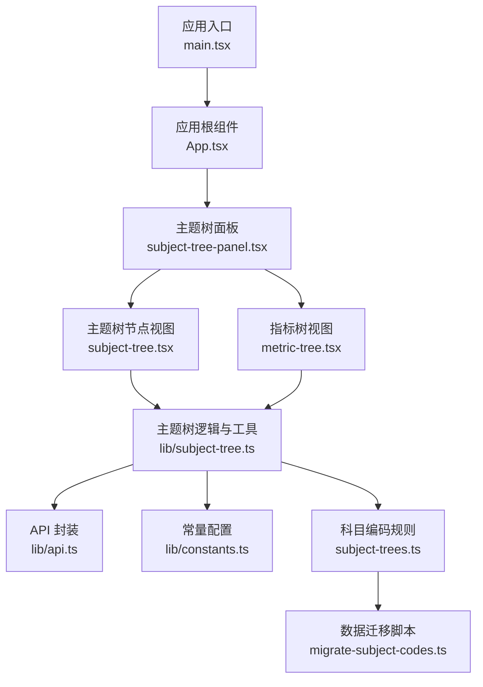
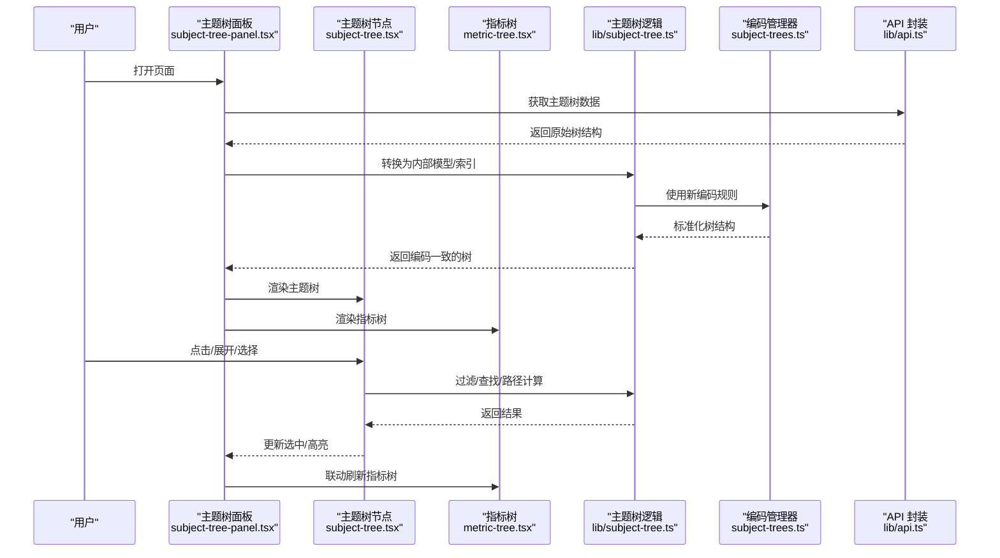
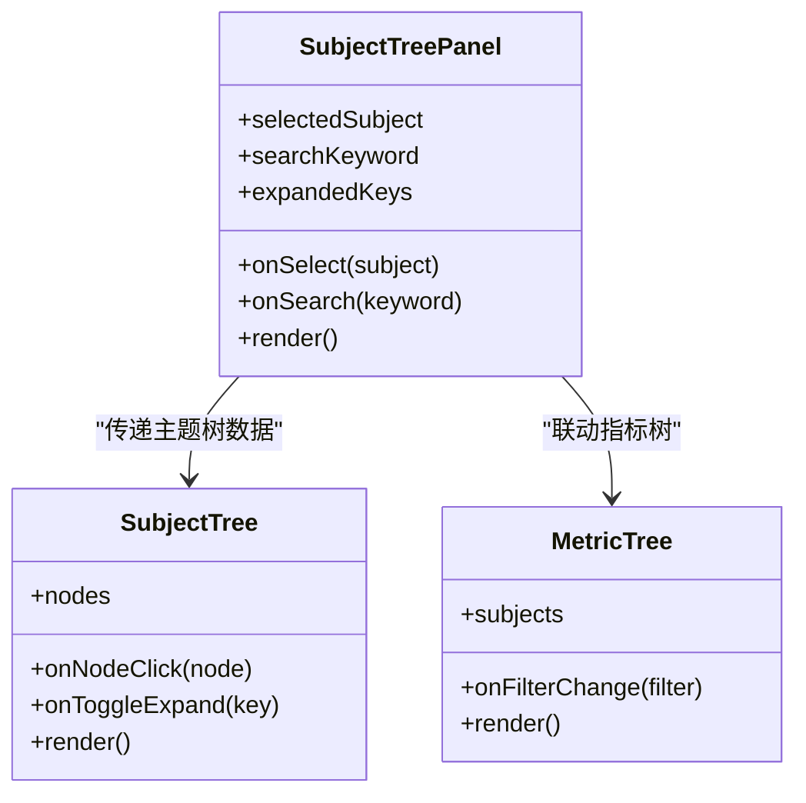
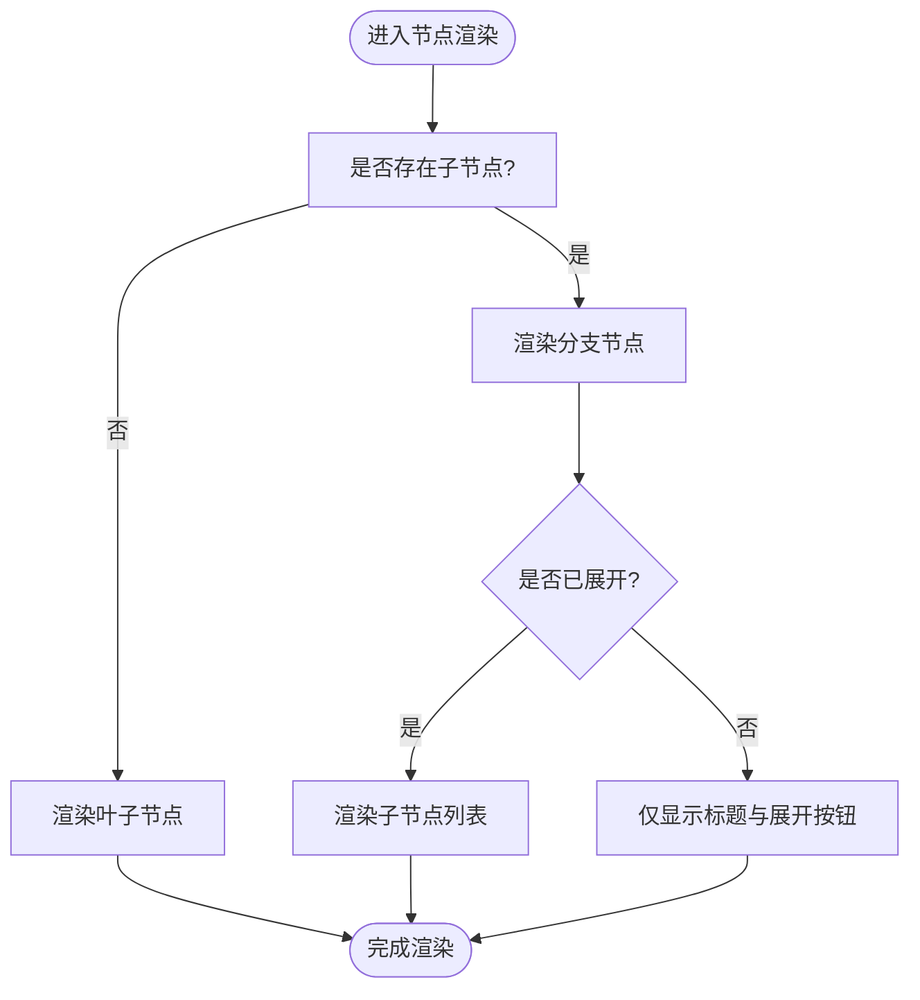
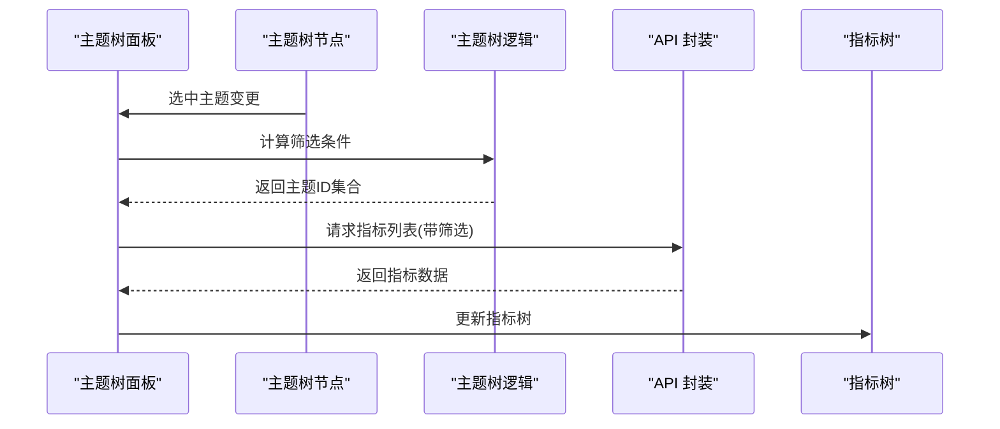
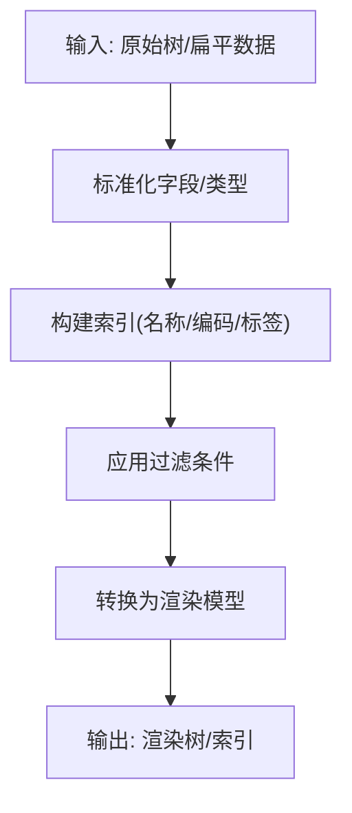
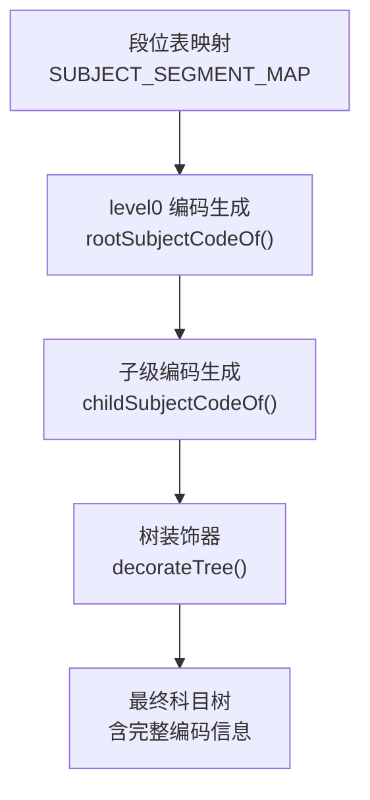
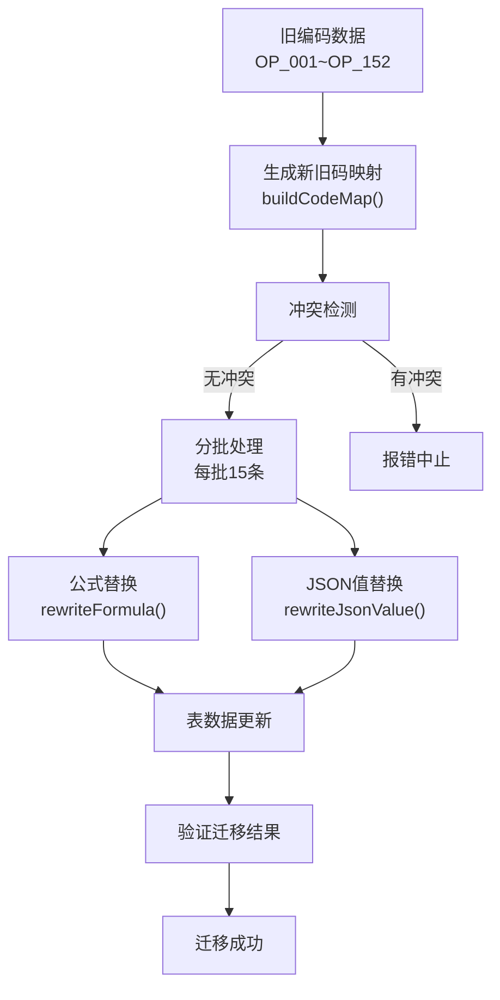
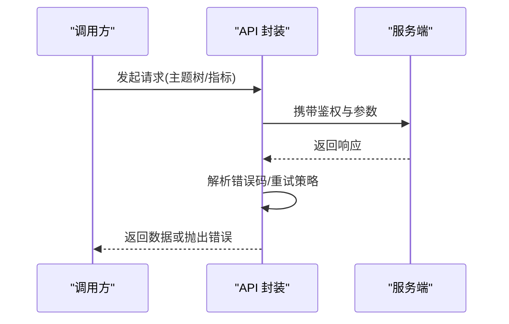
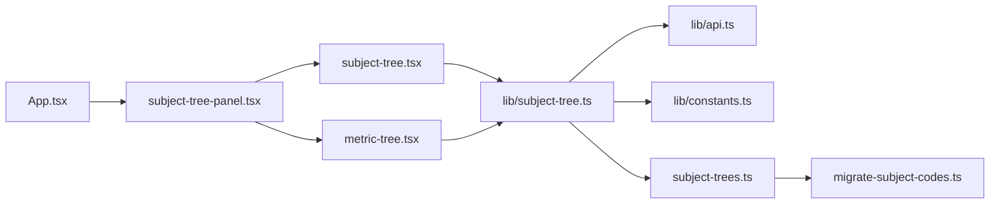

# 主题树系统

<cite>
**本文引用的文件**   
- [subject-tree.tsx](file://web/src/components/subject-tree/subject-tree.tsx)
- [subject-tree-panel.tsx](file://web/src/components/subject-tree/subject-tree-panel.tsx)
- [metric-tree.tsx](file://web/src/components/subject-tree/metric-tree.tsx)
- [subject-tree.ts](file://web/src/lib/subject-tree.ts)
- [api.ts](file://web/src/lib/api.ts)
- [constants.ts](file://web/src/lib/constants.ts)
- [App.tsx](file://web/src/App.tsx)
- [main.tsx](file://web/src/main.tsx)
- [migrate-subject-codes.ts](file://server/scripts/migrate-subject-codes.ts)
- [subject-trees.ts](file://server/prisma/seed-data/subject-trees.ts)
</cite>

## 更新摘要
**已完成的变更**   
- 主题编码体系从简单顺序编码（OP_001→OP_152）重构为层级级联编码（OP_02→OP_0201→OP_020101）
- 新增完整的数据库迁移脚本，支持存量数据平滑迁移
- 前后端科目编码生成逻辑统一，确保编码一致性
- 更新了所有相关测试用例和常量配置

## 目录
1. [简介](#简介)
2. [项目结构](#项目结构)
3. [核心组件](#核心组件)
4. [架构总览](#架构总览)
5. [详细组件分析](#详细组件分析)
6. [依赖分析](#依赖分析)
7. [性能考虑](#性能考虑)
8. [故障排查指南](#故障排查指南)
9. [结论](#结论)
10. [附录](#附录)

## 简介
本文件围绕"主题树系统"进行系统化文档化，聚焦前端侧的主题树展示、指标树渲染与面板集成。**重要更新**：主题编码体系已从简单顺序编码重构为符合会计标准的层级级联编码，提供更好的层级语义和数据组织能力。目标读者包括产品、设计与开发同学，旨在帮助快速理解模块职责、数据流向、交互流程以及常见问题定位方法。

## 项目结构
主题树相关代码位于 web 前端工程内，主要分布在以下位置：
- 组件层：components/subject-tree
- 逻辑与工具：lib/subject-tree.ts
- 数据访问：lib/api.ts
- 常量配置：lib/constants.ts
- 应用入口与路由挂载：App.tsx、main.tsx
- **新增**：后端迁移脚本和种子数据管理

**图表来源**
- [main.tsx:1-50](file://web/src/main.tsx#L1-L50)
- [App.tsx:1-120](file://web/src/App.tsx#L1-L120)
- [subject-tree-panel.tsx:1-294](file://web/src/components/subject-tree/subject-tree-panel.tsx#L1-L294)
- [subject-tree.tsx:1-185](file://web/src/components/subject-tree/subject-tree.tsx#L1-L185)
- [metric-tree.tsx:1-314](file://web/src/components/subject-tree/metric-tree.tsx#L1-L314)
- [subject-tree.ts:1-182](file://web/src/lib/subject-tree.ts#L1-L182)
- [api.ts:1-200](file://web/src/lib/api.ts#L1-L200)
- [constants.ts:1-163](file://web/src/lib/constants.ts#L1-L163)
- [subject-trees.ts:1-247](file://server/prisma/seed-data/subject-trees.ts#L1-L247)
- [migrate-subject-codes.ts:1-238](file://server/scripts/migrate-subject-codes.ts#L1-L238)

章节来源
- [main.tsx:1-50](file://web/src/main.tsx#L1-L50)
- [App.tsx:1-120](file://web/src/App.tsx#L1-L120)
- [subject-tree-panel.tsx:1-294](file://web/src/components/subject-tree/subject-tree-panel.tsx#L1-L294)
- [subject-tree.tsx:1-185](file://web/src/components/subject-tree/subject-tree.tsx#L1-L185)
- [metric-tree.tsx:1-314](file://web/src/components/subject-tree/metric-tree.tsx#L1-L314)
- [subject-tree.ts:1-182](file://web/src/lib/subject-tree.ts#L1-L182)
- [api.ts:1-200](file://web/src/lib/api.ts#L1-L200)
- [constants.ts:1-163](file://web/src/lib/constants.ts#L1-L163)

## 核心组件
- 主题树面板（SubjectTreePanel）
  - 职责：承载主题树与指标树的容器，负责布局、状态管理与用户交互入口。
  - 关键能力：展开/收起、选中态管理、搜索过滤、与指标树联动。
- 主题树节点（SubjectTree）
  - 职责：递归渲染主题树节点，处理节点点击、展开、选择等事件。
  - 关键能力：层级渲染、图标与标签展示、权限控制下的可见性。
- 指标树（MetricTree）
  - 职责：在主题树基础上展示指标维度，支持按主题筛选指标。
  - 关键能力：指标聚合、排序、分页或虚拟滚动（视实现）。
- 主题树逻辑（lib/subject-tree.ts）
  - 职责：主题树数据结构转换、过滤、查找、路径计算等纯函数集合。
  - 关键能力：扁平化/树形互转、按条件筛选、生成可遍历的索引。
  - **更新**：支持新的层级级联编码格式，包含段位表映射。
- API 封装（lib/api.ts）
  - 职责：统一请求封装、错误处理、重试策略、缓存策略（可选）。
  - 关键能力：主题树数据获取、指标列表拉取、参数序列化。
- 常量配置（lib/constants.ts）
  - 职责：主题树相关枚举、默认展开深度、UI 文案等集中管理。
- **新增**：科目编码管理器（subject-trees.ts）
  - 职责：定义科目编码规则和段位映射，生成标准化的层级编码。
  - 关键能力：段位表维护、级联编码生成、编码验证。
- **新增**：数据迁移脚本（migrate-subject-codes.ts）
  - 职责：将旧版顺序编码平滑迁移到新版层级编码。
  - 关键能力：批量数据更新、公式替换、事务保证、幂等执行。

章节来源
- [subject-tree-panel.tsx:1-294](file://web/src/components/subject-tree/subject-tree-panel.tsx#L1-L294)
- [subject-tree.tsx:1-185](file://web/src/components/subject-tree/subject-tree.tsx#L1-L185)
- [metric-tree.tsx:1-314](file://web/src/components/subject-tree/metric-tree.tsx#L1-L314)
- [subject-tree.ts:1-182](file://web/src/lib/subject-tree.ts#L1-L182)
- [api.ts:1-200](file://web/src/lib/api.ts#L1-L200)
- [constants.ts:1-163](file://web/src/lib/constants.ts#L1-L163)
- [subject-trees.ts:1-247](file://server/prisma/seed-data/subject-trees.ts#L1-L247)
- [migrate-subject-codes.ts:1-238](file://server/scripts/migrate-subject-codes.ts#L1-L238)

## 架构总览
主题树系统采用"面板 + 视图 + 逻辑 + 数据访问"的分层设计，视图层仅关注渲染与交互，逻辑层提供纯函数处理数据，数据访问层屏蔽网络细节。**重要更新**：新增了统一的科目编码管理体系，确保前后端编码一致性和数据迁移的可靠性。

**图表来源**
- [subject-tree-panel.tsx:1-294](file://web/src/components/subject-tree/subject-tree-panel.tsx#L1-L294)
- [subject-tree.tsx:1-185](file://web/src/components/subject-tree/subject-tree.tsx#L1-L185)
- [metric-tree.tsx:1-314](file://web/src/components/subject-tree/metric-tree.tsx#L1-L314)
- [subject-tree.ts:1-182](file://web/src/lib/subject-tree.ts#L1-L182)
- [subject-trees.ts:1-247](file://server/prisma/seed-data/subject-trees.ts#L1-L247)
- [api.ts:1-200](file://web/src/lib/api.ts#L1-L200)

## 详细组件分析

### 主题树面板（SubjectTreePanel）
- 职责边界
  - 作为主题树与指标树的协调者，维护当前选中主题、搜索词、展开状态等。
  - 负责将主题树数据传递给子组件，并接收子组件回调以更新自身状态。
- 关键交互
  - 搜索：输入关键词后调用逻辑层进行过滤，实时反馈匹配节点。
  - 联动：主题树选中变化时，触发指标树重新加载或局部刷新。
- 状态设计
  - 建议采用受控模式：外部传入选中项与搜索词，内部通过回调通知父级更新。
- 扩展点
  - 插槽式区域：便于接入自定义操作按钮、导出、批量选择等。

**图表来源**
- [subject-tree-panel.tsx:1-294](file://web/src/components/subject-tree/subject-tree-panel.tsx#L1-L294)
- [subject-tree.tsx:1-185](file://web/src/components/subject-tree/subject-tree.tsx#L1-L185)
- [metric-tree.tsx:1-314](file://web/src/components/subject-tree/metric-tree.tsx#L1-L314)

章节来源
- [subject-tree-panel.tsx:1-294](file://web/src/components/subject-tree/subject-tree-panel.tsx#L1-L294)

### 主题树节点（SubjectTree）
- 渲染策略
  - 递归渲染：每个节点包含子节点数组，按需展开以减少初始渲染压力。
  - 懒加载：对深层节点可采用点击后再拉取子节点的策略。
- 交互行为
  - 点击节点：触发选中回调，同时向指标树发送筛选条件。
  - 展开/收起：维护展开键集合，避免重复渲染。
- 权限与可见性
  - 根据权限配置动态隐藏不可见节点，保证安全与体验一致。

**图表来源**
- [subject-tree.tsx:1-185](file://web/src/components/subject-tree/subject-tree.tsx#L1-L185)

章节来源
- [subject-tree.tsx:1-185](file://web/src/components/subject-tree/subject-tree.tsx#L1-L185)

### 指标树（MetricTree）
- 数据来源
  - 基于主题树选中的主题集合，从 API 拉取对应指标列表。
- 展示与筛选
  - 支持按主题分组、按名称/编码搜索、按状态过滤。
- 性能优化
  - 大列表场景建议使用虚拟滚动或分页加载；对频繁筛选使用去抖。

**图表来源**
- [metric-tree.tsx:1-314](file://web/src/components/subject-tree/metric-tree.tsx#L1-L314)
- [subject-tree.ts:1-182](file://web/src/lib/subject-tree.ts#L1-L182)
- [api.ts:1-200](file://web/src/lib/api.ts#L1-L200)

章节来源
- [metric-tree.tsx:1-314](file://web/src/components/subject-tree/metric-tree.tsx#L1-L314)

### 主题树逻辑（lib/subject-tree.ts）
- 功能范围
  - 树结构转换：后端扁平结构到前端树结构的映射。
  - 过滤与查找：按名称、编码、标签等多维过滤；快速定位节点路径。
  - 索引构建：为搜索与高亮提供 O(1)/O(log n) 的查找能力。
- 复杂度与优化
  - 树构建：O(n)，n 为节点总数。
  - 过滤：O(n)，可通过预建索引降低重复过滤成本。
  - 路径计算：O(h)，h 为树高。
- 可测试性
  - 纯函数设计，便于单元测试覆盖边界条件与异常输入。
- **更新**：支持新的层级级联编码格式，包含段位表映射和编码验证。

**图表来源**
- [subject-tree.ts:1-182](file://web/src/lib/subject-tree.ts#L1-L182)

章节来源
- [subject-tree.ts:1-182](file://web/src/lib/subject-tree.ts#L1-L182)

### 科目编码管理器（subject-trees.ts）
- 功能范围
  - 段位表管理：维护经营科目（01-08）和静态科目（资产10-15/负债20-24/权益30-31/比率40-44）的段位映射。
  - 级联编码生成：level0 使用段位表编码，子级编码 = 父码 + 2位序号。
  - 编码验证：确保新增 level0 科目必须在段位表中登记，未登记抛错。
- 编码规则
  - 格式：`OP_` / `ST_` 前缀 + 级联数字，每级 2 位，最长 10 位。
  - 示例：收入=`OP_02` → 壹品慧收入=`OP_0201` → 增值业务收入=`OP_020101`。
- 一致性保证
  - 前后端共用相同的段位表和生成逻辑，确保编码完全一致。

**图表来源**
- [subject-trees.ts:1-247](file://server/prisma/seed-data/subject-trees.ts#L1-L247)

章节来源
- [subject-trees.ts:1-247](file://server/prisma/seed-data/subject-trees.ts#L1-L247)

### 数据迁移脚本（migrate-subject-codes.ts）
- 功能范围
  - 新旧编码映射：按科目树结构确定性生成旧码→新码映射。
  - 批量数据更新：分批小事务更新 account_subject、metric、fact_*、reclassification_log 等表。
  - 公式替换：智能替换公式中的科目引用，保持 @维度 后缀。
  - JSON 值替换：防御性处理 mapping_scheme.column_map 中的科目引用。
- 迁移特性
  - 幂等执行：已迁移科目 old==new，可中断后续跑。
  - 冲突检测：新码不得与现有编码重叠。
  - 跳过机制：未登记段位的自建 level0 科目整棵子树跳过并警告。
- 事务保证
  - 每批 15 个编码一个小事务，控制单次查询量与失败回滚范围。

**图表来源**
- [migrate-subject-codes.ts:1-238](file://server/scripts/migrate-subject-codes.ts#L1-L238)

章节来源
- [migrate-subject-codes.ts:1-238](file://server/scripts/migrate-subject-codes.ts#L1-L238)

### API 封装（lib/api.ts）
- 职责
  - 统一请求头、鉴权注入、错误码解析、重试与超时控制。
- 主题树接口
  - 获取主题树：返回标准树结构或扁平结构（由逻辑层转换）。
  - 获取指标列表：支持按主题、状态、关键字筛选。
- 错误处理
  - 网络异常：提示用户并重试。
  - 业务异常：根据错误码给出友好提示。

**图表来源**
- [api.ts:1-200](file://web/src/lib/api.ts#L1-L200)

章节来源
- [api.ts:1-200](file://web/src/lib/api.ts#L1-L200)

### 常量配置（lib/constants.ts）
- 内容
  - 主题树默认展开深度、搜索去抖时间、分页大小、UI 文案等。
- 作用
  - 统一管理易变配置，便于多环境切换与灰度发布。

章节来源
- [constants.ts:1-163](file://web/src/lib/constants.ts#L1-L163)

## 依赖分析
主题树系统的依赖关系清晰，视图层依赖逻辑层，逻辑层依赖数据访问层与常量配置。**更新**：新增了科目编码管理器作为核心依赖，确保编码一致性。

**图表来源**
- [App.tsx:1-120](file://web/src/App.tsx#L1-L120)
- [subject-tree-panel.tsx:1-294](file://web/src/components/subject-tree/subject-tree-panel.tsx#L1-L294)
- [subject-tree.tsx:1-185](file://web/src/components/subject-tree/subject-tree.tsx#L1-L185)
- [metric-tree.tsx:1-314](file://web/src/components/subject-tree/metric-tree.tsx#L1-L314)
- [subject-tree.ts:1-182](file://web/src/lib/subject-tree.ts#L1-L182)
- [api.ts:1-200](file://web/src/lib/api.ts#L1-L200)
- [constants.ts:1-163](file://web/src/lib/constants.ts#L1-L163)
- [subject-trees.ts:1-247](file://server/prisma/seed-data/subject-trees.ts#L1-L247)
- [migrate-subject-codes.ts:1-238](file://server/scripts/migrate-subject-codes.ts#L1-L238)

章节来源
- [App.tsx:1-120](file://web/src/App.tsx#L1-L120)
- [subject-tree-panel.tsx:1-294](file://web/src/components/subject-tree/subject-tree-panel.tsx#L1-L294)
- [subject-tree.tsx:1-185](file://web/src/components/subject-tree/subject-tree.tsx#L1-L185)
- [metric-tree.tsx:1-314](file://web/src/components/subject-tree/metric-tree.tsx#L1-L314)
- [subject-tree.ts:1-182](file://web/src/lib/subject-tree.ts#L1-L182)
- [api.ts:1-200](file://web/src/lib/api.ts#L1-L200)
- [constants.ts:1-163](file://web/src/lib/constants.ts#L1-L163)

## 性能考虑
- 渲染优化
  - 按需展开：默认只展开一层，减少首屏渲染量。
  - 虚拟滚动：指标树大数据集时使用虚拟滚动提升滚动性能。
  - 去抖搜索：搜索输入增加去抖，避免频繁过滤。
- 数据层优化
  - 预建索引：为名称、编码、标签建立索引，加速查找与高亮。
  - 增量更新：仅更新变化的节点，避免整树重渲染。
- 网络优化
  - 请求合并：同一周期内的多次筛选合并为一次请求。
  - 缓存策略：对静态主题树数据做短期缓存，减少重复请求。
- **更新**：编码生成优化
  - 段位表缓存：段位映射结果缓存，避免重复查找。
  - 增量编码：仅对新增科目生成编码，已有编码复用。

[本节为通用指导，不直接分析具体文件]

## 故障排查指南
- 主题树无法展开
  - 检查展开键集合是否正确维护，确认节点 key 唯一且稳定。
  - 查看是否有权限限制导致节点被隐藏。
- 搜索无结果
  - 确认搜索字段是否与后端字段一致，检查过滤逻辑是否区分大小写。
  - 验证索引是否构建成功，必要时重置索引。
- 指标树未联动
  - 检查主题树选中回调是否触发，确认传给指标树的筛选条件正确。
  - 查看 API 请求是否携带必要参数，错误码是否被正确处理。
- 性能卡顿
  - 评估是否开启虚拟滚动，搜索是否去抖，是否存在整树重渲染。
  - 监控内存占用，避免持有过大闭包引用。
- **新增**：编码相关问题
  - 段位表缺失：检查新增科目是否在 SUBJECT_SEGMENT_MAP 中登记。
  - 编码冲突：运行迁移脚本前检查新编码是否与现有编码冲突。
  - 公式引用错误：检查公式中的科目编码是否已正确迁移。

章节来源
- [subject-tree-panel.tsx:1-294](file://web/src/components/subject-tree/subject-tree-panel.tsx#L1-L294)
- [subject-tree.tsx:1-185](file://web/src/components/subject-tree/subject-tree.tsx#L1-L185)
- [metric-tree.tsx:1-314](file://web/src/components/subject-tree/metric-tree.tsx#L1-L314)
- [subject-tree.ts:1-182](file://web/src/lib/subject-tree.ts#L1-L182)
- [api.ts:1-200](file://web/src/lib/api.ts#L1-L200)

## 结论
主题树系统通过清晰的层次划分与纯函数逻辑，实现了可扩展、可测试、高性能的前端树形展示方案。**重要更新**：通过引入层级级联编码体系和完整的数据迁移机制，系统现在符合会计科目编码标准，提供了更好的层级语义和数据组织能力。建议在后续迭代中持续完善索引与缓存策略，结合权限体系与国际化配置，进一步提升用户体验与可维护性。

[本节为总结，不直接分析具体文件]

## 附录
- 术语
  - 主题：用于组织指标的分类维度。
  - 指标：具体的度量项，通常归属于某个主题。
  - 索引：为快速查找而建立的辅助数据结构。
  - 段位表：科目大类与编码段位的映射表。
  - 级联编码：基于父级编码生成的层级编码格式。
- 最佳实践
  - 保持节点 key 的唯一性与稳定性。
  - 将复杂过滤逻辑下沉至逻辑层，视图层只做最小渲染。
  - 对网络请求进行统一错误处理与重试策略。
  - **新增**：新增科目时必须先在段位表中登记编码。
  - **新增**：数据迁移应使用提供的脚本，确保一致性。
- **新增**：编码规范
  - 格式：`OP_` / `ST_` 前缀 + 级联数字，每级 2 位。
  - 长度：2 × (level + 1) 位，最长 10 位。
  - 示例：收入=`OP_02` → 壹品慧收入=`OP_0201` → 增值业务收入=`OP_020101`。

[本节为概念性说明，不直接分析具体文件]