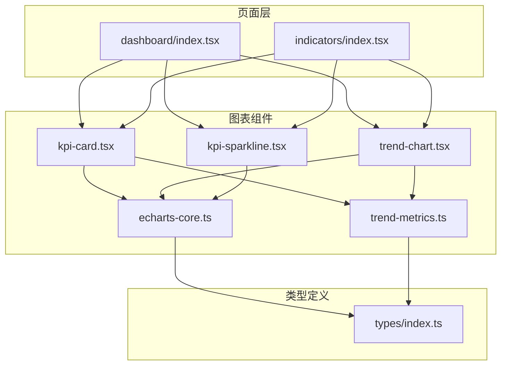
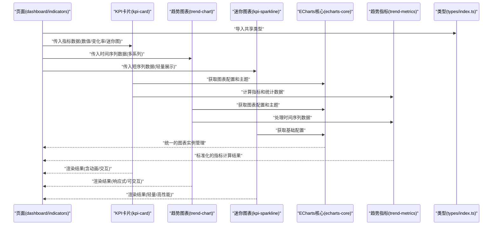
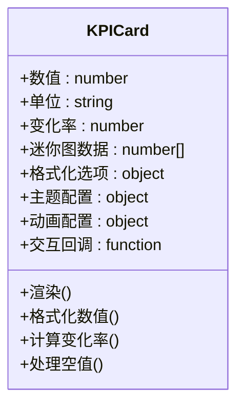
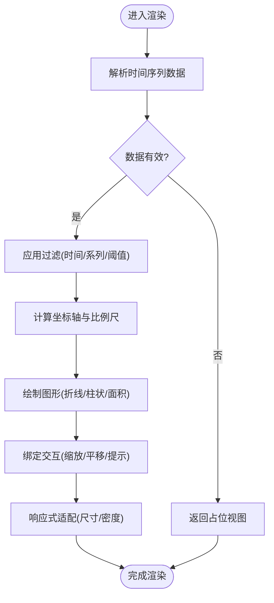
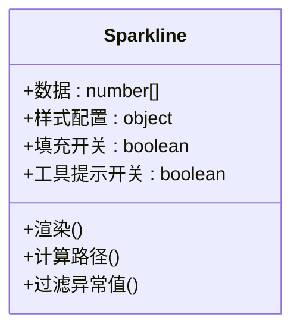
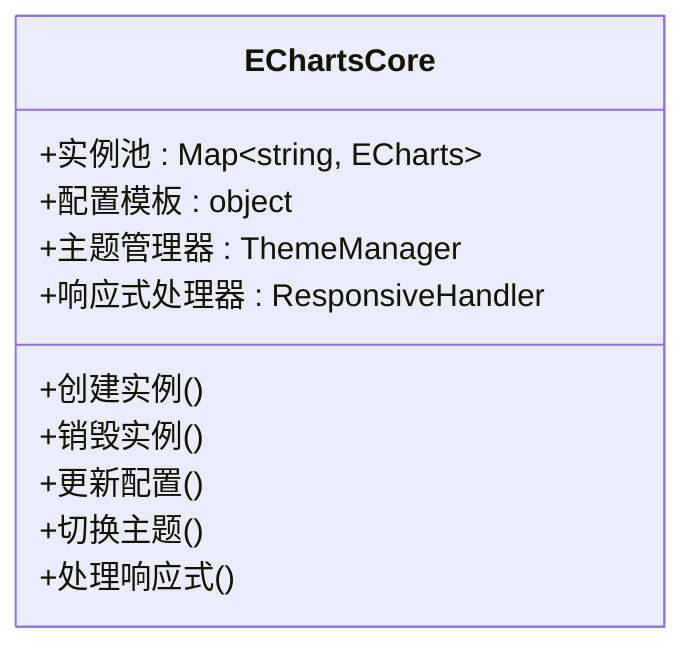
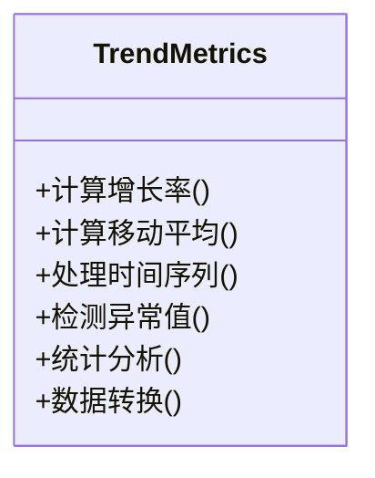
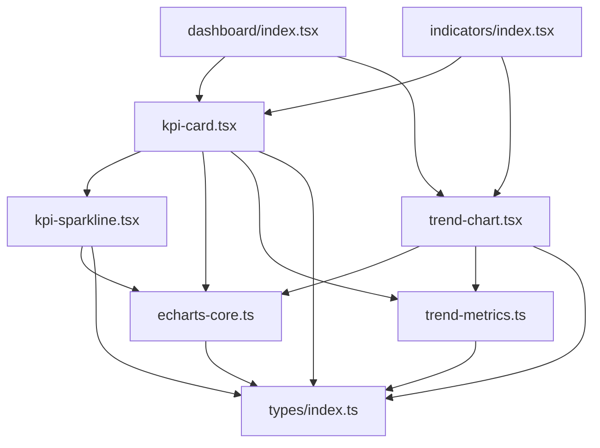

# 图表组件

<cite>
**本文引用的文件**   
- [kpi-card.tsx](file://web/src/components/charts/kpi-card.tsx)
- [trend-chart.tsx](file://web/src/components/charts/trend-chart.tsx)
- [kpi-sparkline.tsx](file://web/src/components/charts/kpi-sparkline.tsx)
- [echarts-core.ts](file://web/src/components/charts/echarts-core.ts)
- [trend-metrics.ts](file://web/src/components/charts/trend-metrics.ts)
- [dashboard/index.tsx](file://web/src/pages/dashboard/index.tsx)
- [indicators/index.tsx](file://web/src/pages/indicators/index.tsx)
- [types/index.ts](file://web/src/types/index.ts)
</cite>

## 更新摘要
**所做更改**   
- 新增 echarts-core 核心模块，提供统一的 ECharts 配置管理
- 新增 trend-metrics 模块，提供标准化的指标计算功能
- 增强 kpi-card 组件的数据展示格式和动画效果
- 改进 trend-chart 组件的时间序列数据处理和多系列对比
- 优化 kpi-sparkline 组件的轻量级实现和性能策略

## 目录
1. [简介](#简介)
2. [项目结构](#项目结构)
3. [核心组件](#核心组件)
4. [架构总览](#架构总览)
5. [详细组件分析](#详细组件分析)
6. [新增模块详解](#新增模块详解)
7. [依赖关系分析](#依赖关系分析)
8. [性能考虑](#性能考虑)
9. [故障排查指南](#故障排查指南)
10. [结论](#结论)
11. [附录](#附录)

## 简介
本章节面向 pj3 项目的图表子系统，聚焦以下核心组件和新增模块：
- KPI 卡片（kpi-card）：用于展示关键指标、同比环比变化与趋势缩略图。
- 趋势图表（trend-chart）：用于时间序列数据的可视化，支持多系列对比与响应式适配。
- 迷你图表（kpi-sparkline）：轻量级趋势线，适合在表格或卡片内嵌入展示。
- ECharts 核心（echarts-core）：统一的图表配置管理和主题定制。
- 趋势指标（trend-metrics）：标准化的指标计算和数据处理模块。

文档将深入解释这些组件的设计模式、数据绑定机制、配置选项、主题定制方法，并提供典型业务场景的使用示例与最佳实践。

## 项目结构
图表组件位于 web/src/components/charts 目录下，页面层通过 dashboard 和 indicators 等页面进行组合使用。类型定义集中在 types/index.ts 中，供各组件共享。新增的 echarts-core 和 trend-metrics 模块为图表组件提供了统一的基础设施支持。

**图示来源**
- [dashboard/index.tsx](file://web/src/pages/dashboard/index.tsx)
- [indicators/index.tsx](file://web/src/pages/indicators/index.tsx)
- [kpi-card.tsx](file://web/src/components/charts/kpi-card.tsx)
- [trend-chart.tsx](file://web/src/components/charts/trend-chart.tsx)
- [kpi-sparkline.tsx](file://web/src/components/charts/kpi-sparkline.tsx)
- [echarts-core.ts](file://web/src/components/charts/echarts-core.ts)
- [trend-metrics.ts](file://web/src/components/charts/trend-metrics.ts)
- [types/index.ts](file://web/src/types/index.ts)

**章节来源**
- [kpi-card.tsx](file://web/src/components/charts/kpi-card.tsx)
- [trend-chart.tsx](file://web/src/components/charts/trend-chart.tsx)
- [kpi-sparkline.tsx](file://web/src/components/charts/kpi-sparkline.tsx)
- [echarts-core.ts](file://web/src/components/charts/echarts-core.ts)
- [trend-metrics.ts](file://web/src/components/charts/trend-metrics.ts)
- [dashboard/index.tsx](file://web/src/pages/dashboard/index.tsx)
- [indicators/index.tsx](file://web/src/pages/indicators/index.tsx)
- [types/index.ts](file://web/src/types/index.ts)

## 核心组件
本节概述五大组件的职责与协作方式：
- kpi-card：承载单一指标的数值、单位、变化率与可选迷你趋势；提供动画入场与交互提示。
- trend-chart：基于时间轴渲染折线/柱状/面积等多系列数据，支持缩放、筛选、响应式布局。
- kpi-sparkline：极简折线或面积图，强调低开销与高复用性，常用于行内或卡片内嵌。
- echarts-core：统一的 ECharts 配置管理、主题定制和实例生命周期管理。
- trend-metrics：标准化的指标计算、时间序列处理和数据分析工具集。

**章节来源**
- [kpi-card.tsx](file://web/src/components/charts/kpi-card.tsx)
- [trend-chart.tsx](file://web/src/components/charts/trend-chart.tsx)
- [kpi-sparkline.tsx](file://web/src/components/charts/kpi-sparkline.tsx)
- [echarts-core.ts](file://web/src/components/charts/echarts-core.ts)
- [trend-metrics.ts](file://web/src/components/charts/trend-metrics.ts)

## 架构总览
下图展示了从页面到图表组件的数据流向与依赖关系。页面负责聚合数据并传入 props，组件内部完成数据校验、格式化与渲染。新增的 echarts-core 和 trend-metrics 模块为所有图表组件提供统一的基础服务。

**图示来源**
- [dashboard/index.tsx](file://web/src/pages/dashboard/index.tsx)
- [indicators/index.tsx](file://web/src/pages/indicators/index.tsx)
- [kpi-card.tsx](file://web/src/components/charts/kpi-card.tsx)
- [trend-chart.tsx](file://web/src/components/charts/trend-chart.tsx)
- [kpi-sparkline.tsx](file://web/src/components/charts/kpi-sparkline.tsx)
- [echarts-core.ts](file://web/src/components/charts/echarts-core.ts)
- [trend-metrics.ts](file://web/src/components/charts/trend-metrics.ts)
- [types/index.ts](file://web/src/types/index.ts)

## 详细组件分析

### KPI 卡片（kpi-card）
- 设计目标
  - 清晰呈现单一指标的核心信息：主数值、单位、变化方向与幅度、可选迷你趋势。
  - 提供一致的视觉层次与微动效，提升可读性与感知度。
- 数据展示格式
  - 主数值：支持整数、小数、百分比、货币等格式；可通过配置项控制精度与分隔符。
  - 变化率：正负值映射颜色与箭头方向，支持同比/环比标签。
  - 迷你趋势：可选 sparkline 子组件，显示最近 N 个时间点。
- 动画效果
  - 入场动画：数值计数动画、进度条/面积渐显。
  - 状态切换：变化率符号切换时的过渡动画。
- 交互行为
  - 悬停提示：显示更详细的数值说明、数据来源与时间范围。
  - 点击跳转：可配置回调，跳转到详情页面或筛选器。
- 配置选项
  - 数值格式化：小数位数、千分位、货币符号。
  - 主题色板：根据指标类型或业务域选择主色。
  - 迷你图开关：是否启用 sparkline 以及其长度与样式。
- 错误处理
  - 空值或缺失数据时降级为占位或"暂无数据"。
  - 非法输入（非数字、NaN）时回退默认值并记录告警。

**图示来源**
- [kpi-card.tsx](file://web/src/components/charts/kpi-card.tsx)

**章节来源**
- [kpi-card.tsx](file://web/src/components/charts/kpi-card.tsx)

### 趋势图表（trend-chart）
- 设计目标
  - 高效渲染时间序列数据，支持多系列对比、时间窗口筛选与响应式布局。
  - 提供一致的主题与交互体验（缩放、平移、工具提示）。
- 时间序列数据处理
  - 输入数据结构：按时间点聚合的多系列数组；支持缺失点插值或忽略。
  - 时间轴解析：统一时间戳/日期字符串解析，自动对齐刻度。
  - 数据过滤：按时间范围、系列可见性、阈值条件过滤。
- 多系列数据对比
  - 系列配色：自动分配颜色，支持自定义主题覆盖。
  - 图例交互：点击切换系列可见性，支持全选/反选。
- 响应式适配
  - 容器尺寸监听：根据父容器宽度自适应坐标轴、字体与间距。
  - 移动端优化：减少刻度密度、隐藏次要网格线。
- 配置选项
  - 图表类型：折线/柱状/面积/混合。
  - 坐标轴：X/Y 轴标题、刻度格式、对数/线性尺度。
  - 交互：缩放、平移、工具提示、选中区域。
  - 主题：颜色、背景、网格、字体。
- 性能策略
  - 增量更新：仅重绘变更的系列或时间段。
  - 采样降频：大数据量时按窗口采样，避免过度绘制。
  - 虚拟滚动：超长历史数据时按需加载片段。

**图示来源**
- [trend-chart.tsx](file://web/src/components/charts/trend-chart.tsx)

**章节来源**
- [trend-chart.tsx](file://web/src/components/charts/trend-chart.tsx)

### 迷你图表（kpi-sparkline）
- 设计目标
  - 以最小资源占用展示短期趋势，适用于表格行内、卡片角落或列表项。
- 轻量实现
  - 简化路径计算与绘制，减少 DOM 节点与事件绑定。
  - 禁用复杂交互，仅保留基础工具提示（可选）。
- 性能优化策略
  - 批量渲染：在同一帧内合并多次更新。
  - 缓存计算：对固定区间的统计值进行缓存。
  - 低分辨率适配：在小屏设备上降低像素密度。
- 配置选项
  - 线条样式：颜色、粗细、平滑度。
  - 填充样式：是否启用面积填充与透明度。
  - 数据长度：限制最大点数以避免过大路径。
- 错误处理
  - 数据过短或缺失时显示默认占位。
  - 异常值过滤：剔除离群点以保证趋势可读性。

**图示来源**
- [kpi-sparkline.tsx](file://web/src/components/charts/kpi-sparkline.tsx)

**章节来源**
- [kpi-sparkline.tsx](file://web/src/components/charts/kpi-sparkline.tsx)

## 新增模块详解

### ECharts 核心模块（echarts-core）
- 设计目标
  - 统一管理 ECharts 实例的生命周期和资源管理。
  - 提供标准化的配置模板和主题系统。
  - 实现响应式适配和性能优化的基础设施。
- 核心功能
  - 实例管理：创建、销毁、复用 ECharts 实例。
  - 配置管理：统一的配置结构和默认值处理。
  - 主题系统：支持动态主题切换和品牌定制。
  - 响应式：自动处理容器尺寸变化和重绘。
- 性能优化
  - 实例池化：复用已创建的实例，减少内存占用。
  - 增量更新：仅更新变化的配置项。
  - 懒加载：按需初始化图表实例。

**图示来源**
- [echarts-core.ts](file://web/src/components/charts/echarts-core.ts)

**章节来源**
- [echarts-core.ts](file://web/src/components/charts/echarts-core.ts)

### 趋势指标模块（trend-metrics）
- 设计目标
  - 提供标准化的指标计算和数据处理工具。
  - 统一时间序列数据的处理逻辑和分析方法。
  - 支持多种统计指标的计算和比较。
- 核心功能
  - 指标计算：同比增长率、环比增长率、移动平均等。
  - 数据处理：时间序列对齐、缺失值处理、异常值检测。
  - 统计分析：均值、方差、分位数、相关性分析。
  - 数据转换：格式标准化、单位转换、数据清洗。
- 使用场景
  - KPI 指标计算：营收增长率、用户活跃度等。
  - 趋势分析：季节性调整、趋势预测。
  - 数据质量：异常检测、数据完整性检查。

**图示来源**
- [trend-metrics.ts](file://web/src/components/charts/trend-metrics.ts)

**章节来源**
- [trend-metrics.ts](file://web/src/components/charts/trend-metrics.ts)

### 概念性概览
以下为不直接映射具体源码的概念流程图，帮助理解整体工作流：

[此图为概念流程，无需图示来源]

## 依赖关系分析
- 组件间耦合
  - kpi-card 可内嵌 kpi-sparkline，形成父子组合关系。
  - trend-chart 独立渲染，通常由页面直接调用。
  - 所有组件都依赖 echarts-core 和 trend-metrics 提供的基础服务。
- 外部依赖
  - 类型定义集中管理于 types/index.ts，确保跨组件一致性。
  - 页面层（dashboard、indicators）作为消费者，负责数据源与路由跳转。

**图示来源**
- [kpi-card.tsx](file://web/src/components/charts/kpi-card.tsx)
- [trend-chart.tsx](file://web/src/components/charts/trend-chart.tsx)
- [kpi-sparkline.tsx](file://web/src/components/charts/kpi-sparkline.tsx)
- [echarts-core.ts](file://web/src/components/charts/echarts-core.ts)
- [trend-metrics.ts](file://web/src/components/charts/trend-metrics.ts)
- [dashboard/index.tsx](file://web/src/pages/dashboard/index.tsx)
- [indicators/index.tsx](file://web/src/pages/indicators/index.tsx)
- [types/index.ts](file://web/src/types/index.ts)

**章节来源**
- [kpi-card.tsx](file://web/src/components/charts/kpi-card.tsx)
- [trend-chart.tsx](file://web/src/components/charts/trend-chart.tsx)
- [kpi-sparkline.tsx](file://web/src/components/charts/kpi-sparkline.tsx)
- [echarts-core.ts](file://web/src/components/charts/echarts-core.ts)
- [trend-metrics.ts](file://web/src/components/charts/trend-metrics.ts)
- [dashboard/index.tsx](file://web/src/pages/dashboard/index.tsx)
- [indicators/index.tsx](file://web/src/pages/indicators/index.tsx)
- [types/index.ts](file://web/src/types/index.ts)

## 性能考虑
- 数据更新策略
  - 增量更新：仅在数据变化时触发重绘，避免全量刷新。
  - 批处理：合并高频更新（如实时流）以降低渲染压力。
- 渲染优化
  - 采样与降频：大数据集采用窗口采样，减少路径复杂度。
  - 懒加载：长历史数据分段加载，按需渲染可视区间。
  - 实例池化：复用 ECharts 实例，减少内存占用。
- 内存管理
  - 及时释放：组件卸载时清理定时器与事件监听。
  - 对象复用：重用计算中间结果，避免重复创建大对象。
- 移动端适配
  - 降低刻度密度与网格线数量。
  - 增大触控区域，简化交互手势。
- 新模块优化
  - echarts-core：统一的实例管理和配置缓存。
  - trend-metrics：计算结果的缓存和复用。

[本节为通用指导，无需章节来源]

## 故障排查指南
- 常见问题
  - 数据为空或缺失：检查数据源是否为空，确认组件的占位逻辑是否生效。
  - 数值格式异常：验证输入类型与格式化配置，确保无 NaN/Infinity。
  - 渲染卡顿：评估数据规模，启用采样与懒加载；减少不必要的动画。
  - 响应式失效：确认容器尺寸监听是否正确，避免固定宽高导致无法自适应。
  - 实例冲突：检查 ECharts 实例的唯一性和生命周期管理。
  - 指标计算错误：验证 trend-metrics 的计算逻辑和输入数据格式。
- 调试建议
  - 打印关键 props 与中间状态，定位数据转换问题。
  - 使用浏览器性能面板分析重绘与布局抖动。
  - 针对移动端设备开启低分辨率与简化样式进行测试。
  - 监控 ECharts 实例的创建和销毁过程。
  - 验证指标计算的中间结果和最终输出。

[本节为通用指导，无需章节来源]

## 结论
pj3 的图表组件体系围绕"清晰表达、轻量高效、灵活可配"的目标构建。KPI 卡片聚焦单指标的高可读性，趋势图表承担复杂时间序列的可视化，迷你图表则以极致轻量化满足行内展示需求。新增的 echarts-core 和 trend-metrics 模块为整个图表系统提供了统一的基础设施和标准化的数据处理能力。通过统一类型定义与页面层组合，五者形成良好的扩展性与维护性。遵循本文的性能与适配建议，可在实际业务场景中稳定交付高质量的图表体验。

[本节为总结，无需章节来源]

## 附录
- 典型业务用例
  - 销售趋势分析：使用 trend-chart 展示月度/季度销售额，结合筛选器查看特定品类或地区。
  - 用户增长监控：在 dashboard 中用 kpi-card 展示新增用户、活跃用户与留存率，配合 sparkline 观察短期波动。
  - 关键指标展示：在报表页使用 kpi-card 汇总核心 KPI，点击跳转至明细页面。
  - 指标计算：使用 trend-metrics 计算同比增长率、移动平均等统计指标。
  - 主题定制：通过 echarts-core 统一管理图表主题和样式。
- 主题定制方法
  - 通过 echarts-core 的主题管理器覆盖颜色、背景与字体，保持品牌一致性。
  - 为不同业务域定义主题别名，便于快速切换。
- 数据绑定机制
  - 页面层聚合 API 数据后，按组件所需结构转换为 props。
  - 组件内部进行数据校验与格式化，保证渲染稳定性。
  - 使用 trend-metrics 进行标准化的数据计算和处理。
- 新模块使用指南
  - echarts-core：通过工厂函数创建和管理图表实例。
  - trend-metrics：调用相应的计算方法处理时间序列数据。

[本节为补充说明，无需章节来源]