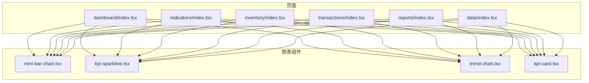
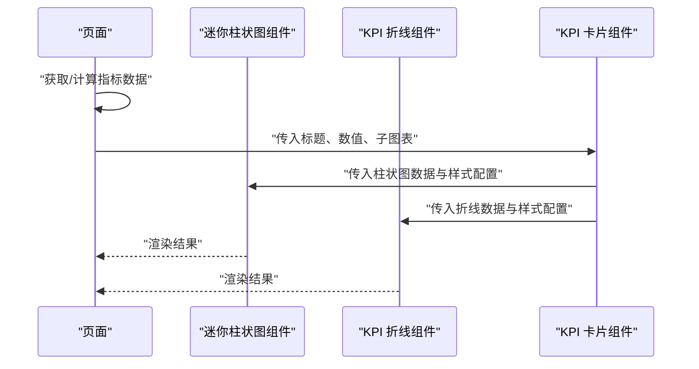
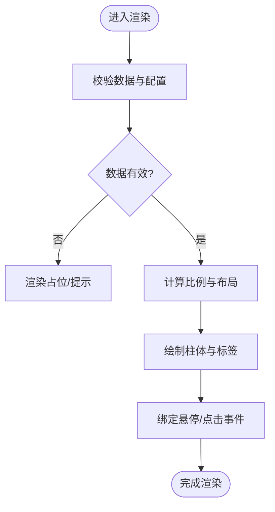
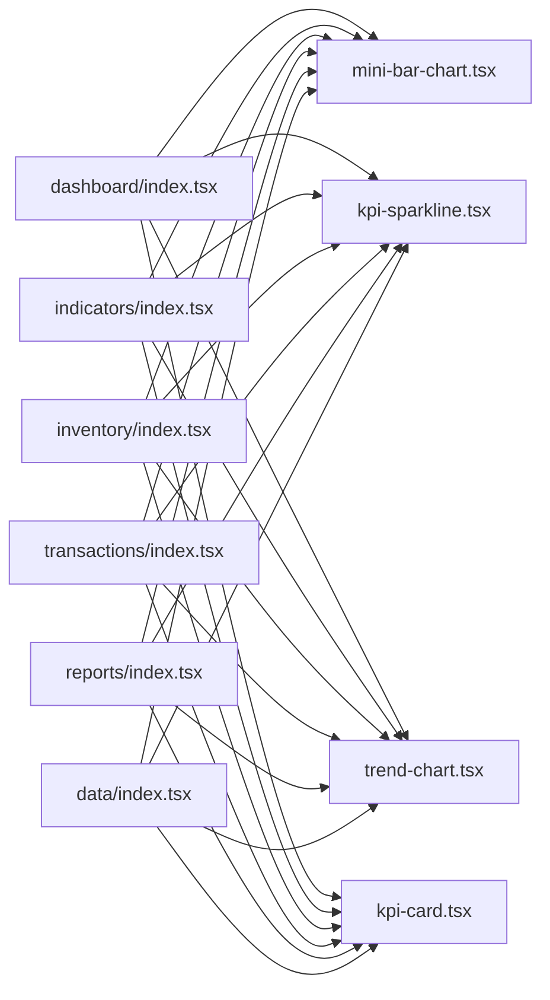

# 迷你柱状图组件

<cite>
**本文引用的文件**   
- [mini-bar-chart.tsx](file://web/src/components/charts/mini-bar-chart.tsx)
- [kpi-sparkline.tsx](file://web/src/components/charts/kpi-sparkline.tsx)
- [trend-chart.tsx](file://web/src/components/charts/trend-chart.tsx)
- [kpi-card.tsx](file://web/src/components/charts/kpi-card.tsx)
- [dashboard/index.tsx](file://web/src/pages/dashboard/index.tsx)
- [indicators/index.tsx](file://web/src/pages/indicators/index.tsx)
- [inventory/index.tsx](file://web/src/pages/inventory/index.tsx)
- [transactions/index.tsx](file://web/src/pages/transactions/index.tsx)
- [reports/index.tsx](file://web/src/pages/reports/index.tsx)
- [data/index.tsx](file://web/src/pages/data/index.tsx)
</cite>

## 目录
1. [简介](#简介)
2. [项目结构](#项目结构)
3. [核心组件](#核心组件)
4. [架构总览](#架构总览)
5. [详细组件分析](#详细组件分析)
6. [依赖分析](#依赖分析)
7. [性能考虑](#性能考虑)
8. [故障排查指南](#故障排查指南)
9. [结论](#结论)
10. [附录](#附录)

## 简介
本文件聚焦于“迷你柱状图”可视化能力，围绕仓库中图表组件的实现与使用进行系统化说明。文档从系统架构、组件关系、数据流、处理逻辑、集成点、错误处理与性能特性等维度展开，帮助读者快速理解并正确使用该能力。

## 项目结构
与迷你柱状图相关的代码主要位于前端工程 web 的 src/components/charts 目录下，并在多个页面中被引用以展示关键指标的趋势或分布。

图示来源
- [mini-bar-chart.tsx](file://web/src/components/charts/mini-bar-chart.tsx)
- [kpi-sparkline.tsx](file://web/src/components/charts/kpi-sparkline.tsx)
- [trend-chart.tsx](file://web/src/components/charts/trend-chart.tsx)
- [kpi-card.tsx](file://web/src/components/charts/kpi-card.tsx)
- [dashboard/index.tsx](file://web/src/pages/dashboard/index.tsx)
- [indicators/index.tsx](file://web/src/pages/indicators/index.tsx)
- [inventory/index.tsx](file://web/src/pages/inventory/index.tsx)
- [transactions/index.tsx](file://web/src/pages/transactions/index.tsx)
- [reports/index.tsx](file://web/src/pages/reports/index.tsx)
- [data/index.tsx](file://web/src/pages/data/index.tsx)

章节来源
- [mini-bar-chart.tsx](file://web/src/components/charts/mini-bar-chart.tsx)
- [kpi-sparkline.tsx](file://web/src/components/charts/kpi-sparkline.tsx)
- [trend-chart.tsx](file://web/src/components/charts/trend-chart.tsx)
- [kpi-card.tsx](file://web/src/components/charts/kpi-card.tsx)
- [dashboard/index.tsx](file://web/src/pages/dashboard/index.tsx)
- [indicators/index.tsx](file://web/src/pages/indicators/index.tsx)
- [inventory/index.tsx](file://web/src/pages/inventory/index.tsx)
- [transactions/index.tsx](file://web/src/pages/transactions/index.tsx)
- [reports/index.tsx](file://web/src/pages/reports/index.tsx)
- [data/index.tsx](file://web/src/pages/data/index.tsx)

## 核心组件
- 迷你柱状图（mini-bar-chart）：用于在有限空间内展示一组离散数值的大小对比，适合 KPI 卡片、列表行内趋势等场景。
- 关联组件：
  - KPI 折线（kpi-sparkline）：轻量级趋势线，常与迷你柱状图搭配呈现短期波动。
  - 趋势图（trend-chart）：更完整的时序趋势视图，适合详情页或独立页面。
  - KPI 卡片（kpi-card）：承载标题、数值与迷你图表的组合容器。

章节来源
- [mini-bar-chart.tsx](file://web/src/components/charts/mini-bar-chart.tsx)
- [kpi-sparkline.tsx](file://web/src/components/charts/kpi-sparkline.tsx)
- [trend-chart.tsx](file://web/src/components/charts/trend-chart.tsx)
- [kpi-card.tsx](file://web/src/components/charts/kpi-card.tsx)

## 架构总览
整体采用“页面消费图表组件”的单向数据流模式：页面负责获取数据与状态，将数据通过 props 传递给图表组件；图表组件专注于渲染与交互，不持有业务状态。

图示来源
- [mini-bar-chart.tsx](file://web/src/components/charts/mini-bar-chart.tsx)
- [kpi-sparkline.tsx](file://web/src/components/charts/kpi-sparkline.tsx)
- [kpi-card.tsx](file://web/src/components/charts/kpi-card.tsx)
- [dashboard/index.tsx](file://web/src/pages/dashboard/index.tsx)

## 详细组件分析

### 迷你柱状图组件（mini-bar-chart）
- 职责
  - 接收数据数组与可选样式配置，渲染为紧凑的柱状图。
  - 提供基础交互（如悬停提示），保持轻量无外部重型依赖。
- 输入输出
  - 输入：数据项集合、颜色主题、尺寸约束、是否显示标签等。
  - 输出：可复用的 SVG/Canvas 图形片段。
- 复杂度与优化
  - 时间复杂度：O(n)，n 为数据项数量。
  - 空间复杂度：O(n)，用于存储布局与绘制信息。
  - 大数据量建议：分页/采样/虚拟化渲染。
- 错误处理
  - 空数据：降级为占位态或提示文案。
  - 异常值：自动缩放坐标轴或裁剪极端值。
  - 类型校验：对缺失字段给出默认值或告警。

图示来源
- [mini-bar-chart.tsx](file://web/src/components/charts/mini-bar-chart.tsx)

章节来源
- [mini-bar-chart.tsx](file://web/src/components/charts/mini-bar-chart.tsx)

### 关联组件：KPI 折线（kpi-sparkline）
- 职责：以最小视觉开销展示短期趋势，常用于 KPI 卡片右侧或行内。
- 特点：路径简化、自适应宽高、支持断点与异常点标记。
- 适用场景：需要强调方向性而非绝对值的指标。

章节来源
- [kpi-sparkline.tsx](file://web/src/components/charts/kpi-sparkline.tsx)

### 关联组件：趋势图（trend-chart）
- 职责：提供更丰富的时序视图，包含网格、刻度、图例、缩放等。
- 特点：适合详情页或独立页面，作为迷你柱状图的“放大版”。
- 适用场景：需要深入分析趋势与波动的场景。

章节来源
- [trend-chart.tsx](file://web/src/components/charts/trend-chart.tsx)

### 组合容器：KPI 卡片（kpi-card）
- 职责：聚合标题、主数值与迷你图表，形成标准 KPI 展示单元。
- 组合方式：内部嵌入迷你柱状图与 KPI 折线，统一间距与对齐。
- 扩展点：支持自定义头部、副标题、单位与刷新按钮。

章节来源
- [kpi-card.tsx](file://web/src/components/charts/kpi-card.tsx)

## 依赖分析
- 组件耦合
  - 页面仅依赖图表组件的公开接口（props），实现松耦合。
  - 图表组件之间通过 KPI 卡片进行组合，避免直接强耦合。
- 外部依赖
  - 若使用第三方绘图库，应封装为内部组件，屏蔽差异。
  - 样式层建议使用 Tailwind 或 CSS Modules，便于主题化。

图示来源
- [mini-bar-chart.tsx](file://web/src/components/charts/mini-bar-chart.tsx)
- [kpi-sparkline.tsx](file://web/src/components/charts/kpi-sparkline.tsx)
- [trend-chart.tsx](file://web/src/components/charts/trend-chart.tsx)
- [kpi-card.tsx](file://web/src/components/charts/kpi-card.tsx)
- [dashboard/index.tsx](file://web/src/pages/dashboard/index.tsx)
- [indicators/index.tsx](file://web/src/pages/indicators/index.tsx)
- [inventory/index.tsx](file://web/src/pages/inventory/index.tsx)
- [transactions/index.tsx](file://web/src/pages/transactions/index.tsx)
- [reports/index.tsx](file://web/src/pages/reports/index.tsx)
- [data/index.tsx](file://web/src/pages/data/index.tsx)

章节来源
- [mini-bar-chart.tsx](file://web/src/components/charts/mini-bar-chart.tsx)
- [kpi-sparkline.tsx](file://web/src/components/charts/kpi-sparkline.tsx)
- [trend-chart.tsx](file://web/src/components/charts/trend-chart.tsx)
- [kpi-card.tsx](file://web/src/components/charts/kpi-card.tsx)
- [dashboard/index.tsx](file://web/src/pages/dashboard/index.tsx)
- [indicators/index.tsx](file://web/src/pages/indicators/index.tsx)
- [inventory/index.tsx](file://web/src/pages/inventory/index.tsx)
- [transactions/index.tsx](file://web/src/pages/transactions/index.tsx)
- [reports/index.tsx](file://web/src/pages/reports/index.tsx)
- [data/index.tsx](file://web/src/pages/data/index.tsx)

## 性能考虑
- 数据规模
  - 当数据项较多时，优先启用采样或分页，减少 DOM/SVG 节点数量。
- 渲染策略
  - 使用不可变更新与浅比较，避免不必要的重渲染。
  - 对静态图表使用 memo 缓存。
- 动画与交互
  - 仅在必要时开启过渡动画；大量数据下禁用复杂动画。
- 主题与样式
  - 通过 CSS 变量或主题对象集中管理颜色，减少运行时计算。

[本节为通用指导，无需列出具体文件来源]

## 故障排查指南
- 常见问题
  - 数据为空：检查上游数据源与加载状态，确保有兜底占位。
  - 数值异常：确认数据清洗与边界处理逻辑，避免 NaN/Infinity。
  - 样式错乱：核对容器尺寸与响应式断点，避免溢出。
- 定位步骤
  - 在页面层打印传入 props，确认数据结构与长度。
  - 在图表组件入口增加日志，观察渲染分支与计算结果。
  - 切换主题与尺寸，验证适配逻辑。

章节来源
- [mini-bar-chart.tsx](file://web/src/components/charts/mini-bar-chart.tsx)
- [kpi-sparkline.tsx](file://web/src/components/charts/kpi-sparkline.tsx)
- [trend-chart.tsx](file://web/src/components/charts/trend-chart.tsx)
- [kpi-card.tsx](file://web/src/components/charts/kpi-card.tsx)

## 结论
迷你柱状图组件以轻量、可组合为核心设计目标，配合 KPI 卡片与折线组件，可在多页面中一致地呈现关键指标。通过明确的数据流向与容错策略，能够在保证可读性的同时兼顾性能与可维护性。

[本节为总结性内容，无需列出具体文件来源]

## 附录
- 使用建议
  - 在 KPI 卡片中优先使用迷你柱状图表达分布，用折线表达趋势。
  - 对跨端一致性要求高的场景，尽量复用同一套主题与尺寸规范。
- 扩展方向
  - 增加更多配色方案与无障碍支持（ARIA）。
  - 引入虚拟滚动与增量渲染以应对更大数据集。

[本节为概念性内容，无需列出具体文件来源]