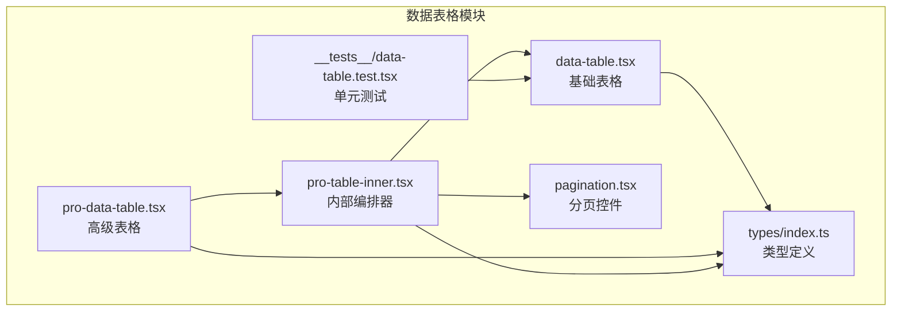
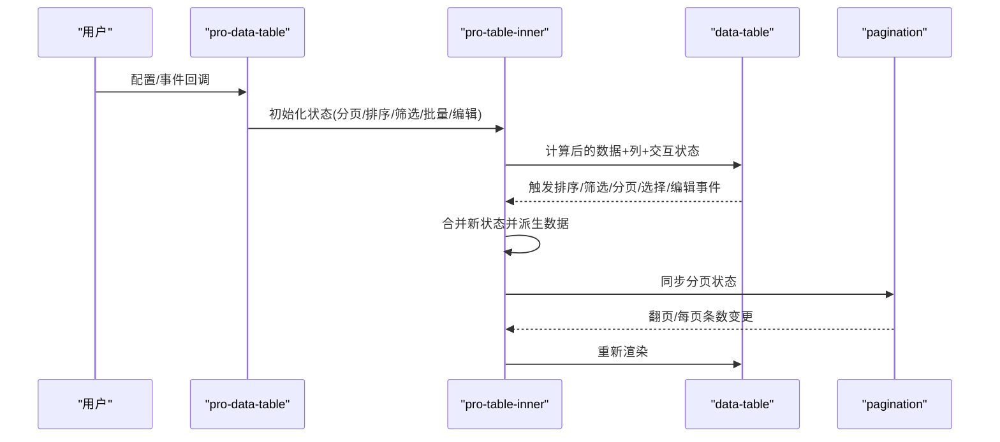
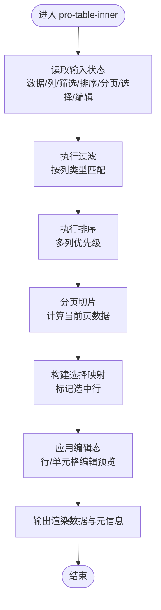
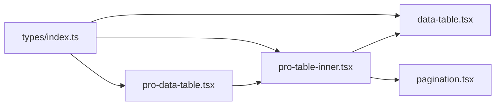

# 数据表格组件

<cite>
**本文引用的文件**   
- [data-table.tsx](file://web/src/components/data-table/data-table.tsx)
- [pro-data-table.tsx](file://web/src/components/data-table/pro-data-table.tsx)
- [pro-table-inner.tsx](file://web/src/components/data-table/pro-table-inner.tsx)
- [pagination.tsx](file://web/src/components/data-table/pagination.tsx)
- [data-table.test.tsx](file://web/src/components/data-table/__tests__/data-table.test.tsx)
- [index.ts](file://web/src/types/index.ts)
</cite>

## 目录
1. [简介](#简介)
2. [项目结构](#项目结构)
3. [核心组件](#核心组件)
4. [架构总览](#架构总览)
5. [详细组件分析](#详细组件分析)
6. [依赖关系分析](#依赖关系分析)
7. [性能考虑](#性能考虑)
8. [故障排查指南](#故障排查指南)
9. [结论](#结论)
10. [附录](#附录)

## 简介
本文件面向 pj3 项目的数据表格组件，系统性梳理 data-table 基础组件与 pro-data-table 高级组件的设计模式、实现细节与使用方式。文档覆盖分页、排序、筛选、编辑、批量操作等核心能力，深入解析 pro-table-inner 内部组件的复杂逻辑与数据流管理，并提供配置项说明、自定义列渲染、事件处理与状态管理的最佳实践。同时给出常见用例的代码片段路径指引、性能优化策略（虚拟滚动、懒加载、内存管理等）以及错误处理与用户体验优化建议。

## 项目结构
数据表格相关代码位于 web/src/components/data-table 目录下，包含基础表格、高级表格、内部编排器与分页组件，并附带测试用例与类型定义引用。

图表来源
- [data-table.tsx](file://web/src/components/data-table/data-table.tsx)
- [pro-data-table.tsx](file://web/src/components/data-table/pro-data-table.tsx)
- [pro-table-inner.tsx](file://web/src/components/data-table/pro-table-inner.tsx)
- [pagination.tsx](file://web/src/components/data-table/pagination.tsx)
- [data-table.test.tsx](file://web/src/components/data-table/__tests__/data-table.test.tsx)
- [index.ts](file://web/src/types/index.ts)

章节来源
- [data-table.tsx](file://web/src/components/data-table/data-table.tsx)
- [pro-data-table.tsx](file://web/src/components/data-table/pro-data-table.tsx)
- [pro-table-inner.tsx](file://web/src/components/data-table/pro-table-inner.tsx)
- [pagination.tsx](file://web/src/components/data-table/pagination.tsx)
- [data-table.test.tsx](file://web/src/components/data-table/__tests__/data-table.test.tsx)
- [index.ts](file://web/src/types/index.ts)

## 核心组件
- data-table：基础表格展示与交互容器，提供列定义、行渲染、选择、排序、分页等基础能力。
- pro-data-table：在基础表格之上封装高级能力，包括筛选、批量操作、导出、工具栏、状态同步等。
- pro-table-inner：高级表格的内部编排器，负责将筛选、排序、分页、批量选择、编辑等状态聚合为统一的表格数据流，协调子组件更新。
- pagination：分页控件，支持页码切换、每页条数调整、跳转等。

章节来源
- [data-table.tsx](file://web/src/components/data-table/data-table.tsx)
- [pro-data-table.tsx](file://web/src/components/data-table/pro-data-table.tsx)
- [pro-table-inner.tsx](file://web/src/components/data-table/pro-table-inner.tsx)
- [pagination.tsx](file://web/src/components/data-table/pagination.tsx)

## 架构总览
整体采用“组合式”架构：pro-data-table 作为门面，内部通过 pro-table-inner 编排数据流与状态，最终交由 data-table 进行渲染；pagination 作为独立可复用控件被上层集成。

图表来源
- [pro-data-table.tsx](file://web/src/components/data-table/pro-data-table.tsx)
- [pro-table-inner.tsx](file://web/src/components/data-table/pro-table-inner.tsx)
- [data-table.tsx](file://web/src/components/data-table/data-table.tsx)
- [pagination.tsx](file://web/src/components/data-table/pagination.tsx)

## 详细组件分析

### data-table 基础表格
- 职责
  - 接收列定义、数据源、行键、选择与编辑状态。
  - 渲染表头、表体、空态与加载中状态。
  - 暴露排序、选择、单元格/行级编辑回调。
- 关键特性
  - 列渲染：支持自定义渲染函数、插槽化扩展。
  - 行选择：单选/多选，全选联动。
  - 排序：单列/多列排序，升序/降序/默认顺序。
  - 分页：与外部分页状态解耦，由上层驱动。
- 设计要点
  - 纯展示为主，尽量无副作用，便于测试与复用。
  - 通过 props 注入行为，避免内部隐式状态。
- 典型用法
  - 简单表格：传入 columns 与 dataSource，绑定 rowKey。
  - 可编辑表格：为列提供 onCellEdit/onRowEdit 回调，结合表单校验。
  - 自定义列：在列定义中提供 render 或 cellRender 函数。

章节来源
- [data-table.tsx](file://web/src/components/data-table/data-table.tsx)
- [index.ts](file://web/src/types/index.ts)

### pro-data-table 高级表格
- 职责
  - 对外暴露统一 API：columns、dataSource、分页、排序、筛选、批量操作、导出、工具栏等。
  - 维护高级状态并与 data-table 对接。
- 关键特性
  - 筛选：支持文本模糊、枚举下拉、范围区间等。
  - 批量操作：选中行集合、批量删除/导出/状态变更。
  - 工具栏：搜索框、新增按钮、导出按钮等可扩展区域。
  - 事件：onPageChange、onSortChange、onFilterChange、onSelectionChange、onExport 等。
- 设计要点
  - 以“受控 + 非受控”双模式兼容不同场景。
  - 将复杂状态下沉到 pro-table-inner，保持外层简洁。
- 典型用法
  - 高级筛选表格：在 filterOptions 中声明字段、类型、选项与默认值。
  - 批量操作：启用 selectionType，监听 onSelectionChange 执行批量动作。
  - 可编辑表格：在列上开启 editable，配合 onCellEdit/onRowEdit 完成保存。

章节来源
- [pro-data-table.tsx](file://web/src/components/data-table/pro-data-table.tsx)
- [index.ts](file://web/src/types/index.ts)

### pro-table-inner 内部编排器
- 职责
  - 集中管理分页、排序、筛选、选择、编辑等状态。
  - 根据当前状态派生出最终渲染数据（过滤、排序、分页切片）。
  - 协调 data-table 与 pagination 的状态同步与事件转发。
- 数据流
  - 输入：原始数据、列定义、筛选条件、排序规则、分页参数、选择集、编辑态。
  - 处理：过滤→排序→分页切片→生成行选择映射→应用编辑态。
  - 输出：渲染数据、当前页数据、总条数、是否加载中、错误信息。
- 关键算法
  - 过滤：按列类型匹配（字符串包含、数值比较、枚举相等、范围区间）。
  - 排序：多列优先级，稳定排序保证一致性。
  - 分页：基于索引切片的 O(1) 获取当前页数据。
- 状态管理
  - 使用局部状态或轻量状态库，避免不必要的重渲染。
  - 对昂贵计算结果进行缓存（如过滤后数据集），仅在相关状态变化时重建。
- 事件转发
  - 将 data-table 的排序/筛选/选择/编辑事件归一化后更新内部状态，再回写至 data-table。

图表来源
- [pro-table-inner.tsx](file://web/src/components/data-table/pro-table-inner.tsx)

章节来源
- [pro-table-inner.tsx](file://web/src/components/data-table/pro-table-inner.tsx)

### pagination 分页控件
- 职责
  - 展示当前页码、总页数、每页条数，响应翻页与每页条数变更。
- 关键特性
  - 支持快速跳转、大小切换、禁用态控制。
  - 与上层状态双向绑定，确保 UI 与数据一致。
- 设计要点
  - 纯展示组件，所有业务逻辑由上层驱动。
  - 提供最小必要 props，降低耦合。

章节来源
- [pagination.tsx](file://web/src/components/data-table/pagination.tsx)

## 依赖关系分析
- 组件内聚
  - pro-data-table 仅做门面与配置透传，核心编排逻辑集中在 pro-table-inner。
  - data-table 专注渲染与基础交互，不关心筛选/批量等业务语义。
- 外部依赖
  - types/index.ts 提供列定义、筛选器、分页、选择等类型约束，贯穿各组件。
- 潜在循环
  - 通过单向数据流与事件回调避免循环依赖。

图表来源
- [index.ts](file://web/src/types/index.ts)
- [data-table.tsx](file://web/src/components/data-table/data-table.tsx)
- [pro-data-table.tsx](file://web/src/components/data-table/pro-data-table.tsx)
- [pro-table-inner.tsx](file://web/src/components/data-table/pro-table-inner.tsx)
- [pagination.tsx](file://web/src/components/data-table/pagination.tsx)

章节来源
- [index.ts](file://web/src/types/index.ts)
- [data-table.tsx](file://web/src/components/data-table/data-table.tsx)
- [pro-data-table.tsx](file://web/src/components/data-table/pro-data-table.tsx)
- [pro-table-inner.tsx](file://web/src/components/data-table/pro-table-inner.tsx)
- [pagination.tsx](file://web/src/components/data-table/pagination.tsx)

## 性能考虑
- 虚拟滚动
  - 当行数较大时，建议使用虚拟化列表技术只渲染可视区域行，显著降低 DOM 节点数量与重排开销。
  - 在 data-table 层接入虚拟滚动容器，保持列宽与对齐一致性。
- 懒加载
  - 大数据集采用服务端分页与按需加载，避免一次性拉取全量数据。
  - 筛选/排序/分页均走后端接口，前端只做轻量预处理。
- 内存管理
  - 及时释放大对象引用，避免闭包持有长生命周期引用导致泄漏。
  - 对过滤/排序中间结果进行缓存与失效策略，减少重复计算。
- 渲染优化
  - 使用稳定的 key（rowKey）避免不必要的重渲染。
  - 拆分重型列渲染为独立小组件，按需 memo 化。
- 事件节流
  - 对高频事件（如输入型筛选）进行防抖/节流，降低状态更新频率。

[本节为通用指导，无需源码引用]

## 故障排查指南
- 常见问题
  - 行选择异常：检查 rowKey 唯一性与稳定性。
  - 排序错乱：确认多列排序优先级与比较函数稳定性。
  - 筛选无效：核对筛选器类型与字段路径，确保数据类型一致。
  - 分页错位：确认 pageSize/pageIndex 与后端返回总数一致。
  - 编辑态丢失：检查编辑态是否与行标识绑定，避免 key 变化导致状态重置。
- 调试建议
  - 打印 pro-table-inner 的输入/输出快照，定位数据流断点。
  - 使用浏览器性能面板观察重渲染热点，定位重型渲染列。
  - 针对边界用例编写单测，覆盖空数据、超长文本、特殊字符等。
- 参考测试
  - 查看 data-table 的单测用例，了解预期行为与边界处理。

章节来源
- [data-table.test.tsx](file://web/src/components/data-table/__tests__/data-table.test.tsx)

## 结论
data-table 与 pro-data-table 形成清晰的分层：前者专注渲染与基础交互，后者封装高级能力并通过 pro-table-inner 统一管理数据流与状态。该架构具备良好的扩展性与可测试性，适合在复杂业务场景中复用。结合虚拟滚动、懒加载与合理的状态缓存策略，可在大数据量下保持流畅体验。

[本节为总结性内容，无需源码引用]

## 附录

### 配置项速览（概念性）
- 列定义
  - 字段名、标题、宽度、对齐、可排序、可筛选、可编辑、渲染函数、格式化函数等。
- 数据源
  - 数组格式，每项需具备稳定唯一标识（rowKey）。
- 分页
  - 当前页、每页条数、总条数、是否显示跳转等。
- 排序
  - 默认排序、多列排序、排序方向。
- 筛选
  - 字段级筛选器类型（文本、枚举、范围）、默认值、联动关系。
- 选择
  - 单选/多选、全选、选择回调。
- 编辑
  - 行级/单元格级编辑、保存回调、校验规则。
- 批量操作
  - 批量删除/导出/状态变更、批量操作按钮组。
- 工具栏
  - 自定义左侧/右侧工具区，支持搜索框、新增、导出等。

[本节为概念性说明，无需源码引用]

### 常见用例与代码片段路径
- 简单表格
  - 示例路径：[data-table.tsx](file://web/src/components/data-table/data-table.tsx)
- 高级筛选表格
  - 示例路径：[pro-data-table.tsx](file://web/src/components/data-table/pro-data-table.tsx)
- 可编辑表格
  - 示例路径：[pro-data-table.tsx](file://web/src/components/data-table/pro-data-table.tsx)
- 批量操作
  - 示例路径：[pro-data-table.tsx](file://web/src/components/data-table/pro-data-table.tsx)
- 分页集成
  - 示例路径：[pagination.tsx](file://web/src/components/data-table/pagination.tsx)

[本节为路径指引，无需源码引用]