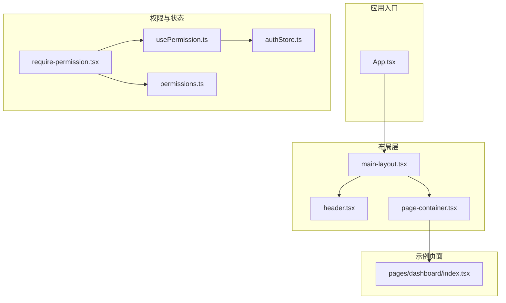
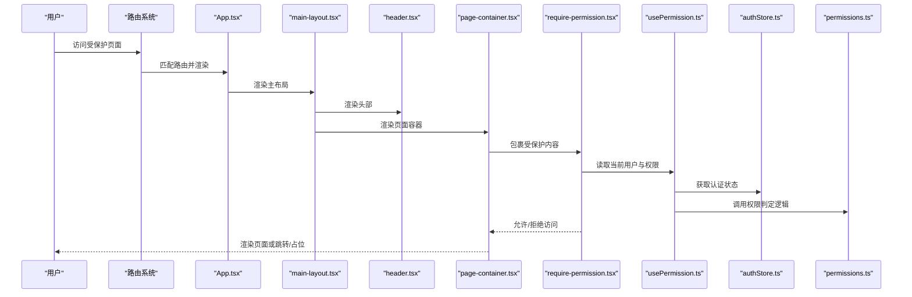
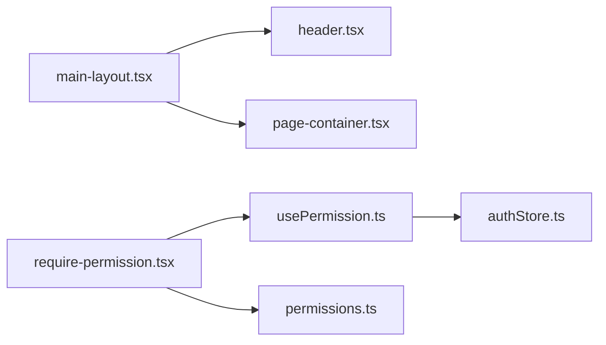

# 布局组件

<cite>
**本文引用的文件**   
- [main-layout.tsx](file://web/src/components/layout/main-layout.tsx)
- [header.tsx](file://web/src/components/layout/header.tsx)
- [page-container.tsx](file://web/src/components/layout/page-container.tsx)
- [require-permission.tsx](file://web/src/components/layout/require-permission.tsx)
- [usePermission.ts](file://web/src/hooks/usePermission.ts)
- [authStore.ts](file://web/src/stores/authStore.ts)
- [permissions.ts](file://web/src/lib/permissions.ts)
- [App.tsx](file://web/src/App.tsx)
- [index.tsx](file://web/src/pages/dashboard/index.tsx)
</cite>

## 目录
1. [简介](#简介)
2. [项目结构](#项目结构)
3. [核心组件](#核心组件)
4. [架构总览](#架构总览)
5. [详细组件分析](#详细组件分析)
6. [依赖关系分析](#依赖关系分析)
7. [性能考虑](#性能考虑)
8. [故障排查指南](#故障排查指南)
9. [结论](#结论)
10. [附录](#附录)

## 简介
本文件面向pj3项目的页面布局与权限控制体系，系统性阐述 main-layout、header、page-container 等布局组件的架构设计与实现原理，说明其层次结构与嵌套关系、响应式与自适应策略；深入解析 require-permission 权限控制组件的角色验证与访问控制逻辑；提供配置项与扩展点说明，并给出组合使用模式（侧边栏、导航栏、内容区域）以及与路由系统的集成方式和性能优化建议。

## 项目结构
布局相关代码集中在 web/src/components/layout 目录下，配合 hooks、stores、lib 中的权限与状态能力，形成“布局容器 + 头部 + 页面容器 + 权限守卫”的组合式架构。典型页面通过 App 路由挂载到主布局中，再由 page-container 承载具体业务内容。

图表来源
- [App.tsx](file://web/src/App.tsx)
- [main-layout.tsx](file://web/src/components/layout/main-layout.tsx)
- [header.tsx](file://web/src/components/layout/header.tsx)
- [page-container.tsx](file://web/src/components/layout/page-container.tsx)
- [require-permission.tsx](file://web/src/components/layout/require-permission.tsx)
- [usePermission.ts](file://web/src/hooks/usePermission.ts)
- [authStore.ts](file://web/src/stores/authStore.ts)
- [permissions.ts](file://web/src/lib/permissions.ts)
- [index.tsx](file://web/src/pages/dashboard/index.tsx)

章节来源
- [App.tsx](file://web/src/App.tsx)
- [main-layout.tsx](file://web/src/components/layout/main-layout.tsx)
- [header.tsx](file://web/src/components/layout/header.tsx)
- [page-container.tsx](file://web/src/components/layout/page-container.tsx)
- [require-permission.tsx](file://web/src/components/layout/require-permission.tsx)
- [usePermission.ts](file://web/src/hooks/usePermission.ts)
- [authStore.ts](file://web/src/stores/authStore.ts)
- [permissions.ts](file://web/src/lib/permissions.ts)
- [index.tsx](file://web/src/pages/dashboard/index.tsx)

## 核心组件
- main-layout：应用级主布局容器，负责整体框架（如顶部导航、侧边栏、内容区）的组织与响应式适配，通常作为路由渲染的根容器。
- header：顶部导航/工具栏组件，展示品牌、全局搜索、用户菜单等，支持移动端折叠与可配置项。
- page-container：页面内容容器，提供统一的页面内边距、标题区、操作区、内容区划分，便于页面级一致性与可维护性。
- require-permission：权限守卫组件，基于角色/权限进行访问控制，未授权时执行重定向或降级渲染。

章节来源
- [main-layout.tsx](file://web/src/components/layout/main-layout.tsx)
- [header.tsx](file://web/src/components/layout/header.tsx)
- [page-container.tsx](file://web/src/components/layout/page-container.tsx)
- [require-permission.tsx](file://web/src/components/layout/require-permission.tsx)

## 架构总览
布局体系采用“容器-子组件”分层：App 将路由渲染到 main-layout，main-layout 组合 header 与 page-container，page-container 再承载具体页面。权限控制以高阶组件形式包裹需要鉴权的页面或区块，统一在入口处校验角色与权限。

图表来源
- [App.tsx](file://web/src/App.tsx)
- [main-layout.tsx](file://web/src/components/layout/main-layout.tsx)
- [header.tsx](file://web/src/components/layout/header.tsx)
- [page-container.tsx](file://web/src/components/layout/page-container.tsx)
- [require-permission.tsx](file://web/src/components/layout/require-permission.tsx)
- [usePermission.ts](file://web/src/hooks/usePermission.ts)
- [authStore.ts](file://web/src/stores/authStore.ts)
- [permissions.ts](file://web/src/lib/permissions.ts)

## 详细组件分析

### main-layout 主布局
- 职责
  - 组织全局布局骨架（头部、侧边栏、内容区）。
  - 管理响应式行为（如移动端侧边栏抽屉化）。
  - 为子页面提供一致的间距、背景与滚动容器。
- 关键设计
  - 通过 props 注入侧边栏与头部，保持高内聚低耦合。
  - 内部维护布局状态（如侧边栏展开/收起），并提供回调供外部更新。
  - 结合 Tailwind 断点实现多端适配。
- 扩展点
  - 自定义侧边栏插槽、头部插槽、页脚插槽。
  - 主题与密度（紧凑/宽松）可通过配置切换。
- 与路由集成
  - 作为路由渲染根节点，确保所有页面共享同一布局。
- 性能要点
  - 避免在每次渲染中重建侧边栏/头部实例，必要时 memo 化。
  - 大列表或复杂侧边栏按需加载。

章节来源
- [main-layout.tsx](file://web/src/components/layout/main-layout.tsx)

### header 头部导航
- 职责
  - 展示全局导航、搜索、通知、用户菜单等。
  - 在移动端提供折叠菜单与返回按钮。
- 关键设计
  - 通过 props 暴露可配置项（如 logo、菜单项、用户信息）。
  - 与 authStore 联动显示登录态与用户信息。
- 响应式
  - 小屏下隐藏次要入口，保留核心导航与用户头像。
- 交互
  - 下拉菜单、搜索框聚焦、消息角标等。

章节来源
- [header.tsx](file://web/src/components/layout/header.tsx)
- [authStore.ts](file://web/src/stores/authStore.ts)

### page-container 页面容器
- 职责
  - 统一页面内边距、标题区、副标题、操作按钮区与内容区。
  - 提供页面级加载骨架与错误边界占位。
- 关键设计
  - 通过 children 注入业务内容，保证页面结构一致性。
  - 支持可选的顶部操作区与面包屑。
- 与布局协作
  - 由 main-layout 渲染，承接路由页面内容。
- 扩展点
  - 自定义标题样式、操作区布局、内容区最大宽度等。

章节来源
- [page-container.tsx](file://web/src/components/layout/page-container.tsx)

### require-permission 权限守卫
- 职责
  - 在渲染前校验当前用户是否具备所需角色/权限。
  - 未通过时执行重定向或渲染无权限占位。
- 关键流程
  - 从 usePermission 获取当前用户与权限集合。
  - 调用 permissions 中的判定函数进行匹配。
  - 根据结果放行或拦截。
- 与状态集成
  - 依赖 authStore 的用户信息与登录态。
- 常见用法
  - 包裹页面组件或局部区块，细粒度控制可见性。

图表来源
- [require-permission.tsx](file://web/src/components/layout/require-permission.tsx)
- [usePermission.ts](file://web/src/hooks/usePermission.ts)
- [authStore.ts](file://web/src/stores/authStore.ts)
- [permissions.ts](file://web/src/lib/permissions.ts)

章节来源
- [require-permission.tsx](file://web/src/components/layout/require-permission.tsx)
- [usePermission.ts](file://web/src/hooks/usePermission.ts)
- [authStore.ts](file://web/src/stores/authStore.ts)
- [permissions.ts](file://web/src/lib/permissions.ts)

### 组合使用模式
- 标准页面
  - 路由 -> main-layout -> header + page-container -> 业务页面。
- 带侧边栏的管理后台
  - main-layout 左侧放置侧边栏，右侧为 page-container 承载内容。
- 仅头部+内容的轻量页面
  - main-layout 仅渲染 header 与 page-container，不显示侧边栏。
- 权限隔离
  - 对敏感页面或区块使用 require-permission 包裹，按角色/权限控制。

章节来源
- [main-layout.tsx](file://web/src/components/layout/main-layout.tsx)
- [page-container.tsx](file://web/src/components/layout/page-container.tsx)
- [require-permission.tsx](file://web/src/components/layout/require-permission.tsx)
- [index.tsx](file://web/src/pages/dashboard/index.tsx)

## 依赖关系分析
- 组件耦合
  - main-layout 依赖 header 与 page-container，二者相对独立，便于替换与复用。
  - require-permission 依赖 usePermission、authStore、permissions，职责单一且可测试。
- 外部依赖
  - 路由系统（用于挂载 main-layout）。
  - UI 样式库（Tailwind 断点与原子类）。
- 潜在循环
  - 布局与页面之间应避免反向导入，推荐通过 props 注入。

图表来源
- [main-layout.tsx](file://web/src/components/layout/main-layout.tsx)
- [header.tsx](file://web/src/components/layout/header.tsx)
- [page-container.tsx](file://web/src/components/layout/page-container.tsx)
- [require-permission.tsx](file://web/src/components/layout/require-permission.tsx)
- [usePermission.ts](file://web/src/hooks/usePermission.ts)
- [authStore.ts](file://web/src/stores/authStore.ts)
- [permissions.ts](file://web/src/lib/permissions.ts)

章节来源
- [main-layout.tsx](file://web/src/components/layout/main-layout.tsx)
- [header.tsx](file://web/src/components/layout/header.tsx)
- [page-container.tsx](file://web/src/components/layout/page-container.tsx)
- [require-permission.tsx](file://web/src/components/layout/require-permission.tsx)
- [usePermission.ts](file://web/src/hooks/usePermission.ts)
- [authStore.ts](file://web/src/stores/authStore.ts)
- [permissions.ts](file://web/src/lib/permissions.ts)

## 性能考虑
- 渲染优化
  - 对 header、side-bar、page-container 使用记忆化（memo）减少重复渲染。
  - 大型侧边栏或菜单项懒加载与虚拟滚动。
- 状态同步
  - 将用户信息、权限集合提升到 store，避免频繁跨层级传递。
- 路由级优化
  - 对非首屏页面使用路由级懒加载，降低初始包体积。
- 样式与主题
  - 利用 Tailwind 断点与容器查询提升响应式效率，避免过度重排。
- 权限校验
  - 将权限判定结果缓存，避免重复计算。

[本节为通用指导，无需源码引用]

## 故障排查指南
- 权限无效或未生效
  - 检查 authStore 是否正确初始化用户与角色。
  - 确认 permissions 判定逻辑覆盖所有必要场景。
  - 查看 require-permission 的 fallback 行为是否符合预期。
- 布局错乱或重叠
  - 检查 main-layout 的响应式断点与容器高度设置。
  - 确认 page-container 的 padding/margin 是否与全局样式冲突。
- 移动端体验异常
  - 验证 header 的折叠菜单与 main-layout 的侧边栏抽屉开关逻辑。
- 路由与布局不同步
  - 确认 App 中将路由渲染到 main-layout 的挂载点正确。

章节来源
- [require-permission.tsx](file://web/src/components/layout/require-permission.tsx)
- [usePermission.ts](file://web/src/hooks/usePermission.ts)
- [authStore.ts](file://web/src/stores/authStore.ts)
- [permissions.ts](file://web/src/lib/permissions.ts)
- [main-layout.tsx](file://web/src/components/layout/main-layout.tsx)
- [header.tsx](file://web/src/components/layout/header.tsx)
- [page-container.tsx](file://web/src/components/layout/page-container.tsx)
- [App.tsx](file://web/src/App.tsx)

## 结论
本布局体系以 main-layout 为核心，组合 header 与 page-container 构建一致的页面骨架，并通过 require-permission 实现细粒度的访问控制。该方案具备良好的可扩展性与可维护性，适合中后台与数据密集型应用的快速迭代。建议在后续版本中持续完善权限模型、侧边栏配置化与性能监控指标。

[本节为总结，无需源码引用]

## 附录
- 配置项建议
  - main-layout：侧边栏默认展开、主题模式、内容区最大宽度。
  - header：Logo、菜单项、用户信息源、通知开关。
  - page-container：标题区显隐、操作区显隐、内容区对齐方式。
  - require-permission：默认无权限提示文案、重定向目标路径。
- 最佳实践
  - 将页面级布局与业务解耦，优先复用 page-container。
  - 权限判定尽量集中到 permissions 模块，便于审计与回归。
  - 对复杂布局组件编写单元测试与视觉回归用例。

[本节为补充说明，无需源码引用]