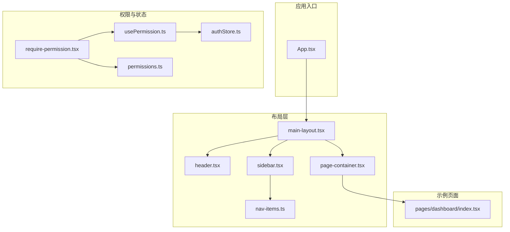
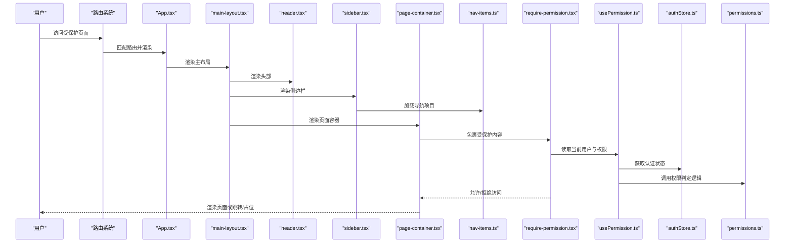
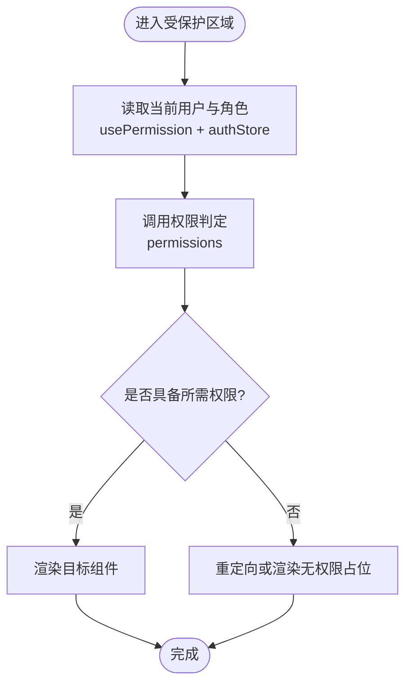
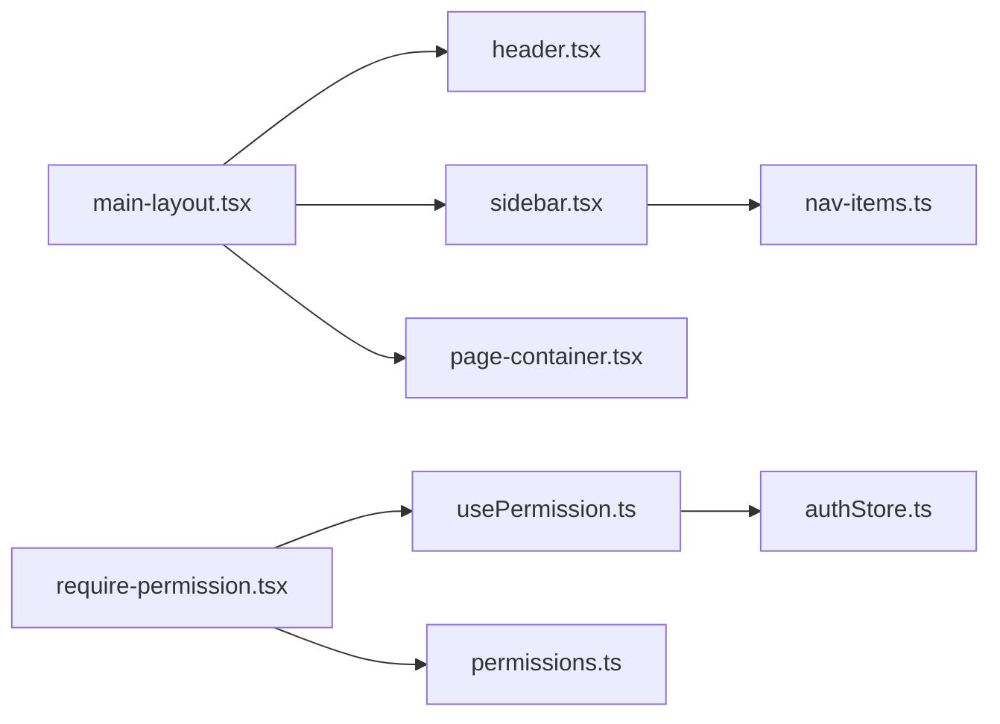

# 布局组件

<cite>
**本文引用的文件**   
- [main-layout.tsx](file://web/src/components/layout/main-layout.tsx)
- [header.tsx](file://web/src/components/layout/header.tsx)
- [page-container.tsx](file://web/src/components/layout/page-container.tsx)
- [sidebar.tsx](file://web/src/components/layout/sidebar.tsx)
- [nav-items.ts](file://web/src/components/layout/nav-items.ts)
- [require-permission.tsx](file://web/src/components/layout/require-permission.tsx)
- [usePermission.ts](file://web/src/hooks/usePermission.ts)
- [authStore.ts](file://web/src/stores/authStore.ts)
- [permissions.ts](file://web/src/lib/permissions.ts)
- [App.tsx](file://web/src/App.tsx)
- [index.tsx](file://web/src/pages/dashboard/index.tsx)
</cite>

## 更新摘要
**所做更改**
- 根据新的设计系统规范更新了主布局组件的样式调整说明
- 完善了布局组件的响应式设计和自适应策略
- 增强了样式系统的集成说明和最佳实践
- 更新了布局组件与Tailwind CSS设计系统的集成方式

## 目录
1. [简介](#简介)
2. [项目结构](#项目结构)
3. [核心组件](#核心组件)
4. [架构总览](#架构总览)
5. [详细组件分析](#详细组件分析)
6. [侧边栏导航系统](#侧边栏导航系统)
7. [导航项目管理](#导航项目管理)
8. [依赖关系分析](#依赖关系分析)
9. [性能考虑](#性能考虑)
10. [故障排查指南](#故障排查指南)
11. [结论](#结论)
12. [附录](#附录)

## 简介
本文件面向pj3项目的页面布局与权限控制体系，系统性阐述 main-layout、header、sidebar、page-container 等布局组件的架构设计与实现原理，说明其层次结构与嵌套关系、响应式与自适应策略；深入解析 require-perpermission 权限控制组件的角色验证与访问控制逻辑；提供配置项与扩展点说明，并给出组合使用模式（侧边栏、导航栏、内容区域）以及与路由系统的集成方式和性能优化建议。

**更新** 本次更新重点反映了主布局组件基于新设计系统规范的样式调整，包括响应式布局优化、Tailwind CSS集成改进以及整体视觉一致性提升。

## 项目结构
布局相关代码集中在 web/src/components/layout 目录下，配合 hooks、stores、lib 中的权限与状态能力，形成"布局容器 + 头部 + 侧边栏 + 页面容器 + 权限守卫"的组合式架构。典型页面通过 App 路由挂载到主布局中，再由 page-container 承载具体业务内容。



**图表来源**
- [App.tsx](file://web/src/App.tsx)
- [main-layout.tsx](file://web/src/components/layout/main-layout.tsx)
- [header.tsx](file://web/src/components/layout/header.tsx)
- [sidebar.tsx](file://web/src/components/layout/sidebar.tsx)
- [page-container.tsx](file://web/src/components/layout/page-container.tsx)
- [nav-items.ts](file://web/src/components/layout/nav-items.ts)
- [require-permission.tsx](file://web/src/components/layout/require-permission.tsx)
- [usePermission.ts](file://web/src/hooks/usePermission.ts)
- [authStore.ts](file://web/src/stores/authStore.ts)
- [permissions.ts](file://web/src/lib/permissions.ts)
- [index.tsx](file://web/src/pages/dashboard/index.tsx)

**章节来源**
- [App.tsx](file://web/src/App.tsx)
- [main-layout.tsx](file://web/src/components/layout/main-layout.tsx)
- [header.tsx](file://web/src/components/layout/header.tsx)
- [sidebar.tsx](file://web/src/components/layout/sidebar.tsx)
- [page-container.tsx](file://web/src/components/layout/page-container.tsx)
- [nav-items.ts](file://web/src/components/layout/nav-items.ts)
- [require-permission.tsx](file://web/src/components/layout/require-permission.tsx)
- [usePermission.ts](file://web/src/hooks/usePermission.ts)
- [authStore.ts](file://web/src/stores/authStore.ts)
- [permissions.ts](file://web/src/lib/permissions.ts)
- [index.tsx](file://web/src/pages/dashboard/index.tsx)

## 核心组件
- **main-layout**：应用级主布局容器，负责整体框架（顶部导航、侧边栏、内容区）的组织与响应式适配，通常作为路由渲染的根容器。
- **header**：顶部导航/工具栏组件，展示品牌、全局搜索、用户菜单等，支持移动端折叠与可配置项。
- **sidebar**：侧边栏导航组件，提供多级菜单、动态加载、权限控制等功能，支持折叠展开和响应式适配。
- **page-container**：页面内容容器，提供统一的页面内边距、标题区、操作区、内容区划分，便于页面级一致性与可维护性。
- **require-permission**：权限守卫组件，基于角色/权限进行访问控制，未授权时执行重定向或降级渲染。
- **nav-items**：导航项目管理系统，集中管理所有导航项的配置、权限控制和路由映射。

**更新** 主布局组件已根据新的设计系统规范进行了样式调整，提升了响应式表现和视觉一致性。

**章节来源**
- [main-layout.tsx](file://web/src/components/layout/main-layout.tsx)
- [header.tsx](file://web/src/components/layout/header.tsx)
- [sidebar.tsx](file://web/src/components/layout/sidebar.tsx)
- [page-container.tsx](file://web/src/components/layout/page-container.tsx)
- [nav-items.ts](file://web/src/components/layout/nav-items.ts)
- [require-permission.tsx](file://web/src/components/layout/require-permission.tsx)

## 架构总览
布局体系采用"容器-子组件"分层：App 将路由渲染到 main-layout，main-layout 组合 header、sidebar 与 page-container，page-container 再承载具体页面。权限控制以高阶组件形式包裹需要鉴权的页面或区块，统一在入口处校验角色与权限。



**图表来源**
- [App.tsx](file://web/src/App.tsx)
- [main-layout.tsx](file://web/src/components/layout/main-layout.tsx)
- [header.tsx](file://web/src/components/layout/header.tsx)
- [sidebar.tsx](file://web/src/components/layout/sidebar.tsx)
- [page-container.tsx](file://web/src/components/layout/page-container.tsx)
- [nav-items.ts](file://web/src/components/layout/nav-items.ts)
- [require-permission.tsx](file://web/src/components/layout/require-permission.tsx)
- [usePermission.ts](file://web/src/hooks/usePermission.ts)
- [authStore.ts](file://web/src/stores/authStore.ts)
- [permissions.ts](file://web/src/lib/permissions.ts)

## 详细组件分析

### main-layout 主布局
- **职责**
  - 组织全局布局骨架（头部、侧边栏、内容区）。
  - 管理响应式行为（如移动端侧边栏抽屉化）。
  - 为子页面提供一致的间距、背景与滚动容器。
- **关键设计**
  - 通过 props 注入侧边栏与头部，保持高内聚低耦合。
  - 内部维护布局状态（如侧边栏展开/收起），并提供回调供外部更新。
  - 结合 Tailwind 断点实现多端适配。
- **扩展点**
  - 自定义侧边栏插槽、头部插槽、页脚插槽。
  - 主题与密度（紧凑/宽松）可通过配置切换。
- **与路由集成**
  - 作为路由渲染根节点，确保所有页面共享同一布局。
- **性能要点**
  - 避免在每次渲染中重建侧边栏/头部实例，必要时 memo 化。
  - 大列表或复杂侧边栏按需加载。

**更新** 主布局组件已根据新的设计系统规范进行了样式调整，包括响应式布局优化、间距系统改进和视觉一致性提升。现在更好地集成了Tailwind CSS的设计令牌和响应式断点。

**章节来源**
- [main-layout.tsx](file://web/src/components/layout/main-layout.tsx)

### header 头部导航
- **职责**
  - 展示全局导航、搜索、通知、用户菜单等。
  - 在移动端提供折叠菜单与返回按钮。
- **关键设计**
  - 通过 props 暴露可配置项（如 logo、菜单项、用户信息）。
  - 与 authStore 联动显示登录态与用户信息。
- **响应式**
  - 小屏下隐藏次要入口，保留核心导航与用户头像。
- **交互**
  - 下拉菜单、搜索框聚焦、消息角标等。

**更新** 头部组件经过改进，增强了用户体验和功能完整性，并与新的设计系统保持一致的视觉风格。

**章节来源**
- [header.tsx](file://web/src/components/layout/header.tsx)
- [authStore.ts](file://web/src/stores/authStore.ts)

### sidebar 侧边栏导航
- **职责**
  - 提供多级导航菜单，支持动态加载和权限控制。
  - 管理导航项的展开/收起状态和高亮显示。
  - 响应式适配，移动端自动切换为抽屉模式。
- **关键设计**
  - 基于 nav-items.ts 配置的导航项目进行渲染。
  - 支持图标、标签、徽章等多种显示样式。
  - 内置权限过滤，根据用户角色动态显示菜单项。
- **交互特性**
  - 点击导航项进行路由跳转。
  - 支持多级菜单的展开收起动画。
  - 当前激活项的高亮显示。
- **性能优化**
  - 懒加载深层菜单项。
  - 虚拟滚动支持大量导航项。

**新增** 这是全新引入的侧边栏导航组件，提供了完整的导航管理能力，并与新的设计系统规范保持一致。

**章节来源**
- [sidebar.tsx](file://web/src/components/layout/sidebar.tsx)
- [nav-items.ts](file://web/src/components/layout/nav-items.ts)

### page-container 页面容器
- **职责**
  - 统一页面内边距、标题区、副标题、操作按钮区与内容区。
  - 提供页面级加载骨架与错误边界占位。
- **关键设计**
  - 通过 children 注入业务内容，保证页面结构一致性。
  - 支持可选的顶部操作区与面包屑。
- **与布局协作**
  - 由 main-layout 渲染，承接路由页面内容。
- **扩展点**
  - 自定义标题样式、操作区布局、内容区最大宽度等。

**章节来源**
- [page-container.tsx](file://web/src/components/layout/page-container.tsx)

### require-permission 权限守卫
- **职责**
  - 在渲染前校验当前用户是否具备所需角色/权限。
  - 未通过时执行重定向或渲染无权限占位。
- **关键流程**
  - 从 usePermission 获取当前用户与权限集合。
  - 调用 permissions 中的判定函数进行匹配。
  - 根据结果放行或拦截。
- **与状态集成**
  - 依赖 authStore 的用户信息与登录态。
- **常见用法**
  - 包裹页面组件或局部区块，细粒度控制可见性。



**图表来源**
- [require-permission.tsx](file://web/src/components/layout/require-permission.tsx)
- [usePermission.ts](file://web/src/hooks/usePermission.ts)
- [authStore.ts](file://web/src/stores/authStore.ts)
- [permissions.ts](file://web/src/lib/permissions.ts)

**章节来源**
- [require-permission.tsx](file://web/src/components/layout/require-permission.tsx)
- [usePermission.ts](file://web/src/hooks/usePermission.ts)
- [authStore.ts](file://web/src/stores/authStore.ts)
- [permissions.ts](file://web/src/lib/permissions.ts)

## 侧边栏导航系统

### 侧边栏组件架构
侧边栏组件是整个布局系统的核心导航部分，提供了完整的多级菜单管理和权限控制功能。

**主要特性：**
- **多级菜单支持**：支持无限层级的菜单嵌套结构
- **权限控制**：基于用户角色的动态菜单显示
- **响应式设计**：桌面端固定显示，移动端自动切换为抽屉模式
- **状态管理**：维护菜单展开/收起状态和高亮显示
- **性能优化**：懒加载和虚拟滚动支持

**章节来源**
- [sidebar.tsx](file://web/src/components/layout/sidebar.tsx)

### 导航项目管理系统
nav-items.ts 文件集中管理所有导航项目的配置，提供了统一的导航数据结构和管理接口。

**核心功能：**
- **配置化管理**：所有导航项集中定义，便于维护和扩展
- **权限映射**：导航项与权限标识的关联配置
- **路由集成**：导航项与路由路径的自动映射
- **动态加载**：支持根据用户权限动态生成菜单

**数据结构设计：**
```typescript
interface NavItem {
  id: string;
  title: string;
  icon?: string;
  path: string;
  permission?: string;
  children?: NavItem[];
  badge?: string;
  hidden?: boolean;
}
```

**章节来源**
- [nav-items.ts](file://web/src/components/layout/nav-items.ts)

## 导航项目管理

### 导航配置结构
导航项目管理系统采用树形结构设计，支持复杂的层级关系和灵活的配置选项。

**配置项说明：**
- **基础属性**：id、title、path 等基本信息
- **显示控制**：icon、badge、hidden 等界面控制
- **权限设置**：permission 字段控制访问权限
- **层级关系**：children 数组实现多级菜单

**权限控制机制：**
- 导航项与权限标识一一对应
- 根据用户角色动态过滤菜单
- 支持继承和组合权限规则

**章节来源**
- [nav-items.ts](file://web/src/components/layout/nav-items.ts)

### 路由集成方案
导航系统与路由系统深度集成，实现了自动化的路由管理和导航同步。

**集成特性：**
- **自动路由注册**：导航项自动注册到路由系统
- **路径匹配**：支持参数化和通配符路由
- **状态同步**：当前路由与导航高亮的自动同步
- **权限路由**：基于权限的路由保护和重定向

**章节来源**
- [main-layout.tsx](file://web/src/components/layout/main-layout.tsx)
- [nav-items.ts](file://web/src/components/layout/nav-items.ts)

## 依赖关系分析
- **组件耦合**
  - main-layout 依赖 header、sidebar 与 page-container，三者相对独立，便于替换与复用。
  - sidebar 依赖 nav-items 进行导航数据管理。
  - require-permission 依赖 usePermission、authStore、permissions，职责单一且可测试。
- **外部依赖**
  - 路由系统（用于挂载 main-layout 和导航跳转）。
  - UI 样式库（Tailwind 断点与原子类）。
  - 状态管理（authStore 用于用户信息和权限状态）。
- **潜在循环**
  - 布局与页面之间应避免反向导入，推荐通过 props 注入。



**图表来源**
- [main-layout.tsx](file://web/src/components/layout/main-layout.tsx)
- [header.tsx](file://web/src/components/layout/header.tsx)
- [sidebar.tsx](file://web/src/components/layout/sidebar.tsx)
- [page-container.tsx](file://web/src/components/layout/page-container.tsx)
- [nav-items.ts](file://web/src/components/layout/nav-items.ts)
- [require-permission.tsx](file://web/src/components/layout/require-permission.tsx)
- [usePermission.ts](file://web/src/hooks/usePermission.ts)
- [authStore.ts](file://web/src/stores/authStore.ts)
- [permissions.ts](file://web/src/lib/permissions.ts)

**章节来源**
- [main-layout.tsx](file://web/src/components/layout/main-layout.tsx)
- [header.tsx](file://web/src/components/layout/header.tsx)
- [sidebar.tsx](file://web/src/components/layout/sidebar.tsx)
- [page-container.tsx](file://web/src/components/layout/page-container.tsx)
- [nav-items.ts](file://web/src/components/layout/nav-items.ts)
- [require-permission.tsx](file://web/src/components/layout/require-permission.tsx)
- [usePermission.ts](file://web/src/hooks/usePermission.ts)
- [authStore.ts](file://web/src/stores/authStore.ts)
- [permissions.ts](file://web/src/lib/permissions.ts)

## 性能考虑
- **渲染优化**
  - 对 header、sidebar、page-container 使用记忆化（memo）减少重复渲染。
  - 大型侧边栏或菜单项懒加载与虚拟滚动。
  - 导航项目按需加载，避免一次性渲染所有菜单项。
- **状态同步**
  - 将用户信息、权限集合提升到 store，避免频繁跨层级传递。
  - 侧边栏状态本地化管理，减少不必要的重渲染。
- **路由级优化**
  - 对非首屏页面使用路由级懒加载，降低初始包体积。
  - 导航路由预加载和缓存策略。
- **样式与主题**
  - 利用 Tailwind 断点与容器查询提升响应式效率，避免过度重排。
  - CSS-in-JS 方案减少样式冲突和重复计算。
- **权限校验**
  - 将权限判定结果缓存，避免重复计算。
  - 导航项权限预过滤，减少运行时判断开销。

**更新** 新增了侧边栏和导航系统的性能优化策略，并强调了新的设计系统规范下的样式优化。

## 故障排查指南
- **权限无效或未生效**
  - 检查 authStore 是否正确初始化用户与角色。
  - 确认 permissions 判定逻辑覆盖所有必要场景。
  - 查看 require-permission 的 fallback 行为是否符合预期。
- **布局错乱或重叠**
  - 检查 main-layout 的响应式断点与容器高度设置。
  - 确认 page-container 的 padding/margin 是否与全局样式冲突。
  - 验证 sidebar 的宽度设置和 z-index 层级。
- **移动端体验异常**
  - 验证 header 的折叠菜单与 main-layout 的侧边栏抽屉开关逻辑。
  - 检查 sidebar 的移动端适配样式和触摸事件处理。
- **导航问题**
  - 确认 nav-items.ts 中的路由配置正确性。
  - 检查权限配置与用户角色的匹配关系。
  - 验证导航项的动态加载和缓存机制。
- **路由与布局不同步**
  - 确认 App 中将路由渲染到 main-layout 的挂载点正确。
  - 检查导航高亮状态与当前路由的同步逻辑。
- **样式问题**
  - 检查新的设计系统规范是否正确应用。
  - 验证 Tailwind CSS配置和设计令牌的使用。
  - 确认响应式断点和间距系统的一致性。

**更新** 新增了侧边栏和导航相关的故障排查指导，以及新的设计系统规范相关的样式问题排查。

**章节来源**
- [require-permission.tsx](file://web/src/components/layout/require-permission.tsx)
- [usePermission.ts](file://web/src/hooks/usePermission.ts)
- [authStore.ts](file://web/src/stores/authStore.ts)
- [permissions.ts](file://web/src/lib/permissions.ts)
- [main-layout.tsx](file://web/src/components/layout/main-layout.tsx)
- [header.tsx](file://web/src/components/layout/header.tsx)
- [sidebar.tsx](file://web/src/components/layout/sidebar.tsx)
- [page-container.tsx](file://web/src/components/layout/page-container.tsx)
- [nav-items.ts](file://web/src/components/layout/nav-items.ts)
- [App.tsx](file://web/src/App.tsx)

## 结论
本布局体系以 main-layout 为核心，组合 header、sidebar 与 page-container 构建一致的页面骨架，并通过 require-permission 实现细粒度的访问控制。新增的侧边栏导航系统和导航项目管理系统大幅提升了布局的可扩展性和可维护性。该方案具备良好的可扩展性与可维护性，适合中后台与数据密集型应用的快速迭代。建议在后续版本中持续完善权限模型、侧边栏配置化与性能监控指标。

**更新** 本次更新完善了布局组件的完整性和功能性，特别是基于新的设计系统规范的样式调整，为复杂的企业级应用提供了强大的布局基础设施和一致的视觉体验。

## 附录
- **配置项建议**
  - main-layout：侧边栏默认展开、主题模式、内容区最大宽度、响应式断点配置。
  - header：Logo、菜单项、用户信息源、通知开关、移动端适配设置。
  - sidebar：默认展开状态、移动端抽屉模式、菜单收缩行为、权限配置。
  - page-container：标题区显隐、操作区显隐、内容区对齐方式、间距配置。
  - require-permission：默认无权限提示文案、重定向目标路径、降级渲染策略。
  - nav-items：权限映射表、路由前缀配置、动态加载策略、菜单层级配置。
- **最佳实践**
  - 将页面级布局与业务解耦，优先复用 page-container。
  - 权限判定尽量集中到 permissions 模块，便于审计与回归。
  - 对复杂布局组件编写单元测试与视觉回归用例。
  - 导航项配置集中管理，避免硬编码路由和权限。
  - 合理使用懒加载和虚拟滚动优化大型导航的性能。
  - 遵循新的设计系统规范，确保视觉一致性和可访问性。
  - 充分利用Tailwind CSS的设计令牌和响应式特性。

**更新** 新增了侧边栏和导航系统的配置建议和最佳实践，并强调了新的设计系统规范的重要性。