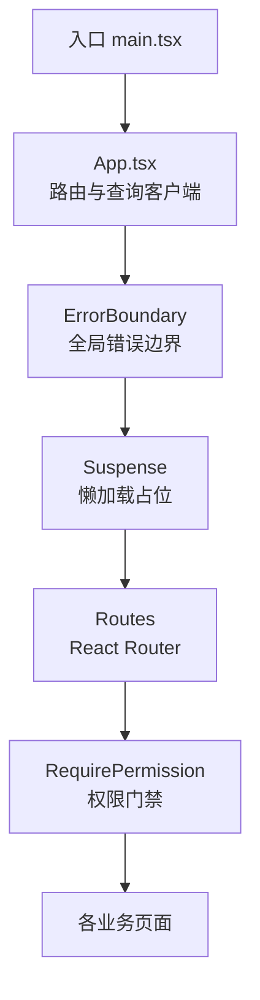
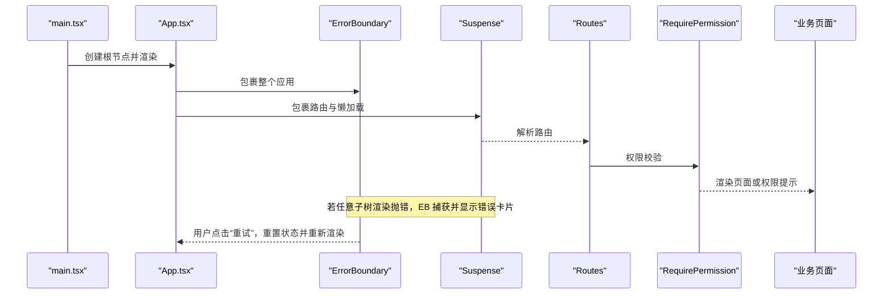
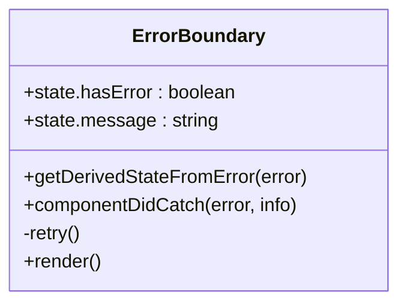
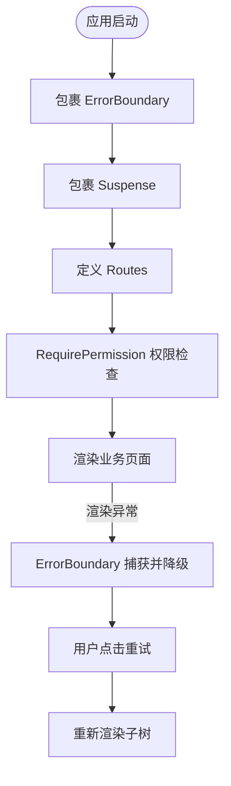
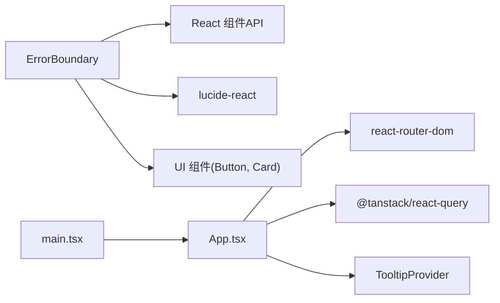

# 全局错误边界组件

<cite>
**本文引用的文件**   
- [error-boundary.tsx](file://web/src/components/layout/error-boundary.tsx)
- [App.tsx](file://web/src/App.tsx)
- [main.tsx](file://web/src/main.tsx)
- [require-permission.tsx](file://web/src/components/layout/require-permission.tsx)
- [card.tsx](file://web/src/components/ui/card.tsx)
- [button.tsx](file://web/src/components/ui/button.tsx)
- [utils.ts](file://web/src/lib/utils.ts)
</cite>

## 目录
1. [简介](#简介)
2. [项目结构](#项目结构)
3. [核心组件](#核心组件)
4. [架构总览](#架构总览)
5. [详细组件分析](#详细组件分析)
6. [依赖关系分析](#依赖关系分析)
7. [性能与可维护性](#性能与可维护性)
8. [故障排查指南](#故障排查指南)
9. [结论](#结论)

## 简介
本文件聚焦于前端“全局错误边界组件”的实现与使用，说明其职责、工作原理、在应用中的挂载位置、与路由懒加载和权限门禁的协作方式，以及常见问题的定位与优化建议。该组件用于捕获 React 子树渲染异常（含 lazy 路由模块链接失败），以友好的错误卡片替代白屏，并提供重试能力，提升用户体验与可恢复性。

## 项目结构
全局错误边界位于布局层，作为应用根组件树的顶层包裹，确保所有页面与子组件的渲染异常都能被统一捕获。

图表来源
- [main.tsx:1-11](file://web/src/main.tsx#L1-L11)
- [App.tsx:1-64](file://web/src/App.tsx#L1-L64)

章节来源
- [main.tsx:1-11](file://web/src/main.tsx#L1-L11)
- [App.tsx:1-64](file://web/src/App.tsx#L1-L64)

## 核心组件
- ErrorBoundary：类组件，负责捕获渲染期异常并渲染错误卡片，支持重试。
- App：应用根组件，提供 QueryClient、TooltipProvider、BrowserRouter，并在最外层包裹 ErrorBoundary 与 Suspense。
- RequirePermission：权限门禁组件，与错误边界风格一致，用于无权限时的友好提示。
- UI 基础组件：Card、Button 等，用于构建错误卡片与交互按钮。

章节来源
- [error-boundary.tsx:1-60](file://web/src/components/layout/error-boundary.tsx#L1-L60)
- [App.tsx:1-64](file://web/src/App.tsx#L1-L64)
- [require-permission.tsx:1-41](file://web/src/components/layout/require-permission.tsx#L1-L41)
- [card.tsx:1-79](file://web/src/components/ui/card.tsx#L1-L79)
- [button.tsx:1-56](file://web/src/components/ui/button.tsx#L1-L56)

## 架构总览
错误边界在应用启动时即生效，覆盖整个路由树与懒加载模块。当子树抛出渲染异常时，错误边界拦截并降级为错误卡片；用户点击“重试”可尝试恢复。

图表来源
- [main.tsx:1-11](file://web/src/main.tsx#L1-L11)
- [App.tsx:1-64](file://web/src/App.tsx#L1-L64)
- [error-boundary.tsx:1-60](file://web/src/components/layout/error-boundary.tsx#L1-L60)

## 详细组件分析

### ErrorBoundary 组件
- 职责
  - 捕获子树渲染期异常（包括 lazy 路由模块加载失败）。
  - 将异常信息转换为可读的错误卡片，避免整页白屏。
  - 提供“重试”操作，尝试恢复渲染。
- 关键实现要点
  - 使用 getDerivedStateFromError 更新 hasError 与 message。
  - componentDidCatch 输出原始错误与组件栈，便于开发期定位。
  - 重试逻辑通过 setState 清空错误状态，触发重新渲染。
- 样式与交互
  - 使用 Card + CardContent 构建卡片，居中展示。
  - 使用 Button 提供重试入口。
  - 错误消息超长时截断显示，title 保留完整内容。

图表来源
- [error-boundary.tsx:1-60](file://web/src/components/layout/error-boundary.tsx#L1-L60)

章节来源
- [error-boundary.tsx:1-60](file://web/src/components/layout/error-boundary.tsx#L1-L60)

### App 集成点
- 在应用根组件中引入并包裹 ErrorBoundary，确保所有路由与懒加载模块均受保护。
- 与 Suspense 配合，为懒加载模块提供加载态占位。
- 与 RequirePermission 组合，形成“权限门控 + 错误边界”的双重保障。

图表来源
- [App.tsx:1-64](file://web/src/App.tsx#L1-L64)
- [error-boundary.tsx:1-60](file://web/src/components/layout/error-boundary.tsx#L1-L60)

章节来源
- [App.tsx:1-64](file://web/src/App.tsx#L1-L64)

### RequirePermission 与错误边界的关系
- RequirePermission 用于权限不足时的友好提示，不跳转，仅渲染提示卡。
- 错误边界用于渲染异常时的兜底，两者互补：权限问题由 RequirePermission 处理，渲染异常由 ErrorBoundary 处理。
- 视觉风格保持一致，提升整体一致性体验。

章节来源
- [require-permission.tsx:1-41](file://web/src/components/layout/require-permission.tsx#L1-L41)

### UI 基础组件
- Card/CardContent：用于构建错误卡片容器与内容区域。
- Button：提供重试按钮，默认样式与主题一致。

章节来源
- [card.tsx:1-79](file://web/src/components/ui/card.tsx#L1-L79)
- [button.tsx:1-56](file://web/src/components/ui/button.tsx#L1-L56)

## 依赖关系分析
- 组件内依赖
  - ErrorBoundary 依赖 React 的 Component、ErrorInfo、ReactNode。
  - 依赖 lucide-react 的图标 TriangleAlert。
  - 依赖 UI 组件 Button、Card、CardContent。
- 应用级依赖
  - App 依赖 react-router-dom、@tanstack/react-query、TooltipProvider。
  - main.tsx 负责创建根节点并注入 StrictMode。

图表来源
- [error-boundary.tsx:1-60](file://web/src/components/layout/error-boundary.tsx#L1-L60)
- [App.tsx:1-64](file://web/src/App.tsx#L1-L64)
- [main.tsx:1-11](file://web/src/main.tsx#L1-L11)

章节来源
- [error-boundary.tsx:1-60](file://web/src/components/layout/error-boundary.tsx#L1-L60)
- [App.tsx:1-64](file://web/src/App.tsx#L1-L64)
- [main.tsx:1-11](file://web/src/main.tsx#L1-L11)

## 性能与可维护性
- 性能
  - 错误边界仅在异常发生时介入，正常路径零开销。
  - 重试操作仅重置本地状态，不会强制刷新页面，减少不必要的重渲染。
- 可维护性
  - 错误信息输出到控制台，便于开发与运维定位。
  - 错误卡片文案简洁明确，符合产品规范。
- 建议
  - 如需上报错误，可在 componentDidCatch 中接入监控服务，注意脱敏敏感信息。
  - 对频繁出现的错误进行专项修复，降低重试率。

[本节为通用指导，不直接分析具体文件]

## 故障排查指南
- 常见问题
  - 页面白屏：确认 ErrorBoundary 是否在最外层包裹应用。
  - 懒加载失败：检查路由模块路径是否正确，网络是否可达。
  - 权限提示：确认 RequirePermission 的 resource 与 action 配置正确。
- 定位方法
  - 查看控制台输出的错误信息与组件栈，快速定位异常组件。
  - 使用浏览器开发者工具检查网络请求与资源加载情况。
- 恢复手段
  - 点击“重试”按钮尝试恢复。
  - 清理缓存或重启应用，排除环境因素。

章节来源
- [error-boundary.tsx:1-60](file://web/src/components/layout/error-boundary.tsx#L1-L60)
- [App.tsx:1-64](file://web/src/App.tsx#L1-L64)

## 结论
全局错误边界组件为财务数据分析平台提供了稳定的渲染兜底能力，结合路由懒加载与权限门禁，构建了健壮的前端容错体系。通过统一的错误卡片与重试机制，显著提升了用户体验与可恢复性。建议在后续迭代中持续完善错误上报与监控，进一步提升问题定位效率与系统稳定性。

[本节为总结，不直接分析具体文件]