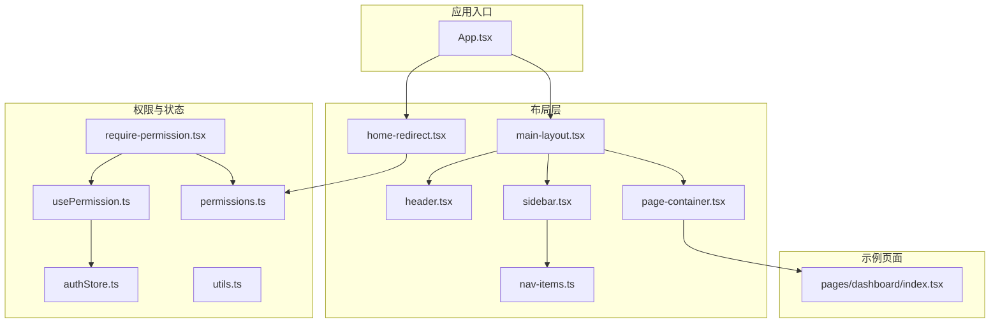
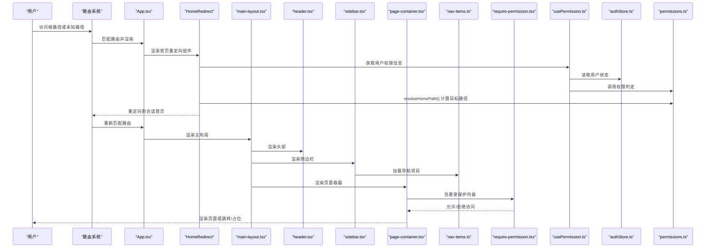
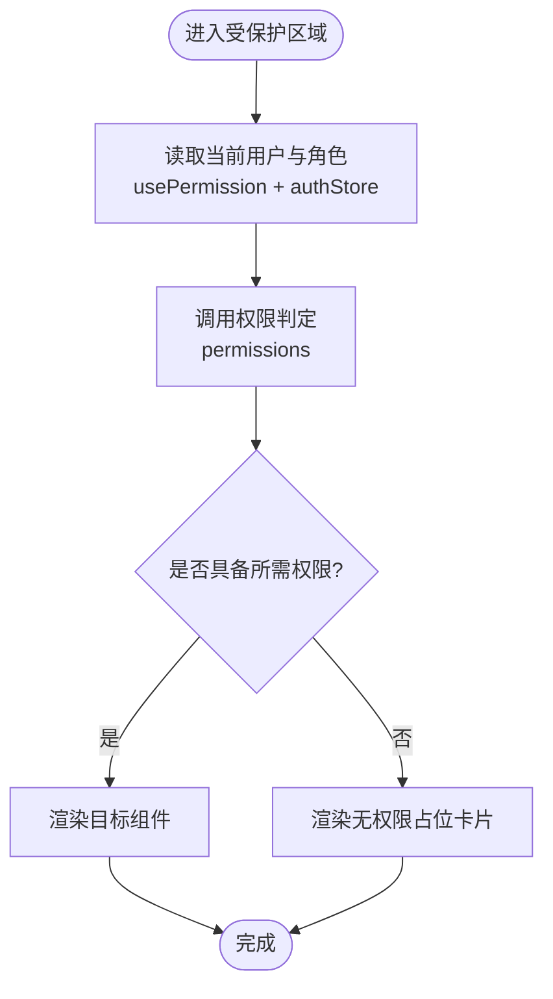
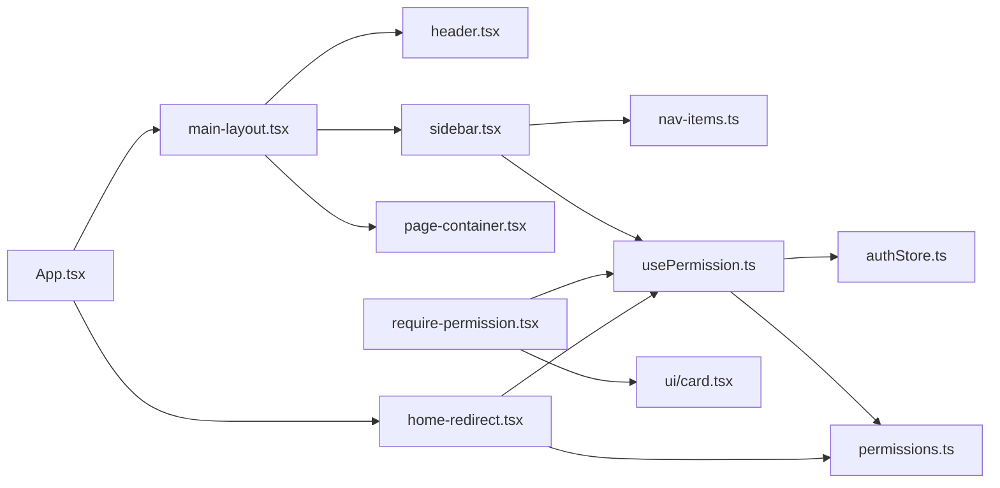

# 布局组件

<cite>
**本文引用的文件**   
- [main-layout.tsx](file://web/src/components/layout/main-layout.tsx)
- [header.tsx](file://web/src/components/layout/header.tsx)
- [page-container.tsx](file://web/src/components/layout/page-container.tsx)
- [sidebar.tsx](file://web/src/components/layout/sidebar.tsx)
- [nav-items.ts](file://web/src/components/layout/nav-items.ts)
- [require-permission.tsx](file://web/src/components/layout/require-permission.tsx)
- [home-redirect.tsx](file://web/src/components/layout/home-redirect.tsx)
- [usePermission.ts](file://web/src/hooks/usePermission.ts)
- [authStore.ts](file://web/src/stores/authStore.ts)
- [permissions.ts](file://web/src/lib/permissions.ts)
- [utils.ts](file://web/src/lib/utils.ts)
- [App.tsx](file://web/src/App.tsx)
- [index.tsx](file://web/src/pages/dashboard/index.tsx)
</cite>

## 更新摘要
**所做更改**
- 新增 home-redirect 组件，实现权限感知的首重定向功能
- 增强 page-container 组件的状态管理能力，支持粘性头部和滚动优化
- 完善权限系统与路由系统的集成，提供智能首页跳转逻辑
- 优化页面容器的交互体验，支持复杂筛选场景的固定头部显示

## 目录
1. [简介](#简介)
2. [项目结构](#项目结构)
3. [核心组件](#核心组件)
4. [架构总览](#架构总览)
5. [详细组件分析](#详细组件分析)
6. [侧边栏导航系统](#侧边栏导航系统)
7. [导航项目管理](#导航项目管理)
8. [依赖关系分析](#依赖关系分析)
9. [性能考虑](#性能考虑)
10. [故障排查指南](#故障排查指南)
11. [结论](#结论)
12. [附录](#附录)

## 简介
本文件面向pj3项目的页面布局与权限控制体系，系统性阐述 main-layout、header、sidebar、page-container 等布局组件的架构设计与实现原理，说明其层次结构与嵌套关系、响应式与自适应策略；深入解析 require-permission 权限控制组件的角色验证与访问控制逻辑；提供配置项与扩展点说明，并给出组合使用模式（侧边栏、导航栏、内容区域）以及与路由系统的集成方式和性能优化建议。

**更新** 本次更新重点反映了新增的 home-redirect 权限感知重定向组件和 page-container 的状态管理增强功能，进一步完善了权限系统与路由系统的集成机制。

## 项目结构
布局相关代码集中在 web/src/components/layout 目录下，配合 hooks、stores、lib 中的权限与状态能力，形成"布局容器 + 头部 + 侧边栏 + 页面容器 + 权限守卫 + 智能重定向"的组合式架构。典型页面通过 App 路由挂载到主布局中，再由 page-container 承载具体业务内容。



**图表来源**
- [App.tsx](file://web/src/App.tsx)
- [main-layout.tsx](file://web/src/components/layout/main-layout.tsx)
- [header.tsx](file://web/src/components/layout/header.tsx)
- [sidebar.tsx](file://web/src/components/layout/sidebar.tsx)
- [page-container.tsx](file://web/src/components/layout/page-container.tsx)
- [nav-items.ts](file://web/src/components/layout/nav-items.ts)
- [home-redirect.tsx](file://web/src/components/layout/home-redirect.tsx)
- [require-permission.tsx](file://web/src/components/layout/require-permission.tsx)
- [usePermission.ts](file://web/src/hooks/usePermission.ts)
- [authStore.ts](file://web/src/stores/authStore.ts)
- [permissions.ts](file://web/src/lib/permissions.ts)
- [utils.ts](file://web/src/lib/utils.ts)
- [index.tsx](file://web/src/pages/dashboard/index.tsx)

**章节来源**
- [App.tsx](file://web/src/App.tsx)
- [main-layout.tsx](file://web/src/components/layout/main-layout.tsx)
- [header.tsx](file://web/src/components/layout/header.tsx)
- [sidebar.tsx](file://web/src/components/layout/sidebar.tsx)
- [page-container.tsx](file://web/src/components/layout/page-container.tsx)
- [nav-items.ts](file://web/src/components/layout/nav-items.ts)
- [home-redirect.tsx](file://web/src/components/layout/home-redirect.tsx)
- [require-permission.tsx](file://web/src/components/layout/require-permission.tsx)
- [usePermission.ts](file://web/src/hooks/usePermission.ts)
- [authStore.ts](file://web/src/stores/authStore.ts)
- [permissions.ts](file://web/src/lib/permissions.ts)
- [utils.ts](file://web/src/lib/utils.ts)
- [index.tsx](file://web/src/pages/dashboard/index.tsx)

## 核心组件
- **main-layout**：应用级主布局容器，负责整体框架（顶部导航、侧边栏、内容区）的组织与响应式适配，通常作为路由渲染的根容器。
- **header**：顶部导航/工具栏组件，展示品牌、全局搜索、用户菜单等，支持移动端折叠与可配置项。
- **sidebar**：全新设计的侧边栏导航组件，提供多级菜单、权限控制、响应式适配等功能，支持桌面端下拉面板和移动端手风琴模式。
- **page-container**：页面内容容器，提供统一的页面内边距、标题区、操作区、内容区划分，新增粘性头部支持和增强的状态管理能力。
- **require-permission**：权限守卫组件，基于角色/权限进行访问控制，未授权时执行重定向或降级渲染。
- **home-redirect**：权限感知首页重定向组件，根据用户权限自动跳转到合适的首页模块。
- **nav-items**：导航项目管理系统，集中管理所有导航项的配置、权限控制和路由映射。

**更新** 新增了 home-redirect 权限感知重定向组件，完善了 page-container 的状态管理功能，特别是 stickyHeader 属性支持复杂筛选场景的固定头部显示。

**章节来源**
- [main-layout.tsx](file://web/src/components/layout/main-layout.tsx)
- [header.tsx](file://web/src/components/layout/header.tsx)
- [sidebar.tsx](file://web/src/components/layout/sidebar.tsx)
- [page-container.tsx](file://web/src/components/layout/page-container.tsx)
- [home-redirect.tsx](file://web/src/components/layout/home-redirect.tsx)
- [nav-items.ts](file://web/src/components/layout/nav-items.ts)
- [require-permission.tsx](file://web/src/components/layout/require-permission.tsx)

## 架构总览
布局体系采用"容器-子组件"分层：App 将路由渲染到 main-layout，main-layout 组合 header、sidebar 与 page-container，page-container 再承载具体页面。权限控制以高阶组件形式包裹需要鉴权的页面或区块，统一在入口处校验角色与权限。新增的 home-redirect 组件实现了智能的首页重定向逻辑。



**图表来源**
- [App.tsx](file://web/src/App.tsx)
- [home-redirect.tsx](file://web/src/components/layout/home-redirect.tsx)
- [main-layout.tsx](file://web/src/components/layout/main-layout.tsx)
- [header.tsx](file://web/src/components/layout/header.tsx)
- [sidebar.tsx](file://web/src/components/layout/sidebar.tsx)
- [page-container.tsx](file://web/src/components/layout/page-container.tsx)
- [nav-items.ts](file://web/src/components/layout/nav-items.ts)
- [require-permission.tsx](file://web/src/components/layout/require-permission.tsx)
- [usePermission.ts](file://web/src/hooks/usePermission.ts)
- [authStore.ts](file://web/src/stores/authStore.ts)
- [permissions.ts](file://web/src/lib/permissions.ts)

## 详细组件分析

### main-layout 主布局
- **职责**
  - 组织全局布局骨架（头部、侧边栏、内容区）。
  - 管理响应式行为（如移动端侧边栏抽屉化）。
  - 为子页面提供一致的间距、背景与滚动容器。
- **关键设计**
  - 通过 props 注入侧边栏与头部，保持高内聚低耦合。
  - 内部维护布局状态（如侧边栏展开/收起），并提供回调供外部更新。
  - 结合 Tailwind 断点实现多端适配。
  - 使用 localStorage 持久化侧边栏折叠状态。
- **扩展点**
  - 自定义侧边栏插槽、头部插槽、页脚插槽。
  - 主题与密度（紧凑/宽松）可通过配置切换。
- **与路由集成**
  - 作为路由渲染根节点，确保所有页面共享同一布局。
  - 路由切换时自动关闭移动端抽屉。
- **性能要点**
  - 避免在每次渲染中重建侧边栏/头部实例，必要时 memo 化。
  - 大列表或复杂侧边栏按需加载。

**更新** 主布局组件增强了与侧边栏的集成，支持折叠状态的本地存储和移动端抽屉的自动关闭功能。

**章节来源**
- [main-layout.tsx](file://web/src/components/layout/main-layout.tsx)

### header 头部导航
- **职责**
  - 展示全局导航、搜索、通知、用户菜单等。
  - 在移动端提供折叠菜单与返回按钮。
  - 集成财年选择器，影响看板/指标/数据浏览的期间候选。
- **关键设计**
  - 通过 props 暴露可配置项（如 logo、菜单项、用户信息）。
  - 与 authStore 联动显示登录态与用户信息。
  - 集成 periodStore 管理财年选择状态。
- **响应式**
  - 小屏下隐藏次要入口，保留核心导航与用户头像。
  - 移动端显示汉堡菜单按钮触发侧边栏抽屉。
- **交互**
  - 下拉菜单、搜索框聚焦、消息角标等。
  - 用户头像下拉菜单包含个人资料和退出登录选项。

**更新** 头部组件集成了财年选择功能，并与新的设计系统保持一致的视觉风格。

**章节来源**
- [header.tsx](file://web/src/components/layout/header.tsx)
- [authStore.ts](file://web/src/stores/authStore.ts)

### sidebar 侧边栏导航
- **职责**
  - 提供多级导航菜单，支持动态加载和权限控制。
  - 管理导航项的展开/收起状态和高亮显示。
  - 响应式适配，桌面端固定显示，移动端自动切换为抽屉模式。
  - 实现URL激活高亮和智能菜单展开。
- **关键设计**
  - 基于 nav-items.ts 配置的导航项目进行渲染。
  - 支持图标、标签、徽章等多种显示样式。
  - 内置权限过滤，根据用户角色动态显示菜单项。
  - 三种渲染模式：桌面展开态内联手风琴、桌面折叠态下拉面板、移动端手风琴模式。
- **交互特性**
  - 点击导航项进行路由跳转。
  - 支持多级菜单的展开收起动画。
  - 当前激活项的高亮显示，基于URL路径精确匹配。
  - 桌面折叠态下，一级菜单项点击弹出固定定位的面板。
  - 移动端抽屉模式下，有子项的菜单项点击展开/收起内联二级/三级列表。
- **性能优化**
  - 懒加载深层菜单项。
  - 虚拟滚动支持大量导航项。
  - 使用 useMemo 优化权限过滤计算。
  - 路由变化时自动管理展开状态。

**更新** 这是完全重新设计的侧边栏导航组件，提供了完整的多级菜单管理能力，支持桌面下拉面板和移动端手风琴模式，实现了URL激活高亮和响应式行为。

**章节来源**
- [sidebar.tsx](file://web/src/components/layout/sidebar.tsx)
- [nav-items.ts](file://web/src/components/layout/nav-items.ts)

### page-container 页面容器
- **职责**
  - 统一页面内边距、标题区、副标题、操作按钮区与内容区。
  - 提供页面级加载骨架与错误边界占位。
  - 支持粘性头部显示，适用于复杂筛选场景。
- **关键设计**
  - 通过 children 注入业务内容，保证页面结构一致性。
  - 支持可选的顶部操作区与面包屑。
  - 使用 React.forwardRef 提供更好的类型支持和性能。
  - 新增 stickyHeader 属性，支持头部随滚动固定在可视区顶部。
- **与布局协作**
  - 由 main-layout 渲染，承接路由页面内容。
- **扩展点**
  - 自定义标题样式、操作区布局、内容区最大宽度等。
  - 粘性头部支持 backdrop-blur 和阴影效果。

**更新** page-container 组件新增了 stickyHeader 属性，支持粘性头部显示，适用于看板等复杂筛选场景，提升了用户体验。

**章节来源**
- [page-container.tsx](file://web/src/components/layout/page-container.tsx)

### home-redirect 权限感知重定向
- **职责**
  - 实现权限感知的首页重定向逻辑。
  - 根据用户权限自动跳转到最合适的首页模块。
  - 处理根路径、未知路径和登录成功后的默认落地。
- **关键设计**
  - 使用 usePermission hook 获取用户权限集合。
  - 调用 resolveHomePath 函数根据 HOME_ROUTE_PRIORITY 计算目标路径。
  - 无匹配权限时自动跳转到 /no-access 提示页面。
  - 使用 Navigate 组件实现无闪烁的重定向。
- **权限优先级**
  - dashboard:view → /dashboard
  - indicators:view → /indicators  
  - reports:view → /reports
  - transactions:view → /transactions
  - inventory:view → /inventory
  - data:browse:view → /data
  - admin:users:view → /admin/users
- **与路由集成**
  - 在 App.tsx 中作为根路径和未知路径的处理组件。
  - 与 RequirePermission 组件协同工作，确保权限安全。

**更新** 这是新增的核心组件，实现了智能化的首页重定向功能，大幅提升了用户登录后的初始体验。

**章节来源**
- [home-redirect.tsx](file://web/src/components/layout/home-redirect.tsx)
- [App.tsx](file://web/src/App.tsx)
- [permissions.ts](file://web/src/lib/permissions.ts)

### require-permission 权限守卫
- **职责**
  - 在渲染前校验当前用户是否具备所需角色/权限。
  - 未通过时执行重定向或渲染无权限占位。
- **关键流程**
  - 从 usePermission 获取当前用户与权限集合。
  - 调用 permissions 中的判定函数进行匹配。
  - 根据结果放行或拦截。
- **与状态集成**
  - 依赖 authStore 的用户信息与登录态。
- **常见用法**
  - 包裹页面组件或局部区块，细粒度控制可见性。



**图表来源**
- [require-permission.tsx](file://web/src/components/layout/require-permission.tsx)
- [usePermission.ts](file://web/src/hooks/usePermission.ts)
- [authStore.ts](file://web/src/stores/authStore.ts)
- [permissions.ts](file://web/src/lib/permissions.ts)

**章节来源**
- [require-permission.tsx](file://web/src/components/layout/require-permission.tsx)
- [usePermission.ts](file://web/src/hooks/usePermission.ts)
- [authStore.ts](file://web/src/stores/authStore.ts)
- [permissions.ts](file://web/src/lib/permissions.ts)

## 侧边栏导航系统

### 侧边栏组件架构
侧边栏组件是整个布局系统的核心导航部分，提供了完整的多级菜单管理和权限控制功能。

**主要特性：**
- **多级菜单支持**：支持无限层级的菜单嵌套结构，最多支持三级菜单
- **权限控制**：基于用户角色的动态菜单显示，仅展示当前角色有 view 权限的模块入口
- **响应式设计**：桌面端固定显示，移动端自动切换为抽屉模式
- **状态管理**：维护菜单展开/收起状态和高亮显示，支持单开模式
- **性能优化**：懒加载和虚拟滚动支持，使用 useMemo 优化计算
- **URL激活高亮**：基于当前URL路径精确匹配，实现智能高亮显示

**新增功能：**
- **桌面下拉面板**：折叠态下点击一级菜单项弹出固定定位的面板
- **移动端手风琴**：抽屉模式下有子项的菜单项点击展开/收起内联列表
- **智能展开**：路由变化时自动展开对应的父级菜单项
- **键盘支持**：支持 Escape 键关闭下拉面板

**章节来源**
- [sidebar.tsx](file://web/src/components/layout/sidebar.tsx)

### 导航项目管理系统
nav-items.ts 文件集中管理所有导航项目的配置，提供了统一的导航数据结构和管理接口。

**核心功能：**
- **配置化管理**：所有导航项集中定义，便于维护和扩展
- **权限映射**：导航项与权限标识的关联配置，每个菜单项都有对应的 resource 字段
- **路由集成**：导航项与路由路径的自动映射，支持查询参数
- **动态加载**：支持根据用户权限动态生成菜单
- **层级结构**：支持一级、二级、三级菜单的嵌套结构

**数据结构设计：**
```typescript
interface NavChild {
  path: string;           // 菜单项完整路径（含 ?tab= / &sub= 参数）
  label: string;          // 菜单显示文本
  children?: NavChild[];  // 三级子标签（当前仅「数据管理 → 维度/科目体系」使用）
}

interface NavItem {
  path: string;           // 一级菜单路径
  label: string;          // 一级菜单显示文本
  icon: LucideIcon;       // 菜单图标
  resource: string;       // 权限资源编码
  children?: NavChild[];  // 二级/三级子菜单
}
```

**权限控制机制：**
- 导航项与权限标识一一对应，如 `dashboard:view`、`indicators:view`
- 根据用户角色动态过滤菜单，仅显示有权限的菜单项
- 支持继承和组合权限规则

**章节来源**
- [nav-items.ts](file://web/src/components/layout/nav-items.ts)

## 导航项目管理

### 导航配置结构
导航项目管理系统采用树形结构设计，支持复杂的层级关系和灵活的配置选项。

**配置项说明：**
- **基础属性**：path、label、icon 等基本信息
- **显示控制**：children 数组实现多级菜单结构
- **权限设置**：resource 字段控制访问权限，格式为 `module:action`
- **层级关系**：children 数组实现多级菜单，支持三级嵌套

**权限控制机制：**
- 导航项与权限标识一一对应，如 `data:browse:view`、`admin:users:view`
- 根据用户角色动态过滤菜单，确保权限安全
- 支持继承和组合权限规则

**章节来源**
- [nav-items.ts](file://web/src/components/layout/nav-items.ts)

### 路由集成方案
导航系统与路由系统深度集成，实现了自动化的路由管理和导航同步。

**集成特性：**
- **自动路由注册**：导航项的路径与路由系统自动对应
- **路径匹配**：支持参数化和通配符路由，如 `/transactions?tab=details`
- **状态同步**：当前路由与导航高亮的自动同步，基于 URL 路径精确匹配
- **权限路由**：基于权限的路由保护和重定向
- **智能展开**：路由变化时自动展开对应的父级菜单项

**章节来源**
- [main-layout.tsx](file://web/src/components/layout/main-layout.tsx)
- [nav-items.ts](file://web/src/components/layout/nav-items.ts)

## 依赖关系分析
- **组件耦合**
  - main-layout 依赖 header、sidebar 与 page-container，三者相对独立，便于替换与复用。
  - sidebar 依赖 nav-items 进行导航数据管理，依赖 usePermission 进行权限控制。
  - require-permission 依赖 usePermission、authStore、permissions，职责单一且可测试。
  - home-redirect 依赖 usePermission 和 permissions，实现权限感知的重定向逻辑。
- **外部依赖**
  - 路由系统（react-router-dom）用于挂载 main-layout 和导航跳转。
  - UI 样式库（Tailwind CSS）断点与原子类。
  - 状态管理（zustand）用于用户信息和权限状态。
  - 图标库（lucide-react）提供菜单图标。
- **潜在循环**
  - 布局与页面之间应避免反向导入，推荐通过 props 注入。



**图表来源**
- [main-layout.tsx](file://web/src/components/layout/main-layout.tsx)
- [header.tsx](file://web/src/components/layout/header.tsx)
- [sidebar.tsx](file://web/src/components/layout/sidebar.tsx)
- [page-container.tsx](file://web/src/components/layout/page-container.tsx)
- [nav-items.ts](file://web/src/components/layout/nav-items.ts)
- [home-redirect.tsx](file://web/src/components/layout/home-redirect.tsx)
- [require-permission.tsx](file://web/src/components/layout/require-permission.tsx)
- [usePermission.ts](file://web/src/hooks/usePermission.ts)
- [authStore.ts](file://web/src/stores/authStore.ts)
- [permissions.ts](file://web/src/lib/permissions.ts)
- [App.tsx](file://web/src/App.tsx)

**章节来源**
- [main-layout.tsx](file://web/src/components/layout/main-layout.tsx)
- [header.tsx](file://web/src/components/layout/header.tsx)
- [sidebar.tsx](file://web/src/components/layout/sidebar.tsx)
- [page-container.tsx](file://web/src/components/layout/page-container.tsx)
- [nav-items.ts](file://web/src/components/layout/nav-items.ts)
- [home-redirect.tsx](file://web/src/components/layout/home-redirect.tsx)
- [require-permission.tsx](file://web/src/components/layout/require-permission.tsx)
- [usePermission.ts](file://web/src/hooks/usePermission.ts)
- [authStore.ts](file://web/src/stores/authStore.ts)
- [permissions.ts](file://web/src/lib/permissions.ts)
- [App.tsx](file://web/src/App.tsx)

## 性能考虑
- **渲染优化**
  - 对 header、sidebar、page-container 使用记忆化（memo）减少重复渲染。
  - 大型侧边栏或菜单项懒加载与虚拟滚动。
  - 导航项目按需加载，避免一次性渲染所有菜单项。
  - 使用 useMemo 优化权限过滤和计算密集型操作。
  - home-redirect 组件仅在路由变化时执行权限计算。
- **状态同步**
  - 将用户信息、权限集合提升到 store，避免频繁跨层级传递。
  - 侧边栏状态本地化管理，减少不必要的重渲染。
  - 路由变化时自动管理展开状态，避免手动同步。
  - page-container 的 stickyHeader 状态通过 CSS 类名控制，避免 JavaScript 状态同步开销。
- **路由级优化**
  - 对非首屏页面使用路由级懒加载，降低初始包体积。
  - 导航路由预加载和缓存策略。
  - HomeRedirect 组件使用 replace 模式重定向，避免历史记录堆积。
- **样式与主题**
  - 利用 Tailwind 断点与容器查询提升响应式效率，避免过度重排。
  - CSS-in-JS 方案减少样式冲突和重复计算。
  - stickyHeader 使用 backdrop-blur 和半透明背景，提升视觉效果。
- **权限校验**
  - 将权限判定结果缓存，避免重复计算。
  - 导航项权限预过滤，减少运行时判断开销。
  - resolveHomePath 函数使用简单的线性查找，适合有限的优先级列表。
- **事件处理优化**
  - 合理使用 useEffect 清理事件监听器，避免内存泄漏。
  - 使用防抖和节流优化高频事件处理。

**更新** 新增了 home-redirect 组件的性能优化策略，包括路由级懒加载和 replace 模式重定向，以及 page-container 的 stickyHeader 状态优化。

## 故障排查指南
- **权限无效或未生效**
  - 检查 authStore 是否正确初始化用户与角色。
  - 确认 permissions 判定逻辑覆盖所有必要场景。
  - 查看 require-permission 的 fallback 行为是否符合预期。
  - 验证导航项的 resource 字段是否与权限矩阵匹配。
  - 检查 HOME_ROUTE_PRIORITY 配置是否正确。
- **布局错乱或重叠**
  - 检查 main-layout 的响应式断点与容器高度设置。
  - 确认 page-container 的 padding/margin 是否与全局样式冲突。
  - 验证 sidebar 的宽度设置和 z-index 层级。
  - 检查 stickyHeader 的 z-index 值是否与其他元素冲突。
- **移动端体验异常**
  - 验证 header 的折叠菜单与 main-layout 的侧边栏抽屉开关逻辑。
  - 检查 sidebar 的移动端适配样式和触摸事件处理。
  - 确认移动端抽屉的遮罩层和关闭逻辑。
- **导航问题**
  - 确认 nav-items.ts 中的路由配置正确性。
  - 检查权限配置与用户角色的匹配关系。
  - 验证导航项的动态加载和缓存机制。
  - 检查URL激活高亮的匹配逻辑。
- **路由与布局不同步**
  - 确认 App 中将路由渲染到 main-layout 的挂载点正确。
  - 检查导航高亮状态与当前路由的同步逻辑。
  - 验证路由变化时的展开状态管理。
- **样式问题**
  - 检查新的设计系统规范是否正确应用。
  - 验证 Tailwind CSS配置和设计令牌的使用。
  - 确认响应式断点和间距系统的一致性。
  - 检查 stickyHeader 的 backdrop-blur 效果是否正常。
- **侧边栏特定问题**
  - 检查桌面下拉面板的定位计算和显示逻辑。
  - 验证移动端手风琴模式的展开/收起动画。
  - 确认三级菜单的嵌套结构和显示逻辑。
- **首页重定向问题**
  - 检查 HomeRedirect 组件是否正确挂载到根路径和未知路径。
  - 验证 resolveHomePath 函数的权限匹配逻辑。
  - 确认 HOME_ROUTE_PRIORITY 配置与实际权限一致。
  - 检查无权限时的 /no-access 页面是否正常显示。

**更新** 新增了首页重定向相关的故障排查指导，包括 HomeRedirect 组件和 resolveHomePath 函数的常见问题排查。

**章节来源**
- [require-permission.tsx](file://web/src/components/layout/require-permission.tsx)
- [usePermission.ts](file://web/src/hooks/usePermission.ts)
- [authStore.ts](file://web/src/stores/authStore.ts)
- [permissions.ts](file://web/src/lib/permissions.ts)
- [home-redirect.tsx](file://web/src/components/layout/home-redirect.tsx)
- [main-layout.tsx](file://web/src/components/layout/main-layout.tsx)
- [header.tsx](file://web/src/components/layout/header.tsx)
- [sidebar.tsx](file://web/src/components/layout/sidebar.tsx)
- [page-container.tsx](file://web/src/components/layout/page-container.tsx)
- [nav-items.ts](file://web/src/components/layout/nav-items.ts)
- [App.tsx](file://web/src/App.tsx)

## 结论
本布局体系以 main-layout 为核心，组合 header、sidebar 与 page-container 构建一致的页面骨架，并通过 require-permission 实现细粒度的访问控制。完全重新设计的侧边栏导航系统提供了多级折叠菜单、桌面下拉面板和移动端手风琴模式，实现了URL激活高亮和响应式行为，大幅提升了布局的可扩展性和可维护性。新增的 home-redirect 组件实现了智能的权限感知首页重定向，完善了权限系统与路由系统的集成。该方案具备良好的可扩展性与可维护性，适合中后台与数据密集型应用的快速迭代。建议在后续版本中持续完善权限模型、侧边栏配置化与性能监控指标。

**更新** 本次更新完善了布局组件的完整性和功能性，特别是新增的 home-redirect 权限感知重定向组件和 page-container 的状态管理增强，为复杂的企业级应用提供了强大的布局基础设施和一致的跨设备用户体验。

## 附录
- **配置项建议**
  - main-layout：侧边栏默认展开、主题模式、内容区最大宽度、响应式断点配置、localStorage持久化。
  - header：Logo、菜单项、用户信息源、通知开关、移动端适配设置、财年选择器配置。
  - sidebar：默认展开状态、移动端抽屉模式、菜单收缩行为、权限配置、URL激活高亮设置。
  - page-container：标题区显隐、操作区显隐、内容区对齐方式、间距配置、stickyHeader粘性头部。
  - require-permission：默认无权限提示文案、重定向目标路径、降级渲染策略。
  - home-redirect：HOME_ROUTE_PRIORITY优先级配置、无权限兜底路径、重定向模式。
  - nav-items：权限映射表、路由前缀配置、动态加载策略、菜单层级配置、图标资源配置。
- **最佳实践**
  - 将页面级布局与业务解耦，优先复用 page-container。
  - 权限判定尽量集中到 permissions 模块，便于审计与回归。
  - 对复杂布局组件编写单元测试与视觉回归用例。
  - 导航项配置集中管理，避免硬编码路由和权限。
  - 合理使用懒加载和虚拟滚动优化大型导航的性能。
  - 充分利用Tailwind CSS的设计令牌和响应式特性。
  - 遵循新的设计系统规范，确保视觉一致性和可访问性。
  - 实现URL激活高亮时注意路径匹配的精确性。
  - 优化事件处理和状态同步，避免不必要的重渲染。
  - 确保移动端和桌面端的交互体验一致性。
  - 使用 stickyHeader 属性优化复杂筛选页面的用户体验。
  - 合理配置 HOME_ROUTE_PRIORITY 确保用户登录后看到合适的首页。
  - 在 App.tsx 中正确使用 HomeRedirect 处理根路径和未知路径。

**更新** 新增了 home-redirect 组件的配置建议和最佳实践，强调了 stickyHeader 属性的使用方法和权限感知首页重定向的重要性。